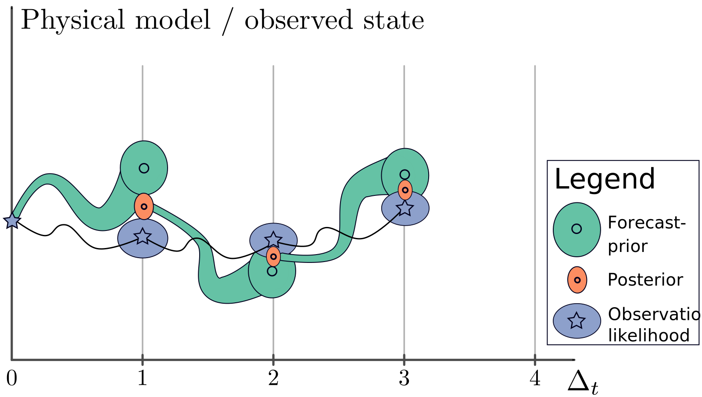
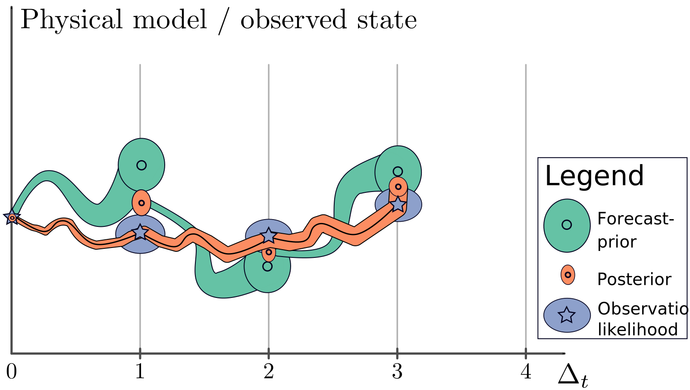
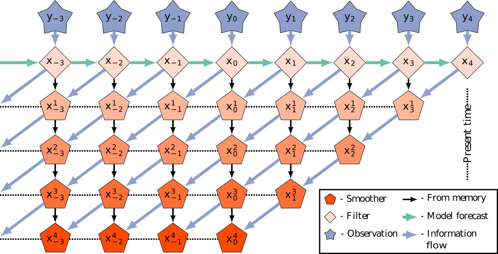
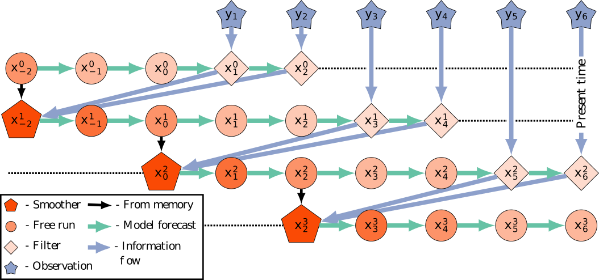
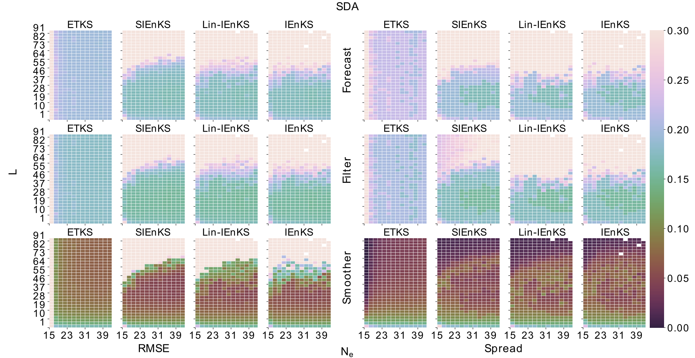
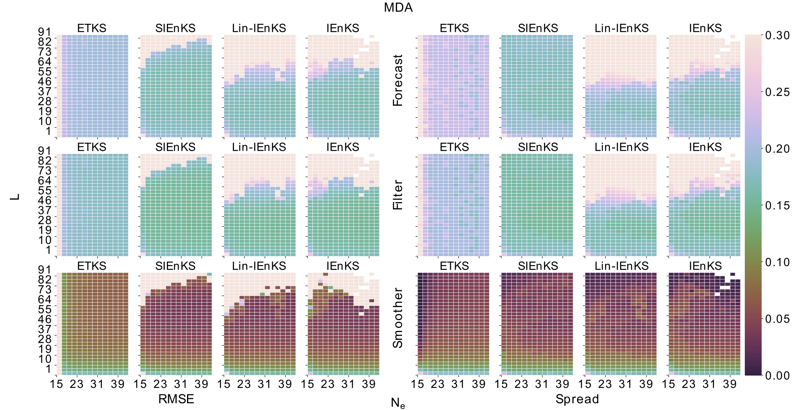
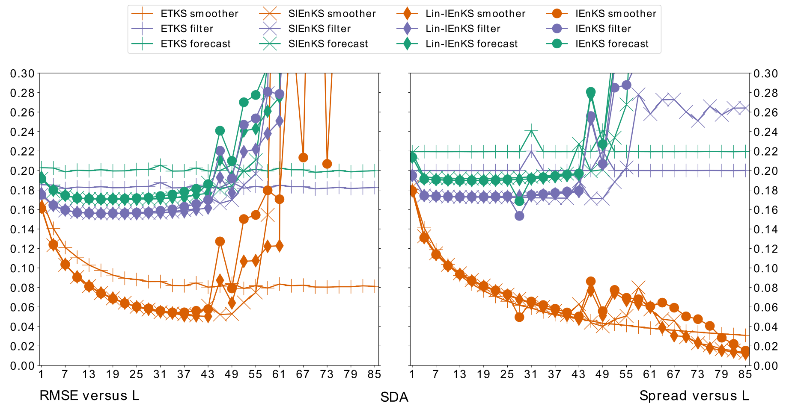
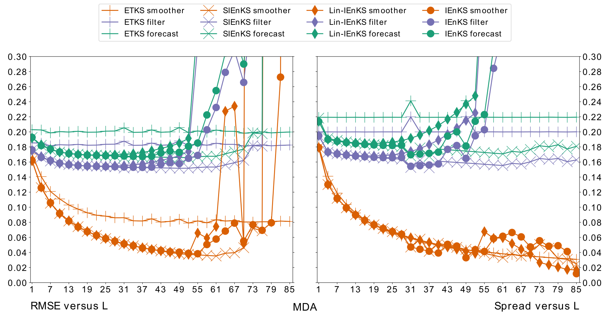

A Bayesian approach to data assimilation
========================================================
autosize: true
incremental: true
width: 1920
height: 1080

<h3>Colin Grudzien</h3>
<h4>Assistant Professor of Statistics</h4>

Presented at the Joint ICTP-IUGG Workshop on Data Assimilation and Inverse Problems in Geophysical Sciences

19 October, 2021

========================================================

<h2>Outline</h2>
<ul>
  <li> The following topics will be covered in this lecture</li>
  <ul>
    <li> Observation-analysis-forecast cycles</li>
    <li> Hidden Markov models and Bayesian analysis</li>
    <li> Bayesian maximum-a-posteriori (MAP) analysis in Gaussian models </li>
    <li> The ensemble Kalman filter and smoother (EnKF / EnKS)</li>
    <li> The 4D cost function and VAR approaches</li>
    <li> Sequential EnVAR estimators in the EnKF analysis:</li>
    <ul>
      <li> the iterative ensemble Kalman smoother (IEnKS)</li>
      <li> the single-iteration ensemble Kalman smoother (SIEnKS)</li>
    </ul>
  </ul>
</ul>

========================================================
## Motivation

<ul>
  <li> In applications such as <b>short-range weather prediction</b>, data assimilation provides a means to <strong>sequentially and recursively update forecasts</strong> with newly incoming information.</li>
  <li>The <b>Bayesian approach to DA</b> has become widely adopted because it provides a <strong>unified treatment of the tools from statistical estimation, nonlinear optimization and machine learning</strong> for handling such a problem.</li>
  <li>Let's suppose that the <b style="color:#1b9e77">dynamical physical states</b> can be written in a vector, $\pmb{x}_k \in \mathbb{R}^{N_x}$, where $k$ corresponds to some time $t_k$.</li>
  <li>Abstractly, we will represent the <strong>time-evolution</strong> of these states with the <b style="color:#1b9e77">nonlinear map $\mathcal{M}$</b>,
  $$\begin{align}\\
  \pmb{x}_k = \mathcal{M}_{k} \left(\pmb{x}_{k-1}, \boldsymbol{\lambda}\right) + \boldsymbol{\eta}_k
  \end{align}$$
  where</li>
  <ul>
    <li>$\pmb{x}_{k-1}$ is the <b>vector of physical states</b> at an <strong>earlier time</strong> $t_{k-1}$;</li>
    <li>$\boldsymbol{\lambda}$ is a vector of <b>uncertain physical parameters</b> on which the <strong>time evolution depends</strong>;</li>
    <li>$\boldsymbol{\eta}_k$ is an <b>additive, stochastic noise</b> term, representing <strong>errors in our model for the physical process</strong>.</li>
  </ul>
  <li>We will <b style="color:#d95f02">estimate the random vector</b> ${\color{#d95f02} {\pmb{x}_k } }$ with a prior distribution on $\left(\pmb{x}_{k-1}, \boldsymbol{\lambda}\right)$ and knowledge of $\mathcal{M}_{k}$ and knowledge of how $\boldsymbol{\eta}_k$ is distributed.</li>
 <li>At time $t_{k-1}$, we will make a <b style="color:#1b9e77">forecast for the distribution of $\pmb{x}_k$</b> with our prior knowledge, including the physics-based model.</li>  
  <li>For the rest of this lecture, we will restrict to the case that $\boldsymbol{\lambda}$ is a known constant, and the forecast model is perfect,
  $$\begin{align}
  \pmb{x}_k = \mathcal{M}_{k} \left(\pmb{x}_{k-1}\right),
  \end{align}$$
  for simplicity.</li>
</ul>

========================================================
## Motivation

  
<ul>
  <li>Suppose that we are also given <b style="color:color:#7570b3">real-world observations</b> ${\color{#7570b3} {\pmb{y}_k\in\mathbb{R}^{N_y}} }$ related to the physical states by,
  $${\color{#7570b3} { \pmb{y}_k = \mathcal{H}_k \left(\pmb{x}_k\right) + \boldsymbol{\epsilon}_k } }$$
  where</li>
  <ul>
    <li>${\color{#7570b3} {\mathcal{H}_k:\mathbb{R}^{N_x} \rightarrow \mathbb{R}^{N_y} } }$ is a nonlinear map relating the <b style="color:#d95f02">states we wish to estimate $\pmb{x}_k$</b> to the <b style="color:#7570b3">values that are observed</b> ${\color{#7570b3} { \pmb{y}_k} }$.</li>
    <ul>
      <li>Typically $N_y \ll N_x$ so this is information is sparse and observations are not $1:1$ with the unobserved states.</li>
    </ul>
    <li>$\boldsymbol{\epsilon}_k$ is an <b>additive, stochastic noise</b> term representing <strong>errors in the measurements</strong>.</li>
  </ul>
  <li>Therefore, at time $t_k$ we will have a <b style="color:#1b9e77">forecast distribution</b> for the states $\pmb{x}_k$  <strong>generated by our prior on $\pmb{x}_{k-1}$ and our physics-based model $\mathcal{M}$</strong>.</li>
  <li>We will also have an <b style="color:#7570b3">observation $\pmb{y}_k$</b> with uncertainty.</li>
  <li>We wish to find a <b style="color:#d95f02">posterior distribution for $\pmb{x}_k$</b> <b style="color:#7570b3">conditioned on $\pmb{y}_k$</b>.</li>
</ul> 

========================================================
## Observation-analysis-forecast cycle

 

<ul>
  <li>Recursive estimation of the distribution for $\pmb{x}_k$ conditional  on $\pmb{y}_k$ can be described as an:</li>
  <ol>
    <li>observation</li>
    <li>analysis</li>
    <li>forecast</li>
  </ol>
  <li>cycle.</li>
  <li>We assume that we have an initial forecast-prior for the physics-based numerical model state.</li>
</ul>

<ul>
  <li>Using the forecast-prior and the likelihood,</li>
  <ul>
    <li>we estimate the <b>Bayesian update</b> of the prior to the posterior</li>
    <li>conditioned on the observation.</li>
  </ul>
</ul>

========================================================
### Smoothing

 

<ul>
  <li>Recursive estimates of the <b>current state</b> can be performed in this fashion, but a related question regards the <strong>past states</strong>.</li>
  <li><b>New observations from the future</b> gives information about the model states at <strong>past times</strong>.</li>
  <li>This produces a retrospective posterior estimate for the past states.</li>
    <li><strong>Recursive estimation of the present state</strong> is known as <b>filtering</b>.</li>
  <li><strong>Conditional estimation of a past state given future observations</strong> is known as <b>smoothing</b>.</li>
</ul>

<ul>
  <li>Note that the <b>filtering density for the current time</b> is actually just a <strong>marginal of this joint posterior over all states in the DAW</strong>
  $$\begin{align}
  p(\pmb{x}_3 \vert \pmb{y}_3, \pmb{y}_2, \pmb{y}_1) = \int \int p(\pmb{x}_3, \pmb{x}_2, \pmb{x}_1 \vert \pmb{y}_3, \pmb{y}_2, \pmb{y}_1)\mathrm{d}\pmb{x}_2 \mathrm{d}\pmb{x}_1
  \end{align}$$
  </li>
  <li>A smoothing estimate may be produced in a variety of ways, exploiting different formulations of the Bayesian problem.</li>
   <li>We may estimate only a <b>marginal</b> as on the left-hand-side, or the <strong>entire joint posterior</strong> as in the integrand above.1</li>
    <li>For the rest of the lecture, we will consider how we can utilize a <b>Bayesian maximum-a-posteriori (MAP) formalism</b> to <strong>efficiently solve the filtering / fixed-lag smoothing problem</strong>.</li>
</ul>

<b>1.</b> Cosme, E., et al. (2012). Smoothing problems in a Bayesian framework and their linear Gaussian solutions. Monthly Weather Review, 140(2), 683-695.

========================================================

## Hidden Markov models

<ul>
  <li> Recall our perfect <b style="color:#1b9e77">physical process model</b> and <b style="color:#7570b3">observation model</b>, 
  $$\begin{align}
  \pmb{x}_k &= \mathcal{M}_{k} \left(\pmb{x}_{k-1}\right)\\
  \pmb{y}_k &= \mathcal{H}_k \left(\pmb{x}_k\right) + \boldsymbol{\epsilon}_k
  \end{align}$$</li>
  <li>Let us denote the sequence of the <b style="color:#1b9e77">process model states</b> and <b style="color:#7570b3">observation model states</b> for $k &lt; l$ as,
  $$\begin{align}
\pmb{x}_{l:k} := \left\{\pmb{x}_l, \pmb{x}_{l-1}, \cdots, \pmb{x}_k\right\}, & &
\pmb{y}_{l:k} := \left\{\pmb{y}_l, \pmb{y}_{l-1}, \cdots, \pmb{y}_k\right\}. 
\end{align}$$</li>
  <li>We <b>assume</b> that the sequence of <b style="color:#7570b3">observation error</b> 
    $$\begin{align}
    \{\boldsymbol{\epsilon}_k :  k=1,\cdots, L, \cdots\}
    \end{align}$$
    is <strong>independent in time</strong>.</li> 
  <li>The above formulation is a type of <b>hidden Markov model</b>;</li>
  <ul>
    <li>the dynamic state variables $\pmb{x}_k$ are known as the <b>hidden variables</b>, because they <strong>are not directly observed</strong>. </li>
    </ul>
  <li>These assumptions determine the <b>Markov probability densities</b> for the hidden variables, i.e.,
  $$\begin{align}
  p\left(\pmb{x}_{L:0}\right) &= p\left(\pmb{x}_{L} \vert \pmb{x}_{L-1:0}\right) p\left(\pmb{x}_{L-1:0}\right)\\
  &= p\left(\pmb{x}_{L} \vert \pmb{x}_{L-1}\right) p\left(\pmb{x}_{L-1:0} \right).
  \end{align}$$</li>
  <li>Applying the <b>Markov</b> property <strong>recursively</strong>, we have that,
  $$p\left(\pmb{x}_{L:0}\right) = p(\pmb{x}_0) \prod_{k=1}^{L} p(\pmb{x}_k|\pmb{x}_{k-1}).$$</li>
  <li>Similarly,
  $$p\left(\pmb{y}_{k}\vert \pmb{x}_k, \pmb{y}_{k-1:1}\right) = p\left(\pmb{y}_k \vert \pmb{x}_k\right),$$
  by the <strong>independence assumption</strong> on the <b style="color:#7570b3">observation</b> errors.</li>
</ul>

========================================================

### Hidden Markov models continued

<ul>
  <li>Given our <b style="color:#1b9e77">physical process model</b> and <b style="color:#7570b3">observation model</b>, 
  $$\begin{align}
  \pmb{x}_k &= \mathcal{M}_{k} \left(\pmb{x}_{k-1}\right)\\
  \pmb{y}_k &= \mathcal{H}_k \left(\pmb{x}_k\right) + \boldsymbol{\epsilon}_k
  \end{align}$$</li>
  <li>We will thus consider how to estimate the <b style="color:#d95f02">filtering density</b> $p\left(\pmb{x}_{L} \vert \pmb{y}_{L:1}\right)$ with the Bayesian MAP formalism.</li>
  <li>Using the definition of <b>conditional density</b>, we have
  $$\begin{align}
  p\left(\pmb{x}_{L} \vert \pmb{y}_{L:1}\right) &= \frac{p\left(\pmb{y}_{L:1},\pmb{x}_L \right)}{ p\left(\pmb{y}_{L:1}\right)}.
  \end{align}$$</li>
  <li>Using the <strong>independence assumptions</strong>, we can thus write
  $$\begin{align}
   p\left(\pmb{x}_{L} \vert \pmb{y}_{L:1}\right) &=\frac{p\big(\pmb{y}_L, (\pmb{x}_L, \pmb{y}_{L-1:1})\big)}{p\left(\pmb{y}_{L:1}\right)}\\
  &=\frac{p\left(\pmb{y}_{L}\vert \pmb{x}_L, \pmb{y}_{L-1:1}\right) p\left(\pmb{x}_L, \pmb{y}_{L-1:1}\right)}{p\left(\pmb{y}_{L:1}\right)}  =\frac{p\left(\pmb{y}_{L}\vert \pmb{x}_L\right) p\left(\pmb{x}_L, \pmb{y}_{L-1:1}\right)}{p\left(\pmb{y}_{L:1}\right)}
  \end{align}$$ </li>
  <li>Finally, writing the joint densities in terms of <b>conditional densities</b> we have
  $$\begin{align}
  p\left(\pmb{x}_{L} \vert \pmb{y}_{L:1}\right) &=\frac{p\left(\pmb{y}_L \vert \pmb{x}_L\right) p\left(\pmb{x}_L\vert \pmb{y}_{L-1:1}\right) p\left(\pmb{y}_{L-1:1}\right)}{p\left(\pmb{y}_L\vert \pmb{y}_{L-1:1}\right) p\left(\pmb{y}_{L-1:1}\right)} \\ \\
  &=\frac{p\left(\pmb{y}_L \vert \pmb{x}_L\right) p\left(\pmb{x}_L\vert   \pmb{y}_{L-1:1}\right)}{p\left(\pmb{y}_L\vert \pmb{y}_{L-1:1}\right)}
  \end{align}$$
  </li>
</ul>

========================================================

### Hidden Markov models continued

<ul>
  <li>From the last slide, the  filtering cycle was written as
  $$\begin{align}
  {\color{#d95f02} {p\left(\pmb{x}_{L} \vert \pmb{y}_{L:1}\right)} } &=\frac{ {\color{#7570b3} { p\left(\pmb{y}_L \vert \pmb{x}_L\right) } } {\color{#1b9e77} { p\left(\pmb{x}_L\vert   \pmb{y}_{L-1:1}\right) } } }{p\left(\pmb{y}_L\vert \pmb{y}_{L-1:1}\right)}.
  \end{align}$$</li>
  <li>Then notice that, in terms of Bayes' law, this is given by the following terms:
  <ul>
    <li>${\color{#d95f02} {p\left(\pmb{x}_{L} \vert \pmb{y}_{L:1}\right)}}$ -- this is the <strong style="color:#d95f02">posterior estimate for the hidden states (at the current time)</strong> given all observations in a time series $\pmb{y}_{L:1}$;</li>
    <li>${\color{#7570b3} {p\left(\pmb{y}_{L}\vert \pmb{x}_{L}\right)}}$ -- this is the <strong style="color:#7570b3">likelihood of the observed data given our model forecast</strong>;</li>
    <li>${\color{#1b9e77} {p\left(\pmb{x}_L\vert   \pmb{y}_{L-1:1}\right)}}$ -- this is the <strong style="color:#1b9e77">model forecast-prior</strong> from our last best estimate of the state.</li>
    <ul>
      <li>That is, suppose that we had computed the <b style="color:#d95f02">posterior probability density</b> ${\color{#d95f02} {p(\pmb{x}_{L-1} \vert \pmb{y}_{L-1:1})}}$ at the <strong>last observation time</strong> $t_{L-1}$;</li>
      <li>then the model forecast probability density</b> is given by,
      $$\begin{align}
      {\color{#1b9e77} {p(\pmb{x}_L\vert \pmb{y}_{L-1:1})} } &= \int p(\pmb{x}_L \vert \pmb{x}_{L-1}) {\color{#d95f02} {p(\pmb{x}_{L-1} \vert \pmb{y}_{L-1:1})} }\mathrm{d}\pmb{x}_{L-1}
      \end{align}$$</li>
    </ul>
    <li>$p\left(\pmb{y}_L \vert \pmb{y}_{L-1:1}\right)$ is the <b>marginal of joint density</b> $p( \pmb{y}_L, \pmb{x}_L \vert \pmb{y}_{L-1:1})$ <strong>integrating out the hidden variable</strong>,
    $$p\left(\pmb{y}_L \vert \pmb{y}_{L-1:1}\right) = \int p(\pmb{y}_L \vert \pmb{x}_L) p(\pmb{x}_L \vert \pmb{y}_{L-1:1})\mathrm{d}\pmb{x}_{L}.$$
  </ul>
</ul>   

========================================================

## Bayesian MAP estimates

<ul>
  <li>Typically, the probability density for the denominator
  $$p\left(\pmb{y}_L \vert \pmb{y}_{L-1:1}\right) = \int p(\pmb{y}_L \vert \pmb{x}_L) p(\pmb{x}_L \vert \pmb{y}_{L-1:1})\mathrm{d}\pmb{x}_{L}$$
  is <b>mathematically intractable</b>.</li>
  <ul>
    <li>However, the <strong>denominator is independent of the hidden variable</strong> $\pmb{x}_{L}$; its purpose is only to <strong>normalize the integral of the posterior density to $1$</strong> over all $\pmb{x}_{L}$.</li>
  </ul>
  <li>Instead, as a proportionality statement,
  $$\begin{align}
  {\color{#d95f02} {p\left(\pmb{x}_{L} \vert \pmb{y}_{L:1}\right)} } &\propto {\color{#7570b3} { p\left(\pmb{y}_L \vert \pmb{x}_L\right) } } {\color{#1b9e77} { p\left(\pmb{x}_L\vert   \pmb{y}_{L-1:1}\right) } } 
  \end{align}$$
  we can devise the <b>Bayesian MAP estimate</b> as the choice of $\overline{\pmb{x}}_L$ that maximizes the posterior density, written in terms of the two right-hand-side components.</li>
  <ul>
    <li>For purposes of <b>maximizing the posterior density</b>, the <strong>denominator leads to insignificant constants that we can neglect</strong>.</li>
  </ul>
  <li>Thus, in order to <strong>compute the MAP sequentially and recursively in time</strong>, we want to find a <b>recursion in proportionality as above</b>.</li> 

========================================================

### Bayesian MAP estimates
<ul>
  <li>Generally, the proportionality statement
  $$\begin{align}
  {\color{#d95f02} {p\left(\pmb{x}_{L} \vert \pmb{y}_{L:1}\right)} } &\propto {\color{#7570b3} { p\left(\pmb{y}_L \vert \pmb{x}_L\right) } } {\color{#1b9e77} { p\left(\pmb{x}_L\vert   \pmb{y}_{L-1:1}\right) } } 
  \end{align}$$
  has no analytical solution.</li>
  <li> However, when the models are linear, i.e.,
  $$\begin{align}
  \pmb{x}_k &= \mathbf{M}_k \pmb{x}_{k-1};\\
  \pmb{y}_k &= \mathbf{H}_k \pmb{x}_k + \pmb{\epsilon}_k;
  \end{align}$$</li>
  <li>and the error densities are Gaussian, i.e.,
  $$\begin{align}
  p(\pmb{x}_0) = N\left(\overline{\pmb{x}}_0, \mathbf{B}_0\right) & & p\left(\pmb{y}_k \vert \pmb{x}_k \right) = N\left(\mathbf{H}_k \pmb{x}_k, \mathbf{R}_k\right);
  \end{align}$$</li>
  <li>then the posterior density is Gaussian at all times,
  $${\color{#d95f02} {p\left(\pmb{x}_{L} \vert \pmb{y}_{L:1}\right)\equiv N\left(\overline{\pmb{x}}^\mathrm{filt}_L, \mathbf{B}_L^\mathrm{filt}\right)}}$$ and can be computed analytically in a recursive formulation by the <b>Kalman filter</b>.</li>
  <li>We will make a <b>linear-Gaussian approximation</b> in the following to develop an <strong>efficient solution to the recursive Bayesian MAP problem</strong>.</li>
  <li>The MAP estimate for the <b>nonlinear model</b> can be estimated by <strong>nonlinear optimization techniques and / or Monte Carlo schemes</strong> as in traditional VAR, ensemble analysis and hybrid EnVAR.</li>
  <li>We define the <strong>"background" forecast mean and covariance</strong> as follows, to differentiate from ensemble estimates,
  $$\begin{align}
  \\ \overline{\pmb{x}}_L^\mathrm{fore} : =\mathbb{E}_{p(\pmb{x}_L\vert \pmb{y}_{L-1:1})}\left[\pmb{x}_L\right]:= \int \pmb{x}_L p(\pmb{x}_L\vert \pmb{y}_{L-1:1})\mathrm{d}\pmb{x}_L & & \mathbf{B}_{L}^\mathrm{fore}:= \mathbb{E}_{p(\pmb{x}_L\vert \pmb{y}_{L-1:1})}\left[\left(\pmb{x}_L - \overline{\pmb{x}}_L^\mathrm{fore}\right)\left(\pmb{x}_L - \overline{\pmb{x}}_L^\mathrm{fore}\right)^\top \right].
  \end{align}$$
</ul>

  

========================================================

### Bayesian MAP estimates

<ul>
  <li>Let us make the following notations:</li>
  <ul>
    <li>The standard <b>Euclidean vector norm</b> is denoted $\parallel \pmb{v}\parallel := \sqrt{\pmb{v}^\top \pmb{v}}$.</li>
    <li>For a <strong>symmetric, positive definite matrix</strong> $\mathbf{A}\in\mathbb{R}^{N\times N}$, we will will denote the <b>vector norm with respect to $\mathbf{A}$</b> as
    $$\begin{align}
    \parallel \pmb{v}\parallel_\mathbf{A} := \sqrt{\pmb{v}^\top \mathbf{A}^{-1}\pmb{v}}
    \end{align}$$</li>
    <li>For a generic matrix $\mathbf{A}\in \mathbb{R}^{N\times M}$ with full column rank $M$, let us denote the <b>pseudo-inverse</b>
    $$\begin{align}
    \mathbf{A}^\dagger := \left(\mathbf{A}^\top \mathbf{A}\right)^{-1}\mathbf{A}^\top 
    \end{align}$$</li>
    <ul>
      <li>Notice that the pseudo-inverse has the properties:</li>
      <li>the pseudo-inverse gives a <strong>left "inverse" in the column span</strong>
      $$\begin{align}
      \mathbf{A}^\dagger \mathbf{A} &= \left(\mathbf{A}^\top \mathbf{A}\right)^{-1}\mathbf{A}^\top \mathbf{A}\\
      &= \mathbf{I}_{M};
      \end{align}$$
      </li>
      <li>and the composition of the pseudo-inverse as below gives the <strong>orthogonal projection into the column span</strong>
      $$\begin{align}
      \mathbf{A}\mathbf{A}^\dagger  &= \boldsymbol{\Pi}_{A}.
      \end{align}$$
      </li>
    </ul>
    <li>When $\mathbf{A}$ has <strong>full column rank</strong> as above, we define the <b>vector "norm" with respect to</b> $\mathbf{G} = \mathbf{A}\mathbf{A}^\top$ as
    $$\begin{align}
    \parallel \pmb{v} \parallel_{\mathbf{G}} :=\sqrt{ \left(\mathbf{A}^\dagger\pmb{v}\right)^\top   
    \left(\mathbf{A}^\dagger \pmb{v}\right)}.
    \end{align}$$</li>
    <ul>
      <li>The above weighted norm can be understood as the <b>norm of $\pmb{v}$</b> <strong>relative to the column span of $\mathbf{A}$, and its associated singular values</strong>.</li>
      <li>This is not a true norm, but a lift of a norm from the space $\mathbb{R}^M$ to $\mathbb{R}^N$.</li>
    </ul>
  </ul>
</ul>

========================================================

### Bayesian MAP estimates
<ul>
  <li>Under the <strong>linear-Gaussian assumption</strong>, the filtering problem can also be phrased in terms of the <b>Bayesian MAP cost function</b>
$$\begin{align}
{\color{#d95f02} {\mathcal{J}(\pmb{x}_{L})} } &= {\color{#1b9e77} {\frac{1}{2}\parallel  \overline{\pmb{x}}_{L}^\mathrm{fore} -\pmb{x}_{L}\parallel_{\mathbf{B}_{L}^\mathrm{fore}}^2} } + {\color{#7570b3} {\frac{1}{2}\parallel\pmb{y}_L - \mathbf{H}_L \pmb{x}_L\parallel_{\mathbf{R}_L}^2} },
\end{align}$$
where the above weighted norms can be understood as:
<ul>
  <li>$\parallel \circ \parallel_{\mathbf{B}_k^\mathrm{fore}}$ weighting relative to the  <b style="color:#1b9e77">forecast covariance</b>; and 
  <li>$\parallel \circ \parallel_{\mathbf{R}_k}$ weighting relative to the <b style="color:#7570b3">observation error covariance</b>.</li>
</ul>
<li>The <b style="color:#d95f02">MAP state interpolates</b> the <b style="color:#1b9e77">forecast mean</b> and the <b style="color:#7570b3">observational data</b> <strong>relative to the uncertainty in each piece of data</strong>, represented by the spread.</li>
<li>To render the above cost function into the <b>right-transform analysis</b>, let us write the matrix factor
$$\begin{align}
\mathbf{B}_{L}^\mathrm{fore} : = \boldsymbol{\Sigma}_{L}^\mathrm{fore} \left(\boldsymbol{\Sigma}_{L}^\mathrm{fore}\right)^\top.
\end{align}$$</li>
<li>Instead of optimizing the cost function over the state vector $\pmb{x}_L$, it can be written in terms of <strong>optimizing weights $\pmb{w}$</strong> where
$$\begin{align}
\pmb{x}_L := \overline{\pmb{x}}_L^\mathrm{fore} + \boldsymbol{\Sigma}_L^\mathrm{fore}\pmb{w};
\end{align}$$</li>
<li>the equation written in terms of the weights is given as
$$\begin{align}
{\color{#d95f02} {\mathcal{J}(\pmb{w}) } } = {\color{#1b9e77} {\frac{1}{2} \parallel \pmb{w}\parallel^2} } + {\color{#7570b3} {\frac{1}{2} \parallel \pmb{y}_L - \mathbf{H}_L \overline{\pmb{x}}_L^\mathrm{fore} - \mathbf{H}_L \boldsymbol{\Sigma}_L^\mathrm{fore} \pmb{w} \parallel_{\mathbf{R}_L}^2 } }
\end{align}$$</li>
</ul>

========================================================

### Bayesian MAP estimates

<ul>
  <li>Let us make the following definitions,
  
  $$\begin{align}
  \overline{\pmb{y}}_L = \mathbf{H}_L \overline{\pmb{x}}_L^\mathrm{fore}, & &
  \overline{\pmb{\delta}}_L &= \mathbf{R}^{-\frac{1}{2}}_L \left(\pmb{y}_L - \overline{\pmb{y}}_L\right), & &
  \boldsymbol{\Gamma}_L  =\mathbf{R}_L^{-\frac{1}{2}}\mathbf{H}_L \boldsymbol{\Sigma}_L^\mathrm{fore}.
  \end{align}$$
</li>
<li> The vector $\overline{\pmb{\delta}}$ is the <b>innovation vector</b>, <strong>weighted by the observation uncertainty</strong>.</li>
<li> $\boldsymbol{\Gamma}_L$ in <b>one dimension</b> would equal the  <b style="color:#1b9e77">standard deviation of the  model forecast</b> <strong>relative to</strong> the <b style="color:#7570b3">standard deviation of the observation error</b>.</li>
<li> Then, the MAP cost function is further reduced to
  $$\begin{align}
  {\color{#d95f02} {\mathcal{J}(\pmb{w}) } } = {\color{#1b9e77} {\frac{1}{2} \parallel \pmb{w}\parallel^2}} +  {\color{#7570b3} {\frac{1}{2} \parallel \overline{\pmb{\delta}}_L  - \boldsymbol{\Gamma}_L \pmb{w} \parallel^2 } }
  \end{align}$$
</li>
<li> This cost function is quadratic in $\pmb{w}$ and can be <b>globally minimized</b> where $\nabla_{\pmb{w}} \mathcal{J} = \pmb{0}$.</li>
<li>Solving this is similar to solving the <strong>normal equations of least-squares regression</strong>;</li>
<ul>
  <li> indeed, the <b>Kalman filter</b> is also the <b>best linear unbiased estimator (BLUE)</b> for <strong>linear-Gaussian hidden Markov models</strong>.2</li>
</ul>
<li>Note, the MAP weights $\overline{\pmb{w}}$ don't, by default, provide an update to the forecast covariance $\mathbf{B}_L^\mathrm{fore}$.</li> 
<li>A sub-optimal approach is to assume that the background covariance $\mathbf{B}_L^\mathrm{fore} \equiv \mathbf{B} \equiv \mathbf{B}_L^\mathrm{filt}$ is completely invariant-in-time.</li>
<ul>
  <li>This is related to the traditional nonlinear optimization approach of 3D-VAR, and is cost effective, but lacks the information of the time-dependent second moment.</li>
</ul>
<li>However, in the linear-Gaussian model, we can make an  optimal analysis by <strong>finding a recursive form for the filter covariance</strong>;</li>
<ul>
  <li>the forecast model is then used to propagate the filter covariance, so that we can <b>recursively solve this equation in time</b>.</li>
</ul>
</ul>

<b>2.</b> Asch, M., Bocquet, M., & Nodet, M. (2016). Data assimilation: methods, algorithms, and applications. Society for Industrial and Applied Mathematics.

========================================================

### Bayesian MAP estimates

* Setting the <b>gradient</b> $\nabla_{\pmb{w}} \mathcal{J}$ equal to zero for $\overline{\pmb{w}}$ we find the critical value as
  
  $$\begin{align}
  \overline{\pmb{w}} = \pmb{0} - {\mathbf{H}_\mathcal{J}}^{-1} \nabla_{\pmb{w}} \mathcal{J}|_{\pmb{w}=\pmb{0}}.
  \end{align}$$
  where $\mathbf{H}_\mathcal{J}:= \nabla^2_{\pmb{w}}\mathcal{J}$ is the <b>Hessian of the cost function</b>.
  * This corresponds to a single iteration of <b>Newton's descent algorithm</b>.

* The forecast mean is thus updated as,
  
  $$\begin{align}
  \overline{\pmb{x}}_L^\mathrm{filt}:= \overline{\pmb{x}}_{L}^\mathrm{fore} + \boldsymbol{\Sigma}_{L}^\mathrm{fore} \overline{\pmb{w}}.
  \end{align}$$

* If we define a right-transform matrix, $\mathbf{T}:= \mathbf{H}^{-\frac{1}{2}}_{\mathcal{J}}$  we similarly have the update for the covariance as
  
  $$\begin{align}
  \mathbf{B}^\mathrm{filt}_L = \left(\boldsymbol{\Sigma}_L^\mathrm{fore} \mathbf{T} \right)\left(\boldsymbol{\Sigma}_L^\mathrm{fore} \mathbf{T} \right)^\top.
  \end{align}$$
  
* This derivation above describes the <b>square root Kalman filter</b> recursion,3 when written for the <strong>exact mean and covariance, recursively computed in the linear-Gaussian model</strong>.

* In particular, under the <b>perfect model assumption</b>, the forecast can furthermore be written as,

  $$\begin{align}
  \overline{\pmb{x}}_{L+1}^\mathrm{fore}:= \mathbf{M}_{L+1} \overline{\pmb{x}}_{L}^{\mathrm{filt}} & & \boldsymbol{\Sigma}_{L+1}^\mathrm{fore} := \mathbf{M}_{L+1}\left(\boldsymbol{\Sigma}_{L}^\mathrm{filt}\right)
  \end{align}$$
  giving a <strong>complete recursion in time, within the matrix factor</strong>.
  

<b>3.</b> Tippett, M. K., Anderson, J. L., Bishop, C. H., Hamill, T. M., & Whitaker, J. S. (2003). <i>Ensemble square root filters</i>. MWR, 131(7), 1485-1490.

========================================================

## The ETKF

* The <b style="color:#d95f02">mean and covariance update</b> in the square root Kalman filter is then written entirely in terms of the weight vector $\overline{\pmb{w}}$ and the right-transform matrix $\mathbf{T}$.

  * Note that the numerical cost of $\mathbf{H}_{\mathcal{J}}^{-1}$ in the Newton step and the cost of $\mathbf{T}:=\mathbf{H}_{\mathcal{J}}^{-\frac{1}{2}}$ in the covariance update are <strong>subordinate to the cost of the singular / eigen value decomposition</strong> of $\mathbf{H}_{\mathcal{J}}$.

* These reductions are at the core of the efficiency of the <b>ensemble transform Kalman filter (ETKF),</b>4 in which we will typically make a reduced-rank approximation to the background covariances $\mathbf{B}^\mathrm{i}_L$.

* Suppose, instead, we have an <b>ensemble matrix</b> $\mathbf{E}^\mathrm{i}_L \in \mathbb{R}^{N_x \times N_e}$;

  * the <strong>columns are assumed</strong> an <b>independent identically distributed (iid)</b> sample of some distribution corresponding to the label $\mathrm{i}$.

  * In practice for weather forecast models, $N_e \ll N_x$, where $N_x$ can be on order $\mathcal{O}\left(10^9\right)$;5
  
  * on the other hand, $N_e$ is typically on order $\mathcal{O}\left(10^2\right)$.
  
* Writing the <strong>cost function restricted to the ensemble span</strong>, we have a <b>restricted Hessian</b> $\mathbf{H}_{\widetilde{\mathcal{J}}}$ of the form
 
 $$\begin{align}
 \mathbf{H}_\mathcal{\widetilde{J}} \in \mathbb{R}^{N_e \times N_e}.
 \end{align}$$

<b>4.</b> Sakov, P., & Oke, P. R. (2008). Implications of the form of the ensemble transformation in the ensemble square root filters. MWR, 136(3), 1042-1053. 
<b>5.</b> Carrassi, A., Bocquet, M., Bertino, L., & Evensen, G. (2018). <i>Data assimilation in the geosciences: An overview of methods, issues, and perspectives</i>. Wiley Interdisciplinary Reviews: Climate Change, 9(5), e535.

========================================================

## The ETKF

* Specifically, we will use the ensemble-based, empirical estimates,
  
  $$\begin{align}
  & & \hat{\pmb{x}}_L^\mathrm{fore} &= \mathbf{E}_L^\mathrm{fore} \pmb{1} / N_e ; & 
  \hat{\pmb{\delta}}_L &= \mathbf{R}_k^{-\frac{1}{2}}\left(\pmb{y}_L - \mathbf{H}_L \hat{\pmb{x}}_L\right)\\
  &&\mathbf{X}_L^\mathrm{fore} &= \mathbf{E}_L^\mathrm{fore} - \hat{\pmb{x}}^\mathrm{fore}_L \pmb{1}^\top ; & 
  \mathbf{P}^\mathrm{fore}_L &= \mathbf{X}_L^\mathrm{fore} \left(\mathbf{X}_L^\mathrm{fore}\right)^\top / \left(N_e - 1\right);\\
  & &\mathbf{S}_L &:=\mathbf{R}_L^{-\frac{1}{2}}\mathbf{H}_L \mathbf{X}_L^\mathrm{fore}.
  \end{align}$$

* Then the ensemble-based cost function is written as
  
  $$\begin{alignat}{2}
  & & {\color{#d95f02} {\widetilde{\mathcal{J}} (\pmb{w})} } &= {\color{#1b9e77} {\frac{1}{2} \parallel \hat{\pmb{x}}_L^\mathrm{fore} - \mathbf{X}^\mathrm{fore}_L \pmb{w}- \hat{\pmb{x}}^\mathrm{fore}_L \parallel_{\mathbf{P}^\mathrm{fore}_L}^2} } + {\color{#7570b3} {\frac{1}{2} \parallel \pmb{y}_L - \mathbf{H}_L\hat{\pmb{x}}^\mathrm{fore}_L - \mathbf{H}_L \mathbf{X}^\mathrm{fore}_L \pmb{w} \parallel_{\mathbf{R}_L}^2 } }\\
  \Leftrightarrow& & {\color{#d95f02} {\widetilde{\mathcal{J}}(\pmb{w})} } &= {\color{#1b9e77} {\frac{1}{2}(N_e - 1) \parallel\pmb{w}\parallel^2} } + {\color{#7570b3} {\frac{1}{2}\parallel \hat{\pmb{\delta}}_L - \mathbf{S}_L \pmb{w}\parallel^2 } }
  \end{alignat}$$
  which is an <b>optimization over a weight vector $\pmb{w}$ in the ensemble dimension $N_e$</b> <strong>rather than in the state space dimension $N_x$</strong>.
  
* This a key reduction that <b>makes Monte Carlo methods feasible</b> for the large size of geophysical models.

  * Still, other techniques such as <strong>covariance localization6 and hybridization7 are used in practice to overcome the curse of dimensionality</strong> due to the extremely small feasible ensemble size.

<b>6.</b> Sakov, P., & Bertino, L. (2011). Relation between two common localisation methods for the EnKF. Computational Geosciences, 15(2), 225-237. 
<b>7.</b> Penny, S. G. (2017). Mathematical foundations of hybrid data assimilation from a synchronization perspective. Chaos: An Interdisciplinary Journal of Nonlinear Science, 27(12), 126801. 

========================================================

### The ETKF

* This is a sketch of the derivation of the <b>local ensemble transform Kalman filter (LETKF)</b> of Hunt et al.,8 which is one of the currently widely operational DA algorithms.

* In this formalism, we can appropriately define an <b>ensemble right-transform</b> $\boldsymbol{\Psi}_k$ such that for any $t_k$,

 $$\begin{align}
 \mathbf{E}^\mathrm{filt}_k = \mathbf{E}^\mathrm{fore}_k \boldsymbol{\Psi}_k
 \end{align}$$
  where in the above we would say that
  $$\begin{align}
  \mathbf{E}^\mathrm{filt}_k &\sim p(\pmb{x}_k \vert \pmb{y}_{k:1}) \\
  \mathbf{E}^\mathrm{fore}_k &\sim p(\pmb{x}_k \vert \pmb{y}_{k-1:1})
  \end{align}$$

* We will associate $\mathbf{E}^\mathrm{filt}_L \equiv \mathbf{E}^\mathrm{smth}_{L|L}$;

  * under the <strong>linear-Gaussian model</strong>, we furthermore have that

  $$\begin{align}
  \mathbf{E}^\mathrm{smth}_{k |L} = \mathbf{E}^\mathrm{smth}_{k|L-1}\boldsymbol{\Psi}_{L} & &
  \mathbf{E}^\mathrm{smth}_{k|L} \sim p(\pmb{x}_k \vert \pmb{y}_{L:1}).
  \end{align}$$

* Then we can perform a <b style="color:#d95f02">retrospective smoothing analysis</b> on all past states stored in memory by <strong>using the latest right-transform update from the filtering step</strong>.

* This form of <b style="color:#d95f02">retrospective analysis</b> is the basis of the <b>ensemble Kalman smoother (EnKS)</b>.9

<b>8.</b> Hunt, B. R., Kostelich, E. J., & Szunyogh, I. (2007). <i>Efficient data assimilation for spatiotemporal chaos: A local ensemble transform Kalman filter</i>. Physica D: Nonlinear Phenomena, 230(1-2), 112-126. 
<b>9.</b> Evensen, G., & Van Leeuwen, P. J. (2000). <i>An ensemble Kalman smoother for nonlinear dynamics. Monthly Weather Review, 128(6), 1852-1867.</i>

========================================================

### The EnKS

<ul>
  <li>The EnKS takes advantage of the simple form of the <b style="color:#d95f02">retrospective, right-transform analysis</b> by including an <strong>additional, inner loop of the filtering cycle</strong>.</li>
</ul>

<ul>
    <li>In the above, time is the horizontal axis where right moves forward in time.</li>
    <li>At each time, we produce the standard <b style="color:#d95f02">filtering estimate</b> by computing $\boldsymbol{\Psi}_L$ from the cost function, and updating the <b style="color:#1b9e77">forecast</b> 
    $$\mathbf{E}^\mathrm{filt}_L = \mathbf{E}_L^\mathrm{fore} \boldsymbol{\Psi}_L.$$</li> 
    <li>The <b style="color:#7570b3">information of incoming observations</b> is <strong>passed backward in time using the right-transform</strong> to condition the ensemble at past times:
    $$\begin{align}
    \mathbf{E}^\mathrm{smth}_{k|L} = \mathbf{E}^\mathrm{smth}_{k|L-1} \boldsymbol{\Psi}_L.
    \end{align}$$
</ul>

========================================================

## The 4D cost function

<ul>
  <li> Re-initializing the DA cycle in a perfect, nonlinear model with the <b style="color:#d95f02">smoothed conditional ensemble estimate</b> $\mathbf{E}^\mathrm{smth}_{0|L}$ can <strong>dramatically improve the performance of the subsequent forecast and filtering statistics</strong>.</li>
  <ul>
    <li>Let us denote the <b style="color:#1b9e77">composition of the model forecast</b> as,
  $$\begin{align}
  \\
  \mathcal{M}_{l:k} : = \mathcal{M}_l \circ \cdots \circ \mathcal{M}_{k} & & \mathbf{M}_{l:k} := \mathbf{M}_{l}\cdots \mathbf{M}_{k}
  \end{align}$$</li>
  </ul>
  <li> Particularly, this <b>exploits the miss-match</b> in perfect, nonlinear dynamics between
  $$\begin{align}
  \\
  \mathcal{M}_{L:1}\left(\mathbf{E}_{0|L}^\mathrm{smth}\right):= \mathcal{M}_L \circ \cdots \circ \mathcal{M}_1\left(\mathbf{E}_{0|L}^\mathrm{smth}\right) \neq \mathbf{E}_{L}^\mathrm{filt}.
  \end{align}$$
  </li>
  <li>The effectiveness of the <b>linear-Gaussian approximation</b> strongly depends on the <strong>length of the forecast window</strong> $\Delta t$;</li>
  <ul>
    <li>for small $\Delta t$, the <strong>densities are well-approximated with Gaussians</strong>, yet there are <b>deformations induced due to nonlinearity</b>.</li>
  </ul>
  <li> If the dynamics for the evolution of the densities are <b>weakly nonlinear</b>, re-initializing the model forecast with the posterior estimate under the linear-Gaussian approximation can bring <strong>new information into the forecast states in the next DAW</strong>.</li>
  <li> This has been exploited to a great extent by utilizing the <b>4D cost function;</b>10</li>
  <ul>
    <li>the filtering MAP cost function is <strong>extended over multiple observations simultaneously, and in terms of a lagged state directly</strong>.</li>
  </ul>
  <li>This type of cost function in a <b>sequential forecast system</b> leads to what is known as <strong>fixed-lag smoothing</strong>.</li>
</ul>

<b>10.</b> Bannister, R. N. (2017). A review of operational methods of variational and ensemble‐variational data assimilation. QJRMS, 143(703), 607-633.

========================================================

### The 4D cost function

<ul>
  <li> Suppose now we want to write $p(\pmb{x}_{L:1}\vert \pmb{y}_{L:1})$, the <b style="color:#d95f02">joint smoothing posterior</b> over the current DAW, as a <strong>recursive update</strong> to the last <b style="color:#d95f02">smoothing posterior</b>.</li>
</ul>

<ul>
  <li> Using a Bayesian analysis like before, we can write 
  $$\begin{align}
  {\color{#d95f02} { p(\pmb{x}_{L:1} \vert \pmb{y}_{L:1}) } }
  &\propto  \int \mathrm{d}\pmb{x}_0 \underbrace{ {\color{#d95f02} { p(\pmb{x}_0 \vert \pmb{y}_{L-S:-S}) } } }_{(1)} \underbrace{ {\color{#7570b3} { \left[ \prod_{k=L-S+1}^L   p(\pmb{y}_k \vert \pmb{x}_k) \right] } }}_{(2)} \underbrace{{\color{#1b9e77} {  \left[\prod_{k=1}^L p(\pmb{x}_k|\pmb{x}_{k-1}) \right]  } }}_{(3)}
  \end{align}$$
  where</li>
  <ol>
    <li> is the marginal for $\pmb{x}_0$ of the last <b style="color:#d95f02">joint smoothing smoothing posterior</b> $p(\pmb{x}_{L-S:-S}\vert\pmb{y}_{L-S:-S})$;</li>
    <li> is the <b style="color:#7570b3">joint likelihood of the incoming observations</b> to the current DAW, given the background forecast;</li>
    <li> is the <b style="color:#1b9e77">free-forecast with the perfect model</b> $\mathcal{M}_k$.
  </ol>
  <li> Using this recursion, we can <strong>chain together a recursive fixed-lag smoother, sequentially across DAWs</strong>.
  </ul>

========================================================

### The 4D cost function

* Under the <b>linear-Gaussian assumption</b>, the resulting cost function takes the form

  $$\begin{alignat}{2}
  & & {\color{#d95f02} {\mathcal{J} (\pmb{w})} } &= {\color{#d95f02} {\frac{1}{2} \parallel \overline{\pmb{x}}_{0|L-S}^\mathrm{smth} - \boldsymbol{\Sigma}^\mathrm{smth}_{0|L-S} \pmb{w}- \overline{\pmb{x}}^\mathrm{smth}_{0|L-S} \parallel_{\mathbf{B}^\mathrm{smth}_{0|L-S}}^2} } + {\color{#7570b3} {\sum_{k=L-S+1}^L \frac{1}{2} \parallel \pmb{y}_k - \mathbf{H}_k {\color{#1b9e77} { \mathbf{M}_{k:1}} } {\color{#d95f02} {\overline{\pmb{x}}^\mathrm{smth}_{0|L-S}} } - \mathbf{H}_k {\color{#1b9e77} {\mathbf{M}_{k:1}}} {\color{#d95f02} {\boldsymbol{\Sigma}^\mathrm{smth}_{0|L-S} \pmb{w} }} \parallel_{\mathbf{R}_k}^2 } } \\
  \Leftrightarrow& & \mathcal{J}(\pmb{w}) &= \frac{1}{2}\parallel\pmb{w}\parallel^2 + \sum_{k=L-S+1}^L \frac{1}{2}\parallel \overline{\pmb{\delta}}_k - \boldsymbol{\Gamma}_k \pmb{w}\parallel^2 .
  \end{alignat}$$
  
* In the <b>linear-Gaussian case</b>, the solution can again be found by a <strong>single iteration of Newton's descent</strong> for the cost function above,

  $$\begin{align}
  \nabla_{\pmb{w}} \mathcal{J}:= \pmb{w} - \sum_{k=L-S+1}^{L}\boldsymbol{\Gamma}^\top_k \left(\overline{\pmb{\delta}}_k - \boldsymbol{\Gamma}_k \pmb{w}\right), & &
\mathbf{H}_{\mathcal{J}} := \mathbf{I} + \sum_{k=L-S+1}^L \boldsymbol{\Gamma}_k^\top \boldsymbol{\Gamma}_k, & &
 \overline{\pmb{w}} := \pmb{0} - \mathbf{H}_{\mathcal{J}}^{-1} \nabla_{\pmb{w}} \mathcal{J}|_{\pmb{w}=\pmb{0}}\\ \\
 \overline{\pmb{x}}_{0|L}^\mathrm{smth} = \overline{\pmb{x}}^\mathrm{smth}_{0|L-S} + \boldsymbol{\Sigma}_{0|L-S}^\mathrm{smth} \overline{\pmb{w}} & & \mathbf{T}:= \mathbf{H}_{\mathcal{J}}^{-\frac{1}{2}} & &\boldsymbol{\Sigma}_{0|L}^\mathrm{smth}:= \boldsymbol{\Sigma}_{0|L-S}^\mathrm{smth}\mathbf{T}
 \end{align}$$
 
*  However, when the <b>state and observation model are nonlinear</b>, using $\mathcal{H}_k$ and $\mathcal{M}_{k:1}$ in the cost function, this <strong>cost function is solved iteratively to find a local minimum</strong>.

  * The difficulty arises in that the gradient $\nabla_{\pmb{w}}$ actually requires differentiating the equations of motion in $\mathcal{H}_k\circ\mathcal{M}_{k:1}$.
  
* In <b>4D-VAR</b>, this is performed by an <strong>incremental linearization and back propagation of sensitivities by the adjoint model</strong>.

========================================================
### Incremental 4D-VAR

* In particular, suppose that the equations of motion are generated by a nonlinear function, independent of time for simplicity,

  $$\begin{align}
  \frac{\mathrm{d}}{\mathrm{d}t} \pmb{x} = \pmb{f}(\pmb{x}) & &\pmb{x}_k= \mathcal{M}_k(\pmb{x}_{k-1}):= \int_{t_{k-1}}^{t_k} \pmb{f}(\pmb{x}) \mathrm{d}t + \pmb{x}_{k-1}
  \end{align}$$

* We can <b>extend the linear-Gaussian approximation</b> for the forecast density as

  $$\begin{align}
  &\pmb{x}_{k-1} := \overline{\pmb{x}}_{k-1} + \pmb{\delta}_{k-1} \sim   N(\overline{\pmb{x}}_{k-1}, \mathbf{B}_{k-1})\\
\Leftrightarrow  &\pmb{\delta}_{k-1} \sim N(\pmb{0}, \mathbf{B}_{k-1})
\end{align}$$

* The evolution of the perturbation $\pmb{\delta}$ can thus be <strong>approximated via Taylor's theorem</strong> as

  $$\begin{align}
  \frac{\mathrm{d}}{\mathrm{d}t} \pmb{\delta}&:= \frac{\mathrm{d}}{\mathrm{d}t}\left( \pmb{x} - \overline{\pmb{x}}\right)\\
  &=\pmb{f}(\pmb{x}) - \pmb{f}(\overline{\pmb{x}})\\
  &=\nabla_{\pmb{x}}\pmb{f}(\overline{\pmb{x}})\pmb{\delta} + \mathcal{O}\left(\parallel \pmb{\delta}\parallel^2\right)
  \end{align}$$
  where $\nabla_{\pmb{x}}\pmb{f}(\overline{\pmb{x}})$ is the <b>Jacobian equation</b> with <strong>dependence on the underlying mean state</strong>.

* In particular, the linear evolution defined by the truncated Taylor expansion

  $$\begin{align}
  \frac{\mathrm{d}}{\mathrm{d}t} \pmb{\delta}:= \nabla_{\pmb{x}}\pmb{f}(\overline{\pmb{x}})\pmb{\delta}
  \end{align}$$
  is known as the <b>tangent-linear model</b>.

========================================================
### Incremental 4D-VAR

* Making the approximation of the tangent-linear model,

  $$\begin{align}
  &\frac{\mathrm{d}}{\mathrm{d}t} \pmb{x} \approx \pmb{f}(\overline{\pmb{x}}) + \nabla_{\pmb{x}}\pmb{f}(\overline{\pmb{x}})\pmb{\delta}\\ \\
  \Rightarrow&\int_{t_{k-1}}^{t_k}\frac{\mathrm{d}}{\mathrm{d}t}\pmb{x}\mathrm{d}t \approx  \int_{t_{k-1}}^{t_k} \pmb{f}(\overline{\pmb{x}}) \mathrm{d}t + \int_{t_{k-1}}^{t_k}\nabla_{\pmb{x}}\pmb{f}(\overline{\pmb{x}})\pmb{\delta}\mathrm{d}t \\ \\
  \Rightarrow & \pmb{x}_{k} \approx \mathcal{M}_{k}\left(\overline{\pmb{x}}_{k-1}\right) + \mathbf{M}_k\pmb{\delta}_{k-1}
  \end{align}$$
  where $\mathbf{M}_k$ is the <b>resolvent of the tangent-linear model</b>.
  
* <strong>Gaussians are closed under affine transformations</strong>, approximating the evolution under the tangent-linear model as

  $$\begin{align}
  \pmb{x}_{k} \sim N\left(\mathcal{M}_k\left(\overline{\pmb{x}}_{k-1}\right), \mathbf{M}_k \mathbf{B}_{k-1}\mathbf{M}^\top_{k}\right)
  \end{align}$$

* Therefore, the <strong>quadratic cost function is approximated</strong> by an <b>incremental linearization</b> along the background mean

 $$\begin{alignat}{2}
  & & {\color{#d95f02} {\mathcal{J} (\pmb{w})} } &= {\color{#d95f02} {\frac{1}{2} \parallel \pmb{w} \parallel^2} } + {\color{#7570b3} {\sum_{k=L-S+1}^L \frac{1}{2} \parallel \pmb{y}_k - \mathcal{H}_k\circ {\color{#1b9e77} { \mathcal{M}_{k:1} \left( {\color{#d95f02} {\overline{\pmb{x}}^\mathrm{smth}_{0|L-S} } }\right)}} - \mathbf{H}_k {\color{#1b9e77} {\mathbf{M}_{k:1}}} {\color{#d95f02} {\boldsymbol{\Sigma}^\mathrm{smth}_{0|L-S} \pmb{w} } } \parallel_{\mathbf{R}_k}^2 } }
  \end{alignat}$$
  describing an <strong>approximate linear-Gaussian model / cost function</strong> in the space of perturbations.

========================================================
### Incremental 4D-VAR

* From the last slide, a very efficient approximation of the gradient can be performed with respect to the <b>adjoint model of the tangent-linear model</b>.

* In particular, the adjoint variables are defined by a <strong>backward-in-time solution to the linear equation</strong>

  $$\begin{align}
  \frac{\mathrm{d}}{\mathrm{d}t} \tilde{\pmb{\delta}} = -\left(\nabla_{\pmb{x}} \pmb{f}(\overline{\pmb{x}})\right)^\top \tilde{\pmb{\delta}},
  \end{align}$$
  with the <b>underlying dependence on the nonlinear solution</b> over the time interval.

* Therefore, in incremental 4D-VAR, one constructs the gradient for the objective function, differentiating the nonlinear model, via:
  
  * a <b>forward pass of the nonlinear solution</b>, while <strong>computing the tangent-linear evolution in the space of the perturbations</strong>; with
  
  * a <b>second backward pass only in the adjoint equations</b>, <strong>back-propagating the sensitivities</strong> along this solution to find the gradient.
  
* This a very effective and efficient solution, but relies on the construction of the tangent-linear and adjoint models for the dynamics.

  * For full-scale geophysical models, this can be extremely challenging, though increasingly this can be performed using <b>automatic differentiation techniques</b>, by <strong>formally computing these from a computer program alone</strong>.

========================================================
## Hybrid EnVAR in the EnKF analysis

* One alternative to constructing the tangent-linear and adjoint models is to perform a hybrid, <b>ensemble-variational (EnVAR)</b> analysis as based on the ETKF.

* This approach is at the basis of the <b>iterative ensemble Kalman filter / smoother (IEnKF/S)</b>11.

* This technique seeks to perform an ensemble analysis like the square root ETKF by <strong>defining the ensemble estimates and the weight vector in the ensemble span</strong>

  $$\begin{alignat}{2}
  & & {\color{#d95f02} {\widetilde{\mathcal{J}} (\pmb{w})} } &= {\color{#d95f02} {\frac{1}{2} \parallel \hat{\pmb{x}}_{0|L-S}^\mathrm{smth} - \mathbf{X}^\mathrm{smth}_{0|L-S} \pmb{w}- \hat{\pmb{x}}^\mathrm{smth}_{0|L-S} \parallel_{\mathbf{P}^\mathrm{smth}_{0|L-S}}^2} } + {\color{#7570b3} {\sum_{k=L-S+1}^L \frac{1}{2} \parallel \pmb{y}_k - \mathcal{H}_k\circ {\color{#1b9e77} { \mathcal{M}_{k:1}\left( {\color{#d95f02} { \hat{\pmb{x}}^\mathrm{smth}_{0|L-S} +  \mathbf{X}^\mathrm{smth}_{0|L-S} \pmb{w} } } \right)}}\parallel_{\mathbf{R}_k}^2 } }\\
 \Leftrightarrow & & {\color{#d95f02} {\widetilde{\mathcal{J}} (\pmb{w})} } &= {\color{#d95f02} {(N_e - 1) \frac{1}{2} \parallel \pmb{w}\parallel^2} } + {\color{#7570b3} {\sum_{k=L-S+1}^L \frac{1}{2} \parallel \pmb{y}_k - \mathcal{H}_k\circ {\color{#1b9e77} { \mathcal{M}_{k:1}\left( {\color{#d95f02} { \hat{\pmb{x}}^\mathrm{smth}_{0|L-S} +  \mathbf{X}^\mathrm{smth}_{0|L-S} \pmb{w} } } \right)}}\parallel_{\mathbf{R}_k}^2 } }
  \end{alignat}$$

* One measures the cost as the <b>discrepancy from the observations</b> with the nonlinear evolution of the perturbation to the ensemble mean,
  
  $$\begin{align}
   \hat{\pmb{x}}^\mathrm{smth}_{0|L-S} +  \mathbf{X}^\mathrm{smth}_{0|L-S} \pmb{w}
  \end{align}$$
  combined with the <strong>size of the perturbation relative to the ensemble spread</strong>.

* The key is again, how the gradient is computed for the above cost function.

<b>11.</b> Bocquet, M., & Sakov, P. (2014).<i> An iterative ensemble Kalman smoother</i>. QJRMS, 140(682), 1521-1535. 

========================================================
### Hybrid EnVAR in the EnKF analysis

* The <b>gradient of the ensemble-based cost function</b> is given by,
  
  $$\begin{align}
  {\color{#d95f02} {\nabla_{\pmb{w}} \widetilde{\mathcal{J}} } }:= {\color{#d95f02} {\left(N_e - 1\right) \pmb{w}}} - {\color{#7570b3} {\sum_{k=L-S+1}^L \widetilde{\mathbf{Y}}_k^\top \mathbf{R}^{-1}_k\left[\pmb{y}_k - \mathcal{H}_k \circ {\color{#1b9e77} { \mathcal{M}_{k:1}\left({\color{#d95f02} {\hat{\pmb{x}}_{0|L-S}^\mathrm{smth} + \mathbf{X}_{0|L-S}^\mathrm{smth} \pmb{w}} }\right) } } \right]}},
  \end{align}$$

* where ${\color{#7570b3} { \widetilde{\mathbf{Y}}_k } }$ represents a <strong>directional derivative</strong> of the observation and state models,

  $$\begin{align}
  {\color{#7570b3} { \widetilde{\mathbf{Y}}_k } }:= {\color{#d95f02} {\nabla\vert_{\hat{\pmb{x}}^\mathrm{smth}_{0|L-S}} } } {\color{#7570b3} {\left[\mathcal{H}_k \circ {\color{#1b9e77} {\mathcal{M}_{k:1} } } \right] } } {\color{#d95f02} {\mathbf{X}^\mathrm{smth}_{0|L-S}} }.
  \end{align}$$

* In order to <b>avoid the construction of the tangent-linear and adjoint models</b>, the "bundle" version11 makes an explicit <strong>approximation of finite differences with the ensemble</strong>

  $$\begin{align}
  {\color{#7570b3} { \widetilde{\mathbf{Y}}_k } }\approx& {\color{#7570b3} { \frac{1}{\epsilon} \mathcal{H}_k \circ  {\color{#1b9e77} {\mathcal{M}_{k:1} \left( {\color{#d95f02} { \pmb{x}_{0|L-S}^\mathrm{smth} \pmb{1}^\top  + \epsilon \mathbf{X}_{0|L-S}^\mathrm{smth} } }\right) } } \left(\mathbf{I}_{N_e} - \pmb{1}\pmb{1}^\top / N_e \right)} },
  \end{align}$$
  for a small constant $\epsilon$.

* The scheme produces an <b>iterative estimate</b> using a <strong>Gauss-Newton</strong>-11 or, e.g., <strong>Levenberg-Marquardt</strong>-based12 optimization.

* A similar scheme used more commonly in reservoir modeling is the <b>ensemble randomized maximum likelihood estimator (EnRML)</b>.13

<b>12.</b> Bocquet, M., & Sakov, P. (2012). Combining inflation-free and iterative ensemble Kalman filters for strongly nonlinear systems. NPG, 19(3), 383-399. 
<b>13.</b> Raanes, P. N., Stordal, A. S., & Evensen, G. (2019). Revising the stochastic iterative ensemble smoother. NPG, 26(3), 325-338.

========================================================

## The single iteration ensemble transform Kalman smoother (SIEnKS)

* While accuracy increases with <b>iterations in the 4D-MAP estimate</b>, every iteration comes at the <b style="color:#1b9e77">cost of the model forecast</b> ${\color{#1b9e77} { \mathcal{M}_{L:1} } }$.

* In synoptic meteorology the <b>linear-Gaussian approximation</b> of the evolution of the densities is actually an <strong>adequate approximation</strong>;

  * <b style="color:#1b9e77">iterating over the nonlinear dynamics</b> <strong>may not be justified by the improvement in the forecast statistics</strong>.
  
* However, the <b>iterative optimization over a nonlinear observation operator $\mathcal{H}_k$ or hyper-parameters in the filtering step</b> of the classical EnKS can be run <strong>without the additional cost of model forecasts</strong>.

  * This can be performed similarly to the IEnKS with the <b>maximum likelihood ensemble filter (MELF)</b> analysis.14

* Subsequently, the <b style="color:#d95f02">retrospective analysis</b> in the form of the filtering right-transform can be applied to <b style="color:#d95f02">condition the initial ensemble</b>
 
 $$\begin{align}
 \mathbf{E}^\mathrm{smth}_{0|L} = \mathbf{E}_{0:L-1}^\mathrm{smth} \boldsymbol{\Psi}_L
 \end{align}$$

* As with the 4D cost function, one can <b>initialize the next DA cycle in terms of the retrospective analysis</b>, and gain the benefit of the improved initial estimate.

* This scheme, <strong>currently in open review</strong>, is the <b>single-iteration ensemble Kalman smoother (SIEnKS)</b>.15

<b>14.</b> Zupanski, M., et al. (2008). The Maximum Likelihood Ensemble Filter as a non-differentiable minimization algorithm. QJRMS, 134, 1039–1050. 
<b>15.</b> Grudzien, C. and Bocquet, M. (2021): A fast, single-iteration ensemble Kalman smoother for sequential data assimilation. GMD Discussions [preprint], https://doi.org/10.5194/gmd-2021-306, in open review.

  
========================================================

### The single iteration ensemble Kalman smoother (SIEnKS)

<ul>
  <li>Compared to the classical EnKS, this <strong>adds an outer loop</strong> to the <b style="color:#d95f02">filtering cycle</b> to produce the <b style="color:#d95f02">posterior analysis</b>.</li>
</ul>

<ul>
  <li>The <b style="color:#7570b3">information flows</b> from the filtered state back in time from the <b style="color:#d95f02">retrospective analysis</b>.</li>
  <li>This re-analyzed state becomes the <b style="color:#1b9e77">initialization for the next cycle</b> over the shifted DAW, carrying this information forward.</li>
  <li>The iterative cost function is only solved in the <b>filtering estimate</b> for the <b style="color:#7570b3">new observations entering the DAW</b>.</li>
  <ul>
    <li>Combined with the retrospective analysis, this comes <b style="color:#1b9e77">without the cost of iterating the model forecast over the DAW</b>.</li>
  </ul>
  <li>When the <b>tangent-linear approximation is adequate</b>, this is shown to be an <strong>accurate and highly efficient approach to sequential DA</strong>.</li>
</ul>

========================================================
### The single iteration ensemble Kalman smoother (SIEnKS)

<ul>
  <li>Our <b>key result</b> is an <strong>efficient multiple data assimilation (MDA)</strong>16  scheme within the EnKS cycle.</li>
  <ul>
    <li>MDA is a technique based on statistical tempering17 designed to relax the nonlinearity of the Bayesian MAP estimation.</li>
  </ul>
  <li>In a <b>single data assimilation (SDA) smoother</b>, each observation is only assimilated once so that <strong>new observations are only distantly connected to the initial conditions</strong> of the simulation;</li>
  <ul>
    <li>in particular, this can introduce many local minima to the 4D-MAP cost function, strongly affecting the performance of the optimization.18</li>
  </ul>
  <li>MDA is designed to <b>artificially inflate observation errors</b> and <strong>weakly assimilate the same observation over multiple DAWs</strong>.</li>
  <ul>
    <li>This inherently weakens the effects of local minima, and slowly brings the estimator close to a more optimal solution.19</li>
  </ul>
  <li>However, the <b>SIEnKS treats MDA</b> <strong>differently than 4D EnVAR estimators</strong> by using a classic EnKS cycle to weakly assimilate the observations over multiple passes.</li>
  <ul>
    <li>The filter step in this analysis is used as a <b>boundary condition</b> for the <strong>interpolation of the posterior over the lag window</strong>.</li>
  </ul>
   <li>This MDA scheme is demonstrated to be <b>more accurate, stable and cost-effective</b> than EnKF-based 4D-EnVAR schemes <strong>in short-range forecasts</strong>.</li>
   <ul>
    <li>Note, the <b>SIEnKS is not as robust as 4D-MAP estimates</b> in <strong>highly nonlinear forecast dynamics</strong>.</li>
   </ul>
</ul>

<b>16.</b> Emerick, A. A., & Reynolds, A. C. (2013). Ensemble smoother with multiple data assimilation. Computers & Geosciences, 55, 3-15. 
<b>17.</b> Neal, R. M. (1996). Sampling from multimodal distributions using tempered transitions. Statistics and computing, 6(4), 353-366. 
<b>18.</b> Fillion, A., Bocquet, M., and Gratton, S. (2018). Quasi-static ensemble variational data assimilation: a theoretical and numerical study with the iterative ensemble Kalman smoother, NPG, 25, 315–334. 
<b>19.</b> Evensen, G.: Analysis of iterative ensemble smoothers for solving inverse problems, Computational Geosciences, 22, 885–908, 2018.

========================================================
### The single iteration ensemble Kalman smoother (SIEnKS)

========================================================
### The single iteration ensemble Kalman smoother (SIEnKS)

<ul>
  <li>The <b>data boundary condition</b> <strong>improves the forecast statistics</strong>, controlling the accumulated forecast error over lagged states unlike traditional 4D-EnVAR approaches.</li>
  <li>Similarly, the <b>interpolation of the posterior</b> estimate remains <strong>more stable over the DAW</strong>, when the forecast error dynamics are not highly nonlinear.</li>
</ul>

========================================================
### The single iteration ensemble Kalman smoother (SIEnKS)

* These results and a <strong>wide variety of other test cases</strong> for short-range forecast systems are presented in our manuscript <b><i>A fast, single-iteration ensemble Kalman smoother for sequential data assimilation</i></b> in open review.15

  * We study the estimation versus nonlinear observation operators, hyper-parameter optimization and versus long shifts of DAWS which are challenging in the 4D-MAP approach.
  
  * In a variety of test-cases relevant to short-range operational prediction cycles, we demonstrate the improved accuracy at lower leading order cost of the SIEnKS.
  
  * The <b>two qualifications</b> are that:
  <ol>
    <li>these <b>theoretical results</b> are based on the <strong>perfect model assumption for simplicity</strong> in this initial analysis; and</li>
    <li>we have <strong>not yet introduced localization or covariance hybridization</strong> in this initial study for simplicity.</li>
  </ol>

  
* However, our mathematical results are <strong>supported by extensive numerical demonstration</strong>, with the <b>Julia package DataAssimilationBenchmarks.jl</b>20
  
* The <b>ETKS, (Lin-)IEnKS and SIEnKS</b> have <strong>pseudo-code provided</strong> in the manuscript, and <strong>implementations Julia</strong>.

* We introduce our <b>novel scheme</b>, <strong>validating its performance advantages for short-range forecast cycles</strong>; and
  
  * provide a <b>theoretical / computational framework</b> for <strong>EnVAR schemes in the ETKF analysis</strong>.

  

<b>15.</b> Grudzien, C. and Bocquet, M. (2021): A fast, single-iteration ensemble Kalman smoother for sequential data assimilation. GMD Discussions [preprint], https://doi.org/10.5194/gmd-2021-306, in open review. 
<b>20.</b> Grudzien, C., Sandhu, S., Jridi, A. (2021, September 4). cgrudz/DataAssimilationBenchmarks.jl:. Zenodo. In preparation for The Journal of Open Source Software.

========================================================
## Conclusions

* In surveying a variety of schemes, our key point is that the <b>Bayesian MAP analysis</b> can be <strong>decomposed in a variety of ways to exploit the operational problem</strong>.

* Traditional <b>4D-MAP</b> approaches have largely exploited this analysis for <strong>moderately-to-highly nonlinear forecast error dynamics</strong>.
  
  * This utilizes the 4D-MAP cost function in order to estimate the <b>full sensitivity of the initial condition</b> over the DAW.  
  
* However, with a change of perspective, this analysis can similarly be exploited for <strong>short-range prediction cycles</strong> as in the <b>SIEnKS</b>.
  
  * We exploit that in systems where:
    <ol>
     <li>the <strong>perfect model assumption</strong> is sufficient; and</li>
     <li>the forecast evolution is <strong>weakly nonlinear (short-range forecast cycles)</strong>;</li>
    </ol>
  
  * a <b>retrospective filter-based analysis solves the same MAP estimation</b> of the smoothed prior as the (perfect) 4D-MAP estimation.
  
* This leads to a <strong>simple, outer-loop optimization of the DA cycle itself</strong>;

  * this <b>Bayesian analysis gives a fresh perspective</b> to the tools of <strong>nonlinear optimization</strong> and how to produce <strong>efficient statistical estimates in online settings</strong>.
  

  <h3>Thank you for your attention!</h3>

