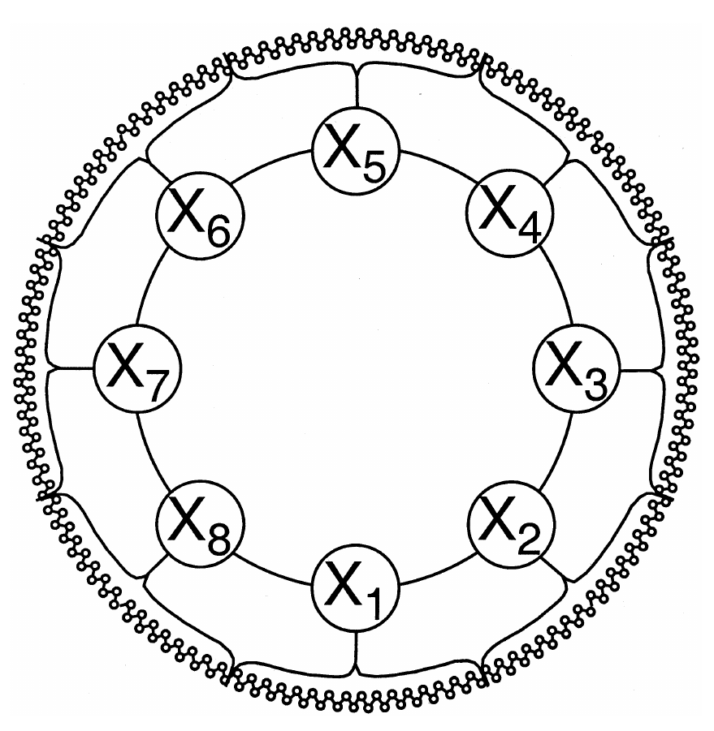
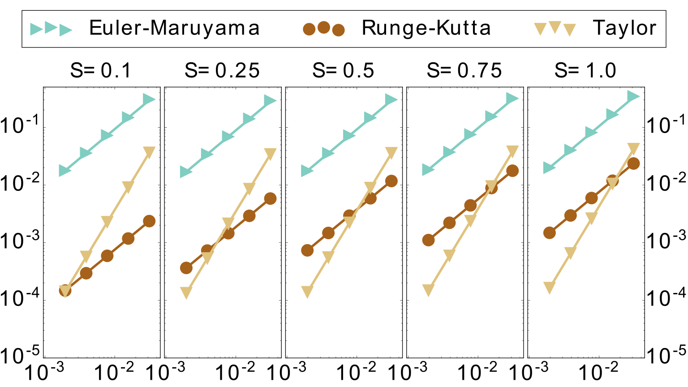
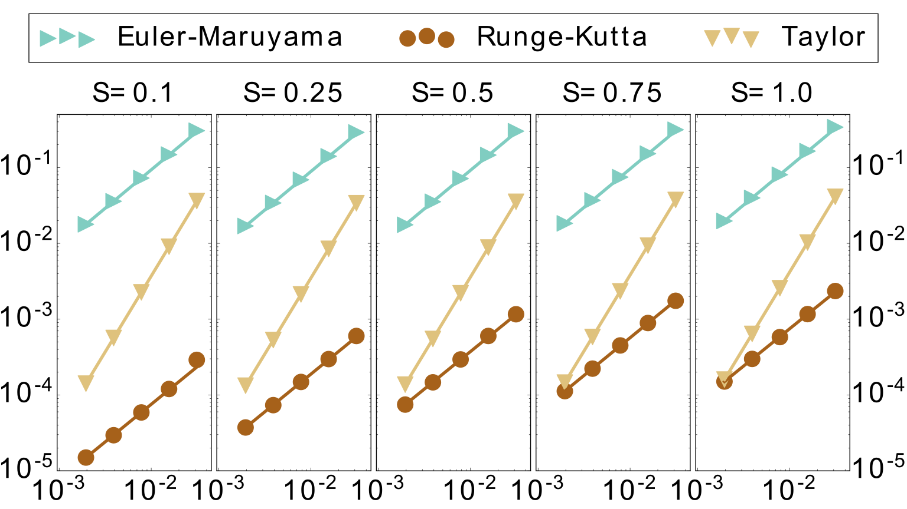
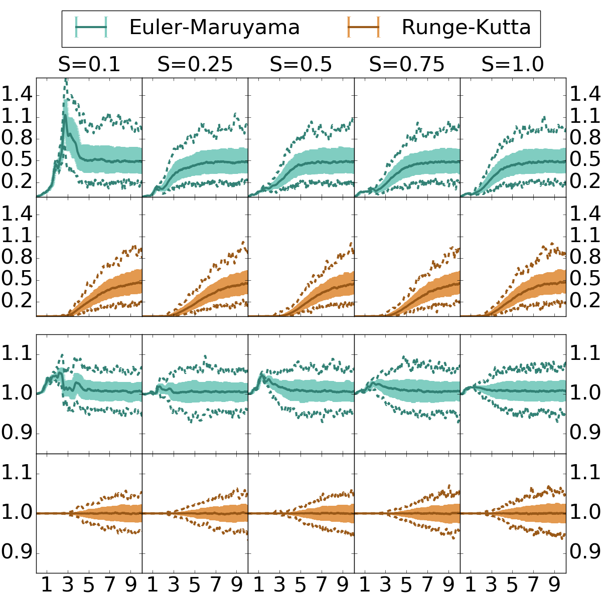
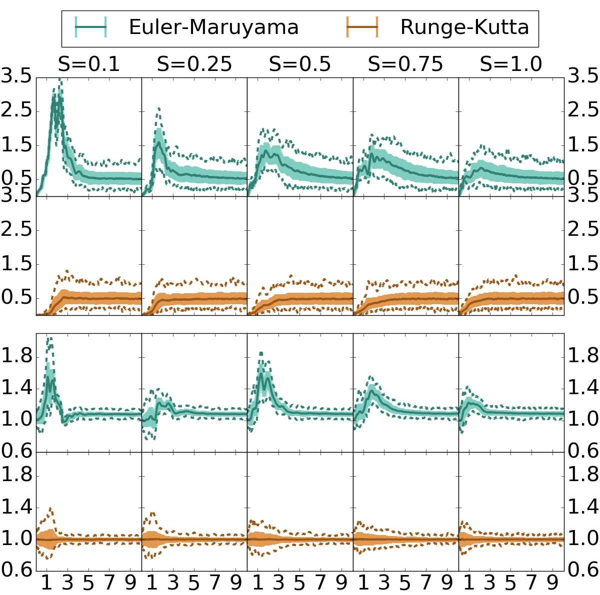
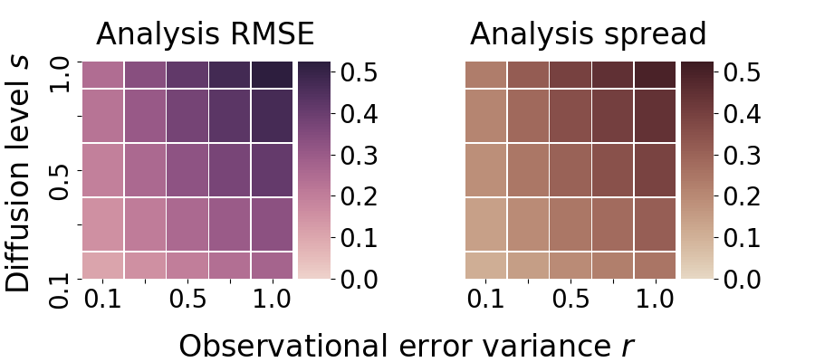
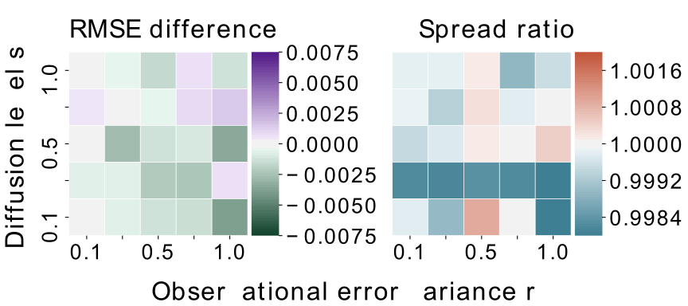
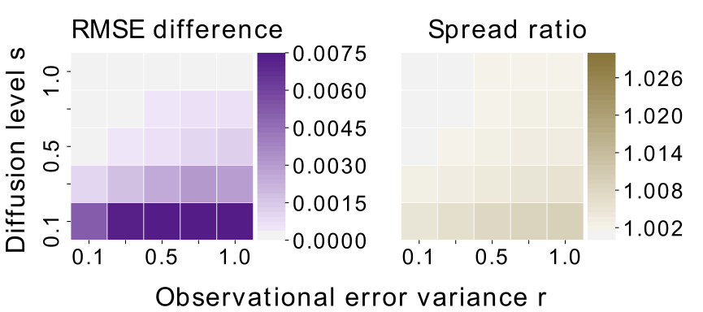
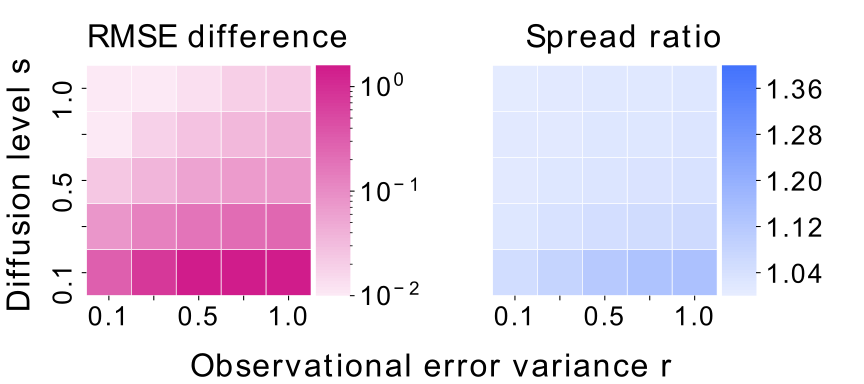
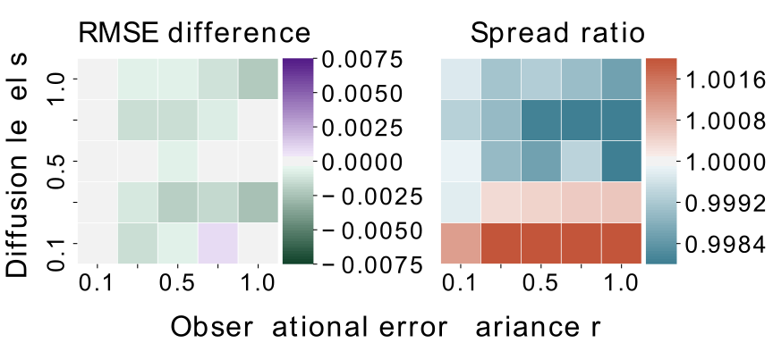

On the numerical integration of the Lorenz-96 model, with scalar additive noise, for benchmark twin experiments
========================================================
date: June 25, 2021 
autosize: true
incremental: true
width: 1920
height: 1080

## Authors:

<strong>Colin Grudzien1, Marc Bocquet2 and Alberto Carrassi3</strong>

<ol style="font-size:30px;text-align: center;list-style-position: inside;">
  <li>University of Nevada, Reno, Department of Mathematics and Statistics</li>
  <li>CEREA, A joint laboratory &Eacute;cole des Ponts Paris Tech and EDF R&D, Universit&eacute; Paris-Est, Champs-sur-Marne, France.</li>
  <li>University of Reading, Department of Meteorology and NCEO</li>
</ol>

========================================================

## Outline

<ul>
  <li> Twin experiments in toy models</li>
  <li> Multiscale model reduction error and random dynamical systems</li>
  <li> Stochastic integration schemes and bias in model statistics</li>
  <li> Numerical benchmarks:</li>
  <ol>
    <li>Strong and weak convergence</li>
    <li>Ensemble forecast statistics</li>
    <li>Filtering statistics</li>
  </ol>
  <li>Conclusions and future work</li>
</ul>

========================================================

## Bayesian Data assimilation in the geosciences

<ul>
  <li><b>Ensemble-based forecasting</b> and <b>Data assimilation (DA)</b> are the prevailing modes of:</li> 
  <ol>
    <li><b>prediction</b>; and</li> 
    <li><b>uncertainty quantification</b></li> 
  </ol>
  <li>in geophysical modeling.</li>
  <li><b>DA combines</b> simulations from a physics-based numerical model and real-world observations of a physical process.</li>
  <li><b>Bayesian framework:</b></li>
  <ul>
    <li>An ensemble-based forecast is a sampling procedure for the forecast-prior probability density.</li>
    <ul>
      <li>The physics-based numerical model (and previous estimates of the state) encapsulate the Bayesian prior knowledge.</li>
    </ul>
  <li>The output of DA is an estimate of a posterior probability density for the numerically simulated physical state, or some statistic.</li>
  </ul>
  <li><b>Bias</b> in the forecast-prior estimate will introduce <b>bias</b> into the posterior probability density.</li>
  <li>Therefore, <b>understanding</b> and <b>quantifying</b> model bias has become a central discussion in <b>ensemble-forecasting</b> and <b>DA</b>.</li>
</ul>

========================================================
## Bias in twin experiments and numerical precision

* <b>Deterministic, biased-model</b>:

  * the <b>numerical precision</b> of the <b>ensemble forecast</b> can be <b>substantially reduced</b> without a major deterioration of the DA cycle's (relative) predictive performance<b>1</b>.  

  * <b>Model bias overwhelms errors</b> introduced <b>due to precision loss</b> when the <b>model-twin is resolved with low accuracy</b>.

* <b>Random, unbiased-model</b>:

  * <b>differences in statistics</b> of model forecasts of <b>stochastic dynamical systems</b> are observed <b>due to the discretization errors</b> of low-order schemes.  

  * Frank & Gottwald develop an <b>order 2.0 Taylor scheme</b> to <b>correct the bias</b> in the drift <b>in the Euler-Maruyama scheme</b> in stochastically reduced model<b>2</b>. 

* <b> Our study:</b> 

  * how and to what extent <b>bias in numerical integration schemes</b> for <b>random dynamical systems</b> also <b>biases twin experiment and DA statistics</b>?
  
  * In what ways can <b>numerical precision</b> be <b>targeted</b> for <b>unbiased prior estimates</b> from <b>ensemble forecasts</b>?

<b>1.</b> Hatfield, S. et al.<em> Choosing the optimal numerical precision for data assimilation in the presence of model error</em>. Journal of Advances in Modeling Earth Systems, 10, 2177–2191, 2018. 
<b>2.</b> Frank, J. and Gottwald, G. A.<em> A Note on Statistical Consistency of Numerical Integrators for Multiscale Dynamics</em>. Multiscale Modeling &
Simulation, 16, 1017–1033, 2018.

========================================================
## Two Layer Lorenz-96 Model

 

From: Wilks, D. <em>Effects of stochastic parametrizations in the Lorenz'96 system.</em> Quarterly Journal of the Royal Meteorological Society 131.606 (2005): 389-407. 

<ul>
  <li>The <b>two layer Lorenz-96</b> model simulates <b>coupled, ocean-atmosphere dynamics</b>.</li>
  <li> This is a common model to study <b>stochastic model reduction</b><b>3</b>;</li>
  <ul>
    <li>the <b>effects</b> of <b>fast-variable dynamics</b> on the <b>slow variables</b> are <b>parameterized with a stochastic process</b>.</li>
  </ul>
  <li>This is <b>justified mathematically</b> due to the <b>Central Limit Theorem</b>:</li>
  <ul>
    <li>in the <b>asymptotic separation of the time scales</b> for the <b>fast</b> and <b>slow</b> variables,</li>
    <li>the effect of the <b>fast variables</b> will <b>reduce to additive, Gaussian noise</b><b>4</b>.</li>
  </ul>
  <li>For finite separation of scales, the <b>white-in-time model error</b> assumption is <b>no longer valid</b>; 
  <ul>
    <li>non-Markovian memory terms should be included<b>5</b>.</li>
 </ul>
</ul>

<b>3.</b> Vissio, G. and Lucarini, V.: A proof of concept for scale-adaptive parametrizations: the case of the Lorenz’96 model, Quarterly Journal of
the Royal Meteorological Society, 144, 63–75, 2018. 
<b>4.</b> Gottwald, G. et al. <em>Stochastic climate theory</em>. Nonlinear and Stochastic Climate Dynamics. 209--240. 2015. Cambridge University Press. 
<b>5.</b> Demaeyer, J. and Vannitsem, S.: Stochastic Parameterization of Subgrid-Scale Processes: A Review of Recent Physically Based Approaches,
in: Advances in Nonlinear Geosciences, pp. 55–85, Springer, 2018.

  
========================================================
## L96-s Model

<ul>

  <li>Define the <b>L96-s model</b> as follows,
  $$\begin{align}
\frac{\mathrm{d} \mathbf{x}}{\mathrm{d} t} \triangleq \mathbf{f}(\mathbf{x}) + s(t)\mathbf{I}_{n}\mathbf{W}(t),
\end{align}$$
  where</li>
  <ol>
    <li> $\mathbf{f}$ is defined as in the <b>single layer Lorenz-96</b> model</li>
    <li>$\mathbf{I}_n$ is the $n\times n$ identity matrix,</li>
    <li>$\mathbf{W}(t)$ is an $n$-dimensional Wiener process; and</li>
    <li>$s(t):\mathbb{R}\rightarrow \mathbb{R}$ is a measurable function of (possibly) time-varying diffusion coefficients.</li>
  </ol>
  <li><b>Both the truth-twin and model-twin are simulated with the L96-s model</b>.</li>
  <ul>
    <li> <b>Numerical model is unbiased</b> in <b>representing the true physics</b>, but where the <b>physics are intrinsically random</b>.</li>
  </ul>
  <li>Represents an <b>idealized two layer Lorenz-96 model</b> in which the <b>separation of the time scales</b> of the atmosphere and ocean <b>is taken to infinity</b>.</li>
  <ul>
    <li>This is a <b>perfect-random model</b> model assumption.</li>
  </ul>
  <li>We <b>distinguish</b> effects of <b>numerical bias</b> from <b>bias in the random physical process model</b>.</li>

</ul>

========================================================
## Strong versus weak convergence

<ul>
  <li>We study numerical integration schemes which <b>converge in the strong sense</b>;</li>
  <ul>
    <li><b>strong convergence</b> measures the <b>expected path-discretization errors</b> over all possible Wiener processes <b>starting at an initial condition</b>.</li>
    <li>This is the <b>analogue</b> of <b>deterministic path-discretization errors</b>.</li>
  </ul>
  <li> If $\mathbf{x}_\mathrm{SP}$ is an <b>exact sample path</b>, evolving with respect to a particular Wiener process;</li>
  <li> and $\mathbf{x}$ is an <b>approximation of this path</b>, discretized at a maximum step size of $\Delta$;</li>
  <li>loosely, we say the approximate $\mathbf{x}$ <b>converges strongly</b> to $\mathbf{x}_\mathrm{SP}$ at order $\gamma$ if:
  </li>
  <ul>
    <li>there exists a $\Delta_0$ and a constant $C>0$ such that for every $\Delta &lt; \Delta_0$
  </ul>
  <li>then the <b>expected path-discretization error is bounded</b> as
    $$\begin{align}
\mathbb{E}\left[\left\Vert \mathbf{x}(T) - \mathbf{x}_\mathrm{SP}(T)\right\Vert\right] \leq C \Delta^\gamma
\end{align}$$
where these are the states, evolved from time $0$ to time $T$.
</li>
</ul>

========================================================
## Strong versus weak convergence -- continued

<ul>
<li><b>Weak convergence</b> measures the error in <b>representing some statistic</b> of the forward distribution, 
  <ul>
    <li> given the <b>evolution an initial point Dirac-delta</b> distribution over all possible realizations of the Wiener process.</li>
  </ul>
  <li>If $g$ is a $2(\gamma +1)$ continuously differentiable function of at most polynomial growth;</li>
  <ul>
    <li> we say that $\mathbf{x}$ <b>converges weakly</b> to $\mathbf{x}_\mathrm{SP}$ at order $\gamma$ if for all $\Delta< \Delta_0$, 
      $$\begin{align}
\left\Vert \mathbb{E}\left[ g(\mathbf{x}(T)) - g(\mathbf{x}_\mathrm{SP}(T))\right] \right\Vert \leq C \Delta^\gamma,
\end{align}$$
for any such statistic $g$.
    </li>
  </ul>
  <li>Loosely, <b>strong convergence</b> measures the <b>mean of the path-discretization errors</b>, while <b>weak convergence</b> can measure the <b>error in representing the mean</b> over all paths.</li>
</ul>

========================================================
## Strong versus weak convergence in twin experiments

<ul>
  <li>Note: integration schemes that converge in the <b>strong</b> sense <b>also converge</b> in the <b>weak</b> sense,</li>
  <ul>
    <li>however, <b>weak</b> schemes <b>aren't guaranteed to converge</b> in the <b>strong</b> sense.</li>
  </ul>
  <li>For twin experiments, there is an <b>important distinction</b> between these modes of convergence:</li>
  <ul>
    <li>The <b>truth-twin</b> should be generated by a simulation which is precise in the <b>strong</b> sense,</li>
    <ul>
      <li>here we assume we have <b>observations of a path</b> that is <b>consistent</b> with the <b>governing dynamics</b> <b>6</b>.</li>
    </ul>
    <li>An <b>ensemble forecast</b> representation of the <b>prior</b> needs to converge in the <b>weak</b> sense alone;</li>
    <li>indeed, the <b>forecast</b> represents the <b>sampling of the prior density</b>, and we do not need to ensure the precision of each path solution if the density is accurate.</li>
    <ul>
      <li>Therefore, the <b>model-twin</b> should be evaluated in terms of the precision in the <b>weak</b> sense.</li>
    </ul>
  </ul>
</ul>

<b>6.</b>Hansen, J. A. and Penland, C. <em>Efficient approximate techniques for integrating stochastic differential equations</em>. Monthly weather review. 134, 3006–3014, 2006.

========================================================
## Integration schemes

<ul>
  <li>We study three commonly used <b>numerical integration schemes</b> for <b>stochastic differential equations (SDEs)</b>:</li>
  <ol>
    <li><b>Euler-Maruyama</b> -- a simple extension of the deterministic Euler scheme, <b>order 1.0 strong convergence</b> in L96-s.</li>
    <li><b>4-stage Runge-Kutta</b> -- a simple extension of the determinstic 4-stage Runge-Kutta scheme<b>7</b>, <b>order 1.0 strong convergence</b> in L96-s</li>
    <li><b>Second order Taylor</b> -- an integration scheme based on the Taylor-Stratonovich expansion<b>8</b>, <b>order 2.0 strong convergence</b> in L96-s.</li>
  </ol>
  <li>The <b>derivation of the order 2.0 strong Taylor scheme</b> for the Lorenz-96 model is <b>nontrivial</b> and <b>has not appeared earlier</b> in the literature to the authors' knowledge.</li>
  <ul>
    <li>Because <b>L96-s model</b> has:</li>
    <ol>
      <li> <b>constant</b> or <b>vanishing second derivatives</b> in the deterministic component;</li>
      <li><b>periodic boundary conditions</b>; and</li> 
      <li><b>additive scalar noise</b>;</li> 
    </ol>
    <li>we can <b>compute</b> this scheme <b>efficiently</b>, with <b>complexity growing linearly</b> in the system dimension $n$.</li>
  </ul>
<ul>

<b>7.</b> Rüemelin, W.<em> Numerical treatment of stochastic differential equations</em>, SIAM Journal on Numerical Analysis, 19, 604–613, 1982.
  
<b>8.</b> Kloeden, P. and Platen, E. Numerical Solution of Stochastic Differential Equations, Stochastic Modelling and Applied Probability, Springer
Berlin Heidelberg, page 359. 2013.

========================================================
## Strong convergence benchmarks

 

Grudzien, C., Bocquet, M., & Carrassi, A. (2020). <a href="https://gmd.copernicus.org/articles/13/1903/2020/gmd-13-1903-2020.html" target="blank">On the numerical integration of the Lorenz-96 model, with scalar additive noise, for benchmark twin experiments</a>. Geoscientific Model Development, 13(4), 1903-1924.

<ul>
  <li><b>Estimated strong convergence discretization error</b> in the vertical axis <b>versus the time-discretization step size</b>;</li>
  <ul>
    <li>log-log base 10 scale.</li>
  </ul>
  <li><b>Point estimates</b> --- <b>average estimated discretization error</b> over <b>500 independent batches of simulations</b>.</li>
  <ul>
    <li><b>Each batch</b> --- evolves initial condition with respect to <b>100 independent Wiener processes</b>.</li>
    <li>We simulate:
    <ol>
      <li><b>finely discretized path solution $\mathbf{x}_\mathrm{SP}$</b> with error on $\mathcal{O}\left(10^{-7}\right)$, and</li>
      <li>a <b>coarser approximation</b> by one of the tested methods.</li>
    </ol>
  </ul>

========================================================
## Strong convergence benchmarks -- continued

 

Grudzien, C., Bocquet, M., & Carrassi, A. (2020). <a href="https://gmd.copernicus.org/articles/13/1903/2020/gmd-13-1903-2020.html" target="blank">On the numerical integration of the Lorenz-96 model, with scalar additive noise, for benchmark twin experiments</a>. Geoscientific Model Development, 13(4), 1903-1924.

<ul>
    <li>Strong convergence
    $$\begin{align}
    \mathbb{E}\left[\left\Vert \mathbf{x}(T) - \mathbf{x}_\mathrm{SP}(T)\right\Vert\right]
    \end{align}$$
    estimated as:
    <ol>
      <li>the <b>mean difference</b> of the <b>finely discretized solution</b>, versus</li> 
      <li>the <b>coarse discretization</b> over all Wiener processes in the batch.</li>
    </ol>
  <li><b>Batch-mean estimates</b> are <b>Gaussian random variables distributed around the true expectation</b>.</li>
  <li><b>Slope (order of convergence)</b> estimated with <b>weighted least squares</b>;</li>
  <ul>
    <li><b>weights proportional</b> to the <b>inverse standard deviation</b> of the batch realizations.</li>
  </ul>
</ul>

========================================================
## Strong convergence benchmarks -- continued

 

Grudzien, C., Bocquet, M., & Carrassi, A. (2020). <a href="https://gmd.copernicus.org/articles/13/1903/2020/gmd-13-1903-2020.html" target="blank">On the numerical integration of the Lorenz-96 model, with scalar additive noise, for benchmark twin experiments</a>. Geoscientific Model Development, 13(4), 1903-1924.

<ul>
  <li><b>Diffusion level</b> <b>$s$</b> fixed for each panel.</li>
  <li>All the orders of convergence are empirically verified.</li>
  <ul>
    <li>However, the <b>constant $C$</b> in the bound $C\Delta^\gamma$ has a <b>large impact</b> on <b>strong discretization error</b>.</li>
  </ul>
  <li><b>Low diffusion regime:</b></li>
  <ul>
    <li>order <b>1.0 Runge-Kutta scheme</b> has <b>discretization error comparable</b> to order <b>2.0 Taylor scheme</b>.</li>
  </ul>
  <li>Performance of <b>Runge-Kutta scheme varies</b> between <b>low and high diffusion</b>.</li>
</ul>

<ul>
  <li><b>Order of convergence is same</b> in all diffusion regimes, the <b>difference in performance is reflected in the constant $C$</b>.</li>
</ul>

========================================================
## Weak convergence

 

Grudzien, C., Bocquet, M., & Carrassi, A. (2020). <a href="https://gmd.copernicus.org/articles/13/1903/2020/gmd-13-1903-2020.html" target="blank">On the numerical integration of the Lorenz-96 model, with scalar additive noise, for benchmark twin experiments</a>. Geoscientific Model Development, 13(4), 1903-1924.

<ul>
    <li>Weak convergence
    $$\begin{align}
    \left\Vert \mathbb{E}\left[ \mathbf{x}(T) - \mathbf{x}_\mathrm{SP}(T) \right]\right\Vert
    \end{align}$$
    estimated as:
    <ol>
      <li><b>difference of means</b> of the <b>finely discretized solution</b>, versus</li> 
      <li>the <b>coarse discretization</b> over all Wiener processes in the batch.</li>
    </ol>
  <li><b>Effect of constant</b> is <b>more pronounced</b> in <b>weak convergence</b>.</li>
  <li><b>Low diffusion:</b></li>
  <ul>
    <li><b>1.0 Runge-Kutta outperforms 2.0 Taylor</b>.</li>
  </ul>
  <li><b>Weak discretization error varies on order of magnitude</b> between <b>low</b> and <b>high</b> diffusion.</li
  </ul>
  <li><b>High strong precision</b> across all diffusion makes <b>Taylor</b> a choice for generating the <b>truth-twin</b>.</li>
  <li><b>Runge-Kutta</b> can generate <b>ensemble forecast</b> in the <b>model-twin</b> for <b>weak accuracy</b>.</li>
</ul>

========================================================
## Ensemble forecast statistics

<ul>
  <li>We use the <b>Taylor scheme</b> as a <b>benchmark</b> in the following experiments.</li>
  <ul>
    <li><b>Taylor</b> is <b>consistent across diffusiuon</b> levels.</li>
  </ul>
  <li><b>We study:</b></li>
  <ul>
    <li>how <b>ensemble forecast statistics</b> of,
    <ol>
      <li><b>Euler-Maruyama</b>, and</li>
      <li><b>Runge-Kutta</b></li> 
    </ol>
    <li><b>differ</b> from <b>Taylor</b>.</li>
</ul>

========================================================
## Ensemble forecast statistics -- fine discretization

 

Grudzien, C., Bocquet, M., & Carrassi, A. (2020). <a href="https://gmd.copernicus.org/articles/13/1903/2020/gmd-13-1903-2020.html" target="blank">On the numerical integration of the Lorenz-96 model, with scalar additive noise, for benchmark twin experiments</a>. Geoscientific Model Development, 13(4), 1903-1924.

<ul>
  <li><b>500 initial conditions</b> of L96-s model:</li>
  <ul>
    <li>each initial condition is <b>forecasted</b> with <b>100 independent Wiener processes</b>.</li>
  </ul>
  <li>We compute the <b>empirical, ensemble-estimated mean</b> and <b>ensemble-estimated spread</b> of the <b>forward distribution</b>.</li>
  <li>This is performed over each of the integration schemes:</li>
  <ol>
    <li><b>Taylor --- <b>step size $\Delta=10^{-3}$</b></b></li>
    <li><b>Euler-Maruyama --- <b>step size $\Delta=10^{-3}$</b></b></li>
    <li><b>Runge-Kutta</b> --- <b>step size $\Delta=10^{-3}$</b></li>
  </ol>
  <li><b>Top panels</b> --- <b>RMSD</b> of <b>ensemble means</b> for:
  <ol>
    <li><b>Euler-Maruyama</b> and</li>
    <li><b>Runge-Kutta</b></li>
  </ol>
  <li> versus <b>Taylor</b>.</li>
  <li><b>Bottom panels</b> --- <b>ratio of the ensemble spreads</b> for:
    <ol>
    <li><b>Euler-Maruyama</b> and</li>
    <li><b>Runge-Kutta</b></li>
  </ol>
  <li> versus <b>Taylor</b>.</li>
</ul>

========================================================
## Ensemble forecast statistics -- fine discretization continued

 

Grudzien, C., Bocquet, M., & Carrassi, A. (2020). <a href="https://gmd.copernicus.org/articles/13/1903/2020/gmd-13-1903-2020.html" target="blank">On the numerical integration of the Lorenz-96 model, with scalar additive noise, for benchmark twin experiments</a>. Geoscientific Model Development, 13(4), 1903-1924.

<ul>
  <li><b>Summary statistics versus forecast time</b> --- over 500 initial conditions:</li>
  <ul>
    <li><b>median is plotted as a solid line</b>;</li>
    <li><b>inner 80 percentile is plotted shaded</b>;</li>
    <li><b>min/ max values are plotted in dashed</b>.</li>
  </ul>
  <li><b>Runge-Kutta</b></li>
  <ul>
    <li><b>ensemble statistics</b> have <b>almost no difference</b> from <b>Taylor up to $T\approx 3$</b>.</li>
  </ul>
  <li><b>Euler-Maruyama</b></li>
  <ul>
    <li><b>ensemble mean</b> --- <b>rapid divergence</b></li>
    <li><b>ensemble spread</b> --- <b> divergence and presence of bias </b>:</li>
    <ul>
      <li><b>median spread ratio above 1.0 asymptotically.</b></li>
    </ul>
  </ul>
</ul>

========================================================
## Ensemble forecast statistics -- coarse discretization

 

Grudzien, C., Bocquet, M., & Carrassi, A. (2020). <a href="https://gmd.copernicus.org/articles/13/1903/2020/gmd-13-1903-2020.html" target="blank">On the numerical integration of the Lorenz-96 model, with scalar additive noise, for benchmark twin experiments</a>. Geoscientific Model Development, 13(4), 1903-1924.

<ul>
  <li><b>Coarse ensemble versus benchmark</b>:</li>
  <ol>
    <li><b>Taylor --- <b>step size $\Delta=10^{-3}$</b></b></li>
    <li><b>Euler-Maruyama --- <b>step size $\Delta=10^{-2}$</b></b></li>
    <li><b>Runge-Kutta</b> --- <b>step size $\Delta=10^{-2}$</b></li>
  </ol>
<li><b>Runge-Kutta</b></li>
  <ul>
    <li><b>ensemble mean</b> --- faster onset of divergence</b>.</li>
        <li><b>ensemble spread</b> --- increased variance of ratio</b>.</li>
  </ul>
  <li><b>Euler-Maruyama</b></li>
  <ul>
    <li><b>ensemble mean</b> --- <b>extreme divergence</b>, especially in <b>low diffusion</b></li>
    <li><b>ensemble spread</b> --- <b> divergence and presence of bias </b>:</li>
    <ul>
      <li><b>MINIMUM spread ratio above 1.0 asymptotically.</b></li>
    </ul>
  </ul>
  <li><b>Runge-Kutta does not have extreme divergence of trajectories, and the spread remains unbiased asymptotically</b>.</li>
</ul>

========================================================
## Summary of bias in ensemble forecast

<ul>
  <li><b>Runge-Kutta is robust</b> in generating ensemble forecast statistics.</li>
  <ul>
    <li><b>Runge-Kutta</b> is very <b>precise</b> in the weak sense.
  </ul>
  <li><b>Coarse time step $\Delta=10^{-2}$</b></li>
  <ul>
    <li><b>unbiased spread compared with Taylor using a step size of $\Delta=10^{-3}$</b>.</li>
    <li><b>Divergence of ensemble means matches the asymptotic divergence</b> with <b>time-step of $\Delta=10^{-3}$</b>.</li>
    <li><b>Low precision</b> numerics <b>inreases variance</b> of sample forecast statistics, but <b>remains unbiased</b>.</li>
  </ul>
  <li> <b>Euler-Maruyama</b></li> 
  <ul>
    <li>systematic biases in ensemble forecast statistics</b>.</li>
    <li><b>Asymptotic ensemble spread is systematically, artifically inflated</b>.</li>
    <li><b>Extreme divergence of trajectories</b>;
    <ul>
      <li>divergence <b>over an order of magnitude difference</b> compared with the Runge-Kutta scheme.</li>
    </ul>
  <li> Indicates <b>Euler-Maruyama biasing</b> ensemble forecast statistics, </li>
  <ul>
    <li>doesn't yet demonstrate the <b>effect of bias on DA twin experiment</b>.</li>
    <li>This is demonstrated in the following...</li>
</ul>

========================================================
## Taylor benchmark configuration -- filter statistics

 

Grudzien, C., Bocquet, M., & Carrassi, A. (2020). <a href="https://gmd.copernicus.org/articles/13/1903/2020/gmd-13-1903-2020.html" target="blank">On the numerical integration of the Lorenz-96 model, with scalar additive noise, for benchmark twin experiments</a>. Geoscientific Model Development, 13(4), 1903-1924.

<ul>
  <li><b>Benchmark configuration</b>:</li>
  <ul>
    <li>truth twin --- Taylor step $\Delta=10^{-3}$</li>
    <li>model twin --- Taylor step $\Delta=10^{-3}$.</li>
  </ul>
  <li><b>Ensemble Kalman filter (EnKF)</b> --- <b>RMSE</b> and <b>spread</b>.</li> 
  <li><b>Vertical axis:</b> diffusion level $s$.</li>
  <li><b>Horizontal axis:</b> variance of the error in the observations given to the ensemble Kalman filter.</li>
  <li><b>$N=10^2$ samples</b></li>
  <li><b>State dimension $n=10$</b>;</li>
  <li><b>Fully observed</b></li>
  </ul>

<ul>
  <li><b>Convergence</b> of filtering statistics <b>without inflation / localization</b>.</li>
  <li><b>RMSE</b> and <b>spread</b> are computed as the <b>asymptotic average over $2.5\times 10^{4}$ analysis cycles</b>.</li>
  <li>Analysis RMSE is <b>comparable</b> to the analysis spread;</li>
  <ul>
    <li><b>lower</b> than the standard deviation of <b>the error in the observations</b>.</li>
  </ul>

  <li><b>Comparision:</b></li>
  <ul>
    <li><b>Vary the ensemble integration</b> between <b>Runge-Kutta</b> and <b>Euler-Maruyama</b>, with a <b>step size between $\Delta\in\left\{10^{-3},10^{-2}\right\}$</b>.</li>
  </ul>
</ul>

========================================================
## Filter benchmark -- Runge-Kutta model-twin, coarse discretization, Taylor truth-twin, fine discretization

 

Grudzien, C., Bocquet, M., & Carrassi, A. (2020). <a href="https://gmd.copernicus.org/articles/13/1903/2020/gmd-13-1903-2020.html" target="blank">On the numerical integration of the Lorenz-96 model, with scalar additive noise, for benchmark twin experiments</a>. Geoscientific Model Development, 13(4), 1903-1924.

<ul>
  <li>Generate ensemble with <b>Runge-Kutta</b></li>  <li><b>Compare:</b></li>
  <ol>
    <li><b>difference in RMSE</b> with benchmark;</li>
    <li><b>ratio in spread</b> with benchmark</li>
  </ol>
  <li><b>Runge-Kutta step $10^{-3}$:</b></li>
  <ul>
    <li><b>Filtering statistics </b>differ on the <b>order of $10^{-6}$</b>;</li>
    <li>this is <b>not pictured</b> here.</li>
  </ul>
  <li><b>Runge-Kutta</b> step <b>$\Delta=10^{-2}$</b></li>
  <ul>
    <li><b>introduces small errors</b>,</li>
    <li>however, the <b>residuals are unstructured in sign or magnitude</b>.</li>
    <ul>
      <li>Indicates <b>random, unbiased numerical noise</b>.</li>
    </ul>
  </ul>
</ul>

========================================================
## Filter benchmark -- Euler-Maruyama model-twin, fine discretization, Taylor truth-twin, fine discretization
 

Grudzien, C., Bocquet, M., & Carrassi, A. (2020). <a href="https://gmd.copernicus.org/articles/13/1903/2020/gmd-13-1903-2020.html" target="blank">On the numerical integration of the Lorenz-96 model, with scalar additive noise, for benchmark twin experiments</a>. Geoscientific Model Development, 13(4), 1903-1924.

<ul>
  <li>Generate ensemble with <b>Euler-Maruyama</b>:</li> 
  <ul>
      <li><b>step $\Delta=10^{-3}$;</b></li>
      <li><b>structure in the residuals</b>;</li>
      <li><b>artificial inflation in the forecast</b>.</li>
  </ul>
    <li><b>High diffusion</b>:</li>
  <ul>
    <li><b>RMSE and spread nearly identical to benchmark</b>.</li>
  </ul>
  <li><b>Impact of bias depends strongly on the model uncertainty</b>.</li>
</ul>

========================================================
## Filter benchmark -- Euler-Maruyama model-twin, coarse discretization, Taylor truth-twin, fine discretization
 

Grudzien, C., Bocquet, M., & Carrassi, A. (2020). <a href="https://gmd.copernicus.org/articles/13/1903/2020/gmd-13-1903-2020.html" target="blank">On the numerical integration of the Lorenz-96 model, with scalar additive noise, for benchmark twin experiments</a>. Geoscientific Model Development, 13(4), 1903-1924.

<ul>
  <li>Generate ensemble with <b>Euler-Maruyama</b>:</li> 
  <ul>
      <li><b>step $\Delta=10^{-2}$;</b></li>
      <li><b>structure in the residuals persists</b>;</li>
      <li><b>artificial inflation in the forecast</b>.</li>
      <li><b>Low diffusion</b>: the  error forces filter divergence.</li>
    <li><b>High diffusion ($s\geq 0.5$)</b>: <b>difference with the benchmark is on the order of $10^{-2}$</b>.</li>
  </ul>
</ul>

========================================================
## Filter benchmark -- Runge-Kutta model-twin, coarse discretization, Taylor truth-twin, coarse discretization

 

Grudzien, C., Bocquet, M., & Carrassi, A. (2020). <a href="https://gmd.copernicus.org/articles/13/1903/2020/gmd-13-1903-2020.html" target="blank">On the numerical integration of the Lorenz-96 model, with scalar additive noise, for benchmark twin experiments</a>. Geoscientific Model Development, 13(4), 1903-1924.

<ul>
  <li> Finally we <b>test the benchmark configuration versus</b>:</li>
  <ul>
    <li><b>model-twin</b> --- <b>Runge-Kutta step size $\Delta=10^{-2}$</b>; and</li>
    <li><b>truth-twin</b> --- <b>Taylor step size $\Delta = 5 \times 10^{-3}$</b>.</li> 
  </ul>
  <li>The <b>expected discretization error is less than $10^{-3}$ over all diffusion regimes</b>.</li>
  <li><b>Innacuracy in the truth-twin adds some structure in the residuals</b>,</li>
  <li>however, the results are <b>largely the same</b> as with the <b>accurate</b> truth-twin.</li>
</ul>

<ul>
  <li>Compared with:</li>
  <ul>
    <li><b>model-twin</b> --- <b>Euler-Maruyama</b>; and</li>
    <li>truth-twin --- <b>Taylor step size $\Delta = 5 \times 10^{-3}$</b>.</li>
  </li>
    <li>This <b>relaxes the issues with Euler-Maruyama</b> when the <b>model-twin uses a step size of $\Delta=10^{-3}$</b>.</li>
    <li>However, <b>filter divergence still occurs when the model-twin uses a step size of $\Delta=10^{-2}$</b>.</li>
</ul>

========================================================
## Conclusions

<ul>
  <li> We <b>distinguish between strong and weak convergence</b>, and its <b>impact</b> on the truth-twin and the model-twin respectively.</li>
  <li> <b>Euler-Maruyama:</b></li>
  <ul>
    <li><b>introduces strong, systematic bias into twin experiments when the step size is greater than or equal to $\Delta=10^{-2}$</b>.</li>
    <li>Effects <b>depends strongly on model uncertainty</b> in a twin experiment;</li>
    <li><b>bias is sufficient to cause filter divergence</b> in weak diffusion.</li>
  </ul>
  <li><b>Runge-Kutta:</b></li>
  <ul>
    <li><b>statistically robust solver</b>.</li>
    <li>$\Delta$ on $\mathcal{O}\left(10^{-3}\right)$, --- <b>virtually no difference with Taylor scheme</b>.</li>
    <li><b>Step $\Delta=10^{-2}$ </b> --- introduces additional discretization error, but the <b>error doesn't strongly influence the RMSE or spread of the EnKF</b>.</li>
  </ul>
</ul>
  
========================================================
## Conclusions -- continued

<ul>
  <li>We demonstrate in our work that an <b>overall discretization error can be bounded by $10^{-3}$</b>, using:</li>
  <ol>
    <li><b>4-stage Runge-Kutta with step $\Delta=10^{-2}$ --- model-twin</b>; and</li>
    <li><b> order 2.0 Taylor with step $\Delta=5\times 10^{-3}$ --- truth-twin</b>.</li>
  </ol>  
  <li>This forms a practical compromise, which <b>our diagnostics demonstrate does not bias the outcomes of the filtering statistics</b>.</li>
  <li>We provide a <b>computationally efficient framework for statistically robust twin experiments in the L96-s model</b>.</li>
  <li><b>We provide a novel derivation of ther order 2.0 Taylor scheme for the L96-s model</b>.</li>
  <ul>
    <li>This <b>derivation has not previously appeared in the literature</b> to the authors' knowledge, and we moreover <b>provide benchmarks on the convergence of this and other schemes</b>.</li>
  </ul>
  <li> As an <b>open question:</b></li>
  <ul>
    <li><strong>Can using weak integration schemes (which may not converge to any sample path) reduce the computational burden of ensemble-based forecasts in geophysical models?</strong></li>
  </ul>
  <li><b>If the goal of the forecast is to converge in distribution alone, this may be a viable alternative to traditional geophysical modeling paradigms</b>.</li>
  <li><b>Potential advantage:</b></li>
  <ul>
    <li><b>Numerical precision</b> can be targeted in the <b>weak sense</b> alone.</li>
  </ul>
</ul>

