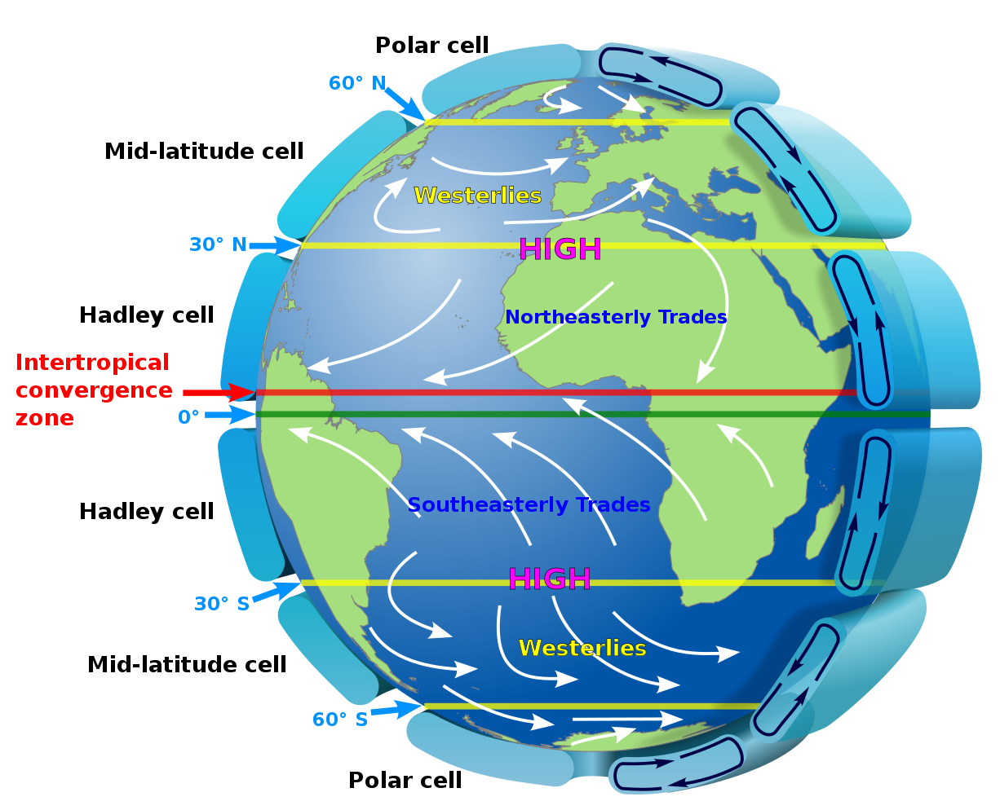
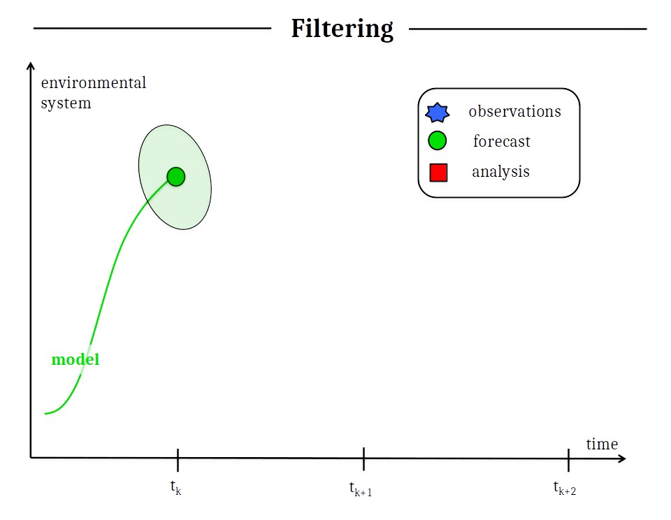
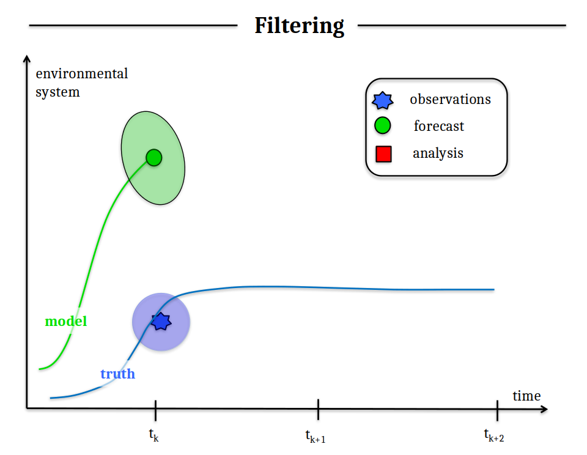
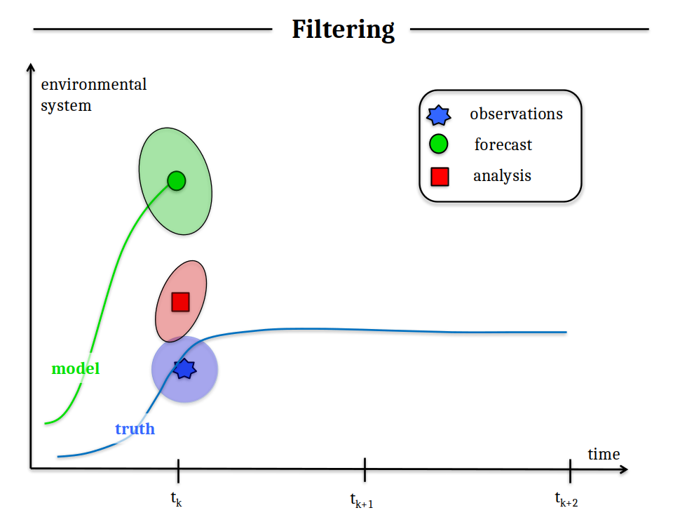
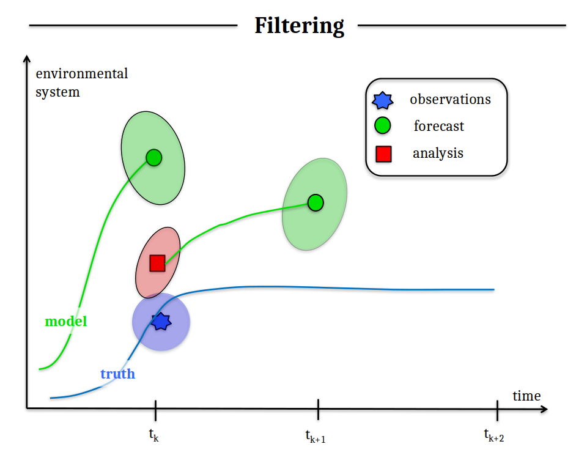
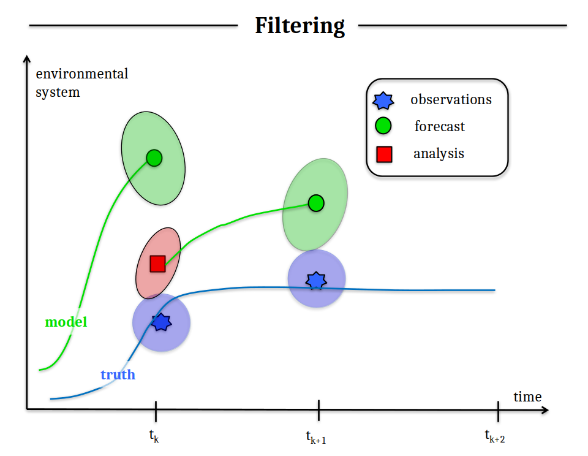
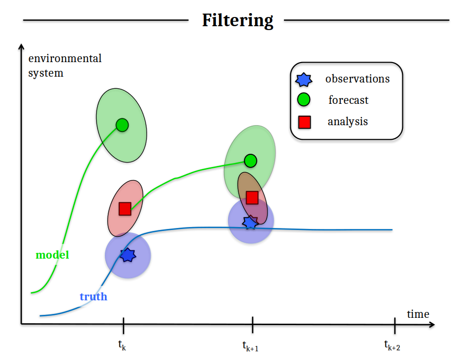
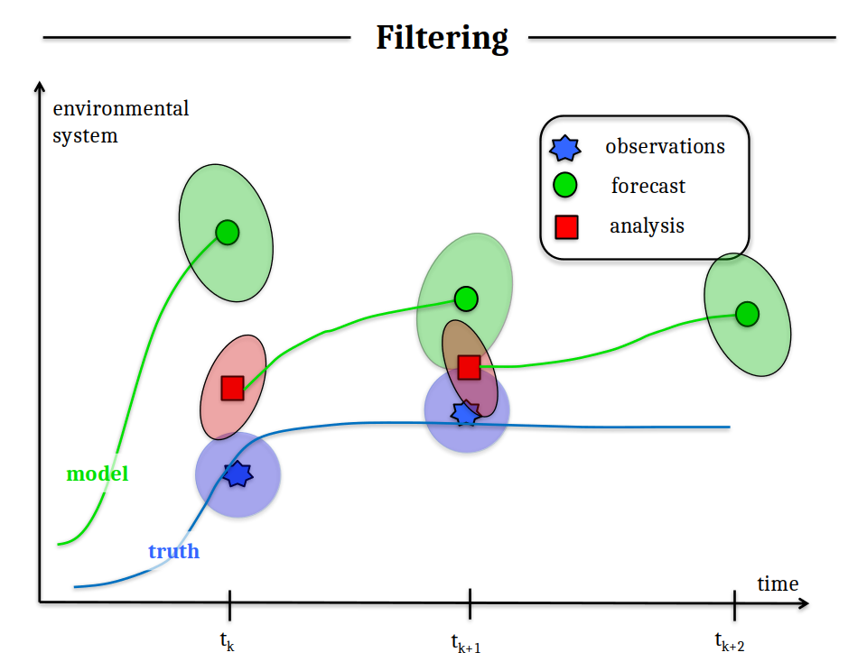
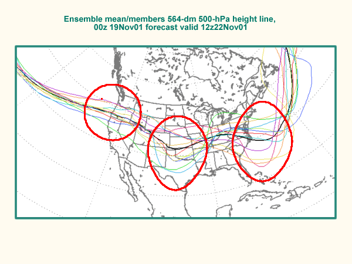

Hidden Markov Models and the Bootstrap Particle Filter
========================================================
date: 03/04/2020
autosize: true
incremental: true
width: 1920
height: 1080

<h2 style="text-align:left"> Instructions:</h2>

Use the left and right arrow keys to navigate the presentation forward and backward respectively.  You can also use the arrows at the bottom right of the screen to navigate with a mouse. 

========================================================

<h2>Outline</h2>

<ul>
 <li> The following topics will be covered in this lecture:</li>
 <ul>
    <li> What is "data assimilation"?</li>
    <ul>
      <li> Observation-Analysis-Forecast cycles</li>
    </ul>
    <li> The Bayesian framework for data assimilation</li>
    <ul>
      <li> Hidden Markov models</li>
    </ul>
    <li> A simple computational method</li>
    <ul>
      <li> The bootstrap particle filter</li>
    </ul>
  </ul>
</ul>
  

========================================================

## What is "data assimilation"?

Courtesy of: Kaidor via Wikimedia Commons (CC 3.0)

<ul>
  <li><b>Data assimilation</b> is a statistical science at the intersection of applied mathematics.</li>
  <li>Data assimilation is differentiated by the use of a <b>physics-based process model</b> for the <strong>time-evolution</strong> of the variables we wish to estimate.</li>
  <li>We should think of this model being an <strong>imperfect representation</strong> of the evolution, with <b>uncertainty</b>.</li>
  <li>On the other hand, suppose we have <strong>limited and innacurate real-world observations</strong> of related quantitites.</li>
  <li>The <b>goal of data assimilation</b>:</li>
  <ul>
    <li>we want to combine the data from: 
    <ol>
      <li>real-world observations; and
      <li>a physics-based model</li>
    </ol>
    <li>to <strong>produce an "optimal" estimate</strong> of the physical quantity, its related parameters and the uncertainty therein.</li> 
</ul>

========================================================

### What is "data assimilation"? (continued)

Courtesy of: Kaidor via Wikimedia Commons (CC 3.0)

<ul>
  <li> Let's suppose that we have a physics-based model for some process -- prototypically we can think of the weather.</li>
  <li> This model encapsulates the understanding of <strong>first physical principles</strong> for the <b>equations of motion</b> for various time-varying states.</li>
  <li>This model can represent, e.g.,</li> 
  <ul>
    <li>the atmosphere in terms of:</li>
    <ol>
      <li>temperature,</li> 
      <li>pressure and</li>
      <li>humidity</li>
    </ol>
    <li>over Reno and the western USA.</li>
  <li>The evolution of these states is described by a <b>system of PDEs</b>, discretized spatially <strong>over three dimensions of the atmosphere and surface topography</strong>.</li>
</ul>

========================================================

### What is "data assimilation"? (continued)

Courtesy of: Kaidor via Wikimedia Commons (CC 3.0)

<ul>
  <li>Let's suppose that these <b>dynamical (time-varying) states</b> can be written in a vector, $\mathbf{x}_k \in \mathbb{R}^n$, where $k$ corresponds to some time $t_k$.</li>
  <li>Abstractly, we will represent the <b>time-evolution</b> of these states with the <strong>nonlinear map $\mathcal{M}$</strong>,
  $$\mathbf{x}_k = \mathcal{M}_{k:k-1} \left(\mathbf{x}_{k-1}, \boldsymbol{\lambda}\right) + \boldsymbol{\eta}_k$$
  where</li>
  <ul>
    <li>$\mathbf{x}_{k-1}$ is the vector of states at an earlier time $t_{k-1}$;</li>
    <li>$\boldsymbol{\lambda}$ is a vector of <strong>uncertain phyiscal parameters</strong> on which the evolution depends, e.g., energy loss due to friction of wind on the Sierra.</li>
    <li>$\boldsymbol{\eta}_k$ is an <b>additive, stochastic noise</b> term, representing <strong>errors in our model for the phyiscal process</strong>.</li>
  </ul>
  <li>The states $\mathbf{x}_k$ are the values we wish to estimate, having a prior distribution on $\left(\mathbf{x}_{k-1}, \boldsymbol{\lambda}\right)$ and knowledge of $\mathcal{M}_{k:k-1}$ and of how $\boldsymbol{\eta}_k$ are distributed.</li>
</ul>

  

  <li>At time $t_{k-1}$, we will make a <b>forecast for the distribution of $\mathbf{x}_k$</b> with our prior knowledge, including the physics-based model.</li>  
  <li>For the rest of this lecture, we will restrict our consideration to the case that $\boldsymbol{\lambda}$ is a known constant for simplicity.</li>
</ul>

  
  
========================================================

### What is "data assimilation"? (continued)

Courtesy of: Kaidor via Wikimedia Commons (CC 3.0)

<ul>
  <li>We suppose that we are also given real-world observations $\mathbf{y}_k\in\mathbb{R}^d$ related to the phyiscal states by,
  $$\mathbf{y}_k = \mathcal{H}_k \left(\mathbf{x}_k\right) + \boldsymbol{\epsilon}_k$$
  where</li>
  <ul>
    <li>$\mathcal{H}_k:\mathbb{R}^n \rightarrow \mathbb{R}^d$ is a nonlinear map relating the <b>states we wish to estimate $\mathbf{x}_k$</b> to the <strong>values that are observed $\mathbf{y}_k$</strong>;</li>
    <ul>
      <li>e.g., we may wish to <b>estimate humidity</b>, but we only <strong>observe the back-scatter of light</strong> from a satelite's laser as it hits particulate in the atmosphere.</li>
      <li>Typically $d \ll n$ so this is information is sparse and observations are not $1:1$ with the unobserved states.</li>
    </ul>
    <li>$\boldsymbol{\epsilon}_k$ is an <b>additive, stochastic noise</b> term representing <strong>errors in the measurements</strong>.</li>
  </ul>
  <li>Therefore, at time $t_k$ we will have a <b style="color:green">forecast distribution</b> for the states $\mathbf{x}_k$  <strong>generated by our prior on $\mathbf{x}_{k-1}$ and our physics-based model $\mathcal{M}$</strong>;</li>
</ul>

<ul>
  <li>We will also have an <b style="color:blue">observation $\mathbf{y}_k$</b> with uncertainty.</li>
  <li>We wish to find a <b style="color:red">posterior distribution for $\mathbf{x}_k$</b> conditioned on $\mathbf{y}_k$.</li>
</ul> 

========================================================
## Observation-analysis-forecast cycle

 

From: Carrassi, A. et al. <em>Data assimilation in the geosciences: An overview of methods, issues, and perspectives.</em> Wiley Interdisciplinary Reviews: Climate Change 9.5 (2018): e535.

<ul>
  <li>Recursive estimation of the distribution for $\mathbf{x}_k$ conditional  on $\mathbf{y}_k$ can be described as an:</li>
  <ol>
    <li>observation</li>
    <li>analysis</li>
    <li>forecast</li>
  </ol>
  <li>cycle.</li>
  <li>We assume that we have an initial forecast-prior for the physics-based numerical model state.</li>
  <li>Suppose that the <b>current time is $t_{k-1}$</b> and will will make a prediction of the atmosphere at <strong>time $t_k$</strong>.</li> 
  <li>The prior is generated from the simulation of the geophysical fluid dynamics.</li>
  <li>Let's suppose this gives an <strong>estimate of the atmosphere $t_{k} - t_{k-1} =6$ hours in the future</strong>.</li>  
  </ul>

========================================================
### Observation

 

From: Carrassi, A. et al. <em>Data assimilation in the geosciences: An overview of methods, issues, and perspectives.</em> Wiley Interdisciplinary Reviews: Climate Change 9.5 (2018): e535.

<ul>
  <li>The "true" physical process evolves in time;</li>
  <ul>
    <li>eventually, the physical state reaches the time $t_k$ of the first forecast.</li>
    <li>If we make our first forecast at time $t_{k-1}$, this corresponds to our real atmosphere reaching the time of the forecast state, $t_{k}$.</li>
  </ul>
  <li>At this time, we receive an observation of the atmosphere's state variables.</li>
</ul>

========================================================
### Analysis

 

From: Carrassi, A. et al. <em>Data assimilation in the geosciences: An overview of methods, issues, and perspectives.</em> Wiley Interdisciplinary Reviews: Climate Change 9.5 (2018): e535.

<ul>
  <li>The observation comes with a likelihood function;
  <ul>
    <li>we compute the likelihood of the observation given the model forecast.</li>
  </ul>
  <li>Using the forecast-prior and the likelihood,</li>
  <ul>
    <li>we estimate the <b>Bayesian update</b> of the prior to the posterior</li>
    <li>conditioned on the observation.</li>
  </ul>
  <li>The posterior density is denoted the analysis.</li>
</ul>

========================================================
## Forecast

 

From: Carrassi, A. et al. <em>Data assimilation in the geosciences: An overview of methods, issues, and perspectives.</em> Wiley Interdisciplinary Reviews: Climate Change 9.5 (2018): e535.

<ul>
  <li>The analysis is then used as the initialization of the next forecast.</li>
  <li>Simulating the model forward in time, we produce a new forecast-prior.</li>
    <li>Chaotic evolution (the butterfly effect) causes the model forecast to <b>drift</b> from the true state.</li>
  <ul>
    <li>This is in addition to the errors in:</li> 
    <ol>
      <li>accurately representing the true physical process with the imperfect numerical model; and</li>
      <li>estimating the "true" initial condition from incomplete and noisy observations.</li>
    </ol>
  </ul>
</ul>

========================================================
## Observation

 

From: Carrassi, A. et al. <em>Data assimilation in the geosciences: An overview of methods, issues, and perspectives.</em> Wiley Interdisciplinary Reviews: Climate Change 9.5 (2018): e535.

<ul>
  <li>When a new observation becomes available...</li>
</ul>

========================================================
## Analysis

 

From: Carrassi, A. et al. <em>Data assimilation in the geosciences: An overview of methods, issues, and perspectives.</em> Wiley Interdisciplinary Reviews: Climate Change 9.5 (2018): e535.

<ul>
  <li>We produce a new analysis...</li>
</ul>

========================================================
## Forecast

 

From: Carrassi, A. et al. <em>Data assimilation in the geosciences: An overview of methods, issues, and perspectives.</em> Wiley Interdisciplinary Reviews: Climate Change 9.5 (2018): e535.

<ul>
  <li>And the cycle continues ad-infinitum...</li>
</ul>

========================================================

## Hidden Markov models

<ul>
  <li> Recall our <b>physical process model</b> and <b>observation model</b>, 
  $$\begin{align}
  \mathbf{x}_k &= \mathcal{M}_{k:k-1} \left(\mathbf{x}_{k-1}\right) + \boldsymbol{\eta}_k\\
  \mathbf{y}_k &= \mathcal{H}_k \left(\mathbf{x}_k\right) + \boldsymbol{\epsilon}_k
  \end{align}$$</li>
  <li>Let us denote the sequence of the <b style="color:green">process model states</b> and <b style="color:blue">observation model states</b> as,
  $$\begin{align}
  \mathbf{x}_{K:0} = \{\mathbf{x}_k &:  k=0,\cdots, K\} \\
  \mathbf{y}_{K:1} = \{\mathbf{y}_k &:  k=1,\cdots, K\} 
  \end{align}$$</li>
  <li>We <b>assume</b> that the <b style="color:green">model error</b> and <b style="color:blue">observation error</b> sequences 
    $$\begin{align}
    \{\boldsymbol{\eta}_k :  k=1,\cdots, K\} &  &
    \{\boldsymbol{\epsilon}_k :  k=1,\cdots, K\}
    \end{align}$$
    will be:</li>
  <ol>
    <li><strong>mutually indepdendent</strong>;</li>
    <li><strong>independent in time</strong>; and</li>
    <li><strong>distributed according to $p_\boldsymbol{\eta}$ and $p_\boldsymbol{\epsilon}$ respectively</strong>.</li>
  </ol> 
  <li>In this case, we can write the following conditional probability distributions as,
  $$\begin{align}
  p\left(\mathbf{x}_k \vert \mathbf{x}_{k-1} \right) = p_\boldsymbol{\eta}\big(\mathbf{x}_k - \mathcal{M}\left(\mathbf{x}_{k-1}\right)\big) & &
  p\left(\mathbf{y}_k \vert \mathbf{x}_{k} \right) = p_\boldsymbol{\epsilon}\big(\mathbf{y}_k - \mathcal{H}\left(\mathbf{x}_{k}\right)\big).
  \end{align}$$</li>
  <li>The above formulation is known in some literature as a <b>hidden Markov model</b>;</li>
  <ul>
    <li>the dynamic state variables $\mathbf{x}_k$ are known as the <b>hidden variables</b>, because they <strong>are not directly observed</strong>; </li>
    <li>the <b>Markov property</b>   on the conditional probabilities is a direct consequence of the above assumptions.</li>
  </ul>
</ul> 

========================================================

### Hidden Markov models continued

<ul>
 <li> Recall our <b>physical process model</b> and <b>observation model</b>, 
  $$\begin{align}
  \mathbf{x}_k &= \mathcal{M}_{k:k-1} \left(\mathbf{x}_{k-1}\right) + \boldsymbol{\eta}_k\\
  \mathbf{y}_k &= \mathcal{H}_k \left(\mathbf{x}_k\right) + \boldsymbol{\epsilon}_k
  \end{align}$$
  and our conditional probability distributions
  $$\begin{align}
    p\left(\mathbf{x}_k \vert \mathbf{x}_{k-1} \right) = p_\boldsymbol{\eta}\big(\mathbf{x}_k - \mathcal{M}\left(\mathbf{x}_{k-1}\right)\big) & &
  p\left(\mathbf{y}_k \vert \mathbf{x}_{k} \right) = p_\boldsymbol{\epsilon}\big(\mathbf{y}_k - \mathcal{H}\left(\mathbf{x}_{k}\right)\big).
  \end{align}$$</li>  
  <li>The <strong>independence in time assumption</strong> on the model stochasticity gives <b>Markovian probability distributions</b> for the hidden variables, i.e.,
  $$\begin{align}
  p\left(\mathbf{x}_{K:0}\right) &= p\left(\mathbf{x}_{K} \vert \mathbf{x}_{K-1: 0}\right) p\left(\mathbf{x}_{K-1:0}\right)\\
  &= p\left(\mathbf{x}_{K} \vert \mathbf{x}_{K-1}\right) p\left(\mathbf{x}_{K-1:0} \right).
  \end{align}$$</li>
  <li>Applying the <b>Markovian</b> property <strong>recursively</strong>, we have that,
  $$p\left(\mathbf{x}_{K:0}\right) = p(\mathbf{x}_0) \Pi_{k=1}^{K} p_\boldsymbol{\eta}\big(\mathbf{x}_k - \mathcal{M}\left(\mathbf{x}_{k-1}\right)\big)$$</li>
  <li>Similarly, we can show that,
  $$p\left(\mathbf{y}_{k}\vert \mathbf{x}_k, \mathbf{y}_{k-1:1}\right) = p\left(\mathbf{y}_k \vert \mathbf{x}_k\right),$$
  by the <strong>independence assumptions</strong> on the <b style="color:green">model</b> and <b style="color:blue">observation</b> errors.</li>
</ul>

========================================================

### Hidden Markov models continued

<ul>
  <li>Given our <b style="color:green">physical process model</b> and <b style="color:blue">observation model</b>, 
  $$\begin{align}
  \mathbf{x}_k &= \mathcal{M}_{k:k-1} \left(\mathbf{x}_{k-1}\right) + \boldsymbol{\eta}_k\\
  \mathbf{y}_k &= \mathcal{H}_k \left(\mathbf{x}_k\right) + \boldsymbol{\epsilon}_k
  \end{align}$$</li>
  <li>The goal of the <b>observation-analysis-forecast</b> cycle is thus to compute the distribution $p\left(\mathbf{x}_{K} \vert \mathbf{y}_{K:1}\right)$.</li>
  <li>Using the definition of <b>conditional probability</b>, we have
  $$\begin{align}
  p\left(\mathbf{x}_{K} \vert \mathbf{y}_{K:1}\right) &= \frac{p\left(\mathbf{y}_{K:1},\mathbf{x}_K \right)}{ p\left(\mathbf{y}_{K:1}\right)}.
  \end{align}$$</li>
  <li>Using the <strong>independence assumptions</strong>, we can thus write
  $$\begin{align}
   p\left(\mathbf{x}_{K} \vert \mathbf{y}_{K:1}\right) &=\frac{p\big(\mathbf{y}_K, (\mathbf{x}_K, \mathbf{y}_{K-1:1})\big)}{p\left(\mathbf{y}_{K:1}\right)}\\
  &=\frac{p\left(\mathbf{y}_{K}\vert \mathbf{x}_K, \mathbf{y}_{K-1:1}\right) p\left(\mathbf{x}_K, \mathbf{y}_{K-1:1}\right)}{p\left(\mathbf{y}_{K:1}\right)}  =\frac{p\left(\mathbf{y}_{K}\vert \mathbf{x}_K\right) p\left(\mathbf{x}_K, \mathbf{y}_{K-1:1}\right)}{p\left(\mathbf{y}_{K:1}\right)}
  \end{align}$$ </li>
  <li>Finally, writing the joint distributions in terms of <b>conditional distributions</b> we have
  $$\begin{align}
  p\left(\mathbf{x}_{K} \vert \mathbf{y}_{K:1}\right) &=\frac{p\left(\mathbf{y}_K \vert \mathbf{x}_K\right) p\left(\mathbf{x}_K\vert \mathbf{y}_{K-1:1}\right) p\left(\mathbf{y}_{K-1:1}\right)}{P\left(\mathbf{y}_K\vert \mathbf{y}_{K-1:1}\right)   p\left(\mathbf{y}_{K-1:1}\right)} \\
  &=\frac{p\left(\mathbf{y}_K \vert \mathbf{x}_K\right) p\left(\mathbf{x}_K\vert   \mathbf{y}_{K-1:1}\right)}{p\left(\mathbf{y}_K\vert \mathbf{y}_{K-1:1}\right)}
  \end{align}$$
  </li>
</ul>

========================================================

### Hidden Markov models continued

<ul>
  <li>From the last slide, the  <b>observation-analysis-forecast</b> cycle was written as
  $$\begin{align}
  {\color{red} {p\left(\mathbf{x}_{K} \vert \mathbf{y}_{K:1}\right)} } &=\frac{ {\color{blue} { p\left(\mathbf{y}_K \vert \mathbf{x}_K\right) } } {\color{green} { p\left(\mathbf{x}_K\vert   \mathbf{y}_{K-1:1}\right) } } }{p\left(\mathbf{y}_K\vert \mathbf{y}_{K-1:1}\right)}.
  \end{align}$$</li>
  <li>Then notice that, in terms of Bayes' law, this is given by the following terms:
  <ul>
    <li>${\color{red} {p\left(\mathbf{x}_{K} \vert \mathbf{y}_{K:1}\right)}}$ -- this is the <strong style="color:red">posterior estimate for the hidden states (at the current time)</strong> given all observations in a time series $\mathbf{y}_{K:1}$;</li>
    <li>${\color{green} {p\left(\mathbf{x}_K\vert   \mathbf{y}_{K-1:1}\right)}}$ -- this is the <strong style="color:green">model forecast-prior</strong> from our last best estimate of the state.</li>
    <ul>
      <li>That is, suppose that we had computed the <b style="color:red">posterior $p(\mathbf{x}_{K-1} \vert \mathbf{y}_{K-1:1})$</b> at the <strong>last observation time</strong> $t_{K-1}$;</li>
      <li>then the model forecast</b> is given by,
      $$p(\mathbf{x}_K\vert \mathbf{y}_{K-1:1}) = \int p(\mathbf{x}_K \vert \mathbf{x}_{K-1})p(\mathbf{x}_{K-1} \vert \mathbf{y}_{K-1:1})\mathrm{d}\mathbf{x}_{K-1}.  $$</li>
      <li>In theory, the above can be <strong>solved by computing a system PDEs</strong> known as the <b>Fokker-Plank equations</b> with the initial data given by last Bayesian posterior $p(\mathbf{x}_{K-1} \vert \mathbf{y}_{K-1:1})$.</li>
      <li>This corresponds "physically" to evolving the <b style="color:red">posterior density</b> in the hidden variables $\mathbf{x}$ with respect to the <b style="color:green">nonlinear, stochastic differential equations $\mathcal{M} + \eta$</b>.</li>
    </ul>
    <li>${\color{blue} {p\left(\mathbf{y}_{K}\vert \mathbf{x}_{K}\right)}}$ -- this is the <strong style="color:blue">likelihood of the observed data given our model forecast</strong>;</li>
    <li>$p\left(\mathbf{y}_K \vert \mathbf{y}_{K-1:1}\right)$ is the marginal distribution of joint distribution $p( \mathbf{y}_K, \mathbf{x}_K \vert \mathbf{y}_{K-1:1})$ integrating out the hidden variable,
    $$p\left(\mathbf{y}_K \vert \mathbf{y}_{K-1:1}\right) = \int p(\mathbf{y}_K \vert \mathbf{x}_K) p(\mathbf{x}_K \vert \mathbf{y}_{K-1:1})\mathrm{d}\mathbf{x}_{K}.$$
  </ul>
</ul>   

========================================================

### Hidden Markov models continued

Courtesy of: Environmental Modeling Center / Public domain

<ul>
  <li>Typically, the denominator
  $$p\left(\mathbf{y}_K \vert \mathbf{y}_{K-1:1}\right) = \int p(\mathbf{y}_K \vert \mathbf{x}_K) p(\mathbf{x}_K \vert \mathbf{y}_{K-1:1})\mathrm{d}\mathbf{x}_{K}$$
  is <b>mathematically intractible</b>;</li>
  <ul>
    <li>However, the <strong>denominator is independent of the hidden variable</strong> $\mathbb{x}_{K}$;</li>
    <li>its purpose is only to <strong>normalize the integral of the posterior distribution to $1$</strong> over all $\mathbf{x}_{K}$.</li>
  </ul>
  <li>Instead, we will usually be satisfied with <strong>computing empirical, sample-based estimates</strong> from samples drawn from the <b style="color:red">posterior</b>.</li>
  <li>This says that the <b>posterior</b> of the <b>observation-analysis-forecast</b> cycle
  $$\begin{align}
  {\color{red} {p\left(\mathbf{x}_{K} \vert \mathbf{y}_{K:1}\right)}}  &\propto {\color{blue} {p\left(\mathbf{y}_K \vert \mathbf{x}_K\right)}}  {\color{green} {p\left(\mathbf{x}_K\vert   \mathbf{y}_{K-1:1}\right)} }
  \end{align}$$
  <b>can be computed recursively from the last posterior</b>, up to proportionality.</li>
</ul>

<ul>
  <li>Therefore, in a <b>Bayesian framework, data assimilation</b> seeks to <strong>sample the posterior density above to compute empirical statistics from the samples</strong>.</li>
  <li>This was not the original reason for, but has become a one of the bases for <strong>computing ensemble-forecasts and spaghetti plots of the weather</strong> as above.</li>
</ul>

========================================================

## Sampling the posterior

<ul>
  <li> Suppose that somehow we had access to the <b style="color:red">posterior $p(\mathbf{x}_K\vert \mathbf{y}_{K:1})$</b>.</li>
  <li> If we draw <strong>$N$ independent, identically distributed (iid) samples</strong> from this distribution, $\{\mathbf{x}_K^i\}_{i=1}^N$, an <b>empirical representation</b> of the distribution is given by  
    $$\begin{align}
        p_N(\mathbf{x}_K\vert \mathbf{y}_{K:1}) = \frac{1}{N} \sum_{i=1}^N \boldsymbol{\delta}_{\mathbf{x}^i_K}\left(\mathrm{d}\mathbf{x}_K\right),
    \end{align}$$
    where</li>
    <ul>  
      <li>$\boldsymbol{\delta}_{\mathbf{x}^i_K}$ -- this the Dirac delta.</li>
      <ul>
        <li>Heurisitically, this is known as the "function" which has the property
        $$\delta_{\mathbf{x}_K^i}(x) = \begin{cases} +\infty & \mathbf{x} = \mathbf{x}_K^i \\
        0 & \text{else}\end{cases};$$</li>
        <li>More formally this is <strong>defined by the property</strong>,
      $$\int f(x) \boldsymbol{\delta}_{\mathbf{x}_K^i}\left(\mathrm{d}\mathbf{x}_K\right) = f\left(\mathbf{x}_K^i\right); $$
      the <b>Dirac delta is a singular measure</b>, not a traditional function but it can be understood by the integral equation.</li>
      </li>
    </ul>
    <li>In the above, the <b>denominator $\frac{1}{N}$</b> represents that all point volumes have <strong>equal mass or weights</strong>, so that <strong>the total density integrates to one</strong>.</li>
    </ul>
    <li>Then for any <b>statistic $f$ of the posterior</b>, we can recover an <strong>estimate of its expected value</strong> directly as
        $$\begin{align}
        \mathbb{E}_{p(\mathbf{x}_K\vert \mathbf{y}_{K:1})} \left[f \right] \triangleq\int f p(\mathbf{x}_K\vert \mathbf{y}_{K:1} ) \mathrm{d}\mathbf{x}_K \approx \int f p_N(\mathbf{x}_K\vert \mathbf{y}_{K:1}) \mathrm{d}\mathbf{x}_K
        &= \frac{1}{N}\sum_{i=1}^N \int f(\mathbf{x})\delta_{\mathbf{x}^i_K}(\mathrm{d}\mathbf{x}_K) = \frac{1}{N} \sum_{i=1}^N f\left(\mathbf{x}_K^i\right).
        \end{align}$$ 
    </li>
</ul>   

========================================================

<h3>Empirical estimates</h3>

<ul>
    <li class="fragment">The <b>empirical estimate</b>, 
    $$\mathbb{E}_{p(\mathbf{x}_K\vert \mathbf{y}_{K:1})} \left[f \right] \approx \frac{1}{N} \sum_{i=1}^N f\left(\mathbf{x}_K^i\right),$$
    is also an <strong>unbiased estimator of the statistic $f$</strong> .</li>
    <li class="fragment">If the <b>posterior variance of $f(\mathbf{x})$</b> satisfies,
            $$\begin{align}
            \sigma^2_f = \mathbb{E}_{p(\mathbf{x}_K \vert \mathbf{y}_{K:1})}\left[f^2(\mathbf{x})\right] - \left(\mathbb{E}_{p(\mathbf{x}_K\vert \mathbf{y}_{K:1})}\left[f\right]\right)^2 < \infty;
             \end{align}$$
             </li>
    <li class="fragment"> then the <b>variance of the empirical estimate</b>, 
    $$\begin{align}
    var\left(\mathbb{E}_{p_N(\mathbf{x}\vert \mathbf{y})}\left[f\right]\right) = \frac{\sigma_f^2}{N},
    \end{align}$$
        where the variance is understood as taken <strong>over the possible sample outcomes</strong>, $\mathbf{x}_K^i \sim p(\mathbf{x}_K\vert \mathbf{y}_{K:1})$.</li>
     <li class="fragment">For 
     $$\sigma_f^2 < \infty $$ 
     as above, the Central Limit Theorem tells us  
         $$\begin{align}
         \lim_{N\rightarrow +\infty}\sqrt{N}\left\{ \mathbb{E}_{p(\mathbf{x}_K\vert \mathbf{y}_{K:1})}\left[f\right] - \mathbb{E}_{p_N(\mathbf{x}_K\vert \mathbf{y}_{K:1})}\left[f\right]\right\} =N(0, \sigma_f^2),
         \end{align}$$</li>
         <li>
         i.e., the <b>empirical density</b> <strong>converges</strong> to the <b>true distribution</b> in the <strong>weak sense as $N$ gets sufficiently large</strong>.</li> 
 </ul>  
 

========================================================

<h3>Importance sampling</h3>

<ul>
    <li class="fragment"> In practice, we <strong>often cannot sample the posterior directly</strong> but we may need to <strong>sample some other distribution that shares its support</strong>.</li>
    <li class="fragment">This idea of <strong>sampling another distribution with shared support</strong> is known as <b>importance sampling</b>.  
        <li class="fragment">We will suppose that we have access, perhaps <b>not to $p(\mathbf{x}_K\vert \mathbf{y}_{K:1})$</b> but <strong>instead $\pi(\mathbf{x}_{K}\vert \mathbf{y}_{K:1})$ such that $p \ll \pi$</strong>,</li>
    <ul>
            <li class="fragment"> i.e., $p(A\vert \mathbf{y}_{K:1})>0 \Rightarrow \pi(A\vert \mathbf{y}_{K:1})>0$.
    </ul>
    <li class="fragment">This above assumption allows us to take the Radon-Nikodym derivative of the <b style="color:red">true posterior $p(\mathbf{x}_K\vert \mathbf{y}_{K:1})$</b> with respect to the <b style="color:green">proposal distribution $\pi(\mathbf{x}_K \vert \mathbf{y}_{K:1})$</b>.</li>
    <li class="fragment">The key innovation to the last formulation is that this allows us to <strong>evaluate a statistic of the posterior by point volumes but with non-equal <em>importance weights</em></strong>.</li>
  <li class="fragment"> Let us define the <b>importance weight function $w(\mathbf{x}_K \vert \mathbf{y}_{K:1}) \triangleq \frac{p(\mathbf{x}_K\vert \mathbf{y}_{K:1})}{\pi(\mathbf{x}_K\vert \mathbf{y}_{K:1})}$</b>.</li>
  <ul>
    <li>We will suppose that the <strong>weights can be computed</strong> even if $p(\mathbf{x}_K\vert \mathbf{y}_{K:1})$ is not available -- this will be explained shortly.</li>
  </ul>
    <li class="fragment">The we can re-write the expected value of some statistic $f$ of the posterior as,
        $$\begin{align}
        \mathbb{E}_{p(\mathbf{x}_K\vert \mathbf{y}_{K:1})}[f]= \int f(\mathbf{x}_K)p(\mathbf{x}_K\vert \mathbf{y}_{K:1})\mathrm{d}\mathbf{x}_K & = \frac{\int f(\mathbf{x}_K)p(\mathbf{x}_K\vert \mathbf{y}_{K:1})\mathrm{d}\mathbf{x}_K}{\int p(\mathbf{x}_K\vert \mathbf{y}_{K:1})\mathrm{d}\mathbf{x}_K}\\
        &=\frac{\int f(\mathbf{x}_{K})w(\mathbf{x}_K\vert \mathbf{y}_{K:1})\pi(\mathbf{x}_K\vert \mathbf{y}_{K:1})\mathrm{d}\mathbf{x}_K}{\int w(\mathbf{x}_K\vert \mathbf{y}_{K:1})\pi(\mathbf{x}_K\vert \mathbf{y}_{K:1})\mathrm{d}\mathbf{x}_K} ,
        \end{align}$$ </li>
        <li>The above is shown by the definition of the importance weights above and because for any distribution,
        $$\int p(\mathbf{x}_K\vert \mathbf{y}_{K:1})\mathrm{d}\mathbf{x}_K =1.$$
        </li>
</ul> 
    

========================================================

<h3>Importance sampling continued</h3>

<ul>
    <li class="fragment">The benefit for sampling techniques is therefore to <strong>draw iid $\mathbf{x}^i_K \sim \pi(\mathbf{x}_K\vert \mathbf{y}_{K:1})$</strong> and to write the <b>empirically derived expected value of $f$</b> as, 
        $$\begin{align}
        \mathbb{E}_{p_N(\mathbf{x}_K \vert \mathbf{y}_{K:1})}[f] = \frac{ \frac{1}{N} \sum_{i=1}^N f(\mathbf{x}^i_K)w(\mathbf{x}^i_K\vert \mathbf{y}_{K:1})}{\frac{1}{N} \sum_{i=1}^N w(\mathbf{x}^i_K \vert \mathbf{y}_{K:1})} = \sum_{i=1}^N f(\mathbf{x}^i_K) \tilde{w}^i_K.
        \end{align}$$
        </li> 
    <li class="fragment">Here, the $\tilde{w}^i_K \triangleq \frac{w(\mathbf{x}^i_K \vert \mathbf{y}_{K:1})}{\sum_{i=1}^N w(\mathbf{x}^i_K \vert \mathbf{y}_{K:1})}$ are defined as the <b>normalized importance weights</b>.</li>
    <li class="fragment">We will write our empirical estimate of the posterior as,
        $$\begin{align}
        p_N(\mathbf{x}_K \vert \mathbf{y}_{K:1}) \triangleq \sum_{i=1}^N \tilde{w}^i_K\delta_{\mathbf{x}^i_K}(\mathrm{d}\mathbf{x}_K ).
        \end{align}$$ </li>
            </li>
            <li class="fragment">Notice, if we take $f(\mathbf{x}) = 1$, the expected value is one --- this means that the <b>weighted point volumes</b> gives a <strong>probability measure</strong>.</li>
    <li class="fragment">Using this formulation, we have an extremely flexible view of the <b style="color:red">posterior</b> as <strong>combination</strong> of <b>positions</b> and <b>weights</b>.</li>
    <ul>
      <li>In a <b>hidden Markov model</b>, <strong>positions correspond to initial conditions</strong> for the <b style="color:green">nonlinear, stochastic differential equations $\mathcal{M} + \eta$</b>.</li>
      <li>"Physically" we can <strong>evolve all the point volumes</strong>, keeping their weights, and <strong>construct a forward-in-time density</strong>.</li>
    </ul>
    <li>Therefore for data assimilation, we have a natural choice of how to find the next <b style="color:green">prior</b> from the <b style="color:red">last posterior</b>; </li>
    <ul>
      <li> we <b>evolve the points</b> and possibly <b>find new weights, or resample positions</b> when we <b style="color:blue">condition on new observed information</b>.</li>
      <li>This is like a "weighted-spaghetti plot".</li>
    </ul>
  </ul>   
</ul>

========================================================

<h3>Sequential importance sampling</h3>

    
<ul>
    <li class="fragment">Using Bayes' Law, we can derive up to proportionality,
    $$\begin{align}
        \tilde{w}^i_K \propto \tilde{w}^i_{K-1} \frac{{\color{blue} {p\left(\mathbf{y}_K \vert \mathbf{x}^i_{K}\right)}} {\color{green} {p\left(\mathbf{x}^i_K \vert \mathbf{y}_{K-1:1}\right)}}   }{\pi\left(\mathbf{x}_K^i \vert \mathbf{y}_{K-1:1} \right)}.
    \end{align}$$ 
    </li>
 <li class="fragment">As one special choice, we can <strong>choose a proposal of $\pi$</strong>  as the <b style="color:green">forecast-prior distribution</b> ${\color{green} {p(\mathbf{x}_{K}\vert \mathbf{y}_{K-1:1})} }$;</li>
 <li>in this case, we have the <strong>weights given recursively</strong> by 
 $$\tilde{w}^i_k \propto \tilde{w}^i_{k-1} {\color{blue} {p(\mathbf{y}_k \vert \mathbf{x}_k^i)} }.$$</li>
    <li class="fragment">The proportionality statement says that:</li>  
        <ul>
        <li>Suppose we have <strong>knowledge of the normalized weights</strong> $\tilde{w}^i_{K-1}$ at time $t_{K-1}$;</li>
        <li>we can generate a forecast for each position $\mathbf{x}_{K-1}^i$ at time $t_K$ via the model,
        $$\mathbf{x}_K^i = {\color{green} {\mathcal{M}_{K:K-1}(}} \mathbf{x}_{K-1}^i {\color{green} {) + \boldsymbol{\eta}_K} }.$$ </li> 
        <li>Prior to obtaining the new observation, the <strong>forecast weight will remain as $\tilde{w}_{K-1}^i$</strong>;</li>
        <li>to <strong>condition the weights on the new observation</strong>, we apply Bayes' Law,
        $$\tilde{w}^i_k \propto \tilde{w}^i_{k-1} {\color{blue} {p(\mathbf{y}_k \vert \mathbf{x}_k^i)} }.$$
        such that we need only compute $\tilde{w}^i_{k-1} {\color{blue} {p(\mathbf{y}_k \vert \mathbf{x}_k^i)} }$ for each $i$ and then <strong>re-normalize the weights so they sum to $1$</strong>.</li>
          </ul>
  <li class="fragment"><b>Sequential importance sampling</b> for estimating the posterior is <strong>extremely flexible</strong> and makes few assumptions on the form of the problem whatsoever;</li>
    <li class="fragment">however, the primary issue is that the <b>importance weights</b> become <strong>extremely skewed very quickly, leading to all the probability mass landing on a single point</strong> after only a few iterations.</li>
 </ul>
 

========================================================

<h3>The bootstrap filter</h3>

<ul>
   <li class="fragment">Finding a method for handling the degeneracy of the weights is explicitly the motivation for the <b>bootstrap particle filter</b>, and implicitly one of the motivations for the <b>ensemble Kalman filter</b>.</li>
        <li class="fragment"> The method of the <b>bootstrap filter</b> essentially proposes to eliminate the degeneracy of the weights by <strong>eliminating samples with weights close to zero and resampling</strong>.</li>
    <li class="fragment">At the point of the Bayesian update and re-weighting:</li>
    <ol>
        <li class="fragment">eliminate all samples with weights $\tilde{w}^i < W$ where $W\ll 1$ will be some threshold for the weights;</li> 
        <li class="fragment"> then, make <strong>replicates of the higher weighted samples</strong>  and reset the importance weights all equal to $\frac{1}{N}$;</li>
    <li class="fragment">then the <b>new empirical posterior</b> is then given by,
        $$\begin{align}
        p_N(\mathbf{x}_{K}\vert \mathbf{y}_{K:1}) = \frac{1}{N} \sum_{i=1}^N N^i \delta_{\mathbf{x}^i_K}(\mathrm{d}\mathbf{x}_K),
        \end{align}$$ 
        where <strong>$N^i$ is the number of replicates</strong> $\left(N^i\in[0, N]\right)$ of sample $\mathbf{x}^i_K$ such that $\sum_{i=1}^N N^i =N$</li>
        <li>If the first prior sample is drawn iid, the first weights $w_0^i \equiv \frac{1}{N}$; this gives a <strong>complete data assimilation algorithm for hidden Markov model</strong>.</li> 
    </ol>
    <li class="fragment">Note: how the number of replicates $N^i$ is chosen is the basis of several different approaches to particle filters.</li>  
</ul> 

========================================================

## Further reading

<ul>
  <li>This is only meant to be a quick introduction to the subject of data assimilation and there are many aspects we haven't discussed whatsoever.</li>
  <li> More details on the work presented can be found in the following works consulted:</li>
  <ol>
    <li>Doucet, Arnaud, Nando De Freitas, and Neil Gordon. <em>An introduction to sequential Monte Carlo methods. Sequential Monte Carlo methods in practice</em>. Springer, New York, NY, 2001.</li>
    <li>Arulampalam, M. Sanjeev, Simon Maskell, Neil Gordon, and Tim Clapp. <em>A tutorial on particle filters for online nonlinear/non-Gaussian Bayesian tracking</em>. IEEE Transactions on signal processing 50, no. 2 (2002): 174-188.</li>
    <li>Carrassi, Alberto, Marc Bocquet, Laurent Bertino, and Geir Evensen. <em>Data assimilation in the geosciences: An overview of methods, issues, and perspectives</em>. Wiley Interdisciplinary Reviews: Climate Change 9, no. 5 (2018): e535.</li>
    <li>Bocquet, Marc. <a href="http://cerea.enpc.fr/HomePages/bocquet/teaching/assim-mb-en.pdf" target="blank"><em>Introduction to the principles and methods of data assimilation in the geosciences</em></a>. Lecture notes. Version 0.32. 2019.</li>
    <li>Asch, Mark, Marc Bocquet, and Maëlle Nodet. <em>Data assimilation: methods, algorithms, and applications</em>. Vol. 11. SIAM, 2016.</li>
  </ol>
</ul>
