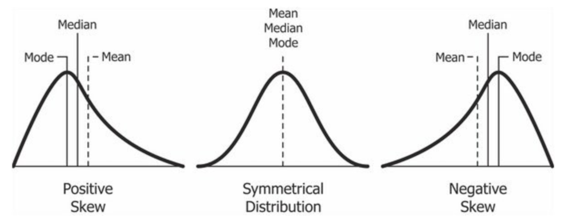

Summarizing and graphing data part II
========================================================
date: 02/04/2020
autosize: true
incremental: true
width: 1920
height: 1080

<h2 style="text-align:left"> Instructions:</h2>

Use the left and right arrow keys to navigate the presentation forward and backward respectively.  You can also use the arrows at the bottom right of the screen to navigate with a mouse. 

========================================================

<h2>Outline</h2>

* The following topics will be covered in this lecture:
  * Additional visual summaries of data
  * Scatter plots
  * Correlation
  * Regression
  * Measures of center
  
========================================================

## Frequency distributions

Courtesy of Mario Triola, <em>Essentials of Statistics</em>, 5th edition

<ul>
  <li> <b>Frequency distribution (or frequency table)</b> shows how data
are partitioned among several categories (or classes).</li>
  <li>We list the categories along with the number (frequency) of data values in each of them.</li>
  <li>For all the observations in the original data table, we:</li>
  <ol>
    <li><strong>Identify which partition or class that the observation belongs to.</strong></li>
    <ul>
      <li>E.g., if we look at an observation with IQ score of 100, this belongs to the class "90-109".</li>
      </ul>
    <li><strong>Tally the number of observations that belong to a class.</strong></li>
    <ul>
      <li>E.g., we look back over the entire table of raw data and count how many observations belong to the class "90-109".  This was 35 observations.</li>
    </ul>
    </ul>
  </ol>
</ul>

<ul>
  <li>One key concept with fequency distributions is the <b>partition</b> of the data.</li>
  <li>It is important that all the <b>classes</b> of the data are <b>disjoint and exhaustive</b>.</li>
  <ul>
    <li>That is to say, <strong>all sample data belongs to one and only one class</strong>.</li>
  </ul>
</ul>

Courtesy of Mario Triola, <em>Essentials of Statistics</em>, 5th edition

  
========================================================

## Histograms

Courtesy of Mario Triola, <em>Essentials of Statistics</em>, 5th edition

<ul>
  <li><b>Histograms</b> -- these are just graphical versions of frequency distributions.</li>
  <ul>
    <li>These consist of bars of equal width corresponding to the class width of each data class.</li>
    <li>The horizontal scale is the range of values for the data, separated into the distinct data classes.</li>
    <li>The heights of the bars are just the frequency of the observations within the class.</li>
    <li>Therefore, the two summaries of the data are totally equivalent:</li>
    <ul>
      <li>The widths of the bars and the range of the data is taken from the left column.</li>
      <li>The heights of the bars are taken from the right column.</li>
    </ul>
    <li>We note, the scale for the vertical axis can also be given in <b>relative frequency</b> (percent or proportion units).</li>
    <li>The change of scale between a histogram and a relative frequency histogram is equivalent to the way we change scale between frequency distributions and relative frequency distributions.</li  >
  </ul>
</ul>

========================================================

## Frequency polygons

Courtesy of Mario Triola, <em>Essentials of Statistics</em>, 5th edition

<ul>
  <li><b>Frequency polygons</b> are almost identical to histograms, and provide a graphical tool to visualize frequency distributions.</li>
  <li>Rather than using bars, dots are plotted above the class midpoints.</li>
  <li>Lines then connect the dots across the data classes.</li>
  <li>The same change of units to relative frequency can be performed for frequency polygons, as on the <b>relative frequency polygon</b> on the right-hand-side.</li>
</ul>

========================================================

## Cumulative frequency distributions

Courtesy of Mario Triola, <em>Essentials of Statistics</em>, 5th edition

<ul>
  <li> Another variation of a frequency distribution is a <b>cumulative frequency distribution</b>. </li>
  <li> By cumuluative we mean,
 <blockquote>
 <b>Cumulative</b> -- acquired by or resulting from accumulation, i.e., growth acquired by repeated addition of elements. 
 </blockquote></li>
  <li> In this case, we will look at how the <strong>frequency of events accumulate as we look at successive class limits</strong>.</li>
  <li> Using the original frequencies on the left-hand-side, </li>
  <li>we add 2 + 33 to get 35 as the <b>cumulative</b> value in the second row of the right-hand-side.</li>
</ul>

  

Courtesy of Mario Triola, <em>Essentials of Statistics</em>, 5th edition

<ul>
<li>For the third row in the cumulative frequency distribution, we add 2 + 33 + 35 to get the new <b>cumulative</b> value.</li>
<li> This process continues until we have exhausted all classes.</li>
<li> <b>Note:</b> the class limits on the right-hand-side are replaced by "less than" expressions that describe the new ranges of values.</li>
</ul>

========================================================

## Ogive

Courtesy of Mario Triola, <em>Essentials of Statistics</em>, 5th edition

<ul>
  <li>An <b>ogive</b> is an extension of a frequency polygon to a <strong>cumulative frequency polygon</strong>.</li>
  <li>Dots are plotted at each <strong>class boundary</strong> to indicate the frequency that measurments are <b>less than certain values</b>.</li>
  <li>Lines once again connect the dots.</li> 
</ul>

  

Courtesy of Mario Triola, <em>Essentials of Statistics</em>, 5th edition

========================================================

## Dot plots and Stem and Leaf plots

Courtesy of Mario Triola, <em>Essentials of Statistics</em>, 5th edition

<ul>
  <li><b>Dot plots</b> and <b>stem and leaf plots</b> are both graphical representations of frequency distributions, like histograms.</li>
  <li><b>Dot plots</b> and <b>stem and leaf plots</b> are both conceptually very similar.</li>
  <li>Every observation will be represented by one dot or digit in each of the above.</li>  
  <li>Also, every observation can be identified exactly on the numerical scale of interest.</li>
  <li>The primary difference between a dot plot and a stem and leaf plot is as follows:</li>
  <ul>
    <li><b>Dot plot</b> -- one dot is placed above the precise numerical value.</li>
    <li><b>Stem and leaf plot</b> -- we organize numerical observations into units of 10 (or up to another leading numerical unit).  For each observation, we then <strong>place its final digit behind the leading unit</strong>.</li>
    <ul>
      <li>This approach allows us to loosely organize data into different classes (the leading unit) and then identify every data point within the class (by the trailing digit).</li>
    </ul>
  </ul>
  <li><b>Discuss with a neighbor:</b> how many observations are between 120 and 129?  What are their values?</li>
  <ul>
    <li>There are three, will values 120, 125, and 128.</li>  
  </ul>
</ul>

========================================================

## Pictrograms versus bar charts

Courtesy of Mario Triola, <em>Essentials of Statistics</em>, 5th edition

<ul>
  <li><b>Pictograms</b> use pictures to display data -- these can be popular, but if done poorly can be very difficult to interpret.</li>
  <li>The pictogram and the bar chart to the left actually present the same data.</li>
  <li><b>Discuss with a neighbor:</b> if you didn't have the bar chart, could you interpret the pictrogram?  What is lacking to interpret it?</li>
  <ul>
    <li>The biggest issues with the pictogram versus the bar chart is the lack of units of comparison.</li>
    <li>For example, we don't know if there are the same number of passengers in 1984 and 2010, but they are larger in 2010.</li>
    <li>Likewise, we cannot make a quantitative comparision without having a scale for the units as in the bar chart.</li>
  </ul>
</ul>

========================================================

## Time series

Courtesy of Mario Triola, <em>Essentials of Statistics</em>, 5th edition

<ul>
  <li>When we are looking at the <strong>evolution</strong> of a particular quantity over a time-ordered measurements, this is called a <b>time series</b>.</li>
  <li>Usually, these are given by of <strong>time-stamped measurements at fixed intervals</strong>.</li>
  <li>Particularly, this kind of graph helps us detect patterns in the time-evolution of the quantity.</li>
</ul>

========================================================

## Scatter plots

Courtesy of Mario Triola, <em>Essentials of Statistics</em>, 5th edition

<ul>
  <li><b>Scatter plots</b> -- these plots are used to <strong>plot matching pairs of quantitative observations</strong>.</li>
  <li>This can be especially useful to determine if to variables are <b>correlated</b>.</li>
  <ul>
    <li>We will discuss correlation more in depth later but for now it can be read loosely:
    <blockquote>
    Variable $x$ is (correlated/ anti-correlated) with variable $y$ if they tend to vary  (together / oppositely).
    </blockquote></li>
  </ul>
  <li><b>Discuss with a neighbor:</b> which of the two above scatter plots evidences <b>correlation</b>?</li>
  <ul>
    <li>It appears that <strong>increase in waist circumference tends to go along with an increase in arm circumference</strong>, so these variables appear <b>correlated</b>.</li>
    <li>An increase in weight doesn't generally go along with an increase (or decrease) in pulse rate, so they don't appear correlated (or anti-correlated).
  </ul>
</ul>

========================================================

## Correlation

Courtesy of Mario Triola, <em>Essentials of Statistics</em>, 5th edition

<ul>
  <li>More formally, we will give <b>correlation</b> a numerical value $r$.</li>
  <ul>
    <li>We define the quantity $r$ to be the <b>linear correlation coefficient / Pearson correlation </b>, measuring the strength of how two variables vary together or oppositely.</li>
  </ul>
  <li>This value will be bounded between $\pm 1$, so that it always lives in the interval $[-1,1]$.</li>
  <li>When the value $r$ is <strong>close to $\pm 1$</strong> we consider the variables to vary together (or oppositely) consistently.</li>
  <li>When the value $r$ is <strong>close to zero</strong> we consider the variables to not vary together (or oppositely) consistently. For example:</li>  
  <ul>
    <li>The linear correlation coefficient $r=0.802$ for the plot on the left.</li>
    <li>The linear correlation coefficient $r=0.082$ for the plot on the right.</li>
  </ul>
</ul>

========================================================

### Critical values for correlation
  

Courtesy of Mario Triola, <em>Essentials of Statistics</em>, 6th edition

<ul>
  <li>In order to say <strong>how close to $\pm 1$ is close enough for $r$</strong> to indicate correlation, we will want to develop some tools.</li>
  <li>On the left are measurements for the shoe print length and height of five individuals.</li>
  <li>The linear correlation coefficient in this case $r\approx0.591$ isn't close to $\pm 1$ or $0$.</li> 
  <li>If we only looked at the value of $r$, we might have a hard time telling if there is an <strong>interesting relationship</strong>.</li>
  <li><b>NOTE:</b> strong (anti-)correlation does not imply causation, only perhaps an interesting relationship to study.</li>
  <li>Notice in the figure, we also list the <b>critical values</b> for $r$.</li>
</ul>

<ul>
  <li>Critical values are one of the tools for deciding if this relationship is truly interesting.</li>
  <li>If the linear correlation coefficient $r$ is <strong>at least as extreme</strong> as the critical values, we can conclude that there is <b>statistical significance</b>.</li>
  <li>The critical values above are $\approx \pm 0.878$, but $r$ is not as close to $\pm 1$ as the critical values.</li>
</ul>

========================================================

### Critical values for correlation continued

Courtesy of Mario Triola, <em>Essentials of Statistics</em>, 5th edition

<ul>
  <li>We can consider graphically <strong>"how extreme"</strong> the linear correlation coefficient is compared to the <b>critical value</b>.</li> 
  <li>For each number of pairs of measurements, there is an associated <b>critical value</b> that will determine the significance of the correlation.</li>
  <li>We measured five individuals, getting five pairs of measurements with the corresponding critical value.</li>
</ul>

  

Courtesy of Mario Triola, <em>Essentials of Statistics</em>, 5th edition

<ul>
  <li>This critical value corresponds to the <b>inner window of "no correlation"</b> in the diagram on the right-hand-side.</li> 
</ul>

<ul>
  <li>For any linear correlation coefficient <strong>(computed on 5 pairs of measurements)</strong> that isn't at least as extreme as $\pm 0.878$, </li>
  <ul>
    <li><b>we will say the pair of variables are not correlated</b>.</li>   
  </ul>
  <li>If the linear correlation coefficient <strong>(computed on 5 pairs of measurements)</strong> lies in either $[-1,-0.878]$ or $[0.878,1]$</li>
  <ul>
    <li><b>we will say the pair of variables are correlated</b>.</li>
  </ul>
  <li>This is what is meant by <strong>"the sample value must be at least as extreme as the critical value to be significant"</strong>.</li>
</ul>

========================================================

### Critical values for correlation continued

Courtesy of Mario Triola, <em>Essentials of Statistics</em>, 5th edition

Courtesy of Mario Triola, <em>Essentials of Statistics</em>, 5th edition

<ul>
  <li>Above, we have seven measurements of different cars' weights and highway miles per gallon gas consumption.</li>
  <li>Suppose we use software to compute that the linear correlation coefficient is $r \approx -0.987$.</li> 
  <li><b>Discuss with a neighbor:</b> using the table to the left of the critical values, can you determine if we would call the car weight and highway miles per gallon fuel consumption (anti)-correlated?  If so, what does this relationship signify?</li>
</ul>

<ul>
  <li>We note that there are 7 pairs of measurements, so the corresponding critical value is $0.754$.</li>
  <ul>
    <li>The linear correlation coefficient $-0.987$ is more extreme than $-0.754$, so we say the variables are correlated.</li>
  </ul>
  <li>We recall, the negative sign for the correlation coefficient means that the variables of weight and highway MPG <strong>vary together oppositely</strong> ; </li>
  <ul>
    <li>i.e., <strong>as the weight goes up, the highway MPG goes down</strong>.</li>
  </ul>
</ul>

========================================================

### P-values for correlation

  

Courtesy of Mario Triola, <em>Essentials of Statistics</em>, 6th edition

<ul>
  <li>A strongly related concept to critical values are <b>p-values</b></li>
  <li>As a thought experiment, consider the following.</li>
  <ul>
    <li>In this example we are trying to determine if there is <strong>correlation between height and shoe print lenght.</strong></li>
    <li>Suppose we <strong>assume the null hypothesis</strong>, that is, assume that there is no correlation between these variables.</li> 
    <li>The <b>p-value</b> is the probability of getting a linear correlation coefficient $r$ at least as extreme as the one we computed, <strong>when there is no correlation present</strong>.</li>
    <li>Intuitively, it measures <strong>"how suprising it would be"</strong> computing such a linear correlation coefficient $r$ in the case there is no statistically interesting relationship between the variables.</li> 
  </ul>
</ul>

<ul>
  <li>When a <b>p-value is large</b> this says that <strong>getting the value by chance is quite likely</strong>.</li>
  <li>The p-value above is $\approx 0.293$, so that five random pairs of uncorrelated measurements would have as large, or larger, of linear correlation coefficient ($r\approx 0.591$)  almost $30\%$ of the time.</li>
</ul>

========================================================

### P-values for correlation

    

Courtesy of Mario Triola, <em>Essentials of Statistics</em>, 6th edition

<ul>
  <li><b>Note:</b> <strong>the linear correlation coefficient depends on the sample data</strong>.</li>
  <ul>
    <li>If we take measurements of the height and shoe print of five new people, <b>we will quite likely get a different linear correlation coefficient</b>.</li>
  </ul>
  <li>Also, the <strong>critical values and p-values depend on the number of samples</strong>.</li>  
  <li>In the plot to the left, there are 40 total subject for whom we have pairs of measurements.</li>  
  <li><b>Discuss with a neighbor:</b> does the relationship between height and shoe print length show more evidence of correlation now?  Do you think the linear correlation coefficient will be close to $1$, $-1$ or to $0$?</li>
</ul>

<ul>
  <li>In this case, the linear correlation coefficient is $\approx 0.813$ suggesting that the varialbes are positively correlated.</li>
  <li><b>Note:</b> $r$ is not as extreme as the critical value of $0.878$ from before -- <b>however, this critical value was for $5$ samples only</b>.
  <li>The critical value for $40$ samples is approximately $0.304$, so a coefficient of $0.813$ is much more extreme.</li>  
  <li>Likewise, the p-value is $\approx 0$ so there is very little probability of seeing such a correlation coefficient just by chance;</li>
  <ul>
    <li><b>usually we say there should be at most $5\%$ chance</b>.</li>  
  </ul> 
</ul>

========================================================

## Regression

Courtesy of Mario Triola, <em>Essentials of Statistics</em>, 6th edition

<ul>
  <li>One of the most useful ways we can interpret data is in terms of the "trend" in the data.</li>
  <li>Noting that there was correlation in height and shoe print length, we could say,
  <blockquote>
  "On average, an increase in someone's height usually goes along with an increase in their shoe print length (and vice versa)."
  </blockquote>
  </li>
  <li>A <b>regression line (or best fit line)</b> quantifies what this trend looks like.</li> 
  <li>Recall the equation for a line,
  $$y = {\color{red} a} +{\color{blue} b}x$$</li>
  <ul>
    <li><b style="color:red">The coefficient $a$ is the intercept.</b></li>
    <ul>
      <li>When the quantity $x$ is zero, then $y = {\color{red} a}$.</li>
    </ul>
    <li><b style="color:blue">The coefficient $b$ is the slope.</b></li>
    <ul>
      <li>An increase of 1 unit of variable $x$ corresponds to ${\color{blue} b}$ units of increase in  $y$.</li>
    </ul>
  </ul> 
</ul>

========================================================

### Regression continued

Courtesy of Mario Triola, <em>Essentials of Statistics</em>, 6th edition

<ul>
  <li> In regression, we write the equation for a line in a special form:
  $$\hat{y} = {\color{red} {b_0} } + {\color{blue} {b_1} } x,$$
  where we re-name the variables as:</li>
  <ul>
    <li>$y$ -- this is called the <b>response</b>;</li>
    <li>$x$ -- this is called the <b>predictor</b>;</li>
    <li>${\color{red} a}$ -- this is re-named ${\color{red} {b_0} }$; and </li>
    <li>${\color{blue} b}$ -- this is re-named ${\color{blue} {b_1} }$.</li>
  </ul>
  <li>In our example, we could use software to compute</li>
  <ul>
    <li>${\color{red} {b_0} \approx 80.9}$; and</li>
    <li>${\color{blue} {b_1} \approx 3.22}$.</li>  
  </ul>
   <li>The regression equation would then be read,
  $$\hat{y}_\text{(Height)} = {\color{red} {80.9} } + {\color{blue} {3.22} } x_\text{(Shoe print length)}.$$</li>
</ul>

========================================================

## Characteristics of data

Courtesy of M. W. Toews <a href="https://creativecommons.org/licenses/by/2.5" target="blank">CC</a> via  
        <a href="https://commons.wikimedia.org/wiki/File:Standard_deviation_diagram.svg"> Wikimedia Commons</a>. 

<ul>
  <li>Recall, we try to characterize data by a number of the features that it exhibits.</li>
  <li>Some of the key measures are:</li>
  <ol>
    <li> <b>Center:</b> A representative value that indicates where the middle of the data set
is located.</li>
    <li> <b>Variation:</b> A measure of the amount that the data values vary.</li>
    <li> <b>Distribution:</b> The nature or shape of the spread of the data over the range of values (such as bell-shaped). </li>
    <li> <b>Outliers:</b> Sample values that lie very far away from the vast majority of the
other sample values.</li>
    <li> <b>Time:</b> Any change in the characteristics of the data over time.</li>
  </ol>
</ul>

<ul>  
  <li>We will now begin studying measures of center.</li>
  <li>There are several main measures of center of a data set:</li>
  <ol>
    <li><b>mean</b>;</li>
    <li><b>median</b>;</li>
    <li><b>mode</b>; and</li>
    <li><b>midrange</b>.</li>
    </ol>
    <li>Each of these usually gives a different view of where the "most central point" of the data lies.</li> 
</ul>

========================================================

## Mean

* The <b>(arithmetic sample) mean</b> is usually the most important measure of center.

* Suppose we have $n$ total sample measurements of some variable $x$.

  * We will denote these samples $x_1, x_2, \cdots, x_n$
  
* Then, the <b>(arithmetic sample) mean is defined</b>
  
  $$\text{Sample mean} = \frac{x_1  +x_2 +\cdots + x_n}{n}= \frac{\sum_{i=1}^n x_i}{n} $$
  
* <b>Discuss with a neighbor:</b> is the sample mean a statistic or a parameter?

  * <b>A:</b> the sample mean is computed from samples and thus a statistic.
  
  * For this reason, if we took new measurements from a new sample of the population, we could get a different value.
  
  * <strong>The random difference between the sample mean and the mean of the true population mean is called sampling error</strong>.
  
* An important property of the sample mean is that it tends to vary less over re-sampling than other statistics.

  * That is, it tends to stay close to the same value.
  
*  However, the sample mean is very sensitive to outliers.

  * If outliers exist in the data, the mean can be drawn far away from the "main" cluster of data. 
  
* A statistic is called <b>resistant</b> if it doesn't change very much with respect to outlier data.

========================================================

## Median 

<ul>
  <li> A different notion of center is the <strong>middle of the data</strong>.</li>
  <li> For a numerical measurement, we can always <strong>order the data</strong> so that we go from low to high or high to low.</li>
  <li> <b>Median</b> -- the median is the middle of the ordered data set.</li>
  <ul>
    <li> If there are an <b>odd number of samples</b>, <strong>the median is defined as the middle value exactly</strong>.</li>
    <li> If there are an <b>even number of samples</b>, we split the data into the lower $50\%$ and upper $50\%$ of the samples;</li>
    <li> then we take the <strong>median to be the mean of</strong> the:</li>
    <ol>
      <li><b>largest of the lower $50\%$</b>; and</li>
      <li><b>smallest of the upper $50\%$</b>.</li>
    </ol>
  </ul>
  <li>Suppose we are given a list of the following samples $22, 22, 26, 24, 23$.
  <ul>
    <li><b>Discuss with a neighbor:</b> what is the median of this list of samples?</li>
    <li>Ordering the values, we get $22, 22, 23, 24, 26$ so that the middle value is obviously $23$.</li>
  </ul>
  <li>Suppose a new sample includes $22, 22, 26, 24, 23, 27$.</li>
  <ul>
    <li><b>Discuss with a neighbor:</b> what is the median of this list of samples?</li>
    <li>In this case, we have an even number of samples.</li>
    <li> The lower $50\%$ is given by $22,22,23$ and the upper $50\%$ is given by $24,26,27$.</li>
    <li>Therefore, the <strong>mean of the largest lower value and the smallest upper value</strong> is given by
    $$\frac{23 + 24}{2} = 23.5$$.</li>
    </ul>
</ul>

========================================================

## Mode 

* Another notion of the most "central" point in the data can be the value that is most frequently found.

* <b>Mode</b> -- the mode is the value that is most frequent in the data.

* Consider the last example with samples of $22, 22, 26, 24, 23, 27$. <b>Q:</b> What is the mode?

  * In this case, we sampled $22$ more than any other value, so this is the mode of the data.
  
* When two or more values have the highest frequency, we call the data <b>bi-modal</b> or <b>multi-modal</b>.

  * An exception to this above rule is when no values are repeated.
  
  * In this case, we say there is no mode to the data.

========================================================

## Differences in mean, median and mode

Courtesy of Diva Jain <a href="https://creativecommons.org/licenses/by-sa/4.0" target="blank">CC</a> via <a href="https://commons.wikimedia.org/wiki/File:Relationship_between_mean_and_median_under_different_skewness.png"> Wikimedia Commons</a>. 

<ul>
  <li>Usually, the mean, median and mode tell us different characteristics of what we call the "center" of the data.</li>
  <li>In the <strong>special case when data is normal, these coincide</strong>.</li>
  <li>In the left, we see data that is all uni-modal, but with three different cases.</li>
  <li>In the left case, we have right skewness:
  <ul>
    <li>Here, the mean and median are discplaced to the right away from the mode.</li>
    <li>Additionally, the mean and median do not match.</li>
  </ul>
</ul>

<ul>
  <li>In the right case, we have left skewness:</li>
  <ul>
    <li> In this case, the mean and the median are skewed to the left away from the mode.</li>
  </ul>
  <li><b>Note:</b> the precise location of the mean and median do not need to hold this way for all skew distributions -- this is only one example of how this can look.</li>  
  <li><strong>"Physically", the mean corresponds to the center of mass of the distribution, if each observation is weighted by the measurement value.</strong></li>
  <li>Even if $50\%$ of values lie above and below the median, the <b>weights</b> of the observations can move the mean away from the median.</li>   
</ul>

========================================================

### Differences in mean, median and mode example

* 11 football players from the Seattle Seahawks were randomly sampled for their weight in pounts.

* The sampes are $189, 254, 235, 225, 190, 305, 195, 202, 190, 252, 305$.

* <b>Discuss with a neighbor:</b> what are the mean, median and mode of this data?  Does the data appear to be normally distributed?  Why?

* Here the mean is given by
 $$\frac{189+254+235+225+190+305+195+202+190+252+305}{11} \approx 231.09.$$
 
* The ordered data is given by $189, 190, 190, 195, 202, 225, 235, 252, 254, 305, 305$.
 
* The number of samples is odd, so the middle value can be identified as $225$.

* The data also has <b>two modes</b>, $190$ and $305$.

* Overall, the data appears to be non-normal, as there are many values around $190$, with a long tail into the upper values.

  * Moreover, the probability of extreme values (weight over $300$) is relatively high.

========================================================

### Differences in mean, median and mode example

<ul>
  <li>If we make a histogram of the data, we see indeed, there is non-normal structure.</li>
  <li>Even though the mean and the median are close, the multi-modes is not ever a normal structure in data.</li>
  <li>Examining each of the values together, along with the visual plot, tells us a lot about the data.</li>
  <li>This also shows how each of the descriptions of <b>center</b> can be flawed and / or give a different picture.</li>
</ul>

  <li>Here, the modes aren't really "central" values in some sense, especially the upper mode.</li>
  <li>The median and mean give similar values, but the mean is more sensitive to the large outliers.</li>
  <ul>
    <li>Therefore, the mean is larger than the median in this example.</li>
  </ul>
</ul>

========================================================

### When are mean, median and mode useful

* <b>Discuss with a neighbor:</b> for each of the following, identify a major reason why the mean and median are not meaningful statistics.

 * The zip codes of the White House, Air Force division of the Pentagon, Empire State Building, and Statue of Liberty: 20500, 20330, 10118, 10004.
 
 * <b>A:</b> Zip codes are just category labels that have no actual quantitative meaning.  For example, taking the mean of <b style="color:red">red</b>, <b style="color:green">green</b> and <b style="color:blue">blue</b> has no mathematical meanining in the same way.

 * Rank (by sales) of selected statistics textbooks: 1, 4, 5, 3, 2, 15.

 * <b>A:</b> although these are ordered values, so intercomparision makes sens, mathematical operations are not useful.  For example, it doesn't make any sense to say the average of the first place textbook and the fifth place text book is a third place text book in sales.
 
 * The most selling textbook may sell many more copies than the second place one, so that their rankings don't exactly correspond to a physical quantity of anything.

========================================================

## Midrange 

* As a final measure of center, we can consider what is the mid-point between the maximum observation and the minimum observation.

* <b>Midrange</b> -- suppose we have samples $x_1,\cdots, x_n$ and

  $$\begin{align}
  x_\text{max} = \max_i(x_i) & & x_\text{min} = \min_i(x_i) 
  \end{align}$$
  
* Then, the midrange is computed as
  
  $$\text{midrange} = \frac{x_\text{max} + x_\text{min} }{2}$$
  
* <b>Discuss with your neighbor:</b> can you give an example of when the midrange does not equal the median?

  * <b>A:</b> a simple example is where we have data $0,0,0,0,100$.
  
  * In this case, the median is $0$, while the midrange is $\frac{100 + 0 }{2} = 50$.
  
* As we can see, <strong>midrange is extremely sensitive to outliers, both small and large</strong>.

* Midrange is not used as often as the other measures in practice, but it can give a more complete picture of the data when used with the other measures.

========================================================

## Round off rules

<ul>
  <li>In many cases, we will need to use approximations to caclulate these values;</li>
  <ul>
    <li>usually some kind of rounding will be used for computing, e.g., the mean.</li>
  </ul>
  <li> Some key considerations are the following:</li>
  <ol>
    <li><b>Never round any values until the final step.</b>  We only want to use an approximation in the final computation estimating the statistic.</li>
    <ul>
      <li>For example, with data $2.5, 3.7, 4.9$ we should compute the mean as,
      $$\frac{2.5 + 3.7 + 4.8}{3} = \frac{11}{3} = 3 + \frac{2}{3} \approx 3.66.$$</li>
      <li>If we round any values before the final step, such as
      $$\frac{2.5 + 3.7 + 4.8}{3} \approx \frac{3 + 4 + 5}{3} = \frac{12}{3} = 4,$$
      we can get a very bad approximation.
    </ul>
    <li><b>For the mean, median, and midrange, carry one more decimal place than is present in the original set of values.</b></li>
    <li><b>For the mode, keep the value as is without any kind of  rounding.</b></li>

  </ol>
</ul>
