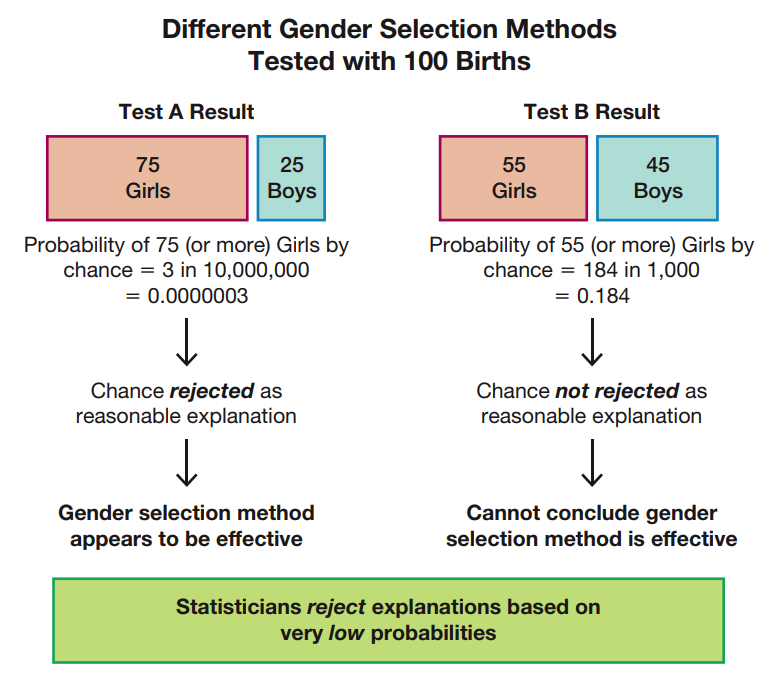
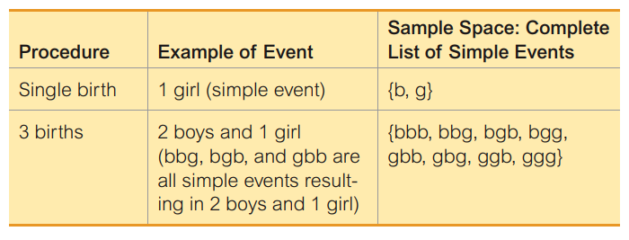
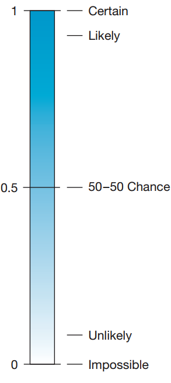
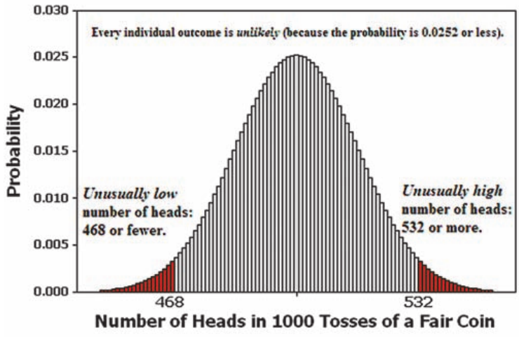

Fundamentals of probability
========================================================
date: 02/18/2020
autosize: true
incremental: true
width: 1920
height: 1080

<h2 style="text-align:left"> Instructions:</h2>

Use the left and right arrow keys to navigate the presentation forward and backward respectively.  You can also use the arrows at the bottom right of the screen to navigate with a mouse. 

========================================================

<h2>Outline</h2>

* The following topics will be covered in this lecture:
  * Events
  * Sample spaces
  * Classical version of probability
  * Relative frequency approximation of probability
  * Probabilistic reasoning
  * Complements of events
  * Odds
  * Compound events
  

========================================================

## Basics of probability

* In order to interpret a <b style="color:#1b9e77">population</b> from a <b style="color:#d95f02">sample</b>, we required that the sample was <strong>representative of the full population</strong>.

  * Using random chance to mix the participants in the samples was one way of ensuring that the smaller <b style="color:#d95f02">sample</b> would be a <strong>good approximation</strong> of the <b style="color:#1b9e77">population</b>.
 
* However, in any <b style="color:#d95f02">sample</b> there is natural variation amongst those sampled that leads to <strong>two repeated samples not to look like eachother</strong>.

  * One of the important considerations is thus, how likely would it be to compute a <b style="color:#d95f02">sample statistic</b> just by chance, due to the natural variation of resampling?
  
* <b>Inferential statistics</b> are differentiated from the <b>descriptive statistics</b> we have seen so far in how they address this above question.

  * Descriptive statistics help us learn about the sample we have in hand, but we must use tools from <strong>probability to address how these results might generalize to a wider population</strong>.

* One of the most important tools we will learn in this class is <b>hypothesis testing</b>, as one way to test if a claim might be infered about the wider population.

 
========================================================

### Basics of probability example

Courtesy of Mario Triola, <em>Essentials of Statistics</em>, 6th edition

<ul>
   <li>We can take a basic example to illustrate this point.</li>
   <li> Suppose a clinical trial will be used to determine if a certain fertility treatment will increase the chance that a pregnancy will result in a female birth.</li>
   <li>There is some random chance involved in an un-assisted pregnancy whether the baby will be a girl or boy, and either result is about as likely as the other.</li>
   <ul>
      <li>Therefore, every group of $100$ births in a control group might look quite different.</li>
   </ul>
   <li>We want to find a way to be more confident that if there is an effect of the treatment, it can be distinguished from this random variation.</li> 
   <li>Formally we will make a <b>claim</b> and a <b>hypothesis</b>:</li>
   <ul>
      <li><b>Claim</b>: the fertility treatment will greatly increase the chance of a baby being born a girl over the control group.</li>
      <li><b>Hypothesis</b>: the treatment has no effect and it is equally likely that a pregnancy will result in a female or a male birth under the treatment.</li>
   </ul>
</ul>

<ul>
   <li><b>Note</b>: in the above, we take the <b>null hypothesis</b>, i.e., <strong>to test the claim we assume that it is not true and then evaluate the results</strong>.</li>
</ul>

========================================================

### Basics of probability example

Courtesy of Mario Triola, <em>Essentials of Statistics</em>, 6th edition

<ul>
   <li>The purpose of the null hypothesis is to evaluate if it was likely to <strong>see our results by the natural variation in any batch of samples</strong>.</li>
   <li>Let's suppose there are two different treatments, <b>Treatment A</b> and <b>Treatment B</b> with results in the figure to the left.</li>
   <li>Let us suppose that $100$ pregnancies are given <b>Treatment A</b>:</li>
   <ul>  
      <li>Under Treatment A, we suppose that out of $100$ pregnacies, $75$ girls were born and $25$ boys were born.</li>
      <li>Our null hypothesis is that even under the treatment, a female or male birth were equally likely.</li>
      <li>Threrefore, we evaluate that the chance to get <strong>at least $75$ female births out of $100$ births</strong> (with equally likely probability of a female or male) is about $3\times 10^{-7}$ or three in ten millon.</li>
      <li>Under the assumption that either a female or male birth was equally likely, this is an extremely unlikely event.</li>
      <li>We therefore will reject our original hypothesis, because <strong>seeing this result by chance sampling variation would be extremely unlikely</strong>.</li>
   </ul>
</ul>

<ul>
   <li>This is once again the meaning of a <b>statistically significant / interesting event</b>, so we <strong>conclude that the treatment appears to be effective</strong>.</li>
</ul>

========================================================

### Basics of probability example

Courtesy of Mario Triola, <em>Essentials of Statistics</em>, 6th edition

<ul>
   <li>We will now suppose that $100$ pregnancies are given <b>Treatement B</b>:</li>
   <ul>
      <li>We suppose that the $100$ pregnancies result in $55$ female and $45$ male births.</li>
      <li>Our null hypothesis is that even under the treatment, a female or male birth were equally likely.</li>
      <li>Threrefore, we evaluate that the chance to get <strong>at least $55$ female births out of $100$ births</strong> (with equally likely probability of a female or male) is about $0.184$.</li>
      <ul>
         <li>That is, if we resampled a control group with no treatment, <strong>we would get this result in almost one out of five sample control groups</strong>.</li>
      </ul>
      <li>If it is so <strong>likely to see such a result by natural variation in sampling, we fail to reject chance (the null hypothesis) as the explanation</strong>.</li>
      <li>Therefore, we cannot conclude that the treatment was effective given the probability of seeing a result at least this extreme by chance.</li>
   </ul>
</ul>

<ul>
   <li><b>Note</b>: it is our understanding of probability that lets us tell something about how the statistics from this small <b style="color:#d95f02">sample</b> might generalize to the whole <b style="color:#1b9e77">population</b>.</li>  
</ul>

========================================================

## Probability vocabulary

Courtesy of Mario Triola, <em>Essentials of Statistics</em>, 6th edition

<ul>
   <li>In order to make mathematical statements, we will need to introduce some vocabulary about probability.</li>
   <li>Suppose we want to consider a future result of some procedure for which the outcome is unkown -- e.g. the gender of some number of births.</li>
   <li> <b>Event</b> -- an event is any collection of results or outcomes of this procedure.</li>
   <ul>
      <li>As an easy example, we can consider the process of "gender of one birth".</li>
</ul>

<ul>
   <ul>
      <li>This is a process that has some randomness, where we will encode possible outcomes as:</li>
      <ol>
         <li>$g$ -- female birth; and</li>
         <li>$b$ -- male birth.</li>
      </ol>
      <li>An example of an event for "gender of one birth" is "one girl" $\{g\}$.</li>
      <li>Another example of an event for "gender of one birth" is "one boy" $\{b\}$.</li>
      <li>For simplicity, we will exclude other possible outcomes and consider these as the only two possible events for "gender of one birth".</li>
   </ul>
</ul> 

========================================================

### Probability vocabulary continued

Courtesy of Mario Triola, <em>Essentials of Statistics</em>, 6th edition

<ul>
   <li><b>Simple event</b> -- a simple event is an event that cannot be broken into simpler parts.</li>
   <li>To understand a <b>simple event</b> we will need to consider a more complicated process.</li>
   <li>Suppose our new process is "genders of three births".</li>
   <li>We note, the outcome $1$ female and $2$ male births is an event of this process.</li>
   <ul>
</ul>

<ul>
   <li>However, the event $1$ female and $2$ male births can be broken up into three possible    <b>simple events</b>:</li>
   <ol>
      <li>$\{bbg\}$;</li>
      <li>$\{bgb\}$; and</li>
      <li>$\{gbb\}$.</li>
   </ol>
   <li>That is, the event $1$ female $2$ male births has be one of the above <strong>simple events that are outcomes of the process</strong> "genders of three births".</li>
   <li><b>Note</b>: we do not consider $\{g\}$ or $\{b\}$ to be simple events for this process -- indeed, these correspond to only one birth which are not outcomes of "genders of three births".</li>
   <li>The reasoning behind classifying events in this was is so that we can count all possible ways we can observe a complex event like "$1$ female and $2$ male births" from our known possiblities.</li>
</ul>

========================================================

### Probability vocabulary continued

Courtesy of Mario Triola, <em>Essentials of Statistics</em>, 6th edition

<ul>
   <li><b>Sample space</b> -- this is the collection of all simple events.</li>
   <ul>
      <li>For example, all simple events for "genders of one birth" are $\{b,g\}$.</li>
      <li>On the other hand, all simple events for "genders of three births" are,
      $$\{bbb, bbg, bgb, bgg, gbb, gbg, ggb, ggg\},$$
      i.e., all possible combinations of three births in our simplified model. 
      </li>
   </ul>
</ul>

<ul>
   <li>The reason for collecting all possible simple events into a sample space is because for many problems, this is a natural way to compute probabilities.</li>
   <ul>
      <li>If we can describe all the ways an event $A$ can occur among simple events relative to the total number of simple events, we can decide how often it is likely to observe $A$.</li>
   </ul>
   <li>Historically, <strong>probability was developed as a science in understanding games of chance</strong>.</li>
   <li>For example, computing the probability of rolling an <b>even number on a fair, six-sided die</b>, we can compute this directly.</li>
   <li>We know exactly all possible simple events (rolling $1$ through $6$), how many ways we can roll an even number ($2,4,6$ so three ways), and <b>with all sides equally likely</b>, the chance is $\frac{3}{6}$.</li>
   <li>This kind of logic is the basis of <b>classical probability</b>, though there are ways this approach might not work (non-fair dice) and for this we will develop some tools to make probabilistic statements.</li>
</ul>

========================================================

## Classical approach to probability

Courtesy of Mario Triola, <em>Essentials of Statistics</em>, 6th edition

<ul>
   <li>We will generally denote some event by a capital letter, e.g.,</li>
   <ul>
      <li>$A$="one female birth, two male births".</li>
   </ul>
   <li>Then, we will denote the probability of some event $P(A)$ -- this can be read as "the probability of $A$ occuring".</li>
   <li>The <b>classical approach to probability</b> thus uses the <strong>assumption that all events in the sample space are equally likely</strong>.</li>
   <ul>
      <li>This should be like, e.g., <strong>rolling a fair die</strong>.</li>
   </ul>
</ul>

<ul>
   <li>The <b>classical approach</b> to proability thus gives the formula,  
   $$P(A) = \frac{\text{Number of ways for }A\text{ to occur}}{\text{Number of simple events}}$$
   </li>
   <li>Let's <strong>assume that in this example all simple events are equally likely</strong>;</li>
   <li><b>Discuss with a neighbor:</b> what is the probability of $A$="one female birth, two male births" using the classical approach?</li>
   <ul>
      <li>Using the above table, we see there are three ways $A$ can occur   
      $$\{bbg,bgb,gbb\}.$$</li>
      <li>The <b>classical approach</b> tells us, 
      $$P(A) =\frac{3}{8}.$$</li>
   </ul>
</ul>

========================================================

### Classical approach to probability

Courtesy of Mario Triola, <em>Essentials of Statistics</em>, 6th edition

<ul>
   <li>Another classical problem in probability is as follows.</li>
   <li>Let $A=$"three births of the same gender".</li>
   <li>Let's <strong>assume that in this example all simple events are equally likely</strong>;</li>
   <li><b>Discuss with a neighbor:</b> what is the probability of $A$ using the classical approach?</li>
</ul>

<ul>
   <li>Note that there are two ways $A$ can take place from the simple events,
   $$\{bbb,ggg\}.$$</li>
   <li>Therefore, we can compute,
   $$P(A)=\frac{2}{8}= \frac{1}{4}.$$
   </li>
</ul>

========================================================

## Relative frequency approximation of probability

<ul>
   <li>The classical approach to probability works mostly for cases like games of chance, where the the sample space is limited and <strong>all outcomes are equally likely</strong>.</li>
   <li>However, many examples cannot be broken into equally likely simple events.</li>
   <ul>
      <li>Indeed, it actually is not equally likely for a birth to be either female or male, there is approximately $0.512$ probability of male.</li>
      <li>A simple counter-example is an unfair, weighted coin.</li>
      <li>We cannot accurately calculate the probability to flip a "heads" with the last rule when the coin has been weighted to come up on heads more often.</li>
   </ul>
   <li>If we don't know how the coin is weighted, a natural way to <b>approximate</b> the true probability is by <strong>replication of the process</strong>.</li>
   <ul>
      <li>For example, we can flip the coin and record whether it lands on heads or tails.</li>
      <li>Let $A=$"coin lands heads" and $B=$"coin lands tails".</li>
      <li>We will construct a frequency distribution for both of these events over many repeated flips.</li>
      <li>We will then <strong>approximate the true probability</strong> of event $A$ by the frequency of $A$ relative to all replications of the process.</li>
   </ul>
   <li>The <b>relative frequency approximation</b> is thus given as,
   $$P(A) \approx \frac{\text{Frequency event }A\text{ is observed}}{\text{Total number of times the process is repeated}}.$$</li>
   <li><b>Note</b>: this is only an approximation, and if we wanted to even closely approximate $P(A)$ for a fair coin, this <strong>requires many replications</strong>.</li>
   <li>However, this is a natural way of thinking about probability -- if we could flip a coin infinitely many times we could get the true value.</li>
</ul>

========================================================

## Probabilistic reasoning 

* More formally, this intuition is known as the "Law of large numbers".

  * If we are thinking about the fair coin flipping, as we take larger and larger approximations by the relative frequency,
  $$P(A) \approx \frac{\text{Frequency event }A\text{ is observed}}{\text{Total number of times the process is repeated}},$$
  this value will approach $.5$ with enough flips. 
  
* However, this <strong>does not imply</strong> that if we get $20$ tails in a row that we are <strong>any more likely to flip a heads</strong>.

  * This is known as the <b>gambler's fallacy</b>, where one <strong>incorrectly concludes</strong> that losing many times implies that a win is more likely.
  
* Every time we flip a fair coin, its outcome is independent of the earlier outcomes and the probability is always $50\%$ that it will land heads or tails.

  * In fact the <strong>relative frequency can go on arbitrarily large excursions</strong> away from the true probability, but the likelihood of this happening is low so that these excursions are infrequent.

* We should also note that <b>when we do not know the probability of different events</b>, <strong>it is not accurate to assign them all equal probability</strong>   .

 * For example, if we consider events $A=$"I get caught in the rain on the way to work" and $B=$"I do not get rained on", <strong>we cannot arbitrarily say that these have equal probability</strong>, i.e.,
 $$\begin{matrix} P(A) =0.5 && P(B)=0.5.\end{matrix}$$
 
 * The location of rain clouds depends strongly on land surface like mountains and atmospheric conditions like wind patterns; if I get rained on, this depends strongly on various unequal factors.   

========================================================

### Probabilistic reasoning continued

Courtesy of Mario Triola, <em>Essentials of Statistics</em>, 6th edition

<ul>
  <li>We should also think about what it meas for events to have high or low probability.</li>
  <li><b>Discuss with a neighbor</b>: when does the <b>relative frequency approximation</b>,
   $$P(A) \approx \frac{\text{Frequency event }A\text{ is observed}}{\text{Total number of times the process is repeated}}$$
   <strong>equal to one</strong>?</li>
   <ul>
      <li>This will occur when we observe the event $A$ every time the process is replicated.</li>
   </ul>
   <li><b>Discuss with a neighbor</b>: when does the <b>relative frequency approximation</b>
   <strong>equal to zero</strong>?</li>
   <ul>
      <li>This will occur when we observe the event $A$ none of the times the process is replicated.</li>
   </ul>
   <li>We can use this kind of reasoning to understand the meaning of probability $1$ and probability of $0$.</li>
   <li><b>Discuss with a neighbor:</b> if a year is selected at random, find the probability that Thanksgiving Day in the United States will be $A=$"on a Wednesday" or $B=$" on a Thursday"?</li>
   <ul>
      <li>We note that by design, Thanksgiving is always held on Thursdays and therefore the $P(A)=0$ while $P(B)=1$.</li>
   </ul>
   <li>A probability of $1$ for some event means total certainty while $0$ means that there is no chance.</li>
   <li>Similarly, values close to $1$ mean that it is likely (though not certain); and</li>
   <li>values close to $0$ mean that it is unlikely (though not impossible).</li>
</ul>

========================================================

### Probabilistic reasoning continued

Courtesy of Mario Triola, <em>Essentials of Statistics</em>, 6th edition

<ul>
   <li><b>Statistical significance</b> can be interpreted the same way as discussed on the last slide.</li>
   <ul>
      <li><b>Significantly high number of successes:</b> if the probability of at least $x$ successes out of $n$ trials is less than $0.05$, this number of successes is not likely due to random chance.</li>
      <ul>
         <li>For this reason, we would call this number of successful trials to be <b>significantly high</b>.</li>
      </ul>
            <li><b>Significantly low number of successes:</b> if the probability of at most $x$ successes out of $n$ trials is less than $0.05$, this number of failures is not likely due to random chance.</li>
      <ul>
         <li>For this reason, we would call this number of successful trials to be <b>significantly low</b>.</li>
      </ul>
   </ul>
   <li><b>Discuss with a neighbor:</b> when a fair coin is tossed $1000$ times, the result consists of exactly $500$ heads. The probability of getting exactly $500$ heads in $1000$ tosses is $0.0252$.</li>
   <li> Is this result unlikely? Is $500$ heads unusually low or unusually high?</li>
   <ul>
      <li>The result of exactly $500$ heads is unlikely because the probability of $500$ heads is $0.0252 < 0.05$.</li>
      <li>However, the probability of getting at least $500$ heads is $0.5$, so that this value is not significantly high.</li>
      <li>Likewise, the probability of getting at most $500$ heads is $0.5$, so that this value is not significantly low.</li>
   </ul>
   <li>Even though for a fair coin, we may expect to get $500$ heads and $500$ tails with $1000$ coin flips, this value itself is not especially likely;</li>
   <ul>
      <li>rather, this <b>lies at the center of mass for the process</b>, so that it will be <strong>close to most outcomes of the relative frequency approximation</strong>.</li>
   </ul>
</ul>

========================================================

### Probabilistic reasoning continued

Courtesy of Mario Triola, <em>Essentials of Statistics</em>, 5th edition

<ul>
   <li><b>Discuss with a neihbor:</b> when a fair coin is tossed 1000 times, the result consists of 10 heads.  Consider the figure to the left. Is this result unlikely? Is 10 heads unusually low or unusually high?</li>
   <ul>
      <li>We know that even the center of mass $500$ heads and $500$ tails is unlikely, so certainly a seeming rare event like $10$ heads must be unlikely.</li> 
      <li>Indeed, the cutoff for significance are the following:</li>
      <ul>
         <li>Getting $468$ or fewer heads has a probability of $5\%$, so we consider any number of heads $x$ with $x\leq 468$ to be <strong>significantly low</strong>.</li>
         <li>Getting $532$ or more heads has a probability of $5\%$, so we consider any number of heads $x$ with $x\geq 532$ to be <strong>significantly high</strong>.
      </ul>
   </ul>
</ul>

<ul>
   <li>Remember, every individual outocme is unlikely including the <em>expected value</em> of $500$ heads and $500$ tails.</li>
   <li>However, this <em>expected value</em> lies at the <b>center of mass for the probability</b>, so that it will <strong>probably be close-by to the actual outcome</strong>.</li>
</ul>

========================================================

### Probabilistic reasoning continued

Courtesy of Mario Triola, <em>Essentials of Statistics</em>, 6th edition

<ul>
   <li>We will also denote <b>subjective probability approximations</b> to be probabilities that are given subjectively, by using loose knowledge of the question at hand.</li>
   <ul>
      <li>When trying to estimate the probability of a passenger dying in a plane
crash, we know that there are thousands of flights every day, but fatal plane crashes are quite rare,so the probability is very small.</li>
      <li>Providing a rough estimate for this like, "the probability is around one in ten million" is what is meant by <b>subjective probability approximations</b>.</li>
      <li>These are not really intended to be taken literally, but to give overall picture of how likely such an event could be.</li>
   </ul>
   <li>With modern technology, we also have the ability to simulate a process we want to study or at least some process that is close to this.</li>
   <li>Good approximations of probabilities can often be found by simulations with modern computing, though this goes beyond the scope of this course.</li>
</ul>

========================================================

## Complementary events

Courtesy of Mario Triola, <em>Essentials of Statistics</em>, 6th edition

<ul>
   <li>Let $A$ be some event.  Then we define the <b>complementary event $\overline{A}$</b> to be all outcomes in which $A$ does not occur.</li>
   <ul>
      <li>For example, if $A=$"three male births" or $A=\{bbb\}$, then $\overline{A}$ is all other outcomes in the sample space.</li>
   </ul>
   <li><b>Discuss with a neighbor:</b> we will <strong>assume</strong> once again for simplicity that <strong>a female and male birth are equally likely</strong>.</li>
   <li>If $A=$"exactly two female births", what is the complement $\overline{A}$ and what is the probability of $\overline{A}?$</li>
</ul>

<ul>
   <ul>
      <li>The cases when there are exactly $2$ female births are $A=\{ggb,gbg,bgg\}$.</li>
      <li>Therefore, $\overline{A}=\{bbb,bbg,bgb,gbb,ggg\}$ and $P\left(\overline{A}\right)=\frac{5}{8}$.</li>
   </ul>
   <li><b>Discuss with your neighbor:</b> what is the $P(A)$? How is this related to $P\left(\overline{A}\right)$?</li>
   <ul>
      <li>From the above, we can see $P(A)=\frac{3}{8}$.</li>
   </ul>
</ul>

========================================================

### Complementary events continued

Courtesy of Mario Triola, <em>Essentials of Statistics</em>, 6th edition

<ul>
   <li>More generally, we can think of the relationship as,
      $$\begin{align}
      P(A) &= \frac{\text{Number of ways for }A\text{ to occur}}{\text{Number of simple events}} \\
      &=\frac{\text{Number of simple events} - \text{Number of ways for }A\text{ not to occur}}{\text{Number of simple events}}\\
      &= 1 - P\left(\overline{A}\right)
      \end{align}$$</li>
   <li>That is, <strong>complimentary events have complimentary probabilities</strong>.</li>
   <li>Probability can only take values between $0$ and $1$ so that,
   $$P(A) + P\left(\overline{A}\right) = 1,$$
   as together,  all the ways $A$ can occur and all the ways $A$ cannot occur make up all possible outcomes.</li>
</ul>

========================================================

## Odds

* Expressions of likelihood are often given as odds, such as $50:1$ (or "50 to 1"). 

* Because the use of odds makes many calculations difficult, statisticians, mathematicians, and scientists prefer to use probabilities. 

* The advantage of odds is that they make it easier to deal with money transfers associated with gambling, so they tend to be used in casinos, lotteries, and racetracks. 

* <b>Note</b> -- in the three definitions that follow, the <b>actual odds against</b> and the <b>actual odds in favo</b>r are calculated with the <strong>actual likelihood of some event</strong>; 

  * however, the <b>payoff odds</b> describe the <strong>relationship between the bet and the amount of the payoff</strong>. 

* The actual odds correspond to actual probabilities of outcomes, but the payoff odds are set by racetrack and casino operators. 

  * Racetracks and casinos are in business to make a profit, so the payoff odds will not be the same as the actual odds.

========================================================

### Odds continued

*  <b>Actual odds against event $A$</b> -- this is the probability of event $\overline{A}$ relative to the event $A$, i.e.,  
$$\frac{P\left(\overline{A}\right)}{P(A)}$$

  *  Actualy odds against is usually expressed in the form of $a:b$ (or "$a$ to $b$"), where $a$ and $b$ are integers having no common factors.

*  <b>Actual odds in favor of event $A$</b> -- this is the probability of event $A$ relative to the event $\overline{A}$, i.e.,  
$$\frac{P(A)}{P\left(\overline{A}\right)}$$
      
   * If the odds against $A$ are $a:b$, then the odds in favor of $A$ are $b:a$.

*  <b>Payoff odds against event $A$</b> -- this is the ratio of net profit (if you win) to the amount bet:  
  $$\text{payoff odds against event }A = (\text{net profit}):(\text{amount bet})$$

