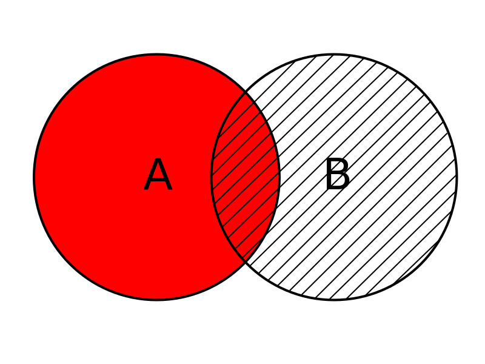
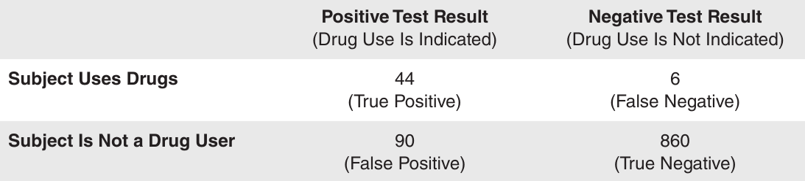

Fundamentals of probability part II
========================================================
date: 02/20/2020
autosize: true
incremental: true
width: 1920
height: 1080

<h2 style="text-align:left"> Instructions:</h2>

Use the left and right arrow keys to navigate the presentation forward and backward respectively.  You can also use the arrows at the bottom right of the screen to navigate with a mouse. 

========================================================

<h2>Outline</h2>

* The following topics will be covered in this lecture:
  * Odds
  * Compound events
  * The addition rule
  * Conditional probability
  * The multiplication rule

========================================================

## Odds

* Expressions of likelihood are often given as odds, such as $50:1$ (or "50 to 1"). 

* Because the use of odds makes many calculations difficult, statisticians, mathematicians, and scientists prefer to use probabilities. 

* The advantage of odds is that they make it easier to deal with money transfers associated with gambling, so they tend to be used in casinos, lotteries, and racetracks. 

* <b>Note</b> -- in the three definitions that follow, the <b>actual odds against</b> and the <b>actual odds in favo</b>r are calculated with the <strong>actual likelihood of some event</strong>; 

  * however, the <b>payoff odds</b> describe the <strong>relationship between the bet and the amount of the payoff</strong>. 

* The actual odds correspond to actual probabilities of outcomes, but the payoff odds are set by racetrack and casino operators. 

  * Racetracks and casinos are in business to make a profit, so the payoff odds will not be the same as the actual odds.

========================================================

### Odds continued

*  <b>Actual odds against event $A$</b> -- this is the probability of event $\overline{A}$ relative to the event $A$, i.e.,  
$$\frac{P\left(\overline{A}\right)}{P(A)}$$

  *  Actualy odds against is usually expressed in the form of $a:b$ (or "$a$ to $b$"), where $a$ and $b$ are integers having no common factors.

*  <b>Actual odds in favor of event $A$</b> -- this is the probability of event $A$ relative to the event $\overline{A}$, i.e.,  
$$\frac{P(A)}{P\left(\overline{A}\right)}$$
      
   * If the odds against $A$ are $a:b$, then the odds in favor of $A$ are $b:a$.

*  <b>Payoff odds against event $A$</b> -- this is the ratio of net profit (if you win) to the amount bet:  
  $$\text{payoff odds against event }A = (\text{net profit}):(\text{amount bet})$$

========================================================

### Odds example

* If you bet $5$ dollars on the number $13$ in roulette, your <b>probability of winning</b> is $\frac{1}{38}$ and the payoff odds are given by the casino as $35:1$.

* <b>Discuss with a neighbor:</b> what are the <b>actual odds for</b> and the <b>actual odds against</b> winning with a bet on $13$?

  * Let's note that if $A=$"winning with a bet on $13$", we can write $P(A)=\frac{1}{38}$.
  
  * Therefore, the <strong>probability of not winning is</strong>
  $$P\left(\overline{A}\right) = 1 - \frac{1}{38} = \frac{37}{38}$$
  
  * If the <b>actual odds for</b> a bet on $13$ are thus given as,
  $$\frac{P(A)}{P\left(\overline{A}\right)} = \frac{\frac{1}{38}}{\frac{37}{38}} = \frac{1}{37},$$
  or as odds, $1:37$.
  
  * If we have the <b>actual odds for</b> a bet on $13$ as $1:37$ then the <b>actual odds against</b> are given as $37:1$. 

* Recall our formula for payoff odds,
  $$\text{payoff odds against event }A = (\text{net profit}):(\text{amount bet})$$

* <b>Discuss with a neighbor:</b> how much net profit would you make if you win by betting on $13$?

  * If we bet one dollar, we net a profit of $35$ dollars, so we can multiply this ratio to obtain $175:5$ as the net profit to bet.
  
  * The <b>net profit</b> is $175$ which means the casino gives you your winnings of $175$ plus $5$ for your original bet.
  
 
========================================================

### Odds example continued

* If you bet $5$ dollars on the number $13$ in roulette, your <b>probability of winning</b> is $\frac{1}{38}$ and the payoff odds are given by the casino as $35:1$.

  
* <b>Discuss with a neighbor:</b> if the casino was not operating for profit and the payoff odds were changed to match the actual odds against $13$, how much would you win with a bet of $5$ dollars if the outcome were $13$?

  * If the <strong>payoff odds were equal to the actual odds against</strong>, we would be computing,
  $$37:1 = (\text{Net profit}):(\text{ammount bet}).$$
  
  * Thus if we used this rule, we could multiply the ratio by five again to find $185:5$.
  
  * Our net profit would therefore be $185$ dollars on a $5$ dollar bet -- this means the casino would owe you $185$ plus $5$ dollars for your original bet.

========================================================

## Compound events

<ul>
   <li>We will often be concerned not with one event $A$ but some combination of some event $A$ and some event $B$.</li>
   <li> <b>Compound event</b> -- formally we define a compound event as any event combining two or more simple events.</li>
   <li> There are <strong>two key operations joining events</strong></li>
   <ol>
      <li><b>"OR"</b> -- in mathematics we refer to "or" as a <strong>non-exclusive "or"</strong>.</li>
      <ul>
         <li>The meaning of this for "$A$ or $B$" is -- event $A$ occurs, event $B$ occurs, <strong>or both</strong> events $A$ and $B$ occur.</li>
         <li>We will <strong>not consider the exclusive "or"</strong>, i.e. <b>either</b> event $A$ occurs, or event $B$ occurs, <strong>but not both</strong>.
      </ul>
      <li><b>"AND"</b> -- in mathematics we refer to "and" in an <strong>exclusive sense</strong>.</li>
      <ul>
         <li>The meaning of this for "$A$ and $B$" is -- <strong>both</strong> event $A$ <b>and</b> event $B$ occurs.</li> 
      </ul>
   </ol>
   <li>The operations "and" and "or" join events together in a way that we can compute the probability of the joint events.</li>
   <li>We will develop some tools describing how to compute probabilities of these compound events from the individual probabilities.</li>
   <ul>
      <li>A key concept is how we compute the probability of events <strong>without double counting</strong> the ways they can occur.</li> 
   </ul>
</ul>

========================================================

## Addition rule

Courtesy of Bin im Garten  <a href="https://creativecommons.org/licenses/by-sa/3.0" target="blank">CC</a> via  
        <a href="https://commons.wikimedia.org/wiki/File:Menge_Venn-Diagramm_001.svg"> Wikimedia Commons</a>

<ul>
  <li>Suppose we want to <strong>compute the probability of two events $A$ and $B$ joined</strong> by the compound operation <b>"or"</b>.</li>
  <li>We read the statement,
  $$P(A \text{ or } B)$$ 
  as he probability of event:</li>
  <ul>
    <li>$A$ occuring,</li>
    <li>event $B$ occuring, or</li>
    <li>both $A$ and $B$ ocurring.</li>
  </ul>
  <li>Intuitively, we can express the probability in terms of all the ways $A$ can occur and all the ways $B$ can occur, if we don't double count.</li>
  <li>Let <b style="color:red">all the ways that $A$ can occur</b> be represented by the <b style="color:red">red circle</b> to the left.</li>
  <li>Let <b>all the ways that $B$ can occur</b> be represented by the <b>dashed circle</b> to the left.</li>
</ul>

<ul>
  <li><b>Discuss with a neighbor:</b> suppose we count all the ways $A$ can occur and all the ways $B$ can occur.</li>
  <li>If we take the <strong>sum</strong> of the <b style="color:red">total of all ways $A$ occurs</b> <b>and</b> the <b>total of all ways $B$ occurs</b>, does this give <strong>the total of all ways $A$ or $B$ occurs</strong>?</li>
  <ul>
    <li>Consider, if there is an <b>overlap where both $A$ and $B$ occur simultaneously</b>, then summing the total of all ways $A$ occurs and the total of all ways $B$ occurs <strong>double counts the the cases where both $A$ and $B$ occur</strong>.</li>  
  </ul>
</ul>

========================================================

### Addition rule continued

Courtesy of Bin im Garten  <a href="https://creativecommons.org/licenses/by-sa/3.0" target="blank">CC</a> via  
        <a href="https://commons.wikimedia.org/wiki/File:Menge_Venn-Diagramm_001.svg"> Wikimedia Commons</a>

<ul>
  <li>Let us consider the statement
  $${\color{red} {P(A)}} + P(B),$$ 
  is equal to the sum of the <b style="color:red">total of all ways that $A$ occurs</b> and the <b>total of all ways that $B$ occurs</b>, relative to all possible outcomes.</li>
  <li><b>Discuss with a neighbor:</b> what term "$\cdot$" is needed in $P\left( \cdot \right)$ below to <strong>eliminate the double counting</strong>?
  $$P(A\text{ or }B)= {\color{red} {P(A)}} + P(B) - P\left( \cdot \right)$$
  </li>
  <ul>
    <li>We count the cases where $A$ <b>and</b> $B$ both occur twice, as these cases are included in both ${\color{red} {P(A)}}$ and $P(B)$.</li>
  </ul>
  <li>Therefore, the <b>addition rule</b> for compound events is given as,
  $$P(A\text{ or }B) = P(A) + P(B)  - P(A\text{ and }B)$$ </li>
  <li><b>Discuss with a neighbor:</b> notice that <strong>if $P(A\text{ and } B) = 0$</strong> then
  $$P(A\text{ or }B) = P(A) + P(B),$$
  is an accurate statement.</li>
</ul>

<ul>
  <li>If $P(A\text{ and } B) = 0$, what does this say about the relationship between $A$ and $B$?</li>
  <ul>
    <li>This says that <strong>events $A$ and $B$ never occur simultaneously</strong>.</li>
    <li>An easy example is for $A=$"coin flip lands heads" and $B=$"coin flip lands tails" -- these two events never occur simultaneously and $P(A\text{ or } B)= P(A) + P(B)$.</li>
  </ul>
  <li>Two events that never occur sumultaneously are called <b>disjoint</b> or <b>mutually exclusive</b> events, corresponding to when there is no overlap.</li>
</ul>

========================================================

### Addition rule continued

Courtesy of Bin im Garten  <a href="https://creativecommons.org/licenses/by-sa/3.0" target="blank">CC</a> via  
        <a href="https://commons.wikimedia.org/wiki/File:Menge_Venn-Diagramm_001.svg"> Wikimedia Commons</a>

<ul>
  <li>Actually, not only are the events $A=$"coin flip lands heads" and $B=$"coin flip lands tails" disjoint, but they are <b>complementary</b>.</li>
  <li>If our process is one coin flip, we can encode the simple events as $\{H,T\}$ for heads and tails respectively.</li>
  <li>Thus $A=\{H\}$ and $B=\{T\}$, so that
  $$\overline{A}=``\text{all outcomes where the coin flip is not heads''}=\{T\}=B.$$</li>
  <li><b>Complementary events</b> are special cases of <strong>disjoint events</strong>.</li>
  <li>We saw last time that,
  $$P(A) + P\left(\overline{A}\right) = 1.$$
  </li>
  <li>We can now use the addition rule to show that <b>this is always true</b>.</li>
  <li>First note that by definition, $A$ <b>and</b> $\overline{A}$ will never occur -- this is the joined event where <strong>$A$ occurs and $A$ does not occur simultaneously</strong>, so that $P(A\text{ and }\overline{A})= 0$.</li> 
</ul>

<ul>
  <li>However, <b>$A$ or $\overline{A}$</b> is the joint event in which $A$ occurs, $A$ does not occur, or both $A$ occurs and $A$ does not occur -- this is <strong>every possible outcome</strong> (and some that are impossible). Therefore, $P\left(A\text{ or }\overline{A}\right) = 1$</li>
  <li>The addition rule thus gives us,
  $$ 1= P\left(A\text{ or }\overline{A}\right) = P(A) + P\left(\overline{A}\right)$$
  because they are disjoint.</li>
</ul>

========================================================

### Addition rule example

Courtesy of Bin im Garten  <a href="https://creativecommons.org/licenses/by-sa/3.0" target="blank">CC</a> via  
        <a href="https://commons.wikimedia.org/wiki/File:Menge_Venn-Diagramm_001.svg"> Wikimedia Commons</a>

<ul>
  <li>Let us consider an example about how to use the statement,
  $$P(A) + P\left(\overline{A}\right) = 1$$
  effectively to deduce probabilities.</li>
  <li>Based on the article, 
  <blockquote>"Prevalance and Comorbidity of Nocturnal Wandering in the US General Population,"</blockquote></li>
  <li>we say the probability of randomly selecting a US adult who has sleepwalked is $0.292$.</li>
  <li><b>Discuss with a neighbor:</b> what is the probability of randomly selecting a US adult who <strong>has not sleepwalked</strong>?</li>
  <ul>
    <li>Note that if our process is "Randomly selected person" and $A=$"person has sleepwalked", then $\overline{A}=$"person has not sleepwalked".</li>
  </ul>
</ul>

<ul>
  <li>Setting up the problem in this way we can see that
  $$\begin{align}
  & P(A) + P\left(\overline{A}\right) = 1 \\
  \Leftrightarrow & P\left(\overline{A}\right) = 1 - P(A) \\
  \Leftrightarrow & P\left(\overline{A}\right) = 1 - 0.292 = .708
  \end{align}$$
  </li>
</ul>

========================================================

### Addition rule example

Courtesy of Mario Triola, <em>Essentials of Statistics</em>, 5th edition

<ul>
  <li>In the table to the left, we see results from a pre-employment drug screening test with $1000$ participants.</li> 
  <li>The results are from a <strong>quick test that is innacurate</strong> and doesn't always give correct results.</li>
  <li>Specifically we have <b>four different scenarios</b> for a test result:</li>
</ul>

<ul>
  <ol>
    <li><b>True positive</b> -- a subject <strong>uses drugs</strong> and the <strong>test result is positive</strong></li>
    <li><b>False positive</b> -- a subject <strong>does not use drugs</strong> and the <strong>test result is positive</strong>.</li>
    <li><b>True negative</b> -- a subject <strong>does not use drugs</strong> and the <strong>test result is negative</strong>.</li>
    <li><b>False negative</b> -- a subject <strong>uses drugs</strong> and the <strong>test result is negative</strong>.</li>
  </ol>
  <li><b>Discuss with a neighbor:</b> if one of the participants are selected randomly, let the events be defined as $A=$"the participant is a drug user" <strong>or</strong> $B=$"the test result is positive".  What is $P(A\text{ or }B)$?</li>
  <ul>
    <li>Notice that $A$="True positive or False negative" and that $B=$"True positive or False positive". Therefore, $A$ <b>and</b> $B$ is the case "True positive" and we have</li>
    <li>
    $$\begin{matrix}
    P(A) = \frac{44\text{ True positive } + 6\text{ False negative}}{1000} & P(B) = \frac{44\text{ True positive } + 90\text{ False positive}}{1000} & P(A\text{ and }B) = \frac{44\text{ True positive}}{1000}
    \end{matrix}$$</li>
    <li>Thus we see how we would double count $A$ <b>and</b> $B$ occuring with $P(A) + P(B)$ and instead we have,  
    $$\begin{matrix}P(A\text{ or }B) = \frac{44\text{ True positive } + 6\text{ False negative} +  90\text{ False positive}}{1000}=0.14\end{matrix}$$</li>  
  </ul>
</ul>

========================================================

## Multiplication rule

Courtesy of Bin im Garten  <a href="https://creativecommons.org/licenses/by-sa/3.0" target="blank">CC</a> via  
        <a href="https://commons.wikimedia.org/wiki/File:Menge_Venn-Diagramm_001.svg"> Wikimedia Commons</a>

<ul>
  <li>There are several ways to consider the <b>multiplication rule for probability</b> -- the "physics" way to consider this, due to Kolmogorov, is as follows:</li>
  <ul>
    <li>Suppose that there are two related events $A$ and $B$ where <strong>knowledge of one occuring would change how likely we see the other to occur</strong>.</li>
    <ul>
      <li>For example, we can say $A=$"it snows in the Sierra" and $B=$"it rains in my garden".</li>
      <li>The day before, I don't know if either will occur.</li>
      <li>However, if I knew that $A$ occured, this would change how likely it would seem that $B$ occurs;</li>
      <li> $B$ is not guaranteed when $A$ occurs, but the probability of $B$ occuring would be higher in the presence of $A$.</li>
    </ul>
    <li>Supose that $A$ occurs hypothetically, then our <b>sample space</b> of possible events now <strong>only includes events where $A$ also occurs</strong>.</li>
    <li>I.e., we would need to restrict our consideration of $B$ relative to the case that $A$ occurs.</li>
  </ul>
</ul>

<ul>
  <li>We define the <b>probability of $B$ conditional on $A$</b>,  
  $$P(B\vert A),$$  
  as the <strong>probability of $B$ in the case that $A$ occurs</strong>.</li>
</ul>

========================================================

### Multiplication rule continued

Courtesy of Bin im Garten  <a href="https://creativecommons.org/licenses/by-sa/3.0" target="blank">CC</a> via  
        <a href="https://commons.wikimedia.org/wiki/File:Menge_Venn-Diagramm_001.svg"> Wikimedia Commons</a>

<ul>
  <li>We now consider the <b>probability of $B$ conditional on $A$</b>,  
  $$P(B\vert A),$$  
  as the <strong>probability of $B$ in the case that $A$ occurs</strong>.</li>
  <ul>
    <li>For example, we can say $A=$"it snows in the Sierra" and $B=$"it rains in my garden".</li>
  </ul>
  <li>Assuming $A$ occurs, we will consider all ways for  <strong>both $A$</strong> <b>and</b> <strong>$B$ to occur</strong>.</li>
  <ul>
      <li>The <strong>sample space for $B \vert A$ has been restricted to the cases where $A$ occurs</strong>, so we compute the probability <b>relative to all the ways $A$ occurs</b>.</li>
  </ul>
  <li>Therefore the probability of $P(B\vert A)$ can be read,
  $$\frac{\text{All the ways }A\text{ and }B\text{ can occur}}{\text{All the ways }A\text{ can occur}}$$</li>
    <li>Mathematically we write this as,
  $$P(B\vert A) = \frac{P(A\text{ and } B)}{P(A)}.$$</li> 
</ul>

<ul>
  <li>For example, in plain English we can say
  <blockquote>
  The probability that it rains in my garden, given that it snows in the Sierra, is equal to the <b>probability of both occuring relative to the probability of snow in the Sierra</b>.
  </blockquote></li>
</ul>

========================================================

### Multiplication rule continued

Courtesy of Bin im Garten  <a href="https://creativecommons.org/licenses/by-sa/3.0" target="blank">CC</a> via  
        <a href="https://commons.wikimedia.org/wiki/File:Menge_Venn-Diagramm_001.svg"> Wikimedia Commons</a>

<ul>
  <li>We have now defined the conditional probability of $B$ given $A$ as,
  $$P(B\vert A)=\frac{P(A\text{ and }B)}{P(A)}$$
  in the Kolmogorov way. 
  </li>
  <li>We should make some notes about this:</li>
  <ul>
    <li>The above statment only makes sense when <b>$P(A)\neq 0$</b>, because <strong>we can never divide by zero</strong>.</li>
    <ul>
      <li>"Physically" we can interpret the meaning with $P(B\vert A)$ read as
      <blockquote>
      The probability that $B$ occurs given that $A$ occurs.
      </blockquote></li>
      <li>The above <strong>should not be defined when $A$ is impossible</strong> -- the phrase "given that $A$ occurs" makes no sense.</li>
    </ul> 
    <li>Using the definition of conditional probability, we get the <b>multiplication rule</b>.</li>
  </ul>
</ul>

<ul>
  <ul>
    <li>The <b>multiplication rule</b> for probability tells us that,
    $$P(A \text{ and } B) = P(B\vert A) \times P(A)$$
    </li>
    <li>We will <strong>use the above formula quite generally</strong>, but we note:</li>
    <ul>
      <li>$P(B\vert A)$ is <b>not defined</b> when $P(A)=0$</li>
      <li>However, <b>$P(A\text{ and }B) = 0$ when $P(A)=0$</b> because this is the probability that <strong>$B$ and the impossible event $A$ both occur</strong>.</li>
    </ul>
  </ul>
</ul>

========================================================

## Independence

<ul>
  <li>Closely related notions to the conditional probability are <b>independence</b> and <b>dependence</b> of events.</li>
  <ul>
    <li> <b>Dependence</b> -- two events are said to be <b>dependent</b> if the outcome of one event <strong>directly affects the probability of the other</strong>.</li>
    <ul>
      <li>In the earlier example, $A=$"snow in the Sierra" and $B=$"rain in my garden" are dependent events, because <strong>one occuring would affect the chance the other occured</strong>.</li>
      <li>However, <b>dependence</b> between events $A$ and $B$ <strong>does not mean that $A$ causes $B$ or vice versa</strong>.</li>
      <li>Rain in my garden does not cause snow in the Sierra, but the probability of snow in the Sierra is larger if there is rain in my garden.</li>
    </ul>
    <li><b>Independence</b> -- two events are said to be <b>independent</b> if the outcome of either event has <strong>no impact on the probability of the other</strong>.</li>
    <ul>
      <li>When we think of events being <b>independent</b> we should think of events that are not related to each other</li>
      <li>For example, if our process is "what happens today", $A=$"snow in the Sierra" and $B=$"coin flip heads" are <b>independent</b>, because <strong>neither outcome affects the other</strong>.</li>
    </ul>
  </ul>
  <li>Mathematically, we can see the meaning of independence clearly by stating, <b>$A$ and $B$ are independent</b> by definition <strong>if and only if both of the following hold</strong>,
  $$\begin{matrix}
  P(A\vert B) = P(A) & \text{and}  & P(B\vert A) = P(B). 
  \end{matrix}$$</li>
  <li>In plain English, the above says
  <blockquote>The probability of event $A$ does not change in the presence of $B$ and vice versa.</blockquote></li>
  <li>Particularly, the outcome of $A$ or $B$ does not affect the other.</li> 
</ul>

========================================================

## Sampling and Independence

<ul>
  <li>A classical example of <b>statistical independence / dependence</b> arises from games of chance.</li>
  <li>A standard deck of cards has $52$ cards with half <b>black</b> and half <b style="color:red">red</b>.</li>
  <li>Define the events $A=$"I draw a <b style="color:red">red card</b>" and $B=$"I draw a <b>black card</b>".</li>
  <li>Suppose I draw a card randomly from the deck and the color is <b style="color:red">red</b>.</li>
  <li>Then suppose I <strong>return the card to the deck, shuffle and draw another card</strong>.</li>
  <li><b>Discuss with a neighbor:</b> what is the probability that the next card I draw is <b>black</b>?</li>
  <ul>
    <li>Because the original card was returned and the deck was shuffled, this is like drawing a card from a fresh deck.</li>
    <li>Therefore, if $P(B\vert A) = P(B) = 0.5$.</li>
  </ul>
  <li>Now suppose that I randomly draw a card from a fresh deck and the color is red.</li>
  <li>Suppose that <strong>I don't replace the card into the deck</strong>, and I randomly draw another card.</li>
  <li><b>Discuss with a neighbor:</b> what is the probability that the next card I draw is <b>black</b>?</li>
  <ul>
    <li>In this case, the deck now has only <b style="color:red">$25$ red cards</b> compared to <b>$26$ black cards</b>.
    <li>When we <strong>do not replace samples</strong> in the deck,
    $$P(B\vert A) = \frac{26}{51}$$</li>
    <li>That is, <strong>$B$ is not independent from $A$ when we sample without replacement</strong>.</li>
  </ul>
  <li>This is an important example, because it shows how <strong>sampling with and without replacement changes the independence of events</strong>.</li>
</ul>

========================================================

### Sampling and Independence continued

Courtesy of Mario Triola, <em>Essentials of Statistics</em>, 5th edition

<ul>
  <li>We define the two concepts we discussed on the last slide below:</li>
  <ul>
    <li><b>Sampling with replacement</b> -- selections <strong>are re-introduced to the sample pool</strong> before the next sample is made.</li>
    <ul>
      <li> In this case, the <strong>selections are independent events</strong>.</li>
    </ul>
  </ul>
</ul>

<ul>
    <li><b>Sampling without replacement</b> -- selections <strong>are not re-introduced to the sample pool</strong> before the next sample is made.</li>
    <ul>
      <li> In this case, the <strong>selections are dependent events</strong>.</li>
    </ul>
    <li>Consider the pre-employment drug screening again, with data above.</li>
    <li><b>Discuss with a neighbor:</b> suppose we sample two participants <strong>without replacement</strong>.</li>
    <li>Let $A=$"first draw uses drugs" and $B=$"second draw uses drugs".</li>
    <li>If we want to compute the probability that <b>both</b> particpants use drugs, what event are we trying understand, 
    $$\begin{matrix}
    (A \textbf{ and } B) & or & (A \textbf{ or } B)?
    \end{matrix}$$ 
    </li>
    <li>Can we use the <b>addition rule</b> or the <b>multiplication rule</b>?</li>
    <ul>
      <li>We are considering the event $(A \textbf{ and } B)$ because we specified <b>both</b> $A$ and $B$ occur.</li>
      <li>Therefore, we will use the <b>multiplication rule</b>.</li>
    </ul>
</ul>

========================================================

### Sampling and Independence continued

Courtesy of Mario Triola, <em>Essentials of Statistics</em>, 5th edition

<ul>
  <li>For the events</li>
  <ol>
    <li>$A=$"first draw uses drugs", and </li>
    <li>$B=$"second draw uses drugs",</li>
  </ol>
  <li>we can compute $P(A\text{ and } B)$ using the multiplication rule as follows:</li>
</ul>

<ul>
  <ul>
    <li>Note that $P(A)$ can be computed as,
    $$\frac{50 \text{ Participants using drugs}}{1000 \text{ Participants}} $$</li> 
    <li>And that $P(B\vert A)$ can be computed as,
    $$\frac{49\text{ Remaining participants using drugs}}{999 \text{ Remaining participants}}$$</li>
    <li>Therefore, we can write,
    $$\begin{align}
    P(A\text{ and } B)&=  P(B\vert A) \times P(A)\\
     &=  \frac{49}{999} \times \frac{50}{1000} \\
     &\approx 0.0024
    \end{align}$$
  </ul>
</ul>

========================================================

### Sampling and Independence continued

<ul>
  <li>We note, a common approximation is used in polling when sampling without replacement.</li>
  <li>Suppose that we wish to make a similar computation of probability as with the last example, without replacement.</li>
  <li> If the sample size is no more than $5\%$ of the size of the population, it is common to treat the selections as being independent (even if they are actually dependent).</li>
  <li>In our last example we found that 
  $$\begin{align}
    P(A\text{ and } B)&=  P(B\vert A) \times P(A)\\
     &=  \frac{49}{999} \times \frac{50}{1000} \\
     &\approx 0.0024
    \end{align}$$</li>
  <li>However, because the number of draws is less than $5\%$ with respect to the total number of participants we can still <strong>approximate this with two independent draws</strong>.</li>
  <li><b>Discuss with a neighbor:</b> what is the probability of $P(A \text{ and }B)$ if we treat $A$ and $B$ as independent, i.e., with replacement?</li>
  <ul>
    <li>In this case, we would have that 
  $$\begin{align}
    P(A\text{ and } B)&=  P(B\vert A) \times P(A)\\
     &=  \frac{50}{1000} \times \frac{50}{1000} \\
     &= 0.0025
    \end{align}$$</li>
  </ul>
</ul>

========================================================

## Redundancy and the multiplication rule

<ul>
  <li>Machine systems in engineering are often designed with multiple, redundant safety features.</li>
  <li>Particularly, if there are <strong>multiple, independent</strong> saftey checks, we can reduce the probability of a catastrophic failure substantially.</li>
  <li>For example, the Airbus 310 twin-engine airliner has <strong>three independent hydraulic systems</strong>  so that if one fails, another system can step in and maintain flight control.</li>
  <li>For sake of example, we will assume that the <stong>probability of a randomly selected hydraulic system failing is $0.002$</strong>.</li>
  <li><b>Discuss with a neighbor:</b> if the airplane had only one hydraulic system, what would be the proability that an airplane would be able to maintain control for the flight?</li>
  <ul>
    <li>Let event $A=$"hydraulic system fails" so that $\overline{A}=$"airplane maintains control".</li>
    <li>We can then state,
    $$P(\overline{A}) = 1 - P(A) = 1 - 0.002 = 0.998.$$</li>
  </ul>
  <li><b>Discuss with a neighbor:</b> what is the probability that an airplane would be able to <strong>maintain control with the three independent hydraulic systems</strong>?
  <ul>
    <li>Let us denote $A_1=$"hydraulic system $1$ fails", $A_2=$"hydraulic system $2$ fails" and $A_3=$"hydraulic system $3$ fails".</li>
    <li>The event where all hydraulic systems fail is given by,
    $$\left(A_1\text{ and } A_2\text{ and } A_3\right)$$  
    so that the airplane is able to maintain control in the complement of the above event:
    $$\overline{\left(A_1\text{ and } A_2\text{ and } A_3\right)}.$$
  </ul>
</ul>

========================================================

### Redundancy and the multiplication rule continued

<ul>
  <li>We recall, the probability that a randomly selected hydraulic system fails is $0.002$ and the three systems are <b>independent</b>.</li>
  <li>Therefore, we can use the multiplication rule as,
  $$\begin{align}
  P\left(A_1\text{ and } A_2\text{ and } A_3\right) &= P(A_1\text{ and } A_2\vert A_3) \times P(A_3)\\
  &=P(A_1\text{ and } A_2) \times P(A_3) \\
  &= P(A_1 \vert A_2) \times P(A_2) \times P(A_3) \\
  & = P(A_1)\times P(A_2) \times P(A_3)
  \end{align}$$
  because <strong>each of the events are inependent</strong>.</li>
  <li>Finally, we can write,
  $$P\left(\overline{\left(A_1\text{ and } A_2\text{ and } A_3\right)}\right) = 1 - P(A_1)\times P(A_2) \times P(A_3)= 1-0.002^3=0.999999998$$ </li>
  <li>This shows how including <strong>multiple independent systems</strong> greatly improves the probability of success.</li>
</ul>

========================================================

## Review of key concepts

<ul>
  <li>The most important concepts covered here are:</li>
  <ul>
    <li>how to join events $A$ and $B$ with our two operations,</li>
    <ol>
      <li><b>$A$  "or" $B$</b> -- the case that $A$, $B$ or both $A$ and $B$ occur; and </li>
      <li><b>$A$  "and" $B$</b> -- the case that both $A$ and $B$ occur;</li>
    </ol>
    <li>how to take complements of events, and how the probabilities are related, e.g.,
    $$P(A) + P\left(\overline{A}\right) = 1;$$</li>
    <li>how to use the two probability rules,
    <ol>
      <li><b>Addition rule</b> -- for the event $A$ <b>or</b> $B$,
      $$P(A\text{ or }B)= P(A) + P(B) - P(A \text{ and } B);$$</li>
      <li><b>Multiplication rule</b> -- for the event $A$ <b>and</b> $B$,
      $$P(A \text{ and } B) = P(B\vert A) \times P(A);$$</li>
    </ol>
    <li>and the notions of <b>independence</b> and <b>dependence</b> between events $A$ and $B$.</li>
  </ul>
  <li>We will go more in depth into conditional probability after the midterm.</li>
  <li>Tuesday, we will review sections 1.1 - 1.3, 2.1 - 2.4, 3.1 - 3.3 and 4.1 - 4.2.</li>
</ul>
