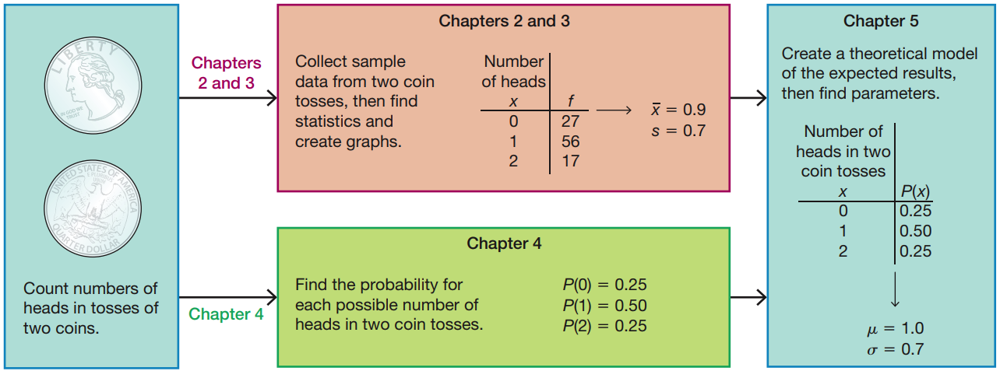

Probability distributions part I
========================================================
date: 03/05/2020
autosize: true
incremental: true
width: 1920
height: 1080

<h2 style="text-align:left"> Instructions:</h2>

Use the left and right arrow keys to navigate the presentation forward and backward respectively.  You can also use the arrows at the bottom right of the screen to navigate with a mouse. 

========================================================

<h2>Outline</h2>

* The following topics will be covered in this lecture:
  * Random variables
  * Distributions
  * Parameters versus statistics
  * Expected values
  * Significant values

========================================================

## Motivation

Courtesy of Mario Triola, <em>Essentials of Statistics</em>, 6th edition

  

<ul>
  <li>So far we have learned two sets of skills</li>
  <ol>
    <li><b style="color:#d95f02">Summary statistics</b> -- used for analyzing <b style="color:#d95f02">samples</b>; and</li>
    <li><b>Probability</b> -- used to <strong>analyze complex events</strong> abstractly.</li>
  </ol>
  <li>Our goal is to use <b style="color:#d95f02">statistics</b> from <b style="color:#d95f02">small, representative samples</b> to say something <b style="color:#1b9e77">general</b> about the <b style="color:#1b9e77">larger, unobservable population</b>.</li>
  <ul>
    <li>Recall, the measures of the <b style="color:#1b9e77">population</b> are what we referred to as <b style="color:#1b9e77">parameters</b>.</li>
  </ul>
</ul>

<ul>
  <li><b style="color:#1b9e77">Parameters</b> are generally <strong>unknown and unknowable</strong>.</li>
  <ul>
    <li>For example, the <b style="color:#1b9e77">mean age of every adult</b> living in the United States is a <b style="color:#1b9e77">parameter</b> for the adult population of the USA.</li>
    <li>We <strong>cannot possibly know this value exactly</strong> as there are people who cannot be surveyed and / or don't have accurate records.</li>
    <li>If we have a <b style="color:#d95f02">representative sample</b> we can compute the <b style="color:#d95f02">sample mean</b>.</li>
    <li>The <b style="color:#d95f02">sample  mean</b> will almost surely <b>not equal</b> <b style="color:#1b9e77">population mean</b>, due to the natural variation <b style="color:#d95f02">(sampling error)</b> that occurs in <b style="color:#d95f02">any given sample</b>.</li>
    <li>However, if we have a good <strong>probabilistic model</strong> for the ages of adults, we can use the <b style="color:#d95f02">sample statistic</b> to estimate the general, unknown <b style="color:#1b9e77">population parameter</b>.</li>
  </ul>
</ul>

========================================================

### Motivation continued

Courtesy of Mario Triola, <em>Essentials of Statistics</em>, 6th edition

  

<ul>
  <li>The flow chart at the left describes how these different tools fit together now.</li>
  <li>Coin flipping is a <b>process</b> that we can:</li>
  <ol>
    <li><b style="color:#d95f02">take samples</b> of; and</li>
    <li><strong>build a probabilistic model</strong> for.</li>
  </ol>
  <li>Let us define <b>$x$</b> to be a variable that represents the <strong>number of heads</strong> that arise from <strong>two coin flips</strong>.</li>
  <li>Each time we take a sample of two coin flips, <strong>$x$ might have a different result</strong>.</li>
</ul>

<ul>
  <ul>
    <li>Therefore, we call $x$ to be a <b>random variable</b> that depends on the particular <strong>sample outcome</strong>.</li>
  </ul>
  <li>In the top-horizontal box, we see the results from an experiment where a coin is flipped twice;</li>
  <ul>
    <li>the experiment is repeated $110$ times and the <b>frequency</b> that $x$ takes the value,
    <ol>
      <li>$x=0$ : occurs $27$ times</li>
      <li>$x=1$ : occurs $56$ times</li>
      <li>$x=2$ : occurs $17$ times</li>
    </ol>
    <li>is recorded in a fequency distribution.</li>
    <li>Using the frequency distribution, we can compute the mean of $x$ as <b style="color:#d95f02">$\overline{x}=.9$</b> and the standard deviation of $x$, <b style="color:#d95f02">$s=0.7$</b>.</li>
  </ul>
</ul> 

========================================================

### Motivation continued

Courtesy of Mario Triola, <em>Essentials of Statistics</em>, 6th edition

  

<ul>
  <li>In the lower-horizontal box, we see how we construct an <b>abstract, probabilistic model</b> for $x$.</li>
  <li>In this case, we can compute exactly all the ways that:</li>
  <ol>
    <li>$x=0$ relative to all possible outcomes;</li>
    <li>$x=1$ relative to all possible outcomes;</li>
    <li>$x=2$ relative to all possible outcomes.</li> 
  </ol>
</ul>

<ul>
  <li>We know that</li>
  <ul>
    <li>$x=0$ occurs only as $\{T,T\}$;</li>
    <li>$x=1$ occurs as $\{T,H\}$ and $\{H,T\}$; and</li>
    <li>$x=2$ occurs only as $\{H,H\}$.</li>  
  </ul>
  <li>Therefore, out of four possible outcomes we have that:</li>
  <ol>
    <li>$P(0)=0.25$</li>
    <li>$P(1)=0.5$</li>
    <li>$P(2)=0.25$</li>
  </ol>
</ul>

========================================================

### Motivation continued

Courtesy of Mario Triola, <em>Essentials of Statistics</em>, 6th edition

  

<ul>
  <li>The box on the right then shows what we will call a <b>probability distribution</b>.</li>
  <ul>
    <li>Instead of listing frequencies with values of $x$, we will list the probabilities.</li>
  </ul>
  <li>The <b>probability distribution</b> will be the <strong>theoretical, probabilistic model</strong> for how $x$ behaves over the population.</li>
  <li>Combining probabilities and sample statistics, we can estimate the <b style="color:#1b9e77">true population mean $\mu$</b> and <b style="color:#1b9e77">true population standard deviation $\sigma$</b>.</li> 
</ul>

<ul>
  <li><b>Note:</b> in the table it says that we "find" the parameters;</li>
  <ul>
    <li>we can only <b>"find"</b> the paramters exactly in <strong>very simple examples</strong> like games of chance.</li>
    <li>Generally, we will have to be satisfied with <b>estimates of the parameters</b> that are uncertain, but also <strong>include measures of "how uncertain"</strong>.</li>  
  </ul>
</ul>

========================================================

## Random variables

  

<ul>  
  <li>The first concept that we will need to develop is the <b>random variable</b>.</li>
  <li>Prototypically, we can consider the coin flipping example from the motivation:</li>
  <ul>
    <li>$x$ is the number heads in two coin flips.</li>
  </ul>
  <li>Every time we repeat two coin flips <strong>$x$ can take a different value</strong> due to many possible factors:</li>
</ul>

<ul>
  <ul>
    <li>how much force we apply in the flip;</li>
    <li>air pressure;</li>
    <li>wind speed;</li>
    <li>etc...</li>
  </ul>
  <li>The result is so sensitive to these factors that are beyond our ability to control, <strong>we consider the result to be by chance</strong>.</li>
  <li><b>Before</b> we flip the coin twice, the <strong>value of $x$ has yet-to-be determined</strong>.</li>
  <li><b>Afte</b>r we flip the coin twice, the <strong>value of $x$ is fixed</strong> and possibly known.</li>
  <li>Formally we will define:</li>
  <ul>
    <li><b>Random variable</b> -- is a variable that has a single
numerical value, determined by chance, for each outcome of a procedure.</li>  
  </ul>
</ul>

  

========================================================

### Random variables continued

  

<ul> 
  <li>Suppose we are considering our <b>sample space</b> $\mathbf{S}$ of all possible outcomes of a random process.</li>
  <li>Then for any particular outcome of the process,</li>
  <ul>
    <li>e.g., for the coin flips one outcome is $\{H,H\}$,</li>
  </ul>
  <li>mathematically the random variable $x$ takes the outcome to the numerical value $x=2$ in the range $\mathbf{R}$.</li> 
</ul>

  

<ul>
  <li><b>Note:</b> <strong> $x$ must always take a numerical value</strong>.</li>
  <li>Because a <b>random variable</b> takes a <strong>numerical value</strong> (not categorical), we must consider the units that $x$ takes:</li>
  <ul>
    <li><b>Discrete random variable</b> -- these take numerical values that are in <strong>counting units</strong>.</li>
    <ul>
      <li>In particular, the unit of $x$ cannot be arbitrarily sub-divided.</li>
      <ul>
        <li>We can think of "how many coin flips heads" is measured in counting units because $1.45$ heads does not make sense.</li>
      </ul>
      <li>However, the values $x$ takes don't strictly need to be whole numbers;</li>
      <ul>
        <li>the units just <strong>cannot be arbitrarily sub-divided</strong>.</li>  
      </ul>
      <li>The scale of units for $x$ can be finite or infinite depending on the problem.</li> 
    </ul>
  </ul>
</li>
</ul> 

========================================================

### Random variables continued

  

<ul>
  <ul>
    <li><b>Continuous random variable</b> -- these take numerical values that are in <strong>continuous units</strong>.</li>
    <ul>
      <li>The units of $x$ <strong>can be arbitrarily sub-divided</strong> and $x$ can take any value in the sub-divided units.</li>
      <li>Necessarily, $x$ can take infinitely many values when it is continuous.</li>
      <ul>
        <li>A good example to think of is if $x$ is the daily high temperature in Reno in degrees Celsius.</li>
        <li>If we had a sufficiently accurate thermometer, we could <b>measure $x$ to an arbitrary decimal place</b> and it would make sense.</li>
        <li>$x$ thus takes today's weather from the outcome space and <strong>gives us a number in a continuous unit of measurement</strong>.</li>
      </ul>
    </ul>
  </ul>
</ul>

========================================================

## Probability distributions

Courtesy of Mario Triola, <em>Essentials of Statistics</em>, 6th edition

  

<ul>
  <li>Given a random variable, our method for analyzing its behavior is typically through a probability "distribution".</li>
  <li><b>Probability distribution</b> -- this is a description that gives the <strong>probability for each possible value of the random variable</strong>.</li>
  <ul>
    <li>A probability distribution can thus be considered a <b>complete description</b> of the random variable.</li>
    <ul>
      <li>For <b>any possible value</b> that $x$ might attain given any possible outcome, we know with <strong>what probability this will occur</strong>.</li>   
    </ul>
    <li>It is often expressed in the format of a table, formula, or graph.</li>
  </ul>
</ul>

<ul>
  <li>We see that the table above is a probability distribution as this <strong>gives every possible value for $x$ its associated probability</strong>.</li>
  <li>Notice if we consider the sum of $P(x=x_\alpha)$ over all possible $x_\alpha$ in the range of $x$, $\mathbf{R}$,
    $$\sum_{x_\alpha\in \mathbf{R}}P(x=x_\alpha) = 1.$$</li>
    <ul>
      <li>In fact, this holds for any $x$ and its associated distribution -- intuitively, consider  
      $$P(x=0 \text{ or } x=1 \text{ or } x=2) = 1$$
      because this is all possible values that $x$ can attain.</li>
      <li>However, all $x=0$, $x=1$ and $x=2$ are <b>all disjoint</b> so that,
      $$P(x=0 \text{ or } x=1 \text{ or } x=2) = P(x=0) + P(x=1) + P(x=2) = 1$$</li>
      <li>The same intuition can be used for <strong>infinite ranges</strong> when we use <b>calculus</b> to define this more formally.</li>
    </ul>
</ul>

========================================================

### Probability distributions continued

Courtesy of Mario Triola, <em>Essentials of Statistics</em>, 6th edition

  

<ul>
  <li>We can graphically represent the <b>probability distribution</b> with a histogram similarly to how we represent a <strong>relative frequency distribution</strong>.</li>
  <li>Notice, all values for the probability distribution,
  $$0 \leq P(x=x_\alpha) \leq 1$$
  for any value $x_\alpha$ that $x$ can take.</li>
  <ul>
    <li>This is similar to a <strong>relative frequency distribution</strong>,</li>
    <li>each $P(x=x_\alpha)$ represents a <strong>proportion of all possible ways $x$ can equal $x_\alpha$</strong> relative to all possible outcomes.</li>  
  </ul>
  <li>In the horizontal axis, the centers of the rectangles are at the attainable values for $x$.</li>
  <ul>
    <li>The width of each rectangle is also equal to $1$.</li>
  </ul>
</ul> 

<ul>
  <li>Therefore, if we take the area of rectangle corresponding to some value $x_\alpha$, we have,
  $$\begin{align}
  \text{Area of Rectangle }x_\alpha &= P(x=x_\alpha) \times 1\\ &= P(x=x_\alpha).
  \end{align}$$  </li>
  <li>This says that the <b>histogram</b> is an <strong>identical representation of the probability distribution</strong>.</li>
</ul>

========================================================

### Probability distributions continued

Courtesy of Mario Triola, <em>Essentials of Statistics</em>, 6th edition

  

<ul>
  <li>Recall now the conditions we have for a probability distribution:</li>
  <ol>
    <li>We have a <b>random variable $x$</b> which takes an <strong>outcome in the sample space $\mathbf{S}$</strong> of a process to a <strong>numerical value in its range $\mathbf{R}$</strong>.</li>
    <li>For each value $x_\alpha$ that $x$ can attain in its range $\mathbf{R}$, the <strong>distribution assigns a probability $P(x=x_\alpha)$</strong>.</li>
    <li>For each $x_\alpha$ in the range,
    $$0\leq P(x=x_\alpha) \leq 1,$$
    and
    $$\sum_{x_\alpha \in \mathbf{R}} P(x=x_\alpha) =1 $$
  </ol>
</ul>

<ul>
  <li>In the above table, hiring managers were asked to identify common mistakes during interviews.</li>
  <li><b>Discuss with a neighbor:</b> based on the criteria for a probability distribution, does the table above represent a probability distribution? Why or why not?</li>
  <ul>
    <li>There are two major issues with the above:</li>
    <ol>
      <li>The variable <strong>$x$ is categorical, not numerical</strong>.</li>
      <li>The <strong>sum of the probabilities is greater than $1$</strong>.</li>
    </ol>
  </ul>
  <li>Therefore, the above is <b>not a probability distribution</b>.</li>
</ul>

========================================================

## The mean of probability distributions

Courtesy of Mario Triola, <em>Essentials of Statistics</em>, 6th edition

  

<ul>
  <li>Recall now that <b style="color:#d95f02">frequency distributions are derived from samples</b>, and therefore the measures of the samples are <b style="color:#d95f02">statistics</b>.</li>
  <ul>
    <li>E.g., for a random variable $x$, we can compute the <b style="color:#d95f02">sample mean $\overline{x}$</b> from the frequency distribution.</li>
  </ul>
  <li>On the other hand, a <b style="color:#1b9e77">probability distribution represents the entire population</b>, where the population may be abstract.</li>
  <ul>
    <li>E.g., for the two coin flips, the probability distribution for $x$ represents the relative frequency of outcomes over the <b style="color:#1b9e77">population of all possible experiments</b>.</li> 
  <li>Therefore, if we compute the mean of $x$ for the probability distribution, we have the <b style="color:#1b9e77">population parameter $\mu$</b>.</li>
  </ul>
</ul>

<ul>
  <li>To compute the mean of the <b style="color:#1b9e77">probability distribution</b>, we follow a formula like the mean of a <b style="color:#d95f02">frequency disribution</b>.</li> 
  <ul>
    <li>Let $\{x_\alpha\}$ be the collection of all possible values for $x$ in its range $\mathbf{R}$.</li>
    <ul>
      <li>For a table as above, this corresponds to all row values in the left-hand-side.</li>
    </ul>
    <li>Let $\{P(x=x_\alpha)\}$ be all the associated probabilities for $x$ over its range of values $\mathbf{R}$.</li>
    <ul>
      <li>For a table as above, this corresponds to all row values in the right-hand-side.</li>
    </ul>
    <li>Then the <b style="color:#1b9e77">mean of the probability distribution</b> is given,
    $$\mu = \sum_{x_\alpha \in \mathbf{R}} x_\alpha P(x=x_\alpha)$$ </li>
  </ul>
</ul>

========================================================

### The mean of probability distributions continued

<ul>
  <li>Notice that the <b style="color:#1b9e77">mean of the probability distribution</b>
    $$\mu = \sum_{x_\alpha \in \mathbf{R}} x_\alpha P(x=x_\alpha)$$
    is really <strong>identical to the formula for the mean of a frequency distribution</strong>.</li>
    <ul>
      <li>Suppose there are $N$ total possiblities for the outcome of our experiment;</li>
      <li>suppose for each $x_\alpha$ in the range there are $f_\alpha$ total ways that $x$ can attain the value $x_\alpha$.</li>
      <li>If we look at the formula for the mean of a frequency distribution
      $$\begin{align}
       \frac{ \sum_{x_\alpha \in \mathbf{R}} x \times f_\alpha}{\sum_{x_\alpha \in \mathbf{R}} f_\alpha}=   \frac{ \sum_{x_\alpha \in \mathbf{R}} x \times f_\alpha}{N}
      =   \sum_{x_\alpha \in \mathbf{R}} x \times \frac{ f_\alpha}{N}
      = \sum_{x_\alpha \in \mathbf{R}} x_\alpha P(x=x_\alpha) = \mu
      \end{align}$$</li>
    </ul>
  <li>Therefore, the formula is really the same, but the <strong>interpretation is different</strong> because we are dealing with <b style="color:#1b9e77">population values</b>.</li>
  <li>Because of the difference in the interpretation, the mean of a probability distribution has a special name:</li>
  <ul>
    <li>For a random variable $x$ with probability distribution defined by the pairs of values $\{x_\alpha\}$ and $P(x=x_\alpha)$, the <b style="color:#1b9e77">expected value of $x$</b> is defined,
    $$\mu = \sum_{x_\alpha \in \mathbf{R}} x_\alpha P(x=x_\alpha).$$</li>
    <li>We call the <b style="color:#1b9e77">mean of the probability distribution the expected value</b>, because it can be thought of as the <strong>theoretical mean if we repeated an experiment infinitely many times or sampled the entire population</strong>;</li>
    <li>we would <b>expect this value on average</b>, <strong>relative to infinitely many experiments</strong>.</li>  
  </ul>
</ul> 

========================================================

### Example of the expected value

Courtesy of Mario Triola, <em>Essentials of Statistics</em>, 6th edition

  

<ul>
  <li>We can understand the expected value concretely with games of chance in casinos.</li>
  <li> We saw before that the probability of winning on a bet on the number $7$ in roulette is $\frac{1}{38}$.</li>
  <li>Therefore, the probability of losing on a bet on the number $7$ is $\frac{37}{38}$.</li>
</ul>

<ul>
  <li>For the bet on the number $7$ our sample space includes all numbers on the roulette wheel as simple events, but we can <strong>reduce this to two compound events "Lose" and "Win"</strong>.</li>
  <li>If <b>$x$ is the random variable equal to the net winnings</b> on a $5$ dollar bet, $x$ takes numerical values in the two events as
  $$\begin{align}
  \text{Lose}:\hspace{2mm} &x = -5 \\
  \text{Win}:\hspace{2mm} &x= 175
  \end{align}$$ </li>
  <li><b>Discuss with a neighbor:</b> given the values above, what is the <strong>expected value</strong> of a $5$ dollar bet in roulette?</li>
  <ul>
    <li>We can compute the expected value of a $5$ dollar bet on the number $7$ as,
    $$\begin{align}
    \mu &= -5 \times P(x= -5) + 175 \times P(x=175) \\ 
    &= -5 \left(\frac{37}{38}\right) + 175 \left( \frac{1}{38}\right) \approx -0.26
    \end{align}$$</li>
    <li>This says that the expected net winnings over infinitely many bets is $-0.26$ dollars per bet.</li>
    <li>Put another way, we can say that over many, many bets, the <strong>casino expects to gain $26$ cents on average per bet</strong>.</li> 
    <li>Because this is the <b style="color:#1b9e77">theoretical, population mean winnings for the casino</b>, the <b>casino will make money on large averages</b> <strong>even when it pays out large occasionally</strong>.</li>
  </ul>
</ul>

========================================================

## The standard deviation and variance of probability distributions

<ul>
  <li>Let's recall the formula now for the <b style="color:#1b9e77">standard deviation of a population</b> with members $\{x_i\}_{i=1}^N$ 
  $$\sigma = \sqrt{\frac{\sum_{i=1}^N \left(x_i - \mu\right)^2}{N}},$$
  where we take a denominator of $N$ for the population instead of $N-1$ as in samples.</li>
  <li>Let's suppose that the <b style="color:#1b9e77">population members $x_i$</b> <strong>equal values $x_\alpha$ in the range $\mathbf{R}$ with frequencies $f_\alpha$</strong>.</li>
  <li>If we re-write the above formula in terms of $x_\alpha$ and $f_\alpha$ we can say,
  $$\begin{align}
  \sigma = \sqrt{\frac{\sum_{x_\alpha\in \mathbf{R}} f_\alpha\left(x_\alpha - \mu\right)^2}{N}} 
  = \sqrt{\sum_{x_\alpha \in \mathbf{R}} \frac{f_\alpha}{N} \left(x_\alpha - \mu\right)^2}
  = \sqrt{\sum_{x_\alpha\in \mathbf{R}} P(x=x_\alpha) \left(x_\alpha - \mu\right)^2 }.
  \end{align}$$</li>
  <li>We will denote,
  $$\sigma = \sqrt{\sum_{x_\alpha\in \mathbf{R}} P(x=x_\alpha) \left(x_\alpha - \mu\right)^2 }$$
  the <b style="color:#1b9e77">standard deviation of the probability distribution</b> associated to the random variable $x$.</li>  
  <li>That is to say that the <b style="color:#1b9e77">population standard deviation $\sigma$</b> is <b>exactly the standard deviation of the probability distribution</b>.</li> 
  <li>For infinite populations and ranges, we can use the same argument (with calculus) to show this holds in general.</li>   
</ul>

========================================================

### The standard deviation and variance of probability distributions continued

<ul>
  <li>Using the derivation from the last slide,
  $$\sigma = \sqrt{\sum_{x_\alpha\in \mathbf{R}} P(x=x_\alpha) \left(x_\alpha - \mu\right)^2 },$$</li>
  <li>we can show directly that the <b style="color:#1b9e77">variance of a probability distribution</b> is given as,
  $$\sigma^2 = \sum_{x_\alpha \in \mathbf{R}} P(x=x_\alpha) \left(x_\alpha - \mu\right)^2 .$$</li>
  <li>We can also derive the alternative forms for the <b style="color:#1b9e77">population standard deviation and variance</b> in terms of the <b style="color:#1b9e77">probability distribution</b> as
  $$\begin{align}
  \sigma &= \sqrt{\sum_{x_\alpha \in \mathbf{R}} \big( x_\alpha P(x=x_\alpha) \big)^2  -  \mu^2 }, \\ \\
  \sigma^2 &= \sum_{x_\alpha\in\mathbf{R}} \big( x_\alpha P(x=x_\alpha) \big)^2  -  \mu^2  . 
  \end{align}$$</li>
  <li>This again just ammounts to some algebraic manipulation and these forms are <strong>totally equivalent to the other forms</strong>.</li>
</ul>

========================================================

## A full example of computing population parameters

Courtesy of Mario Triola, <em>Essentials of Statistics</em>, 6th edition

  

<ul>
  <li>Let $x$ once again be the <b>random variable</b> corresponding to the <strong>number of heads in two coin flips</strong>.</li>
  <li>Recall our formulas for the mean and standard deviation of a probability distribution:
  $$\begin{align}
  \mu &= \sum_{x_\alpha \in \mathbf{R}} x_\alpha P(x=x_\alpha) \\
  \sigma &= \sqrt{\sum_{x_\alpha\in\mathbf{R}} P(x=x_\alpha) \left(x_\alpha - \mu\right)^2 }
  \end{align}$$
  </li>
  <li><b>Discuss with a neighbor:</b> what is the <strong>mean of the probability distribution</strong> above?</li>
</ul>

<ul>
    <ul>
      <li>Using the formula we can show that,
      $$\begin{align}
      \mu &= 0 \times P(x=0) + 1 \times P(x=1) + 2 \times P(x=2) \\
      &= 0 + 0.5 + 0.5 = 1
      \end{align}$$
    </ul> 
      <li><b>Discuss with a neighbor:</b> what is the <strong>standard deviation of the probability distribution</strong> above?</li>
      <ul>
        <li>We will note that the deviations of the values in the range $\mathbf{R}$ from the mean $\mu$ are given as,
        $$\begin{align}0 - \mu = -1 & & 1 - \mu = 0 & & 2 - \mu = 1 \end{align}.$$</li>
        <li>Therefore, we find that,
        $$\begin{align}
        \sigma= \sqrt{ P(x=0) (-1)^2 + P(x=1) (0)^2 + P(x=2) (1)^2} = \sqrt{0.25 + 0 + 0.25} \approx 0.7 
        \end{align}$$
      </ul>
      <li>Thus the <b style="color:#1b9e77">population parameters</b> for distribution of the number of heads in two coin flips are <b style="color:#1b9e77">$\mu=1$ and $\sigma\approx 0.7$</b>.</li>  
</ul> 

  

========================================================

## A review of the range-rule-of-thumb and significant values

Courtesy of Mario Triola, <em>Essentials of Statistics</em>, 6th edition

<ul>
  <li>Let's recall the <b>"range rule of thumb"</b> for significant (or interesting) observations.</li>
  <li>For many data sets, the majority of sample values (on the order of $95\%$) will lie within two standard deviations of the mean.</li>
  <li>For this reason, we find measured values to <strong>suprising / significant</strong> when they lie outside of two standard deviations.</li> 
</ul>

<ul>
 <li>To find <strong>significant values</strong> we can use the <b>range rule of thumb</b> as follows:</li>
 <ul>
  <li><b>Significantly low</b> -- a value $x$ is significantly low when
  $$x  \leq \mu - 2 \sigma$$</li>
  <li><b>Significantly high</b> -- a value $x$ is significantly high when
  $$x \geq \mu + 2 \sigma$$</li>
  <li><b>Not significant</b> -- a value $x$ is not significant when
  $$ \mu - 2 \sigma < x < \mu + 2 \sigma$$</li>
 </ul>
 <li>When the <b style="color:#1b9e77">population is normal</b>, this is connected to the <b>empirical rule</b> by the fact that a <strong>randomly selected individual has a probability of $95\%$ of lying in the range</strong>,
 $$ \mu - 2 \sigma < x < \mu + 2 \sigma.$$</li>
  <li> Therefore, the is a <strong>$5\%$ chance that a randomly selected individual</strong> will lie either
  $$\begin{align} x  \leq \mu - 2 \sigma &  & \text{ or }& &x \geq \mu + 2 \sigma\end{align}$$</li>
  <li>By convention, when there is a <strong>$5\%$ or less chance of finding such an observation</strong>, we call the observation to be <b>significant</b>.</li>
 </li>
</ul>

  

========================================================

## An example of the range-rule-of-thumb and significant values

Courtesy of Mario Triola, <em>Essentials of Statistics</em>, 6th edition

<ul>
  <li>On the left is a probability distribution for the random variable $x$ equal to the number of sleep walkers in a random selection of $5$ US adults.</li>
  <li>Following the definition of the mean of a probability distribution,
  $$\begin{align}
  \mu &= \sum_{x_\alpha = 1}^5   x_\alpha \times  P(x=x_\alpha)  \\
  &= 0 \times 0.172 + 1\times 0.363 + 2 \times 0.306 + 3\times 0.129 + 4 \times 0.027 + 5 \times 0.002\\
  &=1.48
  \end{align}$$</li>
  <li>Similarly, the standard deviation can be computed,
  $$\sigma = \sqrt{\sum_{x_\alpha = 1}^{5}  P(x=x_\alpha) (x_\alpha - \mu)^2  }$$</li>
</ul>

<ul>
  <li> Therefore,
  $$\sigma = \sqrt{ 0.172(-1.48)^2  + 0.363 (-0.48)^2 + 0.306 (0.52)^2+ 0.129 (1.52)^2 +  0.027 (2.52)^2 +    0.002 (3.52)^2} \approx 1.044 $$
  <li><b>Discuss with a neighbor:</b> given the above $\mu$ and $\sigma$ and the range-rule-of-thumb, is selecting $3$ sleepwalkers out of $5$ random adults significant?</li>  
  <ul>
    <li>Consider that $\mu + 2 \sigma \approx 3.568$.</li>
    <li>Therefore, $x=3$ lies in the interval $(\mu - 2 \sigma, \mu + 2 \sigma)$
    and by the range-rule-of-thumb, <strong>we do not consider this to be significant</strong>.</li> 
  </ul>
</ul>

========================================================

### An example of the range-rule-of-thumb and significant values continued

Courtesy of Mario Triola, <em>Essentials of Statistics</em>, 6th edition

<ul>
  <li>Let's consider analyzing this problem directly from the probability now.</li>
  <li>Recall, we consider $x$ to be significant if the probability of getting a value at least as extreme as $x$ is less than $5\%$.</li>
  <li><b>Discuss with a neighbor:</b> would selecting $3$ sleepwalkers out of $5$ random adults be significant by probability? What is the probability of finding at least $3$ sleep walkers in a group of $5$ random adults?</li>
  <ul>
    <li>Notice that $A=$"at least $3$ sleepwalkers in $5$ random adults" is the same as the event,
    $$\left(x = 3 \text{ or } x=4 \text{ or } x=5\right)$$</li>
    <li>Therefore,
    $$\begin{align}
    P(A) &= P(x=3) + P(x=4) + P(x=5) \\
    &= 0.129 + 0.027 + 0.002 = 0.158
    \end{align}$$</li>
    <li>We have $P(A) = 0.158 \geq 0.05$ so we <strong>do not call this significant</strong>.</li>
  </ul>
</ul>

========================================================

### An example of the range-rule-of-thumb and significant values continued

Courtesy of Mario Triola, <em>Essentials of Statistics</em>, 6th edition

<ul>
  <li><b>Discuss with a neighbor:</b> would selecting $4$ sleepwalkers out of $5$ random adults be significant by probability? What is the probability of finding at least $4$ sleep walkers in a group of $5$ random adults?</li>
  <ul>
    <li>Notice that $A=$"at least $4$ sleepwalkers in $5$ random adults" is the same as the event,
    $$\left(x=4 \text{ or } x=5\right)$$</li>
    <li>Therefore,
    $$\begin{align}
    P(A) &=  P(x=4) + P(x=5) \\
    &=  0.027 + 0.002 = 0.029
    \end{align}$$</li>
    <li>We have $P(A) = 0.029 \leq 0.05$ so we <strong>do call this significant</strong>.</li>
  </ul>
</ul>

========================================================

## Analyzing the shape of a probability distribution

Courtesy of Mario Triola, <em>Essentials of Statistics</em>, 6th edition

<ul>
  <li>We can analyze the shape of data directly from a probability distribution in the same way that we can look at a relative frequency distribution.</li>
  <li>For normal data, this means that:</li>
  <ol>
    <li>Probability should start low, become high and go low again.</li>
    <li>The proability values should be roughly symmetric around the peak of the highest probability.</li>
    <li>The probability of outliers should be very small.</li>
  </ol>
  <li><b>Discuss with a neighbor:</b> does the data to the left appear to be normally distributed? Why or why not?</li>
  <ul>
    <li>Notice that the probability values are not symmetric around the peak of $P(x=1)=0.363$.</li>
    <li>Particularly, there is a long right-tail, so we say that this data is skewed-right.</li>
    <li>Therefore, we can see that this <b>probability distribution</b> is <strong>not normal</strong>.</li>
  </ul>
</ul>
