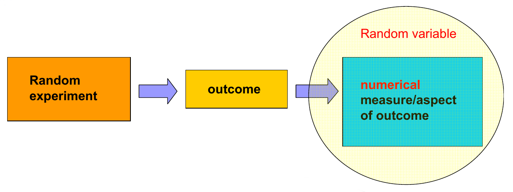
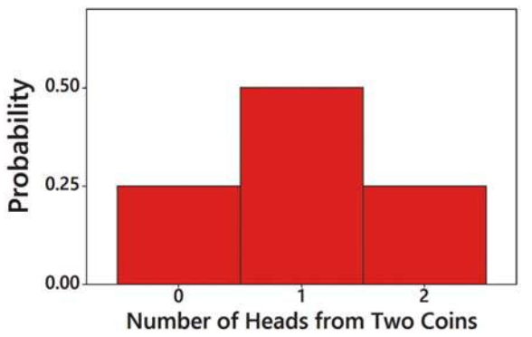

Probability distributions part II
========================================================
date: 03/05/2020
autosize: true
incremental: true
width: 1920
height: 1080

<h2 style="text-align:left"> Instructions:</h2>

Use the left and right arrow keys to navigate the presentation forward and backward respectively.  You can also use the arrows at the bottom right of the screen to navigate with a mouse. 

========================================================

<h2>Outline</h2>

* The following topics will be covered in this lecture:
  * Review of random variables
  * Review of distributions
  * Binomial distribution
  * Parameters of the binomial distribution

========================================================

## Random variables

Courtesy of Ania Panorska  <a href="https://creativecommons.org/licenses/by-sa/3.0" target="blank">CC</a>

  

<ul>  
  <li>Let us recall the idea of a <b>random variable</b>.</li>
  <li>Prototypically, we can consider the coin flipping example from the motivation:</li>
  <ul>
    <li>$x$ is the number heads in two coin flips.</li>
  </ul>
  <li>Every time we repeat two coin flips <strong>$x$ can take a different value</strong> due to many possible factors:</li>
</ul>

<ul>
  <ul>
    <li>how much force we apply in the flip;</li>
    <li>air pressure;</li>
    <li>wind speed;</li>
    <li>etc...</li>
  </ul>
  <li>The result is so sensitive to these factors that are beyond our ability to control, <strong>we consider the result to be by chance</strong>.</li>
  <li><b>Before</b> we flip the coin twice, the <strong>value of $x$ has yet-to-be determined</strong>.</li>
  <li><b>Afte</b>r we flip the coin twice, the <strong>value of $x$ is fixed</strong> and possibly known.</li>
  <li>Formally we will define:</li>
  <ul>
    <li><b>Random variable</b> -- is a variable that has a single
numerical value, determined by chance, for each outcome of a procedure.</li>  
  </ul>
</ul>

  

========================================================

### Random variables continued

Courtesy of Ania Panorska  <a href="https://creativecommons.org/licenses/by-sa/3.0" target="blank">CC</a>

  

<ul> 
  <li>Suppose we are considering our <b>sample space</b> $\mathbf{S}$ of all possible outcomes of a random process.</li>
  <li>Then for any particular outcome of the process,</li>
  <ul>
    <li>e.g., for the coin flips one outcome is $\{H,H\}$,</li>
  </ul>
  <li>mathematically the random variable $x$ takes the outcome to the numerical value $x=2$ in the range $\mathbf{R}$.</li> 
</ul>

  

<ul>
  <li><b>Note:</b> <strong> $x$ must always take a numerical value</strong>.</li>
  <li>Because a <b>random variable</b> takes a <strong>numerical value</strong> (not categorical), we must consider the units that $x$ takes:</li>
  <ul>
    <li><b>Discrete random variable</b> -- these take numerical values that are in <strong>counting units</strong>.</li>
    <ul>
      <li>In particular, the unit of $x$ cannot be arbitrarily sub-divided.</li>
      <ul>
        <li>We can think of "how many coin flips heads" is measured in counting units because $1.45$ heads does not make sense.</li>
      </ul>
      <li>However, the values $x$ takes don't strictly need to be whole numbers;</li>
      <ul>
        <li>the units just <strong>cannot be arbitrarily sub-divided</strong>.</li>  
      </ul>
      <li>The scale of units for $x$ can be finite or infinite depending on the problem.</li> 
    </ul>
  </ul>
</li>
</ul> 

========================================================

### Random variables continued

Courtesy of Ania Panorska  <a href="https://creativecommons.org/licenses/by-sa/3.0" target="blank">CC</a>

  

<ul>
  <ul>
    <li><b>Continuous random variable</b> -- these take numerical values that are in <strong>continuous units</strong>.</li>
    <ul>
      <li>The units of $x$ <strong>can be arbitrarily sub-divided</strong> and $x$ can take any value in the sub-divided units.</li>
      <li>Necessarily, $x$ can take infinitely many values when it is continuous.</li>
      <ul>
        <li>A good example to think of is if $x$ is the daily high temperature in Reno in degrees Celsius.</li>
        <li>If we had a sufficiently accurate thermometer, we could <b>measure $x$ to an arbitrary decimal place</b> and it would make sense.</li>
        <li>$x$ thus takes today's weather from the outcome space and <strong>gives us a number in a continuous unit of measurement</strong>.</li>
      </ul>
    </ul>
  </ul>
</ul>

========================================================

## Probability distributions

Courtesy of Mario Triola, <em>Essentials of Statistics</em>, 6th edition

  

<ul>
  <li>Given a random variable, our method for analyzing its behavior is typically through a probability "distribution".</li>
  <li><b>Probability distribution</b> -- this is a description that gives the <strong>probability for each possible value of the random variable</strong>.</li>
  <ul>
    <li>A probability distribution can thus be considered a <b>complete description</b> of the random variable.</li>
    <ul>
      <li>For <b>any possible value</b> that $x$ might attain given any possible outcome, we know with <strong>what probability this will occur</strong>.</li>   
    </ul>
    <li>It is often expressed in the format of a table, formula, or graph.</li>
  </ul>
</ul>

<ul>
  <li>We see that the table above is a probability distribution as this <strong>gives every possible value for $x$ its associated probability</strong>.</li>
  <li>Notice if we consider the sum of $P(x=x_\alpha)$ over all possible $x_\alpha$ in the range of $x$, $\mathbf{R}$,
    $$\sum_{x_\alpha\in \mathbf{R}}P(x=x_\alpha) = 1.$$</li>
    <ul>
      <li>In fact, this holds for any $x$ and its associated distribution -- intuitively, consider  
      $$P(x=0 \text{ or } x=1 \text{ or } x=2) = 1$$
      because this is all possible values that $x$ can attain.</li>
      <li>However, all $x=0$, $x=1$ and $x=2$ are <b>all disjoint</b> so that,
      $$P(x=0 \text{ or } x=1 \text{ or } x=2) = P(x=0) + P(x=1) + P(x=2) = 1$$</li>
      <li>The same intuition can be used for <strong>infinite ranges</strong> when we use <b>calculus</b> to define this more formally.</li>
    </ul>
</ul>

========================================================

### Probability distributions continued

Courtesy of Mario Triola, <em>Essentials of Statistics</em>, 6th edition

  

<ul>
  <li>We can graphically represent the <b>probability distribution</b> with a histogram similarly to how we represent a <strong>relative frequency distribution</strong>.</li>
  <li>Notice, all values for the probability distribution,
  $$0 \leq P(x=x_\alpha) \leq 1$$
  for any value $x_\alpha$ that $x$ can take.</li>
  <ul>
    <li>This is similar to a <strong>relative frequency distribution</strong>,</li>
    <li>each $P(x=x_\alpha)$ represents a <strong>proportion of all possible ways $x$ can equal $x_\alpha$</strong> relative to all possible outcomes.</li>  
  </ul>
  <li>In the horizontal axis, the centers of the rectangles are at the attainable values for $x$.</li>
  <ul>
    <li>The width of each rectangle is also equal to $1$.</li>
  </ul>
</ul> 

<ul>
  <li>Therefore, if we take the area of rectangle corresponding to some value $x_\alpha$, we have,
  $$\begin{align}
  \text{Area of Rectangle }x_\alpha &= P(x=x_\alpha) \times 1\\ &= P(x=x_\alpha).
  \end{align}$$  </li>
  <li>This says that the <b>histogram</b> is an <strong>identical representation of the probability distribution</strong>.</li>
</ul>

========================================================

## Binomial distribution

<ul>
  <li>A coin flipping experiment is actually a simple example of a broad category of experiments.</li>
  <ul>
    <li>For example, we can consider an experiment in which we describe two possible outcomes:</li>
    <ol>
      <li><b>(success / $S$ / $1$ / $H$)</b>; or</li>
      <li><b>(failure / $F$ / $0$ / $T$)</b>.</li>
    </ol>
    <li>We can <strong>encode the outcomes</strong> any way we like;</li>
    <ul>
      <li>it is <strong>common to encode the outcomes as $S$ or $F$</strong>, where the choice of "success" is arbitrary.</li>  
    </ul>
      <li>More generally than coin flipping, we might <strong>consider the case where the probabilities</strong>,
      $$\begin{align}
      P(\text{success}) \neq P(\text{failure})
      \end{align}$$</li>
      <li>Recall, if the experiment has only <strong>two possible outcomes</strong>, if $A=$"success"   then $\overline{A}=$"failure".</li>
      <li>Therefore,
      $$\begin{align}
      P(\text{success}) + P(\text{failure}) = 1.
      \end{align}$$
      </li>
      <li>Suppose we run the experiment a total of $n$ trials.</li>
      <ul>
        <li>Because there are only <strong>two possible outcomes for each trial</strong>, and a <strong>finite number of trials</strong>, we can <b>create a list of all possible outcomes for $n$ trials</b>.</li>
        <ul>
          <li>For example, if there are <b>$x_\alpha$ total successes</b>, there must be exactly  <strong>$n - x_\alpha$ failures in $n$ trials</strong>.</li>
        </ul>
        <li>More importantly, we can also <strong>make a list of all possible ways</strong> we can have <b>$x_\alpha$ successes</b> and <b>$n-x_\alpha$ failures</b>.</li>
        <li>Let <b>$x$ be the random variable</b> equal to the <strong>number of successful trials</strong> --  we can therefore calculate the probability,
        $$P(x = x_\alpha);$$
        however, the <b>classical model for probability</b> (equal probability of all outcomes) <strong> will no longer apply</strong>.</li>  
      </ul> 
  </ul>
</ul>

========================================================

### Binomial distribution continued

<ul>
  <li>Recall our <b>random variable $x$</b> equal to the <strong>number of successful trials</strong> in $n$ total trials.</li>
  <ul>
    <li>Unlike with coin flipping, we suppose that <strong>it is possible for</strong>
    $$\begin{align}
      P(\text{success}) \neq P(\text{failure})
      \end{align}$$</li>
  </ul>
  <li>However, there are finite trials, finite possible outcomes and, for <strong>each possible number of successes $x_\alpha$</strong>, there are a <b>finite number of ways $x=x_\alpha$</b>.</li>
  <ul>
    <li>Provided <strong>all trials are independent</strong> (like coin flipping) and the <strong>probability of success is constant</strong>, we can still make a counting argument using</li>
    <ol>
      <li>The rule of complementary probability
      $$\begin{align}
      P(\text{success}) + P(\text{failure}) = 1;
      \end{align}$$</li>
      <li>independence;</li>
      <li>the list of all possible ways we can make $x_\alpha$ successes;</li>
      <li>the list of all possible ways we can make $n-\alpha$ failures; and</li>
      <li>a total of $n$ trials exactly;</li>
    </ol>
    <li>to compute the probability exactly for each $x_\alpha$ where $x_\alpha$ ranges from $0, 1, \cdots, n$.</li>
    <li>The list of all possible number of successes $x_\alpha = 0, 1, \cdots, n$ and the associated probabilities $P(x= x_\alpha)$ for $x_\alpha = 0, 1, \cdots, n$ is called the <b>binomial distribution</b>.</li>
  </ul>
  <li>The argument itself is somewhat long, but it really only uses tools we already know.</li>
  <ul>
    <li>Therefore, if you can understand the principles of the points 1 - 5 above, we don't need to belabor the details in this class.</li> 
  </ul>
</ul>

========================================================

### Binomial distribution continued

<ul>
  <li>Formally, we will now describe the <b>binomial distribution</b>.</li>
  <ul>
    <li>Suppose we run an experiment with <b>two possible outcomes</b> <strong>$S=$"success"</strong> and <strong>$F=$"failure"</strong>, where
    $$\begin{align}
    P(S) = p  && P(F) = 1 - P(S) = q.
    \end{align}$$</li>
    <li>Suppose we <b>run exactly $n$ total trials</b> of the above experiment and suppose that:</li>
    <ol>
      <li><strong>each trial is independent</strong>; and
      <li><strong>$P(S)=p$ for every trial</strong>.</li>
    </ol>
    <li>Let <b>$x$ be the random variable</b> equal to the <strong>total number of successful trials</strong>.</li>  
    <li>Let <b>$x_\alpha$</b> be one of the <strong>possible number of successful trials</strong> in the range $0, 1 ,\cdots , n$.</li>
    <ul>
      <li>Then the probability of <strong>exactly $x_\alpha$ successful trials (the event $x= x_\alpha$)</strong> is given by
      $$\begin{align}
      P(x=x_\alpha) =  \frac{n!}{\left( n  - x_\alpha\right)! x_\alpha !} p^{x_\alpha} q^{(n - x_\alpha)},
      \end{align}$$</li>
     <ol>
        <li>where the <b>meaning of the "$!$"</b> for any whole number $m$ is given by
        $$\begin{align}
        m! &= m \times (m-1) \times (m-2) \times \cdots \times 2 \times 1,\\
        \end{align}$$
        i.e., this is the <strong>descending product of all whole numbers less than or equal to $m$ and greater than zero</strong>, <b>except for $0! = 1$ which we take as definition</b>.</li>
        <li>The total number of ways that we can have exactly $x_\alpha$ successes in $n$ trials is given by
        $$ \frac{n!}{\left( n  - x_\alpha\right)! x_\alpha !}. $$
        </li>
        <li>The probability of $x_\alpha$ independent successes (or $n-x_\alpha$ indepednent failures) is $p^{x_\alpha}$ $\big($ or $q^{(n-x_\alpha)}\big)$ respectively.
    </ul> 
  </ul>   
</ul> 

========================================================

## Binomial distribution example 

<ul>
  <li>Recall our notation:
  <ol>
    <li><b>$n$</b> - <strong>the number of trials</strong>;</li>
    <li><b>$x$</b> - <strong>the random variable</strong>;</li>
    <li><b>$x_\alpha$</b> - <strong>a specific number of successes that $x$ could possibly attain</strong>;</li>
    <li><b>$P(S)= p$</b> - <strong>the probability of an independent trial's success</strong>;</li>
    <li><b>$P(F)=q$</b> - <strong>the probability of an independent trial's failure</strong>.</li>
  </ol>
  <li>Consider that when an <strong>adult is randomly selected with replacement</strong>, there is a <b>$0.85$ probability</b> that this <strong>person knows what Twitter is</strong> (based on results from a Pew Research
Center survey).</li>
  <li> Suppose that we want to find the probability that exactly three of
five random adults know what Twitter is.</li>
  <li><b>Discuss with a neighbor:</b> can you identify what $n$, $x$, $x_\alpha$, $p$ and $q$ are in the above word problem?</li>
  <ul>
    <li>Here we consider the <b>random selection to be a "trial"</b> so that the number of trials is $n=5$</li>
    <li>If we consider a <b>"successful" trial</b> to be <strong>"select an adult who knows what Twitter is"</strong>, then <b>$x$</b> is <strong>"number of adults who know what Twitter is out of five"</strong>.</li>
    <li><b>$x_\alpha$</b> is the <strong>specific number of successful trials</strong> we are interested in, i.e., <b>$x_\alpha = 3$</b>.</li>
    <li><b>$p$ is the probability of an independent trial's successs</b>, i.e, $p=0.85$</li>
    <li><b>$q$ is the probability of an independent trial's failure</b>, i.e., $q=1-p = 0.15$.</li>
  </ul>
</ul>

========================================================

### Binomial distribution example continued

<ul>
  <li>Let's recall our values from the last slide,
  <ul>
   <li>Here we consider the <b>random selection to be a "trial"</b> so that the number of trials is $n=5$</li>
    <li>If we consider a <b>"successful" trial</b> to be <strong>"select an adult who knows what Twitter is"</strong>, then <b>$x$</b> is <strong>"number of adults who know what Twitter is out of five"</strong>.</li>
    <li><b>$x_\alpha$</b> is the <strong>specific number of successful trials</strong> we are interested in, i.e., <b>$x_\alpha = 3$</b>.</li>
    <li><b>$p$ is the probability of an independent trial's successs</b>, i.e, $p=0.85$</li>
    <li><b>$q$ is the probability of an independent trial's failure</b>, i.e., $q=1-p = 0.15$.</li>
  </ul>
  <li>Suppose we wanted to compute the probability of one particular outcome,</li>
  <ul>
    <li>say, $S_i =$"the $i$-th particpant knows what Twitter is" and $F_i=$"the $i$-th participant does not know what twitter is", where
  $$A = S_1 \text{ and } S_2 \text{ and } S_3 \text{ and } F_4 \text{ and } F_5.$$</li>
    <li>We can use <b>independence</b> and the <b>multiplication rule</b> to show
    $$\begin{align}
    P(A) &= P(S_1)\times P(S_2)\times P(S_3)\times P(F_4)\times P(F_5) \\
    &= 0.85 \times 0.85 \times 0.85 \times 0.15 \times 0.15 \\
    &= 0.85^3 \times 0.15^2.
    \end{align}$$
  </ul>
  <li>This shows how we get one part of the binomial distribution formula.</li>
  <ul>
    <li>However, there are many combinations of $S_i$ and $F_i$ that arise in $x=3$.</li>
  </ul>
  <li>Using a counting argument, we can show that the total number of ways $x=3$ is
  $$\begin{align}
  \frac{n!}{(n- x_\alpha)! x_\alpha!} = \frac{5!}{(5 - 3)! 3!} = \frac{5!}{(2)!3!} = 10
  \end{align}$$
</ul>

========================================================

### Binomial distribution example continued

<ul>
  <li>Let's recall our values from the last slide,
  <ul>
   <li>Here we consider the <b>random selection to be a "trial"</b> so that the number of trials is $n=5$</li>
    <li>If we consider a <b>"successful" trial</b> to be <strong>"select an adult who knows what Twitter is"</strong>, then <b>$x$</b> is <strong>"number of adults who know what Twitter is out of five"</strong>.</li>
    <li><b>$x_\alpha$</b> is the <strong>specific number of successful trials</strong> we are interested in, i.e., <b>$x_\alpha = 3$</b>.</li>
    <li><b>$p$ is the probability of an independent trial's successs</b>, i.e, $p=0.85$</li>
    <li><b>$q$ is the probability of an independent trial's failure</b>, i.e., $q=1-p = 0.15$.</li>
    <li>The <b>total number of ways $x=3$</b> is
  $$\begin{align}
  \frac{n!}{(n- x_\alpha)! x_\alpha!} = \frac{5!}{(5 - 3)! 3!} = \frac{5!}{(2)!3!} = 10
  \end{align}$$</li>
  </ul>
  <li>The binomial distribution formula can then be read as,</li
  <ul>
    <li>The probability of finding exactly $3$ out of $5$ independently, randomly selected adults who know what Twitter is, is equal to
    $$\begin{align}
    \frac{n!}{(n- x_\alpha)! x_\alpha!} p^{x_\alpha} q^{n- x_\alpha} = 10 \times 0.85^3 \times 0.15^2 \approx 0.138,
    \end{align}$$</li>
  <li>or in plain English,
  <blockquote>
  the probability of three independent successful trials, times the probability of two indepdendent failure trials, times all possible ways we can have exactly $3$ successful trials out of five.
  </blockquote></li>
  <li>Again, the counting argument can be somewhat long and technical so it will not be the focus of the course,</li>
  <ul>
    <li>however, is important that you understand the pieces of the formula and how it fits together.</li>
  </ul>
</ul> 

========================================================

### Binomial distribution example continued

<ul>
  <li>Let's now take a graphical look at the last problem in StatCrunch.</li> 
  <li>We should remark the following on the last calculation.</li>
  <ul>
    <li>Technically, we could only make use of the binomial distribution because we <b>sampled with replacement</b> to enforce <strong>independent trials</strong>.</li>
    <li>If sampled our population <b>without replacement</b>, we know</li>
    <ol>
      <li>that <strong>the trials are dependent</strong>; and</li>
      <li>that the <strong>probability of success changes at each trial</strong>.</li> 
    </ol>
    <li>These conditions make it so the <strong>binomial distribution does not apply</strong> to the random variable $x$ <b>when we do not replace samples</b>.</li>
    <li>However it is common to <b>approximate sampling without replacement as independent</b> when the <strong><b style="color:#d95f02">sample size</b> is less than $5\%$ of the <b style="color:#1b9e77">population</b></strong>.</li>
    <li>In practice for polls of, e.g., all US adults, this approximation will often be used.</li>
    <li>However, in this class, <strong>we will only use this approximation when the problem specifically calls for the approximation</strong>.</li>   
  </ul>
</ul>

========================================================

## Binomial distribution technology example

<ul>
  <li>While it is important to understand the pieces and the principles that go into the binomial formula
  $$\begin{align}
  P(x=x_\alpha) =  \underbrace{\frac{n!}{\left( n  - x_\alpha\right)! x_\alpha !}}_{(1) } \times \underbrace{ p^{x_\alpha}}_{(2)} \times  \underbrace{q^{(n - x_\alpha)}}_{(3)}
  \end{align}$$  
  as:
  </li> 
  <ol type="A">
    <li>Total number of ways to find exactly <b>$x_\alpha$ successful trials</b> out of <strong>$n$ total trials</strong>;</li>
    <li><b>Probability</b> of <strong>$x_\alpha$ independent succesful trials</strong>;</li>
    <li><b>Probability</b> of <strong>$n-x_\alpha$ independent failure trials</strong>;</li>
  </ol> 
  <li>in practice, we will usually let technology handle the complicated calculation.</li>
  <li>Because we will let technology handle these calculations, we should <strong>understand how the pieces fit together</strong> without blindly entering values into formulas.</li>
  <li>We will now consider a more complicated example:</li>
  <ul>
    <li>Before 2012, the NFL used to decide overtime games by a coin flip where the winner could decide if they kicked or recieved the ball in a fresh play.</li>
    <li>Between 1974 and 2011, <b>460 overtime games</b> did not end in a tie.</li>
    <li><b>252</b> of these games were <strong>won by the team that won the coin toss</strong> and got to decide whether to kick or recieve.</li>
    <li>Let's <b>assume</b> that the <strong>probability of winning or losing an overtime game is equally likely</strong>.</li>
    <li><b>Discuss with a neighbor:</b> if we want to find the probability of winning exactly $252$ games, can you identify what $n$, $x$, $x_\alpha$, $p$ and $q$ are in the above word problem?</li>
  </ul>
</ul>

========================================================

### Binomial distribution technology example continued

<ul>
  <li>From the last slide, we will consider, <b>$n= 460$ independent trials (overtime games)</b>.</li>
  <li><b>$x$</b> is the <strong>number of wins in overtime</strong>.</li>
  <li><b>$x_\alpha=252$</b> is the <strong>specific number of successful trials</strong> we are interested in.</li>
  <li><b>$p=q=0.5$</b> because <strong>(we assume) either outcome is equally likely</strong>.</li>
  <li>Therefore, we have,
  $$\begin{align}
  P(x=x_\alpha) &=  \frac{n!}{\left( n  - x_\alpha\right)! x_\alpha !} \times p^{x_\alpha} \times q^{(n - x_\alpha)}\\
  &=\frac{460!}{(460 - 252)!252!} \times 0.5^{252} \times 0.5^{(460 - 252)} \\
  &= \frac{460!}{208!252!}\times 0.5^{252} \times 0.5^{208}
  \end{align}$$</li>
  <li>This is a complicated expression, so therefore we will examine this in StatCrunch directly.</li>
</ul>

========================================================

### Binomial distribution technology example continued

<ul>
  <li>Consider the last example where:</li>
  <ul>
    <li>Between 1974 and 2011, <b>460 overtime games</b> did not end in a tie.</li>
    <li><b>252</b> of these games were <strong>won by the team that won the coin toss</strong> and got to decide whether to kick or recieve.</li>
    <li>Let's <b>assume</b> that the <strong>probability of winning or losing an overtime game is equally likely</strong>.</li>
    <li>Another way of saying this is that,</li>
    <ul>
      <li><strong>we will assume that the result of the coin flip has no impact on whether the team wins or loses</strong>.</li>
    </ul>
  </ul>
  <li>Recall, we saw earlier that when observing some outcome, e.g.,  $x = 252$, if the probability of observing some outcome <strong>at least as extreme</strong> is less than $5\%$ we call this <b>interesting or significant</b>.</li>
  <li><b>If $252$ successful trials is significant</b>, then assuming that winning the coin flip makes no difference on the outcome,</li>
  <ul>
    <li>i.e., <strong>assuming $p=q=0.5$</strong>,</li>
  </ul>
  <li><b>then we should question this assumption</b>.</li>
  <li>We will look at this in StatCrunch directly -- while we do so, <b>Discuss with a neighbor:</b> </li>
  <ul>
    <li>is the $252$ wins significant for the binomial distribution for $n=460$ trials and equal probability of success and failure?</li>
  </ul>
</ul>

========================================================

### Binomial distribution technology example continued

<ul>
  <li>The process that we took in the last example was what we called before, <strong>assuming the null hypothesis</strong>.</li>
  <li>We <b>assumed that</b> the <strong>probability of winning or losing overtime was equally likely</strong>;</li>
  <ul>
    <li>in particular, it shouldn't depend on the coin toss.</li>
  </ul>
  <li>However, we found that the probability of finding some event at least as extreme was given by,
  $$P(x \geq 252) \approx 0.0224$$
  in the case that winning or losing is equally likely.</li>
  <li>Being <b>less than $5\%$</b>, we called this <strong>observation significant</strong>, and this strongly suggests that winning the coin flip gave the team an advantage in overtime.</li>
  <li>This is precisely why the overtime rule was changed in 2012.</li>
</ul>

========================================================

## Parameters of the binomial distribution

Courtesy of Ania Panorska  <a href="https://creativecommons.org/licenses/by-sa/3.0" target="blank">CC</a>

  

<ul>
  <li>We saw earlier the following definitions for the mean and the standard deviation of a probability distribution:
  <ul>
  <li>Suppose we have a random variable $x$ which assigns a numerical value to each outcome in the sample space $\mathbf{S}$.</li>
  <li>Suppose all values that $x$ can attain are given by a collection $\{x_\alpha\}$ in the range $\mathbf{R}$ of $x$.</li>
</ul>

<ul>
  <li>Then the <b style="color:#1b9e77">mean (or expected value) of the probability distribution</b> is given,
    $$\mu = \sum_{x_\alpha \in \mathbf{R}} x_\alpha P(x=x_\alpha)$$ </li>
  <li>The <b style="color:#1b9e77">standard deviation of the probability distribution</b> is given
    $$\sigma = \sqrt{\sum_{x_\alpha\in \mathbf{R}} P(x=x_\alpha) \left(x_\alpha - \mu\right)^2 }$$</li>
    <li>These formulas hold for all probability distributions (with a slight modification when the variable is continuous by using calculus).</li>
  </ul>
</ul>

========================================================

### Parameters of the binomial distribution continued

Public domain via  
        <a href="https://commons.wikimedia.org/wiki/File:Binomial_distribution_pmf.svg"> Wikimedia Commons</a>

<ul>
  <li>The binomial distribution has a very nice structure so that the <b style="color:#1b9e77">parameters</b> have a nice form.</li>
  <li>For the <b>binomial distribution</b> the <b style="color:#1b9e77">mean</b> is given as,
  $$\mu = n \times p .$$</li>
    <li>For the <b>binomial distribution</b> the <b style="color:#1b9e77">variance</b> is given as,
  $$\sigma^2 = n \times p \times q.$$</li>
      <li>For the <b>binomial distribution</b> the <b style="color:#1b9e77">standard deviation</b> is given as,
  $$\sigma = \sqrt{ n \times p \times q}.$$</li> 
  <li><b>Discuss with a neighbor:</b> what is $\mu$ and $\sigma$ for the binomial distribution for $20$ trials and probability of success $p=0.5$?</li>
  <ul>
    <li>Notice that these are given as,
    $$\begin{align} \mu = 20 \times 0.5 = 10 & & \sigma = \sqrt{20 \times 0.5 \times 0.5} = \sqrt{ 5}\end{align}$$</li>
  </ul>
</ul> 

<ul>
  <li><b>Discuss with a neighbor:</b> what is $\mu$ and $\sigma$ for the binomial distribution for $40$ trials and probability of success $p=0.5$?</li>
  <ul>
    <li>Notice that these are given as,
    $$\begin{align} \mu = 40 \times 0.5 = 20 & & \sigma = \sqrt{40 \times 0.5 \times 0.5} = \sqrt{ 10}\end{align}$$</li>
  </ul>
    <li><b>Discuss with a neighbor:</b> what is $\mu$ and $\sigma$ for the binomial distribution for $20$ trials and probability of success $p=0.7$?</li>
  <ul>
    <li>Notice that these are given as,
    $$\begin{align} \mu = 20 \times 0.7 = 14 & & \sigma = \sqrt{20 \times 0.7 \times 0.3} = \sqrt{ 4.2}\end{align}$$</li>
  </ul>
</ul>

========================================================

### Parameters of the binomial distribution and the range-rule-of-thumb

<ul>
  <li>Recall that:</li>
  <ul>
    <li>for the <b>binomial distribution</b> the <b style="color:#1b9e77">mean</b> is given as,
  $$\mu = n \times p .$$</li>
    <li>For the <b>binomial distribution</b> the <b style="color:#1b9e77">standard deviation</b> is given as,
  $$\sigma = \sqrt{ n \times p \times q} .$$</li>
  </ul>
  <li>Let's consider the NFL example again, using the range rule of thumb.</li>
  <li>Recall that there were $460$ trials with an assumed probability of $0.5$ for success.</li>
  <li><b>Discuss with a neighbor:</b> using the range-rule-of-thumb, is $252$ successful trials <b>significant</b>?</li>
  <ul>
    <li>Notice,
     $$\begin{align} \mu = 460 \times 0.5 = 230 & & \sigma = \sqrt{460 \times 0.5 \times 0.5} = \sqrt{ 115}\approx 10.72.\end{align}$$</li>
    <li>We call <strong>observations that lie outside of the range</strong>,
    $$(\mu - 2 \sigma , \mu + 2 \sigma ) \approx ( 208.56, 251.44)$$
    <b>significant</b>.</li>
    <li>The total number of wins $252$ is just <strong>outside of the range</strong>, so by the range-rule-of-thumb, we also call this a <strong>significant observation</strong>.</li>  
  </ul>
</ul>

========================================================

## Review of the binomial distribution

<ul>
  <li>The binomial distribution is a key distribution that gives us a way to model a wide range of experiments probabilistically.</li>
  <li>This applies when we run an experiment with <b>two possible outcomes</b> <strong>$S=$"success"</strong> and <strong>$F=$"failure"</strong>, where
    $$\begin{align}
    P(S) = p  && P(F) = 1 - P(S) = q.
    \end{align}$$</li>
    <li>When we <b>run exactly $n$ total trials</b> of the above experiment, assuming that:</li>
    <ol>
      <li><strong>each trial is independent</strong>; and
      <li><strong>$P(S)=p$ for every trial</strong>.</li>
    </ol>
  <li>We can model the probability of a particular number of successes $x_\alpha$ like a (possibly) non-fair coin flipping experiment.</li>
  <li>We model the probability of exactly $x_\alpha$ successful trials as 
  $$\begin{align}
  P(x=x_\alpha) =  \underbrace{\frac{n!}{\left( n  - x_\alpha\right)! x_\alpha !}}_{(1) } \times \underbrace{ p^{x_\alpha}}_{(2)} \times  \underbrace{q^{(n - x_\alpha)}}_{(3)}
  \end{align}$$  
  where:
  </li> 
  <ol type="A">
    <li>Total number of ways to find exactly <b>$x_\alpha$ successful trials</b> out of <strong>$n$ total trials</strong>;</li>
    <li><b>Probability</b> of <strong>$x_\alpha$ independent succesful trials</strong>;</li>
    <li><b>Probability</b> of <strong>$n-x_\alpha$ independent failure trials</strong>;</li>
  </ol> 
  <li>The special structure of this distribution also allows us to compute the mean and standard deviation directly as
  $$\begin{align} \mu = n \times p  & & \sigma = \sqrt{n \times p\times q} \end{align}$$
</ul>
