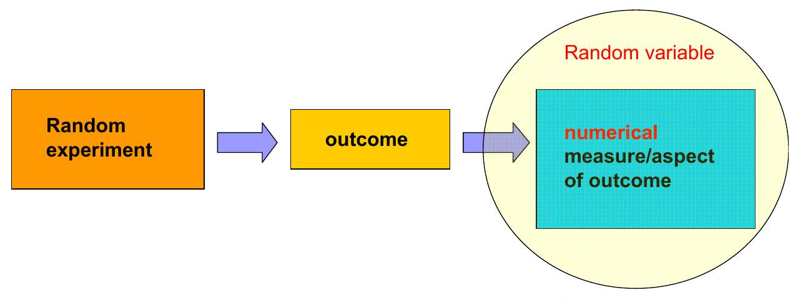
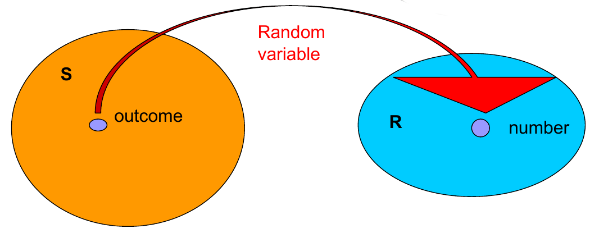
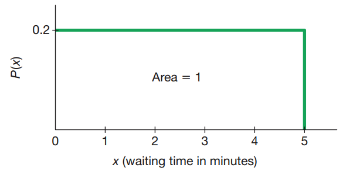
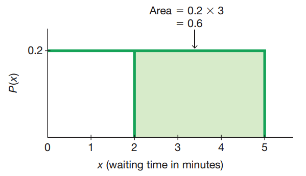
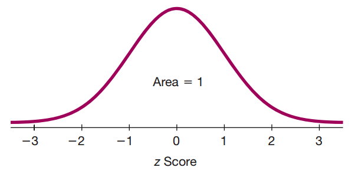

Probability distributions part III
========================================================
date: 03/05/2020
autosize: true
incremental: true
width: 1920
height: 1080

<h2 style="text-align:left"> Instructions:</h2>

Use the left and right arrow keys to navigate the presentation forward and backward respectively.  You can also use the arrows at the bottom right of the screen to navigate with a mouse. 

========================================================

<h2>Outline</h2>

* The following topics will be covered in this lecture:
  * Poisson distribution
  * Continuous random variables
  * Uniform distribution
  * Normal distributions
  

========================================================

## Poisson distribution motivation

Courtesy of Ania Panorska  <a href="https://creativecommons.org/licenses/by-sa/3.0" target="blank">CC</a>

  

<ul>
  <li>Consider modeling the amount of mail you receive each day.</li>
  <li>Suppose that expected number of pieces of mail on a given day will remain constant across any given day;</li>
  <ul>
    <li>i.e., the actual ammount will have variation but the expected amount is always the same, e.g., 4 pieces.</li>  
  </ul>
  <li> Suppose as well that the arrival times of all pieces of mail are independent;</li>
  <ul>
    <li>i.e., how many pieces of mail you receive one day does not affect future days.</li> 
  </ul>

<ul>  
  <li>If we wanted to model this kind of random experiment, we would call:</li>
  <ol>
    <li><b>Random experiment</b> - daily mail;</li>
    <li><b>Outcome</b> - the actual mail received;</li>
    <li><b>Random variable</b> - total number of pieces of mail.</li>
  </ol>
  <li>Let's suppose that the standard deviation for the number of pieces of mail in a given day is also constant, equal to the square root of the expected number, $\sqrt{4}=2$.</li> 
  <li>If $x$ is the random variable above, typically we would model its behavior in terms of a <b>Poisson distribution</b>.</li>  
</ul>

========================================================

### Poisson distribution motivation continued

Courtesy of Ania Panorska  <a href="https://creativecommons.org/licenses/by-sa/3.0" target="blank">CC</a>

  

<ul> 
  <li>The example on the last slide of the daily mail is on particular example of a <b>Poisson</b> distributed varible because:</li>
  <ul>
    <li>the <b>random variable $x$</b> measures the outcome of <strong>some random process over an interval</strong>;</li> 
    <ul>
      <li>i.e., we measured the ammount of mail <strong>over one day</strong>.</li>
    </ul>
    <li>the <b>outcome in any particular interval</b> is <strong>considered to be by chance</strong>;</li> 
    <ul>
      <li>i.e., the actual mail we recieve on a given day is basically by chance.</li>   
    </ul>
  </ul>   
</ul>

<ul>
  <ul>
    <li>The <b>outcome in one interval</b> is <strong>independent of the outcome in any other interval</strong>;</li>
    <ul>
      <li>i.e., the mail recieved one day doesn't affect the mail recieved any other day.</li>
    </ul>
    <li>But in addition, the <b>expected value</b> for the random variable $x$ <strong>is the same in any interval</strong>,</li>
    <ul>
      <li>i.e., on every given day, we might expect to have $4$ pieces of mail arriving (possibly more or less in reality).</li>  
    </ul>
  </ul>
</ul>

========================================================

### Poisson distribution motivation continued

Courtesy of Ania Panorska  <a href="https://creativecommons.org/licenses/by-sa/3.0" target="blank">CC</a>

  

<ul>
  <li>A similar idea can be applied to Customer Support phone queues for a given hour.</li>
  <li>The number of callers in a given hour is determined basically by chance.</li>
  <ul>
    <li>However, we can suppose that the <b>expected</b> number of incoming calls will be the <strong>same in any one hour interval</strong>.</li>
  </ul>
  <li>We will also suppose that the <b>callers</b> are <strong>independent</strong>,</li>
  <ul>
    <li>i.e., we suppose that the number of callers in one hour does not affect the number of callers in another hour.</li>  
  </ul>   
</ul>

<ul>
  <li>Let $x$ be the random variable equal to the number of incoming calls in a given hour.</li> 
  <li>We are once again in a situation where a Poisson distribution is a good model for the behavior of $x$.</li> 
  <li>This is again because:</li>
  <ol>
    <li>The <b>expected value of $x$</b> is <strong>constant for any given interval</strong>; and</li>
    <li>the <b>outcomes in any two given intervals</b> are <strong>mutually independent</strong>.</li>  
  </ol>
  <li>More broadly, examples can include <b>intervals</b> in <strong>units of distance, area, volume etc... not just time</strong>.</li>
  <ul>
    <li>However, we are always measuring the number of occurances of some event over some interval.</li>
  </ul>
</ul>

========================================================

## Poisson distribution

<ul>
  <li>Formally we will describe a Poisson distribution as follows:</li>
  <ul>
    <li>Suppose we have a <b>random process</b> which has <strong>outcomes measured in some interval</strong> (time / distance / volume / etc...).</li> 
    <li>Let $x$ be the <b>random variable</b> equal to the <strong>number of occurances of the random process in a given interval</strong>.</li>
    <ul>
      <li>The random variable $x$ takes outcomes of the process to values in the <b>range</b> $\mathbf{R}$ <strong>including $0, 1 ,2, \cdots$ up to arbitrarily large, finite values</strong>.</li>
    </ul>
    <li>Suppose that the <b>expected number of occurances</b> in any given interval is the <strong>fixed value $\mu$</strong>.</li>
    <li>Also suppose that the <b>number of occurances</b> in any given interval is <strong>independent</strong> of the number of occurances in <strong>any other given interval</strong>;</li>
    <ul>
      <li>the value $x$ attains during one (hour / mile / $\mathrm{cm}^3$ / etc...) doesn't affect the value it attains in any other.</li>
    </ul>
    <li>Then, the <b>probability of exactly $x_\alpha$ occurances</b> of the process <strong>in a given interval</strong> is given by,
    $$\begin{align}
    P(x=x_\alpha) = \frac{\mu^{x_\alpha}e^{-\mu}}{x_\alpha !},
    \end{align}$$
    where:</li>
    <ol>
      <li>$e \approx 2.71828$ is known as Euler's number, the base of the natural logarithm $ln$.</li>  
      <li> the <b>meaning of the "$!$"</b> for any whole number $m$ is given by
        $$\begin{align}
        m! &= m \times (m-1) \times (m-2) \times \cdots \times 2 \times 1,\\
        \end{align}$$
       <b>except for $0! = 1$ which we take as definition</b>.</li>
    </ol>
    <li><b>Note:</b> the Poisson distribution is described entirely by $\mu$ and the standard deviation of the Poisson distribution is always given as,
    $$\sigma = \sqrt{\mu}.$$</li>
    </li>
  </ul>
</ul>

========================================================

### Poisson distribution continued

<ul>
  <li>From the last slide, the <b>probability of exactly $x_\alpha$ occurances</b> of the process <strong>in a given interval</strong> is given by,
    $$\begin{align}
    P(x=x_\alpha) = \frac{\mu^{x_\alpha}e^{-\mu}}{x_\alpha !}.
    \end{align}$$
  </li>
  <li>This expression can be analyzed as follows:</li>
  <ul>
    <li>We note that
    $$\mu^{x_\alpha}$$
    so that the <b>numerator</b> <strong>grows exponentially</strong>  as we consider larger values of $x_\alpha$.</li>  
    <li>The factorial
    $$x_\alpha ! = x_\alpha \times (x_\alpha - 1 ) \times (x_\alpha -2) \times \cdots 2 \times 1 $$
    in the <b>denominator</b> actually <strong>grows faster than exponential</strong>,</li>
    <li>however, the <b>denominator</b> <strong>grows slower than double exponentials</strong>
    $$x_\alpha^{x_\alpha}.$$ 
    </li> 
    <ul>
      <li>Therefore, the probability of $x=x_\alpha$ given by the ratio,
      $$\frac{\mu^{x_\alpha}e^{-\mu}}{x_\alpha !}$$
      grows to a peak close to
      $$\frac{\mu^{\mu}e^{-\mu}}{\mu !}.$$</li>
      <li>For values $x_\alpha \geq \mu$, the denominator grows more quickly and becomes greater than the numerator;</li>
      <ul>
        <li>thus the <b>probability of $x=x_\alpha$</b> <strong>decreases for $x_\alpha \geq \mu$ but never reaches zero</strong>.</li>  
      </ul>
    </ul>
    <li>We can visualize this description in StatCrunch.</li>
  </ul>
</ul>

========================================================

## Poisson distribution example

<ul>
  <li>Let's consider a simple example of how we can model a random proceedure with a Poisson distribution.</li>
  <ul>
    <li>Consider our first example where we suppose that we have an expected value of $4$ pieces of mail per day with a standard deviation of $\sqrt{4}=2$ pieces of mail per day.</li>
    <li>We will suppose that:</li>
    <ol>
      <li>the expected number of pieces of mail does not change from day to day, and</li>
      <li>that the number of pieces of mail in any given day does not affect the number of pieces of mail in a different day.</li>
  </ul>
  <li>If we want to find the probability of recieving exactly $x_\alpha = 6$ pieces of mail, this can be found as,
  $$\begin{align}
    P(x=x_\alpha) &= \frac{\mu^{x_\alpha}e^{-\mu}}{x_\alpha !} \\
    &= \frac{4^{6}e^{-4}}{6 !}.
    \end{align}$$
    </li>
    <li>This is a complicated expression, but one that we can look at directly in StatCrunch.</li>
</ul>

========================================================

### Poisson distribution example continued

<ul>
  <li>Let's consider another example of how we can use the Poisson distribution.</li>
  <ul>
    <li>In the $55$ year period between $1960$ and $2015$ there have been $336$ Atlantic hurricanes.</li>
    <li>While the variation in the intensity of hurricanes changed over this period due to global climate change, the expected number of huricanes per year did not change.</li>
    <li>Also, the number of hurricanes in one year is basically independent of the number of hurricanes in a different year.</li>
    <li>Let's make the following assumptions:</li>
    <ol>
      <li>We will suppose that the Poisson distribution is a good model for the number of hurricanes in a year.</li>
      <li>We will suppose that the sample mean $\overline{x}$ is a good estimate for the expected value $\mu$ of the number of hurricanes per year.</li>
    </ol>
    <li><b>Discuss with a neighbor:</b> can you identify the interval of interest for this problem, $x$ the random variable and $\overline{x}$ the sample mean?</li>
    <ul>
      <li>The interval is the time period of one year.</li>
      <li>$x$ is the total number of hurricanes per year.</li>
      <li>$\overline{x} = \frac{336}{55} \approx 6.1$ hurricanes per year.</li>
    </ul>
    <li>We will consider now what the probability of $x=8$ hurricanes in one year.</li>
    <ul>
      <li>Using the Poisson distribution, we say that
      $$P(x = 8) = \frac{(6.1)^8 e^{-6.1}}{8!}$$
      </li>
      <li>This is a complicated expression that we will look at in StatCrunch directly.</li>
    </ul>
  </ul>
</ul>

========================================================

### Poisson distribution example continued

<ul>
  <li>We saw in StatCrunch that the probability of $x=8$ hurricanes in a year is,
  $$P(x = 8) = \frac{(6.1)^8 e^{-6.1}}{8!}\approx 10.7\%.$$</li>
  <li>This can be considered to say, we expect about $10$ or $11$ years with $8$ hurricanes in a $100$ year period.</li>
  <li><b>Note</b> in the $55$ year period there were exactly $5$ years which had precisely $8$ hurricanes in them.</li>
  <li><b>Discuss with a neighbor:</b> does the real outcome in terms of number of years with $8$ hurricanes seem to match our theoretical model with the Poisson distribution?</li>
  <ul>
    <li>If we consider, $.107\times 55 =5.885$ then the $5$ years with $8$ hurricanes exactly appears to match this theoretical model for the number of hurricanes per year.</li>
  </ul>
  <li>This above example is a good introduction to the kind of thinkning we will start doing in this course:</li>
  <ul>
    <li>We will have some ammount of <b style="color:#d95f02">sample data</b> and some knowledge about the way the <strong>random variable</strong> behaves.</li>
    <li>Our knowledge about the way the <b>random variable</b> behaves will suggest a theoretical model, a <strong>probability distribution</strong>, for this random variable.</li>
    <li>We will use our <b style="color:#d95f02">sample data</b> to try to <strong>estimate the relevant <b style="color:#1b9e77">parameters</b> of the distribution</strong>.</li>
    <li>We will then <b>test our theoretical model</b> versus data to <strong>validate it or invalidate it</strong>.</li>
    <li>Finally, what we have yet-to-do is to <b>provide an estimate</b> of <strong>how uncertain the parameters and the theoretical model are</strong>.</li>
  </ul>
</ul>

========================================================

## Poisson distribution as an approximation for binomial distribution

<ul>
  <li>For theoretical reasons, the Poisson distribution is actually related to the binomial distribution.</li>
  <li>In certain cases, the <b>Poisson distribution</b> <strong>makes a good approximation of the binomial distribution</strong>.</li>
  <ul>
    <li>This is the case generally when $n$ (the number of independent trials) is large; and $p$ (the probability of a successful trial) is small.</li> 
    <li>Specifically, our <b>approximation for binomial with Poisson</b> will require:</li>
    <ol>
      <li><strong>$n$ should be greater than $100$</strong>; and</li>
      <li><strong>$n\times p$ should be less than $10$</strong>.</li>
    </ol>
  </ul>
  <li>Recall that the <b style="color:#1b9e77">mean (expected value)</b> for the <b>binomial distribution</b> is given by, 
  $$\mu_b = n\times p .$$</li>
  <li>When the above two conditions are satisfied, we can <strong>approximate</strong> the <b style="color:#1b9e77">mean (expected value)</b> of the <b>Poisson distribution</b> by
  $$\mu_p \approx n \times p.$$</li>
  <li>We will consider an example of this with the Maine Pick 4 Game:</li>
  <ul>
    <li>In this game you choose $4$ digits, each ranging between $0, 1, 2, \cdots, 9$.</li>
    <li>A winning number selected randomly -- i.e., each digit is selected randomly with equal probability and with replacement.</li>
    <li>Therefore, for our choice of number there is a probability of
    $$\frac{1}{10}\times \frac{1}{10}\times \frac{1}{10} \times \frac{1}{10} = \frac{1}{10,000}$$  
    that we are selected as a winner.</li>
    <li><b>Discuss with a neighbor:</b> if we play this game for $365$ days, can we model the probability of winning at least once with Poisson?</li>
  </ul>
</ul>

========================================================

## Poisson distribution as an approximation for binomial distribution continued

<ul>
  <li>From the last slide we know that there are $n=365$ trials and a probability of success $p=\frac{1}{10,000}$.</li>
  <li>Based on our conditions:</li>
  <ol>
      <li><strong>$n$ should be greater than $100$</strong>; and</li>
      <li><strong>$n\times p$ should be less than $10$</strong>;</li>
    </ol>
  <li>Poisson will make a good approximation here.</li>
  <li><b>Discuss with a neighbor:</b> to find the probability of <b>at least one success</b>, how can we use complementary probability to solve this problem?</li>
  <ul>
    <li>Notice that $A=$"zero successes" implies $\overline{A}=$"at least one success".</li>
  </ul>
  <li>Using this fact, we can approximate the probability of $\overline{A}$ with the Poisson random variable $x$ as
  $$\begin{align}
  P(\overline{A}) &= 1 - P(A) \\
  &\approx 1 - P(x=0)\\
  &= 1 - \frac{ \left(n \times p\right)^0 \times e^{- n \times p}}{0!} \\
  &=1 - \frac{1 \times e^{- 0.0365}}{1} \approx 0.358.
  \end{align}$$</li>
  <li>In fact, using StatCrunch, we can see that the probability of at least $1$ success using the binomial distribution is also approximately $0.358$, so we get a good approximation here.</li> 
</ul>

========================================================

## Continuous random variables

Courtesy of Mario Triola, <em>Essentials of Statistics</em>, 6th edition

 

<ul>
  <li>So far our examples have focused on <b>discrete random variables</b>, e.g.:</li>
  <ul>
    <li>Results of <b>coin flips</b> -- $x$ is modeled with a <strong>binomial distribution</strong>.</li>
    <li>Results of <b>success / failure trials</b> -- $x$ is modeled with a <strong>binomial distribution</strong>.</li>
    <li>Number of <b>occurances in an interval</b> -- $x$ is modeled with a <strong>Poisson distribution</strong>.</li>
  </ul>
  <li>We will now turn our attention to <b>continuous random variables</b>, but we will use what we learned about <strong>discrete variables to motivate this</strong>.</li>
  <li>Recall that the probability histogram had the property,
    $$\begin{align}
  \text{Area of Rectangle }x_\alpha &= P(x=x_\alpha) \times 1\\ &= P(x=x_\alpha).
  \end{align}$$ 
</ul>

<ul>
  <li>We also saw that we have the property
  $$\sum_{x_\alpha \in \mathbf{R}} P(x=x_\alpha) =1. $$
  </li>
  <li>Putting the above two properties together, we know,
  $$\sum_{x_\alpha \in \mathbf{R}} \text{Area of Rectangle }x_\alpha =1.$$
  </li>
  <li>For <b>continuous random variables</b>, we in fact have the <strong>same property with a minor modification</strong>:
  <blockquote>
  Let $f(x)$ describe a curve for a probability distribution.  Then the total area under the curve $f(x)$ equals $1$, and the probability of any event $A$ equals the associated area under $f(x)$ for all $x_\alpha$ in the case of $A$.
  </blockquote>
</ul>

========================================================

## Uniform distribution

Courtesy of Ania Panorska  <a href="https://creativecommons.org/licenses/by-sa/3.0" target="blank">CC</a>

  

<ul>
  <li>A basic example of the area property is with the <b>uniform distribution</b></li>
  <ul>
    <li>Let's suppose that we are studying some procedure where all outcomes are equally likely.</li>
    <ul>
      <li>A very simple example is if you are asked to <b>guess a random number</b> between $1$ and $10$, <strong>but including decimals</strong>.</li> 
    </ul>
    <li>That is, we will suppose that guessing $1.23453453$ is equally likely as guessing $5$.</li> 
  </ul>
</ul>

<ul>
  <li>Viewed in the above,
  <ul>
    <li>Our <b>random experiment</b> is <strong>guessing some number</strong>.</li>
    <li>The <b>outcome</b> is <strong>one guess</strong>.</li>
    <li>The <b>random variable $x$</b> is <strong>assigned the value of the guess</strong>.</li>
  </ul>
  <li>Because we allow <b>arbitrary decimal expansions</b>, there are <strong>infinitely many choices</strong>.</li>   
  <li>However, <strong>all choices lie in the finite range $[1,10]$ and are equally likely</strong>.</li>
  <li><b>Discuss with a neighbor:</b> if the area under the curve $f(x)$ for $x_\alpha$ in $[1, 10]$ must equal one, and the height of $f(x)$ is constant, what is the height?</li>
</ul>

========================================================

### Uniform distribution continued

Courtesy of IkamusumeFan <a href="https://creativecommons.org/licenses/by-sa/3.0" target="blank">CC</a> via <a href="https://commons.wikimedia.org/wiki/File:Uniform_Distribution_PDF_SVG.svg">Wikimedia Commons</a>

  

<ul>
  <li>Recall, the area is given by the height $h$ times the width $w$.</li>
  <li>The area is fixed at $1$ and the width is $10-1$ so that,
  $$\begin{align}
  &1 = h\times w \\
  \Leftrightarrow & \frac{1}{9} = h
  \end{align}$$</li>
  <li>Here, the probability distribution curve,
  $$
  f(x) = 
  \begin{cases} 
  \frac{1}{9} & \text{for }x\text{ in }[1,10] \\
  0 & \text{else}
  \end{cases}
  $$
  <li>More generally, <strong>consider any range of values $[a,b]$</strong> where $a &lt; b$.</li>
  <li>If we can <strong>randomly select any value</strong> in the range $[a,b]$ with the <b>same likelihood</b></li>
  <li>let $x$ be the random variable assigned the value we select.</li>
  </ul>

<ul>
  <li>Then the probability distribution for $x$ is <b>uniform over $[a,b]$</b>   with
  $$
    f(x) = 
  \begin{cases} 
  \frac{1}{b-a} & \text{for }x\text{ in }[a,b] \\
  0 & \text{else}
  \end{cases}
  $$</li>
  <li>The <strong>graph of this distribution curve</strong> (as above) is called the <b>probability density</b>.</li>
  <li>Thus, if we take any $\alpha &lt; \beta$ in $[a, b]$, the probability of $x$ in $[\alpha, \beta]$ is given by the area (width times the height of this block),
  $$(\beta - \alpha) \times \frac{1}{b-a}.$$  </li>
</ul> 

========================================================

## Uniform distribution example

Courtesy of Mario Triola, <em>Essentials of Statistics</em>, 6th edition

  

<ul>
  <li>Let's consider an example of the uniform distribution that is from real life.</li>
  <ul>
    <li>During certain times at the RNO airport, waiting times in security are uniformly distributed in the interval between $0$ and $5$ minutes.</li>
    <li>This is to say that:</li>
    <ul>
      <li>All waiting times in the interval $[0,5]$ are equally likely.</li>
      <li>The waiting time can be measured to an arbitrary decimal place,</li>
      <ul>
        <li>e.g., you could wait exactly 1.3534543 minutes.</li>  
      </ul>
      <li> The probability distribution for waiting times is given as 
      $$
      f(x) = 
      \begin{cases} 
      \frac{1}{5} & \text{for }x\text{ in }[0,5] \\
      0 & \text{else}
      \end{cases}
      $$</li>
    </u>
  </ul>
</ul>

<ul>
  <ul>
    <li>And, the probability of waiting some ammount of time is equal to the associated area under $f(x)$.</li>
  </ul>
  <li><b>Discuss with a neighbor:</b> what is the probability of waiting between $2$ and $5$ minutes at RNO security, if waiting time $x$ is uniformly distributed over $[0,5]$?</li> 
</ul>

========================================================

### Uniform distribution example continued

Courtesy of Mario Triola, <em>Essentials of Statistics</em>, 6th edition

  

<ul>
  <li>We want to find the area under $f(x)$ defined as,
    $$  
      f(x) = 
      \begin{cases} 
      \frac{1}{5} & \text{for }x\text{ in }[0,5] \\
      0 & \text{else}
      \end{cases}
    $$</li>
  <li>but for the  interval between $2$ and $5$.</li>
  <li>The area can be derived as the length times height where,
  $$\begin{align}
  l = 5 - 2 = 3 & & h = 0.2 \text{ for }x\text{ in the range }[2,5]
  \end{align}$$</li>
  <li>That is,
  $$\begin{align}
  P(x \text{ in }[2, 5])  &= l \times h \\
  &= 3 \times 0.2 = 0.6
  \end{align}$$</li>
</ul>

<ul>
  <li>Note that the <b>formula for the area</b>,
  $$\text{Area} = l \times h$$
  <strong>only applies for rectangles as above</strong>.</li>
  </li> 
  <li>However, the principle of,  
  $$\text{Probability } = \text{Area under the probability density graph}$$ 
  <strong>holds for all distributions $f(x)$</strong>.</li> 
  <li>Particularly, this also holds for non-rectangular, <b>bell shaped curves</b>...</li>
</ul>

========================================================

## The normal distribution 

Courtesy of Mario Triola, <em>Essentials of Statistics</em>, 6th edition

  

<ul>  
  <li>Recall, frequency data is called normal when it exhibits the following:</li> 
  <ul>
    <li> <strong>The frequencies start low, then increase to one or two high frequencies, and
then decrease to a low frequency.</strong></li>
    <li> <strong>The distribution is approximately symmetric.</strong></li>
    <li><strong>There are few if any extreme values.</strong></li>
  </ul>
  <li>We have a theoretical probability model for this type of data called a <b>normal distribution</b>.
  <li>Let <b>$x$ be a random variable</b> with <b style="color:#1b9e77">mean $\mu$</b> and <b style="color:#1b9e77">standard deviation $\sigma$</b> which behaves as above.</li>  
</ul>

<ul>
  <li>We say that $x$ has a <b>normal distribution</b>,
  $$f(x) = \frac{1}{\sigma \sqrt{2\pi}} e^{\frac{1}{2}\left(\frac{x- \mu}{\sigma}\right)^2}$$
  with <b style="color:#1b9e77">the parameters $\mu$ and $\sigma$</b>.</li>
  <li><b>Note:</b> the area under $f(x)$ cannot be computed by $l\times h$, but the <strong>total area under the above curve is still $1$</strong>.</li>
  <ul>
    <li>Therefore, <b>accurately computing the probability</b> of some event is typically <strong>done with computer methods</strong> -- like in StatCrunch.</li>
  </ul>
  <li>A special case of the normal distribution is the <b>standard normal distribution</b> with <b style="color:#1b9e77">mean $\mu =0$</b> and <b style="color:#1b9e77">standard deviation $\sigma=1$</b>,
    $$f(x) = \frac{1}{\sqrt{2\pi}} e^{\frac{1}{2}x^2}$$</li>
    <li>For the standard normal distribution as above, the <b>z-score</b> of some observation $x$ is actually just <strong>equal to $x$</strong>.</li>
</ul>

  
