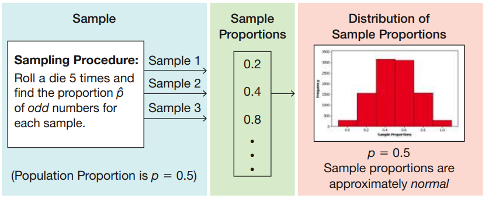

Normal probability distributions part II
========================================================
date: 03/26/2020
autosize: true
incremental: true
width: 1920
height: 1080

<h2 style="text-align:left"> Instructions:</h2>

Use the left and right arrow keys to navigate the presentation forward and backward respectively.  You can also use the arrows at the bottom right of the screen to navigate with a mouse. 

========================================================

<h2>Outline</h2>

* The following topics will be covered in this lecture:
  * Sampling estimates for population parameters
  * Sample estimates for population proportions
  * Sample estimates for population means
  * Sample estimates for population variances
  * Biased versus unbiased estimators
  * Central limit theorem

========================================================

## Motivation

Courtesy of Mario Triola, <em>Essentials of Statistics</em>, 6th edition

  

<ul>
  <li>So far we have learned two sets of skills</li>
  <ol>
    <li><b style="color:#d95f02">Summary statistics</b> -- used for analyzing <b style="color:#d95f02">samples</b>; and</li>
    <li><b>Probability</b> -- used to <strong>analyze complex events</strong> abstractly.</li>
  </ol>
  <li>Our goal is to use <b style="color:#d95f02">statistics</b> from <b style="color:#d95f02">small, representative samples</b> to say something <b style="color:#1b9e77">general</b> about the <b style="color:#1b9e77">larger, unobservable population</b>.</li>
  <ul>
    <li>Recall, the measures of the <b style="color:#1b9e77">population</b> are what we referred to as <b style="color:#1b9e77">parameters</b>.</li>
  </ul>
</ul>

<ul>
  <li><b style="color:#1b9e77">Parameters</b> are generally <strong>unknown and unknowable</strong>.</li>
  <ul>
    <li>For example, the <b style="color:#1b9e77">mean age of every adult</b> living in the United States is a <b style="color:#1b9e77">parameter</b> for the adult population of the USA.</li>
    <li>We <strong>cannot possibly know this value exactly</strong> as there are people who cannot be surveyed and / or don't have accurate records.</li>
    <li>If we have a <b style="color:#d95f02">representative sample</b> we can compute the <b style="color:#d95f02">sample mean</b>.</li>
    <li>The <b style="color:#d95f02">sample  mean</b> will almost surely <b>not equal</b> <b style="color:#1b9e77">population mean</b>, due to the natural variation <b style="color:#d95f02">(sampling error)</b> that occurs in <b style="color:#d95f02">any given sample</b>.</li>
    <li>However, if we have a good <strong>probabilistic model</strong> for the ages of adults, we can use the <b style="color:#d95f02">sample statistic</b> to estimate the general, unknown <b style="color:#1b9e77">population parameter</b>.</li>
  </ul>
</ul>

========================================================

## Sampling distributions and estimating population parameters

Courtesy of Mario Triola, <em>Essentials of Statistics</em>, 6th edition

  

<ul>  
  <li>Let's consider a hypothetical example from the book.</li>
  <ul>
    <li>Autonomous vehicles are a new and controversial technology;</li>
    <ul>
      <li>let's suppose as in the book that as a <b style="color:#1b9e77">population parameter, $70\%$ of US adults do not feel comfortable being driven by an autonomous vehicle.</b></li>
    </ul>
    <li>In a TE Connectivity survey of $1000$ US adults, <b style="color:#d95f02">$69\%$ of this sample</b> responded that they also do not feel comfortable riding in an autonomous vehicle.</li>
    <li>We will suppose that this survey is repeated $50,000$ times to  <b style="color:#d95f02">verify the accuracy of the sample statistic</b> with replication.</li>
    <li>Each time the survey results are replicated, we obtain a slightly different value for the proportion due to the  <b style="color:#d95f02">inherent variability (sampling error)</b>.</li>
  </ul>
</ul> 

<ul>
  <li>The histogram above shows the  <b style="color:#d95f02">sample-based values</b> for the <strong>proportion of adults who do not feel comfortable riding in an autonomous vehicle</strong>.</li>
  <li><b>Consider the following:</b> what is interesting about the shape of the histogram above?  What do you notice about how the <b style="color:#d95f02">sample-proportions</b> are centered with respect to the <b style="color:#1b9e77">population parameter $70\%$</b>?</li>
  <ul>
    <li>The above histogram is <b>shaped like a normal distribution</b>.</li>
    <li>Moreover, the <b style="color:#d95f02">center of the histogram</b> lies very close to the true <b style="color:#1b9e77">population parameter $70\%$</b>.</li>
  </ul>
  <li>This hypothetical example illustrates an important general property that will allow us to <b style="color:#1b9e77">estimate population parameters</b>.</li>
  <ul>
    <li>When we <b>do not know</b> the <b style="color:#1b9e77">true population parameter</b>, its value can be <b style="color:#d95f02">estimated by representative samples</b>.</li> 
    <li>Knowing the <strong>distribution of repeated sampling</strong>, <b>we can estimate how close</b> our <b style="color:#d95f02">sample value</b> is to the <b style="color:#1b9e77">true parameter</b>.</li>
  </ul> 
</ul>   

========================================================

## Sampling distributions for proportions

Courtesy of Mario Triola, <em>Essentials of Statistics</em>, 6th edition

  

<ul>  
  <li>Let's consider the last example more generally.</li>
  <li>Suppose there is some <b style="color:#1b9e77">population</b> and we wish to find the <b style="color:#1b9e77">true proportion $p$ of the population</b> for which some statement is true.</li>
  <ul>
    <li>In the last example,</li>
    <ul>
      <li>the <b style="color:#1b9e77">population</b> was US adults,</li>
      <li>the <b>statement</b> was "Uncomfortable being diven by an autonomous vehicle"</li>
      <li>the <b style="color:#1b9e77">true proportion</b> was $p=0.70$.</li>  
  </ul>
  <li>Let's suppose that we will draw exactly <b style="color:#d95f02">$n$ observations</b> of the population by <b style="color:#d95f02">random sampling</b>.</li> 
</ul>

<ul>
  <ul>
    <li>In the last example, the <b>number of observations</b> was $n=1,000$ adults.</li>
  </ul>
  <li>Suppose we want to <b>replicate this sampling procedure</b> <strong>infinitely many times</strong>...</li>
  <ul>
    <li>It impossible to replicate the sampling infinitely many times, but we can <strong>construct a probabilistic model for this replication process</strong> with a <b>probability distribution</b>.</li> 
  </ul>
  <li>Formally, we will <b>define $\hat{p}$</b> to be the <strong>random variable</strong> equal to the <b style="color:#d95f02">proportion derived from a random sample of $n$ observations</b>.</li>
  <ul>
    <li>For <b>each replication</b>, <strong>$\hat{p}$ attains a different value based on chance</strong>.</li>
  </ul>
  <li>Then, for <b>random, independent samples</b>, <b style="color:#d95f02">$\hat{p}$</b> tends to be <strong>normally distributed</strong> about <b style="color:#1b9e77">$p$</b>.</li>
  <ul>
    <li>We can thus use the value of <b style="color:#d95f02">$\hat{p}$</b> and the <b>distribution of $\hat{p}$</b> to estimate <b style="color:#1b9e77">$p$</b> and how close we are to it.</li>
  </ul>
</ul>

========================================================

### Sampling distributions for proportions example

Courtesy of Mario Triola, <em>Essentials of Statistics</em>, 6th edition

  

<ul>
  <li>From the last slide, we will denote <strong>the random variable $\hat{p}$</strong> to be the <b>sample proportion</b>.</li>
  <ul>
    <li>The way this <strong>random variable behaves over infinitely many replications</strong> is described by the <b>sampling distribution for sample proportions</b>.</li>
  </ul>
  <li>Let's consider another concrete example -- let the sampling procedure be given by $5$ rolls of a fair, six-sided die.</li>
  <ul>
    <li>The <b>random variable $\hat{p}$</b> will be the <strong>proportion of five observations that are odd</strong>.</li>  
  </ul>
</ul> 

<ul>
  <li>All values for each observation $1, 2, 3, 4, 5,6$ are equally likely with half even and half odd.</li>
  <ul>
    <li>Therefore, we can compute $p$ -- <b style="color:#1b9e77">the population proportion</b> -- exactly as $p=0.5$.</li>
    <li>That is, over infinitely many rolls of the dice, we expect half of the rolls to be odd.</li>
  </ul>
  <li>However, each time we roll a fair, six-sided die $5$ times <strong>we will obtain a different value</strong> for the <b>random variable $\hat{p}$</b>.</li>
  <ul>
    <li>Example sample proportions $\hat{p}$ which are attained over different samples are pictured in the middle panel above.</li>    
  </ul>
  <li>If we replicate the sampling procedure many times, we can get a picture of the <b>sampling distribution of sample proportions</b>;</li>
  <ul>
    <li>In the right panel above, we see the result of $10,000$ <b>replicated sampling procedures</b> -- i.e., <strong>rolling a fair, six-sided die $5$ times, repeated $10,000$ times</strong>.</li>
    <li>The distribution is approximately normal, with center at the true value $p=0.5$.</li>
  </ul>
</ul>

========================================================

## Sampling distributions for means

Courtesy of Mario Triola, <em>Essentials of Statistics</em>, 6th edition

  

<ul>  
  <li>We may also consider how to estimate a <b style="color:#1b9e77">population mean $\mu$</b>.</li>   
  <ul>
  <li>Suppose there is some <b style="color:#1b9e77">population</b> and there is some <strong>numerical measure of the population $x$</strong> that we wish to find the <b style="color:#1b9e77">true population mean $\mu$</b> for.</li>
  <ul>
    <li>For example,</li>
    <ul>
      <li>the <b style="color:#1b9e77">population</b> can be all US adults,</li>
      <li>the <b>numerical measure</b> can be $x=$"age"</li>
      <li>the <b style="color:#1b9e77">true mean</b> would be the average age of all US adults.</li>  
  </ul>
  <li>Let's suppose that we will draw exactly <b style="color:#d95f02">$n$ observations</b> of the population by <b style="color:#d95f02">random sampling</b>.</li> 
</ul>

<ul>
  <li>Suppose we want to <b>replicate this sampling procedure</b> <strong>infinitely many times</strong>...</li>
  <ul>
    <li>It is once again impossible to replicate the sampling infinitely many times, but we can <strong>construct a probabilistic model for this replication process</strong> with a <b>probability distribution</b>.</li> 
  </ul>
  <li>Formally, we will <b>define $\overline{x}$</b> to be the <strong>random variable</strong> equal to the <b style="color:#d95f02">mean derived from a random sample of $n$ observations</b>.</li>
  <ul>
    <li>For <b>each replication</b>, <strong>$\overline{x}$ attains a different value based on chance</strong>.</li>
  </ul>
  <li>Then, for <b>large numbers of random, independent samples</b>, <b style="color:#d95f02">$\overline{x}$</b> tends to be <strong>normally distributed</strong> about <b style="color:#1b9e77">$\mu$</b>.</li>
  <ul>
    <li>We can thus use the value of <b style="color:#d95f02">$\overline{x}$</b> and the <b>distribution of $\overline{x}$</b> to estimate <b style="color:#1b9e77">$\mu$</b> and how close we are to it.</li>  
  </ul>
  <li><b>NOTE:</b> one key difference from the sample proportions is that we need <strong>large sample sizes $n$ for the distribution of sample means to be "close-to-normal"</strong>.</li>
</ul>

========================================================

### Sampling distributions for means example

Courtesy of Mario Triola, <em>Essentials of Statistics</em>, 6th edition

  

<ul>  
  <li>We will begin with a <b>very simplified example</b>;
  <ul>
    <li>usually the population size will be greater, and the <strong>number of observations in a sample should be much, much larger</strong>.</li>
  </ul>
  <li>We will only use this example because we can look at the <b>sampling distribution of the means</b> concretely.</il>  
  <li>Suppose that the population of interest is a household with three children;</li>
  <ul>
    <li>we want want to find the mean age of the population, where the children's ages are $4, 5,$ and $9$.</li> 
  </ul>
  <li>Our <b>sampling procedure</b> is to <strong>select two children with replacement</strong> and ask their age .</li>
  <ul>
    <li>If $x$ is the random variable equal to the age of a particular observation, <b>$\overline{x}$</b> will be the <strong>sample mean over two randomly chosen observations</strong>.</li>
  </ul>
  <li>To the upper left, we have a table of all possible combinations of observations of the population with a sample size $n=2$.</li>
  <ul>
    <li>In the middle column, we have the <b style="color:#d95f02">sample mean $\overline{x}$</b> corresponding to the two observations.</li>
    <li>Each possible combination for the observations are all equally likely, so they all have probability $\frac{1}{9}$.</li>  
  </ul>
  <li>If we combine all possible ways we can obtain $\overline{x}=4.0$, all possible ways $\overline{x}=4.5$, etc... we have the bottom table.</li> 
  <li>The bottom table <strong>associates a probability value to each possible value $\overline{x}$ might attain</strong> -- therefore this is the <b>probability distribution for the sample means $\overline{x}$</b>.</li> 
</ul>

========================================================

### Sampling distributions for means example

  

Courtesy of Mario Triola, <em>Essentials of Statistics</em>, 6th edition

  

<ul>  
  <li>Let's recall, we have a special name for the <strong>mean of a probability distribution</strong>:</li>
  <ul>
    <li>this is denoted the <b>expected value</b>.</li>
  </ul>
  <li><b>Consider the following:</b> with the three ages in the population being $4,5,$ and $9$ what is the population mean $\mu$?  What is the expected value of the probability distribution for the sample means?</li>
  <ul>
    <li>Notice that,
    $$\mu = \frac{4 + 5 + 9}{3} = 6.$$</li>
  </ul>
  <li>On the other hand, we have the expected value equal to,</li>
</ul>

<ul>
  
  
    $$\begin{align}
     &\sum_{\overline{x}_\alpha \in \mathbf{R}} \overline{x}_\alpha \times P(\overline{x} = \overline{x}_\alpha )\\
    =&4.0 \times P(\overline{x}=4.0) + 4.5 \times P(\overline{x}=4.5) + 5.0 \times P(\overline{x}=5.0) + 6.5 \times P(\overline{x}=6.5) + 7.0 \times P(\overline{x}=7.0) + 9 \times P(\overline{x} = 9.0)\\
    =&4.0 \times\frac{1}{9} + 4.5 \times \frac{2}{9} + 5.0 \times \frac{1}{9} + 6.5 \times \frac{2}{9} + 7.0 \times \frac{2}{9} + 9 \times\frac{1}{9}\\
    =&6.0
    \end{align}$$    
    

    <li>That is, the<b> expected value of the sample mean $\overline{x}$ is equal to the population mean $\mu$</b>.</li>
    <ul>
      <li>Put another way, over infinitely many replicated samples we would <strong>expect to find the true population mean by taking the average over all the replicates</strong>;</li>
      <li>this <b>occurs generally</b>, even when the probability distribution for the sample mean is not very normal as above.</li>    
    </ul>
</ul>

========================================================

### Sampling distributions for means example

  

Courtesy of Mario Triola, <em>Essentials of Statistics</em>, 6th edition

  

<ul>
  <li>Suppose we consider rolling the fair, six-sided die again.</li>
  <li>The sampling procedure will once again be to roll the die $5$ times.</li>
  <li>$x$ will be the random variable that will attain the value of a single observation in the sample.</li>
  <li>$\overline{x}$ will be the mean of the observations in a given sample (5 rolls).</li>
  <li>By calculating all the possible outcomes, we can find that $\mu=3.5$, i.e.,
  <ul>
    <li>over infinitely many rolls of the dice, we expect to get an average value of $3.5$.</li>
  </ul>
</ul>

<ul>
  <li>Each time we replicate the sampling procedure (each time we roll the die $5$ times) we obtain a different value for $\overline{x}$.</li>
  <li>In the middle panel of the figure, we have possible values for $\overline{x}$ that we record.</li>
  <li>On the right panel, we see the result from replicating the sampling procedure $10,000$ times.</li>
  <li>In this case, the <b>distribution of the sample means $\overline{x}$</b> is <strong>approximately normal</strong>.</li>
  <li>Also, as will always be the case, the <b style="color:#d95f02">sample means $\overline{x}$</b> are distributed around the true <b style="color:#1b9e77">population mean $\mu = 3.5$</b>.</li> 
</ul>

========================================================

## Sampling distributions for variance

Courtesy of Mario Triola, <em>Essentials of Statistics</em>, 6th edition

  

<ul>  
  <li>We will now consider how to estimate a <b style="color:#1b9e77">population variance $\sigma^2$</b>.</li>   
  <ul>
  <li>Suppose there is some <b style="color:#1b9e77">population</b> and there is some <strong>numerical measure of the population $x$</strong> that we wish to find the <b style="color:#1b9e77">true population variance of $\sigma^2$</b> for.</li>
  <ul>
    <li>For example,</li>
    <ul>
      <li>the <b style="color:#1b9e77">population</b> can be all US adults,</li>
      <li>the <b>numerical measure</b> can be $x=$"age"</li>
      <li>the <b style="color:#1b9e77">true variance</b> would be the variance in the ages.</li>  
  </ul>
  <li>Let's suppose that we will draw exactly <b style="color:#d95f02">$n$ observations</b> of the population by <b style="color:#d95f02">random sampling</b>.</li> 
</ul>

<ul>
  <li>Suppose we want to <b>replicate this sampling procedure</b> <strong>infinitely many times</strong>...</li>
  <ul>
    <li>We can <strong>construct a probabilistic model for this replication process</strong> with a <b>probability distribution</b>.</li> 
  </ul>
  <li>Formally, we will <b>define $s^2$</b> to be the <strong>random variable</strong> equal to the <b style="color:#d95f02">variance derived from a random sample of $n$ observations</b>.</li>
  <ul>
    <li>For <b>each replication</b>, <strong>$s^2$ attains a different value based on chance</strong>.</li>
  </ul>
  <li>Then, for <b>random, independent samples</b>, <b style="color:#d95f02">$s^2$</b> tends to be <strong>distributed, right-skewed</strong> about <b style="color:#1b9e77">$\sigma^2$</b>.</li>
  <ul>
    <li>We can thus use the value of <b style="color:#d95f02">$s^2$</b> and the <b>distribution of $s^2$</b> to estimate <b style="color:#1b9e77">$\sigma^2$</b> and how close we are to it.</li>  
  </ul>
  <li><b>NOTE:</b> the primary difference with the distribution of sample variances from the previous examples is that this <b>distribution is not normal</b>, though still has a <strong>mean equal to $\sigma^2$</strong>.</li>
</ul>

========================================================

### Sampling distributions for variance example

Courtesy of Mario Triola, <em>Essentials of Statistics</em>, 6th edition

  

<ul>  
  <li>Suppose we consider rolling the fair, six-sided die again.</li>
  <li>The sampling procedure will once again be to roll the die $5$ times.</li>
  <li>$x$ will be the random variable that will attain the value of a single observation in the sample.</li>
  <li>$s^2$ will be the variance of the observations in a given sample (5 rolls).</li>
  <li>By calculating all the possible outcomes, we can find that $\sigma^2=2.9$, i.e.,
  <ul>
    <li>over infinitely many rolls of the dice, we expect to get a population variance of $2.9$.</li>
  </ul>
</ul>

<ul>
  <li>Each time we replicate the sampling procedure (each time we roll the die $5$ times) we obtain a different value for $s^2$.</li>
  <li>In the middle panel of the figure, we have possible values for $s^2$ that we record.</li>
  <li>On the right panel, we see the result from replicating the sampling procedure $10,000$ times.</li>
  <li>In this case, the <b>distribution of the sample variances $s^2$</b> is <strong>distributed right-skewed about $\sigma^2$</strong>.</li>
  <li>As will always be the case, the <b style="color:#d95f02">sample variances</b> have an <b style="color:#1b9e77">expected value of $\sigma^2$</b>, but due to the skewness of the distribution, the <strong>mean does not equal the mode</strong>.</li>  
</ul>

========================================================

## Biased versus unbiased estimators

<ul>
  <li>In all of the previous examples, we saw how the <b style="color:#d95f02">statistics give sample-based estimates</b> that <b style="color:#1b9e77">target the true population parameter</b> of interest.</li>
  <ul>
    <li>Specifically, <strong>over infinitely many sample replications</strong>, the <b>expected value of the sample statistic</b> is <b>equal to</b> the <b style="color:#1b9e77">true population parameter</b>.</li>
  </ul>
  <li>More generally, we can consider <strong>all possible ways to estimate</strong> some <b style="color:#1b9e77">population parameter</b>.</li>
  <li>We will call some <strong>statistic that tries to infer</strong> a <b style="color:#1b9e77">true population parameter</b> an <b>estimator</b>
  <li>Not every way to estimate a parameter will target the parameter correctly, the way we describe above.</li>
  <ul>
    <li>The statistics in the previous example are special because they are <b>unbiased estimators</b>.</li>
    <li><b>Unbiased estimators</b> are special because <strong>as random variables</strong> their <strong>expected value</strong> is the <b style="color:#1b9e77">true population parameter</b>.</li>
  </ul> 
  <li>Each of the:</li>
  <ol>
    <li><b style="color:#d95f02">sample mean $\overline{x}$</b>;</li>
    <li><b style="color:#d95f02">sample variance $s^2$</b>; and</li>
    <li><b style="color:#d95f02">sample proportion $\hat{p}$</b></li>
  </ol>
  <li>are <b>unbiased estimators</b> for their corresponding <b style="color:#1b9e77">true population parameter</b>.</li>
  <li>On the other hand, each of the:</li>
  <ol>
    <li><b style="color:#d95f02">sample standard deviation $s$</b>;</li>
    <li><b style="color:#d95f02">sample median</b>; and </li>
    <li><b style="color:#d95f02">sample range</b></li>
  </ol>
  <li>are <strong>biased in their estimates</strong> of the corresponding <b style="color:#1b9e77">true population parameter</b>.</li>
</ul>

========================================================

## Central limit theorem

Courtesy of Mathieu Rouaud <a href="https://creativecommons.org/licenses/by-sa/4.0" target="blank"> CC BY-SA</a> via  
        <a href="https://commons.wikimedia.org/wiki/File:IllustrationCentralTheorem.png"> Wikimedia Commons</a>

  

<ul>
  <li>The property of the sample means $\overline{x}$ being approximately normally distributed (for large enough sample sizes) is actually a <strong>fundamental and universal property in nature</strong>.</li> 
    <li>In fact, the <b>random variable $x$</b> can be <strong>extremely non-normal</strong> as pictured on the left of the figure.</li>
  <ul>
    <li>Nonetheless, if we draw <strong>$n$ independent samples for $n$ sufficiently large</strong>,</li>
    <li>the <b style="color:#d95f02">sample mean $\overline{x}$</b> will be <b>approximately normally distributed</b> around the <b style="color:#1b9e77">true $\mu$</b>.</li>
    <li>We also know about <b>"how far"</b> a realization of $\overline{x}$ usually lies from $\mu$ by the <strong>standard devaition of $\overline{x}$</strong>.</li>   
  </ul>
</ul> 

<ul>
  <li>Formally, this phenomena is called the <b>Central limit theorem</b>:</li>
  <blockquote>
  Let $x$ be a generic random variable with population mean $\mu$ and standard deviation $\sigma$.  Suppose for a sample size of $n$, we compute the sample mean as $\overline{x}$.  Then $\overline{x}$ as a random variable, with realization determined by independent replicated sampling, will be approximately normally distributed with mean $\mu$ and standard deviation $\frac{\sigma}{\sqrt{n}}$, so long as $n$ is sufficiently large.  
  </blockquote>
  <li>For many situations, $n$ needs to only be <strong>at least be greater than $30$</strong> for this to hold -- however, this is not necessary if $x$ is already normal.</li> 
  <li>Notice, as <b>$n$ becomes large</b>, the <strong>approximation improves and $\frac{\sigma}{\sqrt{n}}$ becomes small</strong>.</li>
  <li>Therefore, for <strong>large sample sizes $n$</strong>, <b>$\overline{x}$ tends to give estimates of $\mu$ which are close</b> because the <strong>standard deviation is small</strong>.</li> 
</ul> 

========================================================

### Central limit theorem example

<ul>
  <li>Let's consider an example of where we can apply the central limit theorem.</li>
  <ul>
    <li>Suppose that an elevator states that the weight capacity is $4000$ pounds or $27$ passengers.</li>
    <li>This says that the sample mean of $27$ randomly selected passengers should be up to $148$ pounds.</li>
    <li>Adult men in the US have weights that are normally distributed with a mean $\mu=189$ and a standard deviation of $\sigma=39$ pounds.</li>
    <li>Let's consider a worst-case-scenario for this elevator -- suppose that $27$ adult men try to ride this elevator.</li>
    <li><b>Consider the following:</b> how can the central limit theorem be used to find the probability that the elevator will allow all these passengers simultaneously?</li>
    <ul>
      <li>Notice, the problem can be phrased as, "what is the probability that the sample mean will be less than or equal to $148$.</li>
      <li>Let $x$ be the random variable equal to one adult male's weight, with mean $\mu=189$ and standard deviation $\sigma=39$.</li>
      <li>Then for a sample size of $27$, we can apply the central limit theorem because $x$ is already normally distributed.</li>
      <ul>
        <li><b>Note:</b> when we have fewer than $30$ samples and the random variable $x$ is not normally distributed, we cannot use the central limit theorem.</li>
      </ul>
      <li>Therefore, we can treat $\overline{x}$ as normally distributed with mean $\mu_\overline{x}=189$ and standard deviation,  
      $$\sigma_\overline{x}=\frac{\sigma}{\sqrt{n}}= \frac{39}{\sqrt{27}} \approx 7.50.$$</li>
      <li>The question then is, "what is the probability that $\overline{x}$ is less than or equal to $148$?"</li>
      <li>We can study this directly in StatCrunch.</li>
    </ul>
  </ul>
</ul>

========================================================

### Key takeaways from the central limit theorem

<ul>
  <li>The central limit theorem is a fundamental compoenent of the tools we will develop to finish this course, especially to estimate parameters and their uncertainty.</li>
  <li>We should remember the following key takeaways about the central limit thereom:</li>
  <ul>
    <li>We will suppose that we have a generic random variable $x$ with <b style="color:#1b9e77">population mean $\mu$ and standard deviation $\sigma$</b>.</li>
    <li>We suppose that we take simple random samples of size $n$ of the population;</li>
    <ul>
      <li>the <b style="color:#d95f02">sample mean $\overline{x}$</b> is then a random variable that depends on the replicates of the sampling process.</li>
    </ul>
    <li>The sample mean $\overline{x}$ is <b>always an unbiased estimator</b>, so the mean of this random variable,
    $$\mu_\overline{x} = \mu.$$</li>
    <li>However, when <b>$x$ is normal, or usually when $n>30$</b>, we can also say that <strong>$\overline{x}$ is approximately normally distributed around $\mu$ with standard deviation
  $$\sigma_\overline{x} = \frac{\sigma}{\sqrt{n}}.$$</strong></li>
  <li>When <b>$x$ is not normally distributed and we have sample sizes $n \leq 30$</b> <strong>we cannot use the above property</strong> -- this is not a good approximation.</li>
  <li>On the other hand, when <b>$n$ is very large</b>, this means that
  <strong>$$\sigma_\overline{x} = \frac{\sigma}{\sqrt{n}}$$
  is very small</strong>.</li>
  <li>The empirical rule then says that $\overline{x}$ will usually be very close to $\mu$  when we have a large number of samples $n$.</li>
  <li>We can even measure "how close" in terms of standard deviations and the probability that it will lie this close.</li>
  </ul>
</ul>

