

Normal probability distributions part III and introduction to estimation
========================================================
date: 03/31/2020
autosize: true
incremental: true
width: 1920
height: 1080

<h2 style="text-align:left"> Instructions:</h2>

Use the left and right arrow keys to navigate the presentation forward and backward respectively.  You can also use the arrows at the bottom right of the screen to navigate with a mouse. 

========================================================

<h2>Outline</h2>

* The following topics will be covered in this lecture:
  * Assessing normality of data
  * Histograms
  * Q-Q plots
  * Examples in StatCrunch
  * Point estimates for population proportions
  * Confidence intervals for population proportions
  * Critical values again

========================================================

## Motivation

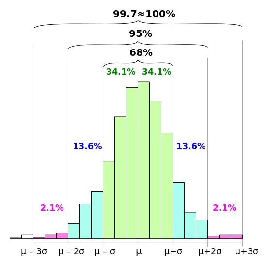

Courtesy of Melikamp <a href="https://creativecommons.org/licenses/by/2.5" target="blank">CC</a> via  <a href=" https://commons.wikimedia.org/wiki/File:Empirical_rule_histogram.svg"> Wikimedia Commons</a>

<ul>
  <li>Recall now the bell curve picture that we often consider -- we will suppose we have a population that is distributed as a bell shape.</li>
  <li>We suppose that the <b style="color:#1b9e77">population mean is $\mu$</b> and <b style="color:#1b9e77">population standard deviation $\sigma$</b>.</li>
    <li> Normally distributed data is characterized by the following features:</li>
  <ol>
    <li> <strong>The frequencies start low, then increase to one or two high frequencies, and
then decrease to a low frequency.</strong></li>
    <li> <strong>The distribution is approximately symmetric.</strong></li>
    <li><strong>There are few if any extreme values.</strong></li> 
  </ol>
  <li>These features can be understood as a direct application of the empirical rule.</li>
  <li>We suppose that the histogram represents the <b style="color:#d95f02">sample data</b> which is mostly bell-shaped, but the collection is smaller than the population so it is not exact.</li>
    <ul>
      <li>In particular, any data set is subject to <b style="color:#d95f02">sampling error</b> and we cannot expect a perfect bell shape from a small sample even when the <b style="color:#1b9e77">population is perfectly normally distributed</b>.</li>
    </ul>
</ul>

<ul>  
  <li>So far, we have used histograms to examine these features in data and to assess normality.</li> 
  <ul>
    <li>However, histograms sometimes have technical issues that make them unreliable.</li>
  </ul>  
</ul>

========================================================

### Motivation continued

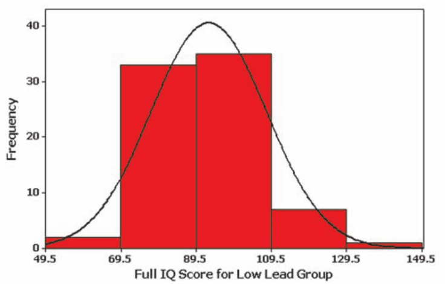

Courtesy of Mario Triola, <em>Essentials of Statistics</em>, 5th edition

<ul>
  <li>Let's consider a histogram we saw earlier with IQ scores.</li>
  <ul>
    <li>Over the population of US adults, IQ scores are normally distributed, exhibiting the bell shape discussed earlier.</li>
    <li>However, depending on the choice of <b>bin-widths</b> for the histogram, we can see a very <strong>different shape</strong>.</li>
    <li>Here the bin-widths are quite wide and so we collect many scores together -- this obscures the bell shape.</li>
    <li>On the other extreme, if we chose bins so finely that <b>every bin had one observation</b>, the <strong>histogram would be flat</strong>.</li>
    <li>With a "good" choice in between, we can see the bell shape more clearly.</li> 
  </ul>
</ul>

    

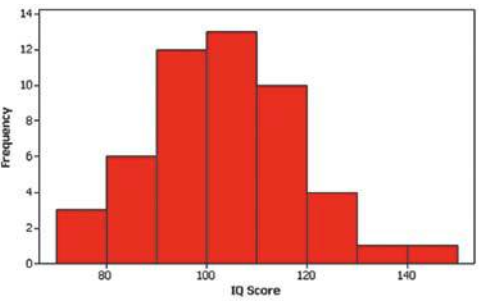

Courtesy of Mario Triola, <em>Essentials of Statistics</em>, 5th edition

<ul>  
  <li>There is <strong>no "perfect" choice</strong> generally for <b>how wide the bins should be in a histogram</b>, and it makes this less reliable for assessing normality than other methods.</li>  
  <li>For this reason, we will introduce a more advanced visual method for assessing normality.</li>
  <li>If we want to examine if data is "close-enough-to-normal", it makes sense to compare our data to the normal distribution directly;</li>
  <ul>
    <li> to do so, we will introduce the <b>Q-Q or quantile-quantile plot</b>.</li>
  </ul>
</ul>

========================================================

## Q-Q plots

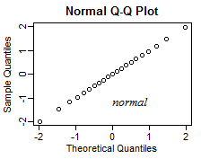

Courtesy of <a href="https://stats.stackexchange.com/users/805/glen-b-reinstate-monica" target="blank">Glen_b</a> via the <a href="https://stats.stackexchange.com/q/101290" target="blank">Stack Exchange</a>

  

<ul>  
  <li>We will discuss formaly how Q-Q plots are constructed as follows.</li>
  <li><b>Note:</b> we will discuss the version of Q-Q plots described in the book for simplicity, but typically the Q-Q plots used in practice have a slightly different construction.</li>  
  <ul>
    <li>Suppose we have some collection of sample data $\{x_i\}$ for $i=1,\cdots, n$.
    <li>We will order our observations, $x_1, x_2, \cdots x_n$ (changing the index if necessary) such that,
    $$x_i \leq x_{i+1}$$
    for every $i=1,\cdots, n-1$.</li>
    </ul>
    <li>On the horizontal axis of the Q-Q plot, we use the scale of the original data.</li>
    <li>On the vertical axis, we use the scale of z scores.</li>
  </ul>
</ul>

<ul>
  <li>Combined, the Q-Q plot places the z-score of each observation above the raw value in the horizontal axis.</li>
  <li>If the sample data is "perfectly" normal, then the z scores should form a straight line against the ordered data.</li>
  <li>However, sampling error will lead to small deviations from this straight line in practice.</li>
</ul>

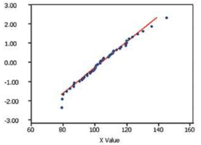

Courtesy of Mario Triola, <em>Essentials of Statistics</em>, 5th edition

<ul>
  <li>For the IQ data histogram earlier, we see the associated Q-Q plot to its right.</li>
  <li>Here, this is mostly a straight line with only slight deviations in the tails.</li>
  <li>However, the data doesn't have many extreme values, so it isn't a concern.</li>
</ul>

========================================================

### Analyzing Q-Q plots  

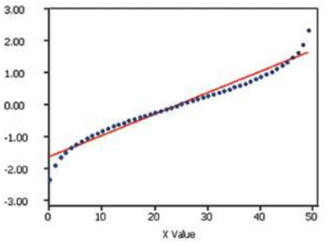

Courtesy of Mario Triola, <em>Essentials of Statistics</em>, 6th edition

 

<ul>
  <li>Generally, we will <strong>not be concerned</strong> with <b>slight deviations from a straight line</b> in a Q-Q plot;</li>
  <ul>
    <li>if there is only <b>one outlier</b>, and it is not too extreme, <strong>we can usually say the data is "close-enough-to-normal"</strong>.</li>  
  </ul>
  <li>However, when there is some <b>systematic structure</b> to the data this should <strong>raise an alarm</strong>.</li>
  <li><b>Consider the following:</b> given the Q-Q plot on the left for some sample data, does this data look "close-enough-to-normal"?  That is, do we detect any systematic structure other than a straight line?</li>  
  <ul>
      <li> In fact, the data is very non-normal, it is drawn from a uniform distribution.</li>
  </ul>
</ul>

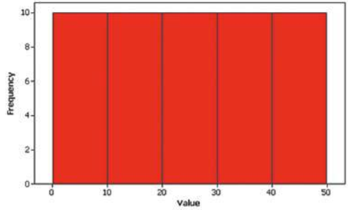

Courtesy of Mario Triola, <em>Essentials of Statistics</em>, 6th edition

 

<ul>  
  <ul>
    <li>What we should detect in this Q-Q plot is the following:</li>   
    <ol>
      <li>The distribution is symmetric, as can be seen by the symmetry in the Q-Q plot.</li>
      <li>However, we can see a smaller relative concentration of values towards the mean as evidenced by the "bowing" of the curve above and below the line.</li>  
    </ol>
    <li>Near the interior, the magnitude of the z scores should be increasing faster based on the percentiles of the observed data.</li>
    <li>At the tails, there are very extreme values that we would not expect to see in normal data.</li>
  </ul>
</ul>

========================================================

### Analyzing Q-Q plots continued

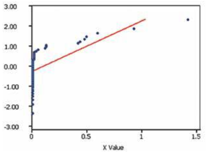

Courtesy of Mario Triola, <em>Essentials of Statistics</em>, 6th edition

 

<ul>
  <li>At the left is the Q-Q plot of real data from the rainfall in inches in Boston, measured once a week for an entire year.</li> 
  <li><b>Consider the following:</b>  given the Q-Q plot on the left for some sample data, does this data look "close-enough-to-normal"?  That is, do we detect any systematic structure other than a straight line?</li>
  <ul>
    <li>This example is right-skewed, with many values concentrated close to zero and a few observations very far away with high values.</li>  
  </ul>
  <li>The associated histogram is plotted below.</li>
</ul>

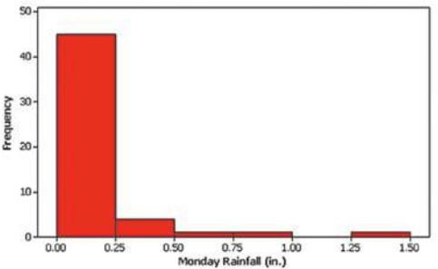

Courtesy of Mario Triola, <em>Essentials of Statistics</em>, 6th edition

 

<ul>
  <li>What we should detect in this Q-Q plot is the following:</li>   
  <ol>
    <li>This is strongly anti-symmetric and lies off the line which disqualifies the data from "normality" immediately.</li>
    <li>In addition, there are many extreme values in the right tail as evidenced by the "floating points" towards the right.</li>
  </ol>
  <li>This kind of non-normality is relatively easy to detect with a histogram, but we can read the same information from the Q-Q plot in this case.</li>
</ul>

========================================================

### Analyzing Q-Q plots in StatCrunch

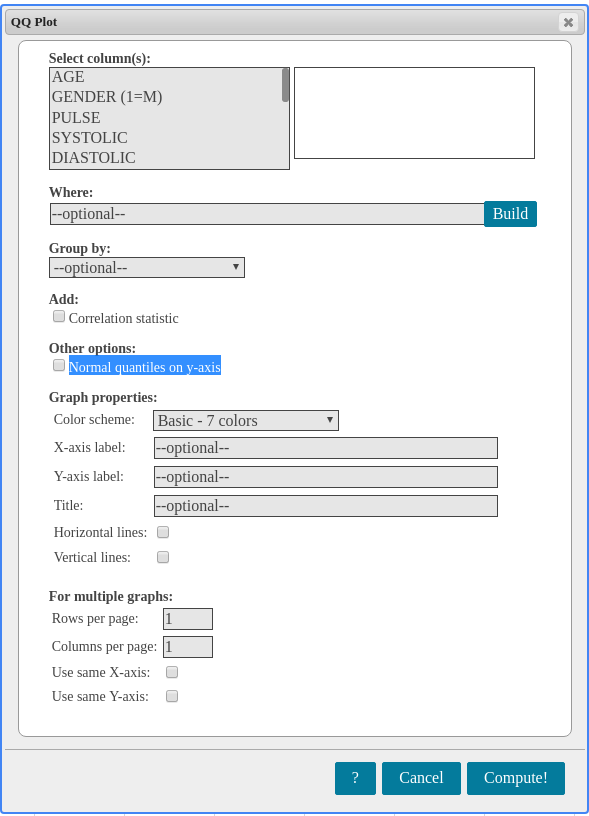

Courtesy of Pearson

<ul>
  <li>Constructing Q-Q plots manually is tedious and should be done with computer software.</li>
  <li>For this reason, we will only consider how to construct and analyze Q-Q plots in StatCrunch.</li>
  <li><b>NOTE:</b> to construct the Q-Q plot as in the book, you must select "Normal quantiles on y-axis"
  as highlighted in the figure to the left.</li>
  <li>We will go through some examples in the video on how to open a book data set and analyze this data set with a histogram and with a Q-Q plot.</li>
  <li>In the <b>midterm</b>, <strong>you will be expected to be able to analyze data in StatCrunch as in the following</strong>.</li>
  <li>You will likely be asked to produce plots of one of the variables and analyze the shape for signs of:</li>
  <ol>
    <li>normality;</li>
    <li>skewness; or</li>
    <li>uniformity</li>
  </ol>
  <li>in the distribution.</li>
  <li>You may use any combination of Q-Q plots and histograms, and we will consider both in the following.</li> 
</ul>

========================================================

## Motivation for point estimates and confidence intervals

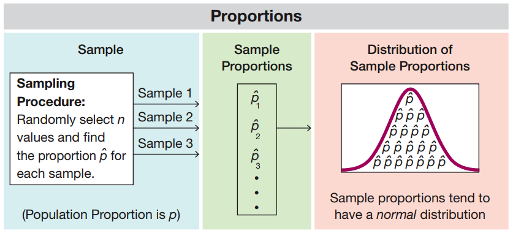

Courtesy of Mario Triola, <em>Essentials of Statistics</em>, 6th edition

  

<ul>
  <li>In the last lecture, we saw how a sample proportion generates a random variable.</li>
  <li>That is, when we take a sample of a population and compute the proportion of the sample for which some statement is true.</li>
  <li>Suppose we want to <b>replicate this sampling procedure</b> <strong>infinitely many times</strong>...</li>
  <ul>
    <li>It impossible to replicate the sampling infinitely many times, but we can <strong>construct a probabilistic model for this replication process</strong> with a <b>probability distribution</b>.</li> 
  </ul>
</ul>

<ul>
  <li>Formally, we will <b>define $\hat{p}$</b> to be the <strong>random variable</strong> equal to the <b style="color:#d95f02">proportion derived from a random sample of $n$ observations</b>.</li>
  <ul>
    <li>For <b>each replication</b>, <strong>$\hat{p}$ attains a different value based on chance</strong>.</li>
  </ul>
  <li>Then, for <b>random, independent samples</b>, <b style="color:#d95f02">$\hat{p}$</b> tends to be <strong>normally distributed</strong> about <b style="color:#1b9e77">$p$</b>.</li>
  <ul>
    <li>We can thus use the value of <b style="color:#d95f02">$\hat{p}$</b> and the <b>distribution of <b style="color:#d95f02">$\hat{p}$</b></b> to estimate <b style="color:#1b9e77">$p$</b> and how close we are to it.</li>
  </ul>
  <li>We know that <b style="color:#d95f02">$\hat{p}$</b>  is an <b>unbiased estimator</b> of the <b style="color:#1b9e77">true population proportion $p$</b>.</li>
  <ul>
    <li>That is, over infinitely many resamplings, the <b>expected value</b> <strong>(mean of the probability distribution)</strong> for <b style="color:#d95f02">$\hat{p}$</b> is equal to <b style="color:#1b9e77">$p$</b>.</li>
  </ul>
  <li>When we have a <strong><b style="color:#d95f02">specific sample data set</b>, and a specific value for <b style="color:#d95f02">$\hat{p}$</b> associated to it</strong>,  <b style="color:#d95f02">$\hat{p}$</b> is called a <b>point estimate</b> for  <b style="color:#1b9e77">$p$</b>.</li> 
  <ul>
    <li>The <strong>measure of "how-close"</strong> we think this is to the true value is called a <b>confidence interval</b>.</li> 
  </ul>
</ul>

========================================================

### Point estimates for population proportions

Courtesy of Mario Triola, <em>Essentials of Statistics</em>, 6th edition

  

<ul>
  <li>In addition to the review on the last slide we will briefly discuss why <b style="color:#d95f02">$\hat{p}$</b> is a <b>"best"</b> estimate for <b style="color:#1b9e77">$p$</b></li>
  <ul>
    <li>Recall, <b style="color:#d95f02">$\hat{p}$</b> as a random variable tends to have a normal distribution around <b style="color:#1b9e77">$p$</b>.</li>
    <li>This distribution can be characterized in the same way as any other normal distribution, in terms of:</li>
    <ol>
      <li>its mean $\mu_\hat{p} = p$; and</li>
      <li>its standard deviation $\sigma_\hat{p}$.</li>
    </ol>
  </ul>
</ul>

<ul>
    <li>Let's suppose that $\tilde{p}$ is some other estimate for $p$ that is unbiased, i.e.,
    $$\mu_\tilde{p} = p.$$</li> 
    <li>It is an extremely important property that the standard deviation of the other estimate is at least as large as $\sigma_\hat{p}$, i.e.,
    $$\sigma_\tilde{p} \geq \sigma_\hat{p}.$$</li>
    <li>In plain English this says that</li>
    <blockquote>
    Even though $\hat{p}$ tends to vary around $p$ due to sampling error, the ammount it varies away from $p$ tends to be less than all other unbiased estimators.
    </blockquote>
    <li>We can think of the sample proportion as the most accurate point estimate, if we were to replicate samples arbitrarily many times.</li> 
    <ul>
      <li>This is fortunate because it is also the most "natural" choice for an estimate in some sense.</li>  
    </ul>
</ul>

========================================================

## Confidence intervals for population proportions

<ul>
  <li>Let's consider an example.</li>
  <ul>
    <li>A Gallup poll was given to assess the <b style="color:#1b9e77">population of US adults</b>.</li>
    <li>The poll randomly selected <b style="color:#d95f02">$1487$ adults</b> for their sample and found that $43\%$ of respondents had a Facebook account.</li>
    <li>We should not believe that exactly $43\%$ of US adults actually have a Facebook account.</li>
    <ul>
      <li>This proportion <b style="color:#d95f02">$\hat{p}$</b> cannot even be exact based on their sample size, which would indicate that $639.41$ respondents had a Facebook account.</li>
    </ul>
    <li>However, <b style="color:#d95f02">$\hat{p}$</b> is the <strong>best estimate (given the sample)</strong> for the true <b style="color:#1b9e77">$p$</b>.</li> 
  </ul>
  <li>Recall, <b style="color:#d95f02">$\hat{p}$</b> tends to be normally distributed about <b style="color:#1b9e77">$p$</b>;</li>
  <ul>
    <li>therefore we can describe the probability of finding such a <b style="color:#d95f02">$\hat{p}$</b> in terms of how far <b style="color:#d95f02">$\hat{p}$</b> deviates from its mean <b style="color:#1b9e77">$p$</b>.</li>
  </ul>
  <li>The issue is, of course, that we know <b style="color:#d95f02">$\hat{p}$</b> but we do not know <b style="color:#1b9e77">$p$</b>.</li>
  <li>For this reason, we will construct a region in which we have a level of confidence for where <b style="color:#1b9e77">$p$</b> lies.</li>
  <ul>
    <li>This region will be based on how far values like <b style="color:#d95f02">$\hat{p}$</b> tend to lie from the true mean, based on the standard deviation $\sigma_\hat{p}$.</li>
  </ul>
  <li>We will suppose for the moment that the region can be constructed as,
  $$0.405 &lt; {\color{#1b9e77} p } &lt; 0.455,$$
  and we have $95\%$ <b>confidence</b> that <b style="color:#1b9e77">$p$</b> lies here.</li>
  <li>Notice, <b style="color:#1b9e77">$p$</b> is a <strong>fixed, non-random (but unkown) value</strong> and it doesn't make sense to describe the "probability" of where it lies in relation to the value <b style="color:#d95f02">$\hat{p}$</b>.</li>  
  <li>A $95\%$ <b>confidence interval thus describes a procedure</b> for producing an interval that <b>will work $95\%$ of the time</b> when <strong>samples are replicated and <b style="color:#d95f02">$\hat{p}$</b> is recomputed</strong>.</li> 
</ul> 

========================================================

### Confidence intervals for population proportions continued

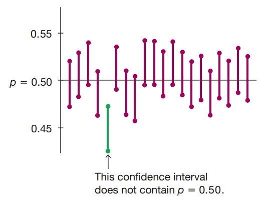

Courtesy of Mario Triola, <em>Essentials of Statistics</em>, 6th edition

<ul>
  <li>As a schematic of this, consider the figure to the left.</li>
  <ul>
    <li>In the figure, each <b>vertical line</b> will represent a <strong>different replication of the sampling proceedure</strong>.</li>
    <li>We will suppose that the true population proportion is actually <b style="color:#1b9e77">$p=0.50$</b>.</li>
    <li>Notice that our Gallup poll sample confidence interval,
    $$0.405 &lt; {\color{#1b9e77} p } &lt; 0.455,$$
    <strong>does not actually contain the true population parameter</strong> -- this is due to <b style="color:#d95f02">sampling error</b>.</li>
  </ul>
  <li>However, if we <b>take enough replications</b> of the sampling procedure, <b style="color:#1b9e77">$p=0.50$</b> should <strong>lie in the associated confidence interval about $95\%$ of the time</strong>.</li>
</ul>

<ul>
  <li>Remember, in this <b>"frequentist" statistical framework</b>, <b style="color:#1b9e77">$p$</b> is not random, it is a fixed but unkown value.</li>
  <li>On the other hand, our <strong>confidence intervals are random</strong> and depend on a particular outcome of the sampling replication.</li>
  <li><b>Note:</b> when we have a particular sample data set in hand, <b style="color:#d95f02">$\hat{p}$</b> is also just a <strong>fixed point estimate, and its confidence interval will also be fixed</strong>.</li>
  <li>Therefore, we say that the $95\%$ confidence interval represents a procedure that should work $95\%$ of the time;</li>
  <ul>
    <li>we <b>do not guarantee</b>, however, that <b style="color:#1b9e77">$p$</b> <strong>actually lies within this range</strong>.</li>
  </ul>
</ul>

========================================================

### Confidence intervals for population proportions continued

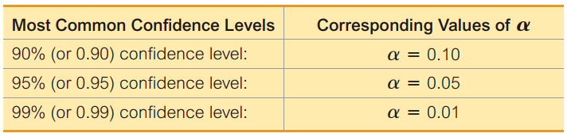

Courtesy of Mario Triola, <em>Essentials of Statistics</em>, 6th edition

<ul>
  <li>We will now discuss <b>confidence intervals (CI)</b> more formally.</li>
  <ul>
    <li>Suppose that we want to estimate the <b style="color:#1b9e77"> true proportion $p$</b> with some <b>level of confidence</b>:</li>
    <ul>
      <li>if we replicated the sampling procedure infinitely many times, the <b>average number of times</b> we found <b style="color:#1b9e77">$p$</b> in our confidence interval would be <strong>equal to the level of confidence</strong>.</li>  
    </ul>
  </ul>
</ul>

<ul>
  <li>Let's take an example <b>confidence level of $95\%$</b> -- this corresponds to a <strong>rate of failure of $5\%$</strong> over infinitely many replications.</li>
  <li>Generally, we will write the confidence level as,
  $$(1 - \alpha) \times 100\%$$
  so that we can associate this confidence level with its rate of failure $\alpha$.</li>
  <li>Recall, we earlier studied ways that we can <b>compute the critical value associated to some $\alpha$</b> for the normal distribution.</li>
  <li>We will use the same principle here to find <strong>how wide is the interval around <b style="color:#1b9e77">$p$</b></strong> for which <b style="color:#d95f02">$\hat{p}$</b> will lie in this interval
  $(1-\alpha)\times 100\%$
  of the time.</li>   
</ul>

  <li>This is equivalent to a <b>two-sided measure of extremeness</b> in the normal distribution, i.e.,</li>
  <ul>
    <li>we want to find the critical value $z_\frac{\alpha}{2}$ for which:</li>
    <ul>
      <li>$(1-\frac{\alpha}{2})\times 100\%$ of the area under the normal density lies to the left of $z_\frac{\alpha}{2}$; and</li>
      <li>$(1-\frac{\alpha}{2})\times 100\%$ of the area under the normal density lies to the right of $-z_\frac{\alpha}{2}$.</li>
    </ul>
    <li>Put together, $(1-\alpha)\times 100\%$ of values lie within $[-z_\frac{\alpha}{2},z_\frac{\alpha}{2}]$. 
  </ul>
</ul> 

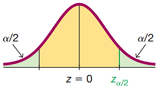

========================================================

### Confidence intervals for population proportions and critical values

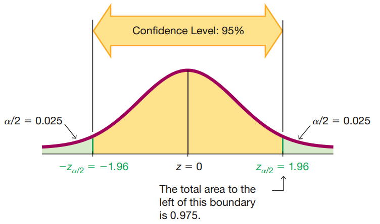

Courtesy of Mario Triola, <em>Essentials of Statistics</em>, 6th edition

<ul>
  <li>In the figure to the left, we see exactly thus how to find the width of the region for a given confidence level.</li>
  <ul>
    <li>For a given confidence level $(1 -\alpha)\times 100\%$, we will find the particular $\alpha$.</li>
    <li>We then find the associated <b>two-sided measure of extremeness</b> with the <strong>$z_\frac{\alpha}{2}$ critical value</strong>.</li>
    <li>This critical value is associated to the measure of extremeness of <strong>finding an observation that lies far away from the mean</strong>.</li>
    <li>Particularly, only $\alpha \times 100\%$ of the population lies outside of the region $[-z_\frac{\alpha}{2},z_\frac{\alpha}{2}]$.</li>
  </ul>
</ul>

  

<ul>
  <li>Put another way, if you <b>randomly draw a population member</b>, there is <strong>$(1 -\alpha)\times 100\%$ chance that the mean lies at a distance at most $z_\frac{\alpha}{2}$ away from this observation</strong>.</li>
  <li>The sample proportion point estimate <b style="color:#d95f02">$\hat{p}$</b> <b>can be considered a random draw from population of all point estimates distributed around</b> <b style="color:#1b9e77">$p$</b>.</li>
  <li>We do not know how close a particular point estimate (depending on a particular sample) is to <b style="color:#1b9e77">$p$</b>.</li>
  <li>However, we know that <b>over all possible replications of the sampling procedure</b>, the point estimate <b style="color:#d95f02">$\hat{p}$</b> will <strong>lie at a distance at most $z_\frac{\alpha}{2}$ exactly $(1-\alpha)\times 100\%$ of the time</strong>.</li>
  <li>Therefore, we have $(1-\alpha)\times 100\%$ confidence that the <b style="color:#1b9e77">true $p$</b> lies within this region about <b style="color:#d95f02">$\hat{p}$</b>.</li>
</ul>

