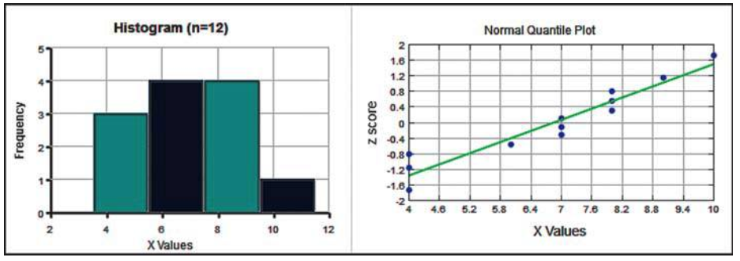

Introduction to hypothesis testing part II
========================================================
date: 04/16/2020
autosize: true
incremental: true
width: 1920
height: 1080

<h2 style="text-align:left"> Instructions:</h2>

Use the left and right arrow keys to navigate the presentation forward and backward respectively.  You can also use the arrows at the bottom right of the screen to navigate with a mouse. 

========================================================

<h2>Outline</h2>

* The following topics will be covered in this lecture:
   * A short review of hypothesis testing
   * Hypothesis testing and confidence intervals
   * Examples of testing a hypothesis about a population proportion
   * Examples of testing a hypothesis about a population mean

========================================================

## Review of hypothesis testing

Courtesy of Mario Triola, <em>Essentials of Statistics</em>, 6th edition

   

 
<ul>
   <li>We will begin a review of hypothesis testing -- recall:</li>
   <ol>  
      <li><b>$H_0$</b> -- <strong>this is the null hypothesis</strong>.</li>
      <ul>
         <li>The null hypothesis is <b>symbolically</b> a statement about some <b style="color:#1b9e77">population parameter</b> <strong>begin equal $(=)$ to some value</strong>.</li>
      </ul>
      <li><b>$H_1$</b> -- <strong>this is the alternative hypothesis</strong>.</li>
      <ul>
         <li>The alternative hypothesis is the statement that the <b style="color:#1b9e77">population parameter</b> is <strong>different than the null</strong>.</li>
         <li><b>Symbolically</b>, it will always take the form of <strong>$( &gt; / &lt; / \neq)$</strong> in terms of the <b style="color:#1b9e77">parameter</b> in question.</li>
         <li>The form of the alternative hypothesis determines whether we consider a:</li>
         <ol>
            <li><b>$&lt;$</b> -- left-sided test;</li>
            <li><b>$&gt;$</b> -- right-sided test; or a</li>
            <li><b>$\neq$</b> -- two-sided test;</li>
         </ol>
         <li>in the measure of "extremeness" of the test statistic with respect to the null hypothesis.</li>
      </ul>
   </ol>
   <li>Typically, our <b>research hypothesis</b> is phrased in terms of an <strong>inequality so that it is written as the alternative hypothesis</strong>.</li>  
</ul>

========================================================

### Review of hypothesis testing continued

Courtesy of Mario Triola, <em>Essentials of Statistics</em>, 6th edition

   

 
<ul>
   <li>The first step is thus to <b>identify the claim</b> and <strong>write it as an equality, or more typically as an inequality</strong>.</li>
   <li>We then write the contradictory claim and identify the <b>null hypothesis $H_0$</b> <strong>$(=)$</strong> and <b>alternative hypothesis $H_1$</b> <strong>$(&lt; / &gt; / \neq)$</strong>.</li>
   <li>We then <b>assume the null hypothesis</b> and <strong>select a significance level $\alpha$</strong>.</li>
   <ul>
      <li>The significance level $\alpha$ is defined as<b>
      $$\begin{align}
      \alpha= P(\text{Rejecting the null }H_0\text{ when }H_0\text{ is actually true}).
      \end{align}$$</b></li>
   </ul>
   <li>This is precisely due to the fact that,
   <blockquote>
   we reject the null hypothesis when the probability of observing a sample at-least-as extreme as our test statistic is less than $\alpha$, under the assumption of $H_0$.
   </blockquote></li>
   <li>The test statistic is the evidence from sampling that we compare with the null hypothesis;</li>
   <ul>
      <li>there is a possiblity that we <strong>incorrectly reject $H_0$</strong> due to chance based on sampling error, and this is with <b>probability $\alpha$</b>.</li>
   </ul>
   <li>This type of mistake is known as <b>type I error</b>, or a <strong>false positive in terms of favoring the alternative</strong>.</li>
   <li>We measure <strong>how extreme a test statistic</strong> is (usually) with <b>P-values</b> or (less commonly) with <b>critical values</b>.</li>  
</ul> 

========================================================

### Review of hypothesis testing continued

Courtesy of Mario Triola, <em>Essentials of Statistics</em>, 6th edition

 
<ul>
   <li>Actually, P-values and critical values are <strong>equivalent representations</strong> of the same measure of <b>at-least-as-extreme</b> as.</li>
   <li>In the case of critical values, we construct the region for which:</li>
   <ol>
      <li><b>$H_1:&lt;$</b> -- there is probability of $\alpha$ for randomly selecting an observation to the left of this region;</li>
      <li><b>$H_1:&gt;$</b> -- there is a probability of $\alpha$ for randomly selecting an observation to the right of this region; or</li>
      <li><b>$H_1: \neq$</b> -- there is a probability of $\frac{\alpha}{2}$ of randomly selecting an observation to the left, or $\frac{\alpha}{2}$ of randomly selecting an observation to the right.</li>
   </ol>
</ul>

<ul>
   <li>With P-values, instead of graphically considering the region, we numerically compute the probability (P-value) of randomly selecting an observation at-least-as extreme as our test statistic directly.</li>
   <li>We make the same considerations as above with respect to the form of the alternative hypothesis when we compute this probability.</li>
   <li>For left or right sided tests, we find the <strong>probability of randomly selecting an observation at-least-as far left / far right</strong> (<b>$H_1: &lt;$</b> or <b>$H_1: &gt;$</b>).</li>
   <li>For two sided tests, we find the <strong>probability of randomly selecting an observation at-least-as far from the center in either direction</strong> <b>$H_1:\neq$</b>.</li>
</ul>

========================================================

## Confidence intervals and hypothesis testing

<ul>
   <li>Before we go through examples, we should make one note about the correspondence between hypothesis testing and confidence intervals.</li>
   <li>Actually, <b>hypothesis tests / confidence intervals of the mean and the standard deviation</b>, these are <strong>totally equivalent</strong>.</li>
   <li>Indeed, let us suppose that we have some confidence interval,
   $$(\overline{x} - E, \overline{x} - E)$$
   at a $(1-\alpha)\times 100\%$ level of confidence.</li>
   <li>Remember, this confidence interval depends on a random realization of the <b style="color:#d95f02">sample mean $\overline{x}$</b> and, possibly, a random realization of the <b style="color:#d95f02">sample standard deviation $s$</b>.</li>
   <li>Suppose we had a <b>hypothetical value for the mean $\tilde{\mu}$</b> that we wanted to test as the null,
   $$H_0: \mu = \tilde{\mu},$$
   with $\alpha$ significance.</li>
   <li>If we found that <strong>$\tilde{\mu}$ was not in the interval</strong>
   $$(\overline{x} - E, \overline{x} + E),$$
   we could equivalently <b>reject the null $H_0:\mu=\tilde{\mu}$ with $\alpha$ significance</b>.</li>
   <li>The same is not true for hypothesis tests and our earlier confidence intervals of population proportions, due to the approximations we made for this confidence interval.</li>
   <li>More advanced techniques, mentioned briefly, don't suffer from this inconsistency however, and modern statistical software can make this consistent in the calculation.</li>
</ul>

========================================================

## Examples of testing hypotheses for a population proportion

Courtesy of Mario Triola, <em>Essentials of Statistics</em>, 6th edition

 
<ul>
   <li>We will now demonstrate how to solve the earlier example of drone-based delivery but with technology, in both the P-value and critical value methods.</li>
   <li>Let's recall that there were $n=1009$ total observations in the survey in which participants were asked if they were uncomfortable with drone-based delivery of household goods.</li>
   <li>$545$ participants responded that they were uncomfortable with drone-based delivery.</li>
   <li>This means that using the <b>normal distribution approximation is OK</b>, because there are at <strong>least $5$ successes and at least $5$ failures</strong>, when we count a success as a response is opposed to drone-based delivery.</li>
   <li>The null and alternative hypotheses were given
   $$\begin{align}
   H_0:p=0.5 & & H_1: p&gt; 0.5.
   \end{align}$$
   and we selected a significance level of $\alpha=0.05$.</li>
   <li>We computed the test statistic as,
   $$\frac{\hat{p} - p}{\sqrt{\frac{p\times q}{n}}} = \frac{0.540 - 0.50}{\sqrt{\frac{0.5\times 0.5}{1006}}} \approx 2.54.$$</li>
   <li>To the left, we see equivalent wasy of viewing the test statistic -- on the top with the P-value and on the bottom with the critical region with $z_\alpha = 1.645$ corresponding to $\alpha\times 100\% = 5\%$.</li>
   <li>We will now go through how to compute both of these directly in StatCrunch.</li>
</ul>

========================================================

### Examples of testing hypotheses for a population proportion continued

<ul>
   <li>Let us now consider a new example.</li>
   <li>In a study in Neurology magazine, the authors found that approximately $29.2\%$ of studied participants among $19,136$ total had sleepwalked at some point.</li>
   <li><b>Consider the following:</b>  let $p$ be the population parameter for the number of US adults who have sleep walked.</li>  
   <li>Suppose we want to claim that fewer than $30\%$ of the population of US adults have sleepwalked.  What would be the appropriate null $H_0$ and alternative $H_1$ hypothesis in this case?</li>
   <ul>
      <li>Notice that our claim is given as $p< 0.3$, so that the contradictory claim would be given as $p\geq 0.3$.</li>
      <li>Then, the smallest proportion of US adults who could have sleepwalked without being less than $30\%$ is exactly $p=0.3$.</li>
      <li>When we identify the null hypothesis $H_0:=$ and the alternative hypothesis $H_1: &gt; / &lt; / \neq$, we should find
      $$\begin{align}
      H_0: p=0.3 & & H_1: p &lt; 0.3.
      \end{align}$$</li>
   </ul>
   <li>Suppose we want to test this hypothesis with a significance level of $\alpha =0.05$.  Recall that in StatCrunch we had to input the total number of observations and the total number of successes.</li>
   <li>However, we only have a value of $\hat{p}=29.2\%$ of the sample in this case.</li>
   <li><b>Consider the following:</b> if $x$ is the value of the number of successes, i.e., the number total participants in the sample who have sleep walked, how can we find this from the above?</li>
   <ul>
      <li>Recall, $\hat{p}= \frac{x}{n}$ so that,
      $$n \times \hat{p} = 19136 \times 0.292 = 5587.712 \approx x .$$</li>
      <li>We need to round this to a whole number of participants, so the closest one is $x= 5588$, which we will take in this example.</li>   
   </ul>
</ul>

========================================================

### Examples of testing hypotheses for a population proportion continued

<ul>
   <li>Recall, our test statistic for the hypothesis test is the z score of $\hat{p} = \frac{5588}{19136}$ under the null hypothesis that the mean of the sampling distribution is $p =0.3$, with standard deviation (standard error)
   $$\sigma_{\hat{p}} = \sqrt{\frac{p\times q }{n}}.$$
   </li>
   <li><b>Consider the following:</b> can you compute the test statistic given the above information?</li>
   <ul>
      <li>Given the above, we have $q = 1.0 - 0.3 = 0.7$ so that the z score is given
      $$z = \frac{\hat{p} - p }{\sqrt{\frac{p\times q}{n}}} =\frac{\frac{5588}{19136} - 0.3}{\sqrt{\frac{0.3\times 0.7}{19136}}}\approx -2.41$$
   </ul>
   <li>If you remember the value for the $z_\alpha = z_{0.05}\approx 1.645$ you can deduce the critical region for the left-sided hypothesis test by the symmetry of the normal distribution.</li>
   <li>However, we will now use StatCrunch to evaluate the hypothesis directly in the following.</li>   
</ul>

========================================================

### Examples of testing hypotheses for a population proportion continued

<ul>
   <li>We should emphasize that using the <b>z score as the test statistic</b> is usually only appropriate when there are <strong>at least $5$ successes and at least $5$ failures for the binomial trial</strong>.</li>
   <li>This is what allows us to use the <b>normal distribution</b> as a good <strong>approximation for the binomial distribution</strong>.</li>
   <li>However, when we use statistical software, we will usually compute the test statistic exactly from the binomial distribution, without the normal approximation.</li>
   <li>Therefore, we can make a hypothesis test with a small number of samples using statistical software directly.</li>
   <li>Suppose we have a small sample size of $10$ couples who are given a fertility treatment which is claimed to increase the rate of new born girls above $75\%$.</li>
   <li><b>Consider the following:</b> let's suppose that $9$ out of $10$ babies are girls -- can we claim with $\alpha=0.05$ significance that this is correct?</li>
   <ul>
      <li>Notice that if $p$ is the population proportion of girls born under the treatment then
      $$\begin{align}
      H_0:p=0.75 && H_1:p>0.75
      \end{align}$$
      as $p=0.75$ is the largest proportion of baby girls that can contradict the claim.</li>
      <li>The z score is no longer relevant here because we have too few samples, but we can compute the hypothesis test directly in StatCrunch as follows.</li>
   </ul>
</ul>

========================================================

## Examples of testing hypotheses for a population mean

<ul>
   <li>We will now consider some examples of making hypothesis tests for a population mean.</li> 
   <li>We should recall here the requirements that we have for making such a test, which are the same as for computing a confidence interval:</li>
   <ul>
      <li>Observations should come from <b>simple random sampling</b>.</li>
      <li>The observations $x_1, \cdots, x_n$ can come from <b>any underlying distribution</b>...</li>
      <li> however, if it is <b>non-normal</b>, <strong>there should be $n&gt;30$ observations in the sample for the distribution of $\overline{x}$ to be sufficiently normal</strong>.</li>
      <li>Generally we <b>do not know $\sigma$</b>, and in this case we use the test statistic,
      $$\frac{\overline{x} - \mu}{\frac{s}{\sqrt{n}}},$$
      distributed according to a <b>student t</b> with <strong>$n-1$ degrees of freedom</strong>.</li>
      <li>In the rare case when <b>$\sigma$ is known</b>, we can use the test statistic,
      $$\frac{\overline{x} - \mu}{\frac{\sigma}{\sqrt{n}}}$$
      which is distributed as a <b>standard normal</b>.</li>
   </ul>
   <li>In general, we will of course try to use modern statistical software to make these computations, but it is important to understand how these pieces fit together even when we use software.</li>
</ul>

========================================================

### Examples of testing hypotheses for a population mean continued

Courtesy of Mario Triola, <em>Essentials of Statistics</em>, 6th edition

 
<ul>
   <li>Let's suppose that the $n=12$ observations to the left come from a simple random sample of US adults.</li>
   <li>The measurments are the number of hours of sleep that each individual has per night on average over the year.</li>
   <li>The sample mean is given as $\overline{x}\approx 6.8333$ hours and the sample standard deviation is given as $s =1.9924$ hours.</li>
</ul>

<ul>
   <li><b>Consider the following</b> can we use a hypothesis test with this data to claim with $\alpha=0.05$ significance that the population mean number of hours of sleep is less than $7$ hours?  Are the necessary assumptions satisfied?</li>
   <ul>
      <li>Using the histogram and the Q-Q plot, we can see that the <b>sample is approximately normal</b>:</li>
      <ul>
         <li>there is a <strong>symmetric bell shape to the histogram with no outliers, and the Q-Q plot roughly follows the diagonal line</strong>.</li>
      </ul>
      <li>Then, given the above claim we have,
      $$\begin{align}
      H_0: \mu = 0.7 & & H_1: \mu &lt; 0.7
      \end{align}$$
      as $\mu=0.7$ is the largest number of hours of sleep that contradicts the above claim.</li>
      <li>The test statistic is thus given as
      $$\frac{\overline{x} - \mu}{\frac{s}{\sqrt{n}}} = \frac{6.8333 - 0.7 }{\frac{1.9924}{\sqrt{12}}} \approx -0.290.$$
   </ul> 
</ul>

========================================================

### Examples of testing hypotheses for a population mean continued

Courtesy of Mario Triola, <em>Essentials of Statistics</em>, 6th edition

 
<ul>
   <li>From the last slide we had a test statistic
      $$\frac{\overline{x} - \mu}{\frac{s}{\sqrt{n}}} = \frac{6.8333 - \mu }{\frac{1.9924}{\sqrt{12}}} \approx -0.290.$$   
      which must be <b>t distributed</b> because we used the <b style="color:#d95f02">sample standard deviation $s$</b>.</li>
   <li>Also, we know that with $n=12$ observations, we have precisely <b>$n-1=11$ degrees of freedom</b> for the student t distribution.</li>
   <li>With the test statistic in hand, we can evaluate the hypothesis test by either:</li>
   <ol>
      <li>the <b>left-sided critical value</b>; or</li>
      <li>the <b>left-sided P-value</b>;
   </ol>
   <li>to measure <b>if the probability of randomly selecting a sample mean at least as extreme as $\overline{x}=6.8333$</b> <strong>under the null hypothesis is less than $\alpha=0.05$</strong>.</li>
   <li>Moreover, for the <b>hypothesis tests of the mean</b>, this is <strong>completely equivalent to finding the $(1-\alpha)\times 100\%=95\%$ confidence interval for the mean</strong>.</li> 
</ul>

<ul>
   <li>We will examine each of these methods in StatCrunch directly as follows.</li>
</ul>

========================================================

### Examples of testing hypotheses for a population mean continued

<ul>
   <li>As a final example, we will consider the claim that the population mean body temperature is $\mu=98.6$ degrees F.</li>
   <li>We suppose that we have have $n=106$ observations with a sample mean of $98.20$ degrees F, and a sample standard deviation of $s= 0.62$ degrees F, and that we wish to test this with $\alpha=0.05$ significance.</li>
   <li><b>Consider the following:</b> in this example, what are the null and alternative hypotheses?</li>
   <ul>
      <li>In this case, the <b>contradictory claim</b> is <strong>actually the alternative hypothesis</strong>,
      $$\begin{align}
      H_0: \mu = 98.6 & & H_1: \mu \neq 98.6
      \end{align}$$</li>
   </ul>
   <li>In this case, because we <b>can only reject the null in favor of the alternative</b>, <strong>we cannot provide proof that $\mu=98.6$ degrees F</strong>.</li>
   <ul>
      <li>Indeed, we only have the possibility of providing evidence that $\mu=98.6$ degrees F is unlikely.</li>
   </ul>
   <li>The test statistic,
   $$\frac{\overline{x} - \mu}{\frac{s}{\sqrt{n}}} = \frac{98.2 - 98.6}{\frac{0.62}{\sqrt{106}}} \approx -6.64.$$
   <li>We have $n=106$ observations, so we have enough data to perform the hypothesis test by the critical value method, the P-value method, or by confidence intervals for the mean.</li>
   <li>We will go through each of these in the following.</li> 
</ul>
