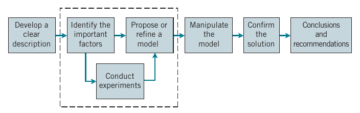
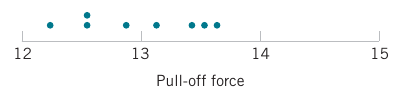
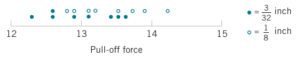
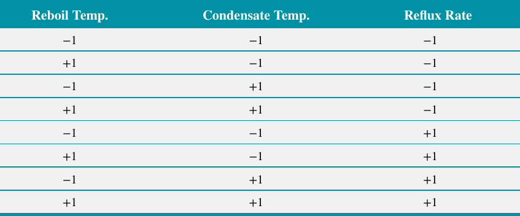
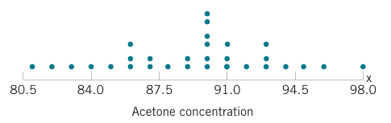
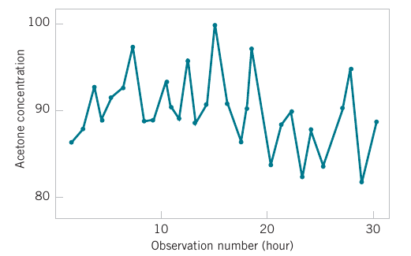

<style>
.section .reveal .state-background {
   background: #ffffff;
}
.section .reveal h1,
.section .reveal h2,
.section .reveal p {
   color: black;
   margin-top: 50px;
   text-align: center;
}
</style>


Statistical and probabilistic thinking in engineering
========================================================
date: 01/25/2021
autosize: true
incremental: true
width: 1920
height: 1080

<h2 style="text-align:left"> Instructions:</h2>
<p style='text-align:left'>Use the left and right arrow keys to navigate the presentation forward and backward respectively.  You can also use the arrows at the bottom right of the screen to navigate with a mouse.<br></p>

<blockquote>
FAIR USE ACT DISCLAIMER:</br>
This site is for educational purposes only.  This website may contain copyrighted material, the use of which has not been specifically authorized by the copyright holders. The material is made available on this website as a way to advance teaching, and copyright-protected materials are used to the extent necessary to make this class function in a distance learning environment.  The Fair Use Copyright Disclaimer is under section 107 of the Copyright Act of 1976, allowance is made for “fair use” for purposes such as criticism, comment, news reporting, teaching, scholarship, education and research.
</blockquote>


========================================================

<h2>Outline</h2>

* The following topics will be covered in this lecture:

  * Statistical thinking in engineering
  * Handling variability
  * Sample statistics versus population parameters
  * Collecting engineering data
  

========================================================
## Statistical thinking in engineering -- an example

* Statistics is a science that helps us <strong>make decisions and draw conclusions</strong> in the presence of <b>variability</b>. 

  * For example, civil engineers working in the transportation field are concerned about the capacity of regional highway systems. 
  
* A typical problem related to transportation would involve data regarding this specific system’s number of non-work, home-based trips, the number of persons per household, and the number of vehicles per household. 

* The objective would be to produce a trip-generation model relating trips to the number of persons per household and the number of vehicles per household. 

* A statistical technique called <b>regression analysis</b> can be used to <strong>construct this model</strong>. 

* The trip-generation model is an important tool for transportation systems planning. 

* Regression methods are among the most widely used statistical techniques in engineering. 


========================================================
### Statistical thinking in engineering -- an example

* The hospital emergency department (ED) is an important part of the healthcare delivery system. 

  * The process by which patients arrive at the ED is highly variable and can depend on the hour of the day and the day of the week, as well as on longer-term cyclical variations. 
  
* The service process is also highly variable, depending on the types of services that the patients require, the
number of patients in the ED, and how the ED is staffed and organized. 

* An ED’s capacity is also limited; 
  
  * consequently, some patients experience long waiting times. 
  
* How long patients wait on average is an important question for healthcare providers. 

* If waiting times become excessive, some patients will leave without receiving treatment (LWOT). 

* Patients who LWOT do not have their medical concerns addressed and are at risk for further problems and complications.

* Therefore, another important question is: What proportion of patients LWOT from the ED? 

* These questions can be solved by employing probability models to describe the ED; 

  * from these models very precise estimates of waiting times and the number of patients who LWOT can be obtained. 


========================================================
### Statistical thinking in engineering -- the process

<div style="float:left; width:100%">
<ul>
   <li>Engineering applies the scientific method to problems as above to solve problems for the interest of society.</li>
   <li>Engineers accomplish this by either refining an existing product or process or by designing a new product or process that meets customers’ needs.</li>
   <li>A typical flow for the process of developing an engineering solution is pictured below:</li>
</ul>
</div>
<div style="float:left; width:100%; text-align:center" class="fragment">

<p style="text-align:center">
Courtesy of Montgomery & Runger, <em>Applied Statistics and Probability for Engineers</em>, 7th edition
</p>
</div>
<div style="float:left; width:100%">
<ul>
   <li><b>First:</b> Develop a clear and concise description of the problem.</li>
   <li><b>Second:</b> Identify some of the important factors that affect this problem or that may play a role in its solution.</li>
   <li><b>Third:</b> Propose a model for the problem, using prior knowledge of the phenomenon, qualified by any limitations or assumptions of the model.</li>
</ul>
</div>


========================================================
### Statistical thinking in engineering -- the process

<div style="float:left; width:100%; text-align:center" class="fragment">

<p style="text-align:center">
Courtesy of Montgomery & Runger, <em>Applied Statistics and Probability for Engineers</em>, 7th edition
</p>
</div>
<div style="float:left; width:100%">
<ul>
   <li><b>Fourth:</b> Conduct appropriate experiments and collect data to test or validate the tentative model or conclusions made in steps 2 and 3.
</li>
   <li><b>Fifth:</b> Refine the model on the basis of the observed data.</li>
   <li><b>Sixth:</b> Manipulate the model to assist in developing a solution to the problem.</li>
   <li><b>Seventh:</b> Conduct an appropriate experiment to confirm that the proposed solution to the problem is
both effective and efficient.</li>
   <li><b>Finally:</b> Draw conclusions or make recommendations based on the problem solution.</li>
</ul>
</div>


========================================================
### Handling variability -- an example

* The field of <b>statistics</b> deals with the <strong>collection, presentation, analysis, and use of data to make decisions, solve problems, and design products and processes</strong>. 

* Statistical techniques can be powerful aids in designing new products and systems, improving existing designs, and designing, developing, and improving production processes.

* Statistical methods give a systematic framework to describe and understand variability. 

* By variability, we mean that successive observations of a system or phenomenon do not produce exactly the same result. 

* Suppose that an engineer is designing a nylon connector to be used in an automotive engine application. 

* The engineer is considering establishing the design specification on wall thickness at `3∕32` inch but is somewhat uncertain about the effect of this decision on the connector pull-off force. 

* If the pull-off force is too low, the connector may fail when it is installed in an engine. 

* Eight prototype units are produced and their pull-off forces measured, resulting in the following data (in pounds):

```
12.6, 12.9, 13.4, 12.3, 13.6, 13.5, 12.6, 13.1. 
```

* Because the pull-off force measurements exhibit variability, we consider the pull-off force to be a random variable. 


========================================================
### Handling variability -- an example

<div style="float:left; width:100%"> 
<ul>
   <li>A convenient way to think of a random variable, say $X$, that represents a measurement is by using the model

  $$X =\mu+\epsilon$$
  where $\mu$ is a constant and $\epsilon$ is a random disturbance.</li>
   <li>The constant $\mu$ remains the same with every measurement, but small changes in the environment, variance in test equipment, differences in the individual parts themselves, and so forth change the value of $\epsilon$. </li>
   <li>If there were no disturbances, $\epsilon$ would always equal zero and $X$ would always be equal to the constant $\mu$. </li>
   <li>However, this never happens in the real world, so the actual measurements $X$ exhibit variability. </li>
   <li>We often need to describe, quantify, and ultimately reduce variability.</li>
   <li>The figure below presents a dot diagram of these data. 
</ul>
</div>
<div style="float:left; width:100%; text-align:center" class="fragment">

<p style="text-align:center">
Courtesy of Montgomery & Runger, <em>Applied Statistics and Probability for Engineers</em>, 7th edition
</p>
</div>
<div style="float:left; width:100%">
<ul>
   <li>The dot diagram is a very useful plot for displaying a small body of data—say, up to about `20` observations. </li>
   <li>This plot allows us to easily see two features of the data: 
   <ol>
      <li>the location, or the "center" of the data; and 
      <li>the scatter or variability. 
   </ol>
</ul>
</div> 

========================================================
### Statistical thinking in engineering

<div style="float:left; width:100%">
<ul>
   <li> From testing the prototypes, the engineer knows that the average pull-off force is `13.0` pounds. </li>
   <li>However, the engineer thinks this is too low and considers an alternative design with a thicker wall, `1∕8` inch in thickness.</li> 
   <li> Eight prototypes of this design are built, and the observed pull-off force measurements are</li>
  <pre><code>
  12.9, 13.7, 12.8, 13.9, 14.2, 13.2, 13.5, 13.1
  </code></pre>
   <li>with the new mean pull-off force `13.4`.</li> 
</ul>
</div>
<div style="float:left; width:60%">
<ul>
   <li>Plotting the data together gives the impression that increasing the wall thickness has led to an increase in pull-off force.</li>
</ul>
</div>
<div style="float:right; width:40%; text-align:center" class="fragment">

<p style="text-align:center">
Courtesy of Montgomery & Runger, <em>Applied Statistics and Probability for Engineers</em>, 7th edition
</p>
</div>
<div style="float:left; width:60%">
<ul>
   <li>However, there are some obvious questions to ask:
   <ul>
      <li>how do we know that another sample of prototypes will not give different results?</li>
      <li>is a sample of eight prototypes adequate to give reliable results?</li>
   </ul>
</ul>
</div>
<div style="float:left; width:100%">
<ul>
   <ul>
      <li>if we use the test results obtained so far to conclude that increasing the wall thickness increases
the strength, what risks are associated with this decision?</li.
      <ul>
         <li>E.g., is it possible that the apparent increase in pull-off force observed in the thicker prototypes is due only to the inherent variability in the system?
         <li>What if increasing the thickness of the part (and its cost) really has no effect on the pull-off force?</li>
      </ul>
   </ul>
</ul>
</div>


========================================================
## <b style="color:#d95f02">Sample statistics</b> versus <b style="color:#1b9e77">Population parameters</b>

* To handle these questions, we must systematically reason from a finite collection of measurements to infer what the pull-off force and its variability will be in production.

* When we describe the prototypes and the hypothetical future production units, we often refer to them as the <b style="color:#d95f02">sample</b> and <b style="color:#1b9e77">population</b> respectively.   

  * A <b style="color:#d95f02">sample</b> refers to the available observations within a data set, such as the measurements from a set of prototypes.
  
  * A <b style="color:#1b9e77">population</b> refers to the <b>entire collection</b> of possible-to-measure data points, even if they aren't measured in our data set.  This would correspond to units in a future production, not just those in our initial prototype.

*  We will introduce two new definitions related to <b style="color:#d95f02">samples</b> and <b style="color:#1b9e77">populations</b>: 

  * A <b style="color:#1b9e77">parameter</b> is a numerical measurement describing some characteristic of a <b style="color:#1b9e77">population</b>.

  * A <b style="color:#d95f02">statistic</b> is a numerical measurement describing some characteristic of a <b style="color:#d95f02">sample</b>. 
  
  * The alliteration in <b style="color:#1b9e77">"population parameter"</b> and <b style="color:#d95f02">"sample statistic"</b> helps us remember the meaning of these terms.


========================================================

### <b style="color:#d95f02">Sampling</b> errors

* Imagine now that we are <strong>flipping a fair coin</strong>.

* Suppose we take a sample of 4 flips and get 3 heads and 1 tails.

* In our <b style="color:#d95f02">sample</b> it may appear that it was a $75\%$ probability of getting heads and $25\%$ probability of getting tails.

  * These <b style="color:#d95f02">sample statistics</b> don't match the <b style="color:#1b9e77">population parameters</b> of $50\%$ for both outcomes.
  
* If we flipped the coin 100 more times, our <b style="color:#d95f02">sample statistics</b> will approach the true <b style="color:#1b9e77">population parameter</b> on average.
  
* <b>The random discrepancy between the <b style="color:#d95f02">sample statistic</b> and the <b style="color:#1b9e77">population parameter</b> is known as sampling error</b>. 

* Considering the model for the pull-off strength, 

   $$X= \mu+\epsilon$$
  we might say that the sample-based average approximates population parameter $\mu$, but will usually be different due to the observed disturbances in realizations of $\epsilon$.

* However, under certain conditions, with a large sample size will get a better approximation of $\mu$ on average with the sample statistic from the prototypes.


========================================================
## Collecting engineering data

* Sometimes the data are all of the observations in the population;
  
  * however, in most cases the data is almost always an incomplete sample that has been selected from the population. 
  
*  Three basic methods of collecting data are

   * A retrospective study using historical data
   * An observational study
   * A designed experiment

* An effective data-collection procedure can greatly simplify the analysis and lead to improved understanding of the population or process that is being studied.


========================================================
### Retrospective studies -- an example


* Montgomery, Peck, and Vining (2012) describe an acetone-butyl alcohol distillation column for which concentration of acetone in the distillate (the output product stream) is an important variable. 

* Factors that may affect the distillate are the reboil temperature, the condensate temperature, and the reflux rate. 

* Production personnel obtain and archive the following records:
   
   * The concentration of acetone in an hourly test sample of output product
   * The reboil temperature log, which is a record of the reboil temperature over time
   * The condenser temperature controller log
   * The nominal reflux rate each hour

* The reflux rate should be held constant for this process and, consequently, production personnel change this very infrequently.

* A retrospective study would use either all or a sample of the historical process data archived over some period of time. 

* The study objective might be to discover the relationships among the two temperatures and the reflux rate on the acetone concentration in the output product stream.


========================================================
### Retrospective studies -- an example continued

* However, this type of study presents some problems:
   1. We may not be able to see the relationship between the reflux rate and acetone concentration because the reflux rate did not change much over the historical period.
   2. The archived data on the two temperatures (which are recorded almost continuously) do not correspond perfectly to the acetone concentration measurements (which are made hourly).  It may not be obvious how to construct an approximate correspondence.
   3. Production maintains the two temperatures as closely as possible to desired targets or set points.  Because the temperatures change so little, it may be difficult to assess their real impact on acetone concentration.
   4. In the narrow ranges within which they do vary, the condensate temperature tends to increase with the reboil temperature. Consequently, the effects of these two process variables on acetone concentration may be difficult to separate.

* A retrospective study may involve a <strong>significant amount of data</strong>, but those data may contain <b>relatively little useful information</b> about the problem. 

* Furthermore, some of the <strong>relevant data may be missing</strong>, there may be transcription or recording errors resulting in outliers
(or unusual values), or data on other important factors may not have been collected and archived.

* In the distillation column, for example, the specific concentrations of butyl alcohol and acetone in the input feed stream are very important factors, but they are not archived because the concentrations are too hard to obtain on a routine basis. 

* As a result of these types of issues, statistical analysis of historical data sometimes identifies interesting phenomena, but solid and reliable explanations of these phenomena are often difficult to obtain.


========================================================
### Observational Study

* In an observational study, the engineer observes the process or population, disturbing it as little as possible, and records the quantities of interest. 

* Because these studies are usually conducted for a relatively short time period, sometimes variables that are not routinely measured can be included.

* In the distillation column, the engineer would design a form to record the two temperatures and the reflux rate when acetone concentration measurements are made. 

* It may even be possible to measure the input feed stream concentrations so that the impact of this factor could be studied.

* Generally, an observational study tends to solve problems 1 and 2 discussed earlier and goes a long way toward obtaining accurate and reliable data. 

* However, observational studies may not help resolve problems 3 and 4 discussed earlier.


========================================================
###  Designed experiments

<div style="float:left; width:100%">
<ul>
   <li>In a designed experiment, the engineer makes deliberate or purposeful changes in the controllable variables of the system or process,</li>
   <ul>
      <li>they then observe the resulting system output data, and make an inference or decision about which variables are responsible for the observed changes in output performance. </li>
   </ul>
   <li>Designed experiments offer a very powerful approach to studying complex systems, such as the distillation column. </li>
   <li> This process has three factors—the two temperatures and the reflux rate—and we want to investigate the effect of these three factors on output acetone concentration. </li>
   <li> A good experimental design for this problem must ensure that we can separate the effects of all three factors on the acetone concentration.</li> 
   <li> The specified values of the three factors used in the experiment are called factor levels. </li>
</ul>
</div>
<div style="float:right; width:50%; text-align:center" class="fragment">

<p style="text-align:center">
Courtesy of Montgomery & Runger, <em>Applied Statistics and Probability for Engineers</em>, 7th edition
</p>
</div>
<div style="float:left; width:50%">
<ul>
   <li> Typically, we use a small number of levels such as two or three for each factor.</li>
   <li>For the distillation column problem, suppose that we use two levels, “high” and “low” (denoted +1 and −1, respectively), for each of the three factors. </li>
   <li> A very reasonable experiment design strategy uses every possible combination of the factor levels to form a basic experiment with eight different settings for the process. </li>
   <li>This type of experiment is called a factorial experiment. </li>
</ul>
</div>


========================================================
### Observing processes over time

<div style="float:left; width:50%"> 
<ul>
   <li>Often data are collected over time -- in this case, it is usually very helpful to plot the data versus time in a time series plot. </li>
   <li>Phenomena that might affect the system or process often become more visible in a time-oriented plot and the concept of stability can be better judged.</li>
   <li>A dot diagram is pictured of acetone concentration readings taken hourly from the distillation column.</li> 
</ul>
</div>
<div style="float:right; width:40%; text-align:center" class="fragment">

<p style="text-align:center">
Courtesy of Montgomery & Runger, <em>Applied Statistics and Probability for Engineers</em>, 7th edition
</p>
</div>
<div style="float:left; width:50%">
<ul>
   <li> The large variation displayed on the dot diagram indicates considerable variability in the concentration, but the chart does not help explain the reason for the variation.</li>
   <li>The time series of the data is pictured where a shift in the process mean level is visible in the plot and an estimate of the time of the shift can be obtained.</li>
</ul>
</div>
<div style="float:right; width:40%; text-align:center" class="fragment">

<p style="text-align:center">
Courtesy of Montgomery & Runger, <em>Applied Statistics and Probability for Engineers</em>, 7th edition
</p>
</div>
<div style="float:left; width:50%">
<ul>
   <li>These cover some basic aspects of statistical thinking in engineering.</li>
   <li>In the following lecture we will begin to discuss how we model variability with probability.</li>
</ul>
</div>
