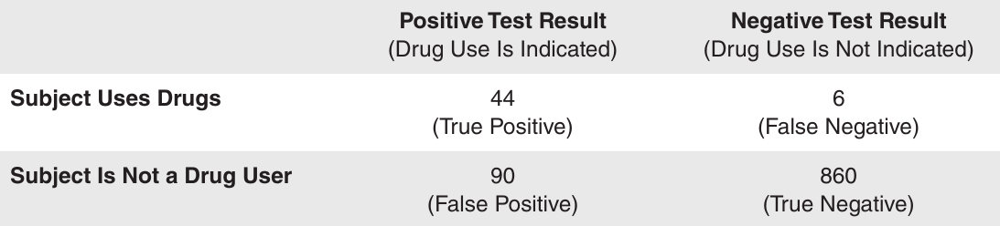

<!-- foo 
Highlighting
bold
strong
orange <b style="color:#d95f02"> text </b>
green  <b style="color:#1b9e77"> text </b>
purple <b style="color:#d24693"> text </b>
red    <b style="color:#FF0000"> text </b>
blue   <b style="color:#0000FF"> text </b>
-->

Conditional probability and probability rules
========================================================
date: 02/03/2021
autosize: true
incremental: true
width: 1920
height: 1080

<h2 style="text-align:left"> Instructions:</h2>

Use the left and right arrow keys to navigate the presentation forward and backward respectively.  You can also use the arrows at the bottom right of the screen to navigate with a mouse. 

<blockquote>
FAIR USE ACT DISCLAIMER: 
This site is for educational purposes only.  This website may contain copyrighted material, the use of which has not been specifically authorized by the copyright holders. The material is made available on this website as a way to advance teaching, and copyright-protected materials are used to the extent necessary to make this class function in a distance learning environment.  The Fair Use Copyright Disclaimer is under section 107 of the Copyright Act of 1976, allowance is made for “fair use” for purposes such as criticism, comment, news reporting, teaching, scholarship, education and research.
</blockquote>

========================================================

<h2>Outline</h2>

* The following topics will be covered in this lecture:

  * Axioms of probabilty
  * Addition rule
  * Conditional probability 
  * Multiplication rule
  * Total probability rules

========================================================
## Axioms of Probability

<ul>
  <li>Now that we are more familiar with the notions of probability,
we can collect the assumptions into a set of axioms of probability that must be satisfied in <em>any random experiment</em>.</li>
  <li style="list-style-type:none"><blockquote>Probability is a number that is assigned to each member of a collection of events from a random experiment that satisfies the following properties:
   <ol>
     <li>$P(S) = 1$ where $S$ is the sample space</li>
     <li>$0 ≤ P(E) ≤ 1$ for any event $E$</li>
     <li>For two events $E_1$ and $E_2$ with $E_1 \cap E_2=\emptyset$ $$P(E_1\cup E_2)=P(E_1)+P(E_2)$$ </li>
   </ol>
</blockquote></li>

  <li>These axioms <em>do not determine probabilities</em>; the probabilities are assigned based on our knowledge of the system under study.</li>

  <li> These axioms imply some important results</li>
  <ul>
   <li> Probability of the empty set is zero $$P(\emptyset)=0$$ </li>
   <ul>
      <li>We can recognize this as 
      $$P(S \cup \emptyset ) = P(S)$$
      and 
      $$P(S \cup \emptyset ) = P(S) + P(\emptyset)$$</li>
      <li>Putting the above together, we have
      $$P(S) + P(\emptyset) = P(S) \Leftrightarrow P(\emptyset) = 0.$$</li>
   </ul>
   </ul>
</ul>

========================================================
### Axioms of Probability -- continued
<ul>
   <ul>
   <li> Probability that event $E$ does not occur $$P(E')=1-P(E)$$</li>
   <ul>
      <li>Notice that
      $$P(E' \cup E) = P(S) = 1$$
      and
      $$P(E' \cup E) = P(E') + P(E)$$</li>
      <li>Therefore, we have
      $$P(E') + P(E) = 1 \Leftrightarrow P(E') = 1 - P(E).$$</li>
   </ul>
   <li> If the event $E_1$ is contained in the event $E_2$, $$P(E_1)\leq P(E_2)$$</li>
   <ul>
      <li>Notice that $E_1 \cup E_2 = E_2$ and $E_1 \cap E_2 = E_1$ because of the set containment.</li>
      <li>Therefore, 
      $$P(E_2) = P(E_1 \cup E_2 ) = P\left((E_1\cap E_2) \cup (E_1'\cap E_2)\right) = P(E_1)+ P(E_1'\cap E_2)$$ </li>
      <li>Considering the above, we have
      $$P(E_1) = P(E_2)- P(E_1'\cap E_2)$$
      where $P(E_1'\cap E_2) \geq 0$.</li>
   </ul>
</ul>

========================================================
## Unions of Events and Addition Rules   

Courtesy of Bin im Garten  <a href="https://creativecommons.org/licenses/by-sa/3.0" target="blank">CC</a> via  
        <a href="https://commons.wikimedia.org/wiki/File:Menge_Venn-Diagramm_001.svg"> Wikimedia Commons</a>

<ul>
  <li>More generally, suppose we want to <strong>compute the probability of two events $A$ and $B$ joined</strong> by the compound operation <b>"or"</b> that <strong>are not disjoint</strong>.</li>
  <li>We read the statement,
  $$P(A \text{ or }  B)$$ 
  as the probability of event:</li>
  <ul>
    <li>$A$ occuring,</li>
    <li>event $B$ occuring, or</li>
    <li>both $A$ and $B$ ocurring.</li>
  </ul>
  <li>Intuitively, we can express the probability in terms of all the ways $A$ can occur and all the ways $B$ can occur, <em>if we don't double count.</em></li>
    <li>Consider, if there is an <b>overlap where both $A$ and $B$ occur simultaneously</b>,
    $$P(A \cap B)\neq \emptyset$$
    then summing the total of all ways $A$ occurs and the total of all ways $B$ occurs <strong>double counts the the cases where both $A$ and $B$ occur</strong>.</li> 
</ul>

<ul>
  <li>Therefore, the <b>addition rule</b> for compound events is given as </li>
  <li style="list-style-type:none"><blockquote><b>Probability of a union</b>
  $$P(A \cup B) = P(A) + P(B)  - P(A \cap B)$$</blockquote></li>
</ul>

========================================================
## Probability of a union --example

<ul>
   <li><strong>EXAMPLE:</strong> the table below lists the history of 940 wafers in a semiconductor
manufacturing process. </li>
</ul>

Courtesy of Montgomery & Runger, <em>Applied Statistics and Probability for Engineers</em>, 7th edition

<ul>
   <li><b>Question:</b> whats is the probability that a wafer is from the center of the sputtering tool or contains high levels of contamination ?</li> 
   <li>Suppose that 1 wafer is selected at random.</li> 
   <li>Total number of outcomes is $626+314=940$.</li> 
   <li>Let $H$ denote the event that the wafer contains <b>high</b> levels of contamination. Then, $$P(H) = \frac{358}{940}$$ </li>
   <li>Let $C$ denote the event that the wafer is in the <b>center</b> of a
sputtering tool. Then $$P(C) = \frac{626}{940}$$ </li>
   <li>The event $H \cap C$ is the event that the wafer is from the center of the sputtering tool <b>and</b> contains high levels of contamination.Then $$P(H \cap C)=\frac{112}{940}$$</li>
</ul>

<li>We can use the addition rule to obtain
   $$\begin{align}
   P(H \cup C) & = P(H)+P(C)-P(H \cap C)\\
               & = \frac{358}{940}+\frac{626}{940}-\frac{112}{940}= \frac{872}{940}
   \end{align}$$
</li>

========================================================
## Two or more events

<ul>
   <li>More complicated probabilities, such as $P(A \cup B \cup C)$, can be determined by repeated use of the <strong>addition rule</strong>:
   $$P(A \cup B \cup C) = P[(A \cup B) \cup C] = P(A \cup B) + P(C) − P[(A \cup B) \cap C].$$</li>
   <li>We can apply the <strong>addition rule</strong> again on  $P(A \cup B)= P(A)+P(B)-P(A \cap B)$</li>
   <li>and we can use the distributed rule for set operations on 
   $$P[(A \cup B) \cap C]=P[(A\cap C)\cup (B\cap C)]$$</li>
   <li> We apply the <strong>addition rule</strong> on the right-hand side of the expression above
   $$P[(A\cap C)\cup (B\cap C)] = P(A\cap C)+P(B\cap C )-P(A\cap B \cap C)$$
   </li>
   <li>Finally we put everything together 
   $$\begin{align}
   P(A \cup B \cup C) & = P(A \cup B) + P(C) − P[(A \cup B) \cap C]\\
                      & = P(A)+P(B)-P(A \cap B) + P(C) -  P(A\cap C) -P(B\cap C )+P(A\cap B \cap C)
   \end{align}$$</li>
   <li>If the events are <b>mutually exclusive</b>, the results simplify considerably...</li>
</ul>

Courtesy of Montgomery & Runger, <em>Applied Statistics and Probability for Engineers</em>, 7th edition

<ul>
   <li style="list-style-type:none;"><blockquote>A collection of events, $E_1 , E_2 , ... , E_k$, is said to be <b>mutually exclusive</b> if for all pairs,
$$E_i \cap E_j = \emptyset.$$
For a collection of mutually exclusive events,
$P(E_1 \cup E_2 \cup ... \cup E_k ) = P(E_1 ) + P(E_2 ) + · · ·+ P(E_k )$<blockquote></li>
<ul>

========================================================
## Conditional probability

 
<ul>
  <li>There are several ways to consider <b>conditional probability</b> -- the "physics" way to consider this, due to Kolmogorov, is as follows:</li>
  <ul>
    <li>Suppose that there are two related events $A$ and $B$ where <strong>knowledge of one occuring would change         how likely we see the other to occur</strong>.</li>
    <ul>
      <li>For example, we can say $A=$"it snows in the Sierra" and $B=$"it rains in my garden".</li>
      <li>The day before, I don't know if either will occur.</li>
      <li>However, if I knew that $A$ occured, this would change how likely it would seem that $B$ occurs;</li>
      <li> $B$ is not guaranteed when $A$ occurs, but the probability of $B$ occuring would be higher in the presence of $A$.</li>
    </ul>
  </ul>
</ul>

Courtesy of Bin im Garten  <a href="https://creativecommons.org/licenses/by-sa/3.0" target="blank">CC</a> via  
        <a href="https://commons.wikimedia.org/wiki/File:Menge_Venn-Diagramm_001.svg"> Wikimedia Commons</a>

 
<ul>
  <li>Supose that $A$ occurs hypothetically, then our <b>sample space</b> of possible events now <strong>only includes events where $A$ also occurs</strong>.</li>
  <li>I.e., we would need to restrict our consideration of $B$ relative to the case that $A$ occurs.</li> 
  <li>Supose that $A$ occurs hypothetically, then our <b>sample space</b> of possible events now <strong>only includes events where $A$ also occurs</strong>.</li>
  <li>I.e., we would need to restrict our consideration of $B$ relative to the case that $A$ occurs.</li>
  <li>We define the <b>probability of $B$ conditional on $A$</b>,  
  $$P(B\vert A),$$  
  as the <strong>probability of $B$ given $A$</strong>.</li>
</ul>

========================================================
## Conditional probability -- continued

Courtesy of Bin im Garten  <a href="https://creativecommons.org/licenses/by-sa/3.0" target="blank">CC</a> via  
        <a href="https://commons.wikimedia.org/wiki/File:Menge_Venn-Diagramm_001.svg"> Wikimedia Commons</a>

 
<ul>
  <li>Assuming $A$ occurs, we will consider all ways for  <strong>both $A$</strong> <b>and</b> <strong>$B$ to occur</strong>.</li>
  <ul>
      <li>The <strong>sample space for $B \vert A$ has been restricted to the cases where $A$ occurs</strong>, so we compute the probability <b>relative to all the ways $A$ occurs</b>.</li>
      <li>Therefore the probability of $P(B\vert A)$ can be read,
  $$\frac{\text{number of outcomes in }A\text{ and }B}{\text{number of outcomes in }A}$$</li>
     <li>Mathematically we write this as
     <blockquote>The <b>conditional probability</b> of an event $B$ given an event $A$ is
  $$P(B\vert A) = \frac{P(A\cap B)}{P(A)}.$$ for $P(A)>0$
  <blockquote></li> 
    <li>The above statment only makes sense when <b>$P(A)\neq 0$</b>, because <strong>we can never divide by zero</strong>.</li>
    <ul>
    <li>"Physically" we can interpret the meaning with $P(B\vert A)$ read as
      <blockquote>
      The probability that $B$ occurs given that $A$ occurs.
      </blockquote></li>
    <li>The above <strong>should not be defined when $A$ is impossible</strong> -- the phrase "given that $A$ occurs" makes no sense.</li>
    </ul> 
</ul>

========================================================
## Conditional probability -- example 1

Courtesy of Mario Triola, <em>Essentials of Statistics</em>, 5th edition

<ul>
  <li><strong>EXAMPLE:</strong> if $1$ of the $1000$ test subjects is randomly selected, let the events be $A=$"the participant uses drugs" and $B=$"the participant has a positive test result".</li>
  <li><b>Question:</b> How can we use the above probability rules to find the probability that a random subject had a positive test result, given that the subject actually uses drugs?</li>
  <li>I.e. what is the value of $P(B \vert A)$?</li> 
</ul>

  

<ul>  
  <li>Notice that
    $$\begin{align}
    P(A) &= \frac{44\text{ true positives} + 6 \text{ false negatives}}{1000} = \frac{50}{1000},\\
    P(A \cap B) & = \frac{44 \text{ true positives} }{1000} = \frac{44}{1000}
    \end{align}$$ </li>
  <li>and using the definition of conditional probability 
  $$P(\text{Subject has positive test result }given\text{ the subject uses drugs})=P(B\vert A ) =\frac{ P(A \cap B) }{P(A)},$$</li>
  <li>we can then show that,
  $$P(B\vert A ) = \frac{\frac{44}{1000}}{\frac{50}{1000}} = \frac{44}{50} = .88$$</li>

</ul>

========================================================
## Conditional probability -- example 1 continued

Courtesy of Mario Triola, <em>Essentials of Statistics</em>, 5th edition

<ul>
  <li>Keep $A=$"the participant uses drugs" and $B=$"the participant has a positive test result"</li>
  <li><b>Question:</b> Is $P(B\vert A ) = P(A\vert B)?$</li>
    <ul>
    <li>Using the definition of
    $$P(A \vert B) = \frac{P(A \cap B)}{P(B)}$$
    we can see that the probability that a participant uses drugs given participant has a positive test result is 
    $$\begin{align}
    P(A \vert B) =&\frac{\frac{44}{1000}}{\frac{133}{1000}} = \frac{44}{133} \approx .33
    \end{align}$$</li>
  </ul>
</ul>

<ul>
  <ul>
    <li>However, on the other hand $P(B\vert A) = .88$
    <li>In fact, $P(A\vert B) \neq P(B\vert A)$ and they are quite different.</li>  
    <li>This actually says that</li>
    <ul>
      <li>there is <strong>lower probability</strong> that the <b>participant uses drugs</b> given that their <b>test result is positive</b>, <strong>than</strong></li> 
      <li>the probability that the <b>test result is positive</b>, given that the <b>participant uses drugs</b>.</li> 
    </ul>
  </ul>
</ul>

========================================================
## Conditional probability -- example 2

Courtesy of Montgomery & Runger, <em>Applied Statistics and Probability for Engineers</em>, 7th edition

<ul>
  <li><strong>EXAMPLE:</strong> Usually a thin film manufacturing process is sensitive to contamination problems that can increase the rate of parts that are not acceptable. The table on the left provides an example of 400 parts classified by surface flaws and as (functionally) defective.</li>
  <li><b>Q</b>: what is the probability that a part will be defective given or assuming that a part has a surface flaw? </li>
  <ul>
    <li>Let $D$ denote the event that a part is defective, and let $F$ denote the event        that a part has a surface flaw</li>
    <li>Notice that
    $$\begin{align}
    P(F) &= \frac{10\text{ functional defective} + 30\text{ functional not defective}}{400} \\
    &= \frac{40}{400}\end{align}$$
     <li> and $$P(D \cap F) = \frac{10 \text{ defective but functional parts}}{400}$$</li>
     <li>Then$$P(D|F)=\frac{P(D\cap F)}{P(F)}=\frac{\frac{10}{400}}{\frac{40}{400}}=\frac{10}{40}=0.25$$</li>
  </ul>
</ul>

========================================================
## Conditional probability -- example 2 continued

<ul>
  <li>Note that in this example all four of the following probabilities
are different:
$$\begin{align}
P(D) &=28/200 &\;&P(D|F)=10/40 \\
P(F) &=40/400 &\;&P(F|D)=10/28 
\end{align}$$</li>
</ul>

Courtesy of Montgomery & Runger, <em>Applied Statistics and Probability for Engineers</em>, 7th edition

<ul>
  <li>A tree diagram can also be used to display conditional probabilities</li>
  <ul>
    <li><b>First level</b> of the tree is on surface flaw. </li>
     <ul>
        <li>Of the 40 parts with surface flaws:</li>
        <ul>
          <li><b>Second level</b> is on defective parts: 10 are functionally defective and 30 are not</li>
          <li>$$P(D|F)=10/40 \text{ and } P(D'|F)=30/40$$</li>
        </ul>
        <li>Of the 360 parts without surface flaws:</li>
        <ul>
          <li><b>Second level</b>: 18 are functionally defective and 342 are not.</li>
          <li>$$P(D|F')=18/360\text{ and } P(D'|F')=342/360$$</li>
        </ul>
    </ul>
  </ul>
</ul>

<!-- ======================================================== -->
<!-- ## Random samples  -->

<!-- 2.6 -->

========================================================
## Intersections of Events and Multiplication Rule

* The probability of the intersection of two events is often needed
* Let us suppose that $A$ and $B$ are events for which $P(A)\neq 0$ and $P(B)\neq 0$.</li>
* Using the definition of conditional probability $$P(B|A)=\frac{P(A\cap B)}{P(A)}$$
* We can solve for the intersection of events $$P(A \cap B) = P(B\vert A) P(A)$$</li>
* Similarly, from the same definition of conditional probability we have 
$$P(A|B)=\frac{P(A\cap B)}{P(B)}$$
* which implies that $$P(A \cap B) = P(A\vert B) P(B)$$
* We can provide a formula known as the <strong>multiplication rule</strong>
<blockquote><b>Probability of an Intersection:</b>
$$P(A \cap B) = P(B\vert A) P(A) = P(A\vert B) P(B) $$
</blockquote>
    
========================================================
## Intersections of Events -- example

* <strong>EXAMPLE:</strong> The probability that the first stage of a numerically controlled machining operation for high-rpm pistons meets specifications
is 0.90. 

* Failures are due to metal variations, fixture alignment,
cutting blade condition, vibration, and ambient environmental conditions. 

* Given that the first stage meets specifications, the probability that a second stage of machining meets specifications is 0.95.

* <b>Question:</b> What is the probability that both stages meet specifications?

  * Let the events be $A=$"first stage meets specifications" and $B=$"second stage meets specifications".
  * The probability requested is $P(A \text{ and }B)$
    * where $P(A)=0.90$
    * and $P(B|A)=0.95$
  * Using the <strong>multiplication rule</strong>, we get 
    $$\begin{align}
    P(A \cap B) &= P(B\vert A) P(A) \\
                &= 0.95(0.90) = 0.855 
      \end{align}$$
      
  * <em>Note:</em> although it is also true that $P(A \cap B) = P(A | B)P(B)$, the information provided in the problem does not match this second formulation.    

========================================================
## Total Probability Rule

<ul>
  <li>So far we have described probabilities of events in terms of the probabilities of union or intersections of events. Recall conditional probability, and multiplication and addition rules. </li>
  <li>What if we want to recover the probabilty of single event $P(B)$ given several conditions?</li>
</ul>

Courtesy of Montgomery & Runger, <em>Applied Statistics and Probability for Engineers</em>, 7th edition

<ul>
  <li>For any event $B$, we can write $B$ as the union of the part of $B$ in $A$ and
the part of $B$ in $A′$. That is $$B=(A\cap B)\cup(A'\cap B)$$</li>
  <li>Because $A$ and $A′$ are mutually exclusive</li>
  <ul>
    <li>$A \cap B$ and $A' \cap B$ are mutually exclusive</li>
  </ul>
  <li>So we can use the <strong>addition rule</strong> for mutually exclusive events as
  $$\begin{align}
  P(B)&=P((A\cap B)\cup(A'\cap B))\\
      &=P(A\cap B)+P(A'\cap B)\end{align}$$</li>
  <li>Using the <strong>multiplication rule</strong> on each term of $P(B)$ we get
  $$P(B)=P(B|A)P(A)+P(B|A')P(A')$$</li>    
</ul>

<ul>
  <li style="list-style-type:none"><blockquote style="width:100%" class="fragment">
  <b>Total Probability Rule (Two Events)</b>
  For any two events $A$ and $B$ 
  <li style="list-style-type:none">$$\begin{align}
  P(B)=P(B\cap A)+P(B\cap A')=P(B|A)P(A)+P(B|A')P(A')
  \end{align}$$</li>
  </blockquote></li>
</ul>

========================================================
## Total Probability Rule -- example

Courtesy of Montgomery & Runger, <em>Applied Statistics and Probability for Engineers</em>, 7th edition

<ul>
  <li>Suppose that in semiconductor manufacturing, the probability is 0.10 that a chip subjected to high levels of contamination during manufacturing causes a product failure.</li>
  <li>The probability is 0.005 that a chip not subjected to high contamination levels during manufacturing causes a product failure. In a particular production run, 20% of the chips are subject to high levels of contamination.</li>
  <li><b>Q:</b>What is the probability that a product using one of these chips fails?</li>
</ul>

<ul>
  <li>Lets denote the events be $F=$"product fails" and $H=$"chip is exposed to high levels of contamination".</li>
  <li>From the table we can extract some pieces of information</li>
  <ul>
    <li>$P(H)=0.2$ and $P(H')=0.8$</li>
    <li>$P(F|H)=0.10$ and $P(F|H')=0.005$</li>
  </ul>
  <li>We can use the total probability rule on $P(F)$ in terms of conditional probabilities
  $$P(F)=P(F|H)P(H)+P(F|H')P(H')$$</li>
  <li>Then the probability that a product fails is
  $$P(F)=0.10(0.20)+0.005(0.80)=0.024$$</li>
</ul>

========================================================
## Total Probability Rule (Multiple Events)

Courtesy of Montgomery & Runger, <em>Applied Statistics and Probability for Engineers</em>, 7th edition

<ul>
  <li>In general, a collection of sets $E_1, E_2, \dots , E_k$ such that
$$E_1 \cup E_2 \cup \dots \cup E_k = S$$ 
  is said to be <b>exhaustive.</b></li>
  <li>A graphical display of partitioning an event $B$ among a collection of mutually exclusive and exhaustive events is shown in the figure on the left.</li>
  <li>We can  generalize the total probability rule for multiple events</li>
</ul>

  <li style="list-style-type:none"><blockquote>
  <b>Total Probability Rule (Multiple Events)</b>
  Assume $E_1, E_2, \dots , E_k$ are $k$ mutually exclusive and exhaustive sets. Then  
  $$\begin{align}
  P(B)&=P(B\cap E_1)+P(B\cap E_2)+\dots+P(B\cap E_k)\\
      &=P(B|E_1)P(E_1)+P(B|E_2)P(E_2)+\dots+P(B|E_k)P(E_k)
  \end{align}$$</blockquote></li>
</ul>

  

