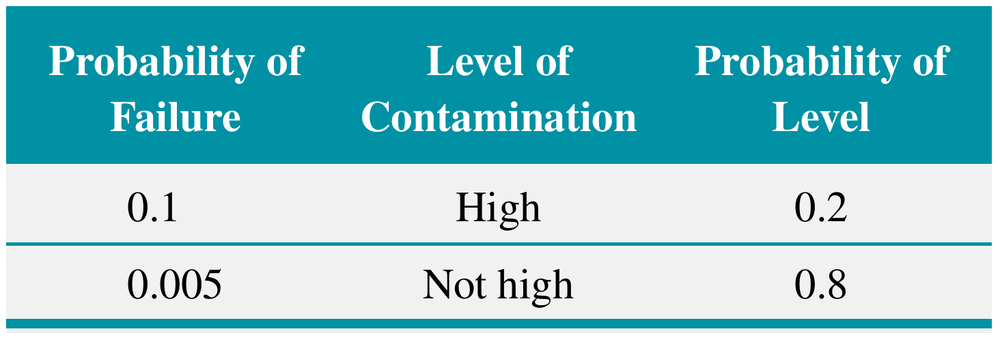
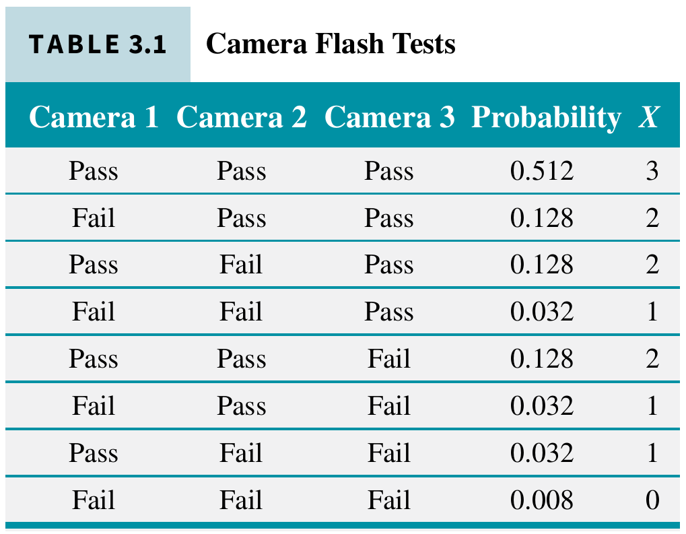
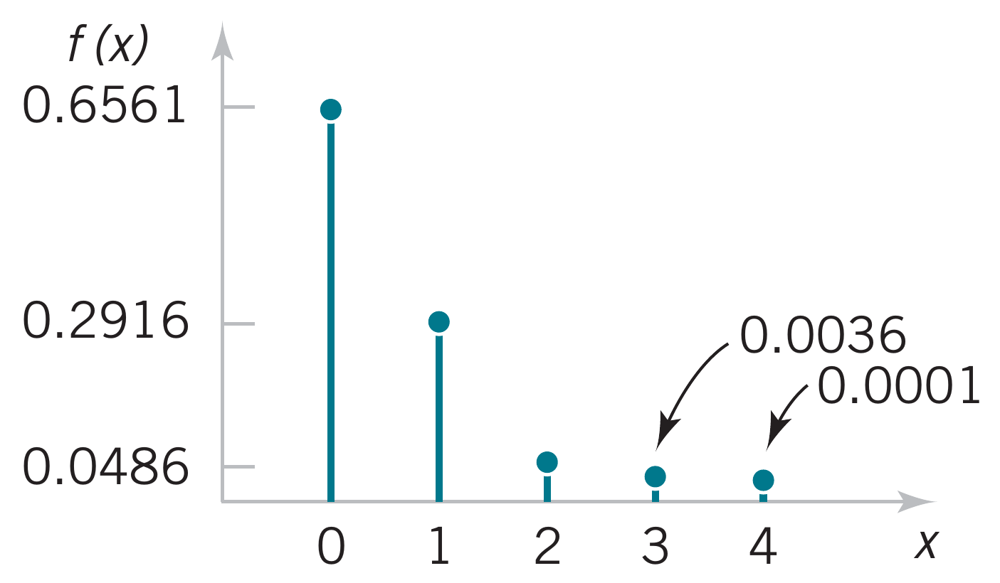

<!-- foo 
Highlighting
bold
strong
orange <b style="color:#d95f02"> text </b>
green  <b style="color:#1b9e77"> text </b>
purple <b style="color:#d24693"> text </b>
red    <b style="color:#FF0000"> text </b>
blue   <b style="color:#0000FF"> text </b>
-->

Bayes' Theorem and Probability Distributions
========================================================
date: 02/10/2021
autosize: true
incremental: true
width: 1920
height: 1080

<h2 style="text-align:left"> Instructions:</h2>

Use the left and right arrow keys to navigate the presentation forward and backward respectively.  You can also use the arrows at the bottom right of the screen to navigate with a mouse. 

<blockquote>
FAIR USE ACT DISCLAIMER: 
This site is for educational purposes only.  This website may contain copyrighted material, the use of which has not been specifically authorized by the copyright holders. The material is made available on this website as a way to advance teaching, and copyright-protected materials are used to the extent necessary to make this class function in a distance learning environment.  The Fair Use Copyright Disclaimer is under section 107 of the Copyright Act of 1976, allowance is made for “fair use” for purposes such as criticism, comment, news reporting, teaching, scholarship, education and research.
</blockquote>

========================================================

<h2>Outline</h2>

* The following topics will be covered in this lecture:

  * Bayes' theorem
  * Random variables
  * Probability distributions
  * Probability Mass Functions

<!-- 2.8 -->

========================================================
## Bayes’ Theorem

<ul>
  <li>Let us suppose that $A$ and $B$ are events for which $P(A)\neq 0$ and $P(B)\neq 0$.</li>
  <li>Consider the statement of the multiplication rule,
  $$P(A \cap B) = P(A\vert B) P(B); $$
  </li>
  <li>yet it is also true that,
  $$P(B \cap A) = P(B \vert A) P(A); $$</li>
  <li>and $P( A \cap B) = P(B \cap A)$ by definition.</li>  
  <li>Putting these statements together, we obtain,
  $$\begin{align}
  &P(A\vert B) P(B) = P(B \vert A ) P(A)\\
  \Leftrightarrow & P(A \vert B) = \frac{P(B\vert A) P(A)}{ P(B)}  
  \end{align}$$</li>
  <li style="list-style-type:none"><blockquote>The statement that 
  $$ P(A \vert B) = \frac{P(B\vert A) P(A)}{ P(B)} $$
  is known as <b>Bayes' theorem</b> for $P(B)>0$.</blockquote></li>
  <li>This is nothing more than re-writing the multiplication rule as discussed above, but the result is <em>extremely powerful.</em></li>
  <li>Bayes' theorem wasn't widely used in statistics for hundreds of years, until advances in digital computers.</li>
  <li>When digital computers became available, many tools became available using Bayes' theorem as the basis.</li>
</ul>

========================================================
## Bayes' theorem continued

<ul>
  <li>Often, Bayes 
  $$ P(A \vert B) = \frac{P(B\vert A) P(A)}{ P(B)} $$
  is used as a way to <b>update the probability of $A$</b> when you have <strong>new information $B$</strong>.</li>
  <ul>
    <li>For example, let the events $A=$"it snows in the Sierra" and $B=$"it rains in my garden".</li>
    <li>I might think there is a $P(A)$ <b>prior probability</b> for snow, without knowing any other information.</li>
    <li>$P(A\vert B)$ is the <b>posterior probability</b> of snow in the Sierra given rain in my garden.</li>
    <li>If I found out later in the day that there was rain in my garden, I could <strong>update $P(A)$ to $P(A\vert B)$</strong> by multiplying
    $$P(A\vert B) = P(A) \times \left(\frac{P(B\vert A)}{P(B)}\right)$$
    directly.</li>
    <li>Although this is a simplistic example, this logic is the basis of many weather prediction techniques.</li>  
  </ul>

========================================================
### Bayes' theorem example 1

* <strong>EXAMPLE</strong>: suppose that 20% of email messages are spam. The word free occurs in 60% of the spam messages. 13% of the overall messages contain the word free.

* <b>Question:</b> How can we use Bayes' theorem,
  
  $$P(A\vert B) = \frac{P(B\vert A) P(A)}{P(B)}$$
  to compute the <b>probability of a message being spam</b>, <strong>given that it includes the word "free"</strong>?
  
  * Let the events be 
    * $S=$ "message is spam" $$P(S)=0.2$$
    * $F=$ "message contains the word free" $$P(F)=0.13$$
  * We are looking for $P(S|F)$
  * The probability of a message that has free in it <em>given</em> that is spam is $$P(F|S)=0.6$$
  * From Bayes' theorem 
    $$P(S|F)=\frac{P(F|S)P(S)}{P(F)}$$
  * $$P(S|F)=\frac{0.6(0.2)}{0.13}=0.923$$
 
========================================================

### Bayes' theorem example 2

Courtesy of Montgomery & Runger, <em>Applied Statistics and Probability for Engineers</em>, 7th edition

<ul>
  <li><strong>EXAMPLE</strong>: recall the chips subject to high levels of contamination. The information is summarized in  the table on the left.
  <li><b>Question</b>: How can we use Bayes' theorem,
  
  $$P(A\vert B) = \frac{P(B\vert A) P(A)}{P(B)}$$ 
  to find the conditional probability of a <b>high level of contamination present</b>, <strong>given that a failure occurred</strong>?</li>
</ul>

<ul>
  <ul>
    <li> Let the events be </li>
    <ul>
      <li>$H=$"chip is exposed to high levels of contamination" $$P(H)=0.20$$
      <li>$F=$"product fails"</li>
      <li>Earlier we computed $P(F)$ using the total probability rule as
  $$P(F)=P(F|H)P(H)+P(F|H')P(H')=0.024$$ with 
  $$P(F|H)=0.10 \text{ and } P(F\vert H') = 0.005$$</li>
    </ul>
    <li>The probability of $P(H | F)$ is determined from Bayes' theorem
    $$\begin{align}
    P(H|F)&=\frac{P(F|H)P(H)}{P(F)}
          =\frac{0.10(0.20)}{0.024}=0.83\end{align}$$</li>
  </ul>
</ul>

<!-- 2.9 -->

========================================================
##  Random Variables

Courtesy of Mario Triola, <em>Essentials of Statistics</em>, 6th edition

<ul>
  <li>The first concept that we will need to develop is the <b>random variable</b>.</li>
  <li>Prototypically, we can consider the coin flipping example from the motivation:</li>
  <ul>
    <li>$x$ is the number heads in two coin flips.</li>
  </ul>
  <li>Every time we repeat two coin flips <strong>$x$ can take a different value</strong> due to many possible factors:</li>
  <ul>
    <li>how much force we apply in the flip;</li> 
    <li>air pressure;</li>
    <li>wind speed;</li>
    <li>etc...</li>
  </ul>
 <li>The result is so sensitive to these factors that are beyond our ability to control, <strong>we consider the result to be by chance</strong>.</li>
  <li><b>Before</b> we flip the coin twice, the <strong>value of $x$ has yet-to-be determined</strong>.</li>
  <li><b>Afte</b>r we flip the coin twice, the <strong>value of $x$ is fixed</strong> and possibly known.</li>
  <li>Formally we will define:</li>
  <li style="list-style-type:none"><blockquote><b>Random Variable</b> 
A random variable is a function that assigns a real number to each outcome in the sample space of a random experiment.</blockquote></li>
  <li style="list-style-type:none"><blockquote><b>Notation</b> 
  A random variable is denoted by an uppercase letter such as $X$. After an     experiment is conducted, the measured value of the random variable is denoted by a lowercase letter such as $x$</blockquote></li>
</ul>

========================================================

### Random variables continued

Courtesy of Ania Panorska  <a href="https://creativecommons.org/licenses/by-sa/3.0" target="blank">CC</a>

  

<ul> 
  <li>Suppose we are considering our <b>sample space</b> $\mathbf{S}$ of all possible outcomes of a random process.</li>
  <li>Then for any particular outcome of the process,</li>
  <ul>
    <li>e.g., for the coin flips one outcome is $\{H,H\}$,</li>
  </ul>
  <li>mathematically the random variable $x$ takes the outcome to the numerical value $x=2$ in the range $\mathbf{R}$.</li> 
</ul>

  

<ul>
  <li><b>Note:</b> <strong> $x$ must always take a numerical value</strong>.</li>
  <li>Because a <b>random variable</b> takes a <strong>numerical value</strong> (not categorical), we must consider the units that $x$ takes:</li>
  <ul>
    <li style="list-style-type:none"><blockquote><b>Discrete random variable</b> is a random variable with a finite (or <strong>countably</strong> infinite) range.</blockquote></li>
    <ul>
      <li>In particular, the unit of $x$ cannot be arbitrarily sub-divided.</li>
      <ul>
        <li>We can think of "how many coin flips heads" is measured in counting units because $1.45$ heads does not make sense.</li>
      </ul>
      <li>However, the values $x$ takes don't strictly need to be whole numbers;</li>
      <ul>
        <li>the units just <strong>cannot be arbitrarily sub-divided</strong>.</li>  
      </ul>
      <li>The scale of units for $x$ can be finite or infinite depending on the problem.</li> 
    </ul>
  </ul>
</li>
</ul> 

========================================================

### Random variables continued

Courtesy of Ania Panorska  <a href="https://creativecommons.org/licenses/by-sa/3.0" target="blank">CC</a>

  

<ul>
  <ul>
    <li style="list-style-type:none"><blockquote><b>Continuous random variable</b> is a random variable with an interval (either finite or infinite) of real numbers for its range.</blockquote></li>
    <ul>
      <li>The units of $x$ <strong>can be arbitrarily sub-divided</strong> and $x$ can take any value in the sub-divided units.</li>
      <li>Necessarily, $x$ can take infinitely many values when it is continuous.</li>
      <ul>
        <li>A good example to think of is if $x$ is the daily high temperature in Reno in degrees Celsius.</li>
        <li>If we had a sufficiently accurate thermometer, we could <b>measure $x$ to an arbitrary decimal place</b> and it would make sense.</li>
        <li>$x$ thus takes today's weather from the outcome space and <strong>gives us a number in a continuous unit of measurement</strong>.</li>
      </ul>
    </ul>
  </ul>
</ul>

<!-- 3.1 -->

========================================================

## Probability distributions

<ul>
  <li>Given a random variable, our method for analyzing its behavior is typically through a probability "distribution".</li>
  <li>In this chapter, we present the analysis of several random experiments and <b>discrete random variables</b> that frequently arise in applications.</li>
  <li style="list-style-type:none"><blockquote>The <b>probability distribution</b> of a random variable $X$ is a description of the <strong>probabilities associated with the possible values of $X$</strong>.</blockquote></li>
  <ul>
    <li>A probability distribution can thus be considered a <b>complete description</b> of the random variable.</li>
    <ul>
      <li>For <b>any possible value</b> that $x$ might attain given any possible outcome, we know with <strong>what probability this will occur</strong>.</li>   
    </ul>
    <li>It is often expressed in the format of a table, formula, or graph.</li>
  </ul>
</ul>

========================================================

### Probability distribution for a discrete random variable --example 1

<ul>
  <li><strong>EXAMPLE</strong>: the time to recharge the flash is tested in three cell-phone cameras.</li>
  <li>The probability that a camera meets the recharge
specification is 0.8, and the cameras perform independently.</li>
  <li>Because the cameras are <em>independent</em>, the probability that the first and second cameras pass the test and the third one fails, denoted as $ppf$, is
  $$P(ppf) = (0.8)(0.8)(0.2) = 0.128$$</li>
</ul>

Courtesy of Montgomery & Runger, <em>Applied Statistics and Probability for Engineers</em>, 7th edition

<ul>
  <li>The table on the left describes the sample space for the experiment and associated probabilities.</li>
  <li>The random variable $X$ denotes the number of cameras that pass the test.</li>
  <li>The last column of the table shows the values of $X$ assigned to each outcome of the experiment</li>
</ul>

  

========================================================

### Probability distribution for a discrete random variable -- example 2

<ul>
  <li style="list-style-type:none"></li>
  <li><strong>EXAMPLE</strong>: there is a chance that a bit transmitted through a digital transmission channel is received in error. </li>
  <ul>
    <li>Let $X$ equal the number of bits in error in the next four bits transmitted. The possible values for $X$ are $\{0, 1, 2, 3, 4\}$. </li>
    <li>Suppose that the probabilities are
    $$\begin{align}
    P(X=0)=0.6561 &\;\; P(X=1)=0.2916\\
    P(X=2)=0.0486 &\;\; P(X=3)=0.0036\\
    P(X=4)=0.0001 & 
    \end{align}$$</li>
    <li>The probability distribution of $X$ is specified by the possible
  values along with the probability of each.</li>
  </ul>
</ul>

Courtesy of Montgomery & Runger, <em>Applied Statistics and Probability for Engineers</em>, 7th edition

<ul>
  <ul>
    <li>A graphical description of the probability distribution of $X$ is shown in the figure on the left.</li>
    <li><em>Practical Interpretation:</em> A random experiment can often be summarized with a random variable and its distribution.</li>
    <li>The details of the sample space can often be omitted.</li>
    </li>
</ul>
</ul>

========================================================

### Probability Mass Function

<ul>
  <li>For a discrete random variable $X$, its distribution can be described by a
function that specifies the probability at each of the possible discrete values for $X$.</li>
  <li style="list-style-type:none"><blockquote><b> Probability Mass Function</b> For a discrete random variable $X$ with possible values $x_1, x_2,\dots, x_n$, a probability mass function is a function such that
  <ol>
    <li>$f(x_i)\geq 0$</li>
    <li>$\sum_{i=1}^n f(x_i)=1$</li>
    <li>$f(x_i)=P(X=x_i)$</li>
  </ol></blockquote></li>
</ul>

Courtesy of Montgomery & Runger, <em>Applied Statistics and Probability for Engineers</em>, 7th edition

<ul>
  <li>As with the previous example, we see that the <b>probability mass function</b> <strong>describes the probability distribution</strong>.</li>
  <li>Particularly, we see
  $$\begin{align}
  f(x) = 
  \begin{cases}
    P(X=0)=0.6561 & \text{when }x=0\\
    P(X=1)=0.2916 & \text{when }x=1\\
    P(X=2)=0.0486 & \text{when }x=2\\
    P(X=3)=0.0036 & \text{when }x=3\\
    P(X=4)=0.0001 & \text{when }x=4
  \end{cases}
  \end{align}$$</li>
  <li>The <b style="color:orange">input</b> of the <b>probability mass function</b> is a <b style="color:orange">possible outcome for the random variable</b>, and the <b style="color:green">output is its associated probability</b>.</li>
</ul>

========================================================

### Probability Mass function -- example

<ul>
  <li><strong>EXAMPLE</strong>: Let the random variable $X$ denote the <b>number of semiconductor wafers</b> that need to be analyzed in order to detect a large particle of contamination.</li>
  <li>This is to say, we will examine wafers randomly and stop when we find one which has the contamination.</li>
  <li>Assume that the probability that a wafer contains a large particle is 0.01 and that the wafers are independent. </li>
  <li>Let's determine the probability distribution of $X$.</li>
  <ul>
    <li>Let $p$ denote a wafer in which a large particle is present, and let $a$ denote a wafer in which it is absent.</li> 
    <li>The sample space of the experiment is <b style="color:#1b9e77">infinite</b>, and it can be represented as all possible sequences that start with a string of $a$’s and end with $p$.
  </li>
    <li>That is $$s = \{p, ap, aap, aaap, aaaap, aaaaap, \text{and so forth}\}$$</li>
    <li>Consider a few special cases. We have $$P(X = 1) = P(p) = 0.01$$</li> 
    <li>Also, using the independence assumption
        $$P(X = 2) = P(ap) = 0.99(0.01) = 0.0099$$</li>
    <li>Similarly $$\hspace{5cm}P(X = 3) = P(aap) = 0.99(0.99)(0.01) = 0.99^2(0.01)$$</li>
    <li>A general formula is 
     $$\begin{align}
     P(X = x) &= P(\underbrace{aa\dots a}_{(x-1)a's}p)\\
     P(X = x) &= 0.99^{x-1}(0.01), \text{for } x= 1,2,3,\dots
     \end{align}$$</li>
   </ul>
</ul>

========================================================

### Probability distribution -- example continued

<ul>  
  <ul>
    <li>Our formula for the mass function is $f(x_i)=P(X=x_i)=0.99^{x_i-1}(0.01)$</li>
    <li>Clearly $f (x_i) \geq 0$.</li>
    <li>Lets check the sum of probabilities on our sample space 
    $$\sum_{i=1}^\infty f(x_i)=\lim_{x_i \rightarrow \infty} \sum_{x_i=1}^n  0.99^{x_i-1}(0.01)$$</li>
    <li>Set $r=0.99$. The series on the right-hand side is a geometric series (<b style="color:#d95f02">Calc 2</b>)
    $$\begin{align}
    \sum_{i=1}^\infty f(x_i)&= (0.01) \sum_{x_i=1}^\infty r^{x_i-1}
    \end{align}$$ where $|r|<1$</li>
    <li>The sum converges as $x_i\rightarrow\infty$ 
    $$\begin{align}
    \sum_{i=1}^\infty f(x_i)&= (0.01) \frac{1}{1-r} = (0.01)\frac{1}{1 - 0.99} =1 \end{align}$$</li>
    <li><em>Practical Interpretation</em>: The random experiment here has an unbounded number of outcomes, but it can still be conveniently modeled with a discrete random variable with a (countably) infinite range.</li>
    <li>Likewise, if we take the union of all events that make up the sample space, $s = \{p, ap, aap, aaap, aaaap, aaaaap, \text{and so forth}\}$,
    $$P(s) = \sum_{A \in s} P(A) =  \sum_{i=1}^\infty f(x_i)= (0.01) \sum_{x_i=1}^\infty r^{x_i-1} = 1$$
  </ul>
</ul>

