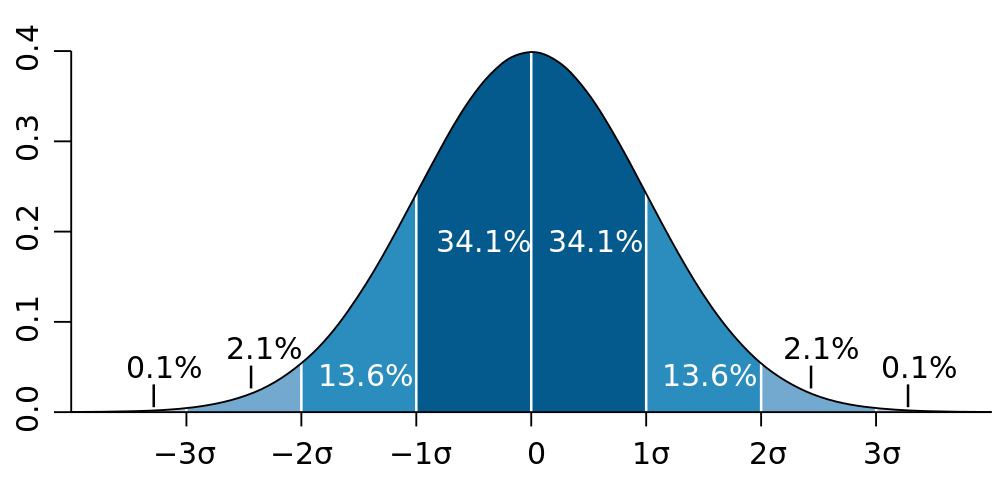
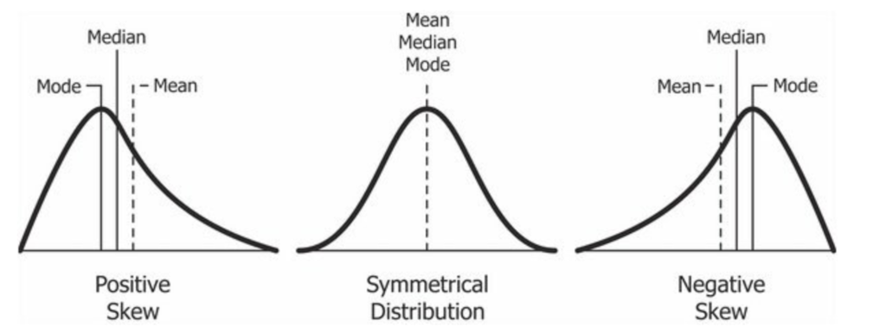
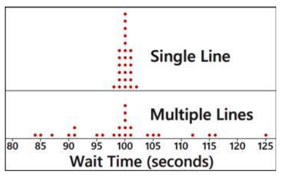

<!-- foo 
Highlighting
bold
strong
orange <b style="color:#d95f02"> text </b>
green  <b style="color:#1b9e77"> text </b>
purple <b style="color:#d24693"> text </b>
red    <b style="color:#FF0000"> text </b>
blue   <b style="color:#0000FF"> text </b>
-->

Mean and variance of a random variable
========================================================
date: 03/01/2021
autosize: true
incremental: true
width: 1920
height: 1080

<h2 style="text-align:left"> Instructions:</h2>

Use the left and right arrow keys to navigate the presentation forward and backward respectively.  You can also use the arrows at the bottom right of the screen to navigate with a mouse. 

<blockquote>
FAIR USE ACT DISCLAIMER: 
This site is for educational purposes only.  This website may contain copyrighted material, the use of which has not been specifically authorized by the copyright holders. The material is made available on this website as a way to advance teaching, and copyright-protected materials are used to the extent necessary to make this class function in a distance learning environment.  The Fair Use Copyright Disclaimer is under section 107 of the Copyright Act of 1976, allowance is made for “fair use” for purposes such as criticism, comment, news reporting, teaching, scholarship, education and research.
</blockquote>

========================================================

<h2>Outline</h2>

* The following topics will be covered in this lecture:

  * Mean, median and mode
  * Weighted mean
  * Mean of a frequency distribution
  * Mean of a probability distribution
  * Standard deviation
  * Variance

<!-- 3.2 -->

========================================================

## Motivation

* Our goal in this course is to use <b style="color:#d95f02">statistics</b> from a <b style="color:#d95f02">small, representative sample</b> to say something <b style="color:#1b9e77">general</b> about the <b style="color:#1b9e77">larger, unobservable population or phenomena</b>.</li>
  
* Recall, the measures of the <b style="color:#1b9e77">population</b> are what we referred to as <b style="color:#1b9e77">parameters</b>.

* <b style="color:#1b9e77">Parameters</b> are generally <strong>unknown and unknowable</strong>.</li>
   
   * For example, the <b style="color:#1b9e77">mean age of every adult</b> living in the United States is a <b style="color:#1b9e77">parameter</b> for the adult population of the USA.
    
   * We <strong>cannot possibly know this value exactly</strong> as there are people who cannot be surveyed and / or don't have accurate records.
   
   * If we have a <b style="color:#d95f02">representative sample</b> we can compute the <b style="color:#d95f02">sample mean</b>.
   
   * The <b style="color:#d95f02">sample  mean</b> will almost surely <b>not equal</b> <b style="color:#1b9e77">population mean</b>, due to the natural variation <b style="color:#d95f02">(sampling error)</b> that occurs in <b style="color:#d95f02">any given sample</b>.
   * However, if we have a good <strong>probabilistic model</strong> for the ages of adults, we can use the <b style="color:#d95f02">sample statistic</b> to estimate the general, unknown <b style="color:#1b9e77">population parameter</b>.
   
* <strong>Random variables</strong> and <strong>probability distributions</strong> give us the <b>model</b> for estimating <b style="color:#1b9e77">population parameters</b>.

* <b>Note:</b> we can only <b>"find"</b> the parameters exactly in <strong>very simple examples</strong> like games of chance.

* Generally, we will have to be satisfied with <b>estimates of the parameters</b> that are uncertain, but also <strong>include measures of "how uncertain"</strong>.

========================================================

## Characteristics of data

Courtesy of M. W. Toews <a href="https://creativecommons.org/licenses/by/2.5" target="blank">CC</a> via  
        <a href="https://commons.wikimedia.org/wiki/File:Standard_deviation_diagram.svg"> Wikimedia Commons</a>. 

<ul>
  <li>In statistics, we try to characterize data and populations by a number of the features that they exhibits.</li>
  <li>For a single variable, the most common measures are:</li>
  <ol>
    <li> <b>Center:</b> A representative value that indicates where the <strong>middle</strong> of the data set
is located.</li>
    <li> <b>Spread:</b> A measure of the amount that the data values <strong>vary around the center</strong>.</li>
  </ol>
</ul>

<ul>  
  <li>We will now recall some measures of center:</li>
  <ol>
    <li><b>mean</b>;</li>
    <li><b>median</b>; and</li>
    <li><b>mode</b>.</li>
    </ol>
    <li>Each of these usually gives a different view of where the "most central point" of the data lies.</li> 
</ul>

========================================================

## Mean

* The <b>(arithmetic sample) mean</b> is usually the most important measure of center.

* Suppose we have a sample of <strong>$n$ total measurements of some random variable $X$</strong>.

  * We will denote these measurements $x_1, x_2, \cdots, x_n$
  
* Then, the <b>(arithmetic sample) mean is defined</b>
  
  $$\text{Sample mean} = \overline{x} =  \frac{x_1  +x_2 +\cdots + x_n}{n}= \frac{\sum_{i=1}^n x_i}{n} $$
  
* <b>Q:</b> is the sample mean a <b style="color:#d95f02">statistic</b> or a <b style="color:#1b9e77">parameter</b>?

  * <b>A:</b> the  <b style="color:#d95f02">sample mean</b> is computed from  a <b style="color:#d95f02">sample</b> and thus is a <b style="color:#d95f02">statistic</b>.
  
  * For this reason, if we took <b style="color:#d95f02">new measurements from a new sample</b> of the <b style="color:#1b9e77">population</b>, we could get a different value.
  
  * <strong>The random difference between the <b style="color:#d95f02">sample mean</b> and the mean of the true <b style="color:#1b9e77">population mean</b> is called sampling error</strong>.
  
* An important property of the sample mean is that it <strong>tends to vary less over re-sampling than other statistics</strong>.

  * That is, it tends to stay close to the same value.
  
*  However, <strong>the sample mean is very sensitive to outliers</strong>.

  * If outliers exist in the data, the mean can be drawn far away from the "main" cluster of data. 
  
* A statistic is called <b>resistant</b> if it doesn't change very much with respect to outlier data.

========================================================

## Median and mode

<ul>
  <li> A different notion of center is the <strong>middle of the data</strong>.</li>
  <li> For a <strong>numerical measurement</strong>, we can always <strong>order the data</strong> so that we go from low to high or high to low.</li>
  <li> <b>Median</b> -- the median is the middle of the ordered data set.</li>
  <ul>
    <li> If there are an <b>odd number of measurements</b>, <strong>the median is defined as the middle value exactly</strong>.</li>
    <li> If there are an <b>even number of measurements</b>, we split the data into the lower $50\%$ and upper $50\%$ of the measurements;</li>
    <li> then we take the <strong>median to be the mean of</strong> the:</li>
    <ol>
      <li><b>largest of the lower $50\%$</b>; and</li>
      <li><b>smallest of the upper $50\%$</b>.</li>
    </ol>
  </ul>
  <li> Another notion of the most <strong>"central point"</strong> in the data can be the value that is <strong>measured most frequently</strong>.</li>
  <li> <b>Mode</b> -- the mode is the observed value that is most frequent in the data.</li>
</ul>

========================================================

## Differences in mean, median and mode

Courtesy of Diva Jain <a href="https://creativecommons.org/licenses/by-sa/4.0" target="blank">CC</a> via <a href="https://commons.wikimedia.org/wiki/File:Relationship_between_mean_and_median_under_different_skewness.png"> Wikimedia Commons</a>. 

<ul>
  <li>Usually, the mean, median and mode tell us different characteristics of what we call the "center" of the data.</li>
  <li>In the <strong>special case when data is normal, these coincide</strong>.</li>
  <li>In the left, we see data that is all uni-modal, but with three different cases.</li>
  <li>In the left case, we have right skewness:
  <ul>
    <li>Here, the mean and median are discplaced to the right away from the mode.</li>
    <li>Additionally, the mean and median do not match.</li>
  </ul>
</ul>

<ul>
  <li>In the right case, we have left skewness:</li>
  <ul>
    <li> In this case, the mean and the median are skewed to the left away from the mode.</li>
  </ul>
  <li><b>Note:</b> the precise location of the mean and median do not need to hold this way for all skew distributions -- <strong>this is only one example of how this can look</strong>  .</li>  
  <li>"Physically", the <strong>mean corresponds to the center of mass of the distribution</strong>, if each observation is weighted by the measurement value.</li>
  <li>Even if $50\%$ of values lie above and below the median, the <b>weights</b> of the observations can move the mean away from the median.</li>   
</ul>

========================================================

## Weighted means

* Let us suppose that we have a sample $x_1, x_2, \cdots, x_n$.

* Suppose each measurement is given a corresponding <b>weight</b> $w_i$ so that there are pairs of the form
 $$\begin{matrix} x_1 & w_1\\ x_2 & w_2 \\ \vdots & \vdots \\ x_n & w_n \end{matrix}$$
 
* We compute a <b>weighted mean</b> using the following formula,

  $$\frac{\sum_{i=1}^n x_i \times w_i}{\sum_i^n w_i} = \frac{x_1 \times w_1 + x_2 \times w_2 + \cdots + x_n \times w_n}{w_1 + w_2 + \cdots + w_n}$$  
 
 * i.e., <strong>this is the sum of the measurements times the weights, divided by the sum of the weights</strong> .

========================================================

### Weighted means example

* Let's suppose that we want to compute the grade point mean (GPA) for some student.

* We will suppose that the student gets letter grades as follows: $A, B, C, A, B$.

* The letters are given point values as $A=4.0, B=3.0, C=2.0, D=1.0$

* The GPA is <strong>computed as a weighted mean of the grade points, weighted by the number of credits for the class</strong>.

  $$\begin{matrix} A & 3 \text{ credits} \\ B & 2 \text{ credits}  \\ C & 2 \text{ credits} \\ A & 1 \text{ credit} \\ B & 3 \text{ credits} \end{matrix}$$

* <b>Q:</b> how do we compute the weighted mean in this case? What is the GPA? 

  * The <b>weighted mean</b> (GPA) is computed as,

 $$\frac{4.0 \times 3 + 3.0 \times 2 + 2.0 \times 2 + 4.0 \times 1 + 3.0 \times 3}{3 + 2 + 2 + 1 + 3}= \frac{35}{11} \approx 3.18$$

========================================================

## Calculating the mean from a frequency distribution

<ul>
 <li>Computing the mean from a <b>frequency distribution</b> for an experiment is very similar to computing a weighted mean.</li>
 <li>Let's suppose we have an experiment in which we flip two coins, and <b>$X$ represents the number of heads</b>.</li>
 <li>Then suppose, we replicate this experiment with 20 independent trials.</li>
 <ul>
  <li>In the right, we will suppose that this table represents the frequency of different outcomes of the experiment over the 20 replicated trials.</li>
</ul>

<table class="fragment">
<tr>
  <th> <strong>Outcome </strong></th> <th> <strong>Observed value for $X=x$</strong> </th> <th><strong>Frequency</strong></th></th>
</tr>
<tr>
<td> $\{H,H\}$ </td> <td>$x=2$</td> <td> $n=6$</td></tr>
<tr><td>$\{H,T\}$</td> <td>$x=1$</td> <td>$n=3$</td></tr>
<tr><td>$\{T,H\}$</td> <td>$x=1$</td> <td>$n=7$</td></tr>
<tr><td>$\{T,T\}$</td> <td>$x=0$</td> <td>$n=4$</td></tr>
</table>

<ul>
  <li>The formula to compute the <b>mean of a frequency distribution</b> is as follows:
  $$\text{Mean of a frequency distribution} = \frac{\sum_\text{Possible values} \text{(Observed value)} \times \text{(Frequency of observation)}}{\sum_\text{Possible values} \text{(Frequency of observation)}}.$$</li>
  <li>In the above table, we will denote $x=\text{Observed value}$ and $n=\text{Frequency}$.</li>
  <li>The formula thus becomes
  $$\text{Mean of a frequency distribution} = \frac{\sum_\text{Possible values} x \times n}{\sum_\text{Possible values} n}.$$</li>
  <li>For this frequency distribution, we thus get the equation
  $$\text{Mean of a frequency distribution} = \frac{2\times 6 + 1 \times 3 + 1\times 7 + 0 \times 4}{6+3+7+4} =\frac{22}{20}=1.1.$$</li>
  <li>Notice, this is very close to the number of heads we would expect in two coin flips if we <strong>averaged over infinite replications</strong>...</li>
</ul>

========================================================

## The mean of probability distributions

<ul>
  <li><b style="color:#d95f02">Frequency distributions are derived from samples</b>, and therefore the measures of frequency distributions are <b style="color:#d95f02">statistics</b>.</li>
  <ul>
    <li>In the last example, this was equivalent to computing the <b style="color:#d95f02">sample mean $\overline{x}$</b> of the random variable $X$.</li>
  </ul>
  <li>On the other hand, a <b style="color:#1b9e77">probability distribution represents the entire population</b>, where the population may be abstract.</li>
  </ul>

<table class="fragment">
<tr>
  <th> <strong>Outcome </strong></th> <th> <strong>Observed value for $X=x$</strong> </th> <th><strong>Probability</strong></th></th>
</tr>
<tr>
<td> $\{H,H\}$ </td> <td>$x=2$</td> <td> $f(x)=\frac{1}{4}$</td></tr>
<tr><td>$\{H,T\}, \{T,H\}$</td> <td>$x=1$</td> <td>$f(x)=\frac{2}{4}$</td></tr>
<tr><td>$\{T,T\}$</td> <td>$x=0$</td> <td>$f(x)=\frac{1}{4}$</td></tr>
</table>

<ul>
  <ul>
    <li>E.g., for the two coin flips, the probability distribution for $x$ represents the relative frequency of outcomes over the <b style="color:#1b9e77">population of all possible experiments or infinite replications</b>.</li> 
  <li>Therefore, if we compute the mean of $x$ for the probability distribution, we have the <b style="color:#1b9e77">population parameter $\mu$</b>.</li>
  </ul>
  <li>To compute the mean of the <b style="color:#1b9e77">probability distribution</b>, we follow a formula like the mean of a <b style="color:#d95f02">frequency disribution</b>.</li> 
  <ul>
    <li>Let $\{x_\alpha\}$ be the collection of all possible values for $x$ in its range $\mathbf{R}$.</li>
    <ul>
      <li>For a table as above, this corresponds to all row values in the middle.</li>
    </ul>
    <li>Let $\{P(X=x_\alpha)\}$ be all the associated probabilities for $x$ over its range of values $\mathbf{R}$.</li>
    <ul>
      <li>For a table as above, this corresponds to all row values in the right-hand-side.</li>
    </ul>
    <li>Then the <b style="color:#1b9e77">mean of the probability distribution</b> is given,
    $$\mu = \sum_{x_\alpha \in \mathbf{R}} x_\alpha P(X=x_\alpha) = \sum_{x_\alpha \in \mathbf{R}} x_\alpha f(x_\alpha)$$ </li>
  </ul>
</ul>

========================================================

### The mean of probability distributions continued

<ul>
  <li>Notice that the <b style="color:#1b9e77">mean of the probability distribution</b>
    $$\mu = \sum_{x_\alpha \in \mathbf{R}} x_\alpha P(X=x_\alpha) = \sum_{x_\alpha \in \mathbf{R}} x_\alpha f(x_\alpha)$$
    is really <strong>identical to the formula for the mean of a frequency distribution</strong>.</li>
    <ul>
      <li>Suppose there are $N$ total possibilities for the outcome of our experiment;</li>
      <li>suppose for each $x_\alpha$ in the range there are $n_\alpha$ total ways that $X$ can attain the value $x_\alpha$.</li>
      <li>If we look at the formula for the mean of a frequency distribution
      $$\begin{align}
       \frac{ \sum_{x_\alpha \in \mathbf{R}} x_\alpha \times n_\alpha}{\sum_{x_\alpha \in \mathbf{R}} n_\alpha}=   \frac{ \sum_{x_\alpha \in \mathbf{R}} x_\alpha \times n_\alpha}{N}
      =   \sum_{x_\alpha \in \mathbf{R}} x_\alpha \times \frac{ n_\alpha}{N}
      = \sum_{x_\alpha \in \mathbf{R}} x_\alpha P(X=x_\alpha) = \mu
      \end{align}$$</li>
    </ul>
  <li>Therefore, the formula is really the same, but the <strong>interpretation is different</strong> because we are dealing with <b style="color:#1b9e77">population values</b>.</li>
  <li>Because of the difference in the interpretation, the mean of a probability distribution has a special name:</li>
  <ul>
    <li>For a random variable $x$ with probability distribution defined by the pairs of values $\{x_\alpha\}$ and $P(X=x_\alpha)$, the <b style="color:#1b9e77">expected value of $x$</b> is defined,
    $$\mu = \mathbb{E}\left[X\right] = \sum_{x_\alpha \in \mathbf{R}} x_\alpha P(X=x_\alpha).$$</li>
    <li>We call the <b style="color:#1b9e77">mean of the probability distribution the expected value</b>, because it can be thought of as the <strong>theoretical mean if we repeated an experiment infinitely many times or sampled the entire population</strong>;</li>
    <li>we would <b>expect this value on average</b>, <strong>relative to infinitely many experiments</strong>.</li>  
  </ul>
</ul> 

========================================================

### Example of the expected value

<table class="fragment">
<tr>
  <th> <strong>Outcome </strong></th> <th> <strong>Observed value for $X=x$</strong> </th> <th><strong>Probability</strong></th></th>
</tr>
<tr>
<td> $\{H,H\}$ </td> <td>$x=2$</td> <td> $f(x)=\frac{1}{4}$</td></tr>
<tr><td>$\{H,T\}, \{T,H\}$</td> <td>$x=1$</td> <td>$f(x)=\frac{2}{4}$</td></tr>
<tr><td>$\{T,T\}$</td> <td>$x=0$</td> <td>$f(x)=\frac{1}{4}$</td></tr>
</table>

<ul>
<li>Let's consider the probability distribution for the two coin flipping experiment.</li>
<li>If we follow the calculation from the last slide
  $$\begin{align}
  \mu &= \mathbb{E}\left[X\right] \\
      &= \sum_{x_i} x_i \times P(X=x_i) \\
      &= \sum_{x_i} x_i \times f(x_i) \\
      &= 2 \times \frac{1}{4} + 1 \times \frac{2}{4} + 0 \times \frac{1}{4} \\
      &= 1
  \end{align}$$</li>
<li> Thus we say that the  <b style="color:#1b9e77">expected value</b> of two coin flips is to observe <b>one heads</b>.</li>

========================================================

## Basic concepts of variation

Courtesy of Mario Triola, <em>Essentials of Statistics</em>, 5th edition

<ul>
  <li>In the figure to the left, we examine the frequency of wait times in seconds at a bank to see a teller.</li>
  <li> On the top, the customers were fed into a single line to wait for an open teller among multiple tellers;</li>
  <li>on the bottom, customers are fed into one of multiple lines to see one an open teller at the front of the line.</li>
  <li>We note that both frequency plots have the <strong>same mean, median and mode of 100 seconds</strong>.</li>
  <li>If we only characterize data in terms of the <b>center</b> we actually don't have a very complete picture -- indeed, <strong>we can't distinguish the two scenarios by these statistics</strong> .</li>  
  <li>Particularly, the outcomes with multiple lines have much more <b>variation</b> than the outcomes with a single line.</li>
</ul>

<ul>
  <li>In this example, the bank actually chose to combine the multiple lines into a single line.</li>
  <li><b>Note:</b> this does not actually reduce the mean waiting time for customers.</li>
  <li>However, customers were happier with this option because the <strong>variability in waiting time was reduced</strong>.</li>
  <li>In practice, <strong>our statistics for variation / spread / dispersion of the data can be the most important statistics</strong>.</li> 
  <li>We will study <b>range</b>, <b>standard deviation</b> and <b>variance</b> to quantify this.</li>
</ul>

========================================================

## Standard deviation

<ul>
  <li><b>Standard deviation</b> is probably the most important measure of the spread of data.</li>
  <li>Suppose that we have a sample $x_1,x_2,\cdots, x_n$, and let us denote the <b style="color:#d95f02">sample mean</b> as
  $$\overline{x} = \frac{\sum_{i=1}^n x_i}{n}.$$</li>
  <li>Then, the <b style="color:#d95f02">sample standard deviation</b> denoted $s$ is defined as,
  $$s = \sqrt{\frac{\sum_{i=1}^n\left(x_i - \overline{x}\right)^2}{n-1}}$$</li>
  <li>This formula can be understood as follows:</li>
  <ul>
    <li>In each term of the sum $\sum_{i=1}^n\left({\color{blue} {x_i - \overline{x}}} \right)^{\color{red}2}$, we see <b style="color:blue">how much measurement $i$ deviates from the sample mean</b>.</li>
    <li>The <b style="color:red">square</b> in this equation keeps the quantity positive.</li>
    <li>The numerator thus gives <strong>the total sum of square differences of each sample value from the sample mean</strong>.</li>
    <li>The denominator divides by the number of total sample size minus one;</li>
    <ul>
      <li>there are good mathematical reasons for this, but for now we will say that we take an average over $n-1$ because the <strong>sample mean required one calculation of a statistic of the samples already</strong>. </li>
    </ul>
    <li>Finally, we take a square root to make the standard deviation in the same units as the variable $x$;</li>
    <ul>
      <li>without this, the standard deviation would still be in the units squared.</li>  
    </ul>
  </ul>
</ul>

========================================================

### Standard deviation continued

* Note, we could have considered a different way to measure the variation than standard deviation.

* Consider, if we want to measure the total deviation we could instead write this as,
 
  $$\sum_{i=1}^n \vert x_i - \overline{x}\vert $$
  
* We could then divide this by the total number of observations, which gives

  $$\text{Mean absolute deviation} = \frac{\sum_{i=1}^n \vert x_i - \overline{x}\vert}{n-1} $$

* This is a possible choice for a similar measure of the variation, but the main issue lies in that the absolute value is not an "algebraic operation".

* If we want to make calculations or inferences based on the formula above, this will become very difficult and there are few tools that work well with this statistic.

* For this reason, using the square as in the <b style="color:#d95f02">sample standard deviation</b> 
 
 $$s = \sqrt{\frac{\sum_{i=1}^n\left(x_i - \overline{x}\right)^2}{n-1}}$$
 
 we get a similar result, but one that is mathematically easier to manipulate.

========================================================

### Standard deviation continued

<ul>
  <li><b>Note</b> -- the <b style="color:#d95f02">sample standard deviation</b>  can be computed equivalently as follows.</li>
  <li> Supposing again that we have a sample $x_1, \cdots, x_n$, we can compute
  $$s = \sqrt{\frac{n \left(\sum_{i=1}^n x_i^2 \right) - \left(\sum_{i=1}^n x_i\right)^2}{n\left(n-1\right)}}$$</li>
  <li>This formula is totally equivalent to the last one and just requires some algebraic manipulation to show that this is the case.</li>
  <li>Often, the above calculation is preferable because we do not need to pre-compute the sample mean.</li>
  <li>This is also the form that is usually preferred for computer software calculation of the sample standard deviation.</li> 
  <li>We should note, the <b style="color:#d95f02">sample standard deviation is a statistic</b> because it is computed from samples.</li>
  <li>We can also consider the <b style="color:#1b9e77">population standard deviation</b>.</li>
  <li>Suppose that there are $N$ total members in the <b style="color:#1b9e77">population</b> with corresponding measurement values $x_1 ,\cdots, x_N$.</li>
  <li>If we had access to the entire population, could compute the <b style="color:#1b9e77">population mean</b> as
  $$\text{Population mean} = \mu = \frac{\sum_{i=1}^N x_i }{N}.$$</li>
  <li>With respect to the <b style="color:#1b9e77">population mean $\mu$</b> the <b style="color:#1b9e77">population standard deviation</b> is given as,
  $$\text{Population standard deviation} = \sigma = \sqrt{\frac{\sum_{i=1}^N \left(x_i - \mu\right)^2}{N}}.$$
</ul>

========================================================

### Standard deviation continued

<ul>
  <li>Usually, we will not have access to the entire <b style="color:#1b9e77">population</b> $x_1, \cdots, x_N$.</li>
  <li>Instead, we will only have some <b style="color:#d95f02">smaller subset of values in a sample</b> $x_1, \cdots, x_n$ for $n< N$.</li>
  <li>Therefore, the formulas which we use most often are,
  $$s = \sqrt{\frac{\sum_{i=1}^n\left(x_i - \overline{x}\right)^2}{n-1}}$$</li>
  <li>or
  $$s = \sqrt{\frac{n \left(\sum_{i=1}^n x_i^2 \right) - \left(\sum_{i=1}^n x_i\right)^2}{n\left(n-1\right)}}$$</li>
  <li>but not 
  $$\sigma = \sqrt{\frac{\sum_{i=1}^N \left(x_i - \mu\right)^2}{N}}.$$
  </li>
  <li>One key difference to remember is that for the <b style="color:#d95f02">sample standard deviation</b>, we have a very different denominator than with the <b style="color:#1b9e77">population standard deviation</b>.</li>
</ul>

========================================================

### Standard deviation example

* We will not focus on calculating the sample standard deviation manually in this course;

 * however, to demonstrate the concept, we will consider it once here.
 
* Suppose we have the sample $22, 22, 26$ and  $24$.  

* We wish to compute how much deviation there is in the data from the <b style="color:#d95f02">sample mean</b>, so we will begin by computing this value

  $$\overline{x} = \frac{22 + 22 + 26 + 24 }{4} = \frac{94}{4}=23.5$$

* We now compute the <strong>raw deviation</strong> of each sample from the <b style="color:#d95f02">sample mean</b>:

  $$\begin{align}
  x_1 - \overline{x} =& 22 - 23.5 = -1.5\\
  x_2 - \overline{x} =& 22 - 23.5 = -1.5\\
  x_3 - \overline{x} =& 26 - 23.5 = 2.5\\
  x_4 - \overline{x} =& 24 - 23.5 = 0.5\\
  \end{align}$$

* Squaring each value, we obtain $2.25, 2.25, 6.25, 0.25$, so that

  $$s = \sqrt{\frac{\sum_{i=1}^4 \left(x_i - \overline{x}\right)^2}{3}} = \sqrt{\frac{11}{3}}\approx 1.9$$
  
* This shows how the <b style="color:#d95f02">sample standard deviation</b> can be computed, but we will want a few ways to interpret the value.

========================================================

## Variance

* The word <b>variance</b> also has a specific meaning in statistics and is another tool for describing the variation / dispersion / spread of the data.

* Suppose that the data has a <b style="color:#1b9e77">population standard deviation of $\sigma$</b> and a <b style="color:#d95f02">sample standard deviation of $s$</b>.

* Then, the data has a <b style="color:#1b9e77">population variance of $\sigma^2$</b>.

* Likewise, the data has a  <b style="color:#d95f02">sample variance of $s^2$</b>.

* Therefore, for either a <b style="color:#1b9e77">population parameter</b> or a <b style="color:#d95f02">sample statistic</b>, the <strong>variance is the square of the standard deviation</strong>. 

  * Because of this, the variance has units which are the <strong>square of the original units</strong>.
  
* For example, measuring the heights of students in inches, the <strong>standard deviation is in the units inches</strong>.

  * However, the <strong>variance is in the unit $\text{inches}^2$</strong>.
  

========================================================

## Important properties of standard deviation and variance

<ul>
  <li>We should introduce a few key properties of the standard deviation and the variance:</li>
  <ol>
    <li><b>Standard deviation</b> and <b>variance</b> are always <strong>non-negative by construction</strong>.
    $$\begin{align}
    s &= \sqrt{\frac{\sum_{i=1}^n \left(x_i - \overline{x}\right)^2}{n-1}} \\
    \sigma & = \sqrt{\frac{\sum_{i=1}^N \left(x_i - \mu\right )^2}{N}}
    \end{align}$$
    </li>
    <li><b>Standard deviation</b> and <b>variance</b> are only zero when all values are equal and <strong>larger values means there is more spread in the data</strong>.</li>
    <li>However, the size of the <b>standard deviation</b> and <b>variance</b> is also <strong>sensitive to outliers</strong>, and they can become large with a few outliers present.</li> 
    <li>The <b style="color:#d95f02">sample variance</b> is an <b>unbiased estimator</b> of the <b style="color:#1b9e77">population variance</b>.</li>
    <ul>  
      <li>Sampling error will mean that we <b>usually do not have a <b style="color:#d95f02">sample variance</b> that is equal to the <b style="color:#1b9e77">population variance</b></b>.</li>
      <li>However, <strong>over all possible samples this should usually be close to the true value</strong>.</li>
    </ul>
    <li>The <b style="color:#d95f02">sample standard deviation</b> is a <strong>biased estimator</strong> of the <b style="color:#1b9e77">population standard deviation</b>.</li>
    <ul>
      <li>Over repeated resampling, the different estimates for the <b style="color:#1b9e77">population standard deviation</b> via the <b style="color:#d95f02">sample standard deviation</b> <strong>tend to be too small</strong>.</li> 
      <li>However, for large sample sizes this bias of the sample standard deviation often being too small won't have much practical effect.</li>
    </ul>
  </ol>
</ul>

========================================================

## The empirical (68-95-99.7) rule

Courtesy of Melikamp <a href="https://creativecommons.org/licenses/by/2.5" target="blank">CC</a> via  <a href=" https://commons.wikimedia.org/wiki/File:Empirical_rule_histogram.svg"> Wikimedia Commons</a>

<ul>
  <li>Recall now the bell curve picture that we often consider -- we will suppose we have a population that is distributed as a bell shape.</li>
  <li>We suppose that the <b style="color:#1b9e77">population mean is $\mu$</b> and <b style="color:#1b9e77">population standard deviation $\sigma$</b>.</li>
  <li>We suppose that the histogram represents the <b style="color:#d95f02">sample data</b> which is mostly bell-shaped, but is smaller than the population so it is not exact.</li>
  <li>The <b>empirical rule</b> is as follows:</li>
  <ul>
    <li>Approximately $68\%$ of the <b style="color:#d95f02">sample data</b> will lie within <b style="color:#1b9e77">one standard deviation $\sigma$ of the population mean $\mu$</b>, i.e., in
    $$[\mu - \sigma, \mu + \sigma].$$
    </li>
    <li>Approximately $95\%$ of <b style="color:#d95f02">sample data</b> will lie within <b style="color:#1b9e77">two standard deviations $2\sigma$ of the population mean $\mu$</b>, i.e., in
    $$[\mu - 2\sigma, \mu + 2\sigma].$$</li>
    <li>Approximately $99.7\%$ of <b style="color:#d95f02">sample data</b> will lie within <b style="color:#1b9e77">three standard deviations $3\sigma$ of the population mean $\mu$</b>, i.e., in
    $$[\mu - 3\sigma, \mu + 3\sigma].$$</li>  
  </ul>
</ul>

<ul>  
  <li>This tells us that for <b>normal data</b>, the <strong>spread can be easily interpreted from the standard deviation</strong>.</li> 
</ul>

