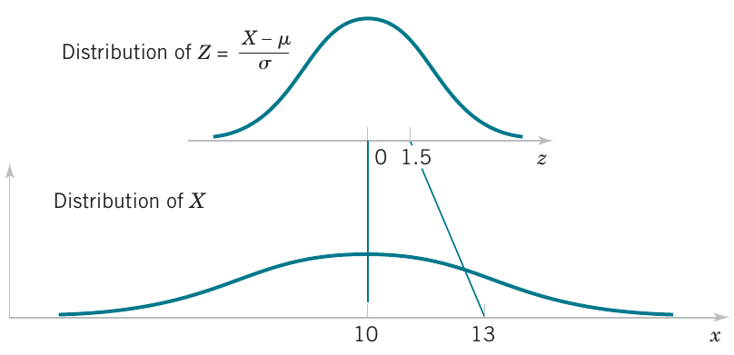
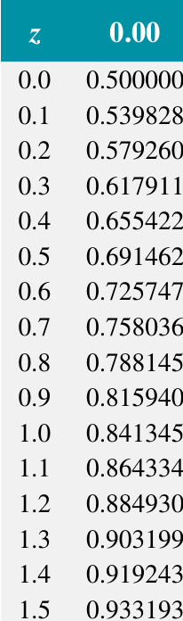

<!-- foo 
Highlighting
bold
strong
orange <b style="color:#d95f02"> text </b>
green  <b style="color:#1b9e77"> text </b>
purple <b style="color:#d24693"> text </b>
red    <b style="color:#FF0000"> text </b>
blue   <b style="color:#0000FF"> text </b>
-->

Continuous uniform and normal distributions
========================================================
date: 03/15/2021
autosize: true
incremental: true
width: 1920
height: 1080

<h2 style="text-align:left"> Instructions:</h2>

Use the left and right arrow keys to navigate the presentation forward and backward respectively.  You can also use the arrows at the bottom right of the screen to navigate with a mouse. 

<blockquote>
FAIR USE ACT DISCLAIMER: 
This site is for educational purposes only.  This website may contain copyrighted material, the use of which has not been specifically authorized by the copyright holders. The material is made available on this website as a way to advance teaching, and copyright-protected materials are used to the extent necessary to make this class function in a distance learning environment.  The Fair Use Copyright Disclaimer is under section 107 of the Copyright Act of 1976, allowance is made for “fair use” for purposes such as criticism, comment, news reporting, teaching, scholarship, education and research.
</blockquote>

========================================================

<h2>Outline</h2>

* The following topics will be covered in this lecture:

  * Review of continuous distributions and their parameters
  * Continuous uniform distribution
  * Normal distribution
  * Standard normal distribution
  * Standardizing normal variables to compute z-scores
  
========================================================

## Review of main concepts

* For a continuous random variable, the concepts from discrete random variables have direct analogs.

* We have the following correspondences

<table class="fragment">
<tr>
  <th> <strong>Discrete </strong></th> <th> <strong>Continuous</strong> </th>
</tr>
<tr>
  <td> Probability mass function $f(x)$ </td> <td> Probability density function $f(x)$</td>
</tr>
<tr>
  <td> $P(X=x_\alpha) = f(x_\alpha)$ </td> <td>$P(a \leq X \leq b) = \int_{a}^b f(x)\mathrm{d}x$</td> 
</tr>
<tr>
  <td>Cumulative distribution function $F(x)=P(X\leq x)$ </td> <td>Cumulative distribution function $F(X)=P(X\leq x)$</td>
</tr>
<tr>
  <td> $F(x) = \sum_{x_\alpha \in \mathbf{R}} f(x_\alpha)$ </td><td> $F(x) = \int_{x\in \mathbb{R}}f(x)\mathrm{d}x$</td>
</tr>
<tr>
  <td> $\mu = \sum_{x_\alpha \in \mathbf{R}} xf(x_\alpha)$ </td><td> $\mu = \int_{x\in \mathbb{R}} x f(x)\mathrm{d}x$</td>
</tr>
<tr>
  <td> $\sigma^2 = \sum_{x_\alpha \in \mathbf{R}}(x - \mu)^2 f(x_\alpha)$ </td><td> $\sigma^2 = \int_{x\in \mathbb{R}}( x -\mu)^2 f(x)\mathrm{d}x$</td>
</tr>
</table>

* Due to the difference between discrete measurements and continuous measurements (where we can arbitrarily sub-divide units) <strong>the probability of measuring a single value of a continuous random variable always has probability zero</strong>.

* Particularly, with continuous random variables, we always define probabilities over ranges of values, assuming some kind of truncation approximation.

* Otherwise the ideas are extremely similar by replacing sums with integrals (or Riemann sums).

* We will now consider two very common continuous probability distributions.

========================================================

## Continuous uniform disribution

* Let's recall the copper current example from the last lecture. 

* The random variable $X$ has a probability density defined as
  
  $$\begin{align}
  f(x) = \begin{cases}
  5.0 & x\in[4.9, 5.1]\\
  0.0 & \text{else}
  \end{cases}
  \end{align}$$</li>
  
* Similarly we found that the cumulative distribution function is given by

  $$\begin{align}
  F(x)&= \begin{cases}
       0.0 & x \in(-\infty, 4.9)\\
       5.0\left(x - 4.9\right) & x \in[4.9, 5.1]\\
       1.0 & x \in (5.1,\infty)
       \end{cases}
  \end{align}$$

* The above is actually a specific example of the general continuous uniform probability distribution.

* The continuous uniform is the probability model for a continuous random variable in which we assign <b>equal probability</b> to any <strong>sub-interval of equal length that lies in the range</strong>.

* For example, in the above, we can see that 
  
  $$\begin{align}
  P(X\in [4.9,5.0]) = 0.5; & &
  P(X\in [5.0,5.1]) = 0.5.
  \end{align}$$

* More generally, a simple $\text{height}\times \text{width}$ area argument shows that for any $a,b\in[4.9,5.1]$,
  
  $$\begin{align}
  b-a=0.1 & & \Rightarrow & & P(X\in[a,b]) = 0.5.
  \end{align}$$

========================================================

### Continuous uniform disribution continued

<ul>
  <li>More generally we have the general form of the continuous uniform distribution given as follows.</li>
  <li style="list-style-type:none;"><blockquote>Let $b>a$ be real numbers. A continuous random variable $X$ with the probability density function
  $$\begin{align}
  f(x) = 
  \begin{cases}
  \frac{1}{b-a} & x \in[a,b]\\
  0 & \text{else}
  \end{cases}\end{align}$$
  is a <b>continuous uniform random variable</b>.
  </blockquote></li>
  <li>Notice that the above construction guarantees that the area under the density curve is exactly equal to one -- the graph is pictured right.</li>
</ul>

Courtesy of Montgomery & Runger, <em>Applied Statistics and Probability for Engineers</em>, 7th edition

<ul>
  <li>I.e., the area is compatible with our understanding of the total probability being equal to one:
  $$\begin{align}
  \text{height}\times\text{width} = \frac{1}{b-a}\times \left(b-a\right) = 1
  \end{align}$$</li>
  <li>We often denote the range $[a,b]$ as the <b>support of the distribution</b>, i.e., the <strong>range in which the density is non-zero</strong>.
  <li>Outside of the range $[a,b]$, we say that there is no support for the probability as the probability of $X$ lying outside of the range $[a,b]$ is always zero.</li>
</ul>

========================================================

### Continuous uniform disribution continued

* The simple form of the continuous uniform distribution makes it easy to compute some key parameters.

* For example,

  $$\begin{align}
  \mu &= \int_{-\infty}^\infty xf(x) \mathrm{d}x \\
      &= \int_{a}^b \frac{x}{b-a} \mathrm{d}x \\
      &= \frac{x^2}{2(b-a)}\big\vert_{a}^b\\
      &= \frac{b^2 - a^2}{2(b-a)}
  \end{align}$$
  
* But recall that we can factor
  
  $$b^2 - a^2 = (b+a)(b-a)$$
  such that
  
  $$\mu = \frac{b+a}{2}.$$
  
* This corresponds once again to that the mean or expected value is the center of mass / average of the endpoints.

========================================================

### Continuous uniform disribution continued

* Noting that $\mu=\frac{b+a}{2}$, we can similarly obtain the variance as

  $$\begin{align}
  \sigma^2 &= \int_{-\infty}^\infty (x - \mu)^2 f(x)\mathrm{d}x \\
  &= \int_{a}^b \frac{\left(x - \frac{b+a}{2}\right)^2}{b-a}\mathrm{d}x \\
  \end{align}$$
  
* Recall, we can make a substitution as $u = x - \frac{b+a}{2}$ such that $du=dx$ and the range of integration is adjusted as

  $$\begin{align}
  u_\text{lower} =  a - \frac{b+a}{2} = \frac{a - b}{2}& & 
  u_\text{upper} =  b - \frac{b+a}{2} = \frac{b-a}{2}
  \end{align}$$
  
* This results in,

  $$\begin{align}
  \sigma^2 = \int_{\frac{a-b}{2}}^{\frac{b-a}{2}} \frac{u^2}{b-a}\mathrm{d}u = \frac{u^3}{3(b-a)}\big\vert_\frac{a-b}{2}^\frac{b-a}{2}
  \end{align}$$
  
* Notice that the cubic term has the property that $-(a-b)^3 = (b-a)^3$, such that
  
  $$\begin{align}
  \sigma^2 &= \frac{(b-a)^3}{8\times3(b-a)}  - \frac{(a-b)^3}{8\times3(b-a)} = \frac{(b-a)^2}{12}
  \end{align}$$

========================================================

### Continuous uniform disribution continued

* Finally, we can generally compute the cumulative distribution function of the continuous uniform as

  $$\begin{align}
  F(x) &= \int_{a}^x \frac{1}{b-a} \mathrm{d}u  \\
       &= \frac{u}{b-a} \big\vert_{a}^x  \\
       &= \frac{x - a}{b-a}
  \end{align}$$
  where $x \in[a,b]$.
  
* Therefore, the general form is
  
  $$\begin{align}
  F(x) = 
  \begin{cases}
  0 & x \in(-\infty, a) \\
  \frac{x-a}{b-a} & x \in [a,b]\\
  1 & x \in [b,\infty)
  \end{cases}
  \end{align}$$

========================================================

## The normal distribution

Courtesy of Melikamp <a href="https://creativecommons.org/licenses/by/2.5" target="blank">CC</a> via  <a href=" https://commons.wikimedia.org/wiki/File:Empirical_rule_histogram.svg"> Wikimedia Commons</a>

<ul>
 <li>The most widely used model for a continuous measurement is a <b>normal random variable</b>. 
 <li>Whenever a random experiment is replicated, the <strong>average result over the replicates</strong> tends to have a <b>normal distribution</b> as the number of replicates becomes large.</li>
 <li>De Moivre presented this fundamental result, known as the central limit theorem, in 1733.</li>
 <li>Unfortunately this was lost for some time, and Gauss independently developed a normal distribution 100 years later.</li>
 <li>Although De Moivre was later credited with the derivation, a normal distribution is also referred to as a Gaussian distribution.</li>
 <li>The <b>central limit theorem</b> is the basis for <strong>classical statistical inference</strong>.</li> 
 <li>Using this, we can use this model to <b style="color:#1b9e77">infer general properties of a population</b> from <b style="color:#d95f02">representative samples</b>.</li>
 <li>For example, an automotive engineer may plan a study to average pull-off force measurements from several connectors.</li>
 <li>If we assume that each measurement results from a replicate of a random experiment,</li>
</ul>

<ul>
 <li>then, the normal distribution can be used to make approximate conclusions about the average pulloff force for all connectors of this design.</li>
</ul>

========================================================

### The normal distribution continued

* Furthermore, sometimes the central limit theorem is less obvious. 

* For example, assume that the deviation (or error) in the length of a machined part is the sum of a large number
of infinitesimal effects, e.g., 

  * such as temperature and humidity drifts, 
  * vibrations, 
  * cutting angle variations, 
  * cutting tool wear, 
  * bearing wear, 
  * rotational speed variations, 
  * mounting and fixture variations, 
  * variations in numerous raw material characteristics, and 
  * variations in levels of contamination. 
  
* If the component errors are independent and equally likely to be positive or
negative, the total error can be shown to have an <b>approximate normal distribution</b>. 

* Furthermore, the normal distribution arises in the study of numerous basic physical phenomena. 

* For example, physicist James Maxwell developed a normal distribution from simple assumptions regarding the velocities of molecules.

========================================================

### The normal distribution continued

<ul>
  <li>Unlike how we defined the density and used this to compute $\mu$ and $\sigma$ for the uniform, we will reverse this for the normal.</li>
  <li>That is, we will use $\mu$ and $\sigma$ to define the density of the normal and <strong>parametrize the distribution</strong>.</li>
  <li> Let us use the following notation for compactness where
    $$\exp(x) = e^{x}.$$</li>
  <li style="list-style-type:none;"><blockquote>Let the <b>normal random variable</b> $X$ have mean $\mu$ and standard deviation $\sigma$. The probability density function is given as
  $$\begin{align}
  f(x) = \frac{1}{\sqrt{2\pi}\sigma}\exp\left(-\frac{\left(x - \mu\right)^2}{2\sigma^2}\right)
  \end{align}$$
  </blockquote></li>
  <li>Recall how we considered $\mu$ to be a measure of center and $\sigma$ a measure of spread.</li>
  <li>If we vary these two values, we can change the center of mass and the spread of the normal distribution:</li>
</ul>

Courtesy of Montgomery & Runger, <em>Applied Statistics and Probability for Engineers</em>, 7th edition

<ul>
  <li>A key point to note, however, is regardless of the shape, $f(x)>0$ for all $x\in \mathbb{R}$.</li>
</ul>

========================================================

### The normal distribution continued

<ul>
  <li>At the same time, while every interval has non-zero probability with the normal distribution;</li>
</ul>

Courtesy of Montgomery & Runger, <em>Applied Statistics and Probability for Engineers</em>, 7th edition

<ul>
  <li>the empirical rule tells us that the probability becomes extremely small beyond three standard deviations from the mean.</li>
  <li>In particular:</li>
  <ul>
    <li>$\approx 68\%$ of the population lies within one standard deviation of the mean, $[\mu - \sigma, \mu+\sigma]$;</li>
    <li>$\approx 95\%$ of the population lies within two standard deviations of the mean, $[\mu - 2 \sigma , \mu + 2 \sigma]$</li>
    <li>$\approx 99.7%$ of the population lies within three standard deviations of the mean, $[\mu - 3 \sigma, \mu + 3 \sigma]$.
  </ul>
</ul>

<ul>
  <li>We can understand this by the form of the Gaussian density equation, where the term
  $$\begin{align}
  \exp\left(-\frac{\left(x - \mu\right)^2}{2\sigma^2}\right)
  \end{align}$$
  shrinks at a super-exponential rate as $x$ deviates from $\mu$, relative to the size of $\sigma$.</li>
  <li>This has a limiting property where
  $$\lim_{x \rightarrow \pm \infty} \exp\left(-\frac{\left(x - \mu\right)^2}{2\sigma^2}\right) = 0$$
  but this is positive for any finite value $x$.</li>
</ul>

========================================================

## The standard normal distribution

* A special normal distribution that is commonly used for calculations is the <b>standard normal</b>.

  <li style="list-style-type:none;"><blockquote>The <b>standard normal random variable</b> $Z$ has mean $\mu=0$ and standard deviation $\sigma=1$. The probability density function is therefore given as
  $$\begin{align}
  f(z) = \frac{1}{\sqrt{2\pi}}\exp\left(-\frac{z^2}{2}\right).
  \end{align}$$
  We denote the cumulative distribution function of the standard normal $\Phi(z)=P(Z\leq z)$.
  </blockquote></li>

* The primary reason that the standard normal is often used in practice is because of the following result:

  <li style="list-style-type:none;"><blockquote>Let the <b>normal random variable</b> $X$ have mean $\mu$ and standard deviation $\sigma$. The random variable defined
  $$Z = \frac{X - \mu}{\sigma}$$
  <strong>follows the standard normal distribution above</strong>.
  </blockquote></li>

* This says that for <b>any normal random variable</b> $X$, if we shift the center to zero $X - \mu$;
  
* and re-scale the spread to one

  $$ Z=\frac{X - \mu}{\sigma};$$
  
* <strong>we can model the population with the easier-to-compute standard normal</strong>.

========================================================

### The standard normal distribution continued

* The previous technique is known as <b>standardizing a normal variable</b>.

* Because it is simple to standardize a variable, this technique was widely used before computers to calculate normal probabilities.

* Specifically, if one has a normal model for the population $X$ with mean $\mu$ and $\sigma$, this says,

  $$\begin{align}
  X \leq x &&\Leftrightarrow && X - \mu \leq x - \mu && \Leftrightarrow && \frac{X - \mu}{\sigma} \leq \frac{x -\mu}{\sigma} & & Z \leq z
  \end{align}$$
  
* Therefore,

  $$\begin{align}
  P(X\leq x) = P(Z\leq z) 
  \end{align}$$
  and this holds for all other ranges.
  
* Note, this argument doesn't work for every distribution.

* It is a special property of the normal that we can <strong>shift the center and scale the spread and the distribution remains normal</strong>.

* This is one of several very special properties of this model.

========================================================

### The standard normal distribution continued

* Because we standardize normal variables, the standard normal table for "z-scores" is a long used tool in statistics.

* Rather than compute the probability for every normal variable individually, traditional statistics used a table for the standard normal to compute probabilities by standardizing the general normal variable.

<li style="list-style-type:none;"><blockquote>Let $x$ be a measurement of a <b>normal random variable</b> $X$, which has mean $\mu=0$ and standard deviation $\sigma=1$. The <b>z-score</b> of the measurement is
  $$\begin{align}
  \frac{z-\mu}{\sigma}
  \end{align}$$
  which <strong>measures how many standard deviations</strong> $\sigma$ the measurement lies from the mean $\mu$ in the positive or negative direction.
  </blockquote></li>

* For our homework and the second midterm, we will practice the traditional approach using z-scores.

* However, after the second midterm, we will focus on the modern approach using computer languages to make all such calculations.

========================================================

## Computing z-scores from tables

<ul>
  <li>To the right is a traditional z-score table.</li>
  <li>In the rows, we can find a $z$ value to the tenth decimal place.</li>
  <li>In the columns, we can add values to the hundredth decimal place.</li>
  <li>For example, if we want to compute the value
  $$P(Z\leq 0.12)$$
  this value can be found precisely in <b>first row</b> and <b>third column</b>.</li>
  <li>For an arbitrary value $z$, we can thus compute the probability
  $$P(Z\leq z)$$
  by finding a close approximation $\tilde{z}\approx z$ up to rounding error and take the value in the table.</li>
  <li>For an arbitrary range of values $z_1 \leq Z \leq z_2$, we can find $\tilde{z}_1 \approx z_1$ and $\tilde{z}_2 \approx z_2$ as above and find the probability as
  $$\begin{align}
  P(z_1 \leq Z\leq z_2) &= P(Z\leq z_2) - P(Z\leq z_1) \\
  &\approx P(Z\leq \tilde{z}_2) - P(Z\leq \tilde{z}_1)
  \end{align}$$
  </li>
  <li>The calculation then just requires finding the values $P(Z\leq \tilde{z}_2)$ and $P(Z\leq \tilde{z}_1)$ in the appropriate row and column of the table.</li>
</ul>

Courtesy of Montgomery & Runger, <em>Applied Statistics and Probability for Engineers</em>, 7th edition

========================================================

### Computing z-scores from tables example

<ul>
  <li>Suppose that the current measurements in a strip of wire are assumed to follow a normal distribution with a mean of 10 milliamperes and a variance of 4 (milliamperes)
  <li>We will compute the probability that a measurement exceeds 13 milliamperes.</li>
  <li>Let $X$ denote the current in milliamperes. 
  <li>The probability can be represented as $P(X > 13)$.</li> 
  <li>Let $Z = \frac{X − 10}{2}$ -- the relationship is shown to the right:</li>
</ul>

<ul>
  <li>The probability that we are to look for in the table is given by
  $$P(X>13) = P(Z>1.5)$$
  so that we want to find $\Phi(1.5)= P(Z\leq 1.5)$ in the table.
</ul>

Courtesy of Montgomery & Runger, <em>Applied Statistics and Probability for Engineers</em>, 7th edition

<ul>
  <li>The corresponding calculation is thus given as
  $$\begin{align}
  P(X>13) &= 1 - P(X\leq 13)\\
  &=1 - P(Z\leq 1.5)\\
  &=1 - 0.93319 = 0.06681
  \end{align}$$</li>
  <li>We will have similar calculations in the homework and the second midterm, but after this we will focus on the modern approach.</li>
</ul>

