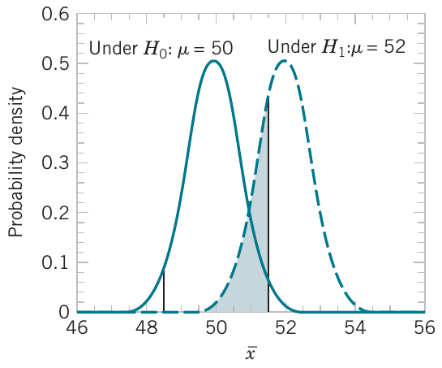

<style>
.section .reveal .state-background {
   background: #ffffff;
}
.section .reveal h1,
.section .reveal h2,
.section .reveal p {
   color: black;
   margin-top: 50px;
   text-align: center;
}
</style>
<!-- foo 
Highlighting
bold
strong
orange <b style="color:#d95f02"> text </b>
green  <b style="color:#1b9e77"> text </b>
purple <b style="color:#d24693"> text </b>
red    <b style="color:#FF0000"> text </b>
blue   <b style="color:#0000FF"> text </b>
-->

Confidence intervals and an introduction to hypothesis testing
========================================================
date: 04/14/2021
autosize: true
incremental: true
width: 1920
height: 1080

<h2 style="text-align:left"> Instructions:</h2>
<p style='text-align:left'>Use the left and right arrow keys to navigate the presentation forward and backward respectively.  You can also use the arrows at the bottom right of the screen to navigate with a mouse.<br></p>

<blockquote>
FAIR USE ACT DISCLAIMER:</br>
This site is for educational purposes only.  This website may contain copyrighted material, the use of which has not been specifically authorized by the copyright holders. The material is made available on this website as a way to advance teaching, and copyright-protected materials are used to the extent necessary to make this class function in a distance learning environment.  The Fair Use Copyright Disclaimer is under section 107 of the Copyright Act of 1976, allowance is made for “fair use” for purposes such as criticism, comment, news reporting, teaching, scholarship, education and research.
</blockquote>


========================================================

<h2>Outline</h2>

* The following topics will be covered in this lecture:

  * Confidence intervals for the mean, with unknown population standard deviation
    * Large sample size
    * Student t distribution
    * Student t confidence intervals
    * Student t confidence intervals with real-life methods
  * An introduction to hypothesis testing
    * Statistical hypotheses
    * The null and alternative hypothesis
    * Two-sided versus one-sided hypothesis tests
    * Decision criteria for hypothesis testing
    * Duality with confidence intervals
    * Types of errors
    * Power of statistical tests

========================================================

## Confidence intervals, variance unknown

* In practice, we almost never know the true population standard deviation $\sigma$ and we must use the sample standard deviation $s$ as a point estimate.

* Our <b>standard error estimate</b> is $\hat{\sigma}_\overline{X}= \frac{s}{\sqrt{n}}$, and this will be utilized for a <strong>more general construction of confidence intervals</strong>.


* If we have a large sample size, with $n>40$, we can use this estimate of the standard error effectively within the confidence interval as follows.

<blockquote>
  <b>Large-Sample Confidence Interval on the Mean</b><br>
  When n is large, the quantity
  $$\frac{\overline{X} - \mu}{\frac{s}{\sqrt{n}}}$$
  has an approximate standard normal distribution. Consequently,
  $$x − z_\frac{\alpha}{2} \frac{s}{\sqrt{n}} \leq \mu \leq x + z_\frac{\alpha}{2} \frac{s}{\sqrt{n}}$$
  is a large-sample confidence interval for $\mu$, with confidence level of approximately $(1-\alpha)\times 100\%$.
</blockquote>


* This is a form of the central limit theorem being used again where the underlying population distribution does not matter; 

  * the sampling distribution of the sample mean can be approximated with a normal assumption with a standard error $\sigma_{\overline{X}}$.
  
  * If we estimate $\sigma$ with $s$, we can get an approximation of the normal using $\hat{\sigma}_{\overline{X}}$ as an approximation of the standard error.
  


========================================================

### Confidence intervals, variance unknown -- continued

* However, when the sample is small and $\sigma^2$ is unknown, we must make an assumption about the form of the underlying distribution to obtain a valid CI procedure. 

* A <b>reasonable assumption</b> in many cases is that the <strong>underlying distribution is normal</strong>.

* Many populations encountered in practice are <strong>well approximated by the normal distribution</strong>, so this assumption will lead to confidence interval procedures of wide applicability. 

* In fact, <strong>moderate departure from normality will have little effect on validity</strong>. 

* <strong>When the assumption is unreasonable</strong>, an alternative is to <b>use nonparametric statistical procedures</b> that are valid for any underlying distribution.


========================================================

### Confidence intervals, variance unknown -- continued

* Suppose that the population of interest has a normal distribution with unknown mean $\mu$ and unknown variance $\sigma^2$. 

* Assume that a random sample of size $n$, say, $X_1, X_2 , \cdots , X_n$, is available, and let $\overline{X}$ and $S^2$ be the sample mean and variance, respectively.

* We wish to construct a two-sided CI on $\mu$;

  * if the variance $\sigma$ is known, we know that 
  
  $$Z = \frac{\overline{X} - \mu}{\frac{\sigma}{\sqrt{n}}}$$ 
  
  has a standard normal distribution. 
  
  * When $\sigma$ is unknown, we use the estimate $\hat{\sigma}_\overline{X} = \frac{S}{\sqrt{n}}$ for the standard error. 
  
* The random variable $Z$ now becomes
  
  $$T = \frac{\overline{X} − \mu}{\frac{S}{\sqrt{n}}}.$$ 

========================================================

### Confidence intervals, variance unknown -- continued


* For the random variable

  $$T = \frac{\overline{X} − \mu}{\frac{S}{\sqrt{n}}}.$$ 
  
  logical questions are:
  * <strong>what is the distribution of $T$?</strong>; and 
  * <b>is the distribution very different than the standard normal?</b> 

* If $n$ is large, the distribution differs very little from the standard normal by the central limit theorem. 

* However, $n$ is usually small in most engineering problems, and in this situation, a different distribution must be employed to construct the CI.

  <li>Let's suppose that we have <b style="color:#d95f02">a random sample</b> $X_1, \cdots, X_n$ from a <b>normal distribution</b> with <b style="color:#1b9e77">population mean</b> $\mu$ and <b style="color:#1b9e77">population standard deviation</b> $\sigma$.</li>
  <li>The <b style="color:#d95f02">sample mean</b> $\overline{X}$ and the <b style="color:#d95f02">sample standard deviation</b> $S$ are computed from the above observations.</li>
  <li>Then, it is an extremely important and non-trivial result that the <b>random variable</b>,
  $$\frac{\overline{x} - \mu}{\frac{S}{\sqrt{n}}}$$
  is distributed according to a <strong>student t with $n-1$ degrees of freedom</strong>.</li>  


========================================================
### Student's t-distribution

* The pdf of the t-distribution is

  $$\begin{align}
  f(T,n) = \frac{\Gamma\left\{\frac{n+1}{2}\right\}}{\sqrt{\pi n} \Gamma\left(\frac{n}{2}\right)\left(1 + \frac{T^2}{n}\right)^{\frac{n+1}{2}}}
  \end{align}$$
  where the Gamma function is a "special function".

* We plot the density below fo <b>n=1</b>, <b style="color:red">n=2</b> and <b style="color:green">n=5</b>  degrees of freedom with the <b style="color:blue">normal density</b> plotted for reference.


```r
par(cex = 2.0, mar = c(5, 4, 4, 2) + 0.3)
t = seq(-5, 5, length = 300)
colors = c("black", "red", "green")
df = c(1, 2, 5)  # degrees of freedom(df) for the t-distribution
plot(t, dnorm(t, 0, 1), xlab = "t", ylab = "pdf", type = "l", lwd = 2, col="blue")
for (i in 2:4) {  lines(t, dt(t, df[i]), col = colors[i])}
```


========================================================
### Student's t-distribution

* The degrees of freedom determine the shape of the student t.

* For $n &gt; 2$ degrees of freedom, the mean and variance of Student’s t-distribution
are

  $$\begin{align}
  \mu_T= 0 & & \sigma_T^2 = \frac{n}{n-2}
  \end{align}$$

* As $n\rightarrow \infty$, the student t distribution becomes closer and eventually converges to the standard normal.


```r
par(cex = 2.0, mar = c(5, 4, 4, 2) + 0.3)
t = seq(-5, 5, length = 300)
colors = c("black", "red", "green")
df = c(10, 100, 1000)  # degrees of freedom(df) for the t-distribution
plot(t, dnorm(t, 0, 1), xlab = "t", ylab = "pdf", type = "l", lwd = 2, col="blue")
for (i in 2:4) {  lines(t, dt(t, df[i]), col = colors[i])}
```


========================================================
### Student's t-distribution


* The quantiles of a t-distributed rv $T$ are denoted by $t_p$, and, due to symmetry, $t_p =−t_{1− p}$. 

* In R the <strong>generic functions</strong> for the <b>t distribution</b> are the following:

  * `dt(x, df)` is the <b>probability density</b> function of the t distribution with `df` degrees of freedom.
  * `pt(q, df)` is the <b>cumulative density</b> function of the t distribution with `df` degrees of freedom.
  * `rt(n, df)` randomly generates a <b>sample</b> of size n from the t distribution with `df` degrees of freedom.
  * `qt(p, df)` is the <b>quantile function</b> of the t distribution with `df` degrees of freedom.
  
* With these above generic functions for the t distribution, we can almost identically compute the student t confidence interval as we did for the normal confidence interval.


========================================================
## Student t confidence intervals

* Formally, we will write

<blockquote>
  <b>Confidence Interval on the Mean, Variance Unknown</b><br>
  If $\overline{x}$ and $s$ are the mean and standard deviation of a random sample from a <strong>normal distribution with unknown variance</strong> $\sigma^2$ with a <b>sample size $n$</b>. A $(1-\alpha)\times 100\%$ confidence interval on $\mu$ is given by
  $$\begin{align}
  &\overline{x} - \hat{\sigma}_\overline{X} t_\frac{\alpha}{2} \leq \mu \leq \overline{x} + \hat{\sigma}_\overline{X} t_\frac{\alpha}{2}\\
  \Leftrightarrow&\overline{x} - \frac{s}{\sqrt{n}} t_\frac{\alpha}{2} \leq \mu \leq \overline{x} + \frac{s}{\sqrt{n}}t_\frac{\alpha}{2}
  \end{align}$$
  where $t_\frac{\alpha}{2}$ is the upper $\frac{\alpha}{2}$ critical point of the t distribution with n − 1 degrees
of freedom.
</blockquote>

* In practice, this is how we will more typically compute a confidence interval on the mean.

* Because this is the most common way to compute such a confidence interval in practice, there are actually built-in functions in the R language to handle this.

* Computing the confidence interval "manually" with the quantile function is mostly pedagogical, but we will demonstrate how this is done with a few more examples.

* Shortly, we will learn how to compute confidence intervals and hypothesis tests with the t distribution using the 

```
t.test()
```
function in R.


========================================================
### Student t confidence intervals -- continued

* For now, in order to compute the t confidence interval <i>manually</i>, we need to find the appropriate critical value for the equation

  $$\overline{x} - \frac{s}{\sqrt{n}} t_\frac{\alpha}{2} \leq \mu \leq \overline{x} + \frac{s}{\sqrt{n}}t_\frac{\alpha}{2}$$

* We can find this critical point in the same way as for the normal, using R, as follows.

* Suppose we have a <b>sample size</b> of $n=20$; this gives $n-1=19$ degrees of freedom, i.e.,


```r
t_alpha_over_2 <- qt(0.975, df=19)
t_alpha_over_2
```

```
[1] 2.093024
```
 is the critical point for the $95\%$ two-sided confidence interval.
 
* The critical point for the $99\%$ two-sided confidence interval is given as

```r
t_alpha_over_2 <- qt(0.995, df=19)
t_alpha_over_2
```

```
[1] 2.860935
```

* We will consider a full example of constructing the confidence interval in the following.

========================================================
### Student t confidence intervals -- example

* An article in the Journal of Materials Engineering describes the results of tensile adhesion tests;

  * this is performed on the following U-700 alloy specimens, with the load at failure as follows (in megapascals):


```r
alloy_load_failures <- c(19.8, 10.1, 14.9, 7.5, 15.4, 15.4, 15.4, 18.5, 7.9, 12.7, 11.9, 11.4, 11.4, 14.1, 17.6, 16.7, 15.8, 19.5, 8.8, 13.6, 11.9, 11.4)	
```

* We can determine some key values as follows:


```r
n <- length(alloy_load_failures)
n
```

```
[1] 22
```

```r
x_bar <- mean(alloy_load_failures)
x_bar
```

```
[1] 13.71364
```

```r
s <- sd(alloy_load_failures)
s
```

```
[1] 3.553576
```

========================================================
### Student t confidence intervals -- example

* Using the last values, we can compute the estimated standard error as


```r
se <- s / sqrt(n)
se
```

```
[1] 0.7576249
```

* Notice, if we want to compute the $95\%$ confidence interval of the mean, <b>we cannot use the z critical value accurately</b> as the <strong>sample size is under 40, and we do not know the population standard deviation</strong>. 

* Therefore, we <b>compute the t critical value as</b>


```r
t_alpha_over_2 = qt(0.975, df=n-1)
t_alpha_over_2
```

```
[1] 2.079614
```

* Our corresponding t confidence interval is given as


```r
ci <- c(x_bar - se * t_alpha_over_2, x_bar + se * t_alpha_over_2)
ci
```

```
[1] 12.13807 15.28920
```

========================================================
### Student t confidence intervals -- example

* Notice that 


```r
z_alpha_over_2 <- qnorm(0.975)
z_alpha_over_2
```

```
[1] 1.959964
```

* is smaller than 


```r
t_alpha_over_2
```

```
[1] 2.079614
```

* This demonstrates the way in which the <strong>t distribution models the increased uncertainty of the population mean</strong>, due to the <b>unknown population standard deviation</b>.

* As mentioned before, this process of <i>manually</i> computing confidence intervals is really just pedagogical.

* We will now begin to introduce the realistic way confidence intervals are computed in practice.

========================================================
### Student t confidence intervals -- example

* Recall, we have the following sample


```r
alloy_load_failures 
```

```
 [1] 19.8 10.1 14.9  7.5 15.4 15.4 15.4 18.5  7.9 12.7 11.9 11.4 11.4 14.1 17.6
[16] 16.7 15.8 19.5  8.8 13.6 11.9 11.4
```

* We can compute the confidence interval directly as


```r
t.test(alloy_load_failures)
```

```

	One Sample t-test

data:  alloy_load_failures
t = 18.101, df = 21, p-value = 2.731e-14
alternative hypothesis: true mean is not equal to 0
95 percent confidence interval:
 12.13807 15.28920
sample estimates:
mean of x 
 13.71364 
```

* There are a few pieces of information above that we have yet to discuss -- this is the t hypothesis test covered next.

========================================================
### Student t confidence intervals -- example

* Note, if we want to make a confidence interval for a different confidence level, we can supply an optional key word


```r
t.test(alloy_load_failures, conf.level=0.99)
```

```

	One Sample t-test

data:  alloy_load_failures
t = 18.101, df = 21, p-value = 2.731e-14
alternative hypothesis: true mean is not equal to 0
99 percent confidence interval:
 11.56853 15.85874
sample estimates:
mean of x 
 13.71364 
```

* In reality, this is the default way that one will compute a confidence interval on the mean.

* We will begin to favor this approach over the pedagogical approach, constructing confidence intervals using `qt` or `qnorm`.

  * However, as the pedagogical approach emphasizes the mathematical concepts, we will still have a few exercises like this.
  
  * The <b>final project</b>, in particular, <strong>will use both approaches</strong>.

========================================================
## Hypothesis testing -- motivation

* So far, we showed how a parameter of a population can be estimated from sample data;

* We first showed how to construct a <b>point estimate</b> based on a sample;
  
  * however, a point estimate is is statistically unsatisfying due to the <strong>intrinsic uncertainty of this estimate due to sampling error</strong>.
  
* In order to rectify the issue with only providing a single point estimate, we constructed an interval of likely values called a <b>confidence interval</b>.

* With a level of confidence $(1 -\alpha)\times 100\%$, specified in terms of the failure rate $\alpha$, we supplied a range of plausible values for the parameter given the sample on hand.

* In many situations, a dual type of problem is of interest, where we will be concerned with how unlikely a possible parameter value might be.

* For a $95\%$ level of confidence, we had an $\alpha=5\%$ rate of failure in the confidence interval proceedure.

* This principle has been the basis of us finding $z_\frac{\alpha}{2}$ and $t_\frac{\alpha}{2}$ critical values for $\alpha = 0.05$ corresponding to $5\%$.

* Particularly, we would have found it unlikely that <strong>in more than $1$ out of $20$ replications of samples</strong>  <b>the associated confidence interval did not contain the true parameter</b>.

========================================================
## Hypothesis testing -- motivation


<ul>
   <li>We can think of rephrasing the above principle as well:</li>
   <ul>
      <li>Suppose we are estimating the population mean $\mu$, and we have some hypothesis as to what the value might be, $\tilde{\mu}$.</li>
      <li>Let us suppose we created a $95\%$ confidence interval,
      $$\left(\overline{X} - \hat{\sigma}_\overline{X} t_\frac{\alpha}{2}, \overline{X} + \hat{\sigma}_\overline{X} t_\frac{\alpha}{2}\right)$$
      and upon comparing with some realization $\overline{x}$ we found that $\tilde{\mu}$  <strong>was not in this region</strong>.</li> 
      <li>If we are following the procedure correctly, and if the $\tilde{\mu}$ was actually equal to the true population $\mu$, then
      $$\tilde{\mu} \text{ not in } \left(\overline{X} - \hat{\sigma}_\overline{X} t_\frac{\alpha}{2}, \overline{X} + \hat{\sigma}_\overline{X} t_\frac{\alpha}{2}\right) $$
      only $5\%$ of the time.</li>
   </ul>
   <li>If we were to find that $\tilde{\mu}$ was actually in our confidence intervals in far less than $5\%$ of replications, this should question if $\tilde{\mu}$ was really a good hypothesis for the true $\mu$.</li>
   <li>In this sense, $\alpha$ represents a kind of criterion if we should question if a proposed value of $\tilde{\mu}$ is really appropriate.</li> 
</ul>

========================================================
### Hypothesis testing -- motivation


* In real applications, there may be <b>two competing claims (or hypotheses)</b> about the value of a parameter.

* The engineer must use sample data to <strong>determine which claim is most plausible, and which one can be rejected as unlikely</strong>. 

* For example, suppose that an engineer is designing an air crew escape system;

  * this will consist of an ejection seat and a rocket motor that powers the seat. 
  
* The rocket motor contains a propellant, and for the ejection seat to function properly, the propellant should have a mean burning rate of 50 cm/sec. 

* If the burning rate is too low, the ejection seat may not function properly, leading to an unsafe ejection and possible injury of the pilot. 

* Higher burning rates may imply instability in the propellant or an ejection seat that is too powerful, again leading to possible pilot injury.

* The practical engineering question that must be answered is: Does the mean burning rate of the propellant equal 50 cm/sec, or is it some other value (either higher or lower)? 

* This type of question can be answered using a statistical technique called <b>hypothesis testing</b>.

* We have already gotten some idea of the duality of these problems as `t.test()` computes both simultaneously.

* We will now develop this idea more formally.

========================================================
### Hypothesis testing -- introduction

* Formally, we will define

<blockquote>
<b>Statistical Hypothesis</b><br>
A <strong>statistical hypothesis</strong> is a statement about the parameters of one or more populations.
</blockquote>

* Because we use probability distributions to model populations, a statistical hypothesis may also be thought of as a statement about the probability distribution of a random variable.

* The hypothesis will usually involve one or more parameters of this distribution.

* For example, consider the air crew escape system described already. 

* Suppose that we are interested in the burning rate of the solid propellant. 

* Burning rate is a random variable that can be described by a probability distribution. 

* Suppose that our interest focuses on the mean burning rate (a parameter of this distribution). 

* Specifically, we are interested in deciding whether or not the mean burning rate is $50$ centimeters per second. 

* We may express this formally as

  $$\begin{align}
  H_0∶& \mu = 50 \text{ centimeters per second}\\
  H_1∶& \mu \neq 50 \text{ centimeters per second}
  \end{align}$$

* $H_0$ is known as the <b>null hypothesis</b> and $H_1$ is known as the <b>alternative hypothesis</b>.


========================================================
### Hypothesis testing -- introduction

* In hypothesis testing, the null and alternative hypotheses have special meanings philosophically and in the mathematics.

* <b>We cannot generally "prove" a hypothesis to be true</b>;

  * generically, we will assume that the true population parameter is unobservable.
  
* Instead, <strong>we can only determine if a hypothesis seems unlikely enough to reject</strong>;

  * this is similar to finding that our proposed parameter value was in far-fewer confidence intervals than predicted by the procedure.

* To begin such a test formally, we need to first <b>make some assumption about the true parameter</b>.

  * This always takes the form of <strong>assuming the null hypothesis</strong> $H_0$.

* The <b>null hypothesis</b> $H_0$ will always <strong>take the form of an equality, or an inclusive inequality</strong>.

  * That is, we take
  
  $$\begin{align}
  H_0: & \theta \text{ is } (= / \leq / \geq) \text{ some proposed value}.
  \end{align}$$
  
  * In our example, we wrote
  
  $$\begin{align}
  H_0∶ & \mu = 50 \text{ centimeters per second}.
  \end{align}$$


========================================================
### Hypothesis testing -- introduction


* The contradictory / competing hypothesis is the alternative hypothesis, written

  $$\begin{align}
  H_1: & \theta \text{ is } (\neq / > / <) \text{ some proposed value}
  \end{align}$$
  
  * In our example, we wrote
  
  $$\begin{align}
  H_1∶ & \mu \neq 50 \text{ centimeters per second}.
  \end{align}$$


* Once we have formed a null and alternative hypothesis: 

  $$\begin{align}
  H_0: & \theta \text{ is } (= / \leq / \geq) \text{ some proposed value}\\
  H_1: & \theta \text{ is } (\neq / > / <) \text{ some proposed value}
  \end{align}$$

* we <b>use the sample data</b> to <strong>consider how likely or unlikely it was to observe such data with the proposed parameter</strong>.

  * If the <strong>sample doesn't seem to fit the proposed parameter value</strong>, we <b>deem the null hypothesis unlikely</b>.

* If the <b>null hypothesis is sufficiently unlikely</b>, <strong>we reject the null hypothesis in favor of the alternative hypothesis</strong>.

* However, if the evidence (the sample) doesn't contradict the null hypothesis, we tentatively keep this assumption.

  * This <strong>has not proven this assumption</strong>, it has only said that the <b>hypothesis is not unlikely given our evidence</b>.

* In our example, we would say either:
  1. we <b>reject the null hypothesis</b> of $H_0∶ \mu = 50$ in favor of the alternative $H_1: \mu \neq 50$; or
  2. we <strong>fail to reject the null hypothesis</strong> of $H_0:\mu = 50$.

========================================================
### Hypothesis testing -- introduction

* In our example, the alternative hypothesis specifies values of $\mu$ that could be either
greater or less than 50 centimeters per second;

  * therefore, it is called a <b>two-sided alternative hypothesis</b>.

* In some situations, we may wish to formulate a one-sided alternative hypothesis, as in
  
  $$\begin{align}
  H_0∶ & \mu \geq 50\text{ centimeters per second} \\
  H_1∶ & \mu < 50\text{ centimeters per second}
  \end{align}$$
  
* or
  
  $$\begin{align}
  H_0∶ & \mu \leq 50\text{ centimeters per second} \\
  H_1∶ & \mu > 50\text{ centimeters per second}
  \end{align}$$

* The above situations have an <strong>exact analogy with one-sided confidence bounds</strong>, similar to the two-sided test and the <b>two-sided confidence interval</b>.

* We will now elaborate on the meaning of determining if a hypothesis is sufficiently unlikely.

  * This is directly related to the value $\alpha$ we used as a rate of failure for confidence intervals.


========================================================
## Decision citeria for hypothesis testing

* In our working example, we are considering 

  $$\begin{align}
  H_0∶& \mu = 50 \text{ centimeters per second}\\
  H_1∶& \mu \neq 50 \text{ centimeters per second}
  \end{align}$$

* Suppose that the standard deviation of the burning rate is a known $\sigma = 2.5$ centimeters per second and that the burning rate has a normal distribution. 


* <b>Assuming the null hypothesis</b>, and with a sample of $n = 10$ specimens, 
  
  $$\overline{X} \sim N\left(\mu, \frac{\sigma^2}{\sqrt{n}}\right)  \approx N\left(50, 0.79\right)$$

* A value of the sample mean $\overline{x}$ that falls close to the hypothesized value of $\mu = 50$ centimeters per second (<b>relative to the spread</b>) does not conflict with the null hypothesis that the true mean $\mu$ is really $50$ centimeters per second.

* On the other hand, a sample mean that is considerably different from $50$ centimeters per second is evidence in support of rejecting the null hypothesis. 

* The sample mean in this test is what is called a <b>test statistic</b>.

  * The test statistic is what we will use to <strong>evaluate how likely or unlikely the observed data is</strong> <b>based on our assumed null hypothesis</b>.

* The sample mean is of course a random variable and can take on many different values. 


========================================================
### Decision citeria for hypothesis testing

* However, <b>assuming the null hypothesis</b>, and with a sample of $n = 10$ specimens, 
  
  $$\overline{X} \sim N\left(50, 0.79\right)$$
  
* we can compute the probability of observing various values of the test statistic, i.e.,

 $$P(\overline{X}\leq \overline{x}_l) \text{ or } P(\overline{X} \geq \overline{x}_u).$$
  where $\overline{x}_l$ and $\overline{x}_u$ may be some lower and upper bound.

* For sake of example, let's suppose that observing a sample mean that is $1.9$ standard deviations away from the center of the sampling distribution would be highly surprising:

  $$\begin{align}
  & &-1.9 &= \frac{\overline{x}_l - 50}{.79} & & & 1.9 &= \frac{\overline{x}_u - 50}{.79}\\
  \Leftrightarrow & & \overline{x}_l& \approx 48.5 & &  & \overline{x}_u &\approx 51.5
  \end{align}$$

* We can compute the associated probability


```r
se = 2.5 / sqrt(10)
mu = 50
1 - pnorm(51.5, mean=mu, sd=se) + pnorm(48.5, mean=mu, sd=se)
```

```
[1] 0.05777957
```


========================================================
### Decision citeria for hypothesis testing

<div style="float:left; width:60%">
<ul>
  <li>In the last slide, we proposed the criterion that observing a sample mean $1.9$ standard deviations away from the hypothesized center $\mu=50$ to be reason to question the hypothesis.</li>
  <li>This corresponded to a decision that if  $48.5 \leq \overline{x} \leq 51.5,$  we will not reject the null hypothesis $H_0$, and if either 
  $$\overline{x} < 48.5 \text{ or }\overline{x} > 51.5,$$ 
  we will reject the null hypothesis in favor of the alternative hypothesis $H_1$. </li>
  <li>  This is illustrated to the right.</li>
</ul>
</div>
  
<div style="float:right; width:38%" class="fragment">

<p style="text-align:center">
Courtesy of Montgomery & Runger, <em>Applied Statistics and Probability for Engineers</em>, 7th edition
</p>
</div>
<div style="float:left; width:100%">
<ul>
  <li>The values of $\overline{x}$ that are less than $48.5$ and greater than $51.5$ constitute the <b>critical region for the test</b>;</li>
  <ul>
    <li>all values that are in the interval 
    $$48.5 \leq \overline{x} \leq 51.5$$ 
    form a region for which we will fail to reject the null hypothesis.</li> 
  </ul>
  <li>By convention, this is usually called the <b>acceptance region</b>.</li> 
  <li>The boundaries between the critical regions and the acceptance region are called the <b>critical values</b> -- in our example, the critical values are $48.5$ and $51.5$.</li> 
  <li>It is customary to state conclusions relative to the null hypothesis $H_0$.</li> 
  <li>Therefore, we reject $H_0$ in favor of $H_1$ if the test statistic falls in the critical region and fails to reject $H_0$ otherwise.</li>
</ul>
</div>

========================================================
### Decision citeria for hypothesis testing -- types of errors

<div style="float:left; width:60%">
<ul>
  <li>Our decision process is based on the random outcome of the test statistic, so that even if an outcome seems unlikely, we may come to a false conclusion based on observing a low-probability event.</li>
  <li> There are <b>two possible wrong conclusions</b> we can make in this decision process: </li>
  <ol>
    <li> we may <strong>reject the null hypothesis when this is actually true</strong>;</li>
    <li> we may <strong>fail to reject the null hypothesis when this is actually false</strong>.</li>
  </ol>
  <li>  In our example, the true mean burning rate of the propellant could be equal to $50$ centimeters per second;</li>
  <ul>
    <li>yet <strong>for the specimens that are tested</strong>, we could <b>observe a value of the test statistic</b> $\overline{x}$ that <b>falls into the critical region</b>. </li>
  </ul>
</ul>
</div>
  
<div style="float:right; width:38%" class="fragment">

<p style="text-align:center">
Courtesy of Montgomery & Runger, <em>Applied Statistics and Probability for Engineers</em>, 7th edition
</p>
</div>
<div style="float:left; width:100%">
<ul>
  <li> We would then reject the null hypothesis $H_0$ in favor of the alternate $H_1$ when, in fact, $H_0$ is really true.</li>
  <li> This <strong>type of wrong conclusion</strong> is called a <b>type I error</b>.</li>
  <blockquote>
  <b>Type I Error</b><br>
  Rejecting the null hypothesis $H_0$ when it is true is defined as a <strong>type I error</strong>.
  </blockquote>
</ul>
</div>


========================================================
### Decision citeria for hypothesis testing -- types of errors

<div style="float:left; width:60%">
<ul>
  <li>Now suppose that the <b>true mean burning rate is different from 50 centimeters per second</b></li>
  <ul>
    <li>yet <strong>for the specimens that are tested</strong>, we could <b>observe a value of the test statistic</b> $\overline{x}$ that <b>falls into the acceptance region</b>. </li>
  </ul>
</ul>
</div>
<div style="float:right; width:38%" class="fragment">

<p style="text-align:center">
Courtesy of Montgomery & Runger, <em>Applied Statistics and Probability for Engineers</em>, 7th edition
</p>
</div>
<div style="float:left; width:60%">
<ul>
 <li> We would then <b>fail to reject the null hypothesis</b> $H_0$ when, in fact, $H_0$ <strong>is really false</strong>.</li>
  <li> This <strong>type of wrong conclusion</strong> is called a <b>type II error</b>.</li>
</ul>
</div>
<div style="float:left; width:60%">
<ul>
  <blockquote>
  <b>Type II Error</b><br>
  Failing to reject the null hypothesis $H_0$ when it is false is defined as a <strong>type II error</strong>.
  </blockquote>
  <li>A schematic of this hypothesis testing decision process is given in the right:</li>
</ul>
</div>
<div style="float:right; width:38%" class="fragment">

<p style="text-align:center">
Courtesy of Montgomery & Runger, <em>Applied Statistics and Probability for Engineers</em>, 7th edition
</p>
</div>
<div style="float:left; width:100%">
<ul>
  <li>Based on these two possible errors, we can define different probabilistic criteria that will attempt to handle these risks of incorrect decisions.</li>
  <li>It turns out that the rate of failure of confidence intervals is the same as the probability of type I error.</li>
  <blockquote>
  <b>Probability of Type I Error</b><br>
  $$\alpha = P(\text{type I error}) = P(\text{reject }H_0\text{ when }H_0\text{ is true})$$
  </blockquote>
</ul>
</div>

========================================================
### Decision citeria for hypothesis testing -- types of errors

* If we consider the last statement,

  <blockquote>
  <b>Probability of Type I Error</b><br>
  $$\alpha = P(\text{type I error}) = P(\text{reject }H_0\text{ when }H_0\text{ is true}).$$
  This is also called the <strong>significance level</strong> of the hypothesis test.
  </blockquote>

* the <b>dual relationship with confidence intervals</b> can be understood as follows.

* Suppose we produce a $(1-\alpha)\times100\%$ confidence interval for the unknown true mean $\mu$ of a studied population,

  $$\left( \overline{x} - \sigma_\overline{X} z_\frac{\alpha}{2} , \overline{x} + \sigma_\overline{X} z_\frac{\alpha}{2}\right)$$
  based on some sample.

* Suppose that we have a working hypothesis that $\tilde{\mu}$ is the true population mean, i.e.,

  $$\begin{align}
  H_0 &: \mu = \tilde{\mu} \\
  H_1 &: \mu \neq \tilde{\mu}
  \end{align}$$
  
* We can considering using the <b>confidence interval</b> as our <strong>decision criterion for the hypothesis test</strong>:
  1. if $\tilde{\mu}\in  \left( \overline{x} - \sigma_\overline{X} z_\frac{\alpha}{2} , \overline{x} + \sigma_\overline{X} z_\frac{\alpha}{2}\right)$
  then we <b>fail to reject the null hypothesis</b>, as $\tilde{\mu}$ is a plausible value with $(1-\alpha)\times 100\%$ confidence.
  2. if $\tilde{\mu}\notin  \left( \overline{x} - \sigma_\overline{X} z_\frac{\alpha}{2} , \overline{x} + \sigma_\overline{X} z_\frac{\alpha}{2}\right)$
  then we <b>reject the null hypothesis</b>, as $\tilde{\mu}$ is not a plausible value with $(1-\alpha)\times 100\%$ confidence.


========================================================
### Decision citeria for hypothesis testing -- types of errors


* Let's recall the definition of $\alpha$:

  <blockquote>
  <b>Probability of Type I Error</b><br>
  $$\alpha = P(\text{type I error}) = P(\text{reject }H_0\text{ when }H_0\text{ is true})$$
  </blockquote>

* Suppose that the null hypothesis is true, i.e, $\tilde{\mu} = \mu$,  yet we find that
  
  $$\tilde{\mu} \notin \left( \overline{x} - \sigma_\overline{X} z_\frac{\alpha}{2} , \overline{x} + \sigma_\overline{X} z_\frac{\alpha}{2}\right).$$

* If $H_0$ is <i>actually true</i>, then concluding that $\tilde{\mu}$ is not a reasonable value for $\mu$ is precisely a <strong>type I error</strong>.

* If we have constructed a $(1-\alpha)\times 100\%$ confidence interval, the rate at which 

  $$\tilde{\mu} \notin \left( \overline{X} - \sigma_\overline{X} z_\frac{\alpha}{2} , \overline{X} + \sigma_\overline{X} z_\frac{\alpha}{2}\right)$$
  with respect to infinite replications is precisely the rate of failure, $\alpha$.
  
* Therefore, we have the equivalence:

  $$(1-\alpha)\times 100\% \text{ confidence} \Leftrightarrow \alpha = P(\text{type I error}).$$
  
* The above relationship expresses the <b>duality of confidence intervals and hypothesis tests</b>.

* This explains, in part, why `t.test()` computes both a confidence interval and hypothesis test simultaneously;
  * the two procedures are formally equivalent.


========================================================
### Decision citeria for hypothesis testing -- types of errors

<div style="float:left; width:60%">
<ul>
  <li>If we consider how we constructed the confidence interval, the duality makes sense once again.</li>
  <li>In our earlier example, we had $H_0: \mu = 50$ and $H_1 : \mu \neq 50$.</li>
  <li>We define our decision criterion in that we will reject the null hypothesis if $\overline{x}$ lies outside of a stated interior region around the assumed $\mu=50$.</li>
</ul>
</div>
<div style="float:right; width:38%" class="fragment">


<p style="text-align:center">
Courtesy of Montgomery & Runger, <em>Applied Statistics and Probability for Engineers</em>, 7th edition
</p>
</div>
<div style="float:left; width:60%">
<ul>
  <li>This region is constructed by considering the distribution for the test statistic, i.e., let's suppose for simplicity that $\sigma$ is known and
  $$\overline{X} \sim N(\mu, \sigma^2).$$</li>
  <li>Assuming $\mu =50$, we can compute critical values $z_\frac{\alpha}{2}$ for which
  $$\begin{align}
  P\left(\overline{X} < \overline{x}_l\right) = P\left(\overline{X} < 50 - \sigma_\overline{X} z_\frac{\alpha}{2}\right) & = \frac{\alpha}{2}\\
  P\left(\overline{X} > \overline{x}_u\right) = P\left(\overline{X} > 50 - \sigma_\overline{X} z_\frac{\alpha}{2}\right) & = \frac{\alpha}{2}.
  \end{align}$$</li>
  <li>Recall that $\sigma_\overline{X} z_\frac{\alpha}{2}$ is precisely the radius of the confidence interval.</li>
  <li>Therefore, the confidence interval centered at $\overline{x}$ does not contain $\mu=50$ if and only if
  $$\begin{align}
  \overline{x} < 50 - \sigma_\overline{X} z_\frac{\alpha}{2} && \text{ or } \overline{x} > 50 + \sigma_\overline{X} z_\frac{\alpha}{2}
  \end{align}$$</li>
</ul>
</div>
<div style="float:left; width:100%">
<ul>
  <li>I.e., we reject the null hypothesis if and only if the test statistic is observed beyond the critical values for the sampling distribution.</li>
</ul>
</div>

========================================================
### Decision citeria for hypothesis testing -- types of errors

* In our running example, we had $z_\frac{\alpha}{2} = 1.9$ standard deviations, i.e.,


```r
alpha <- 2 * (1 - pnorm(1.9))
alpha
```

```
[1] 0.05743312
```

* where
  $$\begin{align}
  P\left(\overline{X} < \overline{x}_l\right) = P\left(\overline{X} < 48.5\right) \approx P\left(\overline{X} < 50 - \sigma_\overline{X} 1.9\right) & = \frac{\alpha}{2}\\
  P\left(\overline{X} > \overline{x}_u\right) = P\left(\overline{X} > 41.5 \right)  = P\left(\overline{X} > 50 - \sigma_\overline{X} 1.9\right) & \approx \frac{\alpha}{2}.
 \end{align}$$

* Up to some small approximation errors (done in the book)


```r
se = 2.5 / sqrt(10)
mu = 50
1 - pnorm(51.5, mean=mu, sd=se) + pnorm(48.5, mean=mu, sd=se)
```

```
[1] 0.05777957
```

* we see how we found the probability of a type I error in multiple ways.

========================================================
### Decision citeria for hypothesis testing -- types of errors

* In evaluating a hypothesis-testing procedure, it is also important to examine the probability
of a type II error, which we denote by $\beta$.


<blockquote>
  <b>Probability of Type I Error</b><br>
  $$\beta = P(\text{type II error}) = P(\text{failing to reject }H_0\text{ when }H_0\text{ is false}).$$
  The complementary probability, $1- \beta$ is called the <strong>power</strong> of the hypothesis test.
  </blockquote>
  
* To calculate $\beta$, we must have a <b>specific alternative hypothesis</b>;

  * that is, <strong>we must have a particular value</strong> of $\mu$.
  
* This is because, the unknown, true alternative hypothesis for $\mu$ will determine the sampling distribution for $\overline{X}$.
  
* For example, suppose that it is important to reject the null hypothesis 

  $$H_0 : \mu = 50$$ 
  
  whenever the mean burning rate $\mu$ is greater than $52$ centimeters per second or less than $48$ centimeters per second. 

* Assuming that the <b>true sampling distribution</b> is centered at $\mu=52$ or $\mu=48$, we can determine the probability of a type II error $\beta$;
  
  * we will assume that the decision rule uses the false hypothesis $\mu=50$, without knowing the true parameter.

* We will estimate how the test procedure will work probabilistically if we wish to reject $H_0$, for a <b>true mean value</b> of $\mu = 52$ or $\mu = 48$. 


========================================================
### Decision citeria for hypothesis testing -- types of errors


<div style="float:left; width:60%">
<ul>
  <li> Because of symmetry, it is necessary to evaluate only one of the two cases;</li>
  <ul>
    <li>we will find the probability of failing to reject the null hypothesis $H_0: \mu = 50$ centimeters per second when the true mean is $\mu = 52$ centimeters per second.</li>
  </ul>
</ul>
</div>
<div style="float:right; width:38%" class="fragment">

<p style="text-align:center">
Courtesy of Montgomery & Runger, <em>Applied Statistics and Probability for Engineers</em>, 7th edition
</p>
</div>
<div style="float:left; width:60%">
<ul>
  <li>The figure to the right will help us calculate the probability of type II error $\beta$.</li> 
  <li>The normal distribution on the left is the distribution of the test statistic $\overline{X}$ when the null hypothesis $H_0 : \mu = 50$ is <b>true</b>;</li>
  <ul>
    <li>the normal distribution on the right is the distribution of $\overline{X}$ when the <b>alternative hypothesis is true</b> and the <strong>true value of the mean</strong> is $52$.</li>
  </ul>
  <li>A type II error will be committed if the sample mean $\overline{X}$ falls between $48.5$ and $51.5$ (the critical region boundaries) when $\mu = 52$.</li>
</ul>
</div>
<div style="float:left; width:100%">
<ul>
 <li>This is exactly the probability that 
  $$48.5 \leq \overline{X} \leq 51.5$$ 
  when the true mean is $\mu = 52$, or the shaded area under the normal distribution centered at $\mu = 52$.</li>
  <li>Therefore, we can compute the probability of a type II error, in the case that $H_0: \mu=50$ is false, where $\mu=52$ is the true value, by 
  $$\beta = P(48.5 \leq \overline{X} \leq 51.5 \text{ assuming that }\mu = 52).$$</li>
</ul>
</div>

========================================================
### Decision citeria for hypothesis testing -- types of errors


* From the last slide, we can compute the probability of a type II error, in the case that $H_0: \mu=50$ is false, where $\mu=52$ is the true value, by 
  
  $$\beta = P(48.5 \leq \overline{X} \leq 51.5 \text{ assuming that }\mu = 52).$$</li>

* Recall, we said that the standard error in this example was known as,

  $$\sigma_\overline{X} = \frac{\sigma}{\sqrt{n}} = \frac{2.5}{\sqrt{10}} \approx 0.79$$

* Therefore, with R, this can be computed directly as follows:


```r
se <- 2.5 / sqrt(10)
mu <- 52
beta <- pnorm(51.5, mean=mu, sd=se) - pnorm(48.5, mean=mu, sd=se)
beta
```

```
[1] 0.2635399
```

* (Note, once again, the values in the book differ slightly due to approximation errors throughout the manual calculations).


========================================================
## P-values in hypothesis testing


