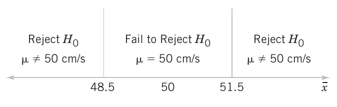
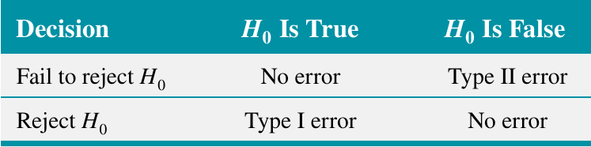
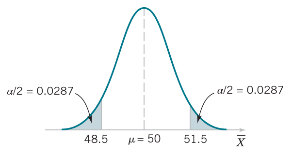
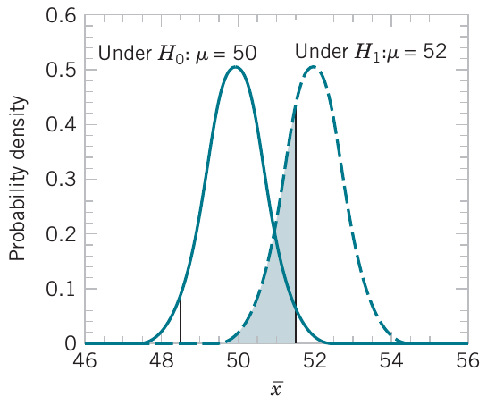

<style>
.section .reveal .state-background {
   background: #ffffff;
}
.section .reveal h1,
.section .reveal h2,
.section .reveal p {
   color: black;
   margin-top: 50px;
   text-align: center;
}
</style>
<!-- foo 
Highlighting
bold
strong
orange <b style="color:#d95f02"> text </b>
green  <b style="color:#1b9e77"> text </b>
purple <b style="color:#d24693"> text </b>
red    <b style="color:#FF0000"> text </b>
blue   <b style="color:#0000FF"> text </b>
-->

Hypothesis testing
========================================================
date: 04/14/2021
autosize: true
incremental: true
width: 1920
height: 1080

<h2 style="text-align:left"> Instructions:</h2>
<p style='text-align:left'>Use the left and right arrow keys to navigate the presentation forward and backward respectively.  You can also use the arrows at the bottom right of the screen to navigate with a mouse.<br></p>

<blockquote>
FAIR USE ACT DISCLAIMER:</br>
This site is for educational purposes only.  This website may contain copyrighted material, the use of which has not been specifically authorized by the copyright holders. The material is made available on this website as a way to advance teaching, and copyright-protected materials are used to the extent necessary to make this class function in a distance learning environment.  The Fair Use Copyright Disclaimer is under section 107 of the Copyright Act of 1976, allowance is made for “fair use” for purposes such as criticism, comment, news reporting, teaching, scholarship, education and research.
</blockquote>


========================================================

<h2>Outline</h2>

* The following topics will be covered in this lecture:
  * A review of hypothesis testing
  * Decision criteria for hypothesis testing
  * Duality with confidence intervals
  * Types of errors
  * Power of statistical tests
  * P values


========================================================
## Hypothesis testing -- a review

* Formally, we will define

<blockquote>
<b>Statistical Hypothesis</b><br>
A <strong>statistical hypothesis</strong> is a statement about the parameters of one or more populations.
</blockquote>

* Because we use probability distributions to model populations, a statistical hypothesis may also be thought of as a statement about the probability distribution of a random variable.

* The hypothesis will usually involve one or more parameters of this distribution.

* For example, consider the air crew escape system described last time. 

* Suppose that we are interested in the burning rate of the solid propellant. 

* Burning rate is a random variable that can be described by a probability distribution. 

* Suppose that our interest focuses on the mean burning rate (a parameter of this distribution). 

* Specifically, we are interested in deciding whether or not the mean burning rate is $50$ centimeters per second. 

* We may express this formally as

  $$\begin{align}
  H_0∶& \mu = 50 \text{ centimeters per second}\\
  H_1∶& \mu \neq 50 \text{ centimeters per second}
  \end{align}$$

* $H_0$ is known as the <b>null hypothesis</b> and $H_1$ is known as the <b>alternative hypothesis</b>.


========================================================
### Hypothesis testing -- a review

* In hypothesis testing, the null and alternative hypotheses have special meanings philosophically and in the mathematics.

* <b>We cannot generally "prove" a hypothesis to be true</b>;

  * generically, we will assume that the true population parameter is unobservable.
  
* Instead, <strong>we can only determine if a hypothesis seems unlikely enough to reject</strong>;

  * this is similar to finding that our proposed parameter value was in far-fewer confidence intervals than predicted by the procedure.

* To begin such a test formally, we need to first <b>make some assumption about the true parameter</b>.

  * This always takes the form of <strong>assuming the null hypothesis</strong> $H_0$.

* The <b>null hypothesis</b> $H_0$ will always <strong>take the form of an equality, or an inclusive inequality</strong>.

  * That is, we take
  
  $$\begin{align}
  H_0: & \theta \text{ is } (= / \leq / \geq) \text{ some proposed value}.
  \end{align}$$
  
  * In our example, we wrote
  
  $$\begin{align}
  H_0∶ & \mu = 50 \text{ centimeters per second}.
  \end{align}$$


========================================================
### Hypothesis testing -- a review


* The contradictory / competing hypothesis is the alternative hypothesis, written

  $$\begin{align}
  H_1: & \theta \text{ is } (\neq / > / <) \text{ some proposed value}
  \end{align}$$
  
  * In our example, we wrote
  
  $$\begin{align}
  H_1∶ & \mu \neq 50 \text{ centimeters per second}.
  \end{align}$$


* Once we have formed a null and alternative hypothesis: 

  $$\begin{align}
  H_0: & \theta \text{ is } (= / \leq / \geq) \text{ some proposed value}\\
  H_1: & \theta \text{ is } (\neq / > / <) \text{ some proposed value}
  \end{align}$$

* we <b>use the sample data</b> to <strong>consider how likely or unlikely it was to observe such data with the proposed parameter</strong>.

  * If the <strong>sample doesn't seem to fit the proposed parameter value</strong>, we <b>deem the null hypothesis unlikely</b>.

* If the <b>null hypothesis is sufficiently unlikely</b>, <strong>we reject the null hypothesis in favor of the alternative hypothesis</strong>.

* However, if the evidence (the sample) doesn't contradict the null hypothesis, we tentatively keep this assumption.

  * This <strong>has not proven this assumption</strong>, it has only said that the <b>hypothesis is not unlikely given our evidence</b>.

* In our example, we would say either:
  1. we <b>reject the null hypothesis</b> of $H_0∶ \mu = 50$ in favor of the alternative $H_1: \mu \neq 50$; or
  2. we <strong>fail to reject the null hypothesis</strong> of $H_0:\mu = 50$.

========================================================
### Hypothesis testing -- a review

* In our example, the alternative hypothesis specifies values of $\mu$ that could be either
greater or less than 50 centimeters per second;

  * therefore, it is called a <b>two-sided alternative hypothesis</b>.

* In some situations, we may wish to formulate a one-sided alternative hypothesis, as in
  
  $$\begin{align}
  H_0∶ & \mu \geq 50\text{ centimeters per second} \\
  H_1∶ & \mu < 50\text{ centimeters per second}
  \end{align}$$
  
* or
  
  $$\begin{align}
  H_0∶ & \mu \leq 50\text{ centimeters per second} \\
  H_1∶ & \mu > 50\text{ centimeters per second}
  \end{align}$$

* The above situations have an <strong>exact analogy with one-sided confidence bounds</strong>, similar to the two-sided test and the <b>two-sided confidence interval</b>.

* We will now elaborate on the meaning of determining if a hypothesis is sufficiently unlikely.

  * This is directly related to the value $\alpha$ we used as a rate of failure for confidence intervals.


========================================================
## Decision citeria for hypothesis testing

* In our working example, we are considering 

  $$\begin{align}
  H_0∶& \mu = 50 \text{ centimeters per second}\\
  H_1∶& \mu \neq 50 \text{ centimeters per second}
  \end{align}$$

* Suppose that the standard deviation of the burning rate is a known $\sigma = 2.5$ centimeters per second and that the burning rate has a normal distribution. 


* <b>Assuming the null hypothesis</b>, and with a sample of $n = 10$ specimens, 
  
  $$\overline{X} \sim N\left(\mu, \frac{\sigma^2}{n}\right)  = N\left(50,0.625\right)$$

* A value of the sample mean $\overline{x}$ that falls close to the hypothesized value of $\mu = 50$ centimeters per second (<b>relative to the spread</b>) does not conflict with the null hypothesis that the true mean $\mu$ is really $50$ centimeters per second.

* On the other hand, a sample mean that is considerably different from $50$ centimeters per second is evidence in support of rejecting the null hypothesis. 

* The sample mean in this test is what is called a <b>test statistic</b>.

  * The test statistic is what we will use to <strong>evaluate how likely or unlikely the observed data is</strong> <b>based on our assumed null hypothesis</b>.

* The sample mean is of course a random variable and can take on many different values. 


========================================================
### Decision citeria for hypothesis testing

* However, <b>assuming the null hypothesis</b>, and with a sample of $n = 10$ specimens, 
  
  $$\overline{X} \sim N\left(50, 0.625\right)$$
  
* we can compute the probability of observing various values of the test statistic, i.e.,

 $$P(\overline{X}\leq \overline{x}_l) \text{ or } P(\overline{X} \geq \overline{x}_u).$$
  where $\overline{x}_l$ and $\overline{x}_u$ may be some lower and upper bound.

* For sake of example, let's suppose that observing a sample mean that is $1.9$ standard deviations away from the center of the sampling distribution would be highly surprising:

  $$\begin{align}
  & &-1.9 &= \frac{\overline{x}_l - 50}{.79} & & & 1.9 &= \frac{\overline{x}_u - 50}{.79}\\
  \Leftrightarrow & & \overline{x}_l& \approx 48.5 & &  & \overline{x}_u &\approx 51.5
  \end{align}$$

* We can compute the associated probability


```r
se = 2.5 / sqrt(10)
mu = 50
1 - pnorm(51.5, mean=mu, sd=se) + pnorm(48.5, mean=mu, sd=se)
```

```
[1] 0.05777957
```


========================================================
### Decision citeria for hypothesis testing

<div style="float:left; width:60%">
<ul>
  <li>In the last slide, we proposed the criterion that observing a sample mean $1.9$ standard deviations away from the hypothesized center $\mu=50$ to be reason to question the hypothesis.</li>
  <li>This corresponded to a decision that if  $48.5 \leq \overline{x} \leq 51.5,$  we will not reject the null hypothesis $H_0$, and if either 
  $$\overline{x} < 48.5 \text{ or }\overline{x} > 51.5,$$ 
  we will reject the null hypothesis in favor of the alternative hypothesis $H_1$. </li>
  <li>  This is illustrated to the right.</li>
</ul>
</div>
  
<div style="float:right; width:38%" class="fragment">

<p style="text-align:center">
Courtesy of Montgomery & Runger, <em>Applied Statistics and Probability for Engineers</em>, 7th edition
</p>
</div>
<div style="float:left; width:100%">
<ul>
  <li>The values of $\overline{x}$ that are less than $48.5$ and greater than $51.5$ constitute the <b>critical region for the test</b>;</li>
  <ul>
    <li>all values that are in the interval 
    $$48.5 \leq \overline{x} \leq 51.5$$ 
    form a region for which we will fail to reject the null hypothesis.</li> 
  </ul>
  <li>By convention, this is usually called the <b>acceptance region</b>.</li> 
  <li>The boundaries between the critical regions and the acceptance region are called the <b>critical values</b> -- in our example, the critical values are $48.5$ and $51.5$.</li> 
  <li>It is customary to state conclusions relative to the null hypothesis $H_0$.</li> 
  <li>Therefore, we reject $H_0$ in favor of $H_1$ if the test statistic falls in the critical region and fails to reject $H_0$ otherwise.</li>
</ul>
</div>

========================================================
### Decision citeria for hypothesis testing -- types of errors

<div style="float:left; width:60%">
<ul>
  <li>Our decision process is based on the random outcome of the test statistic, so that even if an outcome seems unlikely, we may come to a false conclusion based on observing a low-probability event.</li>
  <li> There are <b>two possible wrong conclusions</b> we can make in this decision process: </li>
  <ol>
    <li> we may <strong>reject the null hypothesis when this is actually true</strong>;</li>
    <li> we may <strong>fail to reject the null hypothesis when this is actually false</strong>.</li>
  </ol>
  <li>  In our example, the true mean burning rate of the propellant could be equal to $50$ centimeters per second;</li>
  <ul>
    <li>yet <strong>for the specimens that are tested</strong>, we could <b>observe a value of the test statistic</b> $\overline{x}$ that <b>falls into the critical region</b>. </li>
  </ul>
</ul>
</div>
  
<div style="float:right; width:38%" class="fragment">

<p style="text-align:center">
Courtesy of Montgomery & Runger, <em>Applied Statistics and Probability for Engineers</em>, 7th edition
</p>
</div>
<div style="float:left; width:100%">
<ul>
  <li> We would then reject the null hypothesis $H_0$ in favor of the alternate $H_1$ when, in fact, $H_0$ is really true.</li>
  <li> This <strong>type of wrong conclusion</strong> is called a <b>type I error</b>.</li>
  <blockquote>
  <b>Type I Error</b><br>
  Rejecting the null hypothesis $H_0$ when it is true is defined as a <strong>type I error</strong>.
  </blockquote>
</ul>
</div>


========================================================
### Decision citeria for hypothesis testing -- types of errors

<div style="float:left; width:60%">
<ul>
  <li>Now suppose that the <b>true mean burning rate is different from 50 centimeters per second</b></li>
  <ul>
    <li>yet <strong>for the specimens that are tested</strong>, we could <b>observe a value of the test statistic</b> $\overline{x}$ that <b>falls into the acceptance region</b>. </li>
  </ul>
</ul>
</div>
<div style="float:right; width:38%" class="fragment">

<p style="text-align:center">
Courtesy of Montgomery & Runger, <em>Applied Statistics and Probability for Engineers</em>, 7th edition
</p>
</div>
<div style="float:left; width:60%">
<ul>
 <li> We would then <b>fail to reject the null hypothesis</b> $H_0$ when, in fact, $H_0$ <strong>is really false</strong>.</li>
  <li> This <strong>type of wrong conclusion</strong> is called a <b>type II error</b>.</li>
</ul>
</div>
<div style="float:left; width:60%">
<ul>
  <blockquote>
  <b>Type II Error</b><br>
  Failing to reject the null hypothesis $H_0$ when it is false is defined as a <strong>type II error</strong>.
  </blockquote>
  <li>A schematic of this hypothesis testing decision process is given in the right:</li>
</ul>
</div>
<div style="float:right; width:38%" class="fragment">

<p style="text-align:center">
Courtesy of Montgomery & Runger, <em>Applied Statistics and Probability for Engineers</em>, 7th edition
</p>
</div>
<div style="float:left; width:100%">
<ul>
  <li>Based on these two possible errors, we can define different probabilistic criteria that will attempt to handle these risks of incorrect decisions.</li>
  <li>It turns out that the rate of failure of confidence intervals is the same as the probability of type I error.</li>
  <blockquote>
  <b>Probability of Type I Error</b><br>
  $$\alpha = P(\text{type I error}) = P(\text{reject }H_0\text{ when }H_0\text{ is true})$$
  </blockquote>
</ul>
</div>

========================================================
### Decision citeria for hypothesis testing -- types of errors

* If we consider the last statement,

  <blockquote>
  <b>Probability of Type I Error</b><br>
  $$\alpha = P(\text{type I error}) = P(\text{reject }H_0\text{ when }H_0\text{ is true}).$$
  This is also called the <strong>significance level</strong> of the hypothesis test.
  </blockquote>

* the <b>dual relationship with confidence intervals</b> can be understood as follows.

* Suppose we produce a $(1-\alpha)\times100\%$ confidence interval for the unknown true mean $\mu$ of a studied population,

  $$\left( \overline{x} - \sigma_\overline{X} z_\frac{\alpha}{2} , \overline{x} + \sigma_\overline{X} z_\frac{\alpha}{2}\right)$$
  based on some sample.

* Suppose that we have a working hypothesis that $\tilde{\mu}$ is the true population mean, i.e.,

  $$\begin{align}
  H_0 &: \mu = \tilde{\mu} \\
  H_1 &: \mu \neq \tilde{\mu}
  \end{align}$$
  
* We can considering using the <b>confidence interval</b> as our <strong>decision criterion for the hypothesis test</strong>:
  1. if $\tilde{\mu}\in  \left( \overline{x} - \sigma_\overline{X} z_\frac{\alpha}{2} , \overline{x} + \sigma_\overline{X} z_\frac{\alpha}{2}\right)$
  then we <b>fail to reject the null hypothesis</b>, as $\tilde{\mu}$ is a plausible value with $(1-\alpha)\times 100\%$ confidence.
  2. if $\tilde{\mu}\notin  \left( \overline{x} - \sigma_\overline{X} z_\frac{\alpha}{2} , \overline{x} + \sigma_\overline{X} z_\frac{\alpha}{2}\right)$
  then we <b>reject the null hypothesis</b>, as $\tilde{\mu}$ is not a plausible value with $(1-\alpha)\times 100\%$ confidence.


========================================================
### Decision citeria for hypothesis testing -- types of errors


* Let's recall the definition of $\alpha$:

  <blockquote>
  <b>Probability of Type I Error</b><br>
  $$\alpha = P(\text{type I error}) = P(\text{reject }H_0\text{ when }H_0\text{ is true})$$
  </blockquote>

* Suppose that the null hypothesis is true, i.e, $\tilde{\mu} = \mu$,  yet we find that
  
  $$\tilde{\mu} \notin \left( \overline{x} - \sigma_\overline{X} z_\frac{\alpha}{2} , \overline{x} + \sigma_\overline{X} z_\frac{\alpha}{2}\right).$$

* If $H_0$ is <i>actually true</i>, then concluding that $\tilde{\mu}$ is not a reasonable value for $\mu$ is precisely a <strong>type I error</strong>.

* If we have constructed a $(1-\alpha)\times 100\%$ confidence interval, the rate at which 

  $$\tilde{\mu} \notin \left( \overline{X} - \sigma_\overline{X} z_\frac{\alpha}{2} , \overline{X} + \sigma_\overline{X} z_\frac{\alpha}{2}\right)$$
  with respect to infinite replications is precisely the rate of failure, $\alpha$.
  
* Therefore, we have the equivalence:

  $$(1-\alpha)\times 100\% \text{ confidence} \Leftrightarrow \alpha = P(\text{type I error}).$$
  
* The above relationship expresses the <b>duality of confidence intervals and hypothesis tests</b>.

* This explains, in part, why `t.test()` computes both a confidence interval and hypothesis test simultaneously;
  * the two procedures are formally equivalent.


========================================================
### Decision citeria for hypothesis testing -- types of errors

<div style="float:left; width:60%">
<ul>
  <li>If we consider how we constructed the confidence interval, the duality makes sense once again.</li>
  <li>In our earlier example, we had $H_0: \mu = 50$ and $H_1 : \mu \neq 50$.</li>
  <li>We define our decision criterion in that we will reject the null hypothesis if $\overline{x}$ lies outside of a stated interior region around the assumed $\mu=50$.</li>
</ul>
</div>
<div style="float:right; width:38%" class="fragment">


<p style="text-align:center">
Courtesy of Montgomery & Runger, <em>Applied Statistics and Probability for Engineers</em>, 7th edition
</p>
</div>
<div style="float:left; width:60%">
<ul>
  <li>This region is constructed by considering the distribution for the test statistic, i.e., let's suppose for simplicity that $\sigma$ is known and
  $$\overline{X} \sim N\left(\mu, \sigma^2\right).$$</li>
  <li>Assuming $\mu =50$, we can compute critical values $z_\frac{\alpha}{2}$ for which
  $$\begin{align}
  P\left(\overline{X} < \overline{x}_l\right) = P\left(\overline{X} < 50 - \sigma_\overline{X} z_\frac{\alpha}{2}\right) & = \frac{\alpha}{2}\\
  P\left(\overline{X} > \overline{x}_u\right) = P\left(\overline{X} > 50 - \sigma_\overline{X} z_\frac{\alpha}{2}\right) & = \frac{\alpha}{2}.
  \end{align}$$</li>
  <li>Recall that $\sigma_\overline{X} z_\frac{\alpha}{2}$ is precisely the radius of the confidence interval.</li>
  <li>Therefore, the confidence interval centered at $\overline{x}$ does not contain $\mu=50$ if and only if
  $$\begin{align}
  \overline{x} < 50 - \sigma_\overline{X} z_\frac{\alpha}{2} && \text{ or } \overline{x} > 50 + \sigma_\overline{X} z_\frac{\alpha}{2}
  \end{align}$$</li>
</ul>
</div>
<div style="float:left; width:100%">
<ul>
  <li>I.e., we reject the null hypothesis if and only if the test statistic is observed beyond the critical values for the sampling distribution.</li>
</ul>
</div>

========================================================
### Decision citeria for hypothesis testing -- types of errors

* In our running example, we had $z_\frac{\alpha}{2} = 1.9$ standard deviations, i.e.,


```r
alpha <- 2 * (1 - pnorm(1.9))
alpha
```

```
[1] 0.05743312
```

* where
  $$\begin{align}
  P\left(\overline{X} < \overline{x}_l\right) = P\left(\overline{X} < 48.5\right) \approx P\left(\overline{X} < 50 - \sigma_\overline{X} 1.9\right) & = \frac{\alpha}{2}\\
  P\left(\overline{X} > \overline{x}_u\right) = P\left(\overline{X} > 41.5 \right) \approx P\left(\overline{X} > 50 - \sigma_\overline{X} 1.9\right) &= \frac{\alpha}{2}.
 \end{align}$$

* Up to some small approximation errors (done in the book)


```r
se = 2.5 / sqrt(10)
mu = 50
1 - pnorm(51.5, mean=mu, sd=se) + pnorm(48.5, mean=mu, sd=se)
```

```
[1] 0.05777957
```

* we see how we found the probability of a type I error in multiple ways.

========================================================
### Decision citeria for hypothesis testing -- types of errors

* In evaluating a hypothesis-testing procedure, it is also important to examine the probability
of a type II error, which we denote by $\beta$.


<blockquote>
  <b>Probability of Type II Error</b><br>
  $$\beta = P(\text{type II error}) = P(\text{failing to reject }H_0\text{ when }H_0\text{ is false}).$$
  The complementary probability, $1- \beta$ is called the <strong>power</strong> of the hypothesis test.
  </blockquote>
  
* To calculate $\beta$, we must have a <b>specific alternative hypothesis</b>;

  * that is, <strong>we must have a particular value</strong> of $\mu$.
  
* This is because, the unknown, true alternative hypothesis for $\mu$ will determine the sampling distribution for $\overline{X}$.
  
* For example, suppose that it is important to reject the null hypothesis 

  $$H_0 : \mu = 50$$ 
  
  whenever the mean burning rate $\mu$ is greater than $52$ centimeters per second or less than $48$ centimeters per second. 

* Assuming that the <b>true sampling distribution</b> is centered at $\mu=52$ or $\mu=48$, we can determine the probability of a type II error $\beta$;
  
  * we will assume that the decision rule uses the false hypothesis $\mu=50$, without knowing the true parameter.

* We will estimate how the test procedure will work probabilistically if we wish to reject $H_0$, for a <b>true mean value</b> of $\mu = 52$ or $\mu = 48$. 


========================================================
### Decision citeria for hypothesis testing -- types of errors


<div style="float:left; width:60%">
<ul>
  <li> Because of symmetry, it is necessary to evaluate only one of the two cases;</li>
  <ul>
    <li>we will find the probability of failing to reject the null hypothesis $H_0: \mu = 50$ centimeters per second when the true mean is $\mu = 52$ centimeters per second.</li>
  </ul>
</ul>
</div>
<div style="float:right; width:38%" class="fragment">

<p style="text-align:center">
Courtesy of Montgomery & Runger, <em>Applied Statistics and Probability for Engineers</em>, 7th edition
</p>
</div>
<div style="float:left; width:60%">
<ul>
  <li>The figure to the right will help us calculate the probability of type II error $\beta$.</li> 
  <li>The normal distribution on the left is the distribution of the test statistic $\overline{X}$ when the null hypothesis $H_0 : \mu = 50$ is <b>true</b>;</li>
  <ul>
    <li>the normal distribution on the right is the distribution of $\overline{X}$ when the <b>alternative hypothesis is true</b> and the <strong>true value of the mean</strong> is $52$.</li>
  </ul>
  <li>A type II error will be committed if the sample mean $\overline{X}$ falls between $48.5$ and $51.5$ (the critical region boundaries) when $\mu = 52$.</li>
</ul>
</div>
<div style="float:left; width:100%">
<ul>
 <li>This is exactly the probability that 
  $$48.5 \leq \overline{X} \leq 51.5$$ 
  when the true mean is $\mu = 52$, or the shaded area under the normal distribution centered at $\mu = 52$.</li>
  <li>Therefore, we can compute the probability of a type II error, in the case that $H_0: \mu=50$ is false, where $\mu=52$ is the true value, by 
  $$\beta = P(48.5 \leq \overline{X} \leq 51.5 \text{ assuming that }\mu = 52).$$</li>
</ul>
</div>

========================================================
### Decision citeria for hypothesis testing -- types of errors


* From the last slide, we can compute the probability of a type II error, in the case that $H_0: \mu=50$ is false, where $\mu=52$ is the true value, by 
  
  $$\beta = P(48.5 \leq \overline{X} \leq 51.5 \text{ assuming that }\mu = 52).$$</li>

* Recall, we said that the standard error in this example was known as,

  $$\sigma_\overline{X} = \frac{\sigma}{\sqrt{n}} = \frac{2.5}{\sqrt{10}} \approx 0.79$$

* Therefore, with R, this can be computed directly as follows:


```r
se <- 2.5 / sqrt(10)
mu <- 52
beta <- pnorm(51.5, mean=mu, sd=se) - pnorm(48.5, mean=mu, sd=se)
beta
```

```
[1] 0.2635399
```

* (Note, once again, the values in the book differ slightly due to approximation errors throughout the manual calculations).

========================================================
### Decision citeria for hypothesis testing -- a summary of the decision procedure

* Now that we have established the fundamental tools of hypothesis testing:
  1. type I and type II errors, and their probability;
  2. the connection between a hypothesis test decision rule and the equivalent confidence interval;

* we will discuss how one formally goes through a hypothesis test. 

* Let's suppose that we have the sample of observations from the last discussion section: 

```r
speed_up_times <- c(3.775302,	3.350679,	4.217981,	4.030324,	4.639692, 4.139665,	4.395575,	4.824257,	4.268119,	4.584193, 4.930027, 4.315973,	4.600101)
n <- length(speed_up_times)
n
```

```
[1] 13
```

* We will suppose that we set a value $\alpha=0.05$ in advanced -- this is a standard level to set the probability of type I error but can be different in practice.

  * Similarly, this corresponds to a $(1 - \alpha)\times 100\% = 95\%$ level of confidence.

* We will also need to specify a null and alternative hypothesis in advanced -- let these be:

$$\begin{align}
H_0 : \mu = 4.0  & & H_1 : \mu \neq 4.00
\end{align}$$

* The procedure is then as follows:

  * We will compute the sample mean, and <strong>estimate the probability of observing such a value</strong> <b>assuming the null hypothesis</b>.

========================================================
### Decision citeria for hypothesis testing -- a summary of the decision procedure

* We can compute the sample mean as follows:


```r
x_bar <- mean(speed_up_times)
x_bar
```

```
[1] 4.313222
```

* We need to evaluate how unlikely it is to observe `x_bar` under the assumption that $\mu = 4.0$.

* The model for this probability will depend on whether the true population $\sigma$ is known or unknown.

* Let's assume for simplicity at the moment that $\sigma=0.45$ is a known value;

  * then our model for $\overline{X}$ is given as
  
  $$\overline{X} \sim N\left(\mu, \frac{0.45^2}{13}\right).$$
  
* The standard error can be computed as


```r
se <- 0.45/sqrt(13)
se
```

```
[1] 0.1248075
```

========================================================
### Decision citeria for hypothesis testing -- a summary of the decision procedure

* The critical region for the two-sided hypothesis test is then given by,


```r
mu <- 4.0
z_alpha_over_2 <- qnorm(0.975)
cr <- c(mu - se * z_alpha_over_2, mu + se * z_alpha_over_2)
cr
```

```
[1] 3.755382 4.244618
```

* while the sample mean is given by


```r
x_bar
```

```
[1] 4.313222
```

* Notice that `x_bar` lies outside of the critical region -- equivalently, our hypothesis value of the true mean $4.0$ lies outside of the $95\%$ confidence interval


```r
ci <- c(x_bar - se * z_alpha_over_2, x_bar + se * z_alpha_over_2)
ci
```

```
[1] 4.068604 4.557840
```

* Base on either equivalent procedure, we would say that the hypothesized value of $\mu = 4.0$ is unlikely given our observed sample.

========================================================
### Decision citeria for hypothesis testing -- a summary of the decision procedure

* Specifically, with $95\%$ confidence, we can say that $\mu=4.0$ <strong>is not a plausible value for the mean</strong> based on the confidence interval.

* Alternatively, we can say that there is a probability of less than 


```r
lower_tail_probability <- pnorm(mu - se * z_alpha_over_2, mean=mu, sd=se)
upper_tail_probability <- 1 - pnorm(mu + se * z_alpha_over_2, mean=mu, sd=se)
alpha <- lower_tail_probability + upper_tail_probability
alpha
```

```
[1] 0.05
```

* of observing such a value for the sample mean with our model for the sampling distribution.

* Denoting $\alpha$ the <b>significance level</b> we state:

  * We <strong>reject the null hypothesis</strong> $H_0: \mu = 4.0$ with $\alpha=5\%$ significance.

========================================================
### Decision citeria for hypothesis testing -- a summary of the decision procedure

* Continuing the last example, suppose we had a specific value for the alternative hypothesis in mind, $H_1: \mu = 4.5$.

* We can check the power of the hypothesis test versus this value of the alternative hypothesis as follows.

* Our the critical region for the hypothesis test is again given as


```r
cr
```

```
[1] 3.755382 4.244618
```

* We <b>fail to reject the null</b> <strong>if the sample mean falls within this region</strong>.

* If we <b>assume that the true model</b> for the sample mean is given as
  
  $$\begin{align}
  \overline{X} \sim N\left(4.5,  \frac{0.45^2}{13}\right)
  \end{align}$$
  
* the probability of a type II error is given as

  $$\begin{align}
  \beta = P\left( 3.755382 \leq \overline{X} \leq 4.244618\right)
  \end{align}$$
  given the above model.
  

========================================================
### Decision citeria for hypothesis testing -- a summary of the decision procedure

* We can compute 

  $$\begin{align}
  \beta = P\left( 3.755382 \leq \overline{X} \leq 4.244618\right)
  \end{align}$$
  under the assumption 

  $$\begin{align}
  \overline{X} \sim N\left(4.5,  \frac{0.45^2}{13}\right)
  \end{align}$$
  as 
  

```r
beta <- pnorm(4.244618, mean=4.5, sd=se) - pnorm(3.755382, mean=4.5, sd=se)
beta
```

```
[1] 0.02036803
```

* The power of the test (assuming that the true $\mu=4.5$ and that we have falsely hypothesized $\mu=4.0$) is given as


```r
1 - beta
```

```
[1] 0.979632
```

========================================================
## P-values in hypothesis testing


* One way to report the results of a hypothesis test is to state that the null hypothesis was or was not rejected at a specified $\alpha$-value or level of significance. 

* This is called <b>fixed significance level testing</b>.

* The fixed significance level approach to hypothesis testing is very nice because it leads directly to the concepts of type II error and power;
  
  * these concepts are of considerable value in determining the appropriate sample sizes to use in hypothesis testing, similar to how we performed this for confidence intervals.

* However, the fixed significance level approach does have some disadvantages.


* In our last example, $H_0 : \mu = 50$ was rejected at the $0.05$ level of significance. 

* This statement of conclusions may be often inadequate because it gives the decision maker no idea about whether the computed value of the test statistic was just barely in the rejection region or whether it was very far into this region. 

* Furthermore, stating the results this way imposes the predefined level of significance on other users of the information.

* This approach may be unsatisfactory because some decision makers might be uncomfortable with the risks implied by $\alpha= 0.05$.

* To avoid these difficulties, the P-value approach has been adopted widely in practice.


========================================================
### P-values in hypothesis testing

* The P-value is the <strong>probability that the test statistic</strong> will take on a value that is <b>at least as extreme as the observed value</b> of the statistic, when the null hypothesis $H_0$ is true. 

* Thus, a P-value conveys much information about the weight of evidence against $H_0$; 

  * a decision maker can draw a conclusion at any specified level of significance knowing the specific probability of the observed result. 
  
* We now give a formal definition of a P-value.

<blockquote>
<b>P-Value</b><br>
The <strong>P-value</strong> is the smallest level of significance that would lead to rejection of the null
hypothesis $H_0$ with the given data.
</blockquote>

* It is customary to consider the test statistic (and the data) significant when the null hypothesis $H_0$ is rejected; 

  * therefore, we may think of the P-value as the smallest level $\alpha$ at which the data are significant. 
  
* In other words, the P-value is the <strong>observed significance level</strong>. 

* Once the P-value is known, the decision maker can determine how significant the data are without the data analyst formally imposing a pre-selected level of significance.

========================================================
### P-values in hypothesis testing

* Recall our speedup time data:


```r
speed_up_times <- c(3.775302,	3.350679,	4.217981,	4.030324,	4.639692, 4.139665,	4.395575,	4.824257,	4.268119,	4.584193, 4.930027, 4.315973,	4.600101)
```

* with sample mean


```r
x_bar
```

```
[1] 4.313222
```

* Our null and alternative hypotheses were given as 
  
  $$\begin{align}
  H_0: \mu = 4.0 & & H_0: \mu \neq 4.0
  \end{align}$$

* The alternative hypothesis specifies that the critical region under consideration is two-sided, like a two-sided confidence interval.

* Therefore, the P-value will measure the probability of observing a sample mean at least as far away as `x_bar` from $\mu=4.0$ in <strong>either direction</strong>, under the model

  $$\overline{X} \sim N\left(\mu, \frac{0.45^2}{13}\right).$$

========================================================
### P-values in hypothesis testing

* To compute the associated probability / region, we can consider the z-score of the observed sample mean:


```r
z_score <- (x_bar - 4.0)/se
z_score
```

```
[1] 2.509641
```

* Therefore, the observed value for the sample mean lies $\approx 2.5$ standard deviations to the right of the proposed mean.

* The P-value thus corresponds to the probability of observing a standard normal random variable taking a value at least as extreme as the z-score in either direction, i.e.,

  $$\approx P(Z< -2.5 ) + P(Z> 2.5).$$ 

* We compute


```r
P_value <- pnorm(-z_score) + (1 - pnorm(z_score))
P_value
```

```
[1] 0.01208539
```

* The observed significance level is thus $\approx 1.2\%$.
  
