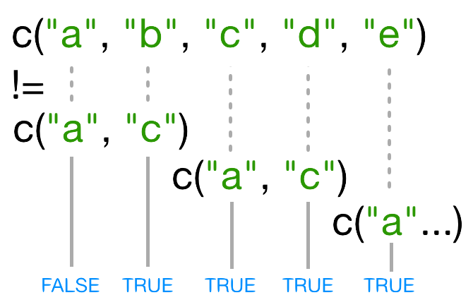

<style>
.section .reveal .state-background {
   background: #ffffff;
}
.section .reveal h1,
.section .reveal h2,
.section .reveal p {
   color: black;
   margin-top: 50px;
   text-align: center;
}
</style>


An introduction to programming in R -- Part 3
========================================================
date: 09/02/2020
autosize: true
incremental: true
width: 1920
height: 1080

<h2 style="text-align:left"> Instructions:</h2>
<p style='text-align:left'>Use the left and right arrow keys to navigate the presentation forward and backward respectively.  You can also use the arrows at the bottom right of the screen to navigate with a mouse.<br></p>

<blockquote>
FAIR USE ACT DISCLAIMER:</br>
This site is for educational purposes only.  This website may contain copyrighted material, the use of which has not been specifically authorized by the copyright holders. The material is made available on this website as a way to advance teaching, and copyright-protected materials are used to the extent necessary to make this class function in a distance learning environment.  The Fair Use Copyright Disclaimer is under section 107 of the Copyright Act of 1976, allowance is made for “fair use” for purposes such as criticism, comment, news reporting, teaching, scholarship, education and research.
</blockquote>


========================================================

<h2>Outline</h2>

* The following topics will be covered in this lecture:

  * More on subsetting data
  * Skipping and removing elements
  * Vectorization
  

========================================================
## More on subsetting data

*  R has many powerful subset operators -- mastering them will allow you to easily perform complex operations on any kind of dataset.

* There are six different ways we can subset any kind of object, and three different subsetting operators for the different data structures.

* Let's start with the workhorse of R: a simple numeric vector.


```r
x <- c(5.4, 6.2, 7.1, 4.8, 7.5)
names(x) <- c('a', 'b', 'c', 'd', 'e')
x
```

```
  a   b   c   d   e 
5.4 6.2 7.1 4.8 7.5 
```

* In R, simple vectors containing character strings, numbers, or logical values are called *atomic* vectors because they can't be further simplified.


========================================================
## Accessing elements using their indices

* So now that we've created a dummy vector to play with, how do we get at its contents?


* To extract elements of a vector we can give their corresponding index, starting from one:

```r
x[1]
```

```
  a 
5.4 
```


```r
x[4]
```

```
  d 
4.8 
```

* It may look different, but the square brackets operator is a function. 

* For vectors (and matrices), it means "get me the nth element".

========================================================
### Accessing elements using their indices -- continued

* We can ask for multiple elements at once:

```r
x[c(1, 3)]
```

```
  a   c 
5.4 7.1 
```

* Or slices of the vector:

```r
x[1:4]
```

```
  a   b   c   d 
5.4 6.2 7.1 4.8 
```

* The `:` operator creates a sequence of numbers from the left element to the right.

```r
1:4
```

```
[1] 1 2 3 4
```

```r
c(1, 2, 3, 4)
```

```
[1] 1 2 3 4
```


========================================================
### Accessing elements using their indices -- continued

* We can ask for the same element multiple times:


```r
x[c(1,1,3)]
```

```
  a   a   c 
5.4 5.4 7.1 
```

* If we ask for an index beyond the length of the vector, R will return a missing value:

```r
x[6]
```

```
<NA> 
  NA 
```

* This is a vector of length one containing an `NA`, whose name is also `NA`.

========================================================
### Accessing elements using their indices -- continued

* If we ask for the 0th element, we get an empty vector:

```r
x[0]
```

```
named numeric(0)
```

* In many programming languages (C and Python, for example), the first element of a vector has an index of 0. 

* In R, the first element is 1.


========================================================

## Skipping and removing elements

* If we use a negative number as the index of a vector, R will return every element *except* for the one specified:

```r
x[-2]
```

```
  a   c   d   e 
5.4 7.1 4.8 7.5 
```

* We can skip multiple elements:

```r
x[c(-1, -5)]  # or x[-c(1,5)]
```

```
  b   c   d 
6.2 7.1 4.8 
```

* A common trip up for novices occurs when trying to skip slices of a vector. 

* It's natural to try to negate a slice as follows

```r
x[-1:3]
```
 
* But this gives a somewhat cryptic error...

```
Error in x[-1:3]: only 0's may be mixed with negative subscripts
```


========================================================
### Skipping and removing elements -- continued

* The key to understanding this is remembering the order of operations. 

   * `:` is really a function, which we want to respect the arguments of.

* It takes its first argument as -1, and its second as 3, so generates the sequence of numbers: `c(-1, 0, 1, 2, 3)`.

* The correct solution is to wrap that function call in brackets, so that the `-` operator applies to the result:


```r
x[-(1:3)]
```

```
  d   e 
4.8 7.5 
```

* To remove elements from a vector, we need to assign the result back into the variable:

```r
x <- x[-4]
x
```

```
  a   b   c   e 
5.4 6.2 7.1 7.5 
```


========================================================

## Subsetting by name

* We can extract elements by using their name, instead of extracting by index:


```r
x <- c(a=5.4, b=6.2, c=7.1, d=4.8, e=7.5) # we can name a vector 'on the fly'
x[c("a", "c")]
```

```
  a   c 
5.4 7.1 
```

* This is usually a much more reliable way to subset objects: 

  * the position of various elements can often change when chaining together subsetting operations, but the names will always remain the same.


========================================================

## Subsetting through other logical operations <a name="logical-operations"></a>

* We can also use any logical vector to subset:


```r
x[c(FALSE, FALSE, TRUE, FALSE, TRUE)]
```

```
  c   e 
7.1 7.5 
```

* Since comparison operators (e.g. `>`, `<`, `==`) evaluate to logical vectors, we can also use them to succinctly subset vectors: 

  * the following statement gives the same result as the previous one.


```r
x[x > 7]
```

```
  c   e 
7.1 7.5 
```

========================================================

## Subsetting through other logical operations <a name="logical-operations"></a>

* Breaking it down, this statement first evaluates `x>7`, 
  
  * generating a logical vector `c(FALSE, FALSE, TRUE, FALSE, TRUE)`, 
  
  * and then selects the elements of `x` corresponding to the `TRUE` values.

* We can use `==` to mimic the previous method of indexing by name (remember you have to use `==` rather than `=` for comparisons):

```r
x[names(x) == "a"]
```

```
  a 
5.4 
```

========================================================
### Combining logical conditions

* We often want to combine multiple logical criteria. 

* For example, we might want to find all the countries that are located in Asia **or** Europe **and** have life expectancies within a certain range. 

* Several operations for combining logical vectors exist in R:
 
 * `&`, the "logical AND" operator: returns `TRUE` if both the left and right are `TRUE`.
 * `|`, the "logical OR" operator: returns `TRUE`, if either the left or right (or both) are `TRUE`.


========================================================
### Combining logical conditions

* You may sometimes see `&&` and `||` instead of `&` and `|`. 

* These two-character operators only look at the first element of each vector and ignore the remaining elements. In general you should not use the two-character operators in data analysis; 

* save them for programming, i.e. deciding whether to execute a statement.

* `!`, the "logical NOT" operator: converts `TRUE` to `FALSE` and `FALSE` to `TRUE`. 

* It can negate a single logical condition (eg `!TRUE` becomes `FALSE`), or a whole vector of conditions(eg `!c(TRUE, FALSE)` becomes `c(FALSE, TRUE)`).

* Additionally, you can compare the elements within a single vector using the `all` function (which returns `TRUE` if every element of the vector is `TRUE`)  and the `any` function (which returns `TRUE` if one or more elements of the  vector are `TRUE`).


========================================================

### Non-unique names

* You should be aware that it is possible for multiple elements in a vector to have the same name. (For a data frame, columns can have the same name; 

* Consider this example:

```r
 x <- 1:3
 x
```

```
[1] 1 2 3
```

```r
names(x) <- c('a', 'a', 'a')
x
```

```
a a a 
1 2 3 
```

========================================================

### Non-unique names

* Now consider if we try to extract data by name when all elements have the same name:


```r
x['a']  # only returns first value
```

```
a 
1 
```

```r
x[names(x) == 'a']  # returns all three values
```

```
a a a 
1 2 3 
```


========================================================

## Skipping named elements

* Skipping or removing named elements is a little harder. If we try to skip one named element by negating the string, R complains (slightly obscurely) that it doesn't know how to take the negative of a string:

```r
x <- c(a=5.4, b=6.2, c=7.1, d=4.8, e=7.5) # we start again by naming a vector 'on the fly'
x[-"a"]
```

```
Error in -"a": invalid argument to unary operator
```

* However, we can use the `!=` (not-equals) operator to construct a logical vector that will do what we want:


```r
x[names(x) != "a"]
```

```
  b   c   d   e 
6.2 7.1 4.8 7.5 
```


========================================================

## Skipping named elements

* Skipping multiple named indices is a little bit harder still. Suppose we want to drop the `"a"` and `"c"` elements, so we try this:

```r
x[names(x)!=c("a","c")]
```

```
  b   c   d   e 
6.2 7.1 4.8 7.5 
```

* R did *something*, but it gave us a warning that we ought to pay attention to - and it apparently *gave us the wrong answer* (the `"c"` element is still included in the vector)!

 * So what does `!=` actually do in this case? That's an excellent question...

========================================================

### Recycling

* Let's take a look at the comparison component of this code:


```r
names(x) != c("a", "c")
```

```
[1] FALSE  TRUE  TRUE  TRUE  TRUE
```

* When you use `!=`, R tries to compare each element of the left argument with the corresponding element of its right
argument. 

* What happens when you compare vectors of different lengths?


========================================================

### Recycling -- continued 

<div style="float:left; width:100%">
<div style="float:left; width:30%" class="fragment">

<p style="text-align:center">
</div>
<div style="float:left; width:40%">
<ul>
  <li>When one vector is shorter than the other, it gets <strong>recycled</strong>...</li>
</ul>
</div>
<div style="float:right; width:30%" class="fragment">

<p style="text-align:center">
</div>
<div style="float:left; width:100%">
<ul>
  <li>In this case R <b>repeats</b> `c("a", "c")` as many times as necessary to match `names(x)`, i.e. we get `c("a","c","a","c","a")`. </li>
  <li> Since the recycled `"a"` doesn't match the third element of `names(x)`, the value of `!=` is `TRUE`.</li>
  <li> Because in this case the longer vector length (5) isn't a multiple of the shorter vector length (2), R printed a warning message. </li>
  <li> If we had been unlucky and `names(x)` had contained six elements, R would <b>silently</b> have done the wrong thing (i.e., not what we intended it to do).</li>
  <li>This recycling rule can can introduce hard-to-find and subtle bugs.</li>
</ul>
</div>

========================================================

### Recycling

* The way to get R to do what we really want (match *each* element of the left argument with *all* of the elements of the right argument) it to use the `%in%` operator. 

* The `%in%` operator goes through each element of its left argument, in this case the names of `x`, and asks, "Does this element occur in the second argument?". 

* Here, since we want to *exclude* values, we also need a `!` operator to change "in" to "not in":

```r
x[! names(x) %in% c("a","c") ]
```

```
  b   d   e 
6.2 4.8 7.5 
```

========================================================
## Handling special values

* At some point you will encounter functions in R that cannot handle missing, infinite,
or undefined data.

* There are a number of special functions you can use to filter out this data:

 * `is.na` will return all positions in a vector, matrix, or data.frame
   containing `NA` (or `NaN`)
 * likewise, `is.nan`, and `is.infinite` will do the same for `NaN` and `Inf`.
 * `is.finite` will return all positions in a vector, matrix, or data.frame
   that do not contain `NA`, `NaN` or `Inf`.
 * `na.omit` will filter out all missing values from a vector

========================================================

## Factor subsetting

* Now that we've explored the different ways to subset vectors, how do we subset the other data structures?

* Factor subsetting works the same way as vector subsetting.

```r
f <- factor(c("a", "a", "b", "c", "c", "d"))
f[f == "a"]
```

```
[1] a a
Levels: a b c d
```

```r
f[f %in% c("b", "c")]
```

```
[1] b c c
Levels: a b c d
```

```r
f[1:3]
```

```
[1] a a b
Levels: a b c d
```


========================================================
## Factor subsetting -- continued

* Skipping elements will not remove the level even if no more of that category exists in the factor:

```r
f[-3]
```

```
[1] a a c c d
Levels: a b c d
```

========================================================

## Matrix subsetting

* Matrices are also subsetted using the `[` function. In this case it takes two arguments: the first applying to the rows, the second to its columns:

```r
set.seed(1)
m <- matrix(rnorm(6*4), ncol=4, nrow=6)
m[3:4, c(3,1)]
```

```
            [,1]       [,2]
[1,]  1.12493092 -0.8356286
[2,] -0.04493361  1.5952808
```

* You can leave the first or second arguments blank to retrieve all the rows or columns respectively:

```r
m[, c(3,4)]
```

```
            [,1]        [,2]
[1,] -0.62124058  0.82122120
[2,] -2.21469989  0.59390132
[3,]  1.12493092  0.91897737
[4,] -0.04493361  0.78213630
[5,] -0.01619026  0.07456498
[6,]  0.94383621 -1.98935170
```

========================================================
### Matrix subsetting -- continued

* If we only access one row or column, R will automatically convert the result
to a vector:

```r
m[3,]
```

```
[1] -0.8356286  0.5757814  1.1249309  0.9189774
```

* If you want to keep the output as a matrix, you need to specify a *third* argument;
`drop = FALSE`:


```r
m[3, , drop=FALSE]
```

```
           [,1]      [,2]     [,3]      [,4]
[1,] -0.8356286 0.5757814 1.124931 0.9189774
```

========================================================
### Matrix subsetting -- continued

* Unlike vectors, if we try to access a row or column outside of the matrix,
R will throw an error:


```r
m[, c(3,6)]
```

```
Error in m[, c(3, 6)]: subscript out of bounds
```

* When dealing with multi-dimensional arrays, each argument to `[`  corresponds to a dimension. For example, a 3D array, the first three  arguments correspond to the rows, columns, and depth dimension.


========================================================
### Matrix subsetting -- continued

* Because matrices are vectors, we can also subset using only one argument:

```r
m[5]
```

```
[1] 0.3295078
```


* This usually isn't useful, and often confusing to read. However it is useful to note that matrices are laid out in *column-major format* by default. 

* That is the elements of the vector are arranged column-wise:


```r
matrix(1:6, nrow=2, ncol=3)
```

```
     [,1] [,2] [,3]
[1,]    1    3    5
[2,]    2    4    6
```


========================================================
### Matrix subsetting -- continued

* If you wish to populate the matrix by row, use `byrow=TRUE`:


```r
matrix(1:6, nrow=2, ncol=3, byrow=TRUE)
```

```
     [,1] [,2] [,3]
[1,]    1    2    3
[2,]    4    5    6
```

* Matrices can also be subsetted using their rownames and column names instead of their row and column indices.

========================================================

## List subsetting

* Now we'll introduce some new subsetting operators. There are three functions used to subset lists. We've already seen these when learning about atomic vectors and matrices:  `[`, `[[`, and `$`.

* Using `[` will always return a list. If you want to *subset* a list, but not *extract* an element, then you will likely use `[`.


```r
xlist <- list(a = "Software Carpentry", b = 1:10, data = head(iris))
xlist[1]
```

```
$a
[1] "Software Carpentry"
```

* This returns a *list with one element*.

* To extract individual elements of a list, you need to use the double-square bracket function: `[[`.


```r
xlist[[1]]
```

```
[1] "Software Carpentry"
```


========================================================
### List subsetting -- continued

* You can't extract more than one element at once:

```r
xlist[[1:2]]
```

```
Error in xlist[[1:2]]: subscript out of bounds
```

* Nor use it to skip elements:

```r
xlist[[-1]]
```

```
Error in xlist[[-1]]: attempt to select more than one element in get1index <real>
```

* But you can use names to both subset and extract elements:

```r
xlist[["a"]]
```

```
[1] "Software Carpentry"
```

========================================================
### List subsetting -- continued

* The `$` function is a shorthand way for extracting elements by name:

```r
xlist$data
```

```
  Sepal.Length Sepal.Width Petal.Length Petal.Width Species
1          5.1         3.5          1.4         0.2  setosa
2          4.9         3.0          1.4         0.2  setosa
3          4.7         3.2          1.3         0.2  setosa
4          4.6         3.1          1.5         0.2  setosa
5          5.0         3.6          1.4         0.2  setosa
6          5.4         3.9          1.7         0.4  setosa
```

========================================================
## Data frames

* Remember the data frames are lists underneath the hood, so similar rules apply. 

* However they are also two dimensional objects:

  * `[` with one argument will act the same way as for lists, where each list element corresponds to a column. 
  
  * The resulting object will be a data frame:


```r
require(gapminder)
head(gapminder[3])
```

```
# A tibble: 6 x 1
   year
  <int>
1  1952
2  1957
3  1962
4  1967
5  1972
6  1977
```

* Similarly, `[[` will act to extract *a single column*:


```r
head(gapminder[["lifeExp"]])
```

```
[1] 28.801 30.332 31.997 34.020 36.088 38.438
```

========================================================
### Data frames -- continued


* The `$` symbol provides a convenient shorthand to extract columns by name:


```r
head(gapminder$year)
```

```
[1] 1952 1957 1962 1967 1972 1977
```

* With two arguments, `[` behaves the same way as for matrices:


```r
gapminder[1:3,]
```

```
# A tibble: 3 x 6
  country     continent  year lifeExp      pop gdpPercap
  <fct>       <fct>     <int>   <dbl>    <int>     <dbl>
1 Afghanistan Asia       1952    28.8  8425333      779.
2 Afghanistan Asia       1957    30.3  9240934      821.
3 Afghanistan Asia       1962    32.0 10267083      853.
```

========================================================
### Data frames -- continued


* If we subset a single row, the result will be a data frame (because the elements are mixed types):


```r
gapminder[3,]
```

```
# A tibble: 1 x 6
  country     continent  year lifeExp      pop gdpPercap
  <fct>       <fct>     <int>   <dbl>    <int>     <dbl>
1 Afghanistan Asia       1962    32.0 10267083      853.
```

* But for a single column the result will be a vector (this can be changed with the third argument, `drop = FALSE`).


========================================================
### Data frames -- continued


* Most of R's functions are vectorized, meaning that the function will operate on all elements of a vector without needing to loop through and act on each element one at a time. 

* This makes writing code more concise, easy to read, and less error prone.


```r
x <- 1:4
x * 2
```

```
[1] 2 4 6 8
```

* The multiplication happened to each element of the vector.

========================================================
## Vectorization

* We can also add two vectors together:


```r
y <- 6:9
x + y
```

```
[1]  7  9 11 13
```

* Each element of `x` was added to its corresponding element of `y`:


```r
x:  1  2  3  4
    +  +  +  +
y:  6  7  8  9
---------------
    7  9 11 13
```

* Comparison operators, logical operators, and many functions are also vectorized:


```r
x > 2
```

```
[1] FALSE FALSE  TRUE  TRUE
```

```r
a <- x > 3  # or, for clarity, a <- (x > 3)
a
```

```
[1] FALSE FALSE FALSE  TRUE
```

========================================================

## Vectorization and performance

* R, while having the benefit of being an easy-to-learn language with powerful software, is not especially fast.

* For many users, this doesn't pose an obstacle however as the vectorization of the language can actually make many computations in R competitive.

  * When a mathematic operation or function is run as a vectorized operation, the computer calls underlying C code that has been optimized for performance.
  
  * This is the same performance-gain technique that is used in, e.g., MATLAB and Python.

* Though we have not discussed ```FOR``` loops yet, we will mention now that in general you should always try to write your operations vector-wise instead of with ```FOR``` loops in R.


========================================================

### A remark on element-wise vs. matrix multiplication

* <strong>Very important:</strong> the operator `*` gives you element-wise multiplication!
* To do matrix multiplication, we need to use the `%*%` operator:


```r
m %*% matrix(1, nrow=4, ncol=1)
```

```
            [,1]
[1,]  0.06095586
[2,] -0.69883054
[3,]  1.78406103
[4,]  2.02709511
[5,]  1.89966366
[6,] -1.47614063
```

```r
matrix(1:4, nrow=1) %*% matrix(1:4, ncol=1)
```

```
     [,1]
[1,]   30
```
* For more on matrix algebra, see the [Quick-R reference guide](http://www.statmethods.net/advstats/matrix.html)

