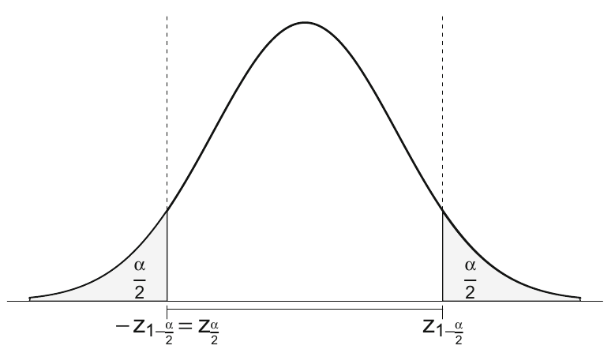
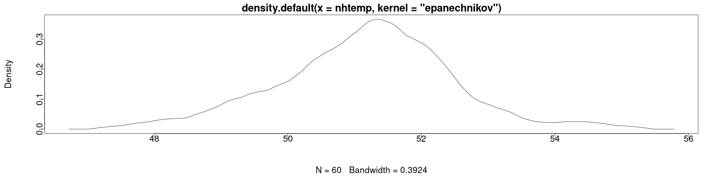

<style>
.section .reveal .state-background {
   background: #ffffff;
}
.section .reveal h1,
.section .reveal h2,
.section .reveal p {
   color: black;
   margin-top: 50px;
   text-align: center;
}
</style>


Confidence intervals and hypothesis testing
========================================================
date: 10/07/2020
autosize: true
incremental: true
width: 1920
height: 1080

<h2 style="text-align:left"> Instructions:</h2>
<p style='text-align:left'>Use the left and right arrow keys to navigate the presentation forward and backward respectively.  You can also use the arrows at the bottom right of the screen to navigate with a mouse.<br></p>

<blockquote>
FAIR USE ACT DISCLAIMER:</br>
This site is for educational purposes only.  This website may contain copyrighted material, the use of which has not been specifically authorized by the copyright holders. The material is made available on this website as a way to advance teaching, and copyright-protected materials are used to the extent necessary to make this class function in a distance learning environment.  The Fair Use Copyright Disclaimer is under section 107 of the Copyright Act of 1976, allowance is made for “fair use” for purposes such as criticism, comment, news reporting, teaching, scholarship, education and research.
</blockquote>


========================================================

<h2>Outline</h2>

<ul>
  <li>The following topics will be covered in this lecture:</li>
  <ul>
    <li>Confidence intervals</li>
    <li>Hypothesis testing parameters</li>
    <li>Hypothesis testing normality</li>
  </ul>
</ul>

========================================================
<h2> Uncertainty Quantification </h2>

* A quick refresher on the idea of uncertainty by example:

 * Suppose <b style="color:#1b9e77">$\hat{\theta}$ is a linear unbiased estimator (rv)</b> for the speed of light $\theta$.
   * This is to say that $\hat{\theta}$ will estimate $\theta$ based on random observations, and <b style="color:#1b9e77">$\hat{\theta}$ is itself a rv</b> that we will take observations of.
 * We will assume that <b>$\theta$ is a deterministic but unknown constant</b>.
 * For sake of example, also suppose that $\hat{\theta}$ has <strong>standard deviation $\sigma_\hat{\theta}$ = 100 km/sec</strong>. 
 * Recall <b>Chebyshev’s inequality</b>, 
 
 $$\begin{align}
 P\left(\vert \hat{\theta} - \theta \vert \geq k \sigma_\hat{\theta}\right) \leq  \frac{1}{k^2}
 \end{align}$$
 
 * We find
 
  $$\begin{align}
 P\left(\vert \hat{\theta} - \theta \vert < 2 \sigma_\hat{\theta}\right) &gt;  \frac{3}{4}
 \end{align}$$

 * This tells us that there is a <strong>probability of at least 75% that $\hat{\theta}$ is within 200 km/sec of the speed of light $\theta$</strong>. 
 
 * Equivalently, $\theta \in (\hat{\theta}-200, \hat{\theta}+200)$ with probability 75%.
 
======================================================== 

<h3> Uncertainty Quantification </h3>
 

* Suppose we <b style="color:#d95f02">observe $\hat{\theta}$ to take the value $299852.4$</b>.

* We can say that  $\theta \in (299652.4, 300 052.4)$ with <b>confidence</b> 75%.
   * Note that <b>$\theta$ is an an unknown constant</b> -- <strong>it is either in the interval or not and there is nothing random about the above statement</strong>.
   * Therefore, we can't say that the probability of $\theta \in (299652.4, 300 052.4)$ is 75%, but we used information to guarantee that our procedure for estimation will work 75% of the time.
   

* Often, we will be concerned with dual questions:

  1. Does our confidence interval for a parameter $\theta$ contain the value $0$? And
  2. how unlikely would it be for $\theta$ to equal zero based on our observations?

* It is actually equivalent to look at the above question of a confidence interval containing a value with confidence in terms of a hypothesis test.


========================================================

<h2> A review of hypothesis testing</h2>

* The process of hypothesis testing is always defined in terms of a <b>null</b> and an <b>alternative hypothesis</b>.

* Hypothesis testing <b>assumes that the null holds</b>, and <strong>finds how surprising it would be to see the observed statistic in the case it was just due to random variation</strong>.

* We always choose a pre-set value of significance <b>$\alpha$ (typically $5\%$)</b> and determine if the <b style="color:#d95f02">probability of finding a value at least as extreme as our observed results is less than $\alpha$</b>.

  * This probability is known as the <b>p-value</b>.
  
* If the <b>p-value falls below $\alpha$</b> <strong>we reject the null hypothesis in favor of the alternative</strong>.

  * On the other hand, if the <b>p-value is greater than $\alpha$</b>, then <strong>we fail to reject the null model</strong>.
  
* Neither indicates causality or the lack thereof, but <b style="color:#1b9e77">are good indications of points for further investigation</b>.

* We should be careful about how much  we can read into the meaning of this  due to the <a href="https://projects.fivethirtyeight.com/p-hacking/" target="blank">saturation of p-values</a>.


========================================================
### Confidence intervals


* For most cases, when estimating a population parameter $\theta$, like $\theta=\mu$, the <strong>sample size n must be large enough so that the estimator $\hat{\theta}$  can be assumed to be normally distributed</strong>. 

* We then make use of the <b>central limit theorem</b> to get a good approximation, even if it may not be strictly accurate.

*  The notion of a normal distribution being a "good" approximation is formalized with the central limit theorem, which we now recall.


========================================================

<h3> Central limit theorem</h3>

<ul>
  <li>Suppose we have a <b>sequence of random variables, $\left\{X_i \right\}_{i=1}^\infty$</b> which are independent, identically distributed <strong>from any distribution</strong>, such that for all $i$
<ol>
  <li> $\mathbb{E}[X_i] = \mu$; and</li>
  <li> $\mathrm{var}(X_i) = \sigma^2$, for some finite $\sigma$.</li>
</ol>
<li> For each $n\geq 1$ define the sample-based mean of the sequence $\left\{X_i \right\}_{i=1}^n$

  $$\begin{align}
  \overline{X}_n =\frac{1}{n} \sum_{i=1}^n X_i
  \end{align}$$</li>

<li> Then, as the number of random variables $n\rightarrow \infty$, the sample-based means
  
  $$\begin{align}
  \sqrt{n}\left(\overline{X}_n - \mu\right) {\xrightarrow {d}} N(0, \sigma^2)
  \end{align}$$
  where the convergence is in distribution.</li>
  
<li> Put another way, <b>for $n$ sufficiently large</b>, <strong>$\overline{X}_n$ has approximately a $N\left(\mu, \frac{\sigma^2}{n}\right)$ distribution</strong>.</li>

========================================================
### Confidence intervals continued

* If we can write the distribution for the sample statistic as approximately $N\left(\mu, \frac{\sigma^2}{n}\right)$, 

  * <strong>we can identify with some probability how often our procedure will work within error thresholds</strong>. 

* The <b>standard error</b> is defined as the <strong>standard deviation of this sample statistic distribution, i.e., $\sigma_{\hat{\theta}}$</strong>.
  
  * this quantifies how far an observed realization is likely to lie away from the true parameter.

* The standard error of the sample mean measures the accuracy of the estimation of the mean,

  * the confidence interval quantifies how close the sample mean is expected to be to the population mean. 

* We will  recall how to construct confidence intervals for the mean of a normal distribution.

========================================================
### Confidence intervals continued

<div style="width:50%; float:left">
<ul>
  <li>Consider a normal population with an <b style="color:#1b9e77">unknown mean $\mu$</b> and <b style="color:#d95f02">known standard deviation $\sigma$</b>.</li>
  <li> Let $X_i \sim N\left(\mu, \sigma^2 \right)$ for $i = 1, \cdots, n$ be the sample rv’s. </li>
  <li> Then for the sample mean of the random variables 
  $$\begin{align}
  \overline{X}_n &= \frac{1}{n}\sum_{i=1}^n X_i \\
  \overline{X}_n &\sim N\left(\mu, \frac{\sigma^2}{n}\right)
  \end{align}$$</li>
  <li> Moreover, we can show that by <b>standardizing the sample mean</b> of the random variables, shifting to mean zero and dividing by the standard deviation, we have
  $$\sqrt{n}\frac{\overline{X}_n -\mu}{\sigma} \sim N(0, 1)$$</li>
  <li>Now, let $z_{1−\frac{\alpha}{2}}$ be defined such that for $Z \sim N(0, 1)$
    $$P\left(-z_{1−\frac{\alpha}{2}}\leq Z \leq z_{1−\frac{\alpha}{2}}\right) = 1 - \alpha$$
  </li>
  <li>Such a choice exists by the symmetry of the standard normal distribution about zero,</li>
</ul>
</div>

<div style="float:left; width:50%" class="fragment">

<p style="text-align:center">
Courtesy of Härdle, W.K. et al. <i>Basic Elements of Computational Statistics</i>. Springer International Publishing, 2017.</p>
</div>

========================================================
### Confidence intervals continued

* Using the results from the last slide, we can say that for $Z= \sqrt{n}\frac{\overline{X}_n -\mu}{\sigma}$,

  $$\begin{align}
  & P\left(-z_{1−\frac{\alpha}{2}}\leq Z \leq z_{1−\frac{\alpha}{2}}\right) = 1 - \alpha \\
  \Leftrightarrow & P\left(-z_{1−\frac{\alpha}{2}}\leq \sqrt{n}\frac{\overline{X}_n -\mu}{\sigma} \leq z_{1−\frac{\alpha}{2}}\right) = 1 - \alpha
  \end{align}$$
  
* We will re-write the interval in the above as follows:
  
  $$\begin{align}
  \left(-z_{1−\frac{\alpha}{2}} \frac{\sigma}{\sqrt{n}}\leq \overline{X}_n -\mu \leq z_{1−\frac{\alpha}{2}}\frac{\sigma}{\sqrt{n}}\right) &=  \left(-\overline{X}_n -z_{1−\frac{\alpha}{2}} \frac{\sigma}{\sqrt{n}}\leq  -\mu \leq -\overline{X}_n+ z_{1−\frac{\alpha}{2}}\frac{\sigma}{\sqrt{n}}\right) \\
  &= \left(\overline{X}_n -z_{1−\frac{\alpha}{2}} \frac{\sigma}{\sqrt{n}}\leq  \mu \leq \overline{X}_n+ z_{1−\frac{\alpha}{2}}\frac{\sigma}{\sqrt{n}}\right)
  \end{align}$$
  
* From the above statement, we can read that
  <blockquote>
  Upon replication of a sample of size $n$, the random interval
  $$\left(\overline{X}_n -z_{1−\frac{\alpha}{2}} \frac{\sigma}{\sqrt{n}}\leq  \mu \leq \overline{X}_n+ z_{1−\frac{\alpha}{2}}\frac{\sigma}{\sqrt{n}}\right)$$
  has a probability of $1-\alpha$ of covering $\mu$.  Particularly, for a given observed sample mean $\overline{x}_n$, constructing a confidence interval as above will keep $\overline{x}_n$ within a radius of $z_{1−\frac{\alpha}{2}}\frac{\sigma}{\sqrt{n}}$ from the true value $\mu$ $(1-\alpha)\times 100\%$ of the time over infinite replications.
  </blockquote>
  
========================================================
### Confidence intervals continued

* The issue with the above approach to confidence intervals is that the <b style="color:#1b9e77">true population value of $\sigma$ is almost never known</b> in any practical application.

* For this reason, we can pass to the <b>student's t-distribution</b> again.

* Recall that we showed that for the sample mean of the normal random variables $\overline{X}_n$; and

* the sample standard deviation of the normal random variables $S$,
  
  $$\frac{\overline{X}_n - \mu}{\frac{S}{\sqrt{n}}} \sim t_{n-1}.$$
  
* Therefore, in practice we can construct the same type of random interval but for a <b>$t_{n-1,1-\frac{\alpha}{2}}$ critical value of $t_n$</b>,
  $$\left(\overline{X}_n -t_{n-1, 1−\frac{\alpha}{2}} \frac{S}{\sqrt{n}}\leq  \mu \leq \overline{X}_n+ t_{n-1,1−\frac{\alpha}{2}}\frac{S}{\sqrt{n}}\right)$$


========================================================
### Hypothesis testing and confidence intervals

* The critical regions depend on the distribution of the test statistics and on the <b>probability of a type I error $\alpha$</b>. 

  * I.e., the <strong>probability of falsely rejecting the null hypothesis</strong>.

* However, we can phrase the above question directly in terms of the probability of <b>falsely rejecting the null hypothesis</b>.

  * When calculating a p-value, we look at the <strong>probability of observing a realization at least as extreme of, e.g., $\overline{X}_n$ under the assumption of the null hypothesis</strong>.
  
* Under the last example, if $\mu_0$ is some proposed value for the mean, we would write the <b>null and alternative hypotheses</b> as follows:

  $$\begin{align}
  H_0: \mu = \mu_0 & & H_1: \mu \neq \mu_0
  \end{align}$$
  
* If we <b style="color:#d95f02">observe a particular value $\overline{x}_n$</b> of the sample mean, then we <b>assume the null hypothesis that $\mu=\mu_0$</b>.

* Under the assumption that $\frac{\overline{X}_n - \mu_0}{\frac{S}{\sqrt{n}}} \sim t_{n-1}$, we calculate the probability of finding a similar observation that is at least as extreme,
  $$\text{p-value} = P\left( \overline{X}_n \leq \overline{x}_n\right) + P \left(\overline{x}_n \leq \overline{X}_n\right)$$
  
* Student’s t test can be used in R through the function `t.test()`, which will include the dual confidence interval.


========================================================
### Student's t-test

* Consider again the dataset `nhtemp`, a sample of size $n = 60$ containing the mean annual temperature $x$ in degrees Fahrenheit in New Haven, Connecticut, 

* This data has a sample mean  of

```r
mean(nhtemp)
```

```
[1] 51.16
```

* We may want to test whether the population mean $\mu$ is equal to the hypothetical value $\mu_0= 50$. 

* This is a two-sided test of the mean:
  
  $$\begin{align}
  H_0: \mu = 50 & & H_1: \mu \neq 50
  \end{align}$$

  where we will assume that $\mu=50$ and produce the test statistic and confidence interval under this assumption.


========================================================
### Student's t-test -- two sided

* In R, we can write the last test as:
  

```r
 t.test(x = nhtemp, alternative = "two.sided",  mu = 50, conf.level = 0.95)
```

```

	One Sample t-test

data:  nhtemp
t = 7.0996, df = 59, p-value = 1.835e-09
alternative hypothesis: true mean is not equal to 50
95 percent confidence interval:
 50.83306 51.48694
sample estimates:
mean of x 
    51.16 
```

* <b>Q:</b> based on the above, using either the confidence interval or the p-value, do we reject or fail to reject the null hypothesis $H_0: \mu = 50$ at $\alpha=5\%$ significance?

* <b>A:</b> notice that the confidence interval does not contain the value $50$ and that the p-value is well below $\alpha=5\%$.

* Therefore, we reject the null hypothesis with $5\%$ significance.

========================================================
### Student's t-test -- one sided

* If we instead write our null and alternative hypothesis as follows:
  
  $$\begin{align}
  H_0: \mu  \geq 50 & & H_1: \mu &lt 50
  \end{align}$$

  we compute a one-sided t-test.
  
* This is to determine if we believe that the mean temperature is likely to be less than $50$ degrees.

*  This can be specified in R as follows:


```r
 t.test(x = nhtemp, alternative = "less",  mu = 50, conf.level = 0.95)
```

```

	One Sample t-test

data:  nhtemp
t = 7.0996, df = 59, p-value = 1
alternative hypothesis: true mean is less than 50
95 percent confidence interval:
     -Inf 51.43304
sample estimates:
mean of x 
    51.16 
```

* Similarly we can make a one sided test for $H_1:\mu &gt; 50$.


========================================================
### Testing $\sigma^2$ of a normal population

* It is also interesting to see <strong>whether the population variance has a certain value of $\sigma_0^2$</strong>.

* With a little modification of $S^2$, one can construct confidence intervals and hypothesis tests for a rv that follows a $\chi^2_{n-1}$ distribution.

* If $X_1 ,\cdots, X_n$ are i.i.d. <b>normal rvs</b>, then we have shown that,
  $$\begin{align}
  \frac{\left(n-1\right)S^2}{\sigma^2} \sim \chi^2_{n-1} && \text{where} & & S^2 = \frac{1}{n-1}\sum_{i=1}^n \left(X_i - \overline{X}\right)^2
  \end{align}$$

* Using a similar argument to the one used with the student's t-distribution, we can <strong>similarly find the critical points for the $\chi^2_{n-1}$ distribution to compute the hypothesis test / confidence interval</strong>.

* To do so, well need to use the `varTest()` from the `EnvStats` library.

========================================================
### Testing $\sigma^2$ of a normal population

* We will generate 100 observations from a normal distribution with mean $\mu =  1$ and standard deviation $\sigma =1$ as follows


```r
set.seed(0)
require("EnvStats")
sample <- rnorm(n=100, mean=1, sd=1)
varTest(sample)
```

```

	Chi-Squared Test on Variance

data:  sample
Chi-Squared = 77.128, df = 99, p-value = 0.1014
alternative hypothesis: true variance is not equal to 1
95 percent confidence interval:
 0.600583 1.051349
sample estimates:
 variance 
0.7790714 
```

* Notice that even with a sample size of $100$, the p-value is low.

* However, because it is above $5\%$ we do not reject the null hypothesis that the variance is equal to $1$ with $5\%$ significance (a type I error).


========================================================
### Shapiro-Wilk test

* Recall, the $\chi^2$-test above required that the sample was observed from <b>normally distributed random variables</b>.

* If we are uncertain of how normal a sample is, we will typically use the Shapiro-Wilk test to evaluate this.

* Suppose we have a set of <b style="color:#d95f02">observations $\{x_i\}_{i=1}^n$</b> of a <b style="color:#1b9e77">random variable $X$</b>.

* The null and alternative hypotheses for this test can be read:

  $$\begin{align}
  H_0:\text{ }X \text{ is normally distributed} & & H_1:\text{ }X\text{ is not normallydistributed}
  \end{align}$$

* This test can be performed in R as follows:


```r
shapiro.test(nhtemp)
```

```

	Shapiro-Wilk normality test

data:  nhtemp
W = 0.98361, p-value = 0.5985
```

* We show that we cannot reject the hypothesis that the New Haven temperature data is normally distributed at $5\%$ significance.


========================================================
### Diagnosing normality visually

* In either conclusion of the hypothesis test, we should make a visual inspection to diagnose what may problematic about this distribution.

  * For example, if we reject the null, it does not tell us in what way this is non-normal.

* Visually we can inspect the data with the density


```r
par(cex = 1.75, mai=c(1.5,1.5,.5,.5), mgp=c(3,0,0))
plot(density(nhtemp, kernel = "epanechnikov"))
```



* Here we can see that while not perfectly bell-shaped, this does not deviate strongly from normality.


========================================================
### Testing the variance of real data

* Having shown that we <strong>cannot reject the normality of the `nhtemp` data</strong>, this puts us on better footing for using the $\chi^2$-test of variance.

* We have <b>not proven that the data is normal</b>, but if we reject normality, we have no business using this test.

* Consider, the null and alternative hypotheses
  $$\begin{align}
  H_0:\sigma^2 = 1 & & H_1:\sigma^2 \neq 1
  \end{align}$$

* We evaluate this in R as follows:


```r
varTest(as.numeric(nhtemp))
```

```

	Chi-Squared Test on Variance

data:  as.numeric(nhtemp)
Chi-Squared = 94.504, df = 59, p-value = 0.004578
alternative hypothesis: true variance is not equal to 1
95 percent confidence interval:
 1.150840 2.382743
sample estimates:
variance 
1.601763 
```

* This gives us an estimate thus of the variance of the mean annual temperature in New Haven, where we reject the null hypothesis at $5\%$ significance.
