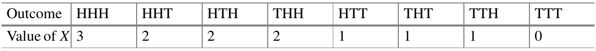
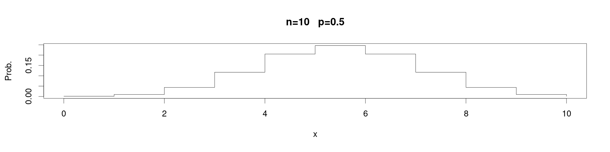
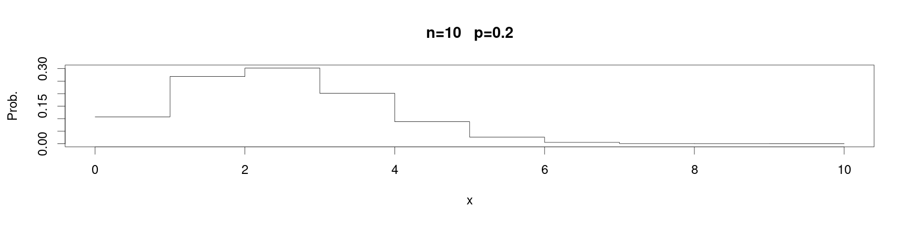
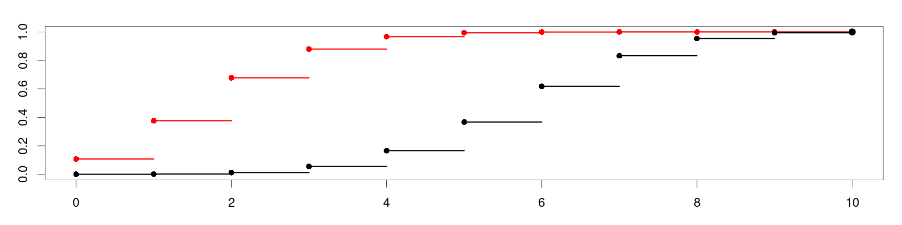
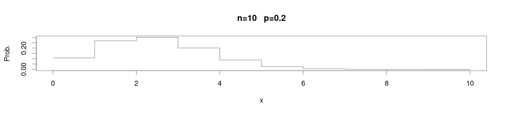
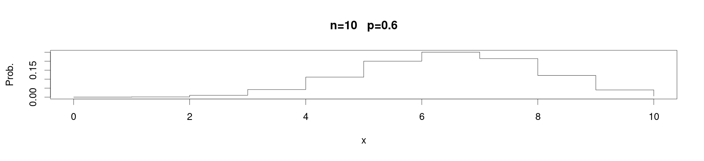
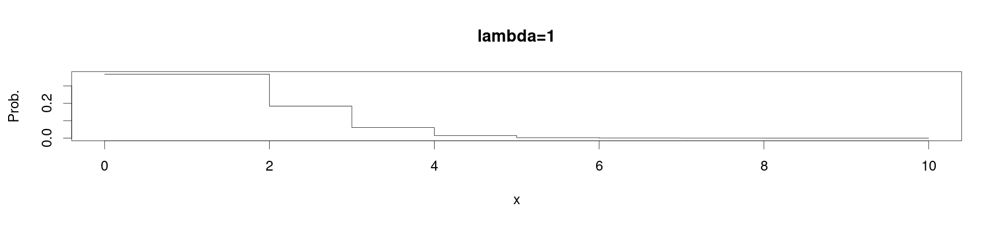
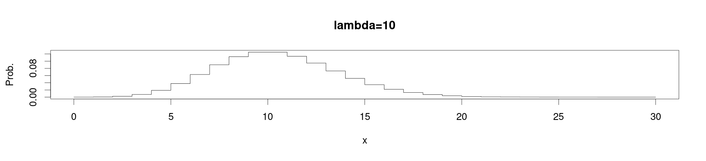

<style>
.section .reveal .state-background {
   background: #ffffff;
}
.section .reveal h1,
.section .reveal h2,
.section .reveal p {
   color: black;
   margin-top: 50px;
   text-align: center;
}
</style>


A review of discrete probability distributions and random variables
========================================================
autosize: true
incremental: true
width: 1920
height: 1080

<h2 style="text-align:left"> Instructions:</h2>
<p style='text-align:left'>Use the left and right arrow keys to navigate the presentation forward and backward respectively.  You can also use the arrows at the bottom right of the screen to navigate with a mouse.<br></p>

<blockquote>
FAIR USE ACT DISCLAIMER:</br>
This site is for educational purposes only.  This website may contain copyrighted material, the use of which has not been specifically authorized by the copyright holders. The material is made available on this website as a way to advance teaching, and copyright-protected materials are used to the extent necessary to make this class function in a distance learning environment.  The Fair Use Copyright Disclaimer is under section 107 of the Copyright Act of 1976, allowance is made for “fair use” for purposes such as criticism, comment, news reporting, teaching, scholarship, education and research.
</blockquote>


========================================================

<h2>Outline</h2>

<ul>
  <li>The following topics will be covered in this lecture:</li>
  <ul>
    <li>A review of discrete random variables</li>
    <li>A review of Bernoulli and Binomial random variables</li>
    <li>Poisson random variables</li>
  </ul>
</ul>


========================================================
## Random variables

* The outcomes of a probabilistic experiment can be described by a random variable $X$. 

  * A random variable $X$ can be understood as a map that depends on the real-world outcome of events and assigns the real-world outcome a numeric value.
  
* If $\Omega$ is the event space, a random variable will take an event $\omega\in\Omega$ to a real value in $\mathbb{R}$. 
  
  * For example, $X$ can be the number of heads in the outcome of two coin flips
  
  * $\Omega$ will be the set of possible outcomes
  
  $$\Omega = \{ \{H,H\}, \{H,T\}, \{T, H\}, \{T,T\}\}$$
  
  * $X$ will take an event, e.g., $\{H,H\}$ and map this value to $2 \in \mathbb{R}$.
  
* With a finite number $k$ of possible outcomes, e.g., the outcome of two fair coin flips, we can create a set of possible values $x_j$ for $X$, as $j = \{1, \cdots , k\}$.

* More generally, we will say that a random variable $X$ is discrete if the values that $X$ can attain $x_j$ can be made into a collection $\{x_j\}_{j=1}^k$ for a finite $k$ or even for an infinite collection $\{x_j\}_{j=1}^\infty$, so long as they can be enumerated in this way.

* This differs from continuous random variables, for which it is impossible to index the entire collection of possible values as above.


========================================================
### Random variables


* Intuitively the difference between a discrete random variable and a continuous random variable has to do with the units in which they are measured.

* A continuous random variable has a unit of measurement that can be arbitrarily sub-divided,

  * for example, if we measure temperature in degrees C, if we had an ideal thermometer we could measure the temperature to an arbitrary decimal precision.
  
* However, discrete random variables usually take the form of a counting unit.

  * If we are counting the number of calls in a call center in a day, the scale could feasibly go to infinity, but the unit of one call can't be meaningfully sub-divided.
  

========================================================
### Discrete random variables

* The distribution of a discrete rv is described by its probability mass function $f(x_j)$
and the cumulative distribution function $F(x_j)$.

*  The probability mass function $f$ of a discrete rv $X$ is a function that returns the <b>probability that $X$ is exactly equals to some value</b>, i.e., for some indexed possible outcome $x_j$,
  $$\begin{align}
  f(x_j) = P(X=x_j).
  \end{align}$$

* The cumulative distribution function $F$ (cdf) is defined for variables with the ordering, $x_j &lt; x_{j+1}$,
  and returns the probability, that $X$ is smaller than or equal to some value:
  $$F(x_j) = P( X \leq x_j).$$

* Using the notion of the probability mass function, we can define the expected value of a discrete random variables as,
  $$\begin{align}
  \mathbb{E}\left[ X\right] &= \sum_{j=1}^k x_j P(X=x_j)
  \end{align}$$
  

========================================================
### Discrete random variables
  

* Note that by definition, $\sum_{j=1}^k P(X = x_j) =1$; this can be shown by taking the probability of all events as a union and using the property that these simple events are disjoint.

* Therefore, $\mathbb{E}$ in the above represents a weighted average of all possible values that $X$ might attain, where higher weight is given to higher probability outcomes.

  * The classical interpretation of the expected value in this way is as the center of mass for the probability of attainable values of $X$.
  
* The expected value can also be understood as the mean in a special sense:

  * suppose we took infinitely many replications of an experiment  $$\begin{align}
  \mathbb{E}\left[ X\right] &= \sum_{j=1}^k x_j P(X=x_j)
  \end{align}$$ and $X$ is the observed numerical outcome of this experiment; 
  
  * then if we were able to take the average of the observed values for $X$ over all the infinite replications, the mean would be $\mathbb{E}\left[X\right]$.
  

========================================================
### Discrete random variables

* The expected value gives an important interpretation of a random variable in terms of how the mass is centered, or equivalently, the region around which we believe most observations will lie.

* However, another critical notion is that of how much spread or dispersion will there be in the data around this center of mass.

* Let $X$ be a discrete rv with distinct values $\{x_1 , \cdots , x_k \}$ and probability mass
function $P(X = x_j ) \in [0, 1]$ for $j \in \{1, \cdots , k\}$. 

* Then the variance of $X$ is defined to be,
  $$\begin{align}
  \mathrm{var}(X) &= \mathbb{E}\left[\left\{X - \mathbb{E}\left(X\right)\right\}^2\right]\\
  &=\sum_{j=1}^k \left\{x_j - \mathbb{E}\left(X\right)\right\}^2 P(X=x_j)
  \end{align}$$
  
* These same ideas generalize to when $k \rightarrow \infty$ provided that the sums remain finite (i.e., they are convergent in the same sense as Riemann sums).

* In fact, the same approach of understanding this in terms of Riemann sums will be the basis for the expected value of a continuous random variable;

  * we will see later that the expected value is defined in terms of the integral for continuous rvs.
  


========================================================
## Bernoulli random variables

* A Bernoulli experiment is a random experiment with two outcomes: success or failure. 
  
  * This can be considered as a generalization of a fair coin flip to a case in which the sides may be weighted differently.

* Let $p$ denote the probability of the success of each trial and let the rv $X$ be equal to $1$ if the outcome is a success and $0$ if a failure. 

* Then the probability mass function of $X$ is
  $$\begin{align}
  P(x) = 
  \begin{cases}
  P(X=1) = p \\
  P(X=0) = 1-p
  \end{cases}
  \end{align}$$

* <b>Q:</b> Using the definition of the expected value,
  
  $$\begin{align}
  \mathbb{E}\left[ X\right] &= \sum_{j=1}^k x_j P(X=x_j)
  \end{align}$$
  
  can you find the expected value of of the Bernoulli rv $X$?
  
* <b>A:</b> Using the definition, we have

  $$\begin{align}
  \mathbb{E} &=  1\times P(X=1) + 0 \times P(X=0) \\
  & = p
  \end{align}$$

========================================================
### Bernoulli random variables


* <b>Q:</b> Using the definition of the variance,
  
  $$\begin{align}
  \mathrm{var}\left(X\right) &=\sum_{j=1}^k \left\{x_j - \mathbb{E}\left(X\right)\right\}^2 P(X=x_j)
  \end{align}$$
  
  can you find the variance of of the Bernoulli rv $X$?
  
* <b>A:</b> Using the definition, we have

  $$\begin{align}
  \mathrm{var}(X) &= \left\{1 - p\right\}^2 P(X=1) + \left\{0 - p \right\}^2 P(X=0) \\
  & = \left\{1 - 2p + p^2 \right\}p + p^2(1-p)\\
  & = (1-p)p
  \end{align}$$


========================================================
### Bernoulli random variable example

* While we can prototypically think of a Bernoulli variable as representing a (possibly) unfair coin flip, it can be used to represent any success failure trial based on some <strong>proportion</strong>.  

* Consider a box containing <b style="color:red">two red marbles</b> and <b style="color:blue">eight blue marbles</b>. 

* Let $X = 1$ if the drawn marble is red and $0$ otherwise. 

* The probability of randomly selecting one red marble and the expectation of $X$ at one try is 
 
 $$\begin{align}
 \mathbb{E}\left[ X \right]= P(X = 1) = 1/5 = 0.2. 
 \end{align}$$
 
* The variance of $X$ is 
  
  $$\begin{align}
  \mathrm{var}\left(X\right) = \frac{1}{5}\left(1 − \frac{1}{5}\right) = \frac{4}{25}.
  \end{align}$$
  
========================================================
## Binomial random variables

<ul>
  <li>A sequence of Bernoulli experiments performed $n$ times is called a binomial experiment.</li>
  <li> A binomial experiment satisfies the following requirements:</li>
  <ol>
    <li>there are only two possible outcomes for each trial;</li>
    <li>all the trials are independent of each other;</li>
    <!-- <li>the probability of each outcome remains constant;</li> -->
    <li>the number of trials is fixed.</li>
  </ol>
  <li> The following example illustrates a binomial experiment. 
  <li>When tossing a fair coin three times, eight different possible results may occur, each with equal probability
$\frac{1}{8}$. </li>
  <li>Let $X$ be the rv denoting the number of heads obtained in these three tosses.</li> 
  <li>The sample space $\Omega$ and possible values for $X$ are in the table below:
  <div class="fragment" style="float:left; width:80%">
  
<p style="text-align:center">
Courtesy of Härdle, W.K. et al. <i>Basic Elements of Computational Statistics</i>. Springer International Publishing, 2017.</p>
  </div>

  
========================================================
### Binomial random variables

<div class="fragment" style="float:left; width:80%">
  
<p style="text-align:center">
Courtesy of Härdle, W.K. et al. <i>Basic Elements of Computational Statistics</i>. Springer International Publishing, 2017.</p>
<div style="float:left; width:100%">
<ul>
  <li>One is often interested in the total number of successes and the corresponding probabilities, instead
of the outcomes themselves or the order in which they occur. 
  <li>For the above case, it follows that,
  $$P(X=2)= \frac{\left\vert\left\{ \{H,H,T\}, \{H,T,H\}, \{T,H,H\} \right\}\right\vert}{\vert \Omega\vert} = \frac{3}{8}$$</li>
  <li>We can derive these individually, but for the general case of a Binomial trial with probability of success $p$ and $n$ independent replications we have
  $$\begin{align}
  P(X=j) = {n \choose j} p^j \left( 1 - p\right)^{n - j}  & & j\in\{0, 1, \cdots, n\}
  \end{align}$$</li>
  <li>I.e., if you select an number of possible successes $j$ between all and none, the probability of exactly $j$ successes is given as above.</li>
</ul>

========================================================
### Binomial random variables

* Returning to a marbles example, suppose we randomly draw ten marbles one at a time from an urn, while putting it back each time before drawing again.

* Putting the marbles back in the urn keeps the trials <b>independent with the same probability on each trial</b>.

* Suppose that we have two red marbles in the urn and eight blue marbles in the urn.

* Recall the definition of the probability mass function,
  
  $$\begin{align}
  P(X=j) = {n \choose j} p^j \left( 1 - p\right)^{n - j}  & & j\in\{0, 1, \cdots, n\}.
  \end{align}$$</li>
  
* <b>Q:</b> what is the probability of drawing exactly two red marbles?  Can you fill in the appropriate substitutions?


* <b>A:</b> here, the number of draws $n = 10$ and we define getting a red marble as a success with $p = 0.2$ and $j = 2$. 

* Hence $X$ is binomial distributed with a probability of $j=2$ successes as

  $$\begin{align}
  P(X=2) &= {10 \choose 2} (0.2)^2 \left(0.8\right)^{8}  \approx 
  \end{align}$$


```r
dbinom(x=2, size=10, prob=0.2)
```

```
[1] 0.3019899
```

========================================================
### Binomial random variables

* The function `dbinom()` calculates probability mass function for a particular outcome `X=x` given a probability of success `prob` and a number of independent trials `size`.

* We can plot the entire probability distribution as a histogram as in the following:


```r
par(cex = 2.0, mar = c(5, 4, 4, 2) + 0.3)
f = dbinom(x=0:10, size=10, prob=0.2)
plot(x=0:10, f, type = "s", main = "n=10   p=0.2", xlab = "x", ylab = "Prob.")
```


* Here, we set the number of successes as a vector, so that the output will be the vector of probability mass values for each possible number of successes.

========================================================
### Binomial random variables

* Notice how the histogram of the probability changes for different values of of the probability of success:


```r
par(cex = 2.0, mar = c(5, 4, 4, 2) + 0.3)
f = dbinom(x=0:10, size=10, prob=0.5)
plot(x=0:10, f, type = "s", main = "n=10   p=0.5", xlab = "x", ylab = "Prob.")
```



* While the distribution was skewed in the case that the probability of success was lower than the probability of failure, when they are equal we recover a symmetric distribution.

========================================================
### Binomial random variables

* The cumulative distibution function is given as,
  
  $$\begin{align}
  F_X(j) = P(X\leq j) = \sum_{i=1}^j {n \choose i} p^i \left(1-p\right)^{n-i}
  \end{align}$$
  
* Notice that this is is written as the sum of the probability mass functions for each number of successes less than or equal to the max value $j$.

* This corresponds, again, to the notion that we can take the sum of probabilities to find the probability of a union of disjoint events -- pictorially, this corresponds identically to the total area under the density curve for $j\in[0,2]$:


```r
par(cex = 2.0, mar = c(5, 4, 4, 2) + 0.3)
f = dbinom(x=0:10, size=10, prob=0.2)
plot(x=0:10, f, type = "s", main = "n=10   p=0.2", xlab = "x", ylab = "Prob.")
```




========================================================
### Binomial random variables


* While the CDF of the binomial is a complicated object, the value of the cumulative distribution function can be computed directly in R as follows:


```r
pbinom(q=2, size=10, prob=0.2)
```

```
[1] 0.6777995
```

* As the output of the CDF function directly, or


```r
sum(dbinom(x=0:2, size=10, prob=0.2))
```

```
[1] 0.6777995
```

* as the sum of the vector of the probability mass values for each possible realization between $0$ and $2$.


========================================================
### Binomial random variables

* In our recommended book, there is an example of how one can visualize the CDF of the binomial by creating a user-defined plotting function;

  * the following code is drawn from the book and shared in the <a href="https://github.com/QuantLet/BCS/tree/master/BCS_Bincdf" target="blank">author's Github</a>:


```r
create.binomial.cdf = function(N, p, colour = "black", pch = 16) {
    n = max(length(N), length(p), length(colour), length(pch))
    N = rep(N, length = n)
    p = rep(p, length = n)
    colour = rep(colour, length = n)
    pch = rep(pch, length = n)
    
    add.one.series = function(N, p, colour, pch, maxN) {
        cdf = pbinom(0:N, N, p)
        # lines(0:N, cdf, type='s', col=colour)
        for (i in 1:N) lines(c(i - 1, i), c(cdf[i], cdf[i]), type = "s", col = colour, lwd = 3)
        lines(c(N, maxN), c(1, 1), type = "b", col = colour, lwd = 3)
        
        points(0:N, cdf, col = colour, pch = pch)
    }
    
    # par(lwd=1.5, cex=1, mar=c(3.1,2.5,0.5,0.5))
    plot(1, xlim = c(0, max(N)), ylim = c(0, 1), type = "n", xlab = "x", ylab = "Probability")
    for (i in 1:n) add.one.series(N[i], p[i], colour[i], pch[i], max(N))
}
```


========================================================
### Binomial random variables

* Running the plotting function from the last slide, we have 

```r
par(cex = 2, mai = c(b = 1.2, l = 1.2, t = 0.7, r = 0.5))
create.binomial.cdf(c(10, 10), c(0.2, 0.6), c("red", "black"))
```



* Notice in the arguments above, we have supplied two CDF functions to be plotted for $10$ trials each, but for probabilities of success as <b style="color:red">$p=0.2$ in red</b> and <b>$p=0.6$ in black</b>.

* We can clearly see the faster rate at which the CFD with probability of success <b style="color:red">$p=0.2$</b> approaches $1$...

========================================================
### Binomial random variables

* This can be understood again as this corresponds to the area under the density curve for $n=10$ for either $p=0.2$ or $p=0.6$:

*  





========================================================
### Binomial random variables

* Recall that for a Bernoulli rv with probability $p$ of success, the expected value is $\mathbb{E}\left[X\right] = p$.

* <b>Q:</b> using the fact that a Binomial rv $Y$ in $n$ trials can be written as a sum of $n$ independent Bernoulli variables $\{X_j\}_{j=1}^n$ with the same probability of succes $p$, what is the expected value of $Y$?

  * <b>A:</b> the expectation can be taken linearly over sums, so that,
  $$\begin{align}
  \mathbb{E}\left[Y\right]&= \mathbb{E}\left[ \sum_{j=1}^n X_j\right]  \\
  &=\sum_{j=1}^n \mathbb{E}\left[X_j\right] \\
  &= \sum_{j=1}^n p = n\times p
  \end{align}$$
  
* <b>Q:</b> can you use a similar property to find the variance of the Binomial rv $Y$?

  * <b>A:</b> consider, we can write the variance of $Y$ as
  $$\begin{align}
  \mathrm{var}\left(Y\right) &= \mathbb{E}\left[\left\{Y - \mathbb{E}\left(Y\right)\right\}^2\right] \\
  &= \mathbb{E}\left[\left\{Y - np \right\}^2\right] = \mathbb{E}\left[\left\{\sum_{j=1}^n \left(X_j - \mathbb{E}\left[X_j\right]\right)\right\}^2\right]
  \end{align}$$

========================================================
### Binomial random variables

<ul>
  <li> Following the last slide we will write,
  $$\begin{align}
  \mathrm{var}\left(Y\right) &= \mathbb{E}\left[\left\{\sum_{j=1}^n \left(X_j - \mathbb{E}\left[X_j\right]\right)\right\}^2\right]
  \end{align}$$</li>
  <li>To finally solve this, we will need to invoke two properties:</li>
  <ol>
    <li>For two <b>independent variables $X_i, X_j$</b>, the expected value of the product can be computed as   $$\mathbb{E}\left[X_i\times X_j\right] = \mathbb{E}\left[X_i\right]\times\mathbb{E}\left[X_j\right].$$</li>
    <li>If $\mu_{j}$ is the expected value of the variable $X_j$, then $\mathbb{E}\left[X_j - \mu_j\right] = 0$.</li>
  </ol>
  <li><b>Q:</b> if you have not solved this problem already, how can we invoke the two above properties to simplify the expression for the variance of $Y$?</li>
  <ul>
    <li><b>A:</b> with the above two expressions, we know that the cross terms in expanding the square must vanish under the expectation, i.e.,
    $$\mathbb{E}\left[2 \left(X_j - p \right)\left(X_i -p\right)\right] = 2 \times \mathbb{E}\left[\left(X_j - p \right)\right] \mathbb{E}\left[\left(X_i -p\right)\right] = 2\times 0 \times 0.$$</li>
    <li>Using the above property, one has,
    $$\begin{align}
    \mathrm{var}\left(Y\right) = \sum_{j=1}^n \mathrm{var}\left(X_j\right) = n(1-p)
    \end{align}$$
  </ul>
</ul>
 
 
 
 
========================================================
### Binomial random variables

  
* Given two binomial rvs $X \sim B(n, p)$ and $Y \sim B(m, p)$, the sum of the two rvs also follows a binomial distribution $X + Y \sim B(n + m, p)$ with expectation $(m + n) p$. 

* Intuitively, $n$ independent Bernoulli experiments and another $m$ independent Bernoulli experiments again follow a binomial distribution: that of $(n + m)$ independent Bernoulli experiments.
  
  * Proving these results can be performed directly like in the last two arguments, and it is left to the viewer to verify these facts.
  

========================================================
## Poisson distribution


* The Poisson distribution is closely related to the binomial distribution. 

* The example of tossing a die has already been introduced for the binomial distribution, 

  * suppose instead we simultaneously toss $1000$ unusual dice with $100$ sides each, how can we calculate the probability of a certain number of dice showing the same face? 
  
* This is an example of a distribution for the arrival of an event, which itself has a low probability, over a large number of trials.

  * While any particular trial is unlikely to successful, in total there will likely be some successes.
  
* A good practical example is how we model the arrival times of customers in lines.

  * This is often described by what is known as a Poisson process.

* We will "derive" the Poisson distribution by taking an approximate limit of the binomial distribution.

* Suppose that $X$ is a $B(n, p)$ variable, then the probability mass function is
 $$\begin{align}
 P(X=j) = {n \choose j} p^j \left(1 - p\right)^{n-j}
 \end{align}$$

* We will define the product $\lambda = n p$, so that we have the following substitutions:

  * $p = \frac{\lambda}{n}$;
  * $(1-p) = \left(1-\frac{\lambda}{n}\right)$;


========================================================
### Poisson distribution

* Using the previous two substitutions we have
 $$\begin{align}
 P(X=j) &= \frac{n!}{j!\left(n-j\right)!} \left(\frac{\lambda}{n}\right)^j \left(1 - \frac{\lambda}{n}\right)^{n-j} \\ \\
 &= \frac{n!}{j!\left(n-j\right)!} \frac{\lambda^j}{n^j} \frac{\left(1 - \frac{\lambda}{n}\right)^{n}}{\left(1 - \frac{\lambda}{n}\right)^{j}} \\ \\
 &= \left(\frac{n!}{n^j\left(n-j\right)!}\right)\left(\frac{\lambda^j}{j!}\right)\left(\frac{\left(1 - \frac{\lambda}{n}\right)^{n}}{\left(1 - \frac{\lambda}{n}\right)^{j}}\right)
 \end{align}$$
 
* The reason to write the probability mass function in this way is to take advantage now of some special properties when <strong>$n$ is large and $p$ is small</strong>.
 
* Particularly,
  $$\begin{align}
  \left(\frac{n!}{n^j\left(n-j\right)!}\right) \approx 1, & &
  \left(1 - \frac{\lambda}{n}\right)^{n} \approx \exp\{-\lambda\}, & & \text{ and } & &
  \left(1 - \frac{\lambda}{n}\right)^{j}\approx 1
  \end{align}$$
  
========================================================
### Poisson distribution

* Putting together the relationship  in the last slide, we have for $n$ large and $p$ small,

  $$P(X=j) \approx \frac{\lambda^j}{j!} \exp\{-\lambda\}$$
  
* In the above, the right-hand-side is the probability mass function for a Poisson variable giving the probability of an event occurring $j$ times in a fixed interval, with the mean number of times this will occur in an interval equal to $\lambda$.

* As the number of trials $n$ goes to infinity or the probability of success $p$ goes to zero, then the equality holds in a limiting manner.

  * All binomial trials must be independent, the probability of "success" must be low and fixed in every trial, while at the same time the total number of trials being very large.

* As a rule of thumb, if $p \leq 0.1$, $n \geq 50$ and $np \leq 5$, the above approximation will work well.

========================================================
### Poisson distribution

<ul>
  <li>More directly, we will define a Poisson random variable as follows:</li>
  <li>Suppose we have a <b>random process</b> which has <strong>outcomes measured in some interval</strong> (time / distance / volume / etc...).</li> 
  <li>Let $X$ be the <b>random variable</b> equal to the <strong>number of occurrences of the random process in a given interval</strong>.</li>
  <ul>
    <li>The random variable $X$ takes outcomes of the process to values <strong>including $0, 1 ,2, \cdots$ up to arbitrarily large, finite values</strong>.</li>
  </ul>
  <li>Suppose that the <b>expected number of occurrences</b> in any given interval is the <strong>fixed value $\lambda$</strong>.</li>
  <li>Also suppose that the <b>number of occurrences</b> in any given interval is <strong>independent</strong> of the number of occurrences in <strong>any other given interval</strong>;</li>
  <ul>
    <li>the value $X$ attains during one (hour / mile / $\mathrm{cm}^3$ / etc...) doesn't affect the value it attains in any other.</li>
  </ul>
  <li>Then, $X$ can be modeled with a Poisson distribution with parameter $\lambda$, denoted as $Pois(\lambda)$ and the <b>probability of exactly $j$ occurrences</b> of the process <strong>in a given interval</strong> is

  $$\begin{align}
  P(X=j) = \frac{\lambda^j}{j!} \exp\{-\lambda\} & &\text{ for } j\in\{0,1,\cdots\}, \text{ and } \lambda &gt; 0.
  \end{align}$$</li>
  <li> Note that, unlike a binomial, the expectation and the variance of a Poisson rv $X$ are equal with $\mathbb{E}\left[X\right] = \lambda$ and $\mathrm{var}\left(X\right) = \lambda$. </li>
</ul>


========================================================
### Poisson distribution

* Let's recall our probability mass function,
  
  $$\begin{align}
  P(X=j) = \frac{\lambda^j}{j!} \exp\{-\lambda\}
  \end{align}$$

* As an example, suppose a typist makes on average one typographical error per page under normal working conditions.  

* <b>Q:</b> Can we model the number of typographical errors per page with a Poisson distribution?  What needs to be satisfied?  

  * <b>A:</b> Yes, this models the occurrence of independent events (typos) with low-probability in a fixed interval (one page) where one event does not change the probability of any other event (under normal working conditions).

* <b>Q:</b> what is the probability of exactly two errors in a one-page text?
  
  * <b>A:</b> we can compute this directly as,
  $$P(X=2) = \frac{1^2}{2!}\exp\{-1\} \approx$$
  

```r
dpois(x=2, lambda=1)
```

```
[1] 0.1839397
```

========================================================
### Poisson distribution

* Using the same kind of plotting code from the previous examples, and using the `dpois` probability mass function, we can visualize the distribution as


* If instead, the mean number of typos per page is instead $\lambda=10$, we can see how the distribution will change its shape,



========================================================
### Poisson distribution

* Poisson random variables have some very nice properties that we will will just mention in the following.

* Let $X_j \sim Pois(\lambda_j)$ be independent and Poisson distributed rvs with parameters $\lambda_1, \lambda_2, \cdots, \lambda_n$. 

* Then their sum is an rv also following the Poisson distribution with $\lambda = \sum_{j=1}^n\lambda_j$, i.e.,

  $$\left(\sum_{j=1}^n X_j \right) \sim Pois(\lambda)$$
  
* Moreover, the Poisson distribution belongs to the <b>exponential family of distributions</b>. 

* Generally, a rv $X$ follows a distribution belonging to the exponential family if its probability mass function with a single parameter $\theta$ has the form
  $$\begin{align}
  P(X=x) = h(x) g(\theta)\exp\{h(\theta)t(x)\}
  \end{align}$$


* For the Poisson distribution $h(x) = \frac{1}{x!}$, $g(\theta) = \lambda^x$, $\eta(\theta ) = −\lambda$ and $t(x) = 1$. 

*  Other popular distributions, such as the normal / Gaussian, exponential, $\Gamma$, $\chi^2$ and Bernoulli, belong to the exponential family and will be discussed further on in the course.

