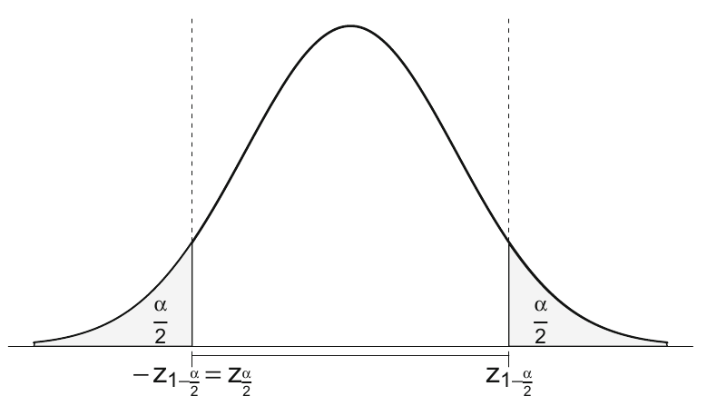
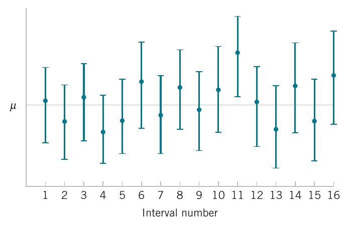

<style>
.section .reveal .state-background {
   background: #ffffff;
}
.section .reveal h1,
.section .reveal h2,
.section .reveal p {
   color: black;
   margin-top: 50px;
   text-align: center;
}
</style>


Confidence intervals and hypothesis testing Part II
========================================================
autosize: true
incremental: true
width: 1920
height: 1080

<h2 style="text-align:left"> Instructions:</h2>
<p style='text-align:left'>Use the left and right arrow keys to navigate the presentation forward and backward respectively.  You can also use the arrows at the bottom right of the screen to navigate with a mouse.<br></p>

<blockquote>
FAIR USE ACT DISCLAIMER:</br>
This site is for educational purposes only.  This website may contain copyrighted material, the use of which has not been specifically authorized by the copyright holders. The material is made available on this website as a way to advance teaching, and copyright-protected materials are used to the extent necessary to make this class function in a distance learning environment.  The Fair Use Copyright Disclaimer is under section 107 of the Copyright Act of 1976, allowance is made for “fair use” for purposes such as criticism, comment, news reporting, teaching, scholarship, education and research.
</blockquote>


========================================================

<h2>Outline</h2>

<ul>
  <li>The following topics will be covered in this lecture:</li>
  <ul>
    <li>Confidence intervals</li>
    <li>Hypothesis testing</li>
    <li>Types of errors</li>
    <li>General hypothesis testing of the mean</li>
  </ul>
</ul>


========================================================
## Confidence intervals

* Recall again the <b>sampling distribution</b> for the sample mean; 

  * if we can write the <strong>distribution for the sample statistic</strong> as approximately $N\left(\mu, \frac{\sigma^2}{n}\right)$, 

* we can identify <strong>with some probability</strong> <b>how accurate our estimate for the true mean</b> is. 

* The <b>standard error</b> is defined as the <strong>standard deviation of this sample statistic distribution, i.e., $\sigma_{\hat{\theta}}$</strong>.
  
  * this quantifies how far an observed realization is likely to lie away from the true parameter.

* The standard error of the sample mean measures the accuracy of the estimation of the mean,

  * Respectively, <b>confidence intervals</b> <strong>quantify how close the sample mean is expected to be to the population mean</strong>. 

* We will recall how to construct confidence intervals for the mean of a normal distribution.

========================================================
### Confidence intervals continued

<div style="width:50%; float:left">
<ul>
  <li>Consider a normal population with an <b style="color:#1b9e77">unknown mean $\mu$</b> and <b style="color:#d95f02">known standard deviation $\sigma$</b>.</li>
  <li> Let $X_i \sim N\left(\mu, \sigma^2 \right)$ for $i = 1, \cdots, n$ be the sample rv’s. </li>
  <li> Then for the sample mean of the random variables 
  $$\begin{align}
  \overline{X}_n &= \frac{1}{n}\sum_{i=1}^n X_i \\
  \overline{X}_n &\sim N\left(\mu, \frac{\sigma^2}{n}\right)
  \end{align}$$</li>
  <li> Moreover, we can show that by <b>standardizing the sample mean</b> of the random variables, shifting to mean zero and dividing by the standard deviation, we have
  $$\sqrt{n}\frac{\overline{X}_n -\mu}{\sigma} \sim N(0, 1)$$</li>
  <li>Now, let $z_{1−\frac{\alpha}{2}}$ be defined such that for $Z \sim N(0, 1)$
    $$P\left(-z_{1−\frac{\alpha}{2}}\leq Z \leq z_{1−\frac{\alpha}{2}}\right) = 1 - \alpha$$
  </li>
  <li>Such a choice exists by the symmetry of the standard normal distribution about zero,</li>
</ul>
</div>

<div style="float:left; width:50%" class="fragment">

<p style="text-align:center">
Courtesy of Härdle, W.K. et al. <i>Basic Elements of Computational Statistics</i>. Springer International Publishing, 2017.</p>
</div>

========================================================
### Confidence intervals continued

* Using the results from the last slide, we can say that for $Z= \sqrt{n}\frac{\overline{X}_n -\mu}{\sigma}$,

  $$\begin{align}
  & P\left(-z_{1−\frac{\alpha}{2}}\leq Z \leq z_{1−\frac{\alpha}{2}}\right) = 1 - \alpha \\
  \Leftrightarrow & P\left(-z_{1−\frac{\alpha}{2}}\leq \sqrt{n}\frac{\overline{X}_n -\mu}{\sigma} \leq z_{1−\frac{\alpha}{2}}\right) = 1 - \alpha
  \end{align}$$
  
* We will re-write the interval in the above as follows:
  
  $$\begin{align}
  \left(-z_{1−\frac{\alpha}{2}} \frac{\sigma}{\sqrt{n}}\leq \overline{X}_n -\mu \leq z_{1−\frac{\alpha}{2}}\frac{\sigma}{\sqrt{n}}\right) &=  \left(-\overline{X}_n -z_{1−\frac{\alpha}{2}} \frac{\sigma}{\sqrt{n}}\leq  -\mu \leq -\overline{X}_n+ z_{1−\frac{\alpha}{2}}\frac{\sigma}{\sqrt{n}}\right) \\
  &= \left(\overline{X}_n -z_{1−\frac{\alpha}{2}} \frac{\sigma}{\sqrt{n}}\leq  \mu \leq \overline{X}_n+ z_{1−\frac{\alpha}{2}}\frac{\sigma}{\sqrt{n}}\right)
  \end{align}$$
  
* From the above statement, we can read that
  <blockquote>
  Upon replication of a sample of size $n$, the random interval
  $$\left(\overline{X}_n -z_{1−\frac{\alpha}{2}} \frac{\sigma}{\sqrt{n}}\leq  \mu \leq \overline{X}_n+ z_{1−\frac{\alpha}{2}}\frac{\sigma}{\sqrt{n}}\right)$$
  has a probability of $1-\alpha$ of covering $\mu$.  Particularly, for a given observed sample mean $\overline{x}_n$, constructing a confidence interval as above will keep $\overline{x}_n$ within a radius of $z_{1−\frac{\alpha}{2}}\frac{\sigma}{\sqrt{n}}$ from the true value $\mu$ $(1-\alpha)\times 100\%$ of the time over infinite replications.
  </blockquote>
  
========================================================

### Confidence intervals continued

<div style="float:left; width:60%">
<ul>
  <li>What we are imagining when we construct confidence intervals is the following.</li>
  <li>Based on some <b>particular sample</b> $X_{j,1},\cdots, X_{j,n}$ of size $n$ indexed by $j$, we will get some <strong>particular value for the confidence interval</strong>.</li>
  <li>If we <b>replicate the sample of size</b> $n$, indexed by $j$, we will almost surely find a <strong>new confidence interval based on each replicate</strong>.</li>
</ul>
</div>
<div style="float:right; width:38%" class="fragment">

<p style="text-align:center">
Courtesy of Montgomery & Runger, <em>Applied Statistics and Probability for Engineers</em>, 7th edition
</p>
</div>
<div style="float:left; width:60%">
<ul>
  <li>Our goal in constructing a confidence interval is thus to <b>catch the true parameter value</b> with the <strong>confidence level $(1-\alpha)\times 100\%$ out of all replicates</strong>.</li>
  <li>If we want higher confidence, we need wider intervals to catch the true value.</li>
</ul>
</div>
<div style="float:left; width:100%">
<ul>
  <li>However, the normal confidence interval,
  $$\overline{X} - \frac{\sigma}{\sqrt{n}}z_\frac{\alpha}{2} \leq  \mu  \leq  \overline{X} + \frac{\sigma}{\sqrt{n}} z_\frac{\alpha}{2}$$
  also has a <strong>width that depends on the sample size</strong>.</li>
  <li>This is of course, as we discussed in the central limit theorem, the precision of the sample mean $\overline{X}$ increases for larger sample sizes, with a <b>standard deviation that shrinks at a rate like $\frac{1}{\sqrt{n}}$</b>.</li>
  <li>This allows us to select a sample size for a target precision, given a level of confidence.</li>
</ul>
</div>

========================================================
### Confidence intervals continued

* The issue with the mentioned approach to confidence intervals is that the <b style="color:#1b9e77">true population value of $\sigma$ is almost never known</b> in any practical application.

* For this reason, we can pass to the <b>student's t-distribution</b> again.

* Recall that we showed that for the sample mean of the normal random variables $\overline{X}_n$; and

* the sample standard deviation of the normal random variables $S$,
  
  $$\frac{\overline{X}_n - \mu}{\frac{S}{\sqrt{n}}} \sim t_{n-1}.$$
  
* Therefore, in practice we can construct the same type of random interval but for a <b>$t_{\frac{\alpha}{2}}$ critical value of $t_{n-1}$</b>,
  $$\left(\overline{X}_n -t_{\frac{\alpha}{2}} \frac{S}{\sqrt{n}}\leq  \mu \leq \overline{X}_n+ t_{\frac{\alpha}{2}}\frac{S}{\sqrt{n}}\right).$$

* The above derivation is at the basis of practical confidence intervals for the population mean.

* A related, <strong>dual concept</strong> is the <b>hypothesis test for the mean</b>.


========================================================
## Hypothesis testing 

<ul>
    <li>Suppose we are <b>estimating the population</b> mean $\mu$, and we have some <strong>hypothesis as to what the value might be</strong>, $\tilde{\mu}$.</li>
      <li>Let us suppose we created a $95\%$ confidence interval,
      $$\left(\overline{X} - \hat{\sigma}_\overline{X} t_\frac{\alpha}{2}, \overline{X} + \hat{\sigma}_\overline{X} t_\frac{\alpha}{2}\right)$$
      and upon comparing with some realization $\overline{x}$ we found that $\tilde{\mu}$  <strong>was not in this region</strong>.</li> 
      <li>If we are following the procedure correctly, and if the $\tilde{\mu}$ was actually equal to the true population $\mu$, then
      $$\tilde{\mu} \text{ not in } \left(\overline{X} - \hat{\sigma}_\overline{X} t_\frac{\alpha}{2}, \overline{X} + \hat{\sigma}_\overline{X} t_\frac{\alpha}{2}\right) $$
      only $5\%$ of the time.</li>
   <li>If we were to find that $\tilde{\mu}$ was actually in our confidence intervals in far less than $5\%$ of replications, this should question if $\tilde{\mu}$ was really a good hypothesis for the true $\mu$.</li>
   <li>In this sense, $\alpha$ represents a kind of criterion if we should question if a proposed value of $\tilde{\mu}$ is really appropriate.</li> 
</ul>


========================================================
### Hypothesis testing -- introduction

* Formally, we will define

<blockquote>
<b>Statistical Hypothesis</b><br>
A <strong>statistical hypothesis</strong> is a statement about the parameters of one or more populations.
</blockquote>

* In hypothesis testing, the null and alternative hypotheses have special meanings philosophically and in the mathematics.

* <b>We cannot generally "prove" a hypothesis to be true</b>;

  * generically, we will assume that the true population parameter is unobservable.
  
* Instead, <strong>we can only determine if a hypothesis seems unlikely enough to reject</strong>;

  * this is similar to finding that our proposed parameter value was in far-fewer confidence intervals than predicted by the procedure.

* To begin such a test formally, we need to first <b>make some assumption about the true parameter</b>.

  * This always takes the form of <strong>assuming the null hypothesis</strong> $H_0$.

* The <b>null hypothesis</b> $H_0$ will always <strong>take the form of an equality, or an inclusive inequality</strong>.

  * That is, we take
  
  $$\begin{align}
  H_0: & \theta \text{ is } (= / \leq / \geq) \text{ some proposed value}.
  \end{align}$$


========================================================
### Hypothesis testing -- introduction


* The contradictory / competing hypothesis is the alternative hypothesis, written

  $$\begin{align}
  H_1: & \theta \text{ is } (\neq / > / <) \text{ some proposed value}
  \end{align}$$
  

* Once we have formed a null and alternative hypothesis: 

  $$\begin{align}
  H_0: & \theta \text{ is } (= / \leq / \geq) \text{ some proposed value}\\
  H_1: & \theta \text{ is } (\neq / > / <) \text{ some proposed value}
  \end{align}$$

* we <b>use the sample data</b> to <strong>consider how likely or unlikely it was to observe such data with the proposed parameter</strong>.

  * If the <strong>sample doesn't seem to fit the proposed parameter value</strong>, we <b>deem the null hypothesis unlikely</b>.

* If the <b>null hypothesis is sufficiently unlikely</b>, <strong>we reject the null hypothesis in favor of the alternative hypothesis</strong>.

* However, if the evidence (the sample) doesn't contradict the null hypothesis, we tentatively keep this assumption.

  * This <strong>has not proven this assumption</strong>, it has only said that the <b>hypothesis is not unlikely given our evidence</b>.

========================================================
### Decision citeria for hypothesis testing -- types of errors

<div style="float:left; width:60%">
<ul>
  <li>Our decision process is based on the random outcome of the test statistic, so that even if an outcome seems unlikely, we may come to a false conclusion based on observing a low-probability event.</li>
  <li> There are <b>two possible wrong conclusions</b> we can make in this decision process:</li>
  <ol>
    <li> we may <strong>reject the null hypothesis when this is actually true</strong>;</li>
    <blockquote>
  <b>Type I Error</b><br>
    Rejecting the null hypothesis $H_0$ when it is true is defined as a <strong>type I error</strong>.
  </blockquote>
    <li> we may <strong>fail to reject the null hypothesis when this is actually false</strong>.</li>
  <blockquote>
  <b>Type II Error</b><br>
  Failing to reject the null hypothesis $H_0$ when it is false is defined as a <strong>type II error</strong>.
  </blockquote>
  </ol>
  <li>A schematic of this hypothesis testing decision process is given in the right:</li>
  </ul>
</div>
<div style="float:right; width:38%" class="fragment">

<p style="text-align:center">
Courtesy of Montgomery & Runger, <em>Applied Statistics and Probability for Engineers</em>, 7th edition
</p>
</div>
<div style="float:left; width:100%">
<ul>
  <li>Based on these two possible errors, we can define different probabilistic criteria that will attempt to handle these risks of incorrect decisions.</li>
  <li>It turns out that the rate of failure of confidence intervals is the same as the probability of type I error.</li>
  <blockquote>
  <b>Probability of Type I Error</b><br>
  $$\alpha = P(\text{type I error}) = P(\text{reject }H_0\text{ when }H_0\text{ is true})$$
  </blockquote>
</ul>
</div>

========================================================
### Decision citeria for hypothesis testing -- types of errors

* In evaluating a hypothesis-testing procedure, it is also important to examine the probability
of a type II error, which we denote by $\beta$.


<blockquote>
  <b>Probability of Type II Error</b><br>
  $$\beta = P(\text{type II error}) = P(\text{failing to reject }H_0\text{ when }H_0\text{ is false}).$$
  The complementary probability, $1- \beta$ is called the <strong>power</strong> of the hypothesis test.
  </blockquote>
  
* To calculate $\beta$, we must have a <b>specific alternative hypothesis</b>;

  * that is, <strong>we must have a particular value</strong> of $\mu$.
  
* This is because, the unknown, true alternative hypothesis for $\mu$ will determine the sampling distribution for $\overline{X}$.

* From this sampling distribution, we compute the appropriate probability for failing to reject our null hypothesis, given the true distribution with respect to the true alternative.
  


========================================================
### General hypothesis testing of the mean

* Student’s t test can be used in R through the function `t.test()`, which will include the dual confidence interval.


* Specifically, if we have a formal hypothesis test

  $$\begin{align}
  H_0:\mu = \tilde{\mu} & &
  H_1:  \mu \neq \tilde{\mu};
  \end{align}$$
  and if the variance $\sigma^2$ is also unknown;
  
* then assuming the null, we write the acceptance region as

   $$\left( \tilde{\mu} - \hat{\sigma}_\overline{X} t_\frac{\alpha}{2} , \tilde{\mu} + \hat{\sigma}_\overline{X} t_\frac{\alpha}{2}\right).$$
   
* If the sample mean $\overline{X}$ lies outside of the acceptance region, i.e., in the critical region,

 $$\left(-\infty,  \tilde{\mu} - \hat{\sigma}_\overline{X} t_\frac{\alpha}{2}\right) \cup \left( \tilde{\mu} + \hat{\sigma}_\overline{X} t_\frac{\alpha}{2}, \infty\right),$$
 
 * we reject the null hypothesis with $\alpha \times 100\%$ significance.
 
* Alternatively, if the sample mean lies within the acceptance region, we fail to reject the null hypothesis with $\alpha\times 100\%$ significance.


========================================================
### General hypothesis testing of the mean -- examples

* The sodium content of twenty 300-gram boxes of organic cornflakes was determined. 

* The data (in milligrams) are as follows:


```r
sodium_sample <- c(131.15, 130.69, 130.91, 129.54, 129.64, 128.77,130.72, 128.33, 128.24, 129.65, 130.14, 129.29, 128.71, 129.00, 129.39, 130.42, 129.53, 130.12, 129.78, 130.92)
```

* Let's suppose we want to test the hypothesis,

  $$\begin{align}
  H_0: \mu = 130 & & H_1:\mu \neq 130;
  \end{align}$$

* If we use `t.test()` directly, notice the output


```r
t.test(sodium_sample)
```

```

	One Sample t-test

data:  sodium_sample
t = 662.06, df = 19, p-value < 2.2e-16
alternative hypothesis: true mean is not equal to 0
95 percent confidence interval:
 129.3368 130.1572
sample estimates:
mean of x 
  129.747 
```

========================================================
### General hypothesis testing of the mean -- examples

* Rather, to set the correct null and alternative hypothesis, we write,


```r
t.test(sodium_sample, mu=130, alternative="two.sided")
```

```

	One Sample t-test

data:  sodium_sample
t = -1.291, df = 19, p-value = 0.2122
alternative hypothesis: true mean is not equal to 130
95 percent confidence interval:
 129.3368 130.1572
sample estimates:
mean of x 
  129.747 
```

* Notice that the above includes the test statistic $t_0 = -1.291$.

  * This also lists the number of degrees of freedom $df= n-1 = 19$ for the t distribtion.
  
* Most importantly, this lists the P value, $\approx 0.2122$.

* If we take $\alpha=0.05$, a common convention, we say $P> \alpha$, such that <strong>we fail to reject the null hypothesis of $\mu = 130$</strong>.


========================================================
### General hypothesis testing of the mean -- examples

* Suppose we wanted to perform a hypothesis test to make sure the mean sodium is not too high;

  * if we wanted to evaluate the one-sided hypothesis test

  $$\begin{align}
  H_0: \mu \leq 130 & & H_1:\mu >130,
  \end{align}$$
  
* we would write in R


```r
t.test(sodium_sample, mu=130, alternative="greater")
```

```

	One Sample t-test

data:  sodium_sample
t = -1.291, df = 19, p-value = 0.8939
alternative hypothesis: true mean is greater than 130
95 percent confidence interval:
 129.4081      Inf
sample estimates:
mean of x 
  129.747 
```

* Here, we once again fail to reject the null hypothesis at $\alpha\times 100\% = 5\%$ significance, as $P\approx 0.89$.


========================================================
### General hypothesis testing of the mean -- examples

* Computing the power of a t test or the sample size necessary for a hypothesis test to reach a certain power is complicated to perform analytically, and is more practically done with technology.

* There is a built-in feature in R that will compute either the power of a test, or the needed sample size to attain a power, with the t test.

* The `power.t.test()` takes the following arguments

```
power.t.test(n, delta, sd, sig.level, power, alternative, type="one.sample")
```

* where 
  * `n` is the sample size
  * `delta` is the difference between the assumed, but untrue, null hypothesis and the unknown, but assumed true, alternative hypothesis;
  * `sd` is the the sample standard deviation;
  * `sig.level` is the value of $\alpha$;
  * `power` is the power of the test;
  * `alternative` is the alternative hypothesis; and
  * we need to specify the `type="one.sample"` as above.


========================================================
### General hypothesis testing of the mean -- examples

* When we enter the `power.t.test()`,

```
power.t.test(n, delta, sd, sig.level, power, alternative, type="one.sample")
```

* we will  actually leave out one of:
  1. `power`; or
  2.  `n`

* as an argument.

* The argument that is left out, `power` or `n`, will be computed from the other arguments.

* We will continue our example with the sodium sample, now evaluating the power of our earlier tests


```r
t.test(sodium_sample, mu=130, alternative="two.sided")
```

```

	One Sample t-test

data:  sodium_sample
t = -1.291, df = 19, p-value = 0.2122
alternative hypothesis: true mean is not equal to 130
95 percent confidence interval:
 129.3368 130.1572
sample estimates:
mean of x 
  129.747 
```
  
========================================================
### General hypothesis testing of the mean -- examples

* In our sodium sample example, we had


```r
s <- sd(sodium_sample)
n <- length(sodium_sample)
mu_null <- 130.0
```

* Suppose we have a specific value for the alternative hypothesis in mind, i.e., 


```r
mu_alternative <- 130.5
```


* and we wish to determine the power of the test to reject the false, null hypothesis.

* We will leave the `power` argument blank in the function, but we need to calculate `delta`.

* `delta` is given as the absolute difference between our false null hypothesis, and the true alternative, i.e.,


```r
delta <- abs(mu_null - mu_alternative)
delta
```

```
[1] 0.5
```


========================================================
### General hypothesis testing of the mean -- examples

* To calculate the power of the hypothesis test,
  
  $$\begin{align}
  H_0 : \mu = 130 & & H_1:\mu \neq 130
  \end{align}$$

* where we assume the true alternative hypothesis is $H_1: \mu=130.5$,

* with a significance level of $\alpha=0.05$,

* we can compute this at once witht the `power.t.test()` as:


```r
power.t.test(n=n, delta=delta, sd=s, sig.level=0.05, power=NULL, type="one.sample")
```

```

     One-sample t test power calculation 

              n = 20
          delta = 0.5
             sd = 0.8764288
      sig.level = 0.05
          power = 0.6775708
    alternative = two.sided
```


========================================================
### General hypothesis testing of the mean -- examples


* Suppose we want to calculate power of the same type of hypothesis test, but with a different, one-sided alternative hypothesis.

  * e.g., 
  
  $$\begin{align}
  H_0:\mu \leq 130 & & H_1 :\mu > 130.
  \end{align}$$
  
* We specify this in the function as,


```r
power.t.test(n=n, delta=delta, sd=s, alternative="one.sided" , sig.level=0.05, power=NULL, type="one.sample")
```

```

     One-sample t test power calculation 

              n = 20
          delta = 0.5
             sd = 0.8764288
      sig.level = 0.05
          power = 0.7921742
    alternative = one.sided
```

========================================================
### General hypothesis testing of the mean -- examples

* On the other hand, suppose we need to find the sample size necessary to meet a certain power with one of the earlier hypothesis tests.

* E.g., we might try to reject the null if a true mean sodium content is actually 130.1 milligrams, with a power of the test equal to 0.75.

* To do so, we now need to negelct the sample size argument `n` and supply the power argument `power`.

* The needed arguments are assigned below:


```r
s <- sd(sodium_sample)
mu_null <- 130.0
mu_alternative <- 130.1
delta <- abs(mu_null - mu_alternative)
pow <- 0.75
```


========================================================
### General hypothesis testing of the mean -- examples

* We determine the appropriate sample size via


```r
power.t.test(n=NULL, delta=delta, sd=s, power=pow, type="one.sample")
```

```

     One-sample t test power calculation 

              n = 535.0307
          delta = 0.1
             sd = 0.8764288
      sig.level = 0.05
          power = 0.75
    alternative = two.sided
```

* for the two-sided test, or for the one-sided test we use


```r
power.t.test(n=NULL, delta=delta, sd=s, alternative="one.sided", power=pow, type="one.sample")
```

```

     One-sample t test power calculation 

              n = 414.5589
          delta = 0.1
             sd = 0.8764288
      sig.level = 0.05
          power = 0.75
    alternative = one.sided
```

