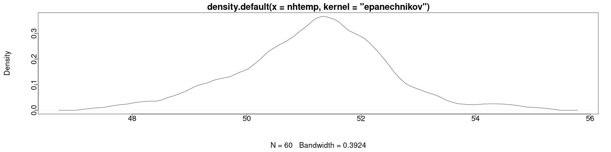

<style>
.section .reveal .state-background {
   background: #ffffff;
}
.section .reveal h1,
.section .reveal h2,
.section .reveal p {
   color: black;
   margin-top: 50px;
   text-align: center;
}
</style>


Confidence intervals and hypothesis testing Part III
========================================================
autosize: true
incremental: true
width: 1920
height: 1080

<h2 style="text-align:left"> Instructions:</h2>
<p style='text-align:left'>Use the left and right arrow keys to navigate the presentation forward and backward respectively.  You can also use the arrows at the bottom right of the screen to navigate with a mouse.<br></p>

<blockquote>
FAIR USE ACT DISCLAIMER:</br>
This site is for educational purposes only.  This website may contain copyrighted material, the use of which has not been specifically authorized by the copyright holders. The material is made available on this website as a way to advance teaching, and copyright-protected materials are used to the extent necessary to make this class function in a distance learning environment.  The Fair Use Copyright Disclaimer is under section 107 of the Copyright Act of 1976, allowance is made for “fair use” for purposes such as criticism, comment, news reporting, teaching, scholarship, education and research.
</blockquote>


========================================================

<h2>Outline</h2>

<ul>
  <li>The following topics will be covered in this lecture:</li>
  <ul>
    <li>Testing the variance of a normal population</li>
    <li>Testing for a difference in variances of two independent samples</li>
    <li>Testing for equal means of two independent samples</li>
    <li>Testing for normality</li>
    <li>Testing for general goodness of fit</li>
  </ul>
</ul>


========================================================
## Testing $\sigma^2$ of a normal population

* We have seen now how to produce confidence intervals and hypothesis tests for the mean of a population, and how to calculate the power of the test.

* It is also interesting to see <strong>whether the population variance has a certain value of $\sigma_0^2$</strong>.

* With a little modification of $S^2$, one can construct confidence intervals and hypothesis tests for a rv that follows a $\chi^2_{n-1}$ distribution.

* If $X_1 ,\cdots, X_n$ are i.i.d. <b>normal rvs</b>, then we have shown that,
  
  $$\begin{align}
  \frac{\left(n-1\right)S^2}{\sigma^2} \sim \chi^2_{n-1} && \text{where} & & S^2 = \frac{1}{n-1}\sum_{i=1}^n \left(X_i - \overline{X}\right)^2
  \end{align}$$

* Using a similar argument to the one used with the student's t-distribution, we can <strong>similarly find the critical points for the $\chi^2_{n-1}$ distribution to compute the hypothesis test / confidence interval</strong>.

* To do so, well need to use the `varTest()` from the `EnvStats` library.

========================================================
### Testing $\sigma^2$ of a normal population

* We will generate 100 observations from a normal distribution with mean $\mu =  1$ and standard deviation $\sigma =1$ as follows


```r
set.seed(0)
require("EnvStats")
sample <- rnorm(n=100, mean=1, sd=1)
varTest(sample)
```

```

	Chi-Squared Test on Variance

data:  sample
Chi-Squared = 77.128, df = 99, p-value = 0.1014
alternative hypothesis: true variance is not equal to 1
95 percent confidence interval:
 0.600583 1.051349
sample estimates:
 variance 
0.7790714 
```

* Notice that even with a sample size of $100$, the p-value is low.

* However, because it is above $5\%$ we do not reject the null hypothesis that the variance is equal to $1$ with $5\%$ significance (a type I error).

========================================================
## Testing for a difference of variances

* Recall now that we earlier defined the F-distribution as one defined in terms of a ratio of two $\chi^2$ random variables.

* This similarly forms a means to test the difference in the variance for two independent random samples.

* Once again, modifying the argument appropriately, we can construct a hypothesis test for whether the ratio of two variances is equal to one or if this differs.

* Consider the example data, `sleep`, a data frame with 20 observations on 2 variables: 

  * the amount of extra sleep after (possibly) taking a drug (extra); and 
  * the group ID for control or treatment (group).
  

```r
str(sleep)
```

```
'data.frame':	20 obs. of  3 variables:
 $ extra: num  0.7 -1.6 -0.2 -1.2 -0.1 3.4 3.7 0.8 0 2 ...
 $ group: Factor w/ 2 levels "1","2": 1 1 1 1 1 1 1 1 1 1 ...
 $ ID   : Factor w/ 10 levels "1","2","3","4",..: 1 2 3 4 5 6 7 8 9 10 ...
```

* We begin by subsetting the data according to the group number


```r
sleep_grp_1 <- sleep[sleep$group == 1,1]
sleep_grp_2 <- sleep[sleep$group == 2,1]
```

========================================================
### Testing for a difference of variances

* Now that the data is subset, we make a `var.test` to test if there is a difference in the variances of the groups


```r
var.test(sleep_grp_1, sleep_grp_2, ratio=1, alternative="two.sided", conf.level= 0.95)
```

```

	F test to compare two variances

data:  sleep_grp_1 and sleep_grp_2
F = 0.79834, num df = 9, denom df = 9, p-value = 0.7427
alternative hypothesis: true ratio of variances is not equal to 1
95 percent confidence interval:
 0.198297 3.214123
sample estimates:
ratio of variances 
         0.7983426 
```

* In the above, we see that the null hypothesis is that the groups have equal variances;

  * given the P value, we fail to reject the null hypothesis.

========================================================
## Testing for equal means

* In comparative studies, one is interested in the <b>differences between effects</b> rather than <strong>the effects themselves</strong>. 

* For instance, it is not the absolute level of sugar concentration in blood reported for two types of diabetes medication that is of interest, but rather the <b>difference between the levels of sugar concentration</b>. 

* One of many aspects of comparative studies is comparing the means of two different populations.

* Consider two samples 
  $$\begin{align}
  \{X_{i,1}\}_{i=1}^{1,\cdots,n_1} & & \text{and} & &\{X_{j,2}\}_{j=1}^{1,\cdots,n_2},
  \end{align}$$ 
  independently drawn from $N\left(\mu_1 , \sigma_1^2\right)$ and $N\left(\mu_2 , \sigma_2^2 \right)$ respectively. 
  
* The two-sample test for the mean is as follows:

  $$\begin{align}
  H_0 : \mu_1 − \mu_2 = \delta_0 & & H_1 : \mu_1 − \mu_2  \neq \delta_0 .
  \end{align}$$

* Before testing the hypotheses, it is important to <strong>acquire information about the variance of the difference of the sample means</strong> $\sigma^2_{\overline{x}_1 - \overline{x}_2}$.

* This is, of course, because this will <b>determine the standard error for the estimator</b>, and how the standard error is estimated.

* Under the assumption of independent rvs, the variance of the difference between the sample means is defined as

  $$\begin{align}
  \sigma^2_{\overline{x}_1 - \overline{x}_2} := \frac{\sigma_1^2}{n_1} + \frac{\sigma_2^2}{n_2}.
  \end{align}$$

========================================================
### Testing for equal means

* However, it is typical that neither of $\sigma^2_1$ or $\sigma^2_2$ are known, and therefore $\sigma^2_{\overline{x}_1 - \overline{x}_2}$ must be estimated by the data.

* There are <b>two cases to distinguish</b>:
  1. both populations have the <strong>same standard deviation</strong> $(\sigma_1 = \sigma_2 )$;
  2. the two populations have <strong>different standard deviations</strong> $(\sigma_1 \neq \sigma_2 )$.

* When both populations have the same standard deviation $\sigma_1 = \sigma_2=\sigma$, then $\sigma^2$ is estimated by the <b>unbiased pooled estimator</b>:

  $$\begin{align}
  s^2_\text{pooled} = \frac{\left(n_1 -1\right)s^2_1 + \left(n_2-1\right)s_2^2}{n_1 +n_2-2}
  \end{align}$$

* Then, the sample estimate  $s^2_{\overline{x}_1 - \overline{x}_2}$ of the population variance for the difference in means is given
  
  $$\begin{align}
  s^2_{\overline{x}_1 - \overline{x}_2}:= s_\text{pooled}^2\left( \frac{1}{n_1} + \frac{1}{n_2}\right).
  \end{align}$$

* When the populations have different standard deviations  $\sigma_1 \neq \sigma_2$, then $\sigma^2_{\overline{x}_1 - \overline{x}_2}$ is estimated by the following <b>unbiased estimator</b>:

  $$\begin{align}
  s^2_{\overline{x}_1 - \overline{x}_2}:= \frac{s_1^2}{n_1} + \frac{s_2^2}{n_2}.
  \end{align}$$
  

========================================================
### Testing for equal means

* Whether the first case or second case on the last slide applies can be investigated by the function `var.test()`.

* From our previous hypothesis test, we didn't have reason to reject the null hypothesis that the variances of the two groups was equal.

* One way to perform such a test is to use the `t.test` function on both groups, setting a keyword argument `var.equal` to `TRUE` or `FALSE`.


```r
t.test(sleep_grp_1, sleep_grp_2, var.equal=TRUE)
```

```

	Two Sample t-test

data:  sleep_grp_1 and sleep_grp_2
t = -1.8608, df = 18, p-value = 0.07919
alternative hypothesis: true difference in means is not equal to 0
95 percent confidence interval:
 -3.363874  0.203874
sample estimates:
mean of x mean of y 
     0.75      2.33 
```

* In the above, we again fail to reject the null hypothesis at the $5\%$ level, though we would reject the null at the $10\%$ level.

========================================================
### Shapiro-Wilk test

* Recall, the $\chi^2$-test used earlier required that the sample was observed from <b>normally distributed random variables</b>.

* If we are uncertain of how normal a sample is, we will typically use the Shapiro-Wilk test to evaluate this.

* Suppose we have a set of <b style="color:#d95f02">observations $\{x_i\}_{i=1}^n$</b> of a <b style="color:#1b9e77">random variable $X$</b>.

* The null and alternative hypotheses for this test can be read:

  $$\begin{align}
  H_0:\text{ }X \text{ is normally distributed} & & H_1:\text{ }X\text{ is not normallydistributed}
  \end{align}$$

* This test can be performed in R as follows:


```r
shapiro.test(nhtemp)
```

```

	Shapiro-Wilk normality test

data:  nhtemp
W = 0.98361, p-value = 0.5985
```

* We show that we cannot reject the hypothesis that the New Haven temperature data is normally distributed at $5\%$ significance.


========================================================
### Diagnosing normality visually

* In either conclusion of the hypothesis test, we should make a visual inspection to diagnose what may problematic about this distribution.

  * For example, if we reject the null, it does not tell us in what way this is non-normal.

* Visually we can inspect the data with the density


```r
par(cex = 1.75, mai=c(1.5,1.5,.5,.5), mgp=c(3,0,0))
plot(density(nhtemp, kernel = "epanechnikov"))
```



* Here we can see that while not perfectly bell-shaped, this does not deviate strongly from normality.


========================================================
### Testing the variance of real data

* Having shown that we <strong>cannot reject the normality of the `nhtemp` data</strong>, this puts us on better footing for using the $\chi^2$-test of variance.

* We have <b>not proven that the data is normal</b>, but if we reject normality, we have no business using this test.

* Consider, the null and alternative hypotheses
  $$\begin{align}
  H_0:\sigma^2 = 1 & & H_1:\sigma^2 \neq 1
  \end{align}$$

* We evaluate this in R as follows:


```r
varTest(as.numeric(nhtemp))
```

```

	Chi-Squared Test on Variance

data:  as.numeric(nhtemp)
Chi-Squared = 94.504, df = 59, p-value = 0.004578
alternative hypothesis: true variance is not equal to 1
95 percent confidence interval:
 1.150840 2.382743
sample estimates:
variance 
1.601763 
```

* This gives us an estimate thus of the variance of the mean annual temperature in New Haven, where we reject the null hypothesis at $5\%$ significance.

========================================================
## Testing for general goodness of fit

* In the following, let $F$ and $G$ be two continuous distributions and $\{x_1 , \cdots, x_n \}$ be a random sample from an rv $X$ with unknown distribution. 

* A common question is, "what distribution does $X$ have?" 

* Another frequently asked question is whether, 

  * given the observations $\{x_1 , \cdots , x_n \}$ and $\{y_1 , \cdots , y_m \}$ 
  
  * are realizations of rvs $X$ and $Y$ with the same distributions $F = G$.

* The <b>Kolmogorov–Smirnov test</b> <strong>measures the distance between two possible, arbitrary, continuous distributions</strong>. 

* If the distance is large enough between the empirical CDFs of the two samples, the distributions are regarded as different. 

* In R, the Kolmogorov–Smirnov test is implemented as `ks.test`.

* The Kolmogorov–Smirnov test determines whether two distributions $F$ and $G$ are significantly different:
  
  $$\begin{align}
  H_0: F = G & & H1 : F\neq G.
  \end{align}$$

* The underlying idea of this test is to measure the so-called Kolmogorov–Smirnov distance between two distributions. 

* The measure for the distance is the supremum of the absolute difference between the two CDFs.

* This test is commonly used to compare the empirically generated CDF to the assumed one.

========================================================
## Testing for general goodness of fit

* We will consider the `diabetes` data from the `faraway` library in which this includes measurements of participants studying diabetes and other cardiovascular risk factors.


```r
require(faraway)
head(diabetes)
```

```
    id chol stab.glu hdl ratio glyhb   location age gender height weight  frame
1 1000  203       82  56   3.6  4.31 Buckingham  46 female     62    121 medium
2 1001  165       97  24   6.9  4.44 Buckingham  29 female     64    218  large
3 1002  228       92  37   6.2  4.64 Buckingham  58 female     61    256  large
4 1003   78       93  12   6.5  4.63 Buckingham  67   male     67    119  large
5 1005  249       90  28   8.9  7.72 Buckingham  64   male     68    183 medium
6 1008  248       94  69   3.6  4.81 Buckingham  34   male     71    190  large
  bp.1s bp.1d bp.2s bp.2d waist hip time.ppn
1   118    59    NA    NA    29  38      720
2   112    68    NA    NA    46  48      360
3   190    92   185    92    49  57      180
4   110    50    NA    NA    33  38      480
5   138    80    NA    NA    44  41      300
6   132    86    NA    NA    36  42      195
```

* As a generic example, we can test to see if the empirical CDFs for the weights of the `male` participants and the `female` participants are significantly different.


```r
male_data <- diabetes[diabetes$gender=="male",]
female_data <- diabetes[diabetes$gender=="female",]
```


========================================================
### Testing for general goodness of fit

* Having subset the data as such, we can extract the weight vector from each subset:


```r
ks.test(male_data$weight, female_data$weight)
```

```

	Two-sample Kolmogorov-Smirnov test

data:  male_data$weight and female_data$weight
D = 0.14667, p-value = 0.02977
alternative hypothesis: two-sided
```

* In the above, we see that the Kolmogorov–Smirnov distance is `0.14667`.

* More particularly, the P value is `0.02977` such that we reject the null hypothesis of identically distributed weights with $5\%$ significance.
