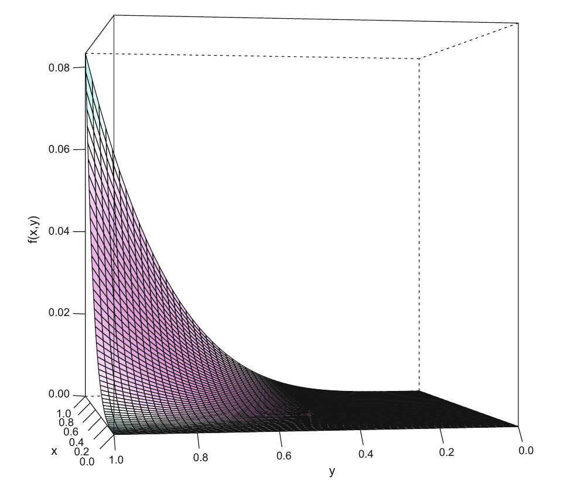

<style>
.section .reveal .state-background {
   background: #ffffff;
}
.section .reveal h1,
.section .reveal h2,
.section .reveal p {
   color: black;
   margin-top: 50px;
   text-align: center;
}
</style>


Numerical integration in R part II
========================================================
autosize: true
incremental: true
width: 1920
height: 1080

<h2 style="text-align:left"> Instructions:</h2>
<p style='text-align:left'>Use the left and right arrow keys to navigate the presentation forward and backward respectively.  You can also use the arrows at the bottom right of the screen to navigate with a mouse.<br></p>

<blockquote>
FAIR USE ACT DISCLAIMER:</br>
This site is for educational purposes only.  This website may contain copyrighted material, the use of which has not been specifically authorized by the copyright holders. The material is made available on this website as a way to advance teaching, and copyright-protected materials are used to the extent necessary to make this class function in a distance learning environment.  The Fair Use Copyright Disclaimer is under section 107 of the Copyright Act of 1976, allowance is made for “fair use” for purposes such as criticism, comment, news reporting, teaching, scholarship, education and research.
</blockquote>


========================================================

<h2>Outline</h2>

<ul>
  <li>The following topics will be covered in this lecture:</li>
  <ul>
    <li>Gaussian Quadrature</li>
    <li>Integrals of several variables</li>
    <li>Adaptive methods</li>
    <li>Monte-Carlo integration</li>
  </ul>
</ul>


========================================================
## Gaussian quadrature

* We can see in the last example, we will need to take many points in a partition to get an accurate approximation with the trapezoidal rule.

* One of the ways to overcome this is to use a more accurate kind of approximation, Gaussian-Quadrature.

* In R, the function `integrate()` uses an integration method that is based on Gaussian quadrature (the exact method is called the Gauss–Kronrod quadrature). 

* The Gaussian method uses non-predetermined nodes $x_1 , \cdots , x_n$ to approximate the integral, so that polynomials of higher order can be integrated more precisely than with using the Newton–Cotes rule. 

* For $n$ nodes, it uses a polynomial 
  
  $$p(x) =\sum_{j=1}^{2n} c_j x^{j-1}$$
  
  of order $2n-1$ in its highest power.
  
* We will not go into detail the differences between the Newton-Cotes scheme versus the Gaussian quadrature, but instead we will consider the difference with the last approximation.

========================================================
### Gaussian quadrature

* The `integrate` function works differently in which we need to supply a function, a lower and upper bound, and optionally the max-size of the partition -- finally we extract the value of the integral as a `$` variable from the resulting object.


```r
for (i in 2:2:20) {
  print(abs(2 - integrate(f=cos, lower=(-pi/2), upper=(pi/2), subdivisions=i)$value))
}
```

```
[1] 0
[1] 0
[1] 0
[1] 0
[1] 0
[1] 0
[1] 0
[1] 0
[1] 0
[1] 0
[1] 0
[1] 0
[1] 0
[1] 0
[1] 0
[1] 0
[1] 0
[1] 0
[1] 0
```

* Notice that this is vastly more accurate than the trapezoidal rule.

========================================================
### Gaussian quadrature

* We can get an estimate of the approximation error from the `integrate` output as well the number of sub-divisions used


```r
int_cos <- integrate(f=cos, lower=(-pi/2), upper=(pi/2), subdivisions=2)
int_cos$abs.error
```

```
[1] 2.220446e-14
```

```r
int_cos$subdivisions
```

```
[1] 1
```

```r
int_cos <- integrate(f=cos, lower=(-pi/2), upper=(pi/2), subdivisions=20)
int_cos$abs.error
```

```
[1] 2.220446e-14
```

```r
int_cos$subdivisions
```

```
[1] 1
```

* Note, Gaussian quadrature only needed to use a single sub-division in all the previous cases to obtain error at the order of $10^{-14}$.

* We will explore more of this in activities, reflecting on the relationship again between the density function and the CDF.


========================================================
## Integration in multiple variables

* Similar to numerical integration in one variable, an integration in multiple variables can be expressed as follows:

  $$\begin{align}
  \int_{a_1}^{b_1} \cdots \int_{a_p}^{b_p} f\left(x_1, \cdots, x_p\right)\mathrm{d}x_1 \cdots \mathrm{d}x_p \approx \sum_{i_1=1}^n \cdots \sum_{i_p=1}^n W_{i_1} \cdots W_{i_p} f\left(x_{i_1},\cdots, x_{i_p}\right)
  \end{align}$$
  where

  * $f$ is a function from $\mathbb{R}^p \rightarrow \mathbb{R}$;
  * We integrate over the domain $[a_1, b_1]\times \cdots \times [a_p, b_p]$
  * $\left\{x_{i_j} \right\}_{i_j=1}^{n}$ are the partition points for the interval $[a_j, b_j]$; and
  * $W_{i_j}$ is a weight that is given to the associated sub-partition of the region.
  
* The issue with the direct approach as above is that the complexity will grow like $p^n$, i.e., the dimension to the power of the partition size.


========================================================
### Adaptive methods

* One better approach computationally is to make an <b>adaptive procedure</b>, where <strong>a refinement of the region is chosen based on the tolerated error in the final result</strong>.


* The adaptive method in the context of multiple integrals divides the integration region $D\in\mathbb{R}^p$ into subregions $S_j \in \mathbb{R}^p$. 

* For each subregion $S_j$, specific rules are applied to approximate the integral. 

* Define the error for each sub-region to be denoted by $E_j$. 

  * If the overall error $\sum_{j=1}^n E_j$ is smaller than a predefined tolerance level, the algorithm stops. 

* However, <b>if this condition is not met</b>, the <strong>highest error $\mathrm{max}_{j}\left(E_j\right)$ is selected and the corresponding region is split into additional subregions</strong>.

* To integrate functions of multiple variables in R, the package `cubature` can be used, with the method `cuhre` applying the adaptive scheme.

* We will consider an example in the following.

========================================================
### Adaptive methods

<div style="float:left; width:50%" class="fragment">

<p style="text-align:center">
Courtesy of Härdle, W.K. et al. <i>Basic Elements of Computational Statistics</i>. Springer International Publishing, 2017.</p>
</div>
<div style="float:left; width:50%">
<ul>
  <li>Plotted on the left is the function,
  $$\begin{align}
  f(x,y) = x^2y^3.
  \end{align}$$</li>
  <li>Instead of finding areas corresponding to integrals, we will be concerned with finding volumes under the two-dimensional surface in the plot in three dimensions.</li>
  <li>The integral,
  $$\int_{0}^1\int_{0}^1 x^2y^3 \mathrm{d}x\mathrm{d}y = \frac{1}{12}$$
  analytically;</li>
  <li>we will use the adaptive approximation in R to see how well we can approximate this.</li>
</ul>
</div>

========================================================
### Adaptive methods

* Firstly we define the function and load the required package


```r
require(cubature)
integrand = function(args) {
  x <- args[1]
  y <- args[2]
  return (x^2 * y^3)
}
```


========================================================
### Adaptive methods

* Now we will apply our adaptive integration,


```r
adaptive_result <- cuhre(integrand, lowerLimit=c(0,0), upperLimit=c(1,1))
adaptive_result
```

```
$integral
[1] 0.08333333

$error
[1] 2.429561e-15

$nregions
[1] 2

$neval
[1] 195

$prob
[1] 0.00623341

$returnCode
[1] 0
```

========================================================
### Adaptive methods

* In the previous output, the prob was for the null and alternative hypothesis as follows:

  $$\begin{align}
  H_0: \text{ The given error estimate is not accurate} & & H_1: \text{ The given error estimate is accurate}
  \end{align}$$

* The prob value was $\approx 0.006$ so that we reject the null hypothesis;

  * the estimated error is given as,
  

```r
adaptive_result$error
```

```
[1] 2.429561e-15
```

  * the true error is given as,


```r
abs(1/12 - adaptive_result$integral)
```

```
[1] 4.163336e-17
```


* We see empirically, and corroborated by the hypothesis test, that the scheme is very accurate.


========================================================
### Monte Carlo methods

* As an alternative to an adaptive scheme, one can also use a random or Monte Carlo scheme to compute the integral.

* In the first step, $n$ points of dimension $p$ are randomly drawn from the region $[a_1,b_1]\times \cdots [a_p,b_p]$, such that

  $$\left(x_{1_1},\cdots, x_{p_1}\right),\cdots,  \left(x_{1_n},\cdots,x_{p_n}\right)$$
  are uniformly distributed over the region.
  
* In the second step, the p-dimensional volume is estimated by
  
  $$V = \prod_{i=1}^p (b_i - a_i)$$
  
  and the integrand $f$ is evaluated for all $n$ points. 
  
* In the third step, the <b>integral can be estimated using a weighted sample mean of the various outputs</b>:
  
  $$\mathcal{I}(f) \approx \hat{\mathcal{I}}(f) = \frac{V}{n} \sum_{i=1}^n f\left(x_{1_i}, \cdots,x_{p_i}\right)$$

* That is, <strong>we approximate the integral as an equal weighted average of the sample values, where the weights are given by the volume divided by the sample size</strong>.

  * Note that we could also define the weights to be non-equal, and this approach can lead to more accurate Monte Carlo methods.


========================================================
### Monte Carlo methods

* We apply the Monte Carlo integration scheme now to the same problem as before using the `vegas()` function:


```r
set.seed(0)
mc_result <- vegas(integrand, lowerLimit=c(0,0), upperLimit=c(1,1))
mc_result
```

```
$integral
[1] 0.083392

$error
[1] 4.661786e-05

$neval
[1] 1007500

$prob
[1] 0.1626209

$returnCode
[1] 1
```

```r
abs(1/12 - mc_result$value)
```

```
numeric(0)
```

* In this case, we fail to reject the null hypothesis that the error bound is inaccurate, and indeed we find that the actual result is extremely accurate.

========================================================
## A summary of main ideas

<ul>
  <li>The main ideas to take away from this introduction to numerical integration are the following:</li>
  <ol>
    <li><b>Numerical integration</b> follows the <strong>same basic logic that we see with Riemann sums</strong>:</li>
    <ul>
      <li>we will try to approximate the area under the curve (or the volume under the surface in multiple variables) using some representative point and an approximate area (or volume).</li>
    </ul>
    <li><b style="color:#d95f02">Riemann sums are a lot like histograms</b> in the sense that they converge slowly to the true value of the integral or density curve respectively;</li>
    <ul>
      <li>however,  <b style="color:#1b9e77">kernel density estimators (and quadrature) increase the flexibility and the rate of convergence</b> to the density function (or the area under the density function respectively).</li>
    </ul>
    <li>These <b>approximations improve when we take finer partitions</b> or, in the Monte Carlo approach, a larger sample size.</li>
    <ul>
      <li>This is also similar to histograms / kernel density estimators which get better approximations of the density curve when the sample size is larger.</li>
    </ul>
    <li>For the <b>density curve $f(x)$</b> and its respective <b>cumulative probability density function $F(x)$</b>, we know we generally have the following relationship:
    $$F(x) = \int_{-\infty}^x f(s) \mathrm{d}s.$$</li>
    <li>Likewise, we generally have the following relationship,
    $$P(a \leq X \leq b) = \int_{a}^b f(s)\mathrm{d}s$$
  </ol>
  <li>We will thus consider some new ways to compute and estimate probability generally using these relationships in the activities.</li>
</ul>
