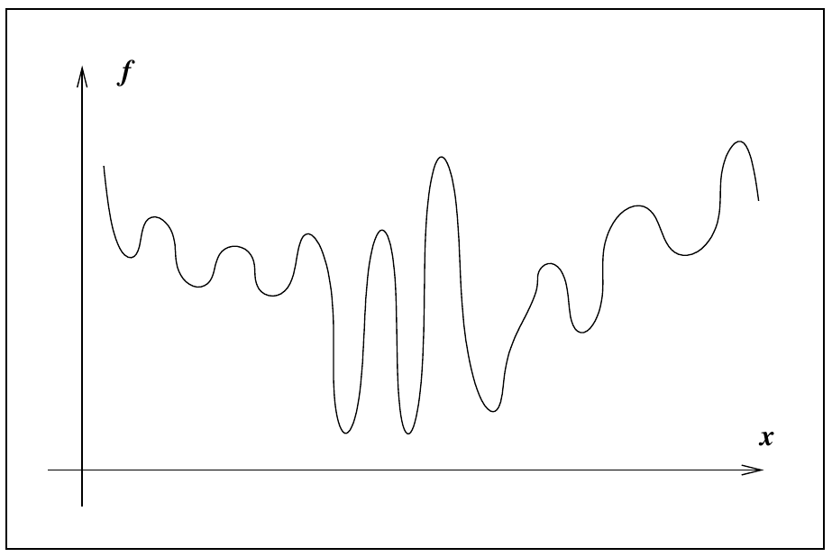
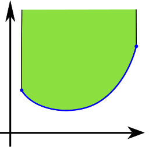
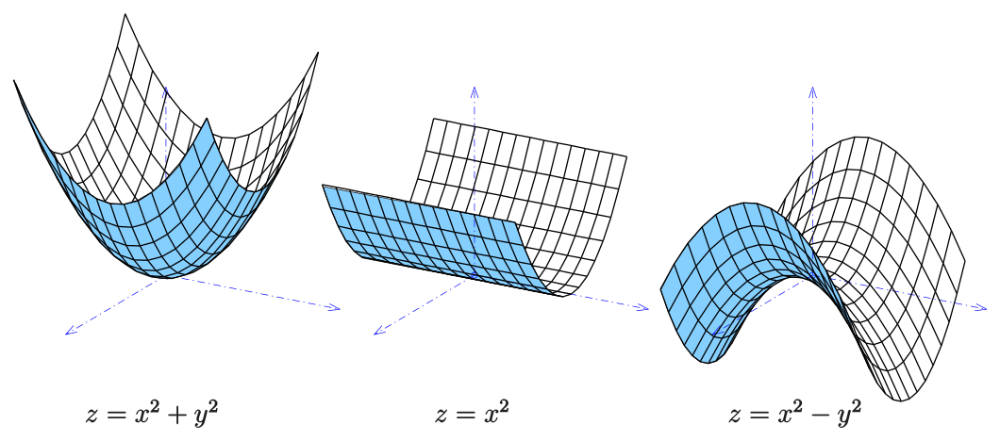
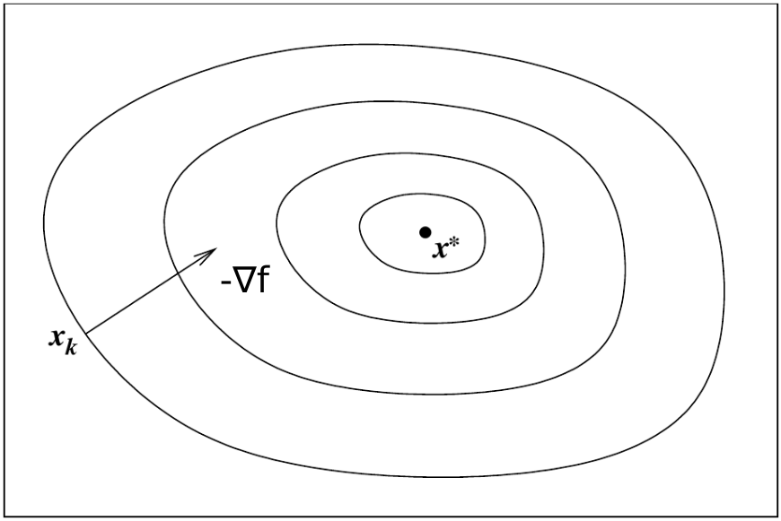
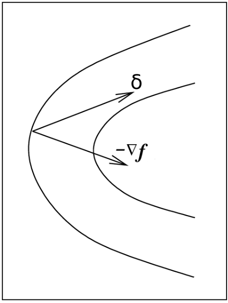

Unconstrained optimization part I
========================================================
autosize: true
incremental: true
width: 1920
height: 1080

<h2 style="text-align:left"> Instructions:</h2>

Use the left and right arrow keys to navigate the presentation forward and backward respectively.  You can also use the arrows at the bottom right of the screen to navigate with a mouse. 

<blockquote>
FAIR USE ACT DISCLAIMER: 
This site is for educational purposes only.  This website may contain copyrighted material, the use of which has not been specifically authorized by the copyright holders. The material is made available on this website as a way to advance teaching, and copyright-protected materials are used to the extent necessary to make this class function in a distance learning environment.  The Fair Use Copyright Disclaimer is under section 107 of the Copyright Act of 1976, allowance is made for “fair use” for purposes such as criticism, comment, news reporting, teaching, scholarship, education and research.
</blockquote>

========================================================

<h2>Outline</h2>

<ul>
  <li>The following topics will be covered in this lecture:</li>
  <ul>
    <li>Concepts in optimization</li>
    <li>Local versus global optimum</li>
    <li>Convexity</li>
    <li>Gradient descent versus Newton descent</li>
</ul>
</ul>

========================================================
## Concepts in optimization

* The maximization and minimization of functions, or <b>optimization problems</b>, contain two components:
  1. an <b style="color:#d95f02">objective function $f(\mathbf{x})$</b>; and
  2. <b style="color:#1b9e77">constraints $g(\mathbf{x})$</b>.
  
* E.g., we may wish to <b style="color:#d95f02">optimize factory output $f(x)$</b> as a function of hours $x$ in a week, with a measure of our <b style="color:#1b9e77">active machine-hours $g(x)$ not exceeding a pre-specified limitation $g(x)\leq C$</b>.
  
* Optimization problems can thus be classified into two categories:
  
  * If there are <b style="color:#1b9e77">constraints $g(\mathbf{x})$</b> affiliated with the objective function $f(\mathbf{x})$, then it is a <b style="color:#1b9e77">constrained optimization problem</b>, <strong>otherwise, it is a unconstrained optimization problem</strong>.
  
* We will focus on <strong>unconstrained optimization as often arises in MLE</strong>; this is formulated as the following problem,

  $$\begin{align}
  f: \mathbb{R}^n &\rightarrow \mathbb{R}\\
     \mathbf{x} &\rightarrow  f(\mathbf{x})\\
  f(\mathbf{x}^\ast) &= \mathrm{max}_{\mathbf{x} \in \mathcal{D}} f
  \end{align}$$

* We note that the above problem is equivalent to a minimization problem by a subsitution of $\tilde{f} = -f$, i.e.,

  $$\begin{align}
  \tilde{f}: \mathbb{R}^n &\rightarrow \mathbb{R}\\
     \mathbf{x} &\rightarrow  -f(\mathbf{x})\\
  f(\mathbf{x}^\ast) &= \mathrm{max}_{\mathbf{x} \in \mathcal{D}} \tilde{f} = \mathrm{min}_{\mathbf{x}\in \mathcal{D}} f
  \end{align}$$

========================================================
### Concepts in optimization

<ul>
  <li> Because these problems are equivalent, we <strong>focus on the minimization of functions</strong> at the moment as they are traditionally phrased in optimization literature.</li>
  <li>The same techniques will apply for maximization by a simple change of variables.</li>
  <li> We will need to identify a few key concepts: <b style="color:#1b9e77">global</b> and <b style="color:#d95f02">local</b> minimizers.</li>
  <li> Suppose we are trying to minimize an objective function $f$.</li>
  <li>We would ideally find a <b style="color:#1b9e77">global minimizer of $f$</b>, a point where the function attains its least value over all possible values under consideration:
<blockquote>
A point $\mathbf{x}^\ast$ is a global minimizer if $f(\mathbf{x}^\ast) \leq f(\mathbf{x})$ for all other possible $\mathbf{x}$ in the domain of consideration $D\subset \mathbb{R}^n$.
</blockquote></li>
  <li> A <b style="color:#1b9e77">global minimizer can be difficult to find</b>, because our <b style="color:#d95f02">knowledge of $f$ is usually only local</b>;</li>
</ul>

 Courtesy of: J. Nocedal and S. Wright. <i>Numerical optimization</i>. Springer Science & Business Media, 2006.

<ul>
  <ul>
    <li>i.e., we only can approximate the behavior of the function $f$ within <b style="color:#d95f02">small perturbations $\boldsymbol{\delta}_{x}$ of values $\mathbf{x}$</b> where we already know $f(\mathbf{x})$.</li>
  </ul>
  <li>Since our algorithm hopefully does not need to compute $f$ over many points, we usually do not have a good picture of the overall shape of $f$,</li>
  <ul>
    <li>generally, we can never be sure that the function does not take a sharp dip in some region that has not been sampled by the algorithm.</li> 
  </ul>
</ul>

========================================================
### Concepts in optimization

* <b style="color:#d95f02">Most algorithms are able to find only a local minimizer</b>, which is a point that achieves the smallest value of $f$ in
its neighborhood, i.e.,

<blockquote>
Let $\mathcal{N}\subset \mathcal{D} \subset\mathbb{R}^n$ be a neighborhood of the point $\mathbf{x}^\ast$ in the domain of consideration.  We say $\mathbf{x}^\ast$ is a local minimizer in the neighborhood of $\mathcal{N}$ if
$$\begin{align}
f(\mathbf{x}^\ast) \leq f(\mathbf{x}) & & \text{ for each other }\mathbf{x}\in \mathcal{N}
\end{align}$$
</blockquote>

* For finding a local minimizer, the main tools will be derived directly from the <strong>second order approximation of the objective function $f$</strong>, defined by

  $$\begin{align}
  f(\mathbf{x}_1) \approx f(\mathbf{x}_0) + \left(\nabla f(\mathbf{x}_0)\right)^\mathrm{T} \boldsymbol{\delta}_{x_1}+\frac{1}{2} \boldsymbol{\delta}_{x_1}^\mathrm{T}\mathbf{H}_f (\mathbf{x}_0) \boldsymbol{\delta}_{x_1}
  \end{align}$$
  
* We will consider how this is related to the notion of <b>convexity</b> as follows.

========================================================

### Convexity

 Courtesy of: Oleg Alexandrov. Public domain, via <a href="https://commons.wikimedia.org/wiki/File:Convex_supergraph.svg" target="blank">Wikimedia Commons</a>.

 
<ul> 
  <li>Throughout mathematics, the notion of convexity is a powerful tool, often used in optimization.</li>
  <li>Particularly, a <b>function is convex</b> if and only if <strong>the region above its graph is a convex set</strong>.</li>
  <ul>
    <li>The <b>convexity of the full epigraph</b> set means that the function attains a <b style="color:#1b9e77">global minimum over its entire domain</b>.</li>
  </ul>
  <li>In <b style="color:#d95f02">non-convex functions</b>, we can have regions that are also <b style="color:#d95f02">locally convex</b> in the graph of the function.</li>
  <li>For such regions, we can find <b style="color:#d95f02">local minimizers</b> as defined in the last slide.</li>
  <li>In a single variable, this is phrased in terms of the <b>second derivative test</b>, i.e.,
  <blockquote>
  For the function of one variable $f(x)$ we say that $x^\ast$ is a local minimizer if $f'(x^\ast)=0$ and $f''(x^\ast)&gt; 0$.
  </blockquote>
  <li>There is a direct analogy for a function of multiple variables, but this need to be rephrased slightly.</li>
  </ul>

========================================================

### The second derivative test with the Hessian

<ul>
  <li>For a real-valued function of multiple variables,
  $$f:\mathbb{R}^n \rightarrow \mathbb{R},$$
  we will instead phrase the <strong>second derivative test in terms of the Hessian of $f$</strong>,
  $$\begin{align}
  \mathbf{H}_{f} = 
  \begin{pmatrix}
  \partial_{x_1}^2 f & \cdots & \partial_{x_1}\partial_{x_n}f \\
  \vdots &\ddots & \vdots \\
  \partial_{x_n}\partial_{x_1} f  & \cdots & \partial_{x_n}^2 f
  \end{pmatrix}
  \end{align}$$
  </li>
  <li>Particularly, the spectral theorem says the Hessian has an eigen decomposition such that by a change of coordinates, $\mathbf{H}_f$ will be diagonal.</li>
</ul>

 Courtesy of: <a href="https://commons.wikimedia.org/wiki/File:Parabol-el-zy-hy-s.svg">Ag2gaeh</a>, <a href="https://creativecommons.org/licenses/by-sa/4.0">CC BY-SA 4.0</a>, via Wikimedia Commons.

<ul>
  <li>The different combinations of <b>eigenvalues of the Hessian</b> will determine the <strong>local curvature of the graph of $f$</strong> with examples in two dimensions pictured above:</li>
  <ol>
    <li><b>Left:</b> we see a convex equation for the simple paraboloid -- around this critical point, the eigenvalues of $\mathbf{H}_f$ will all be strictly positive.</li>
    <li><b>Middle:</b> we see an equation with no global minimum, but infinitely local minima -- all points $(x,y)$ with $x=0$ are critical points, but this is convex in only in the $x$ direction and the $y$ direction will correspond to a zero eigenvalue of $\mathbf{H}_f$.</li>
    <li><b>Right:</b> there is a critical saddle point at $(0,0)$ but this is not even a local mimizer -- here the Hessian $\mathbf{H}_f$ will have one positive and one negative eigenvalue.</li>
  </ol>
  <li>These examples extend into higher dimensions, and generally we say that the function is locally convex at $\mathbf{x}^\ast$ when the Hessian has only positive eigenvalues at $\mathbf{x}^\ast$.</li>
</ul>

========================================================

### The second derivative test with the Hessian

* We can understand the second derivative test with the Hessian using our <b>second order Taylor approximation</b> as follows.

* Let $\mathbf{x}^\ast$ be a critical point and $\mathbf{x}_1 = \mathbf{x}^\ast + \boldsymbol{\delta}_{x_1}$ be a perturbation of this in the neighborhood $\mathcal{N}$.

* Suppose that the Hessian has only positive eigenvalues at $\mathbf{x}^\ast$, then our approximation at second order gives
  $$\begin{align}
  f(\mathbf{x}_1) &\approx f(\mathbf{x}^\ast) + \left(\nabla f(\mathbf{x}^\ast)\right)^\mathrm{T} \boldsymbol{\delta}_{x_1}+ \frac{1}{2} \boldsymbol{\delta}_{x_1}^\mathrm{T}\mathbf{H}_f (\mathbf{x}^\ast) \boldsymbol{\delta}_{x_1} \\
  &= f(\mathbf{x}^\ast) + \frac{1}{2} \boldsymbol{\delta}_{x_1}^\mathrm{T}\mathbf{H}_f (\mathbf{x}^\ast) \boldsymbol{\delta}_{x_1}
  \end{align}$$
  
* Provided $\mathcal{N}$ is a small enough neighborhood, the $\mathcal{o}\left(\parallel \boldsymbol{\delta}_{x_1}\parallel^3\right)$ will remain very small.

* However, $\boldsymbol{\delta}_{x_1}^\mathrm{T}\mathbf{H}_f (\mathbf{x}^\ast) \boldsymbol{\delta}_{x_1}$ must be positive by the positive eigenvalues of the Hessian.

* This says for a radius sufficiently small, $\parallel \boldsymbol{\delta}_{x_1}\parallel$, and any perturbation of the point $\mathbf{x}^\ast$ defined as $\mathbf{x}_1 = \mathbf{x}^\ast + \boldsymbol{\delta}_{x_1}$, we have
  $$f(\mathbf{x}_1) \geq f(\mathbf{x}^\ast).$$

* Therefore, we can identify a local minimizer whenever the gradient is zero and the Hessian has positive eigenvalues, due to the local convexity.

========================================================

## Gradient descent vs Newton descent

<ul>
  <li> We noted before that the <b>gradient $\nabla f$</b> is the <strong>direction and the velocity of the greatest rate of increase of the function $f$</strong>.</li>
  <li> There are some good reasons to consider thus following the direction $-\nabla f$ to find a local minimizer.
  <li>However, it is possible that we will overshoot the local minimum if we take too long of a step along this direction.</li>
  <li>We also may not know a good choice for what length of step to use, for example consider the following figure.</li>
</ul>

 Courtesy of: J. Nocedal and S. Wright. <i>Numerical optimization</i>. Springer Science & Business Media, 2006.

<ul>
  <li>The contours represent fixed values for the function $f$; i.e.,</li> 
  <li>if a contour is defined $\mathcal{C}$, then for all $\mathbf{c}_0 \in \mathcal{C}$, 
  $$f(\mathbf{c}_0 ) = C$$ 
  for a fixed value $C$.</li>
</ul>

<ul>
  <li>For $t &gt; 0$ we define a perturbation along the gradient this vector by $\mathbf{x}_k - t \nabla f$. </li>
  <li>For most of this direction,
  $$f(\mathbf{x}_k - t \nabla f) \leq f(\mathbf{x}_k)$$
  as this moves to the inner contours around $\mathbf{x}^\ast$.</li>
  <li>However, for $t$ large enough, this is not true and we do not know by default what size $t$ is appropriate, or if $f$ is extremely sensitive in this way.</li>
</ul>

========================================================

### Gradient descent vs Newton descent

<ul>
  <li>Let's recall <b>Newton's method</b> to find the appropriate direction and step length:</li>
  <ul>
    <li> When we were looking for the zero of a function, we used the <strong>first order approximation and found where this function takes the value zero</strong>.</li>
  </ul>
  <li> We will consider a similar idea using the <strong>second order approximation</strong>, 
  $$\begin{align}
  m(\boldsymbol{\delta}_{x_1}) = f(\mathbf{x}_0) + \left(\nabla f(\mathbf{x}_0)\right)^\mathrm{T} \boldsymbol{\delta}_{x_1}+\frac{1}{2} \boldsymbol{\delta}_{x_1}^\mathrm{T}\mathbf{H}_f (\mathbf{x}_0) \boldsymbol{\delta}_{x_1}.
  \end{align}$$</li>
  <li>By setting the derivative of $m$ with respect to the perturbation $\boldsymbol{\delta}_x$ equal to zero for some $\boldsymbol{\delta}_{x_1}$:
  $$\begin{align}
  & 0 =   \nabla f(\mathbf{x}_0)  + \mathbf{H}_f(\mathbf{x}_0) \boldsymbol{\delta}_{x_1} \\
  \Leftrightarrow & \boldsymbol{\delta}_{x_1} = -\left(\mathbf{H}_f(\mathbf{x}_0)\right)^{-1} \nabla f(\mathbf{x}_0)
  \end{align}$$</li>
  <li>If $\mathbf{H}_f$ has an inverse at $\mathbf{x}_0$, and if $\mathbf{H}_f(\mathbf{x}_0)$ has positive eigenvalues, this gives a descent direction in $f$.</li>
</ul>

 Courtesy of: J. Nocedal and S. Wright. <i>Numerical optimization</i>. Springer Science & Business Media, 2006.

<ul>
  <li>Particularly, our new choice for the estimated minimum will be given by $\mathbf{x}_1 = \mathbf{x}_0 + \boldsymbol{\delta}_{x_1}$ for which $f(\mathbf{x}_0)\geq f(\mathbf{x}_1)$.</li>
  <li>We may find a lower value along the direction of gradient descent, but without sampling this direction many times over, we do not by default know where this will lie.
</ul>

========================================================

### Newton descent

* In <b>Newton descent</b>, for each $k$ we repeat the step to define the $k+1$ approximation,
  $$\begin{align}
  & 0 =   \nabla f(\mathbf{x}_k)  + \mathbf{H}_f(\mathbf{x}_k) \boldsymbol{\delta}_{x_{k+1}} \\
  \Leftrightarrow & \boldsymbol{\delta}_{x_{k+1}} = -\left(\mathbf{H}_f(\mathbf{x}_k)\right)^{-1} \nabla f(\mathbf{x}_k)\\
  &\mathbf{x}_{k+1} = \mathbf{x}_k + \boldsymbol{\delta}_{x_k}.
  \end{align}$$

* This process will continue until the approximation reaches an error tolerance (when we have a good initial guess $\mathbf{x}_0$) or terminate after timing out, failing to converge if we are not in an appropriate neighborhood $\mathcal{N}$ of a minimizer $\mathbf{x}^\ast$.

  * When we are in a <b style="color:#d95f02">locally convex neighborhood $\mathcal{N}$ containing $\mathbf{x}^\ast$</b>, we can be assured that $\mathbf{H}_f$ will be invertible, and that it will have strictly positive eigenvalues, making the initial choice very important in producing a result.

* Unlike the gradient vector alone, this <strong>gives a step size choice derived by the local geometry</strong>, and this tends to converge to the local minimum quickly as long as the initial choice $\mathbf{x}_0$ is in the neighborhood $\mathcal{N}$.

* However, this method does not know if there is a better minimizing solution $\mathbf{x}_0^\ast$ that lies in a different neighborhood $\mathcal{N}_0$.

  * The results will depend strongly on the shape of the objective function $f$, our initial choice $\mathbf{x}_0$ and whatever prior knowledge about the problem we include in making such an initial guess.
  
* <b>Newton descent</b> is the <strong>basis for a wide class of line-search methods in optimization</strong>, i.e., where we try to optimize a function by finding a good descent direction and choose an appropriate step size based on the direction.

