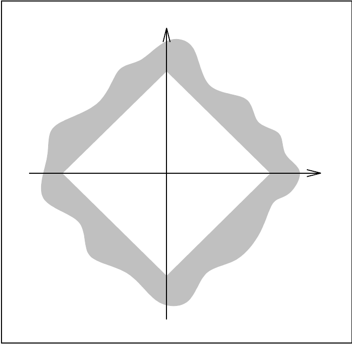
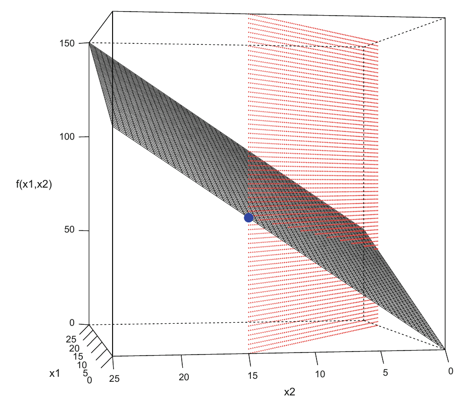
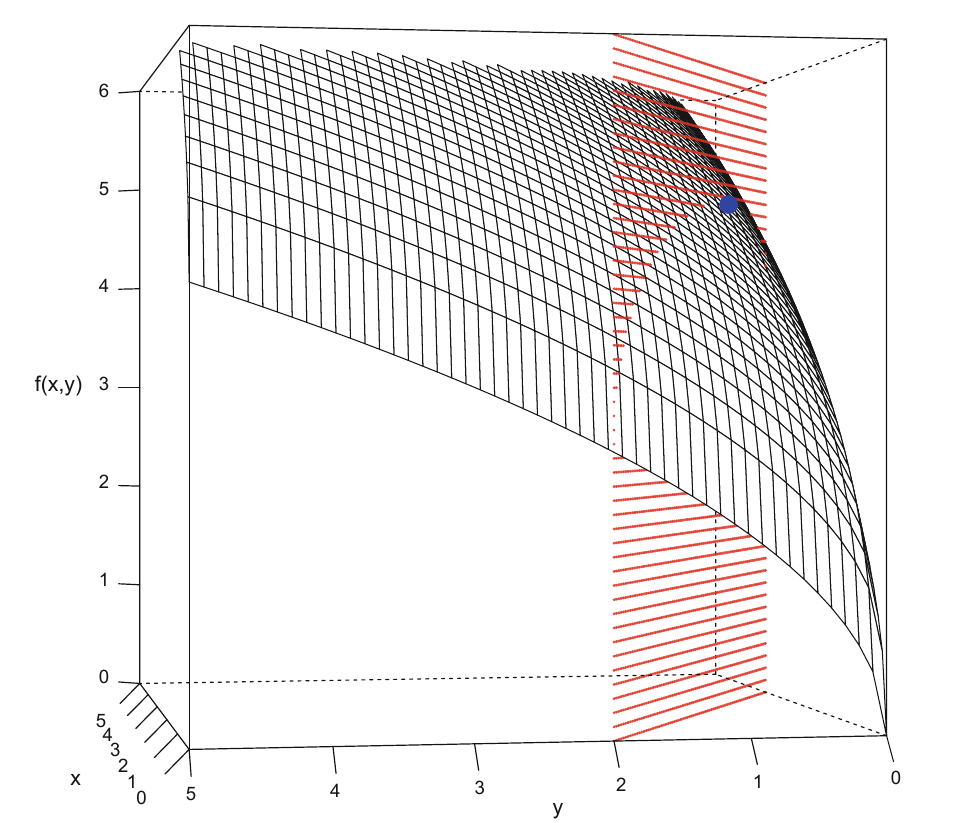

<style>
.section .reveal .state-background {
   background: #ffffff;
}
.section .reveal h1,
.section .reveal h2,
.section .reveal p {
   color: black;
   margin-top: 50px;
   text-align: center;
}
</style>


Constrained optimization
========================================================
autosize: true
incremental: true
width: 1920
height: 1080

<h2 style="text-align:left"> Instructions:</h2>
<p style='text-align:left'>Use the left and right arrow keys to navigate the presentation forward and backward respectively.  You can also use the arrows at the bottom right of the screen to navigate with a mouse.<br></p>

<blockquote>
FAIR USE ACT DISCLAIMER:</br>
This site is for educational purposes only.  This website may contain copyrighted material, the use of which has not been specifically authorized by the copyright holders. The material is made available on this website as a way to advance teaching, and copyright-protected materials are used to the extent necessary to make this class function in a distance learning environment.  The Fair Use Copyright Disclaimer is under section 107 of the Copyright Act of 1976, allowance is made for “fair use” for purposes such as criticism, comment, news reporting, teaching, scholarship, education and research.
</blockquote>


========================================================

<h2>Outline</h2>

<ul>
  <li>The following topics will be covered in this lecture:</li>
  <ul>
    <li>Linear programming problems</li>
    <li>Nonlinear programming problems</li>
  </ul>
</ul>


========================================================
## Motivation

* In our previous discussion of optimization, we <strong>focused on optimization without constraints</strong>.

  * This arises commonly in statistical estimation problems and is actually a <b>simpler case of the constrained optimization problem</b>.
  
* Constrained optimization also commonly arises in statistical  estimation.
  
   * For instance, suppose that we need to <b>estimate the variance</b> of some distribution by an optimization routine.
   
   * A fully unconstrained optimization could (in principle) lead to nonsensical values for the variance.
   
   * The <strong>variance is defined to be strictly non-negative</strong>, where a solution giving $\sigma^2<0$ would cause obvious errors in our analysis.

* In this final discussion of optimization, we will consider how constraints are introduced to our optimization framework.

* This will lead us into two classes of constrained optimization problems:
  
  * <b style="color:#d95f02">Linear Programming (LP) problems</b>; and 
  * <b style="color:#1b9e77">Nonlinear Programming (NLP) problems</b>.
  
* After introducing some general concepts, we will consider several techniques that can be used in the R language to handle such problems.


========================================================
## Linear Programming problems

<div style="float:left; width:70%">
<ul>
   <li> A <b style="color:#d95f02">LP optimization</b> is a method to find the solution to an optimization problem with:</li>
   <ol>
     <li> a <strong>linear objective function</strong>, and </li>
     <li>constraints in the form of <strong>linear equalities and linear inequalities</strong>.</li>
   </ol>
   <li> When we say a <b style="color:#d95f02">linear objective function</b>, we are referring to a linear $f$ such that
   $$\begin{align}
   f:\mathbb{R}^{n} &\rightarrow \mathbb{R}\\
    \pmb{x}&\rightarrow  \pmb{a}^\top \pmb{x}
   \end{align}$$
  as this must be represented by a <strong>linear map (matrix multiplication)</strong> that transfers $\pmb{x}\in\mathbb{R}^n$ to a real value.</li>
  <li>This is thus given precisely by a vector product as above for some $\pmb{a}\in \mathbb{R}^n$ as we can treat this product as
  $$\begin{align}
  \underbrace{\pmb{a}^\top}_{1\times n} \underbrace{\pmb{x}}_{n \times 1} = \underbrace{y}_{1\times 1}\in \mathbb{R}
  \end{align}$$</li>
  <li>Respectively, when we say that we have linear constraints, these can describe, e.g.,
  $$\begin{align}
  x_1 + x_2 \leq 1 & & x_1 - x_2 \leq 1 & & -x_1 + x_2 \leq 1 & & -x_1 - x_2 \leq 1.
  \end{align}$$</li>
  <li>Generally, therefore, a LP optimization has a <b>region of acceptable solutions</b> defined by a <strong>convex polyhedron</strong>, which is a set made by the intersection of finitely many half-spaces.</li>
</ul>
</div>
<div style="float:right; width:30%" class="fragment">
<p style="text-align:center"> Courtesy of: J. Nocedal and S. Wright. <i>Numerical optimization</i>. Springer Science & Business Media, 2006.</p>
</div>
<div style="float:left; width:100%">
<ul>
   <li>This <strong>convex polyhedron</strong> is denoted $\Omega$ and called the <b>feasible region of the problem</b>.</li>
   <li>The objective of linear programming is to <strong>find a point in the feasible region</strong> where the objective function reaches a minimum or maximum value.</li>
</ul>
</div>


========================================================
### Linear Programming problems


* A representative LP problem can be expressed as finding $\pmb{x}^\ast$ such that

  $$\begin{align}
   f(\pmb{x}^\ast) &= \max_{\pmb{x}\in \Omega} \pmb{a}^\top \pmb{x},\quad \text{subject to:}\\ \\
   &\mathbf{C}\pmb{x} \leq \pmb{b},\\
   &\pmb{x} \geq \pmb{0},
   \end{align}$$
   where $\pmb{b}$ is a <strong>vector of known coefficients</strong> and $\mathbf{C}$ is a <strong>known matrix of the coefficients in the constraints</strong>.

* Because the objective function is linear, it is <b>both convex and concave</b> simultaneously.

* Therefore, as long as the constraints are consistent, 
  
  * and provide a bounded feasible region as seen before,
 
* we can obtain a <strong>global minimum or maximum</strong> for such a problem <b>on the feasible region boundary</b>.

* Although the linear objective function is a strong constraint on the problem

 * this type of problem can represent a variety of practical optimization scenarios...


========================================================
### Linear Programming problems


* For example, suppose that a farmer has a piece of farm land, say $L$ $\mathrm{km}^2$, to be planted with either wheat or barley or some combination of the two. 

* The farmer has a limited amount of fertilizer, $F$ kg, and pesticide, $P$ kg. 

* Every square kilometer of wheat requires $F_1$ kilograms of fertilizer and $P_1$ kilograms of pesticide.

* On the other hand, every square kilometer of barley requires $F_2$ kilograms of fertilizer and $P_2$ kilograms of pesticide. 

* Let $S_1$ be the selling price of wheat per square kilometer, and $S_2$ be the selling price of barley. 

* If we denote the area of land planted with wheat and barley by $x_1$ and $x_2$ respectively, then <b>profit can be maximized by choosing optimal values</b> for $x_1$ and $x_2$. 


========================================================
### Linear Programming problems

* The example problem can be expressed with the following linear programming problem in the standard form:

   $$\begin{align}
   \text{Maximize: } S_{1}\cdot x_{1}+S_{2}\cdot x_{2}  & &\text{(maximize the revenue)}\\
      \text{Subject to:}\\
      x_{1}+x_{2}\leq L & & \text{(limit on total area)}\\
      F_{1}\cdot x_{1}+F_{2}\cdot x_{2}\leq F & & \text{(limit on fertilizer)}\\
      P_{1}\cdot x_{1}+P_{2}\cdot x_{2}\leq P & &	\text{(limit on pesticide)}\\
      x_{1}\geq 0,x_{2}\geq 0 & & \text{(cannot plant a negative area).}
    \end{align}$$
    
* Alternatively, in matrix form we have this written equivalently as

  $$\begin{align}
  \text{Maximize: }\pmb{S}^\top \pmb{x} \\
  \text{Subject to:}\\
  \begin{pmatrix}
  1 & 1\\ F_1 & F_2 \\ P_1 & P_2
  \end{pmatrix}
  \begin{pmatrix}
  x_1 \\ x_2 
  \end{pmatrix}
  \leq \begin{pmatrix}L \\ F \\ P \end{pmatrix} \\
  \begin{pmatrix}x_1 \\ x_2 \end{pmatrix} \geq \begin{pmatrix} 0 \\ 0 \end{pmatrix}
  \end{align}$$


========================================================
### Linear Programming problems

* Linear programming problems as above can be solved in R by using the R wrapper for the  <b>GNU Linear Programming Kit (GLPK)</b>.

* This comes in the package `Rglpk` below:


```r
require(Rglpk)
```

* As an example, we will show how to solve the following problem,
  
  $$\begin{align}
  \text{Maximize: }\begin{pmatrix}2 \\ 4\end{pmatrix}^\top \begin{pmatrix}x_1 \\ x_2\end{pmatrix}\\
  \text{Subject to:} & &
  \begin{pmatrix} 3 \\ 4\end{pmatrix}^\top \begin{pmatrix}x_1 \\ x_2\end{pmatrix} \leq 60 & & 
  \begin{pmatrix}x_1 \\ x_2\end{pmatrix} \geq \pmb{0}
  \end{align}$$

* We will use the `Rglpk_solve_LP` with the following arguments:

  * `obj` - a numeric vector representing the <strong>objective coefficients</strong>.
  * `mat` - a matrix of <strong>constraint coefficients</strong>.
  * `dir` - a character vector with the <strong>directions of the constraints</strong>, `"<"`, `"<="`, `">"`, `">="`, or `"=="`.
  * `rhs` - a numeric vector representing the <strong>right hand side of the constraints</strong>.

========================================================
### Linear Programming problems


```r
Rglpk_solve_LP(obj = c(2, 4), 
               mat = matrix(c(3, 4), nrow = 1),
               dir ="<=",
               rhs = 60,
               max = TRUE)
```

```
$optimum
[1] 60

$solution
[1]  0 15

$status
[1] 0

$solution_dual
[1] -1  0

$auxiliary
$auxiliary$primal
[1] 60

$auxiliary$dual
[1] 1


$sensitivity_report
[1] NA
```

========================================================
### Linear Programming problems

<div style="float:left; width:40%">
<ul>
   <li>The geometry of the LP problem can be understood where the <b>output of the objective function</b> $f$ is given as a <strong>hyper-plane</strong> above the $x_1,x_2$ plane.</li>
   <li>The constraints likewise define the convex polyhedron through the intersection of the corresponding half-hyper-planes.</li>
   <li>Correspondingly, the <b>maximum</b> is attained where the <strong>polyhedron intersects the hyper-plane of the objective function</strong>.</li>
   <li>This is visualized to the right for this problem.</li>
</ul>
</div>
<div style="float:right; width:60%; text-align:center;" class="fragment">
<p style="text-align:center">
Courtesy of Härdle, W.K. et al. <i>Basic Elements of Computational Statistics</i>. Springer International Publishing, 2017.</p>
</div>

========================================================
## Nonlinear Programming problems

* The NLP has an analogous definition as that of the LP problem. 

* The differences between NLP and LP are that the <b style="color:#1b9e77">objective function or the constraints in an NLP can be nonlinear functions</b>. 

* NLP has some similarity then to what we saw in our discussion of unconstrained optimization, thus, in that we will often be <strong>concerned with finding a local minima or local maxima</strong>.
  
* Techniques such as <b>Newton's descent and gradient descent</b> can be <strong>revised to handle the constraints defining the feasible region</strong>.

* These methods tend to become, however, much more complex to develop, and we will only introduce a simple example here.

* Particularly, we will consider the nonlinear objective function with the linear constraints below:
  
  $$\begin{align}
  f(\pmb{x}^\ast) =& \max_{x_1 , x_2}  \sqrt{5x_1} + \sqrt{3x_2} ,\\
  & \text{subject to:} \quad 3x_1 + 5x_2 \leq 10,\\
  & x_1 \geq 0,\\
  & x_2 \geq 0.
  \end{align}$$
  
* This type of linearly constrained, nonlinear objective function can be optimized with the `constOptim` function of the `stats` package in R.

```r
require(stats)
```

========================================================
### Nonlinear Programming problems

* The `constOptim` function is an extension of the `optim` function in R that allows for a feasible region.

* This function is given with syntax

```
constrOptim(theta, f, grad, ui, ci)
```

* where
  * `theta`	-- is the <strong>numerical starting value</strong> in the feasible region.
  * `f` -- is the	<strong>function to minimize</strong>.
  * `grad` --  is the <strong>gradient</strong> of `f` as a function or `NULL`.
  * `ui`	-- is the <strong>constraint matrix</strong> (k x p).
  * `ci`	-- is the <strong>constraint vector</strong> of length k.

* We'll start by defining the function and the constraints:


```r
f <- function(x){
 -sqrt(5 * x[1]) - sqrt(3 * x[2])
 }
A <- matrix(c(-3, -5), nrow = 1, ncol = 2, byrow = TRUE)
b <- c(-10)
```


========================================================
### Nonlinear Programming problems

* Running the optimization:


```r
constrOptim(f = f, theta = c(1, 1), grad = NULL, ui = A, ci = b)
```

```
$par
[1] 2.4510595 0.5293643

$value
[1] -4.760952

$counts
function gradient 
     170       NA 

$convergence
[1] 0

$message
NULL

$outer.iterations
[1] 3

$barrier.value
[1] -0.0009999994
```

* Because we phrased this as the minimization of the negative function, the max value is $4.760952$ of the original.

========================================================
### Nonlinear Programming problems

<div style="float:left; width:40%">
<ul>
   <li>The geometry of this particular NLP problem can be understood by the last example.</li>
   <li>Particularly, we have the same constraints as before, but we now have a curved graph of the objective function above the $x_1,x_2$ plane.</li>
   <li>This is visualized to the right for this problem.</li>
</ul>
</div>
<div style="float:right; width:60%; text-align:center;" class="fragment">
<p style="text-align:center">
Courtesy of Härdle, W.K. et al. <i>Basic Elements of Computational Statistics</i>. Springer International Publishing, 2017.</p>
</div>
