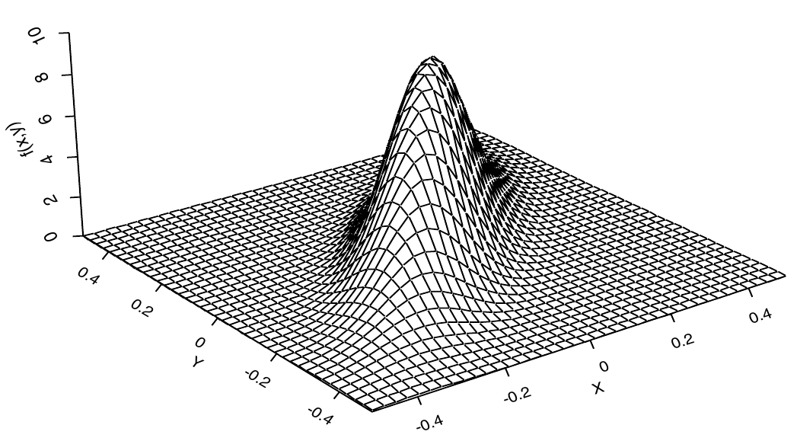
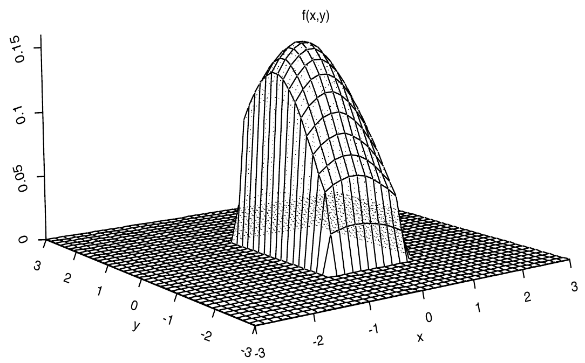

Multivariate distributions part I
========================================================
autosize: true
incremental: true
width: 1920
height: 1080

<h2 style="text-align:left"> Instructions:</h2>

Use the left and right arrow keys to navigate the presentation forward and backward respectively.  You can also use the arrows at the bottom right of the screen to navigate with a mouse. 

<blockquote>
FAIR USE ACT DISCLAIMER: 
This site is for educational purposes only.  This website may contain copyrighted material, the use of which has not been specifically authorized by the copyright holders. The material is made available on this website as a way to advance teaching, and copyright-protected materials are used to the extent necessary to make this class function in a distance learning environment.  The Fair Use Copyright Disclaimer is under section 107 of the Copyright Act of 1976, allowance is made for “fair use” for purposes such as criticism, comment, news reporting, teaching, scholarship, education and research.
</blockquote>

========================================================

<h2>Outline</h2>

<ul>
  <li>The following topics will be covered in this lecture:</li>
  <ul>
    <li>The distribution function of a random vector</li>
    <li>The density function of a random vector</li>
    <li>Marginal versus conditional probability</li>
    <li>Expected value</li>
    </ul>
</ul>

========================================================
## Introducing multiple random variables

* We have now learned about <b style="color:#d95f02">how to describe behavior of a single random variable</b> and the <b style="color:#1b9e77">mathematical structure of how to think about multiple variables in matrices and functions</b>.</li>

* We will now introduce the basic tools of <b>statistics and probability theory for multivariate analysis</b>;

  * we will be studying the relations between <strong>$p$ random variables that will often covary together in their conditional probabilities</strong>. 
  
* To begin with we will make the extension of random variables to random vectors, using our understanding of basic matrix theory.

* Some notions like the expected / center of mass will translate directly over linear combinations of random variables.

* Recall, for random variables $X,Y$ and a constant scalars $a,b$ we have
  $$\mathbb{E}\left[ a X + b Y\right] = a \mathbb{E}\left[X\right] + b \mathbb{E}\left[Y\right].$$

* The same idea extends algebraicly for random vectors $\boldsymbol{\xi}_1, \boldsymbol{\xi}_2$ and constant matrices $\mathbf{A},\mathbf{B}$, we can write
  $$\mathbb{E}\left[\mathbf{A}\boldsymbol{\xi}_1 + \mathbf{B}\boldsymbol{\xi}_2 \right] = \mathbf{A}\mathbb{E}\left[ \boldsymbol{\xi}_1\right] + \mathbf{B}\mathbb{E}\left[\boldsymbol{\xi}_2\right].$$

* While the concept of the center of mass remains basically the same, we will need to make some additional considerations when we measure the spread of random variables and how they relate to others.

========================================================
## The cumulitive distribution function

* We will begin our consideration in $p=2$ dimensions, as all properties described in the following will extend (with minor modifications) to arbitrarily large but finite $p$.

* Let the vector $\boldsymbol{\xi}$ be defined as

  $$\begin{align}
  \boldsymbol{\xi} = 
  \begin{pmatrix}
  \xi_1 \\ \xi_2
  \end{pmatrix}
  \end{align}$$
  where each of the above components $\xi_i$ is a rv.
  
* We can define the <b>cumulative distribution function</b> in a similar way to the definition in one variable.

* Let $x_1,x_2$ be <strong>two fixed real values forming a constant vector</strong> as
  
  $$\mathbf{x} = \begin{pmatrix} x_1 \\ x_2\end{pmatrix}.$$
  
* Define the comparison operator between two vectors $\mathbf{y}, \mathbf{x}$ as

  $$\mathbf{y} \leq \mathbf{x} \Leftrightarrow  y_i \leq x_i \text{ for each and every }i$$
  
* The <b>cumulative distribution function</b> $F_\boldsymbol{\xi}$, describing the probability of realizations of $\boldsymbol{\xi}$, is thus given as,

  $$F_\boldsymbol{\xi}(\mathbf{x}) = P(\boldsymbol{\xi}\leq \mathbf{x} ) = P(\xi_i \leq x_i \text{ for each and every }i)$$

========================================================
### The joint probability density function

* Recall that the cdf 
  
  $$\begin{align}
  F_\boldsymbol{\xi}:\mathbb{R}^2 & \rightarrow [0,1] \\
   \mathbf{x} & \rightarrow P(\boldsymbol{\xi}\leq \mathbf{x})
  \end{align}$$
  is a function of the variables $(x_1,x_2)$. 
  
* Suppose then that $F_\boldsymbol{\xi}$ has continuous second partial derivatives in  $\partial_{x_1} \partial_{x_2}F_\boldsymbol{\xi} = \partial_{x_2}\partial_{x_1}F_\boldsymbol{\xi}$.

* We then can take the probability density function $f$ to be defined as
  $$\begin{align}
  f_\boldsymbol{\xi}:\mathbb{R}^2 & \rightarrow \mathbb{R}\\
   \mathbf{x} &\rightarrow \partial_{x_1}\partial_{x_2}F_\boldsymbol{\xi}(\mathbf{x})
  \end{align}$$
  
* In the above definition, we have constructed the density function in the same way as in one variable;

  * specifically, in the case where $f_\boldsymbol{\xi}$ itself is differentiable, we have defined the cdf as the anti-derivative of the density:
  
  $$\begin{align}
  F_\boldsymbol{\xi}(\mathbf{x}) = \int_{-\infty}^{x_1} \int_{-\infty}^{x_2} f_\boldsymbol{\xi}(s_1, s_2) \mathrm{d}s_1 \mathrm{d}s_2
  \end{align}$$

========================================================
### The joint probability density function

* Recall that we defined the relationship between the cdf and the density as

  $$\begin{align}
  F_\boldsymbol{\xi}(\mathbf{x}) = \int_{-\infty}^{x_1} \int_{-\infty}^{x_2} f_\boldsymbol{\xi}(s_1, s_2) \mathrm{d}s_1 \mathrm{d}s_2
  \end{align}$$

* By the above definition, we have to have that
  
  $$\begin{align}
  P(- \infty &lt; \boldsymbol{\xi} &lt; \infty)  = \int_{-\infty}^{\infty} \int_{-\infty}^{\infty} f_\boldsymbol{\xi}(s_1, s_2) \mathrm{d}s_1 \mathrm{d}s_2 = 1
  \end{align}$$
  
  
* We note that, as usual, <strong>the density function $f$ must always be positive as the cdf $F_\boldsymbol{\xi}$ is everywhere increasing for a positive increase in $x_1,x_2$</strong>.

* Note, if we defined this over $p\geq 2$ variables, all of the above extends identically when $F_\boldsymbol{\xi}$ has derivatives defined in arbitrary arrangements of the $p$-th partial derivatives in each $\partial_{x_i}$.

  * We then construct $F_\boldsymbol{\xi}$ once again as the anti-derivative of $f_\boldsymbol{\xi}$ in all univariate partial derivatives.

========================================================
### The joint probability density function

<ul>
  <li>Partiuclarly, we will again view the density function like the curve of the univariate case, but for two variables we see this as a <strong>surface above the $x_1,x_2$ plane</strong>.</li>
</ul>

 Courtesy of: Dekking, et al. <i>A Modern Introduction to Probability and Statistics</i>. Springer Science & Business Media, 2005.

<ul>
  <li>To the right, we see the multivariate Gaussian bell surface that defines the multivariate normal distribution in two variables.</li>
  <li>In one variable, the probability $P(\xi_1 \leq x_1)$ was associated to the area under the curve, computed by the integral of the density.</li>
</ul>

 Courtesy of: F.M. Dekking, et al. <i>A Modern Introduction to Probability and Statistics</i>. Springer Science & Business Media, 2005.

<ul>
  <li>We saw that with integrals in two variables, a volume is computed under the surface with a multiple integral.</li>
  <li>Likewise, we will associate the probability $P(\mathbf{a} \leq \boldsymbol{\xi} \leq \mathbf{b})$ with some volume under the surface.</li>
  <li>By the construction, we can generally write, 
  $$\begin{align}
  P(\mathbf{a} \leq \boldsymbol{\xi}\leq \mathbf{b}) = \int_{a_1}^{b_1} \int_{a_2}^{b_2} f_\boldsymbol{\xi}(s_1,s_2)\mathrm{d}s_1\mathrm{d}s_2
  \end{align}$$
  and numerically calculate such a value with the numerical integration methods discussed earlier.</li>
</ul>

========================================================
### The marginal distribution function

* A new construction arises when we consider the joint probability of multiple variables, and how these relate back to univariate probability.

* Consider if we write the cdf of $\xi_1,\xi_2$ in terms of its component arguments,
  
  $$\begin{align}
  F_\boldsymbol{\xi}(x_1, x_2) = \int_{-\infty}^{x_1}\int_{-\infty}^{x_2} f_\boldsymbol{\xi}(s_1, s_2) \mathrm{d}s_1 \mathrm{d}s_2
  \end{align}$$
  we can also <strong>define the limit as $x_i$ goes to infinity</strong>.
  
* This can be considered as an operation of averaging out the variable $x_i$ as represented by the integral
  
  $$\begin{align}
  \lim_{x_2\rightarrow \infty}\int_{-\infty}^{x_1}\int_{-\infty}^{x_2} f_\boldsymbol{\xi}(s_1, s_2) \mathrm{d}s_1 \mathrm{d}s_2 = \int_{-\infty}^{x_1}\int_{-\infty}^{\infty} f_\boldsymbol{\xi}(s_1, s_2) \mathrm{d}s_1 \mathrm{d}s_2
  \end{align}$$

* However, if we consider $x_1$ to still remain a free variable in the above equation, this can be written as,
  
  $$\begin{align}
  F_{\xi_1}(x_1) = F_\boldsymbol{\xi}(x_1, \infty) = \lim_{x_2 \rightarrow \infty} F_\boldsymbol{\xi}(x_1,x_2)
  \end{align}$$
  where <b>$F_{\xi_1}(x_1)$ is the marginal distribution function for $\xi_1$</b>, integrating our $x_2$ in the same sense as above.

* Likewise we can define the marginal distribution function symmetrically in $x_2$ as,
  
  $$\begin{align}
  F_{\xi_2}(x_2) = F_\boldsymbol{\xi}(\infty , x_2) = \lim_{x_1 \rightarrow \infty} F_\boldsymbol{\xi}(x_1,x_2)
  \end{align}$$
  where <b>$F_{\xi_2}(x_2)$ is the marginal distribution function for $\xi_2$</b> integrating our $x_1$ in the same sense as above.

========================================================
### The marginal distribution function

* Let us consider now the meaning of this object in terms of the probability definition.

* Let $A =\{\xi_1 \leq x_1\}$ and $B = \{\xi_2\leq x_2\}$ so that,

  $$\begin{align}
  F_{\xi_1}(x_1) &= \lim_{x_2\rightarrow \infty} F_\boldsymbol{\xi}(x_1, x_2)  \\
                 &= \lim_{x_2\rightarrow \infty} P(A \cap B) \\
                 &= P(A)
  \end{align}$$
  as $\xi_2 \leq \infty$ places no restriction on the event $A$.

*  Similarly, we can show this for the marginal distribution in $\xi_2$.

* Therefore, we associate the marginal distribution of $\xi_1$ with its the intrinsic probability distribution, after factoring out the outcomes of possibly related variables.

* Geometrically, we can gain some understanding of the marginal probability distribution terms of the marginal density function.

========================================================
### The marginal density function

<ul>
  <li>Let's suppose that $\xi_1,\xi_2$ have a joint density defined as $f_\boldsymbol{\xi}(\mathbf{x})$ such that
  $$F_\boldsymbol{\xi}(\mathbf{x}) = \int_{-\infty}^{x_1}\int_{-\infty}^{x_2} f_\boldsymbol{\xi}(s_1, s_2) \mathrm{d}s_1 \mathrm{d}s_2.$$</li>
  <li>Suppose we integrate $x_2$ out of the density as above, then we define the marginal density function as
  $$f_{\xi_1}(x_1) = \int_{-\infty}^{\infty} f_\boldsymbol{\xi}(x_1,s_2) \mathrm{d}s_2.$$</li>
  <li>By construction, we have the following relationship between the marginals
  $$F_{\xi_1}(x_1) = \int_{-\infty}^{x_1}f_{\xi_1}(s_1)\mathrm{d}s_1.$$</li>
</ul>

 Courtesy of <a href="https://commons.wikimedia.org/wiki/File:MultivariateNormal.png">Bscan</a>, CC0, via Wikimedia Commons

<ul>
  <li>The above description shows that $f_{\xi_1}(x_1)$ can be associated to the total area under the curve $f_\boldsymbol{\xi}(x_1, s_2)$ where $x_1$ is fixed and $s_2$ is free to vary over all values $-\infty \leq s_2\leq \infty$.</li>
  <li>Geometrically, the marginal density curves are represented for the joint normal distribution in $x$ and $y$ in the figure above.</li>
  <li>For any fixed $x$, the marginal histogram is produced by finding the frequency of all values $y$ that are observed associated to this value $x$.</li>
  <li>We thus sum all $y$-values in to the margin and look at the density of $x$ over the margin of the joint plot.</li>
</ul>

========================================================
### Independence and the marginal probability

* Let us recall now that $P(A \cap B) = P(A)P(B)$ if and only if $A$ and $B$ are independent events.

* Let $A =\{\xi_1 \leq x_1\}$ and $B = \{\xi_2\leq x_2\}$ once again.

* Consider thus, if $\xi_1$ and $\xi_2$ are independent random variables, we must have that
  
  $$\begin{align}
  F_\boldsymbol{\xi}(x_1, x_2 ) &= P(A \cap B) \\
               &= P(A) P(B) \\
               &=F_{\xi_1}(x_1) F_{\xi_2}(x_2)
  \end{align}$$
  from our earlier derivations.
  
*  If we take the derivatives $\partial_{x_1}\partial_{x_2}$ of the above, assuming again the independence,
  
  $$\begin{align}
  \partial_{x_1}\partial_{x_2} F_\boldsymbol{\xi}(x_1,x_2) &= f(x_1,x_2) \\
  & = \partial_{x_1} F_{\xi_1}(x_1) \partial_{x_2} F_{\xi_2}(x_2)\\
  &= f_{\xi_1}(x_1) f_{\xi_2}(x_2)
  \end{align}$$
  which can be shown by integrating out either $x_i$ from the joint density.
  

* Therefore, for <strong>independent random variables $\xi_1,\xi_2$</strong> we recover the following <b>identities on the marginal functions</b>,

  $$\begin{align} F_\boldsymbol{\xi}(x_1, x_2) = F_{\xi_1}(x_1)F_{\xi_2}(x_2)  & & f_\boldsymbol{\xi}(x_1,x_2) = f_{\xi_1}(x_1) f_{\xi_2}(x_2)\end{align}$$
  
========================================================
## Marginal verus conditional probability

* The marginals are closely related to the notion of the conditional probability.

* We recall, it is a basic assumption in probability that when $P(B)\neq0$,
  
  $$P(A\vert B) = \frac{P(A\cap B)}{P(B)}.$$

* We will thus define the conditional density as,
  
  $$f_{\xi_1 \vert \xi_2}(x_1 \vert x_2) = \frac{f_\boldsymbol{\xi}(x_1, x_2)}{f_{\xi_2}(x_2)}$$
  
* We can thus write equivalently,

  $$ f_\boldsymbol{\xi}(\mathbf{x}) =  f_{\xi_1 \vert \xi_2}(x_1 \vert x_2) f_{\xi_2}(x_2)$$

*  When $\xi_1,\xi_2$ are independent, we furthermore obtain $f_{\xi_1 \vert \xi_2}(x_1 \vert x_2) = f_{\xi_1}(x_1)$.

========================================================
### Marginal verus conditional probability

*  The following relationship between the marginal, conditional and joint densities
  
  $$ f_\boldsymbol{\xi}(\mathbf{x}) =  f_{\xi_1 \vert \xi_2}(x_1 \vert x_2) f_{\xi_2}(x_2)$$
  
  can be used to illustrate another connection.
  
* Consider,

  $$\begin{align}
  f_{\xi_1}(x_1) &= \int_{-\infty}^\infty f_\boldsymbol{\xi}(\mathbf{x}) \mathrm{d}x_2 \\ 
                 &= \int_{-\infty}^\infty f_{\xi_1 \vert \xi_2}(x_1 \vert x_2) f_{\xi_2}(x_2) \mathrm{d}x_2
  \end{align}$$
  
* Then have the interpretation of the marginal $f_{\xi_1}(x_1)$ as the <strong>average value of the conditional density $f_{\xi_1 \vert \xi_2}(x_1 \vert x_2)$, as we take the weighted average over all possible $x_2$</strong>.

* This is equivalent to the earlier interpretation, summing the total frequency of all $x_2$ observed for a fixed value of $x_1$.

========================================================
## Samples and random vectors

* In multivariate statistics, we are given of realizations of a sequence of i.i.d. random vectors $\boldsymbol{\xi}_1 , . . . , \boldsymbol{\xi}_n$, where each $\boldsymbol{\xi}_i$ has the same distribution as a parent or population random vector $\boldsymbol{\xi}$.

* We will observe the values a that the random vector $\boldsymbol{\xi}_i$ attains and obtain a sample of observations as $\{\mathbf{x}_i\}_{i=1}^n$.

* We can thus write the observed sample in a matrix form as 
  $$\begin{align}
  \mathbf{X} & = 
  \begin{pmatrix}
  x_{11} & \cdots & x_{1p} \\
  \vdots & \ddots & \vdots \\
  x_{n1} & \cdots & x_{np}
  \end{pmatrix}
  \end{align}$$
  where the $i$-th row of of the above matrix corresponds the observed vector $\mathbf{x}_{i}$.

* Similarly, we will denote the random matrix as,
  $$\begin{align}
  \boldsymbol{\Xi} & = 
  \begin{pmatrix}
  \xi_{11} & \cdots & \xi_{1p} \\
  \vdots & \ddots & \vdots \\
  \xi_{n1} & \cdots & \xi_{np}
  \end{pmatrix}
  \end{align}$$
  where the $i$-th row of the above matrix corresponds to the random vector $\boldsymbol{\xi}_i$.
  
* The idea of statistical inference for a given random sample is to analyze the properties of the population variable $\boldsymbol{\xi}$. 

* This is typically done by analyzing some characteristics of its distribution, often in terms of the statistics of center and spread once again.

========================================================
## The expected value

* We mentioned already that the expectation has the same property of passing over linear combinations of random variables in the same ways with vectors as with scalars.

* Particularly, we consider the following definition:

  * Let $\boldsymbol{\xi}$ be a random vector of size $p$ with the associated cdf $F_\boldsymbol{\xi}(\mathbf{x})$ and the density $f_\boldsymbol{\xi}(\mathbf{x})$.
  
  * Then, we will denote the expected value of the vector $\boldsymbol{\xi}$ as,
  
  $$\begin{align}
  \mathbb{E}\left[\boldsymbol{\xi}\right] = \int_{\mathbb{R}^p} \mathbf{s} f_\boldsymbol{\xi}(\mathbf{s})\mathrm{d}\mathbf{s}=
    \begin{pmatrix}
  \mathbb{E}\left[\xi_1\right] \\ \vdots \\ \mathbb{E}\left[\xi_p\right]
  \end{pmatrix} =
  \begin{pmatrix}
  \int_{-\infty}^\infty s_1 f_{\xi_1}(s_1) \mathrm{d}s_1 \\ \vdots \\   \int_{-\infty}^\infty s_p f_{\xi_p}(s_p) \mathrm{d}s_p 
  \end{pmatrix} = \begin{pmatrix} \mu_1 \\ \vdots \\ \mu_p\end{pmatrix} = \boldsymbol{\mu} 
  \end{align}$$
  where in the above $f_{\xi_i}$ is again the marginal for $\xi_i$ having integrated out the other variables.
  
* In the form $\mathbb{E}\left[\boldsymbol{\xi}\right] = \int_{\mathbb{R}^p} \mathbf{s} f_\boldsymbol{\xi}(\mathbf{s})\mathrm{d}\mathbf{s}$ this can be seen as the weighted average of the vector $\mathbf{s}$, given the weights of the joint density.
  
* Suppose again $p=2$, then we can then consider the entry of $\mathbb{E}\left[\boldsymbol{\xi}\right]$ to be,
  
  $$\begin{align}
  \mathbb{E}\left[ \xi_1\right] = \int_{-\infty}^\infty s_1 f_{\xi_1}(s_1)\mathrm{d}s_1 &= \int_{-\infty}^\infty \int_{-\infty}^\infty s_1 f_{\xi_1 \vert \xi_2}(s_1 \vert s_2) f_{\xi_2}(s_2) \mathrm{d}s_2 \mathrm{d}s_1
  \end{align}$$
  so that this can be understood as the center of mass for $\xi_1$ conditional on $\xi_2$ after averaging over the range of $\xi_2$, weighted by its density.
  

========================================================
## The expected value

* Recall that the expected value of a random vector can be described as,

  $$\begin{align}
  \mathbb{E}\left[\boldsymbol{\xi}\right] =
    \begin{pmatrix}
  \mathbb{E}\left[\xi_1\right] \\ \vdots \\ \mathbb{E}\left[\xi_p\right]
  \end{pmatrix} 
  \end{align}$$
  
* Using this definition, it is easy to show how we can apply our usual rules of distributing this expected value over linear combinations of random variables.

* Particularly, simply following row-versus column multiplication, we can deduce directly that

  $$\mathbb{E}\left[\mathbf{A}\boldsymbol{\xi}_1 + \mathbf{B}\boldsymbol{\xi}_2 \right] = \mathbf{A}\mathbb{E}\left[ \boldsymbol{\xi}_1\right] + \mathbf{B}\mathbb{E}\left[\boldsymbol{\xi}_2\right].$$
   for constant matrices $\mathbf{A},\mathbf{B}$.

* The above likewise holds for scalars $a,b$ trivially.

========================================================
### The expected value

* Now, suppose for a sample size $n$, with random vectors $\{\boldsymbol{\xi}_i\}_{i=1}^n$ of length $p$, we again define the sample-based mean of the random variable $\xi_j$ corresponding to the $j$-th entry of each above random vector as
  
  $$\begin{align}
  \overline{\xi}_j = \frac{1}{n} \sum_{i=1}^n \xi_{ij},
  \end{align}$$
  which is itself a random variable.

* This is equivalent to taking a column-average of the random matrix, taken over all rows $i=1,\cdots, n$

   $$\begin{align}
  \boldsymbol{\Xi} & = 
  \begin{pmatrix}
  \xi_{11} & \cdots & \xi_{1p} \\
  \vdots & \ddots & \vdots \\
  \xi_{n1} & \cdots & \xi_{np}
  \end{pmatrix}
  \end{align}$$
  
* Particularly, for the vector with all entries equal to one $\boldsymbol{1}_n$, we have,

 $$\begin{align}
 \overline{\boldsymbol{\xi}} = \boldsymbol{\Xi}^\mathrm{T}\frac{1}{n}   \mathbf{1}_n = 
 \begin{pmatrix}
 \overline{\xi}_1 \\ \vdots \\ \overline{\xi}_n
 \end{pmatrix}
 \end{align}$$
 as defined above.

========================================================
### The expected value

* Note that from the last slide, we had

 $$\begin{align}
 \overline{\boldsymbol{\xi}} = \boldsymbol{\Xi}^\mathrm{T}\frac{1}{n}   \mathbf{1}_n = 
 \begin{pmatrix}
 \overline{\xi}_1 \\ \vdots \\ \overline{\xi}_n
 \end{pmatrix}
 \end{align}$$

* Particularly, $\overline{\boldsymbol{\xi}}$ is an unbiased estimator for $\boldsymbol{\mu}$, i.e, $\mathbb{E}\left[ \overline{\boldsymbol{\xi}}\right] = \boldsymbol{\mu}$.

* For observations of the random vectors $\{\mathbf{x}_i\}_{i=1}^n$, we similarly will denote the sample-based mean,

 $$\begin{align}
 \overline{x}_j = \frac{1}{n} \sum_{i=1}^n x_{ij}
 \end{align}$$
 
 where this can also be seen as taking the column-average of 
 
   $$\begin{align}
  \mathbf{X} & = 
  \begin{pmatrix}
  x_{11} & \cdots & x_{1p} \\
  \vdots & \ddots & \vdots \\
  x_{n1} & \cdots & x_{np}
  \end{pmatrix}
  \end{align}$$

========================================================
### The expected value

* Using the previous relationships, we can show that,
  
  $$\begin{align}
  \mathbf{X}^\mathrm{T}\frac{1}{n}   \mathbf{1}_n = 
 \begin{pmatrix}
 \overline{x}_1 \\ \vdots \\ \overline{x}_n
 \end{pmatrix} = \overline{\mathbf{x}}.
  \end{align}$$
  
* This tells us that the vector of the sample-based means of observations provides a point estimate for the expected value of the random vector $\mathbb{E}\left[\boldsymbol{\xi}\right] = \boldsymbol{\mu}$ 

* In R, we can compute the mean in various ways as the `mean` function extends to vectors and matrices.

* If we want to compute a mean value of the columns, or alternatively of the rows, we can use the functions `colMeans` and `rowMeans` respectively.

* In the next part of this unit, we will consider how to measure spread of a random variable and how this relates to the notion of correlation between variables.

* Finally, we will discuss briefly the importance of the multivariate normal distribution, defined over random vectors.
