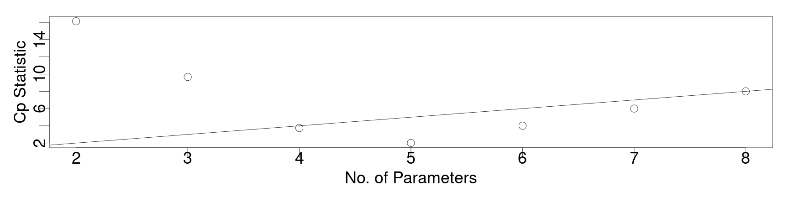
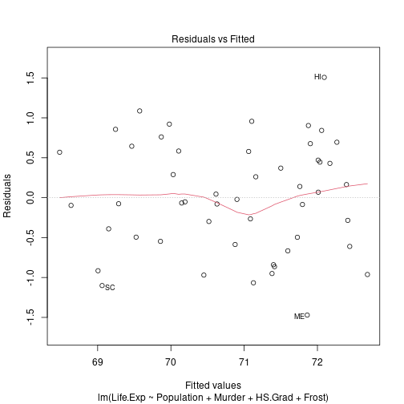
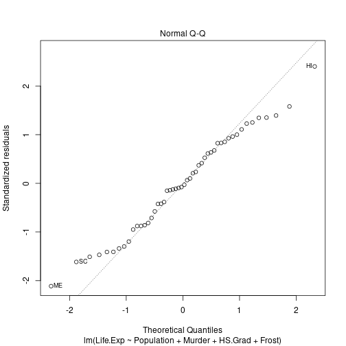
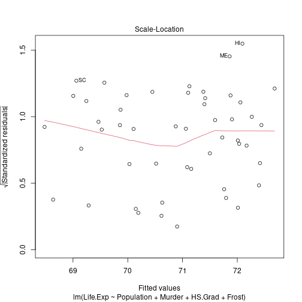
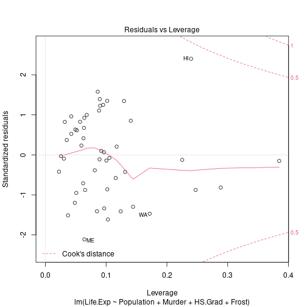
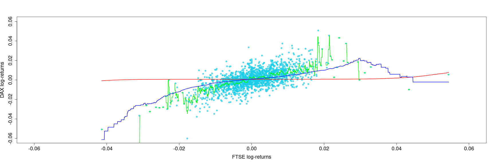

<style>
.section .reveal .state-background {
   background: #ffffff;
}
.section .reveal h1,
.section .reveal h2,
.section .reveal p {
   color: black;
   margin-top: 50px;
   text-align: center;
}
</style>


Regression part II
========================================================
autosize: true
incremental: true
width: 1920
height: 1080

<h2 style="text-align:left"> Instructions:</h2>
<p style='text-align:left'>Use the left and right arrow keys to navigate the presentation forward and backward respectively.  You can also use the arrows at the bottom right of the screen to navigate with a mouse.<br></p>

<blockquote>
FAIR USE ACT DISCLAIMER:</br>
This site is for educational purposes only.  This website may contain copyrighted material, the use of which has not been specifically authorized by the copyright holders. The material is made available on this website as a way to advance teaching, and copyright-protected materials are used to the extent necessary to make this class function in a distance learning environment.  The Fair Use Copyright Disclaimer is under section 107 of the Copyright Act of 1976, allowance is made for “fair use” for purposes such as criticism, comment, news reporting, teaching, scholarship, education and research.
</blockquote>


========================================================

<h2>Outline</h2>

<ul>
  <li>The following topics will be covered in this lecture:</li>
  <ul>
    <li>Information criteria for model selection</li>
    <li>An example of model selection</li>
    <li>Examining model quality</li>
    <li>Nonparametric regression</li>
    </ul>
</ul>

========================================================
## Introduction to regression

* In the last part, we saw how we can form a basic regression model with a proposal of the relationship for how the variables $Y$ and $X$ vary together as

  $$\begin{align}
  Y = g(X) + \epsilon & & \epsilon \sim F_\epsilon.
  \end{align}$$
  
* Particularly, when we assume a linear form this is written as

  $$\begin{align}
  Y = \beta_0 + \beta_1 X_1 + \cdots + \beta_{p-1} X_{p-1} + \epsilon.
  \end{align}$$
  
* We also saw some basic methods of hypothesis testing and evaluating the goodness of fit for this model.

* However, neither $R^2$ nor adjusted $R^2$ may be totally adequate for differentiating between different plausible choices for the relationship.

  * Likewise, hypothesis testing for a "best" choice may saturate the p-values with many hypothesis tests, in which we will very likely obtain false positives and false negatives for significance.

* When we have many possible variables to regress upon, other popular means of model selection include criterion methods, including the AIC, the BIC and Mallow's Cp.

========================================================

## Information criteria

* The Akaike informtation criterion (AIC) is given as

  $$\begin{align}
  AIC = n \log\left(\frac{\hat{\boldsymbol{\epsilon}}^\mathrm{T}\hat{\boldsymbol{\epsilon}}}{n}\right) + 2p
  \end{align}$$
  
* Lower AIC scores are preferred, where this can be seen as an optimization of
  1. minimizing the average, sum of square residuals of the predicted versus the observed data; versus
  2. the number of parameters we choose to include in the model.

* There are many different possible criteria we can consider, of similar flavor to the above, for the model selection.

* The most well-known competitor is the Bayes Information Criterion (BIC) given of the form,

  $$\begin{align}
  \mathrm{BIC} =2n \log\left(\frac{\hat{\boldsymbol{\epsilon}}^\mathrm{T}\hat{\boldsymbol{\epsilon}}}{n}\right) + p \log(n),
  \end{align}$$
  
* The BIC is extremely similar, but it has a stronger penalty term and favors simpler models overall.

* From a numerical optimization perspective, both of the above can be considered penalized objective functions, where we penalize models for becoming too complex without added value in terms of goodness of fit.

========================================================
<h3> An example of criterion approaches versus backward selection</h3>

* We will study this in an example looking at life expectancy as regressed upon by demographic factors in various states of the USA, 


```r
require("faraway")
statedata <- data.frame(state.x77,row.names=state.abb)
head(statedata)
```

```
   Population Income Illiteracy Life.Exp Murder HS.Grad Frost   Area
AL       3615   3624        2.1    69.05   15.1    41.3    20  50708
AK        365   6315        1.5    69.31   11.3    66.7   152 566432
AZ       2212   4530        1.8    70.55    7.8    58.1    15 113417
AR       2110   3378        1.9    70.66   10.1    39.9    65  51945
CA      21198   5114        1.1    71.71   10.3    62.6    20 156361
CO       2541   4884        0.7    72.06    6.8    63.9   166 103766
```

<ul>
  <li>Here the demographic factors include:</li>
  <ol>
    <li>Population -- population of the state; </li>
    <li>Income -- income per capita in the state</li>
    <li>Illiteracy -- illiteracy per capita in the state</li>
    <li>Murder -- murder rate per 100,000 people in the state</li>
    <li>HS Grad -- High school graduation rate in the state per capita</li>
    <li>Frost -- mean number of days with minimum temperature below freezing in the capital or other large city;</li>
    <li>Area -- land area of the state in square miles.</li>
  </ol>
</ul>

========================================================
<h3> An example of criterion approaches versus backward selection</h3>

* With a pre-selected value of $\alpha_\mathrm{crit}=5\%$, we will go through backward elimination -- i.e., we will eliminate predictors which are not significant.


```r
lmod <- lm(Life.Exp ~ ., statedata)
sumary(lmod)
```

```
               Estimate  Std. Error t value  Pr(>|t|)
(Intercept)  7.0943e+01  1.7480e+00 40.5859 < 2.2e-16
Population   5.1800e-05  2.9187e-05  1.7748   0.08318
Income      -2.1804e-05  2.4443e-04 -0.0892   0.92934
Illiteracy   3.3820e-02  3.6628e-01  0.0923   0.92687
Murder      -3.0112e-01  4.6621e-02 -6.4590  8.68e-08
HS.Grad      4.8929e-02  2.3323e-02  2.0979   0.04197
Frost       -5.7350e-03  3.1432e-03 -1.8246   0.07519
Area        -7.3832e-08  1.6682e-06 -0.0443   0.96491

n = 50, p = 8, Residual SE = 0.74478, R-Squared = 0.74
```

* As a remark, in the big model we see that the murder rate is strongly significant explanatory variable on life expectancy but, unusually, income (for this model) is not.

* This may be understood in part where other variables tigthly correlated with income (illiteracy, education) might make some information redundant.

* The p-values of one t-test depend on the other variables in the model in general; 

  * the presence of a highly correlated variable may make one variable lose significance in the presence of the other. 

========================================================
<h3> An example of criterion approaches versus backward selection</h3>

* On the last summary, Area had the largest p-value greater than $5\%$, so we eliminate this, using the "update" function.


```r
lmod <- update(lmod, . ~ . - Area)
sumary(lmod)
```

```
               Estimate  Std. Error t value  Pr(>|t|)
(Intercept)  7.0989e+01  1.3875e+00 51.1652 < 2.2e-16
Population   5.1883e-05  2.8788e-05  1.8023   0.07852
Income      -2.4440e-05  2.3429e-04 -0.1043   0.91740
Illiteracy   2.8459e-02  3.4163e-01  0.0833   0.93400
Murder      -3.0182e-01  4.3344e-02 -6.9634 1.454e-08
HS.Grad      4.8472e-02  2.0667e-02  2.3454   0.02369
Frost       -5.7758e-03  2.9702e-03 -1.9446   0.05839

n = 50, p = 7, Residual SE = 0.73608, R-Squared = 0.74
```

========================================================
<h3> An example of criterion approaches versus backward selection</h3>

* Subsequently, illiteracy should be removed:


```r
lmod <- update(lmod, . ~ . - Illiteracy)
sumary(lmod)
```

```
               Estimate  Std. Error t value  Pr(>|t|)
(Intercept)  7.1066e+01  1.0289e+00 69.0669 < 2.2e-16
Population   5.1149e-05  2.7095e-05  1.8878   0.06566
Income      -2.4771e-05  2.3160e-04 -0.1070   0.91531
Murder      -3.0001e-01  3.7042e-02 -8.0992 2.907e-10
HS.Grad      4.7758e-02  1.8591e-02  2.5689   0.01367
Frost       -5.9099e-03  2.4678e-03 -2.3948   0.02095

n = 50, p = 6, Residual SE = 0.72773, R-Squared = 0.74
```

========================================================
<h3> An example of criterion approaches versus backward selection</h3>

* Next, we remove income,


```r
lmod <- update(lmod, . ~ . - Income)
sumary(lmod)
```

```
               Estimate  Std. Error t value  Pr(>|t|)
(Intercept) 71.02712853  0.95285296 74.5415 < 2.2e-16
Population   0.00005014  0.00002512  1.9960  0.052005
Murder      -0.30014880  0.03660946 -8.1987 1.775e-10
HS.Grad      0.04658225  0.01482706  3.1417  0.002968
Frost       -0.00594329  0.00242087 -2.4550  0.018018

n = 50, p = 5, Residual SE = 0.71969, R-Squared = 0.74
```


========================================================
<h3> An example of criterion approaches versus backward selection</h3>

* and finally we remove population:


```r
lmod <- update(lmod, . ~ . - Population)
sumary(lmod)
```

```
              Estimate Std. Error t value  Pr(>|t|)
(Intercept) 71.0363788  0.9832622 72.2456 < 2.2e-16
Murder      -0.2830652  0.0367313 -7.7064 8.039e-10
HS.Grad      0.0499487  0.0152011  3.2859  0.001950
Frost       -0.0069117  0.0024475 -2.8240  0.006988

n = 50, p = 4, Residual SE = 0.74267, R-Squared = 0.71
```

* we could possibly include population anyway (as it is really on the line), but the difference in $R^2$ is not large, so we may prefer the smaller model.

========================================================
<h3> An example of criterion approaches versus backward selection</h3>

* It therefore is important to remember that even when we have removed a variable, this doesn't mean that it has no impact on the response -- this is always understood relative to the overall model in questions.

* Respectively, if we fit,


```r
sumary(lm(Life.Exp ~ Illiteracy+Murder+Frost, statedata))
```

```
              Estimate Std. Error  t value  Pr(>|t|)
(Intercept) 74.5567171  0.5842507 127.6108 < 2.2e-16
Illiteracy  -0.6017607  0.2989270  -2.0131  0.049981
Murder      -0.2800474  0.0433940  -6.4536 6.033e-08
Frost       -0.0086910  0.0029595  -2.9367  0.005166

n = 50, p = 4, Residual SE = 0.79112, R-Squared = 0.67
```

we see that illiteracy is significant with respect to a different choice of variables.

* Particularly, we cannot reliably conclude that illiteracy is not a variable of interest, only that it is surprising that it would be more important than the other variables in the model chosen by backward selection.

  

========================================================

<h3> An example of criterion approaches versus backward selection</h3>

* We will use the BIC to reselect the life expectancy model by state, using the `leaps` library -- this will exhaustively search through the dataset for the best: 1 predictor model, 2 predictor model, 3 predictor model, and so forth...


```r
library("leaps")
sum_life <- summary(regsubsets(Life.Exp~.,data=statedata))
sum_life
```

```
Subset selection object
Call: regsubsets.formula(Life.Exp ~ ., data = statedata)
7 Variables  (and intercept)
           Forced in Forced out
Population     FALSE      FALSE
Income         FALSE      FALSE
Illiteracy     FALSE      FALSE
Murder         FALSE      FALSE
HS.Grad        FALSE      FALSE
Frost          FALSE      FALSE
Area           FALSE      FALSE
1 subsets of each size up to 7
Selection Algorithm: exhaustive
         Population Income Illiteracy Murder HS.Grad Frost Area
1  ( 1 ) " "        " "    " "        "*"    " "     " "   " " 
2  ( 1 ) " "        " "    " "        "*"    "*"     " "   " " 
3  ( 1 ) " "        " "    " "        "*"    "*"     "*"   " " 
4  ( 1 ) "*"        " "    " "        "*"    "*"     "*"   " " 
5  ( 1 ) "*"        "*"    " "        "*"    "*"     "*"   " " 
6  ( 1 ) "*"        "*"    "*"        "*"    "*"     "*"   " " 
7  ( 1 ) "*"        "*"    "*"        "*"    "*"     "*"   "*" 
```


========================================================

<h3> An example of the BIC</h3>


* With three explanatory variables, we find the model that uses the murder rate, high school graduation and frost variables once again.

* The BIC for each "best model in p-parameters" can be called with


```r
sum_life$bic
```

```
[1] -39.22051 -42.62472 -46.70678 -47.03640 -43.13738 -39.23342 -35.32373
```

* Note, the scale of the above values are interpretable in terms of the difference of each BIC computed versus the minimum attainable over the data set.

* Therefore, we can rescale to have more meaning as


```r
sum_life$bic - min(sum_life$bic)
```

```
[1]  7.8158932  4.4116859  0.3296237  0.0000000  3.8990253  7.8029800 11.7126711
```

* Models that have relatively small difference $\mathcal{O}\left(10^{-1}\right)$ or $\mathcal{O}\left(10^{0}\right)$ are those that can be reasonably considered as alternatives to the empirical minimum computed above.

========================================================

<h3> Adjusted $R^2_a$</h3>


* We also see the $R^2$ and adjusted $R^2_a$ of each model by calling this as an argument of the summary of the output:


```r
sum_life$rsq
```

```
[1] 0.6097201 0.6628461 0.7126624 0.7360328 0.7361014 0.7361440 0.7361563
```

```r
sum_life$adjr2
```

```
[1] 0.6015893 0.6484991 0.6939230 0.7125690 0.7061129 0.6993268 0.6921823
```

* As with $R^2$, the $R^2_a$ represents better fit when it is larger.

* In each of these alternative measures, we see that the model with population included (4 predictors) is actually favored.


========================================================

<h3> Mallow's $C_p$</h3>

* As an alternative criterion, we can consider "how well does the model predict?" in the mean square sense.

* In the case that there isn't a lack of fit, then the Mallow's $C_p \approx p$, the number of parameters.

* Therefore, Mallow's $C_p$ favors the smallest model of $p_0$ parameters where the coefficient is $C_{p_0} \approx p_0$, approaching $p_0$ from above.

  * For any values of Mallow's $C_p$ which are smaller, but for which $C_p &lt; p$, we conclude that there is not a good fit to the data.
  
* We can extract Mallow's $C_p$ as a value from the regsubsets summary as,


```r
sum_life$cp
```

```
[1] 16.126760  9.669894  3.739878  2.019659  4.008737  6.001959  8.000000
```
 

========================================================

<h3> Mallow's $C_p$</h3>

* We plot Mallow's $C_p$ versus the number of <b>parameters</b> as 
  

```r
par(cex=3, mai=c(1.5,1.5,.5,.5), mgp=c(1,0,0))
plot(2:8,sum_life$cp,xlab="No. of Parameters",ylab="Cp Statistic")
abline(0,1)
```



* Notice, Mallow's $C_p$ gives an indication that the model with 3 predictors (4 parameters) is a good choice;

  * the model with 4 predictors (5 parameters) has fallen too low, and is no longer a good fit in this sense.

========================================================

<h3> Practical computation for large models</h3>

* We note that combinatorially, if we have $q$ potential explanatory variables that we might try to choose whether or not to put into a model, there will be to choices per variable:
  <ol>
  <li>yes we include this;</li>
  <li>no we don't include this.</li>
  </ol>
* Each choice is independent from each other choice, so that the total number of combinations we can consider is $2^q$.

* Suppose there are 20 possible variables we might consider -- this corresponds to:


```r
as.integer(2)^20
```

```
[1] 1048576
```
 
 * That is, we will have over one million  models to compare... 
 
* Exhaustive search is strictly infeasible even for a (relatively) small number of possible explanatory variables.

  * In practice, this will depend on computational power limitations, but typically we must compromise.  
  
  * Try using exhaustive search based on your hardware, and if there is no reasonable time to convergence, quit it.

========================================================

### Step-wise information criteria

* An alternative is to use an incremental approach, mixing the ad-hoc method we considered at the beginning, with a specific criterion for the best choice of model.

* Particularly we can compute, e.g., the AIC for all one predictor models;

* then we can compute the AIC for all two predictor models with the first chosen variable imposed on the model with two predictors.

* This may not produce an optimal model in the same sense as exhaustive search, but is a cheaper alternative that avoids the problems with many multiple hypothesis tests.

* This is done explicitly in R with the "step" function.

* Likewise, this can be done by a method of reduction starting with a large model.
  
  * By default, the step function will use the backward method, though it can be performed by forward, backward or both-ways selection.
  
========================================================

### Step-wise information criteria

* The output process is too long to see completely on the slide, but the code is presented for reference.


```r
lm_step <- step(lm(Life.Exp ~ ., data=statedata))
```

```
Start:  AIC=-22.18
Life.Exp ~ Population + Income + Illiteracy + Murder + HS.Grad + 
    Frost + Area

             Df Sum of Sq    RSS     AIC
- Area        1    0.0011 23.298 -24.182
- Income      1    0.0044 23.302 -24.175
- Illiteracy  1    0.0047 23.302 -24.174
<none>                    23.297 -22.185
- Population  1    1.7472 25.044 -20.569
- Frost       1    1.8466 25.144 -20.371
- HS.Grad     1    2.4413 25.738 -19.202
- Murder      1   23.1411 46.438  10.305

Step:  AIC=-24.18
Life.Exp ~ Population + Income + Illiteracy + Murder + HS.Grad + 
    Frost

             Df Sum of Sq    RSS     AIC
- Illiteracy  1    0.0038 23.302 -26.174
- Income      1    0.0059 23.304 -26.170
<none>                    23.298 -24.182
- Population  1    1.7599 25.058 -22.541
- Frost       1    2.0488 25.347 -21.968
- HS.Grad     1    2.9804 26.279 -20.163
- Murder      1   26.2721 49.570  11.569

Step:  AIC=-26.17
Life.Exp ~ Population + Income + Murder + HS.Grad + Frost

             Df Sum of Sq    RSS     AIC
- Income      1     0.006 23.308 -28.161
<none>                    23.302 -26.174
- Population  1     1.887 25.189 -24.280
- Frost       1     3.037 26.339 -22.048
- HS.Grad     1     3.495 26.797 -21.187
- Murder      1    34.739 58.041  17.456

Step:  AIC=-28.16
Life.Exp ~ Population + Murder + HS.Grad + Frost

             Df Sum of Sq    RSS     AIC
<none>                    23.308 -28.161
- Population  1     2.064 25.372 -25.920
- Frost       1     3.122 26.430 -23.877
- HS.Grad     1     5.112 28.420 -20.246
- Murder      1    34.816 58.124  15.528
```

========================================================

## Examining model quality


```r
lmod <- lm(Life.Exp ~ Population + Murder + HS.Grad + Frost, data=statedata)
summary(lmod)
```

```

Call:
lm(formula = Life.Exp ~ Population + Murder + HS.Grad + Frost, 
    data = statedata)

Residuals:
     Min       1Q   Median       3Q      Max 
-1.47095 -0.53464 -0.03701  0.57621  1.50683 

Coefficients:
              Estimate Std. Error t value Pr(>|t|)    
(Intercept)  7.103e+01  9.529e-01  74.542  < 2e-16 ***
Population   5.014e-05  2.512e-05   1.996  0.05201 .  
Murder      -3.001e-01  3.661e-02  -8.199 1.77e-10 ***
HS.Grad      4.658e-02  1.483e-02   3.142  0.00297 ** 
Frost       -5.943e-03  2.421e-03  -2.455  0.01802 *  
---
Signif. codes:  0 '***' 0.001 '**' 0.01 '*' 0.05 '.' 0.1 ' ' 1

Residual standard error: 0.7197 on 45 degrees of freedom
Multiple R-squared:  0.736,	Adjusted R-squared:  0.7126 
F-statistic: 31.37 on 4 and 45 DF,  p-value: 1.696e-12
```

* If we examine the step-wise AIC, we will find that the model above is favored. 

* Exhaustive search with AIC and BIC also favor this, but Mallow's Cp favors removing population (which is not significant).

========================================================

### Examining model quality

* It is often the case when variables are strongly correlated, we may have multiple reasonable choices for the model selection and the judgment of what is better may be qualitative.

* However, we should generally compare all reasonable models together to determine if we would arrive at the same conclusions between them.

* Likewise, we should examine the model quality to see if our linear model assumptions seem to be valid.

* In order to do so, one must generally use a series of diagnostics to determine if,
  1. the linear model itself seems plausible based on the relationships between the predictors and the response;
  2. it appears that the assumption $\mathrm{cov}\left(\boldsymbol{\epsilon}\right) = \sigma^2 \mathbf{I}$ is true;
  3. we can make formal hypothesis tests based on the assumption of normal error distributions (or by the central limit; theorem).
  4. unusual observations have contributed to a major change in the model fit and / or the interpretation. 
  
* Each of these topics can be given considerable attention, and it goes beyond our current scope to discuss this;

  * however, one typical means of doing so is pictured in the next slide.

========================================================


```r
plot(lmod)
```



========================================================
## Nonparametric regression

* The general idea of regression analysis is to find a reasonable relation between two variables $X$ and $Y$. 

* For n realizations $\{(x_i , y_i )\}_{i=1}^n$, the relation can be modeled by

  $$\begin{align}
  y_i = g(x_i) + \epsilon_i
  \end{align}$$
  for each $i=1,\cdots, n$ where $X$ is our explanatory variable, $Y$ is the explained variable, and $\epsilon$ is the noise.

* A parametric estimation would suggest $g(x_i) = g(x_i , \theta)$; 
  
  * therefore estimating $g$ results in estimating $\theta$ and using $\hat{g}(x_i) = g(x_i, \hat{\theta})$. 
  
* In contrast, nonparametric regression allows $g$ to have any shape, in the sense that $g$ need not belong to a set of defined functions. 

* Nonparametric regression provides a powerful tool by allowing wide flexibility for $g$. 

* It avoids a biased regression, and might be a good starting point for a parametric regression if no ‘a priori’ shape of $g$ is known. 

* It is also a reliable way to spot outliers within the regression.

========================================================
### Nonparametric regression

* In the above, the following general assumptions must hold:
  1. $\mathbb{E}\left[ \epsilon\right] = 0$ and $\mathrm{var}\left(\epsilon\right) = \sigma^2$
  2.  $g(x) \approx y_i$ , for $x \approx x_i$.
  3. If $x$ is ‘far’ from $x_j$, we want $(x_j , y_j )$ to not interact with $g(x)$ in the region of $x_i$.

* Therefore one has to build a function as a finite sum of $g_i(x)$, where $g_i(x)$ is related to the point $(x_i, y_i)$. 

* Without loss of generality,
  
  $$\begin{align}
  \hat{g}(x) = \sum_{i=1}^n g_i(x) & & g_i(x) \approx
  \begin{cases}
  y_i &\text{ when }x\approx x_i\\
  0 & \text{ else}
  \end{cases}
  \end{align}$$

* This can be written as a weighted sum or local average
  
  $$\begin{align}
  \hat{g}(x) = \sum_{i=1}^n w_i(x)y_i
  \end{align}$$
  with the weight $w_i(x)$ defined as a function of $x$, constructed from each $x_i$.

========================================================
### Nonparametric regression


* The form

  $$\begin{align}
  \hat{g}(x) = \sum_{i=1}^n w_i(x)y_i
  \end{align}$$
  is quite appealing, because it is similar to the solution of the least squares minimization problem.
  
* That is, it can be written as

  $$\begin{align}
  \min_{\theta \in \mathbb{R}}\sum_{i=1}^n w_i(x) \left(\theta - y_i\right)^2
  \end{align}$$
  which is solved for $\theta$.
  
* The benefit of this approach is thus that finding a local average is the same as finding a locally weighted least squares estimate, with some appropriate choice of weights.

* One method similar to the histogram divides the set of observations into bins of size $h$ and computes the mean within each bin by,

  $$\begin{align}
  \hat{g}(x) = \frac{\sum_{i=1}^n I\left\{\vert x - x_i\vert\ < h/2 \right\} \times y_i}{\sum_{i=1}^n I\left\{\vert x - x_i\vert\ < h/2 \right\}}
  \end{align}$$

* In the above, $I$ measures whether $x$ lies in the range $h/2$ from $x_i$ and gives a $1$ if yes and a $0$ if no;
  
  * $\hat{g}(x)$ then gives a local average of the values of $y_i$ within an appropriate range of $x$.


========================================================
### Nonparametric regression

* The previous method is implemented in R via the function `ksmooth()` choosing the parameter `kernel =’box’`.

* As with the density estimation, we can bring into play the kernel functions for the weights, giving more flexibility and smoother averages.

* We then have the general estimator $\hat{g}(x)$ related to the bandwidth $h$ and to a kernel $K$ given as,

$$\begin{align}
  \hat{g}(x) = \frac{\sum_{i=1}^n K\left(\frac{ x - x_i}{h}\right) \times y_i}{\sum_{i=1}^n K\left(\frac{ x - x_i}{h}\right)}
  \end{align}$$

* The weights are then given as,
  
  $$\begin{align}
  w_i = \frac{K\left(\frac{ x - x_i}{h}\right)}{\sum_{i=1}^n K\left(\frac{ x - x_i}{h}\right)}
  \end{align}$$
  
* The above type of estimator does come with flaws, as the choice of the bandwith $h$ is non-unique and may require separately some amount of optimization.

* For example, we regress the daily log-returns of the DAX stock index on the daily log-returns of the FTSE stock index with different choices of $h$ in the next slide.

========================================================

```r
require(datasets,class,grDevices,lattice)
r.dax = diff(log(EuStockMarkets[, 1]))
r.ftse = diff(log(EuStockMarkets[, 4]))
np.reg.b1 = ksmooth(r.ftse, r.dax, kernel = "box", bandwidth = 0.1) # h = 0.1
np.reg.b2 = ksmooth(r.ftse, r.dax, kernel = "box", bandwidth = length(r.dax)^(-1))# h = 1/n
np.reg.b3 = ksmooth(r.ftse, r.dax, kernel = "box", bandwidth = length(r.dax)^(-(1/2)))# h = 1/n^0.5
par(cex.axis = 1.5, cex.lab = 1.5, pch = 19, cex = 1)# graphical parameters
plot(r.ftse, r.dax, xlim = c(-0.06, 0.06), ylim = c(-0.06, 0.06), xlab = "FTSE log-returns", ylab = "DAX log-returns", col = rgb(0.1, 0.8, 0.9, alpha = 0.7))
lines(np.reg.b1, col = "red", lwd = 2)  # regression line with h = 0.1
lines(np.reg.b2, col = "green", lwd = 2)  # regression line with h = 1/n
lines(np.reg.b3, col = "blue", lwd = 2)  # regression line with h = 1/n^0.5
```



========================================================
### Nonparametric regression

* In addition to the need to tune hyper-parameters, we lose some of the interpretability that we can obtain with more structure by the linear regression / parametric model assumptions.

* In general, there are many tradeoffs in selecting a type of regression method, and it is most important to understand the strengths and limitations of different approaches.

  * This is especially important in how we reason with these methods, and if we can trust with any certainty the predictions and conclusions derived from the model.

* This is just meant to give a quick survey of some of the approaches one might take;

  * further information and references to follow more details about analysis and implementation is included in the recommended textbook.
