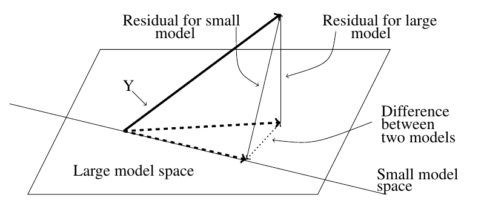

========================================================
author: 
date: 
autosize: true
incremental: true
width: 1920
height: 1080

========================================================

<h1> Inference</h1>

* Recall hypothesis testing:
 * Suppose we have a set of response variables and explanatory variables.
 * We want to see if the response variables have a systematic relationship with the explantory variables, or if this can be reduced to random variation.
 * Our null hypothesis $H_0$ is that there is no systematic structure, i.e.,
 $$
 \begin{align}
 \mathbf{Y} = \overline{\mathbf{Y}} + \boldsymbol{\epsilon}
 \end{align}
 $$
 
 * Our alternative hypothesis is that there does exist some (unknown) set of values $\beta$ for which
 
 $$
 \begin{align}
 \mathbf{Y} = \mathbf{X} \boldsymbol{\beta} + \epsilon
 \end{align}
 $$
 
 * Hypothesis testing is a systematic methodology to determine <b>significance</b> of events.  
 * <b>Note:</b> This does not imply causation -- rather the significance can be thought of as<br><br>
   <b>"how suprised would we be if this was just random variation?"</b>
 * The significance level we assign to the test is the measure of "how suprising" it would be to find out there was no structure.
 * Similarly, we might test individual explanatory variables for significance in the relationship.
 
 * That is, does the variable $x_1$ describe a response that would be suprising to find was just random variation?
 
========================================================

<h2> Assumptions </h2>

* So far, we have only made assumptions on the first two moments of the variation $\boldsymbol{\epsilon}$, i.e.,

 $$\begin{align}
\mathbf{E}\left[\boldsymbol{\epsilon}\right]& = 0\\
\mathbf{E}\left[\boldsymbol{\epsilon}\boldsymbol{\epsilon}^\mathrm{T}\right]& = \sigma^2 \mathbf{I}\\
\end{align}$$

* To use standard methods for hypothesis testing and confidence intervals, <b>we will now assume additionally Gaussianity</b>, $\boldsymbol{\epsilon} \sim N(0, \sigma^2 \mathbf{I})$.

* In particular, all higher moments will be equal to zero.

* <b>Exercise:</b> using this assumption, and $\mathbf{Y} = \mathbf{X}\boldsymbol{\beta} + \boldsymbol{\epsilon}$, what is the distribution of $\mathbf{Y}$?

<b>A:</b>
 $$\begin{align}
\mathbf{Y} \sim N(\mathbf{X}\boldsymbol{\beta}, \sigma^2 \mathbf{I}) 
 \end{align}$$

* <b>Exercise:</b> using the previous exercise, what is the distribution of $\hat{\boldsymbol{\beta}}$?

<b>A:</b>
 $$\begin{align}
&\mathbf{Y} \sim N(\mathbf{X}\boldsymbol{\beta}, \sigma^2 \mathbf{I}) \\
\Rightarrow & \hat{\boldsymbol{\beta}} = \left(\mathbf{X}^\mathrm{T}\mathbf{X}\right)^{-1}\mathbf{X}^\mathrm{T}\mathbf{Y} \sim  N(\boldsymbol{\beta},\left(\mathbf{X}^\mathrm{T}\mathbf{X}\right)^{-1}\sigma^2 \mathbf{I})
\end{align}$$

========================================================

<h2>Occam's Razor</h2>

* In principle, we favor solutions to problems that are as simple as possible.
 * Occam's Razor is the philisophical principle that, <br><br>
 <b>"When presented with competing hypotheses to solve a problem, one should select the solution with the fewest assumptions."</b>

* This makes the problem easier to interpret, and our models transparent in their predictions.

* Suppose we have a large model $\boldsymbol{\Omega}$, which abstractly refers to the set of all linear models possible by choices of $\beta$, and their respective uncertainties, over certain variables $x_1, x_2, \cdots, x_p$.

* Let $q < p$, and suppose that abstractly $\boldsymbol{\omega}$ represents a "smaller model", as found by a strictly smaller set of explanatory variables, $x_1, x_2, \cdots, x_q$.

* We will say that we favor the model $\boldsymbol{\omega}$ unless $\boldsymbol{\Omega}$ provides appreciably better results.
 
 * I.e., if $RSS_\boldsymbol{\omega} - RSS_\boldsymbol{\Omega}$ is small, then we favor the former. 
 
 * With an additional scaling factor, we can use this principle directly as a test statistic for the null hypothesis, i.e.,
 
 $$\begin{align}
 \frac{RSS_\boldsymbol{\omega} - RSS_\boldsymbol{\Omega}}{RSS_\boldsymbol{\Omega}}
 \end{align}$$
 
========================================================

<h2>Likelihood Ratio test</h2>

* The above test statistic actually is derived in terms of the ratio of likelihood functions.

* <b>Q:</b> What is a likelihood function?

 * Consider a generic probability distribution, denoted $P_\theta(x)$ where there is some parameter that the distribution depends on.
 
 * The (random) values for $x$ will be drawn from $P_\theta$, but for some unkown choice of $\theta$.
 
 * We assume that even though $\theta$ is not known, <b>we can evaluate</b>
 
 $$\begin{align}
  0 \leq P_\theta(x) \leq1
 \end{align}$$
 for any choice of $\theta$ and some observed piece of data $x$.
 
 * Then, the likelihood of $\theta$ based on $x$ is defined
 
 $$\begin{align}
 \mathcal{L}(\theta \vert x) = P_\theta(x)
 \end{align}$$
 
 where we <b> evaluate the probability</b> with an observed piece of data $x$ given a <b>choice</b> of $\theta$. 

 * The "likelihood" is thus a description of how well does our choice of parameter describe the observed data.
 
========================================================

<h2> Likelihood ratio testing </h2>

* Let's consider the likelihood function

 $$\begin{align}
 \mathcal{L} (\boldsymbol{\beta}, \sigma \vert \mathbf{Y} )
 \end{align}$$
 representing the likelihood of the parameter vector $\beta$ and the associated uncertainties with respect to the observed response variables.
 
 * The following,
 
 $$\begin{align}
 max_{\boldsymbol{\beta}, \sigma \in \boldsymbol{\Omega}} \mathcal{L} (\boldsymbol{\beta}, \sigma \vert \mathbf{Y} )
 \end{align}$$
 
 will represent the <b> maximum likelihood attainable</b> over all choices of $\beta$ (and their uncertainties) in $\Omega$.
 
 * On the other hand,
 
 $$\begin{align}
 max_{\boldsymbol{\beta}, \sigma \in \boldsymbol{\omega}} \mathcal{L} (\boldsymbol{\beta}, \sigma \vert \mathbf{Y} )
 \end{align}$$
 
 will represent the <b> maximum likelihood attainable</b> over all choices of $\beta$ (and their uncertainties) in $\omega$.
 
* Then, the likelihood ratio statistic is defined as

 $$\begin{align}
 \frac{ max_{\boldsymbol{\beta}, \sigma \in \boldsymbol{\Omega}} \mathcal{L} (\boldsymbol{\beta}, \sigma \vert \mathbf{Y} )}{max_{\boldsymbol{\beta}, \sigma \in \boldsymbol{\omega}} \mathcal{L} (\boldsymbol{\beta}, \sigma \vert \mathbf{Y} )}
 \end{align}$$

========================================================

* If the likelihood ratio statistic is too large (by some measure of significance), we can say that:
 * "it would be very surprising that the high likelihood of the larger model versus the low likelihood of the small model is just due to random variation."  

* In the above situation, we reject the null hypothesis, i.e., we reject the small model $\boldsymbol{\omega}$.

* With enough derivations (found in another course...) we will find out that this test boils down to,

 * If

 $$\begin{align}
 \frac{RSS_\boldsymbol{\omega} - RSS_\boldsymbol{\Omega}}{RSS_\boldsymbol{\Omega}} > \text{some constant}
 \end{align}$$
 
 then reject the null hypothesis.
 
 
========================================================

* When we explicitly utilize the degrees of freedom for each model, we get a statement we can evaluate for hypothesis testing.

* Recall, $\boldsymbol{\omega}$ uses $q < p$ explanatory variables, while $\boldsymbol{\Omega}$ uses $p$.

* We find (with more difficult derivations...)

 $$\begin{align}
 F &\triangleq \frac{ \left( RSS_\boldsymbol{\omega} - RSS_\boldsymbol{\Omega}\right)/ (p-q)}{RSS_\boldsymbol{\Omega}/(n-p)} 
 \end{align}$$
 
 is an $F$ statistic, with $F$ distribution under the null hypothesis.
 
* This is to say,

 * "If the null hypothesis holds, then $F \sim F_{(p-q),(n-p)}$"

* We will thus study how surprising this value is or not, based on the assumption that $F$ is drawn from the $F_{(p-q),(n-p)}$.


========================================================

 <div style="float:left; width:50%">

Courtesy of IkamusumeFan [CC BY-SA 4.0 (https://creativecommons.org/licenses/by-sa/4.0)]
</div>

<div style="float:right; width:50%">

<ul>
<li> The hypothesis testing procedure thus follows the following idea:</li>

<ul>
 <li> Let us say (for sake of example) we want to choose a model with $\alpha =95\%$ significance or higher. </li>
 
 <li> We will look at the appropriate $F$ distribution and find the value of 
 $$ F^\alpha_{ (p-q), (n-p) }$$ 
 
 <li> such that the probability of 
 $$F \sim F_{(p-q),(n-p)}$$ </li>
 
 <li><b> and </b> 
 $$F > F^\alpha_{(p-q),(n-p)}$$ </li>
 
 <li>is less than 
 $$(100\% - \alpha) = 5 \%.$$ </li>

</ul>

</ul>

</div>
 
 
========================================================

<h2> Main ideas</h2>

 <div style="float:left; width:50%">

</div>

<div style="float:right; width:50%">

<ul>
  <li> When we have <b>Gaussian errors, $\boldsymbol{\epsilon}\sim N(0, \sigma^2 \mathbf{I})$</b> ,</li>
  <ul>
    <li> if we have a "large model" and a smaller, simpler version of the model,</li>
    <li> we can express the difference in the models as $RSS_\boldsymbol{\omega} - RSS_\boldsymbol{\Omega}$.</li>
    <li> When this difference is "small" relative to various considerations, we should reject the large model for simplicity.</li>
    <li> However, when there is an appreciable difference in the results, i.e.,</li>
    <ul>
      <li>with high significance in the F-test (we would be very suprised that this result was due to random variation)</li>
    </ul>
  <li> we accept the larger model</li>
  </ul>
</ul>

</div>

========================================================

<h2> An example</h2>

* Let's consider the null hypothesis that there is no structure whatsover between the response variables and the explanatory variables.

* That is, we suppose the relationship looks like
 $$\begin{align}
  \mathbf{Y} = \overline{\mathbf{Y}} + \epsilon
  \end{align}$$
  
* The null hypothesis is thus, $H_0 : \boldsymbol{\beta} = \boldsymbol{0}$.

* <b>Exercise:</b> what is $RSS_\omega$ in this case?

* <b>A:</b> This is the diffence of the predicted value versus the observed, i.e.,

  $$\begin{align}
  \boldsymbol{\epsilon}_\boldsymbol{\omega}^\mathrm{T}   \boldsymbol{\epsilon}_\boldsymbol{\omega} &= \left(\mathbf{Y} - \overline{\mathbf{Y}}  \right)^\mathrm{T}\left(\mathbf{Y} - \overline{\mathbf{Y}}\right) \\  
  &=\text{TSS or total sum of squares}
  \end{align}$$


========================================================

* Let us consider again the gala data...


```r
library('faraway')
lmod <- lm(Species ~ Area + Elevation + Nearest + Scruz + Adjacent,
gala)
sumary(lmod)
```

```
             Estimate Std. Error t value  Pr(>|t|)
(Intercept)  7.068221  19.154198  0.3690 0.7153508
Area        -0.023938   0.022422 -1.0676 0.2963180
Elevation    0.319465   0.053663  5.9532 3.823e-06
Nearest      0.009144   1.054136  0.0087 0.9931506
Scruz       -0.240524   0.215402 -1.1166 0.2752082
Adjacent    -0.074805   0.017700 -4.2262 0.0002971

n = 30, p = 6, Residual SE = 60.97519, R-Squared = 0.77
```

* Here we fit the model with explanatory variables describing a response with "lmod"

========================================================

* Secondly, we will fit the null model 


```r
nullmod <- lm(Species ~ 1, gala)
sumary(nullmod)
```

```
            Estimate Std. Error t value  Pr(>|t|)
(Intercept)   85.233     20.929  4.0725 0.0003285

n = 30, p = 1, Residual SE = 114.63305, R-Squared = 0
```

========================================================

* Explicitly, the F-test can be computed as follows

 * The RSS of each of the models
    
    ```r
    (rss0 <- deviance(nullmod))
    ```
    
    ```
    [1] 381081.4
    ```
    
    ```r
    (rss <- deviance(lmod))
    ```
    
    ```
    [1] 89231.37
    ```

 * The degrees of freedom of each model  
    
    ```r
    (df0 <- df.residual(nullmod))
    ```
    
    ```
    [1] 29
    ```
    
    ```r
    (df <- df.residual(lmod))
    ```
    
    ```
    [1] 24
    ```

========================================================

* Then, we compute the fstatistic with the ratio of likelihoods

```r
(fstat <- ((rss0-rss)/(df0-df))/(rss/df))
```

```
[1] 15.69941
```

* Finally, we determine the probability of this value being drawn from the F distribution in the two parameters df0 - df (or n-p) and df (or p -q, as q=0 in this case).

```r
1-pf(fstat, df0-df, df)
```

```
[1] 6.837893e-07
```

* The probability of this value  is approximately zero, on the order of $10^{-7}$.

========================================================

* Similarly, this can be computed in an analysis of variance (ANOVA) table


```r
anova(nullmod, lmod)
```

```
Analysis of Variance Table

Model 1: Species ~ 1
Model 2: Species ~ Area + Elevation + Nearest + Scruz + Adjacent
  Res.Df    RSS Df Sum of Sq      F    Pr(>F)    
1     29 381081                                  
2     24  89231  5    291850 15.699 6.838e-07 ***
---
Signif. codes:  0 '***' 0.001 '**' 0.01 '*' 0.05 '.' 0.1 ' ' 1
```

* We reject the null hypothesis and conclude that <b>at least one explantory variable</b> has predictive power.
