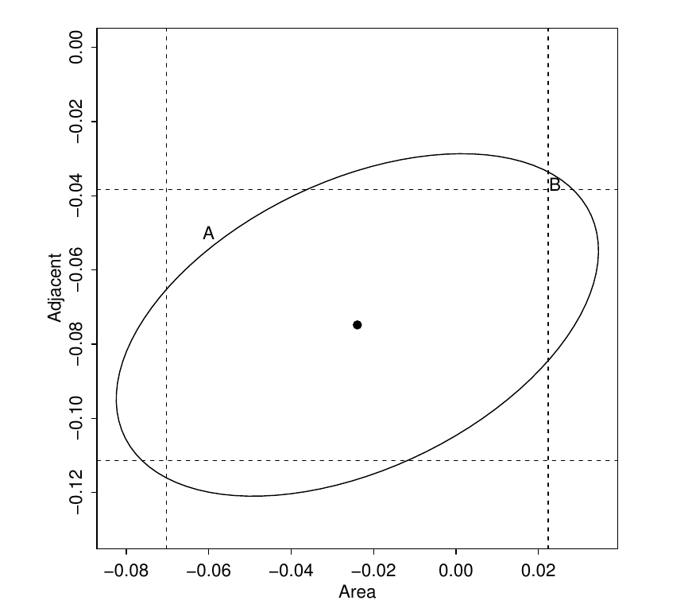

========================================================
author: 
date: 
autosize: true
incremental: true
width: 1920
height: 1080

========================================================
<h2> From last time</h2>

* We have learned so far how to test the significance of a given parameter $\boldsymbol{\beta}_i=0$, which would reduce the model space $\boldsymbol{\Omega}$ to the subspace $\boldsymbol{\omega}$ where $x_i$ has no effect on the response.

* We may quite similarly test the significance of a parameter having a specific value (other than zero), where $\boldsymbol{\omega}$ will represent the subspace of the big model space $\boldsymbol{\Omega}$ where $x_i$ has a specified effect.

* Consider the null hypothesis $H_0: \boldsymbol{\beta}_{Elevation} = 0.5$, versus the alternative hypothesis where we consider the space of models over "Species ~ Area + Adjacent + Elevation + Nearest + Scruz"


* We use the function "offset" to fix the associated value $\boldsymbol{\beta}_{Elevation} = 0.5$


```r
library(faraway)
lmod <- lm(Species ~ Area + Elevation + Nearest + Scruz + Adjacent, data=gala)
lmods <- lm(Species ~ Area+ offset(0.5*Elevation) + Nearest + Scruz + Adjacent, gala)
anova(lmods, lmod)
```

```
Analysis of Variance Table

Model 1: Species ~ Area + offset(0.5 * Elevation) + Nearest + Scruz + 
    Adjacent
Model 2: Species ~ Area + Elevation + Nearest + Scruz + Adjacent
  Res.Df    RSS Df Sum of Sq      F   Pr(>F)   
1     25 131312                                
2     24  89231  1     42081 11.318 0.002574 **
---
Signif. codes:  0 '***' 0.001 '**' 0.01 '*' 0.05 '.' 0.1 ' ' 1
```

========================================================

* <b>Note:</b> there is a simpler form of the previous test which relates to the t-test.

*  Suppose we want to test the following null hypothesis, 
 $$H_0: \boldsymbol{\beta}_{Elevation} = C$$
 for some constant $C$ as discussed above.
 
* If $\hat{\boldsymbol{\beta}}_i$ is the solution by least squares, we can compute<br>
$$\begin{align}
t = \frac{\left(\hat{\boldsymbol{\beta}}_i - C\right)}{se(\boldsymbol{\beta})}
\end{align}$$

* It turns out that this is also t distributed so that pulling the values from before


```r
(tstat <- (0.31946-0.5)/0.05366)
```

```
[1] -3.364517
```

* We can compute the p-value for this realization of $t$ with a two-sided t-test,


```r
 2*pt(tstat, 24)
```

```
[1] 0.002572168
```

========================================================


<h2> Review of main ideas for hypothesis testing</h2>

* We can use the F-test in many cases to study the significance of explanatory variables, combinations of explanatory variables and particular values for the effect on the response...
 * <h3>if the null hypothesis is repsented as an "embedded sub-model"</b>.
 * Examples are:
 <ol>
    <li> excluding some number of explanatory variables from the large model;</li>
    <li> combining several explanatory variables from the large model into a single explanatory variable;</li>
    <li> specifying a particular value for the effect of some explanatory variable on the response.</li>
 </ol>
 * For special cases:
  <ol>
    <li> excluding a <b>single</b> explanatory variable;</li>
    <li> specifying a particular value for the effect on the response;</li>
  </ol>
  
   * this is equivalent to a t-test with the appropriate number of degrees of freedom (n-p).
   
========================================================

<h1> Confidence intervals </h1>

* We return now to the idea of confidence intervals as an alternative (and dual) idea to hypothesis testing.

* Recall (under our Gaussian assumptions) 
 
 $$\boldsymbol{\epsilon} \sim N\left(\boldsymbol{0}, \sigma^2 \mathbf{I} \right)$$

* that

  $$\hat{\boldsymbol{\beta}} \sim N\left(\boldsymbol{\beta}, \left(\mathbf{X}^\mathrm{T}\mathbf{X}\right)^{-1} \sigma \right)$$
  
* In this context, we have an unbiased, sample based estimate for the true mean $\boldsymbol{\beta}$, with a known variance and $n-p$ degrees of freedom.

* <b> Q:</b> what is the preceding setup suggesting?

* <b>A:</b> we should create an interval centered at $\hat{\boldsymbol{\beta}}$ (using the t-distribution) with some measure of confidence that the true $\boldsymbol{\beta}$ lives within it.

 * Again, we do not say that the "true" $\boldsymbol{\beta}$ lives within such an interval with probability $x$, it lies there or not.  
 
 * Rather, we perform a procedure that over many sets of observations, and with respect to the precedure, we have guaranteed that the true value will lie in our interval with certain confidence $100(1-\alpha)\%$.
 
========================================================

* Let us say (similarly to hypothesis testing) we wish to guarantee $\alpha=5\%$ significance.

* Our confidence interval will take the form of

$$\begin{align}
\large{\left( \hat{\boldsymbol{\beta}}_i - t_{n-p}^{\frac{\alpha}{2}} se(\hat{\boldsymbol{\beta}}_i),  \hat{\boldsymbol{\beta}}_i + t_{n-p}^{\frac{\alpha}{2}} se(\hat{\boldsymbol{\beta}}_i)\right)}
\end{align}$$

* Where we define $\large{t_{n-p}^{\frac{\alpha}{2}} }$ to be the <b>critical value</b> for which, 
  * if $t \sim T_{n-p}$,
  
  * the probability of 
  $$\begin{align} 
  t > t_{n-p}^{\alpha/2}
  \end{align}$$
  is less than $\frac{\alpha}{2}$; and
  
  * the probability of 
  $$\begin{align} 
  -t < - t_{n-p}^{\alpha/2}
  \end{align}$$ 
  is less than $\frac{\alpha}{2}$;
  
  * Or equivalently,
  $$\begin{align}
  P(\vert t \vert >  t_{n-p}^{\frac{\alpha}{2}}) < \alpha
  \end{align}$$

========================================================

* Suppose that we wish to compute a confidence interval on $\boldsymbol{\beta}_{Area}$, such that with $95\%$ confidence, we say the "true value" of $\boldsymbol{\beta}_{Area}$ lives within it.
  

```r
sumary(lmod)
```

```
             Estimate Std. Error t value  Pr(>|t|)
(Intercept)  7.068221  19.154198  0.3690 0.7153508
Area        -0.023938   0.022422 -1.0676 0.2963180
Elevation    0.319465   0.053663  5.9532 3.823e-06
Nearest      0.009144   1.054136  0.0087 0.9931506
Scruz       -0.240524   0.215402 -1.1166 0.2752082
Adjacent    -0.074805   0.017700 -4.2262 0.0002971

n = 30, p = 6, Residual SE = 60.97519, R-Squared = 0.77
```
* We note that the standard error for "Area" is given as $\approx 0.022422$, 

* We compute the $2.5\%$ critical value for $T_{30 - 6}$ and obtain the confidence interval as,


```r
t_crit <- qt(0.975, 30-6)
-0.02394 + c(-1,1) * t_crit * 0.02242
```

```
[1] -0.07021261  0.02233261
```
* <b>Q:</b> does this indicate we can reject the null hypothesis $H_0: \boldsymbol{\beta}_{Area}=0$ at $5\%$ significance?

========================================================

* Similarly, we can compute the $95\%$ confidence interval for $\boldsymbol{\beta}_{Adjacent}$ with,

 * the $t_{30-6}^{2.5}$ critical value; and
 * the $se(\boldsymbol{\beta}_{Adjacent})$


```r
-0.07480 + c(-1,1) * t_crit * 0.01770
```

```
[1] -0.111331 -0.038269
```

* <b> Q:</b> Based on the above confidence interval, can we reject the null hypothesis $H_0: \boldsymbol{\beta}_{Adjacent}=0$ with $5\%$ significance?

* <b> A:</b> Yes.  

 * However, while we say (with $95\%$ confidence) that the effect of the adjacent island area is negative on the response, but the uncertainty is large, with the width of the interval on the same order as the coefficient itself,

```r
(-0.038269 + 0.111331)/abs(-0.07480)
```

```
[1] 0.9767647
```

========================================================

* We can find the confidence intervals of all parameters simultaneously (at the $95\%$ confidence level) as


```r
 confint(lmod)
```

```
                  2.5 %      97.5 %
(Intercept) -32.4641006 46.60054205
Area         -0.0702158  0.02233912
Elevation     0.2087102  0.43021935
Nearest      -2.1664857  2.18477363
Scruz        -0.6850926  0.20404416
Adjacent     -0.1113362 -0.03827344
```

* Setting another confidence level, e.g., $99\%$ can be done with a keyword argument,


```r
 confint(lmod, level = 0.99)
```

```
                  0.5 %      99.5 %
(Intercept) -46.5049119 60.64135329
Area         -0.0866523  0.03877562
Elevation     0.1693731  0.46955638
Nearest      -2.9392105  2.95749844
Scruz        -0.8429913  0.36194283
Adjacent     -0.1243112 -0.02529848
```

* <b>Q:</b> Why is the $99\%$ confidence interval wider than the $95\%$ confidence interval?

========================================================

* The previous example only considered the univariat confidence interval, analogous to the t-test for a single parameter, i.e.,
 * $H_0: \boldsymbol{\beta}_{p-1} = 0$
 * $H_1: \boldsymbol{\beta}_{i} \neq 0$, $i=0,\cdots, p-1$.
 
* Suppose we want (analogous to the F-test) to find a multivariate confidence <em>region</em>.  

* For $\alpha$ the significance level, we find the $100(1-\alpha)\%$ confidence region for $\hat{\boldsymbol{\beta}}$ is given by the relationship

$$\begin{align}
\left(\hat{\boldsymbol{\beta}} - \boldsymbol{\beta}\right)^\mathrm{T}\left(\mathbf{X}^\mathrm{T}\mathbf{X} \right) \left(\hat{\boldsymbol{\beta}} - \boldsymbol{\beta}\right) \leq p \hat{\sigma}^2 F^{(\alpha)}_{p, n-p}
\end{align}$$

 * The above can be interpreted as a <b>weighted inner product</b> of $\left(\hat{\boldsymbol{\beta}} - \boldsymbol{\beta}\right)$ with itself, i.e., a measure of distance squared, weighted by $\left(\mathbf{X}^\mathrm{T}\mathbf{X} \right)$.
 
 * We say that with $100(1-\alpha)\%$ confidence the true parameter $\boldsymbol{\beta}$ will lie within the domain of the weighted distance function, for which the output is less than 
 $$
  p \hat{\sigma}^2 F^{(\alpha)}_{p, n-p}
  $$
where: 

  * $F^{(\alpha)}_{p, n-p}$ is the associated $\alpha$ critical value for the $F$ distribution;
  * $p$ is the number of explanatory variables + 1;
  * $\hat{\sigma}^2$ is the RSS scaled by one over the degrees of freedom $\frac{1}{(n-p)}$.

========================================================

 <div style="float:left; width:50%">

</div>

 <div style="float:right; width:50%">
<ul>
<li> We can visualize such a region in 2-D, but in higher dimensions it becomes a hyper-ellipsoid.</li>

<li> In the ellipsoid plot, we see the $95\%$ confidence region for $\boldsymbol{\beta}_{area}$ and $\boldsymbol{\beta}_{Adjacent}$ simultaneously. </li>

<ul>
 <li> the vertical lines represent the <em>univariate</em> $95\%$ confidence interval for "Area";</li>

 <li> the horizontal lines represent the <em>univariate</em> $95\%$ confidence interval for "Adjacent";</li>
 <li> the center dot represents the estimated value.</li>
</ul>
<li> In this case, we see how the confidence region isn't simply the box of the combined intervals...
<ul>
  <li> this is similar to the fact that the individual t-tests for including or excluding a variable can't be direclty combined.</li>
    <li> Particularly, the weighted distance must always define an ellipsoid, due to the properties of eigenvalues of symmetric matrices.</li>
  </ul>
  </li>
</ul>
 <div style="float:left; width:50%">

========================================================

 <div style="float:left; width:50%">

</div>

 <div style="float:right; width:50%">
<ul>
  <li> We can observe several hypothesis tests with this confidence region:</li>
    <ul>
      <li> Firstly, $(0,0)$ is excluded from the ellipse. <b>Q:</b> what does this represent at $5\%$ significance?</li> 
        <ul>
          <li> <b>A:</b> We reject the hypothesis $H_0:\boldsymbol{\beta}_{area} = \boldsymbol{\beta}_{adjacent}=0$ for the alternative $H_1: \boldsymbol{\beta}_i \neq 0$ for $i=1,\cdots, 6$.</li>
        </ul>
      <li> Secondly, $0$ is excluded from the horizontal lines. <b>Q:</b> what does this represent at $5\%$ significance?</li> 
        <ul>
          <li> <b>A:</b> We reject the hypothesis $H_0:\boldsymbol{\beta}_{adjacent}=0$ for the alternative $H_1: \boldsymbol{\beta}_i \neq 0$ for $i=1,\cdots, 6$.</li>
        </ul>
      <li> Thirdly, $0$ is not excluded from the vertical lines. <b>Q:</b> what does this represent at $5\%$ significance?</li> 
        <ul>
          <li> <b>A:</b> We fail to reject the hypothesis $H_0:\boldsymbol{\beta}_{area}=0$ for the alternative $H_1: \boldsymbol{\beta}_i \neq 0$ for $i=1,\cdots, 6$.</li>
        </ul>
    </ul> 
</ul>
 <div style="float:left; width:50%">
 
========================================================

<h1> Prediction</h1>

* We have now seen how to construct a model, and assess some of its uncertainty and significance versus the null hypotheis.

* One of the main points of constructing such a model is to produce new predicted values for the response based upon new values for the explanatory data.

* Given a new set of explanatory variables, $\mathbf{X}_0$, we define the prediction based on our least-squares model as,
$$\begin{align}
\large{\hat{\mathbf{Y}}_0 = \mathbf{X}_0^\mathrm{T} \hat{\boldsymbol{\beta}}}
\end{align}$$
where $\mathbf{X}_0\in \mathbb{R}^n$.

* Among the primary issues is quantifying the uncertainty of the prediction.

  * E.g., if we form a model for the high and low values for the height of a river in a flood plane, it is of practical importance to quantify what would be the confidence range of a prediction;
  
  * here, even if we get the predicted "high level" mark right on average, the damages that can occur only due to variance about the mean can be substantial if we don't take this into account in city planning.
  
========================================================

* Concretely, we will differentiate between the <b>predicted mean response</b> and the <b>prediction of a future observation</b>

* Suppose we build a model that predicts the rental price of houses in a given area based on: (i) the number of bedrooms, (ii) the number of bathrooms; and (iii) distance to a major highway.

* Given some new set of values for the explanatory variables $\mathbf{X}_0$,

 * the rental value of the house with characteristics described in $\mathbf{X}_0$ is defined as
 $$\begin{align}
 \mathbf{X}_0^\mathrm{T} \boldsymbol{\beta} + \boldsymbol{\epsilon}
 \end{align}$$
 
 * Because we assume $\mathbb{E}[\boldsymbol{\epsilon}]=0$, our prediction for the price will be
  $$\begin{align}
 \mathbf{X}_0^\mathrm{T} \hat{\boldsymbol{\beta}};
 \end{align}$$
  
  * however, we should state the (un)certainty of our predction in terms of the variance of $\boldsymbol{\epsilon}$.

 * On the other hand, if we ask "what would be the mean price of a house with characteristics $\mathbf{X}_0$ be?
 
  * our prediction is again the same, but our (un)certainty is given in terms of the variance of $\hat{\boldsymbol{\beta}}$.

* We will continue this discussion on Monday.

  
