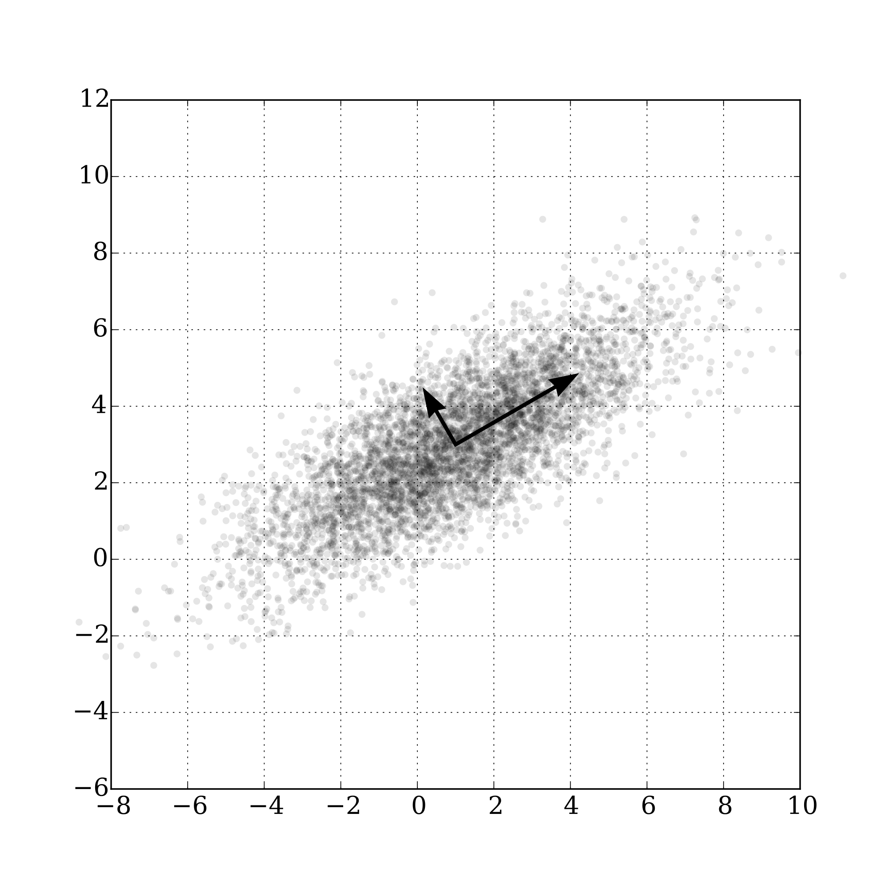
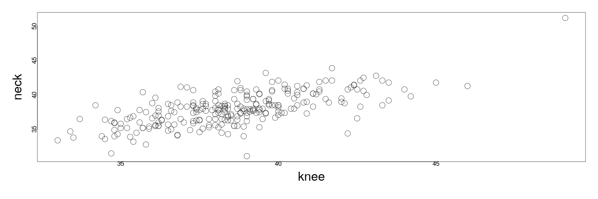
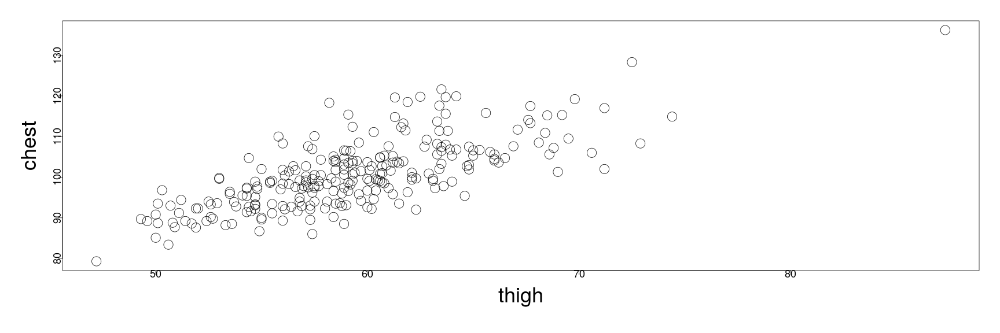
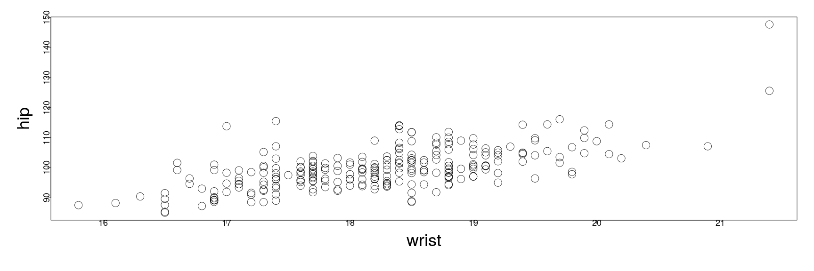

========================================================
author: 
date: 
autosize: true
incremental: true
width: 1920
height: 1080
  
========================================================

<h1> Shrinkage methods</h1>
<h2> Singular values/ principal component analysis</h2>
<div style="float:left; width:40%">

Courtesy of Reno Gazzette Journal
</div>
<div style="float:left; width:60%">
<ul>
<li> To motivate our problem of shrinkage, let's consider for example, climatological data that might have strong correlations between the measurements of explanatory variables.</li>

<li> For instance, when we want to predict the precipitation coverage of Reno, we might have measurements of:

  <ol>
    <li>wind speed;</li>
    <li>humidity;</li>
    <li>area of cloud coverage;</li>
    <li>temperature;</li>
    <li>etc...</li>
  </ol>

</li>

</div>

<li> Various quantities, such as humidty, temperature and wind speed are all highly correlated with the area of cloud coverage.</li>

<li> We might imagine that including as much information as possible would give us better predictions;</li>

<div style="float:left; width:100%">
<li> however, over-complexifying the relationship with highly correlated explanatory variables can introduce unnecessary noise to the signal...</li>
</ul>
</div>


========================================================

* If we hypothesize that this signal takes the form of a <b>linear relationship</b>, theory of linear algebra gives us reason to believe that there are perhaps <em>principal directions</em>, given by <b>linear combinations</b> of the explanatory variables that can reduce the number of parameters and the noise.

* However, this will come at some cost -- linear combinations of e.g., area cloud cover and temperature celcius is not in the form of a sensible, physical unit...

  * The cost for better predictive power using linear combinations of the variables, is thus generally speaking, less interpretability of the variables of the model.
  
  * However, there are many cases where we want to make better preditictions, and the physical causes might be well understood (by, e.g., physics), but the fully resolved models are too expensive computationally for the purpose of predictions.
  
  * Other cases, such as in social media data, the number of explanatory variables and observations are unmanagable without some kind of shrinkage or compression to produce a better model.
  
  * Sometimes, likewise, the linear combinations of the explanatory variables can make a lot of sense and there is no fundamental loss of the interpretability.
  
* We will explore this process in the next two lectures...

========================================================

<h2> A mathematical motivation for the singular value decomposition</h2>

* Consider the matrix $\mathbf{M}\in \mathbb{R}^{n\times p}$.

* The spectral theorem of linear algebra guarantees that a symmetric matrix has an orthogonal decomposition into eigenvectors -- for a symmetric matrix, these are viewed as the principal axes of the associated ellipsoid.

* We can thus take the following two symmetric matrices, $\mathbf{M}^\mathrm{T} \mathbf{M} \in \mathbb{R}^{p\times p}$ and $\mathbf{M}\mathbf{M}^\mathrm{T} \in \mathbb{R}^{n\times n}$, and find their decompositions as,

  $$\begin{align}
  \mathbf{M}^\mathrm{T} \mathbf{M} & = \mathbf{V} \mathbf{D} \mathbf{V}^\mathrm{T}\\
  \mathbf{M}\mathbf{M}^\mathrm{T}  & = \mathbf{U} \hat{\mathbf{D}} \mathbf{U}^\mathrm{T},
  \end{align}$$
  
  where
  <ol>
    <li> $\mathbf{V} \in \mathbb{R}^{p\times p},\mathbf{U} \in \mathbb{R}^{n \times n}$ are orthogonal matrices (i.e., represent a rotation of the standard Euclidean frame);</li>
    <li> $\mathbf{D} \in \mathbb{R}^{p \times p}, \hat{\mathbf{D}} \in \mathbb{R}^{n \times n}$ are both diagonal matrices with eigenvalues (principal axis lengths) on the diagonal.
  </ol>

*  Let's assume that the columns of $\mathbf{M}$ are linearly independent -- then both $\mathbf{D}$ and $\hat{\mathbf{D}}$ have exactly $p$ non-zero eigenvalues.

* If we ordered the non-zero eigenvalues of $\hat{\mathbf{D}}$ such that there was a non-zero block in the top left, we can actually write

  $$\begin{align}
  \hat{\mathbf{D}} = 
  \begin{pmatrix}
  \mathbf{D} & 0_{p \times (n-p)} \\
  0_{(n-p) \times p} & 0_{(n-p) \times (n-p)} 
  \end{pmatrix}
  \end{align}$$
  
  

========================================================
  

* It can be demonstrated (non-trivially) that $\mathbf{M}$ has a decomposition into,

  $$\begin{align}
  \mathbf{M} = \mathbf{U} \boldsymbol{\Sigma} \mathbf{V}^\mathrm{T},
  \end{align}$$
  
  where 
  
  $$\begin{align} 
  \boldsymbol{\Sigma} = \begin{pmatrix}
  \sqrt{\mathbf{D}} \\
  0_{(n-p) \times p} 
  \end{pmatrix}.
  \end{align}$$

* This decomposition is known as the <b>singular value decomposition</b>.  The <b>singular values</b> are the (positive) principal-diagonal entries of $\boldsymbol{\Sigma}$ usually ordered descendingly in size.

* Thus we can write, e.g., 

  $$\begin{align}
  \mathbf{M}\mathbf{M}^\mathrm{T} &= \mathbf{U} \boldsymbol{\Sigma} \mathbf{V}^\mathrm{T} \mathbf{V} \boldsymbol{\Sigma}^\mathrm{T} \mathbf{U}^\mathrm{T} \\
  &= \mathbf{U} \begin{pmatrix} \sqrt{D} \sqrt{D} & 0_{p \times (n-p)} \\
  0_{(n-p) \times p} & 0_{(n-p) \times (n-p)} \end{pmatrix} \mathbf{U}^\mathrm{T} \\
  & = \mathbf{U} \hat{\mathbf{D}} \mathbf{U}^\mathrm{T}
  \end{align}$$

* We can recover the eigendecomposition for $\mathbf{M}^\mathrm{T} \mathbf{M}$ in a similar fashion -- this is not a proof, but is a motivation for how/why this transformation would work.

========================================================

<h2> Visualizing the SVD </h2>

<div style="float:left; width:40%">

Courtesy of Georg-Johann <a href="https://creativecommons.org/licenses/by-sa/3.0" target="blank">CC BY-SA 3.0</a>
</div>

<div style="float:left ; width:60%">
<ul>
  <li> Qualitatively, we can always view an orthogonal matrix as a rotation of the standard Euclidean frame;</li>
  <li> likewise, we can always view a diagonal matrix as a dilation of the points along the specified frame, stretching the unit circle into an ellipsoid.</li>
  <li> Therefore, for a matrix transformation $\mathbf{M}$, we can view its SVD 
  $$\begin{align}
  \mathbf{M} = \mathbf{U}\boldsymbol{\Sigma}\mathbf{V}^\mathrm{T}
  \end{align}$$ 
  as a composition of:
  <ol>
    <li> a rotation into a new frame; </li>
    <li> a stretch or contraction of all points along the directions in this frame;</li>
    <li> a final rotation back into the Euclidean coordinates, but where the shape may no longer align with this frame.</li>
  </ol>
<li> What does this have to do with our data? 
</ul>
</div>

========================================================
<h2> Principal components of data</h2>

* Let's consider our data matrix again, $\mathbf{X}$ and suppose we want to standardize the data into a matrix of variance normalized anomalies.

* That is, we compute the sample based mean as,

  $$\begin{align}
  \overline{\mathbf{x}}_i = \frac{1}{n} \sum_{j=1}^n \mathbf{x}_{ij},
  \end{align}$$
  
  where $i$ will correspond to the $i$-th explanatory variable (column), and $j$ will correspond to the $j$-th observation (row).
  
  * Similarly, we compute the sample based (corrected) standard deviation of the variable $i$ as,
  
  $$\begin{align}
  \sigma_i \triangleq \sqrt{ \frac{1}{n-1} \sum_{j=1}^n \left( \mathbf{x}_{ij} - \overline{\mathbf{x}}_i \right)^2}
  \end{align}$$
  
* Then the variance normalized anomalies, $\mathbf{A}$, are defined as,

  $$\begin{align}
  \mathbf{A} = \frac{1}{\sqrt{n-1}}
  \begin{pmatrix}
  \frac{\mathbf{X}_1 - \overline{\mathbf{x}}_1\mathbf{1}}{\sigma_1}, & \cdots, & \frac{\mathbf{X}_p - \overline{\mathbf{x}}_p \mathbf{1}}{\sigma_p}  ,
  \end{pmatrix}
  \end{align}$$
  
  where the above will represent the columns of $\mathbf{X}$ shifted to have mean zero (i.e., the deviations or anomalies about the mean $\overline{\mathbf{x}}_i$) and normalized variances.
  

========================================================

<h2> Principal components of data continued...</h2>

* The, the upshot of the last derivation is that $\mathbf{A}^\mathrm{T} \mathbf{A} = \mathbf{C}$ is the correlation matrix of the samples in $\mathbf{X}$ -- this can be verified by direct computation.

* Let's suppose that some variables are highly correlated, and maybe there is a lot of information that is unnecessary as evidenced by this correlation matrix $\mathbf{C}$.

* That is, several variables vary together (or oppositely) tightly enough that we can usually predict where one variable will go from another.

  * However, let's suppose that there is enough subtlety about this relationship that we would lose some information if we dropped these variables entirely...
  
  * That is, the (anti)-correlation is strong, but not necessarily $\pm 1$.

========================================================

<h2> Principal components of data continued...</h2>

* We might suppose then we would want to find the principal axes of the correlation matrix to extract the frame in which we see it as an ellipsoid with major and minor directions.

* Suppose we compute the SVD of $\mathbf{A}$ for this purpose, i.e.,

  $$\begin{align}
  \mathbf{A} = \mathbf{U} \boldsymbol{\Sigma} \mathbf{V}^\mathrm{T}
  \end{align}$$

* Whereby, 

  $$\begin{align}
  \mathbf{C} = \mathbf{V} \boldsymbol{\Sigma}\boldsymbol{\Sigma}^\mathrm{T} \mathbf{V}^\mathrm{T}
  \end{align}$$

* If we assume that the singular values are ordered (as usual) descendingly in size, the first vector $\mathbf{V}_1$ is the direction in which there is <b>the most variance in the data</b>.

* The next vector $\mathbf{V}_2$ is the direction that is orthogonal (perpendicular) to the first, and has the next most variance.

* The third and thereafter follow these properties such that all vectors are orthogonal and contain (descendingly) the most variance of the data.

* Therefore, we can consider transforming the data (by rotation) into the coordinates where the first coordinate will be that of largest variance, the second coordinate of second largest, and so forth...

========================================================

<h2> Principal components of data continued...</h2>
  
* Specifically, we can consider right multiplying the anomalies $\mathbf{A}$ by $\mathbf{V}$ to change the frame of reference before examining $\mathbf{A}$.
  
  $$\begin{align}
   \mathbf{A}\mathbf{V} = \mathbf{U} \boldsymbol{\Sigma}
  \end{align}$$


* Performing the above, it is easy to see

  $$\begin{align}
   \mathbf{A}\mathbf{v}_i = \eta_i\mathbf{u}_i
  \end{align}$$
  
  where we will denote (atypically) the $i$-th singular value as $\eta_i$ (so not to confuse with the standard deviations, also typically denoted with the $\sigma_i$).
  
  * The vector $\mathbf{z}_i \triangleq \eta_i \mathbf{u}_i$ is defined as the <b>$i$-th principal component</b>.

* Whereas the correlation matrix can be large and difficult to compute, the singular value decomposition can be computed in relatively simple numerical procedures and stopped at a threshold for "how-much-variation" do we need to capture.

* This makes a dramatic "compression" of large data sets, in which the vast majority of the variance may be captured in a single or a few principal components.

* The cost, however, is that these will be linear combinations of the other variables -- we can't generally preserve the units of measurments when making this transformation.

* As a remark -- the terminology and conventions around PCA differs between the many different fields in which it is used.  If you see it elsewhere, you can see a completely different discussion on it.

========================================================

<div style="float:left; width:40%">

Courtesy of Nicoguaro  <a href="https://creativecommons.org/licenses/by/4.0" target="blank">CC 4.0</a>
</div>

<div style="float:left; width:60%">
<ul>
  <li> On the left we see Gaussian distributed data in two dimensions, and the corresponding two principal components. </li>
  <li> Imagine that this represents "cat-data" in which we were studying the cat blood pressure as a response, with
  <ol>
    <li>height in inches as the vertical axis; and</li>
    <li>weight in kg as the horizontal axis.</li>
  </ol>
<li> In the plot (ignoring the unphysicallity of the values) we see that height and weight are strongly correlated;
<li> the first principal component is the diagonal axis which represents the high variation along the positive combination of height and weight.</li>
<li> The second principal component is the orthogonal direction, representing the smaller variation along a combination of positive values of weight and negative values of height.</li>
<li> Thus, qualitatively, we can interpret the samples as beign largely explained by a large positve linear relationship between height and weight. </li>
<li> The second principal component explains the variance that is orthogonal to this main explanation, i.e., those samples that have height and weight varying oppositely.</li>
</div>
<div sytle="float:left; width=100%">
<li> The SVD is, in a sense, fitting the best possible ellipsoid to the data, and providing the principal axes of this ellipsoid.</li>
<li> It is important to note, <b>the principal components have no knowledge of the response variable</b> (blood pressure) not plotted in the above.</li>
</ul>
</div>

========================================================

<h2> An actual example of principal components</h2>

* With analogy to the cat data, we will consider the fat data examined earlier.  We plot several of the measurements versus each other to exhibit the correlations among the explanatory variables:

* Firstly, the neck versus knee measurements,


```r
library(faraway)
par(mai=c(1.5,1.5,.5,.5), mgp=c(3,0,0))
plot(neck ~ knee, fat, cex=3, cex.lab=3, cex.axis=1.5)
```



========================================================

* then the chest versus thigh measurements,


```r
par(mai=c(1.5,1.5,.5,.5), mgp=c(3,0,0))
plot(chest ~ thigh, fat, cex=3, cex.lab=3, cex.axis=1.5)
```



========================================================

* then the hip versus wrist measurements


```r
par(mai=c(1.5,1.5,.5,.5), mgp=c(3,0,0))
plot(hip ~ wrist, fat, cex=3, cex.lab=3, cex.axis=1.5)
```



========================================================

* In our case with the fat data, we see what appears to be many correlations between the explanatory variables;

* However, we note that the space of the explanatory variables is of higher dimension than in the toy example with cat data.

* Specifically, we want to find the principal axes for all these variables simultaneously in a much larger space.

  * We cannot visualize this high dimensional space, but we can compute the principal axes of the "best-fit-ellipsoid" all the same....

========================================================


* We will use the circumfrence measurements from the fat dataset, computing the principal components using the function "prcomp":
  

```r
# cricumfrence measurements sub-slice
cfat <- fat[,9:18]
# PCA computation
prfat <- prcomp(cfat)
```

* <b>Note:</b> we have just computed the SVD of the original data matrix, and <em>not the standardized variables</em>.  We will discuss this difference shortly.</li>

* The returned object is a list with the callable values of "rot" and "x"

* "x" are the values of the observations when changed into the basis of the principal component directions,


```r
dim(prfat$x)
```

```
[1] 252  10
```

========================================================

* "rot" is the rotation matrix $\mathbf{V}$ as we discussed in the decomposition $\mathbf{X} = \mathbf{U} \boldsymbol{\Sigma} \mathbf{V}^\mathrm{T}$; 

  * this describes the combinations of variables that go into a particular principal component direction.
  


```r
prfat$rot
```

```
               PC1         PC2         PC3         PC4         PC5
neck    0.12247857 -0.02419605  0.19705886 -0.24294170  0.26441810
chest   0.50161641  0.38414429  0.63962671  0.36449079 -0.23977622
abdom   0.65808293  0.38431916 -0.54918684 -0.32733587  0.03614857
hip     0.41956706 -0.50864092 -0.17543589  0.52422020  0.37503871
thigh   0.27968753 -0.59999647  0.01776404 -0.21848860 -0.67577523
knee    0.12148556 -0.17468550  0.04381024  0.01090359  0.20196703
ankle   0.05596265 -0.11532160  0.10008929  0.05672153  0.28765471
biceps  0.14540629 -0.18341990  0.33968251 -0.51136755  0.18245861
forearm 0.07391475 -0.08818365  0.29297576 -0.33309611  0.29020582
wrist   0.03934804 -0.01420681  0.07867510 -0.05144840  0.18141400
                PC6         PC7         PC8         PC9          PC10
neck    -0.06697055 -0.61977866 -0.62290330 -0.03465366  0.1970373708
chest   -0.00628437  0.02682772  0.01709213 -0.01715424  0.0001180099
abdom   -0.05798794  0.04237543  0.04519991  0.04429945 -0.0004647401
hip      0.33497539 -0.06370526  0.03017756  0.04125882  0.0113777686
thigh   -0.18155272 -0.10850160 -0.01559684  0.08899493 -0.0644730639
knee    -0.52217519  0.17184353  0.08891511 -0.76781015  0.1107333685
ankle   -0.60340059  0.35115626 -0.13471329  0.60725092  0.1152577102
biceps   0.44115762  0.55435680 -0.16739424 -0.06692188  0.0247215390
forearm -0.03332036 -0.36513174  0.73825438  0.15389409  0.0511729735
wrist   -0.12022251 -0.06367487 -0.09699713 -0.02172551 -0.9633866143
```


========================================================

<ul>

<li> Taking the PCA summary, we see </li> 
 <ol>
 <li> how much standard deviation is associated to each component, </li>
 <li> the proportion of the total variance, and </li>
 <li> the cumulative proportion as we include decending terms:</li>

</ul>


```r
summary(prfat)
```

```
Importance of components:
                          PC1     PC2     PC3     PC4     PC5     PC6
Standard deviation     15.990 4.06584 2.96596 2.00044 1.69408 1.49881
Proportion of Variance  0.867 0.05605 0.02983 0.01357 0.00973 0.00762
Cumulative Proportion   0.867 0.92304 0.95287 0.96644 0.97617 0.98378
                           PC7     PC8     PC9    PC10
Standard deviation     1.30322 1.25478 1.10955 0.52737
Proportion of Variance 0.00576 0.00534 0.00417 0.00094
Cumulative Proportion  0.98954 0.99488 0.99906 1.00000
```

* In this case, $87\%$ of the variation in the data is captured in the first principal component direction alone. Recall, this was given by,


```r
round(prfat$rot[,1],2)
```

```
   neck   chest   abdom     hip   thigh    knee   ankle  biceps forearm 
   0.12    0.50    0.66    0.42    0.28    0.12    0.06    0.15    0.07 
  wrist 
   0.04 
```

========================================================

* In the last plot, the chest, abdomen, hip and thigh dominated the leading principal component direction, but it will be due in part to the fact that these measurments are generally larger and more variable than the other measurements.

* The purpose of the standardization is thus to compensate so that the variances are all viewed on an equal measure,


```r
prfatc <- prcomp(cfat, scale=TRUE)
summary(prfatc)
```

```
Importance of components:
                          PC1     PC2     PC3     PC4     PC5     PC6
Standard deviation     2.6498 0.85301 0.81909 0.70114 0.54708 0.52831
Proportion of Variance 0.7021 0.07276 0.06709 0.04916 0.02993 0.02791
Cumulative Proportion  0.7021 0.77490 0.84199 0.89115 0.92108 0.94899
                           PC7     PC8     PC9   PC10
Standard deviation     0.45196 0.40539 0.27827 0.2530
Proportion of Variance 0.02043 0.01643 0.00774 0.0064
Cumulative Proportion  0.96942 0.98586 0.99360 1.0000
```

========================================================

* Using the standardized variables (the variance-normalized anomalies) we find that the leading principal component only explains about $70\%$ of the variance (still quite a lot).

* Likewise, we see that the measurements have a more balanced effect on the overall principal component: 


```r
round(prfatc$rot[,1],2)
```

```
   neck   chest   abdom     hip   thigh    knee   ankle  biceps forearm 
   0.33    0.34    0.33    0.35    0.33    0.33    0.25    0.32    0.27 
  wrist 
   0.30 
```

* The relatively equal proportions in this case has reasonable physical interpretation, in that human men are basically proportional in most of their measurements;

  * a rough average of weighting of all the measurments together performs very well in explaining the variance of the measured population.
  
* However, we can see exactly why with other units and variables this will not be so easy to interpret.

========================================================


* The second principal component direction shows what combination of variables expresses the most variation in the data in a way that is complementary to the other direction:


```r
round(prfatc$rot[,2],2)
```

```
   neck   chest   abdom     hip   thigh    knee   ankle  biceps forearm 
   0.00   -0.27   -0.40   -0.25   -0.19    0.02    0.62    0.02    0.36 
  wrist 
   0.38 
```

<ul>
 <li>Roughly speaking, this is showing the relative contrast of weight being held in the body center versus extremeties:</li>

<ol>
  <li> positive in this direction having larger measures in extremeties;</li>
  <li> negative in this direction having larger measures in the center;</li>

</ol>
</ul>
* This direction doesn't express as much of the variation -- however, it carries almost $8\%$ of the variation thus making it relatively significant versus the trailing directions.

* <b> Remark:</b> Generally, like variances, PCA is sensitive to outliers and we should be careful about the above interpretation also knowing that there are outliers in this data.

========================================================

<h2> Principal component regression</h2>

* next time...

