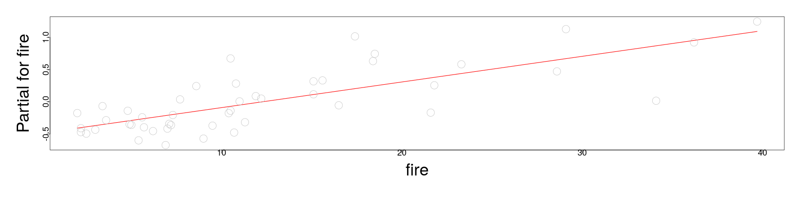
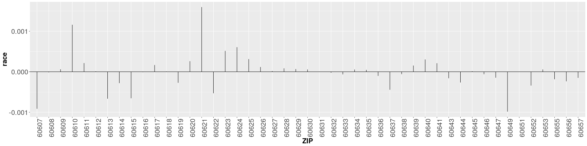
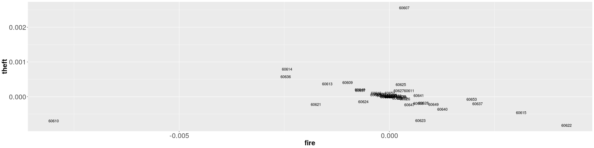
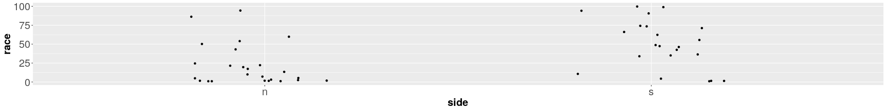

========================================================
author: 
date: 
autosize: true
incremental: true
width: 1920
height: 1080
  
========================================================

<h1> Insurance redlining continued...</h1> 

* We recall, we were looking to see if there was systematic discrimination in Chicago in the 1970s with insurance companies denying home insurance to minority residents.

* We have data that is difficult to analyze due to the ecological fallacy:

  * Specifically, we note that we have a strong correlation between neighborhoods with higher percent minority residents and neighborhoods with higher numbers of FAIR insurance plans.
  
* However, we don't know who was accepted or denied in the normal insurance market 
  
  * it would be a logical fallacy conclude that based on the aggregate correlation, this implies systematic bias.

* We wish to disentagle the effect of percent minority residents in a neighborhood from other factors as well.  Specifically:

  1. theft rates;
  
  2. fire rates;
  
  3. the age of the neighborhood; and
  
  4. the median income of the neighborhood.

========================================================

* We recall, that the response variable in particular is hard to model in this case, as the value is extremely skewed towards zero, with the max value for the response only at $2.2\%$.
  

```r
library(faraway)
summary(chredlin)
```

```
      race            fire           theft             age       
 Min.   : 1.00   Min.   : 2.00   Min.   :  3.00   Min.   : 2.00  
 1st Qu.: 3.75   1st Qu.: 5.65   1st Qu.: 22.00   1st Qu.:48.60  
 Median :24.50   Median :10.40   Median : 29.00   Median :65.00  
 Mean   :34.99   Mean   :12.28   Mean   : 32.36   Mean   :60.33  
 3rd Qu.:57.65   3rd Qu.:16.05   3rd Qu.: 38.00   3rd Qu.:77.30  
 Max.   :99.70   Max.   :39.70   Max.   :147.00   Max.   :90.10  
    involact          income       side  
 Min.   :0.0000   Min.   : 5.583   n:25  
 1st Qu.:0.0000   1st Qu.: 8.447   s:22  
 Median :0.4000   Median :10.694         
 Mean   :0.6149   Mean   :10.696         
 3rd Qu.:0.9000   3rd Qu.:11.989         
 Max.   :2.2000   Max.   :21.480         
```

* Other variables exhibited some extreme values relative to the others, in theft, fire and income, for example.

========================================================


* We are studying a model of the form:


```r
lmod <- lm(involact ~ race + fire + theft + age + log(income), data=chredlin)
```

* This was chosen based upon criterion methods, and some qualitative selection of the log-income variable.

* Specifically, we noted that log-income and percent minority in a neighborhood of Chicago is highly anti-correlated;

  * Though log-income wasn't necessarily statistically significant, we wanted to control for income as much as possible as to not overstate the importance of the race parameter.
  
* In this case, we found that the race parameter was significant, but to be careful about our conclusions and explanations, we performed the usual diagnostics to test the goodness of the model.

========================================================

<h2> Summary of diagnostics</h2>

* We note that there is a structural issue arising due to the high number of zero FAIR plans (the response variable), but that there isn't a realistic choice of scale transformation to fix this.

* Normality and variance assumptions of the error are otherwise OK.

* We will probably need to evaluate the effect of points of high leverage in the analysis.

* We wish thus to study the sensitivity of the main parameter of interest "race", with respect to the leverage points and controlling for covariates in the analysis.

* We will start with looking at the partial residuals for race and fire to see if, when controlling for the other factors, we have a good linear fit.

* Likewise, we will look at the confidence intervals for these parameters, to judge some of the uncertainty in the estimate.

 * Recall, the parameter value is just the slope of the partial residual line.

========================================================


```r
par(mai=c(1.5,1.5,.5,.5), mgp=c(3,0,0))
termplot(lmod, partial.resid=TRUE, terms=1,  cex=3, cex.lab=3, cex.axis=1.5)
```


```r
coefficients(lmod)[2]
```

```
       race 
0.009502223 
```

```r
confint(lmod, parm = "race")
```

```
           2.5 %     97.5 %
race 0.004474458 0.01452999
```


========================================================


```r
par(mai=c(1.5,1.5,.5,.5), mgp=c(3,0,0))
termplot(lmod, partial.resid=TRUE, terms=2,  cex=3, cex.lab=3, cex.axis=1.5)
```



```r
coefficients(lmod)[3]
```

```
      fire 
0.03985604 
```

```r
confint(lmod, parm = "fire")
```

```
          2.5 %     97.5 %
fire 0.02215246 0.05755963
```

========================================================

* For each of the most significant parameters, there isn't a great deal of uncertainty in the effect on the response, and the structure appears to be fine in the partial residuals.

  * We put some faith in these p-values and confidence intervals due to the good Q-Q plot.

* Loosely speaking, it appears that there is a small, but statistically significant, effect in which neighborhoods with higher concentrations of ethnic minorities have a higher number of FAIR plans, when all other variables are held equal.

* This effect is not nearly as strong as e.g., the rate of fires with all other variables held equal.

  * However, this indicates that there is a small, but non-random effect where neighborhoods have higher number of FAIR plans based on a variable that shouldn't matter in an insurance application decision.
  
* Our analysis is not even nearly complete, and we cannot say if any application for insurance was rejected based upon their ethnic background;

  * nonetheless, this corroborates the claims of the Chicago neighborhood organizations who filed their civil rights lawsuit -- this warrants further investigation of the overall effect. 

========================================================


* Generally, we should also perform the partial residuals for the other variables, but these will be supressed here for brevity.

* In terms of analyzing the sensitivity of the race parameter with respect to the inclusion or exclusion of other covariates, we can automate this to determine if the effect on the response changes dramatically.

  * This is a larger kind of uncertainty in the model selection itself -- if e.g., the parameter changed sign with a different choice of variables, we would have very contradictory explanations of the effect of the concentration of minorities on the number of FAIR plans.
  
* This is similar to the case when we used matching in the voting districts in New Hampshire, where we needed to see if an additional covariate was acting as a confounding variable on our analysis.

* By analyzing the inter-model stability of this parameter, we have a better sense of if this explanation is actually robust.

========================================================

* Suppressing the code to automate this (in the book) we will compare the parameter value and associated p-value for race in each combination of the variables:


```  
                                            beta   pvalue
race                                        0.0139 0.0000
race + fire                                 0.0089 0.0002
race + theft                                0.0141 0.0000
race + age                                  0.0123 0.0000
race + log ( income )                       0.0082 0.0087
race + fire + theft                         0.0082 0.0002
race + fire + age                           0.0089 0.0001
race + fire + log ( income )                0.0070 0.0160
race + theft + age                          0.0128 0.0000
race + theft + log ( income )               0.0084 0.0083
race + age + log ( income )                 0.0099 0.0017
race + fire + theft + age                   0.0081 0.0001
race + fire + theft + log ( income )        0.0073 0.0078
race + fire + age + log ( income )          0.0085 0.0041
race + theft + age + log ( income )         0.0106 0.0010
race + fire + theft + age + log ( income )  0.0095 0.0004
```

* The above output shows the parameter for race and the associated p-values for all 16 models. 

* There is some variance in the magnitude of the effect, depending on the other variables we control for, but in no case does the p-value rise above $5\%$ or does the parameter change sign. 

* This suggests some uncertainty over the magnitude of the effect, we can be sure that the significance of the effect is not sensitive to the choice of adjusters.

========================================================

* If we suppose that we were able to find models in which the composition of the neighborhood in terms of minorities was not statistically significant, our ability to control for other factors would be more difficult.

* We would then need to consider more deeply which covariates should be adjusted for and which not. 

* This level of model analysis and selection is at the heart of many real world problems, and we are fortunate as modellers in this case that it is unnecessary.

* In general, however, this is the reality of real problems you will encounter after this class.

* Now, we want to analyze the effect of leverage and influence on the model and our interpretation.

* We recall that there are several influential points, and we wish to determine if their inclusion or exclusion would radically change the interpretation for the parameter for race.

========================================================

* We plot below, using the "dfbeta" function we used in another analysis, the change of the parameter for race when excluding any particular observation:


```r
par(mai=c(1.5,1.5,.5,.5), mgp=c(3,0,0))
plot(dfbeta(lmod)[,2],ylab="Change in race coef", cex=3, cex.lab=3, cex.axis=1.5)
abline(h=0)
```


* The difference is negligible given the size of the parameter and scale of the response, so we are not especially concerned about the sensitivity of the parameter to observations.

========================================================

* We note that we can also produce a similar plot from the "lm.influence" function, turning the output into a dataframe


```r
diags <- data.frame(lm.influence(lmod)$coef)
```

* Using this, we will plot the terms in ggplot2:


```r
library(ggplot2)
ggplot(diags,aes(row.names(diags), race)) + geom_linerange(aes(ymax=0, ymin=race)) + theme(axis.text.x=element_text(angle=90), axis.text=element_text(size=20), axis.title=element_text(size=20,face="bold")) + xlab("ZIP") + geom_hline(yintercept = 0)
```



========================================================

* Likewise, using the diags dataframe, we can produce a two dimensional plot of the differences in each the fire and theft parameters when excluding one of the observations:


```r
ggplot(diags,aes(x=fire,y=theft))+geom_text(label=row.names(diags)) +
  theme(axis.text=element_text(size=20), axis.title=element_text(size=20,face="bold"))
```



* Here, we also see that relative to the scale of the response, the difference in these parameter values isn't qualitatively different.

========================================================

* We note as in the earlier diagnostics, we see that the zip codes 60607 and 60610 stick out for high leverage and influence on the parameter values:


```r
chredlin[c("60607","60610"),]
```

```
      race fire theft  age involact income side
60607 50.2 39.7   147 83.0      0.9  7.459    n
60610 54.0 34.1    68 52.6      0.3  8.231    n
```

* These are both unusually high fire and high theft zip codes -- we will remove these two observations simultaneously and see the effect on the paramters:


```r
lmode <- lm(involact ~ race + fire + theft + age + log(income), chredlin,subset=-c(6,24))
sumary(lmode)
```

```
              Estimate Std. Error t value  Pr(>|t|)
(Intercept) -0.5767365  1.0800462 -0.5340   0.59638
race         0.0070527  0.0026960  2.6160   0.01259
fire         0.0496474  0.0085701  5.7931 1.004e-06
theft       -0.0064336  0.0043489 -1.4794   0.14708
age          0.0051709  0.0028947  1.7863   0.08182
log(income)  0.1157028  0.4011132  0.2885   0.77453

n = 45, p = 6, Residual SE = 0.30320, R-Squared = 0.8
```

* Their exclusion actually makes theft and age no longer significant, though race remains significant.

========================================================

* We have verified that our conclusions are also robust to the exclusion of one or perhaps two cases from the data. 

  * If our conclusions depended on including or excluding only one or two observations we would need to be particularly sure of these measurements. 
  
  * In some situations, we might wish to drop such influential cases but this would require
<b>strong arguments</b> that such points were in some way exceptional. 

* In any case, it would be very important to disclose this choice in the analysis, and any suppression of the information would be extremely dishonest.


========================================================

* Although this is a model designed for explanation purposes, for completeness in the example, we will look a the predictive power of the model:


```r
x <- model.matrix(lmod)
x0 <- apply(x,2,median)
x0 <- data.frame(t(x0))
# note here that R won't accept the variable that we've rescaled until we re-name it back to its original name... 
colnames(x0)[6] <- "income"
```


```r
predict(lmod,new=x0,interval="prediction")
```

```
          fit       lwr     upr
1 0.003348934 -1.398822 1.40552
```

```r
predict(lmod,new=x0,interval="confidence")
```

```
          fit       lwr      upr
1 0.003348934 -1.225333 1.232031
```

* We verify, due to the width of the confidence intervals for the mean and new observations on the median, that the model is worthless for predictions...

========================================================

* We have shown very robust evidence for the statistically significant effect of the neighborhood's ethnic composition, with all other variables held equal, having a significant effect in determining the number of FAIR plans in the neighborhood.

* This doesn't mean conclusively, however, that there was systematic discrimination.

* If we tried another hypothetical model, supressing theft and the two high influence observations:


```r
modalt <- lm(involact ~ race+fire+log(income),chredlin, subset=-c(6,24))
sumary(modalt)
```

```
              Estimate Std. Error t value  Pr(>|t|)
(Intercept)  0.7532557  0.8358798  0.9012   0.37277
race         0.0042061  0.0022757  1.8483   0.07178
fire         0.0510220  0.0084504  6.0378 3.822e-07
log(income) -0.3623825  0.3191620 -1.1354   0.26279

n = 45, p = 4, Residual SE = 0.30919, R-Squared = 0.79
```

* the parameter for race is no longer significant.

* This is just a hypothetical example, because our relatively exhaustive analysis has shown that this is a "cherry-picked" model, versus the other possible models.

========================================================

* Generally, however, this shows some of the subtlety in statistical analysis like this 
  
  * particularly, independent analyses can lead to a different sequence of models, remediation and refinement, possibly to different conclusions.

* Part of robust analysis is thus to perform several model selections and the associated diagnostics to deal with the overall uncertainty in the model selection;

  * reasonably we should go back and perform the same steps without log income, for example.

* The strength of our conclusions will increase if we can show that several different models all have similar interpretations.

* If there are several reasonable models with different interpretations or conclusions, there is a fundamental issue in the data, and we should be cautious and be skeptical if there is really a signal to be found in the data.

  * A modeler who lacks scientific integrity can similarly explore a large number of models but report only the one that favors a particular conclusion; 
  
  * this is extremely dishonest, and if discovered, often leads to the author being professionally discredited (their work not taken seriously and themselves unemployable).
  
  * This is likewiswe the case for industrial applications where, even if the work is not published, if the analyst consistently makes flimsy models that aren't demonstrably robust, they will be uemployable because they cannot help business operations in any meaninful way.

========================================================

* Generally, we have performed rigorous analysis in the above (pending completion of additional analysis).

* However, there are still several ways we should be cautious about our conclusions:

  <ol>
    <li> Firstly is that this is based on aggregate data -- to extrapolate to an individual level we would need to assume that the probability a minority homeowner would obtain a FAIR plan after adjusting for the effect of the other covariates is constant across zip codes. 
    <br><br>
    If this probability varies in a systematic way (as opposed to random noise about the aggregate signal) then concluding that someone's ethnic background would be a statisticaly significant factor in an insurance decision may be well off the mark.</li><br>
    <li> We have demonstrated statistical significance, but the practical effect is actually fairly small.  The largest value of the response (percent FAIR plans) is only $2.2\%$ and most other values are much smaller. 
    <br><br>
    The predicted difference between $0\%$ minority and $100\%$ minority is about $1\%$ , so while we may be confident that some people are affected, there may not be so many of them to call this systematic discrimination.</li><br>
    <li> There may be some other latent, confounding variable that we haven't accounted for that could explain this small difference if included in the model -- someone with expertise in insurance modeling may be able to suggest some such variable that changes the conclusions.</li><br>
    <li> We may find other ways to aggregate the data, for which our conclusions will chage</li>
  </ol>


========================================================

* For example, if we fit two separate models for the North Side and South Side of Chicago, we can get very different results:


```r
lmod <- lm(involact ~ race+fire+theft+age+log(income), subset=(side == "s"),chredlin)
sumary(lmod)
```

```
              Estimate Std. Error t value Pr(>|t|)
(Intercept) -1.9946613  1.6949252 -1.1768 0.256470
race         0.0093509  0.0046055  2.0304 0.059285
fire         0.0510812  0.0170314  2.9992 0.008493
theft       -0.0102565  0.0090972 -1.1274 0.276184
age          0.0067778  0.0053061  1.2774 0.219700
log(income)  0.6810543  0.6493336  1.0489 0.309832

n = 22, p = 6, Residual SE = 0.34981, R-Squared = 0.76
```

* In the South Side, the parameter for race is no longer significant...

========================================================

* while in the North Side, it is:


```r
lmod <- lm(involact ~ race+fire+theft+age+log(income), subset=(side == "n"),chredlin)
sumary(lmod)
```

```
              Estimate Std. Error t value Pr(>|t|)
(Intercept) -0.7902939  1.7793768 -0.4441  0.66196
race         0.0133200  0.0053903  2.4711  0.02310
fire         0.0246654  0.0154219  1.5994  0.12623
theft       -0.0079383  0.0039815 -1.9938  0.06073
age          0.0090040  0.0046471  1.9375  0.06769
log(income)  0.1666853  0.6233641  0.2674  0.79204

n = 25, p = 6, Residual SE = 0.35115, R-Squared = 0.76
```

* Generally, sub-dividing data into smaller and smaller groups, we can dillute the significance.

* However, as noted before, aggregating data too much causes its own issues -- the balance between these is contextual and subjective based on our understanding of the task at hand.

========================================================

* In this context, we might explain the difference in terms of the demographics of the North Side and the South Side:


```r
ggplot(chredlin,aes(side,race)) + geom_point(position = position_jitter(width = .2,height=0)) + theme(axis.text=element_text(size=20), axis.title=element_text(size=20,face="bold"))
```




```r
summary(chredlin$race[chredlin$side=="n"])
```

```
   Min. 1st Qu.  Median    Mean 3rd Qu.    Max. 
   1.00    1.80   10.00   21.95   24.50   94.40 
```

```r
summary(chredlin$race[chredlin$side=="s"])
```

```
   Min. 1st Qu.  Median    Mean 3rd Qu.    Max. 
   1.00   34.27   48.10   49.80   72.92   99.70 
```

* With the South Side having a much higher concentration of minorities, the explanatory power of this variable has less effect in the south side, in the presence of other latent variables.

========================================================

<div style="float:left; width:50%">

Courtesy of Eric Fischer <a href="https://creativecommons.org/licenses/by-sa/2.0" target="blank">CC BY-SA 2.0</a>
</div>

<div style="float:left; width: 50%">
<ul>
  <li> A visualization of the demographics of Chicago is to the left, where the North Side/ South Side divide is clearly expressed. </li>
  <li>This is a visualization of the 2010 census, where each dot represents 25 residents.</li>
  <li>The color coding is as follows:</li>
    <ol>
      <li> <b>Red:</b> non-Hispanic Caucasian</li>
      <li> <b>Blue:</b> African American</li>
      <li> <b>Orange:</b> Hispanic </li>
      <li> <b>Green: </b> Asian</b>
      <li> <b>Yellow:</b> other </li>
    </ol>
</ul>
</div>

========================================================

<h2> Summary of the complete example</h2>

* We performed initial, exploratory analysis, checking for structure in the data, and in the plots of variables versus the response.

* We fit a model based on a mix of criterion methods and some qualitative judgement.

* We performed diagnostics to see how our assumptions might be breaking down -- aside from an unavoidable issue with the many zero observations for the FAIR plan, it was a well functioning model.

* We evaluated the partial residuals, and confidence intervals, for the main parameter of interest -- if this was more complete, we would do this for each of them.  

  * This gave us some indication of the uncertainty of this parameter and the structure of the model with respect to it.

* As this is an explanatory model, we were interested in "predicting" the parameter for "race"; 

  * we wanted to understand the sensitivity of this parameter, so we analyzed the p-value and the parameter value for qualitative differences versus all possible covariates in the data.

  * This illustrated a deeper level of the model uncertainty, though one which we seemed to be relatively robust to.

* We also demonstrated robustness to the exclusion of observations, and checked formally for outliers that could affect the fit.

* Just for fun, we saw that it has awful predictive power...

* We made a final assessment of the uncertainty that we could not account for with our data.

========================================================


* After all this analysis, everything we say needs to be hedged with "ifs" and "buts" and qualified carefully.

* This is the reality of statistical modeling, where causual conclusions are extremely difficult to draw.

* To quote Farway, quoting Winston Churchill:

  "Indeed, it has been said that Democracy is the worst form of government, except
all those other forms that have been tried from time to time."

* We might say the same about statistics with respect to how it helps us reason in the face of uncertainty. 
  
  * It is not entirely satisfying but the alternatives are worse.

========================================================

<h1> Missing data </h1>

* Next time...
