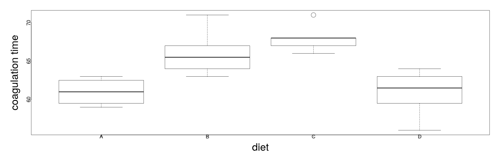
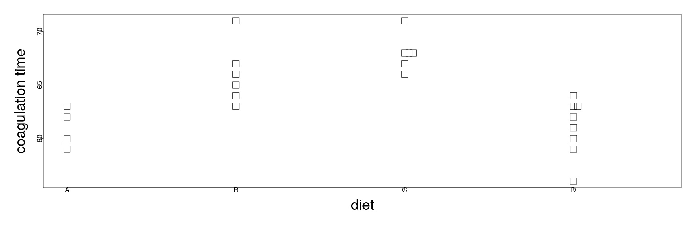
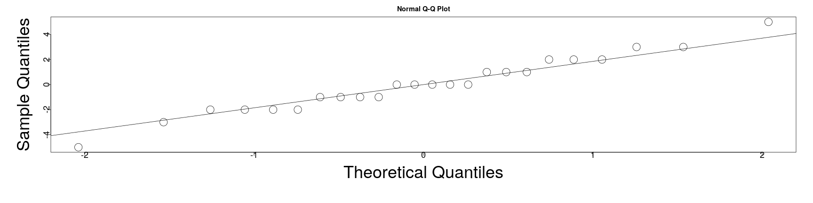
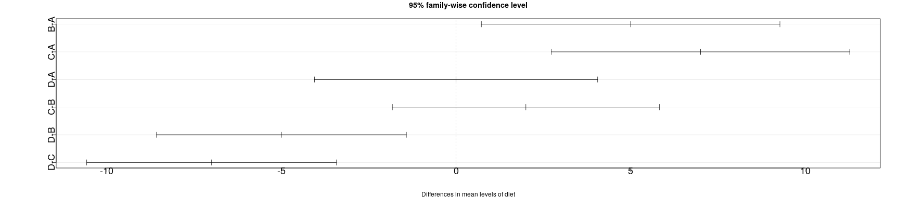
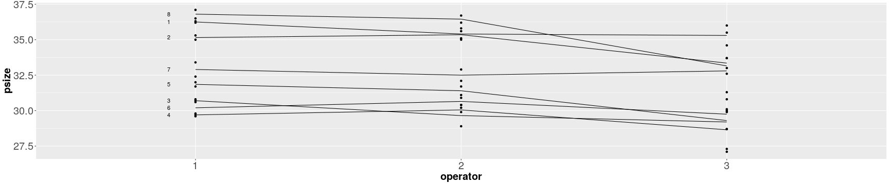
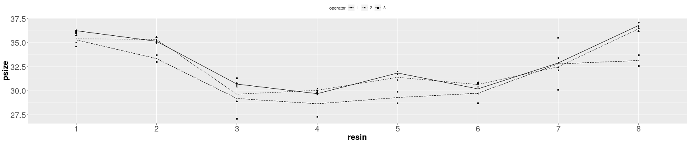
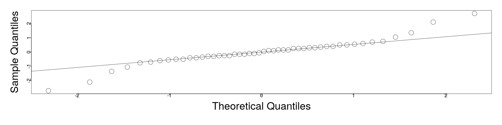
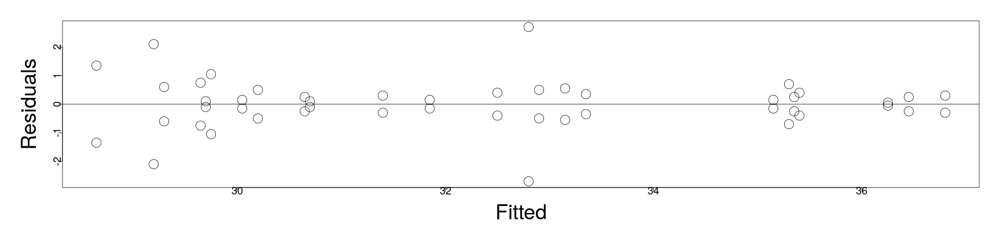
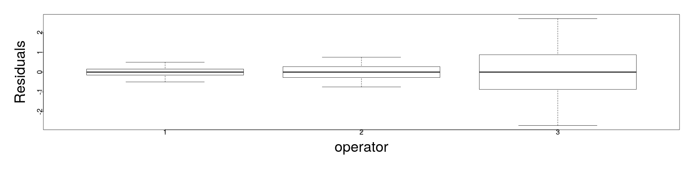

========================================================
author: 
date: 
autosize: true
incremental: true
width: 1920
height: 1080
  
========================================================

<h1> Models with only categorical explanatory variables</h1>

* The "analysis of variance" that we have studied before actually comes from the situation in which we have only categorical variables as predictors.

* The name comes from the idea of partitioning the overall variance in the response into that which is due to each of the factors and the error $\epsilon$.

* While this is a classical approach, the formulation can become increasingly complex depending on the configuration of the configuration of the factors.

* In the following, we will consider a regression approach with the tools we have developed already.

* As a note on terminology, the way these variables are coded in R (factors with a number of levels) also derives from this framework.

* Additionally, for ANOVA type problems, the parameters $\beta$ are usually denoted as "effects".

* We will consider a framework where the effects are fixed values, but unkown to us;

  * if these parameters are treated as random variables, a slightly different approach is necessary.
  

========================================================

* Suppose that we have a factor (category) $\alpha$ with $i=1,\cdots, I$ different levels.

* Then suppose that there are $j=1,\cdots, J_{i}$ observations per level $i$.

* The model for the $j$-th observation of level $i$ is given a model of the form,

  $$\begin{align}
  y_{ij} = \mu + \alpha_i + \epsilon_{ij}
  \end{align}$$
  
* In the above, we have an underconstrained problem that won't have any unique solution.

  * For example, if $\mu^\ast = \mu+1$ and $\alpha_i^\ast = \alpha_i -1$, then the above equation also holds for $\mu^\ast$ and the $\alpha_i^\ast$;
  
  * Indeed, for any constant shift as above, this will hold.
  
* Some kind of constraint must be imposed to make this equation solvable uniquely...

========================================================

* Common techniques for constraining the model equation

  $$\begin{align}
  y_{ij} = \mu + \alpha_i + \epsilon_{ij}
  \end{align}$$
  
  include:
  
  <ol>
    <li> Removing the $\mu$ term and use $I$ different dummy variables to estimate $\alpha_i$ for $i=1,\cdots,I$.  Although this is feasible, it doesn't extend well to models with multiple factors. </li>
    <li> Setting $\alpha_1 = 0$, then $\mu$ corresponds to the expected mean response for the first level and $\alpha_i$ will be the difference from the base-line level as before.</li>
    <li> Setting $\sum_{i=1}^I \alpha_i = 0$, then $\mu$ represents the mean response over all levels, while each $\alpha_i$ represents the deviation of each level from the overall mean.  This corresponds to sum coding.</li>
  </ol>
  
* At the end, the choice of the constraint above defines a coding/ contrast matrix and thus the interpretation of the parameters.

  * However, no choice of coding will change the fitted values or the standard errors.
  
* In particular, the fitted value for a model with purely categorical predictors will also be the mean for this combinaiton of levels. 

========================================================

* Once the choice of coding is made, and the parameters are estimated, the natural step is to try to understand the diffrences in the levels of each factor.

  * Particularly, we will want to understand if (with respect to some reference level defined by the coding) a particular level differs by more than just random variation.
  
  * This is again the same analogy of adjusting the intercept or the slope line in a regression with an additional continuum variable.
  
* If we used the default "treatment" or "dummy-variable" coding, then our model takes the form:

  $$\begin{align}
  y_{ij} = \mu + \alpha_i + \epsilon_{ij}
  \end{align}$$
  
  where $\alpha_1=0$, and the null hypothesis is that $\alpha_i = 0$ for $i=2,\cdots, I$.
  
  * Here, once again, the reference level is $\mu$ given by the average response for the level $i=1$ and thus the null represents the hypothesis that the different levels have no difference that is distinguishable from random variation.
  
* For other codings of the model, this statement will necessarily differ, so it is typically easier to understand the hypotheses in terms of models:

  $$\begin{align}
  H_0  : & y_{ij} = \mu + \epsilon_{ij} \\
  H_1 : & y_{ij} = \mu + \alpha_{i} + \epsilon_{ij}
  \end{align}$$
  
========================================================

* In the framework of the hypothesis test:


  $$\begin{align}
  H_0  : & y_{ij} = \mu + \epsilon_{ij} \\
  H_1 : & y_{ij} = \mu + \alpha_{i} + \epsilon_{ij}
  \end{align}$$
  
  we can compute the parameters and use the usual F-test from regression analysis to reject or fail to reject the null.
  
  * This corresponds to testing versus the null-model, in which everything can be attributed to random variation about the same mean $\mu$.
  
  * The outcome, once again, doesn't depend on the coding but the interpretation of the effects $\alpha_i$ will depend on the coding, if we reject the null.
  
* If we do not reject the null, we still should check for transformations of the response and outliers that might affect our analysis.

* If we reject the null, then we should investigate which individual levels differ.

========================================================

<h2> An example of blood testing </h2>

* Twenty-four animals were randomly assigned to four different diets and blood samples were taken in a random order. 

* The blood coagulation time was measured in seconds, and we wish to see if the diet types (A,B,C or D) have an effect on the coagulation time.


```r
library(faraway)
head(coagulation)
```

```
  coag diet
1   62    A
2   60    A
3   63    A
4   59    A
5   63    B
6   67    B
```

* To begin, we will perform some exploratory visual analysis of the data, plotting the spread of the samples versus the diet.

========================================================

* Typically, we may view this type of data in a box-plot.

  * The traditional form for a box-plot is to show: (i) the median as the center line,  (ii) the box including the inner $50\%$ of the data; (iii) the whiskers extending to twice the width of the upper/ lower, inner 25%; and (iv) outliers plotted beyond this.


```r
par(mai=c(1.5,1.5,.5,.5), mgp=c(3,0,0))
plot(coag ~ diet, coagulation,ylab="coagulation time", cex=3, cex.lab=3, cex.axis=1.5)
```



* The issue here with very few samples is that for diet C, the entire upper box has collapsed to the median with only an outlier plotted beyond it.


========================================================


* A stripchart is an alternative form for viewing the same data, where the equal observations are plotted with jittering:


```r
par(mai=c(1.5,1.5,.5,.5), mgp=c(3,0,0))
stripchart(coag ~ diet, coagulation, vertical=TRUE, method="stack",xlab="diet",ylab="coagulation time", cex=3, cex.lab=3, cex.axis=1.5)
```



* The main point of this diagnostic is to inspect for unequal variances in the groups, or extreme skewness that might express non-normality.

 * This could suggest, for example, a change of the scale of the response (coagulation time); however, in this case things are reasonable well behaved.
  
========================================================

* We choose thus to fit the model, with the default coding, and find:


```r
lmod <- lm(coag ~ diet, coagulation)
sumary(lmod)
```

```
              Estimate Std. Error t value  Pr(>|t|)
(Intercept) 6.1000e+01 1.1832e+00 51.5544 < 2.2e-16
dietB       5.0000e+00 1.5275e+00  3.2733 0.0038025
dietC       7.0000e+00 1.5275e+00  4.5826 0.0001805
dietD       2.9914e-15 1.4491e+00  0.0000 1.0000000

n = 24, p = 4, Residual SE = 2.36643, R-Squared = 0.67
```

```r
round(coef(lmod),1)
```

```
(Intercept)       dietB       dietC       dietD 
         61           5           7           0 
```

* The interpretation of the parameters is thus (with respect to reference level A), groups B, C and D are 5, 7 and 0 seconds larger, respectively, on average.

  * The baseline A itself has an average of 61 seconds.
  
* The three test statistics above describe the comparisions with the reference level A, though they do not address the overal question of whether there are significant differences between any of the levels...

========================================================

* To test versus this null model hypothesis, we perform the F-test with the ANOVA table:


```r
anova(lmod)
```

```
Analysis of Variance Table

Response: coag
          Df Sum Sq Mean Sq F value    Pr(>F)    
diet       3    228    76.0  13.571 4.658e-05 ***
Residuals 20    112     5.6                      
---
Signif. codes:  0 '***' 0.001 '**' 0.01 '*' 0.05 '.' 0.1 ' ' 1
```

* The result is that we reject the null, and we go forward with the hypothesis that there are statistically significant differences between levels, though we haven't isolated the differences.

========================================================

<h2> Diagnostics for ANOVA </h2>

* There are fewer diagnostics to perform for ANOVA type models, but it is typical to plot the residuals versus fitted and the Q-Q plot of the residuals.


```r
par(mai=c(1.5,1.5,.5,.5), mgp=c(3,0,0))
qqnorm(residuals(lmod), cex=3, cex.lab=3, cex.axis=1.5)
qqline(residuals(lmod))
```



* Because of the integer values of the explanatory and response variables in this case, the discreteness of the Q-Q plot is inevitable.

* However, these aren't so bad with respect to their distribution.

========================================================

* We likewise see the discreteness in the fitted verus residual plot:


```r
par(mai=c(1.5,1.5,.5,.5), mgp=c(3,0,0))
plot(jitter(fitted(lmod)),residuals(lmod),xlab="Fitted",ylab="Residuals", cex=3, cex.lab=3, cex.axis=1.5)
abline(h=0)
```


* We wish to use this to understand the homogeneity of the variances of the residuals; here it appears OK, but we can perform a formal hypothesis test additionally.


========================================================


<h2> Levene's Test </h2>

* Levene's test computes the absolute values of the residuals and uses these as the response variable for a new ANOVA model.

* Then, with respect to this new model, we can compute an F-statistic (that is somewhat complicated) for which:

  <ol>
    <li> $H_0:$ the variances across the levels are equal; </li>
    <li> $H_1:$ the variances across the levels are not equal.</li>
  </ol>
  
* Typically, the test statistics is formulated in comparison to the observed level mean;

  * however, in order to control for issues with outliers, we can alterantively use the level median as the predicted value instead of the level mean.


```r
med <- with(coagulation,tapply(coag,diet,median))
ar <- with(coagulation,abs(coag -med[diet]))
anova(lm(ar ~ diet,coagulation))
```

```
Analysis of Variance Table

Response: ar
          Df Sum Sq Mean Sq F value Pr(>F)
diet       3  4.333  1.4444  0.6492 0.5926
Residuals 20 44.500  2.2250               
```

* In this case, the high p-value leaves us with no cause for concern.

========================================================


* Generally, most tests and confidence intervals are relatively insensitive to non-constant variance; 

  * with respect to Levene's test, we wouldn't need to take action unless the test is significant at the $1\%$ level.
  
* As an alternative, we may also use Bartlett's test:


```r
bartlett.test(coag ~ diet, coagulation)
```

```

	Bartlett test of homogeneity of variances

data:  coag by diet
Bartlett's K-squared = 1.668, df = 3, p-value = 0.6441
```

* This once again shows no cause for concern.

* The only reason to choose Levene's test ofver Bartlett's test is that Levene's test can be more robust to outliers.

========================================================

*  Having performed our basic diagnostics, finding no major cause for alarm, we can continue to investigate if the different levels are significantly different.

  * However, we need to frame this in terms of "significantly different from what?"
  
* To formally compare levels $i$ and $j$, we will use $\hat{\alpha}_i$ and $\hat{\alpha}_j$ as proxies for the true, but unkown effects.

* Then, we will create a confidence interval for the difference $\alpha_i - \alpha_j$ in terms of,

  $$\begin{align}
  \hat{\alpha}_i - \hat{\alpha}_j \pm t_{df}^{\alpha/ 2} se\left(\hat{\alpha}_i - \hat{\alpha}_j\right)
  \end{align}$$
  
* Here, we define 

  $$\begin{align}
  se\left(\hat{\alpha}_i - \hat{\alpha}_j\right)& \triangleq \hat{\sigma} \sqrt{1 / J_i + 1/ J_j} \\
  df \triangleq n - I
  \end{align}$$
  
* Within this framework, a test for $\alpha_i = \alpha_j$ ammounts to determining if zero is contained in the confidence interval above.

========================================================

* To find a $95\%$ confidence interval for the difference of diet A and B as we were considering before, we can compute this knowing:

 * the difference $\alpha_A - \alpha_B = 5$;
 * the standard error is given as $1.53.$;
 * the degrees of freedom are given as $24 - 4$
 
* Therefore, the confidence interval is given as:


```r
5 + c(-1,1) * qt(0.975, 24-4) * 1.53
```

```
[1] 1.808476 8.191524
```

* Because the confidence interval excludes zero, we conclude that the effect is different at $5\%$ significance.

========================================================

* The above type of test is fine when we are only considering a single test between levels.

  * However, the hypothesis testing will quickly saturate producing false positives (significant differences) when they could reasonably be attributed to random variation.
  
* Let's suppose for example we make all pair-wise tests at $\alpha=5\%$ significance, but assume that the null is actually true;

  * in our current example there are four levels and thus six possible pair-wise comparisons.
  
  * Even if there is no actual difference between the levels, there will be approximately a $20\%$ chance that we make a false positive (distinguishing the levels).
  
* Generally, with additional factors, the probability of type I errors continues to increase and therefore this style of difference testing is not recommended...

========================================================

<h2> Tukey's Honest Significance Difference (HSD) </h2>

* There are several ways to adjust for the previous deficiency, but an easier one to understand is Tukey's Honest Significance Difference.

* Let's suppose that,

  $$\begin{align}
  X_1, \cdots , X_n \sim N(\mu, \sigma^2)
  \end{align}$$

  independent and identically distributed.
  
* Let us define,

  $$\begin{align}
  R = \max_i X_i - \min_i X_i
  \end{align}$$
  
  so that $R$ is the range of the random samples.
  
* Then, $\frac{R}{\hat{\sigma}}$ has the <b>Studentized-range</b> distribution $q_{n,\nu}$, where $\nu$ is the number of degrees of freedom used to compute the sample estimate for $\sigma$.

========================================================

* Then, if we understand the difference of levels as the $X_i$ above, we can write the Tukey confidence intervals as

  $$\begin{align}
  \hat{\alpha}_i - \hat{\alpha}_j \pm \frac{a_{I,df}}{\sqrt{2}}\hat{\sigma}\sqrt{1 + 1/J_i + 1/J_j}
  \end{align}$$
  (Note the errata in Faraway)
  
* These can be computed across all levels as:


```r
(tci <- TukeyHSD(aov(coag ~ diet, coagulation)))
```

```
  Tukey multiple comparisons of means
    95% family-wise confidence level

Fit: aov(formula = coag ~ diet, data = coagulation)

$diet
    diff         lwr       upr     p adj
B-A    5   0.7245544  9.275446 0.0183283
C-A    7   2.7245544 11.275446 0.0009577
D-A    0  -4.0560438  4.056044 1.0000000
C-B    2  -1.8240748  5.824075 0.4766005
D-B   -5  -8.5770944 -1.422906 0.0044114
D-C   -7 -10.5770944 -3.422906 0.0001268
```

* In the above, we see the differences computed with the $\hat{\alpha}_i - \hat{\alpha}_j$, the confidence intervals for the differences and the (dual) p-values.

  * Particularly, we see that there isn't a statistically significant distinction between levels $D$ and $A$ or $C$ and $B$.
  
========================================================

* The same confidence intervals for the differences can be plotted directly:


```r
par(mai=c(1.5,1.5,.5,.5), mgp=c(3,0,0))
plot(tci, cex=3, cex.lab=3, cex.axis=1.5)
```



* We note that Tukey's HSD is extremely conservative by focusing on the largest differences; other methods don't assume the worst;

  * additional methods for consideration are covered in the book.

========================================================

<h1> Models with several factors </h1>

* We can extend the methodology we used in the simple case with a single factor to handle multiple factors (as the only explanatory variables).

  * This kind of data can be understood loosely in a kind of decision tree format, in which we have different combinations of category labels for each sample.
  
* In the case in which we have at least one sample corresponding to every possible combination of labels, this is called a "full factorial design".

* Repeated samples of the same combination of labels are then denoted "replicates".

* A general form for this type of model (for two factors/ multiple levels) is given by:

  $$\begin{align}
  y_{ij} = \mu + \alpha_i + \beta_j + \left(\alpha \beta\right)_{ij} + \epsilon_{ij}
  \end{align}$$
  where 
  
  * $i=1,\cdots, I$ (levels of the first factor);
  * $j=1,\cdots, J$ (levels of the second factor); and 
  * $\left(\alpha \beta\right)_{ij}$ represents the interactions between these two levels.
  
========================================================

<h2> An example with multiple factors</h2>

* In an experiment to study factors affecting the production of the polyvinyl chloride (PVC) plastic, three operators used eight different devices called resin railcars to produce PVC. 

* For each of the 24 combinations, two samples were produced. 

* The response is the particle size of the product.


```r
head(pvc)
```

```
  psize operator resin
1  36.2        1     1
2  36.3        1     1
3  35.3        1     2
4  35.0        1     2
5  30.8        1     3
6  30.6        1     3
```

* We will make some exploratory plots in the following...

========================================================


```r
require(ggplot2)
p <- ggplot(pvc, aes(x=operator,y=psize))+geom_point()+stat_summary(fun.y="mean",geom="line",aes(group=resin)) + theme(axis.text=element_text(size=20),axis.title=element_text(size=20,face="bold"))
op1means <- with(pvc[pvc$operator == 1,],sapply(split(psize,resin),mean))
tdf <- data.frame(x=rep(0.9,8),y=op1means,label=1:8)
p + geom_text(data=tdf,aes(x=x,y=y,label=label))
```



* In this plot, we connect the mean value of each level of resin -- this is the other factor, not expressed in this plot and the mean is the fitted value with respect to the level.

  * The particle size tends to be largest with the first operator and lowest for the third.
  
  * Also, the lines don't cross too much, leading us to believe the interaction between levels in the resin vesus the levels in the operator is probably small.


========================================================


```r
ggplot(pvc, aes(x=resin,y=psize,shape=operator))+geom_point()+stat_summary(fun.y="mean",geom="line", aes(group=operator,linetype=operator)) + theme(legend.position = "top", legend.direction ="horizontal") + theme(axis.text=element_text(size=20),axis.title=element_text(size=20,face="bold"))
```



* In this plot, there are 8 levels of resin -- for each level, we observe two responses from each of the three operators.

* We can see varying response by resin, though the variances within the levels is approximately equal. 

* Furthermore, the three lines are approximately parallel, suggesting little interaction.

========================================================

* As in the previous lecture, we can model the interaction between the factors using a "*" in the "lm" function:


```r
lmod <- lm(psize ~ operator*resin, pvc)
anova(lmod)
```

```
Analysis of Variance Table

Response: psize
               Df  Sum Sq Mean Sq F value    Pr(>F)    
operator        2  20.718  10.359  7.0072   0.00401 ** 
resin           7 283.946  40.564 27.4388 5.661e-10 ***
operator:resin 14  14.335   1.024  0.6926   0.75987    
Residuals      24  35.480   1.478                      
---
Signif. codes:  0 '***' 0.001 '**' 0.01 '*' 0.05 '.' 0.1 ' ' 1
```

* Here, the interaction term is not significant so we can begin an investigation on the main effects.

* <b>Note:</b> the case that the interaction term is significant, we shouldn't remove a factor even if the factor itself doesn't show significance due to the importance of the interaction.

========================================================

* In the Q-Q plot, we see the issue of long-tailed errors:


```r
par(mai=c(1.5,1.5,.5,.5), mgp=c(3,0,0))
qqnorm(residuals(lmod),main="",  cex=3, cex.lab=3, cex.axis=1.5)
qqline(residuals(lmod))
```



========================================================

* In this case, the structure in the residuals arises because there are precisely two replicates for each combination of factors, so that the mean is the fitted value and the residuals are symmetric about the mean:


```r
par(mai=c(1.5,1.5,.5,.5), mgp=c(3,0,0))
plot(fitted(lmod),residuals(lmod),xlab="Fitted",ylab="Residuals",  cex=3, cex.lab=3, cex.axis=1.5)
abline(h=0)
```



========================================================

* Here, we see that the extremely large residuals correspond to operator three:


```r
par(mai=c(1.5,1.5,.5,.5), mgp=c(3,0,0))
plot(residuals(lmod) ~ operator, pvc, ylab="Residuals",  cex=3, cex.lab=3, cex.axis=1.5)
```



========================================================

* Given the previous plots, we may want to formally test for non-constant variance among the operators; this can be produced with Levene's test as follows:

 * We will take the absolute value of the residuals;
 * then the square root to reduce the skewness of the residuals;
 * then we will use the residuals as the response with respect to the two factors:


```r
pvce <- pvc[(1:24)*2,]
pvce$res <- sqrt(abs(residuals(lmod))[(1:24)*2])
vmod <- lm(res ~ operator + resin, pvce)
anova(vmod)
```

```
Analysis of Variance Table

Response: res
          Df  Sum Sq Mean Sq F value    Pr(>F)    
operator   2 1.49035 0.74517 15.1172 0.0003181 ***
resin      7 0.63756 0.09108  1.8477 0.1554466    
Residuals 14 0.69010 0.04929                      
---
Signif. codes:  0 '***' 0.001 '**' 0.01 '*' 0.05 '.' 0.1 ' ' 1
```

* The null hypothesis is that there is constant variance, and we find it here that there is significant difference in the variation among the operators; however, with respect to the resin cars, there is not evidence for this.

* This is an important observation for industrial manufacturing in which the variance of the product can have a significant impact on the production quality.

========================================================

* Looking at the model summary, we can see the adjustment of effects from the default, (operator 1, resin car 1);

  * we note, however, that the comparisons are less than optimal due to the non-constant variance.


```r
lmod <- lm(psize ~ operator+resin, pvc)
sumary(lmod)
```

```
            Estimate Std. Error t value  Pr(>|t|)
(Intercept) 36.23958    0.52260 69.3448 < 2.2e-16
operator2   -0.26250    0.40480 -0.6485 0.5205861
operator3   -1.50625    0.40480 -3.7209 0.0006401
resin2      -1.03333    0.66104 -1.5632 0.1262993
resin3      -5.80000    0.66104 -8.7740 1.135e-10
resin4      -6.18333    0.66104 -9.3539 2.113e-11
resin5      -4.80000    0.66104 -7.2613 1.093e-08
resin6      -5.45000    0.66104 -8.2446 5.457e-10
resin7      -2.91667    0.66104 -4.4122 8.164e-05
resin8      -0.18333    0.66104 -0.2773 0.7830225

n = 48, p = 10, Residual SE = 1.14496, R-Squared = 0.86
```

========================================================

* We can once again judge if these differences are significant (and how certain they are) with the Tukey HSD;

  * this extends beyond the presentation, so is provided for example.


```r
TukeyHSD(aov(psize ~ operator+resin,data=pvc))
```

```
  Tukey multiple comparisons of means
    95% family-wise confidence level

Fit: aov(formula = psize ~ operator + resin, data = pvc)

$operator
        diff       lwr        upr     p adj
2-1 -0.26250 -1.249747  0.7247472 0.7943575
3-1 -1.50625 -2.493497 -0.5190028 0.0018126
3-2 -1.24375 -2.230997 -0.2565028 0.0106800

$resin
          diff        lwr        upr     p adj
2-1 -1.0333333 -3.1522815  1.0856149 0.7683288
3-1 -5.8000000 -7.9189482 -3.6810518 0.0000000
4-1 -6.1833333 -8.3022815 -4.0643851 0.0000000
5-1 -4.8000000 -6.9189482 -2.6810518 0.0000003
6-1 -5.4500000 -7.5689482 -3.3310518 0.0000000
7-1 -2.9166667 -5.0356149 -0.7977185 0.0019046
8-1 -0.1833333 -2.3022815  1.9356149 0.9999924
3-2 -4.7666667 -6.8856149 -2.6477185 0.0000003
4-2 -5.1500000 -7.2689482 -3.0310518 0.0000001
5-2 -3.7666667 -5.8856149 -1.6477185 0.0000379
6-2 -4.4166667 -6.5356149 -2.2977185 0.0000018
7-2 -1.8833333 -4.0022815  0.2356149 0.1127668
8-2  0.8500000 -1.2689482  2.9689482 0.8984776
4-3 -0.3833333 -2.5022815  1.7356149 0.9989372
5-3  1.0000000 -1.1189482  3.1189482 0.7958917
6-3  0.3500000 -1.7689482  2.4689482 0.9994110
7-3  2.8833333  0.7643851  5.0022815 0.0022073
8-3  5.6166667  3.4977185  7.7356149 0.0000000
5-4  1.3833333 -0.7356149  3.5022815 0.4375901
6-4  0.7333333 -1.3856149  2.8522815 0.9507745
7-4  3.2666667  1.1477185  5.3856149 0.0003909
8-4  6.0000000  3.8810518  8.1189482 0.0000000
6-5 -0.6500000 -2.7689482  1.4689482 0.9741405
7-5  1.8833333 -0.2356149  4.0022815 0.1127668
8-5  4.6166667  2.4977185  6.7356149 0.0000007
7-6  2.5333333  0.4143851  4.6522815 0.0098978
8-6  5.2666667  3.1477185  7.3856149 0.0000000
8-7  2.7333333  0.6143851  4.8522815 0.0042481
```


========================================================

<h2> Summary of models with only categorical predictors</h2>

* These types of models have their own form, in which the parameters are understood as "effects" of the different factor levels;

  * these effects can interact with other factors.
  
* Depending on the coding, the effects describe adjustments with respect to some "refrence level";

  * this is possibly a control for the experiment, but it may also be, e.g., an average baseline over all levels.
  
* To test the signifiance of effects, will typically take an ANOVA table to determine if there is any significant deviation from the reference level.

* However, we need to <b>produce individual confidence intervals</b> for the difference from the reference to evaluate the significance of individual effects.
  
  * This is typically performed with the Tukey HSD.

========================================================

* If we want to include interaction of the effects, we can evaluate the significance of the interaction with sequential ANOVA;

  * this is not equivalent to the individual p-values in the model summary, where the individual p-values won't express the aggregate significance.

* Diagnostics are similar, but more limited due to the discrete nature of the model.

* These diagnostics can, however, reveal important features such as non-constant variance of the response around a particular combination of levels.

* We showed how to test for this exactly, using Levene's Test, using an ANOVA table for the residuals fit in terms of the predictors.

  * We also used this in two particular variations, in which the deviation from the median was used as the fitted value and the absolute square-root residuals were used as the response (separately).
  
* Alternatively, we can also use Bartlett's test, in the absence of outliers.
