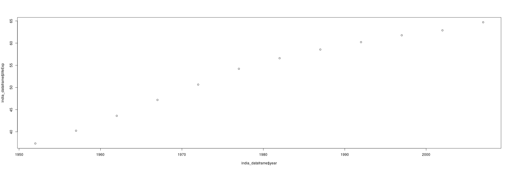
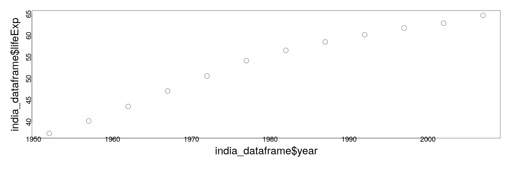

========================================================
autosize: true
incremental: true
width: 1920
height: 1080

<div style="background-color: white; padding:40px">
<h1 style='color:black'> An introduction to programming in R -- Part 2</h1>
<h2 style='color:black'> 08/29/2019</h2>
<h2 style='color:black'>Instructions:</h2>
<p style='color:black'>Use the left and right arrow keys to navigate the presentation forward and backward respectively.  You can also use the arrows at the bottom right of the screen to navigate with a mouse.<br></p>
</div>

========================================================

<h2>Outline</h2>

* The following topics will be covered in this lecture:

 * Vectorization
 * Variables and data types
 * Dataframes
 * Factors
 * File I/O
 * Basic plotting

* These lectures are based on the materials in [R for Reproducible Scientific Analysis](https://swcarpentry.github.io/r-novice-gapminder/).

========================================================


<h2> Vectorization</h2>

* R is a vectorized language, meaning that variables and functions can have vectors as values. 

* A vector in R describes a set of values in a certain order of the <b>same data type</b>.

  * The type of data will become increasingly important as we start using vectors.
  
* A simple way to construct a vector is with the constructor function "c()"


```r
c(1, 3, 6)
```

```
[1] 1 3 6
```

========================================================

<h3> Vectorization -- continued</h3>


* The function takes an arbitrary number of elements as above, and creates a vector.


```r
my_variable <- c(TRUE, pi)
my_variable
```

```
[1] 1.000000 3.141593
```

* Notice that the output of the above expression looks different from the input --- this is because R forces vectors to have data of a single type:


```r
typeof(my_variable)
```

```
[1] "double"
```

* Here, the value "TRUE" has been forced into its numeric counterpart "1".

========================================================

<h3> Vectorization -- continued</h3>

* Certain functions allow us to construct vectors automatically based on a range of values, known as a "slice"


```r
my_variable <- 1:5
my_variable
```

```
[1] 1 2 3 4 5
```

* We can make a general slice where the arguments are given as a:b and returns a vector of all integer spaced values between a and b:


```r
10:5
```

```
[1] 10  9  8  7  6  5
```

```r
4:10
```

```
[1]  4  5  6  7  8  9 10
```

* This is often quite useful for extracting a subset of data from a large vector or matrix.

========================================================

<h3> Vectorization -- continued</h3>

* One additional useful construction function for vectors is the "seq()" or sequence generation function.

* This is like the slice operator ":", but with the additional argument "by"


```r
seq(1,10, by=0.1)
```

```
 [1]  1.0  1.1  1.2  1.3  1.4  1.5  1.6  1.7  1.8  1.9  2.0  2.1  2.2  2.3
[15]  2.4  2.5  2.6  2.7  2.8  2.9  3.0  3.1  3.2  3.3  3.4  3.5  3.6  3.7
[29]  3.8  3.9  4.0  4.1  4.2  4.3  4.4  4.5  4.6  4.7  4.8  4.9  5.0  5.1
[43]  5.2  5.3  5.4  5.5  5.6  5.7  5.8  5.9  6.0  6.1  6.2  6.3  6.4  6.5
[57]  6.6  6.7  6.8  6.9  7.0  7.1  7.2  7.3  7.4  7.5  7.6  7.7  7.8  7.9
[71]  8.0  8.1  8.2  8.3  8.4  8.5  8.6  8.7  8.8  8.9  9.0  9.1  9.2  9.3
[85]  9.4  9.5  9.6  9.7  9.8  9.9 10.0
```

* Using this, we can create a vector with a range of values with an arbitrary step in between.


========================================================

<h3> Vectorization -- continued</h3>

* Using vectors will often be necessary, but it is also extremely useful to perform mathematical operations in vectors as above.

  * Vectors firstly make code more compact and easier to read for someone working on it.
  
  * Moreover, vector operations are typically faster than alternative methods of computing.
  
  * This is because the underlying "machinery" in R is faster than executing R code;
    
    * in particular, operations as above and mathematical functions have been optimized for performance.
  
* Most typically, we will furthermore be examining tabular data which is expressed most commonly as a matrix.

* A loose familiarity with matrices will be necessary in this course, but not a deep understanding of linear algebra or applied matrix theory.

* Advanced students will benefit from understanding matrix factorizations such as QR and singular value decompositions, but the R language will take care of these details in practice.

========================================================
<h2> Review of the material </h2>

* <b>Q:</b> consider the following expressions.  What is the final value of "x" and the final value of "y"?


```r
x <- 5
y <- 3
x <- x * y
y <- y - x
```

* <b>A:</b>


```r
x
```

```
[1] 15
```

```r
y
```

```
[1] -12
```

========================================================
<h3> Review of the material -- continued </h3>

* <b>Q:</b> is the following expression guaranteed to be "TRUE"?


```r
0 == sin(pi)
```

* <b>A:</b> not necessarily, the way that numerical values are understood by the machine is not the same as they are mathematically:


```r
0 == sin(pi)
```

```
[1] FALSE
```

* <b>Q:</b> what is the outcome of the following comparison, and why?

```
1 == TRUE
```

* <b>A:</b> it is TRUE, because the logical has been coerced into numeric.


```r
1 == TRUE
```

```
[1] TRUE
```

========================================================
<h3> Review of the material -- continued </h3>


* <b>Q:</b> consider the following expressions --- what is the final output?


```r
x <- 9:25
y <- 3:4
x[y]
```

* <b>A:</b>


```r
x[y]
```

```
[1] 11 12
```


* <b>Q:</b> consider the following expressions --- what is the final output?


```r
x <- 9:25
y <- x > 16
x[y]
```

* <b>A:</b>


```r
x[y]
```

```
[1] 17 18 19 20 21 22 23 24 25
```

========================================================
<h3>Review of material -- continued</h3>

* We have seen that we can apply mathematical operations to numerical vectors. 

* <b>Q:</b> what do you expect the output to be of the following statement?


```r
c('red', 'blue', 'green') + 2
```

* <b>A:</b>


```r
my_vector <- c('red', 'blue', 'green') + 2
```

```
Error in c("red", "blue", "green") + 2: non-numeric argument to binary operator
```

* R was told to add together a numerical value and a character value, for which there is no defined output with addition.

* For operations that are undefined, there will usually be an error message as the output.

========================================================

<h2>Data types</h2>

* There are 5 main types in R: 

 * double;


```r
typeof(pi)
```

```
[1] "double"
```

 * integer;


```r
typeof(1L)
```

```
[1] "integer"
```
 
 * complex;


```r
typeof(1+1i)
```

```
[1] "complex"
```

========================================================
<h3>Data types -- continued </h3>

* and non-numeric types:

 * logical 


```r
typeof(TRUE)
```

```
[1] "logical"
```

 
 * character


```r
typeof('banana')
```

```
[1] "character"
```

* Understanding data types and the way they are coerced is important because R strictly enforces that data in a vector is of a single type.

* By keeping everything in a column the same, we can make simple assumptions about our data; 

  * if you can interpret one entry in the column as a number, then you can interpret all of them as numbers, so we don’t have to check every time. 
  
* This consistency is what people mean when they talk about clean data; 

  * in the long run, strict consistency goes a long way to making our lives easier in R.


========================================================
<h2>Type coercion</h2>

* We have seen how a vector may coerce a logical value to numeric one:


```r
c(TRUE, pi)
```

```
[1] 1.000000 3.141593
```

* <b>Q:</b> what do you expect the output of the following expression to be?


```r
c(TRUE, 'TRUE')
```

* <b>A:</b> in this case, the logical is coerced into a "character" string,


```r
c(TRUE, 'TRUE')
```

```
[1] "TRUE" "TRUE"
```

========================================================
<h3>Type coercion -- continued</h3>

<ul>
  <li> The coercion rules go: </li>
  <ol>
    <li> logical -> integer</li> 
    <li> integer -> numeric </li>
    <li> numeric -> complex </li>
    <li> complex -> character,</li>
  </ol>
  <li> where -> can be read as are transformed into.</li> 
  <li>You can try to force coercion against this flow using the as. functions, e.g.,</li>
</ul>


```r
as.numeric(c('1', '2', '3'))
```

```
[1] 1 2 3
```


========================================================
<h2>Data structures</h2>

* Vectors are one type of data structure that we encounter frequently;

  * however, there are other related (and important) data structures that we will need to manipulate.

* R has an extremely developed tool for handling tabular data, such as comma separated values.

  * in R, this tool is a "dataframe".

* We will explore the functionality of dataframes with some "cat" data in some simple examples:


```r
cats <- data.frame(coat = c("calico", "black", "tabby"), 
                    weight = c(2.1, 5.0, 3.2), 
                    likes_string = c(1, 0, 1))
```

* Notice that the arguments of the function "data.frame()" are three expressions associating a name with a vector.


========================================================
<h3>Dataframes</h3>

* Printing the variable "cats", we see what tabular data looks like in a dataframe:


```r
cats
```

```
    coat weight likes_string
1 calico    2.1            1
2  black    5.0            0
3  tabby    3.2            1
```

* The assignment of the vectors to names in the arguments assigned the column names.

* Each column consists of <b>a vector of uniform data type</b>.

* If we want to extract a named column from a dataframe, this can be done with the "$" sign and the column name:


```r
cats$weight
```

```
[1] 2.1 5.0 3.2
```

* Each row, on the other hand, consists of multiple measurements (of different data types) corresponding to one specific case of the data set.


========================================================
<h3>Dataframes -- continued</h3>

* We might suppose that the scale used to measure the cats' weights was off by two kgs.

* In this case, we can re-assign values into the column weight as follows:


```r
cats$weight
```

```
[1] 2.1 5.0 3.2
```

```r
cats$weight <- cats$weight + 2
```

* We can verify that the assignment went into the column for weight in "cats",


```r
cats
```

```
    coat weight likes_string
1 calico    4.1            1
2  black    7.0            0
3  tabby    5.2            1
```

========================================================
<h2>Lists </h2>

* A data structure related to vectors are <b>lists</b>.

* Lists function as containers for heterogeneous data, allowing different types:


```r
list_example <- list(1, "a", TRUE, 1+4i)
list_example
```

```
[[1]]
[1] 1

[[2]]
[1] "a"

[[3]]
[1] TRUE

[[4]]
[1] 1+4i
```

========================================================
<h3>Lists -- continued </h3>

* In the last example no type coercion has taken place; 


```r
typeof(list_example[[1]])
```

```
[1] "double"
```

```r
typeof(list_example[[2]])
```

```
[1] "character"
```

  * all of the original types have been respected, but because the data is allowed to be inhomogeneous we can't use vector operations on a list.
  

```r
list_example + 2
```

```
Error in list_example + 2: non-numeric argument to binary operator
```

* Here we see an error message because the "+" operator only knows how to operate on numeric arguments, or ones that can be coerced into one.

========================================================
<h3>Lists -- continued </h3>

* Recall our dataframe cats,


```r
cats
```

```
    coat weight likes_string
1 calico    4.1            1
2  black    7.0            0
3  tabby    5.2            1
```

* We know that dataframes contain homogeneous data in each <b>column</b>, but each row may be inhomogeneous.

* <b>Q:</b>What kind of data structure do you think a dataframe is? Can it be a vector? Why or why not?

* <b>A:</b> A dataframe cannot be a vector because of coercion rules --- instead it operates as a <b>list of vectors</b>:


```r
typeof(cats)
```

```
[1] "list"
```

```r
typeof(cats$weight)
```

```
[1] "double"
```

========================================================
<h2>Factors</h2>

* Consider now the vector "coat" in the dataframe:


```r
cats$coat
```

```
[1] calico black  tabby 
Levels: black calico tabby
```

```r
typeof(cats$coat)
```

```
[1] "integer"
```

```r
as.numeric(cats$coat)
```

```
[1] 2 1 3
```

* <b>Q:</b> can you hypothesize what the meaning is of this data? What is a level, and why are the coats "integer"?

* <b>A:</b> R likes to treat character strings in dataframes as categorical variables;

  * in this case, the categories are "black", "calico" and "tabby";
  
  * each integer value is encoding whether the case (or row) belongs to category 1, 2 or 3, where category labels are sorted alphanumerically.

========================================================
<h2>Manipulating dataframes</h2>

* Let's suppose that we need to include more information on our cats in our analysis; 
  
  * a friend has provided ages of all the cats for us:


```r
age <- c(2, 3, 5)
```

* We want to combine this into our dataframe, which can be done with "cbind()"


```r
cats <- cbind(cats, age)
cats
```

```
    coat weight likes_string age
1 calico    4.1            1   2
2  black    7.0            0   3
3  tabby    5.2            1   5
```

* This function introduces the new vector as an additional column in the dataframe; 

 * the variable name is defined the column name, and we reassign the dataframe to cats recursively.

========================================================
<h3>Adding columns to dataframes</h3>


* <b>Q:</b> can you hypothesize what will be the output if we try to combine the following vector with the dataframe?


```r
age <- c(2, 3, 5, 8, 9)
cats <- cbind(cats, age)
```

* <b>A:</b> dataframes, like matrices, need to have consistent dimensions of the data;

  * this new column is too long, so we will get an error:


```r
age <- c(2, 3, 5, 8, 9)
cats <- cbind(cats, age)
```

```
Error in data.frame(..., check.names = FALSE): arguments imply differing number of rows: 3, 5
```

========================================================
<h3>Dataframe dimensions</h3>

* We can examine the dimensions of a dataframe with standard functions:


```r
dim(cats)
```

```
[1] 3 4
```

* In the above we see the standard, matrix style dimensions of the dataframe.

  * these can also be extracted individually with "nrow" and "ncol":


```r
nrow(cats)
```

```
[1] 3
```

```r
ncol(cats)
```

```
[1] 4
```

========================================================
<h3>Dataframe indices</h3>

* Entries of dataframes can be accessed directly using matrix indexing:


```r
cats[2,4]
```

```
[1] 3
```

* This can also be performed with slices:

```r
cats[1:2, 2:3]
```

```
  weight likes_string
1    4.1            1
2    7.0            0
```

========================================================
<h3>Dataframe indices</h3>

* Additionally, we can use specialized notation for accessing an entire row or column:


```r
cats[,1]
```

```
[1] calico black  tabby 
Levels: black calico tabby
```

```r
cats[1,]
```

```
    coat weight likes_string age
1 calico    4.1            1   2
```

* Here, the blank in the place of the index tells R to extract the entire row or column.

========================================================
<h3>Adding rows to dataframes</h3>

* Let's suppose we have examined a new cat and we want to add a case to our dataframe:


```r
newRow <- list("tortoiseshell", 3.3, TRUE, 9)
cats <- rbind(cats, newRow)
cats
```

```
    coat weight likes_string age
1 calico    4.1            1   2
2  black    7.0            0   3
3  tabby    5.2            1   5
4   <NA>    3.3            1   9
```

* Notice, the "NA" value in the above for the coat of the fourth cat.

  * While the row was added successfully, it produces a "Not Available", missing data entry.
  
* Factors, like other vectors, are strict in R;

  * when we attempt to add a value that is not recognized as one of the categories, R treats this as missing data.


========================================================
<h3>Adding levels to factors</h3>

* We can access the levels of a factor vector with the "levels()" function:


```r
levels(cats$coat)
```

```
[1] "black"  "calico" "tabby" 
```

* If we want to re-assign new levels to a factor, we can do so recursively


```r
levels(cats$coat) <- c(levels(cats$coat), "tortoiseshell")
cats <- rbind(cats, list("tortoiseshell", 3.3, TRUE, 9))
cats
```

```
           coat weight likes_string age
1        calico    4.1            1   2
2         black    7.0            0   3
3         tabby    5.2            1   5
4          <NA>    3.3            1   9
5 tortoiseshell    3.3            1   9
```

* Notice, "tortiseshell" was now accepted as a category, but the NA value remains.

========================================================
<h3>Summarizing dataframes</h3>

* In general, we want to know if a dataframe has missing values, and what kind of variables are in it.

* Several common functions allow this, including

  * "str()" or the structure function:


```r
str(cats)
```

```
'data.frame':	5 obs. of  4 variables:
 $ coat        : Factor w/ 4 levels "black","calico",..: 2 1 3 NA 4
 $ weight      : num  4.1 7 5.2 3.3 3.3
 $ likes_string: num  1 0 1 1 1
 $ age         : num  2 3 5 9 9
```

* This tells us what the dimensions are, the column names are, and what types of variables we are working with.

========================================================
<h3>Summarizing dataframes -- continued</h3>

* We can also obtain a quick statistical summary of the data with the "summary()" function:


```r
summary(cats)
```

```
            coat       weight      likes_string      age     
 black        :1   Min.   :3.30   Min.   :0.0   Min.   :2.0  
 calico       :1   1st Qu.:3.30   1st Qu.:1.0   1st Qu.:3.0  
 tabby        :1   Median :4.10   Median :1.0   Median :5.0  
 tortoiseshell:1   Mean   :4.58   Mean   :0.8   Mean   :5.6  
 NA's         :1   3rd Qu.:5.20   3rd Qu.:1.0   3rd Qu.:9.0  
                   Max.   :7.00   Max.   :1.0   Max.   :9.0  
```

* The summary furthermore tells us how many missing values are present.

========================================================
<h3>Removing rows</h3>

* We will often want to remove cases with missing data;

  * this can be performed automatically with "na.omit()"
  

```r
na.omit(cats)
```

```
           coat weight likes_string age
1        calico    4.1            1   2
2         black    7.0            0   3
3         tabby    5.2            1   5
5 tortoiseshell    3.3            1   9
```

========================================================
<h3>Removing rows or columns</h3>

* We can also remove rows or columns by index, using a "-"


```r
cats[-1,]
```

```
           coat weight likes_string age
2         black    7.0            0   3
3         tabby    5.2            1   5
4          <NA>    3.3            1   9
5 tortoiseshell    3.3            1   9
```

```r
cats[,-1]
```

```
  weight likes_string age
1    4.1            1   2
2    7.0            0   3
3    5.2            1   5
4    3.3            1   9
5    3.3            1   9
```


========================================================
<h2>File IO</h2>

* Basic file input/ output (IO) can be done with functions such as:


```r
write.csv(x = cats, file = "data/feline-data.csv", row.names = FALSE)
cats_from_file <- read.csv(file = "data/feline-data.csv")
cats_from_file
```

```
           coat weight likes_string age
1        calico    4.1            1   2
2         black    7.0            0   3
3         tabby    5.2            1   5
4          <NA>    3.3            1   9
5 tortoiseshell    3.3            1   9
```

* In the above, we wrote the data cats to the file "feline-data.csv" in the data directory;

* CSV is a file type that R knows how to read automatically into a dataframe with the "read.csv()" function;
  
  * using the above command, we read the file into a new dataframe "cats_from_file".

========================================================
<h3>File IO -- continued</h3>

* We will suppose that we wish to analyze a new set of cat data that a friend gave us:

```
coat,   weight,     likes_string
calico, 2.1,        1
black,  5.0,        0
tabby,  3.2,        1
tabby,  2.3 or 2.4, 1
```

* Our friend was uncertain about the weight of the last cat and placed two values into the CSV.

* We suppose that this is written in the file "feline-data_v2.csv" which we will read with "read.csv()",


```r
cats_from_file <- read.csv(file="data/feline-data_v2.csv")
cats_from_file$weight
```

```
[1] 2.1        5.0        3.2        2.3 or 2.4
Levels: 2.1 2.3 or 2.4 3.2 5.0
```

* Notice that weight looks much different than before...

========================================================
<h3>Factors -- continued</h3>

* When R read the inhomogeneous data in the weights column, it first converted the values into character type;

  * when the character vector was seen by R in a dataframe, it then converted it automatically to a factor vector.
  
* Converting characters to factors automatically can be suppressed with additional arguments:


```r
cats_from_file <- read.csv(file="data/feline-data_v2.csv", stringsAsFactors=FALSE)
cats_from_file$weight
```

```
[1] "2.1"        "5.0"        "3.2"        "2.3 or 2.4"
```

* However, this illustrates in general how erroneously entered data can cause many issues with type conversions.

========================================================
<h2>A realistic dataframe</h2>

* Through much of the class, we will call data from different libraries in R.

* For this lesson, and the homework, we will consider the ``gapminder`` data.

  * We start by importing this from R:
  

```r
require(gapminder)
```

* When we start looking at new data, best practice is to start interrogating it to see the data types, the number of cases and the different variables in each case:


```r
str(gapminder)
```

```
Classes 'tbl_df', 'tbl' and 'data.frame':	1704 obs. of  6 variables:
 $ country  : Factor w/ 142 levels "Afghanistan",..: 1 1 1 1 1 1 1 1 1 1 ...
 $ continent: Factor w/ 5 levels "Africa","Americas",..: 3 3 3 3 3 3 3 3 3 3 ...
 $ year     : int  1952 1957 1962 1967 1972 1977 1982 1987 1992 1997 ...
 $ lifeExp  : num  28.8 30.3 32 34 36.1 ...
 $ pop      : int  8425333 9240934 10267083 11537966 13079460 14880372 12881816 13867957 16317921 22227415 ...
 $ gdpPercap: num  779 821 853 836 740 ...
```

========================================================
<h3>A realistic dataframe -- continued</h3>

* We will also usually benefit from the summary:


```r
summary(gapminder)
```

```
        country        continent        year         lifeExp     
 Afghanistan:  12   Africa  :624   Min.   :1952   Min.   :23.60  
 Albania    :  12   Americas:300   1st Qu.:1966   1st Qu.:48.20  
 Algeria    :  12   Asia    :396   Median :1980   Median :60.71  
 Angola     :  12   Europe  :360   Mean   :1980   Mean   :59.47  
 Argentina  :  12   Oceania : 24   3rd Qu.:1993   3rd Qu.:70.85  
 Australia  :  12                  Max.   :2007   Max.   :82.60  
 (Other)    :1632                                                
      pop              gdpPercap       
 Min.   :6.001e+04   Min.   :   241.2  
 1st Qu.:2.794e+06   1st Qu.:  1202.1  
 Median :7.024e+06   Median :  3531.8  
 Mean   :2.960e+07   Mean   :  7215.3  
 3rd Qu.:1.959e+07   3rd Qu.:  9325.5  
 Max.   :1.319e+09   Max.   :113523.1  
                                       
```

========================================================
<h3>A realistic dataframe -- continued</h3>

* We also often benefit from looking at a sub-slice of the data to "feel" what kind of data we are working with.

* This is commonly done with the ``head()`` function;

  * this will extract the leading rows of the dataframe for examination:


```r
head(gapminder)
```

```
# A tibble: 6 x 6
  country     continent  year lifeExp      pop gdpPercap
  <fct>       <fct>     <int>   <dbl>    <int>     <dbl>
1 Afghanistan Asia       1952    28.8  8425333      779.
2 Afghanistan Asia       1957    30.3  9240934      821.
3 Afghanistan Asia       1962    32.0 10267083      853.
4 Afghanistan Asia       1967    34.0 11537966      836.
5 Afghanistan Asia       1972    36.1 13079460      740.
6 Afghanistan Asia       1977    38.4 14880372      786.
```

========================================================
<h3>A realistic dataframe -- continued</h3>


* Similarly, we can use the ``tail()`` function to examine the trailing rows:


```r
tail(gapminder)
```

```
# A tibble: 6 x 6
  country  continent  year lifeExp      pop gdpPercap
  <fct>    <fct>     <int>   <dbl>    <int>     <dbl>
1 Zimbabwe Africa     1982    60.4  7636524      789.
2 Zimbabwe Africa     1987    62.4  9216418      706.
3 Zimbabwe Africa     1992    60.4 10704340      693.
4 Zimbabwe Africa     1997    46.8 11404948      792.
5 Zimbabwe Africa     2002    40.0 11926563      672.
6 Zimbabwe Africa     2007    43.5 12311143      470.
```

========================================================
<h3>Extracting sub-sets of data</h3>

*  We might be interested in a particular country, let's say India;

  * we can, for example, make a sub-dataframe based on the cases corresponding to India alone:
  

```r
india_index <- gapminder$country == "India"
```

* In the above, we have constructed a logical vector for the purpose of indexing the <b>rows</b> which correspond to India.

  * Any row which contains the factor level ``India`` in the ``country`` factor vector will correspond to a ``TRUE`` in the logical vector ``india_index``.
  
  * Any row which does not contain the factor level ``India`` will respectively correspond to a ``FALSE``.

========================================================
<h3>A realistic dataframe -- continued</h3>

* Here, we will extract the India data based on the logical indexing and examine the sub-dataframe:


```r
india_dataframe <- gapminder[india_index, ]
head(india_dataframe)
```

```
# A tibble: 6 x 6
  country continent  year lifeExp       pop gdpPercap
  <fct>   <fct>     <int>   <dbl>     <int>     <dbl>
1 India   Asia       1952    37.4 372000000      547.
2 India   Asia       1957    40.2 409000000      590.
3 India   Asia       1962    43.6 454000000      658.
4 India   Asia       1967    47.2 506000000      701.
5 India   Asia       1972    50.7 567000000      724.
6 India   Asia       1977    54.2 634000000      813.
```

========================================================
<h2>Basic plotting</h2>

* R has several different kinds of plotting commands and libraries;

  * for simple plots, intended as exploratory analysis, we often will use the "base" R plotting.
  
* For more advanced control and formatting, we will typically use a more sophisticated library, such as ``ggplot2``;

  * learning to use advanced plotting will be in the homework assignment.
  
========================================================
<h3>Basic plotting -- continued</h3>


* If we want to create a quick exploratory "x-y" plot of some relationship, this can be done with the ``plot()`` function.

* For example, we will plot the change of life expectancy over time in India:


```r
plot(india_dataframe$year, india_dataframe$lifeExp) 
```


  
========================================================
<h3>Basic plotting -- continued</h3>

* In the last command, we can adjust labels and plot sizes with additional arguments in the plot function;
  
  * these arguments and "keywords" can be found in the help file for plot, using ``?plot``.


```r
par(mai=c(1.5,1.5,.5,.5), mgp=c(3,0,0))
plot(india_dataframe$year, india_dataframe$lifeExp, cex=3, cex.lab=3, cex.axis=2) 
```


  
========================================================
<h2>For next time</h2>

* We will begin doing math next time.

  * The first homework will be to practice programming skills discussed this week.
  
  * If you need additional practice, continue the lessons in Software Carpentry on your own.
  
  * You will have some time to learn additional programming skills before we start modeling in the homework.
  
  * We will start with simple examples and theory for understanding fundamentals;
  
  * once we have established the fundamentals, we will begin more realistic practice with the tools as discussed this week.
