

Simple linear regression – part 1
========================================================
date: 09/03/2019
autosize: true
incremental: true
width: 1920
height: 1080

<h2 style="text-align:left"> Instructions:</h2>

Use the left and right arrow keys to navigate the presentation forward and backward respectively.  You can also use the arrows at the bottom right of the screen to navigate with a mouse. 

========================================================

<h2>Outline</h2>

* The following topics will be covered in this lecture:

  * Linear models
  * Simple linear regression
  * Basic regression assumptions
  * The process of creating a regression model

========================================================

<h2>Introducing linear models</h2>

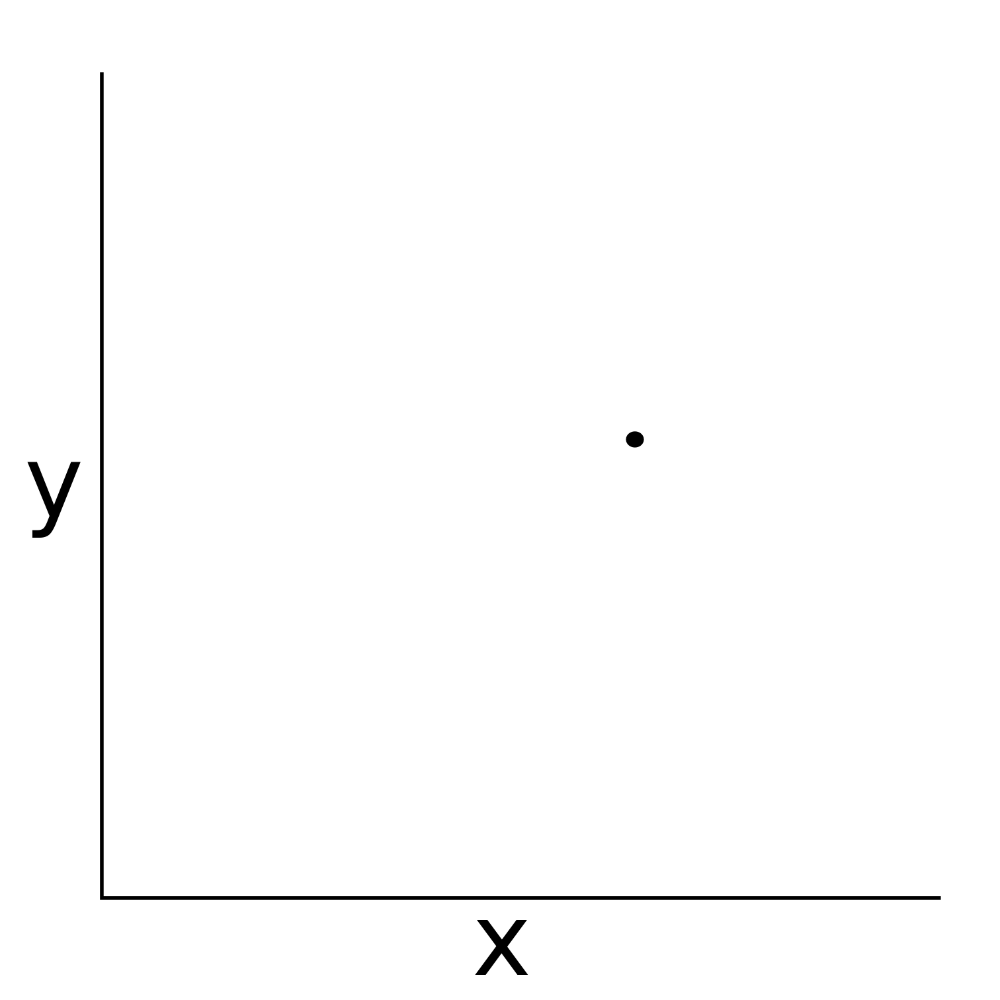

<ul>
  <li> In past mathematics courses, we have seen many examples of linear models.</li>
  <li> Suppose that we wish to model a relationship between two variables, $x$ and $y$ to the left.</li>
  <li> We will call $y$ a <b>dependent variable</b>, or the <b>response variable</b>.</li>
  <li> On the other hand, we will call $x$ an <b>independent variable</b>, an <b>explanatory variable</b> or a <b>predictor variable</b> for the response.</li>
  <li><b>Q:</b> can you propose a valid linear model for the relationship between the response and the predictor?</li>
</ul>

========================================================

<h3>Introducing linear models -- continued</h3>

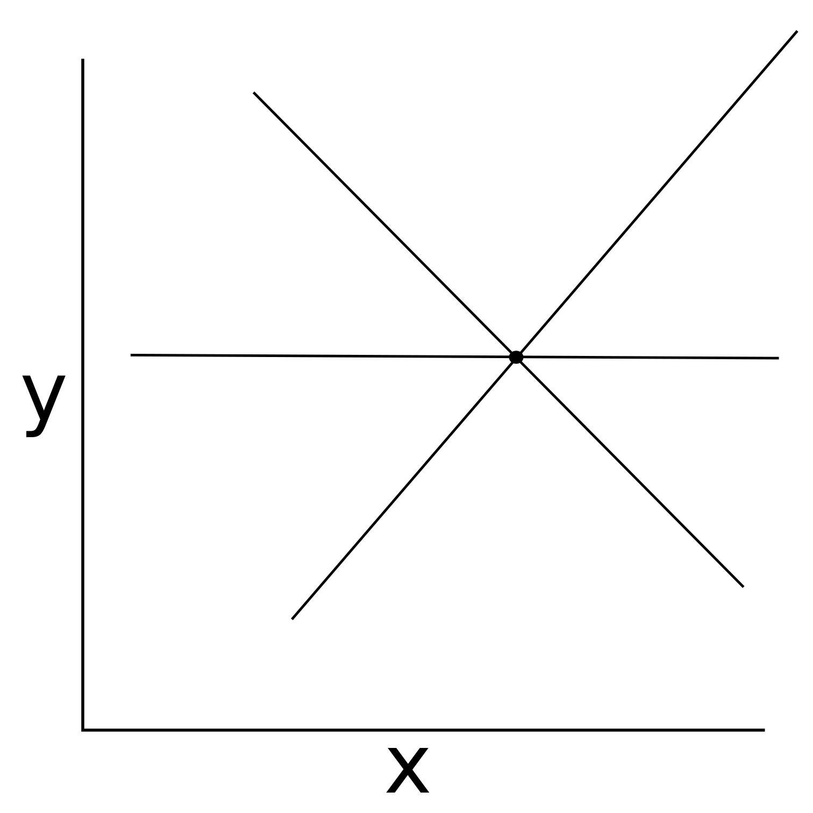

<ul>
  <li><b>A:</b> actually, any line that passes through the point is a valid linear model.</li>
  <li>Particularly, this relationship is underconstrained and there exists infinitely many choices of linear models;</li>
  <ul>
    <li>given the current data, any choice is as valid as any other.</li>
  </ul>
</ul>

========================================================

<h3>Introducing linear models -- continued</h3>

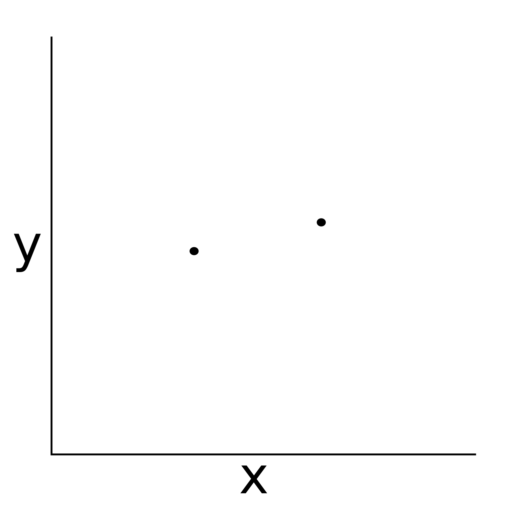

<ul>
  <li><b>Q:</b> given the data on the left, can you propose a valid linear model for the relationship between $x$ and $y$?</li>
</ul>

========================================================

<h3>Introducing linear models -- continued</h3>

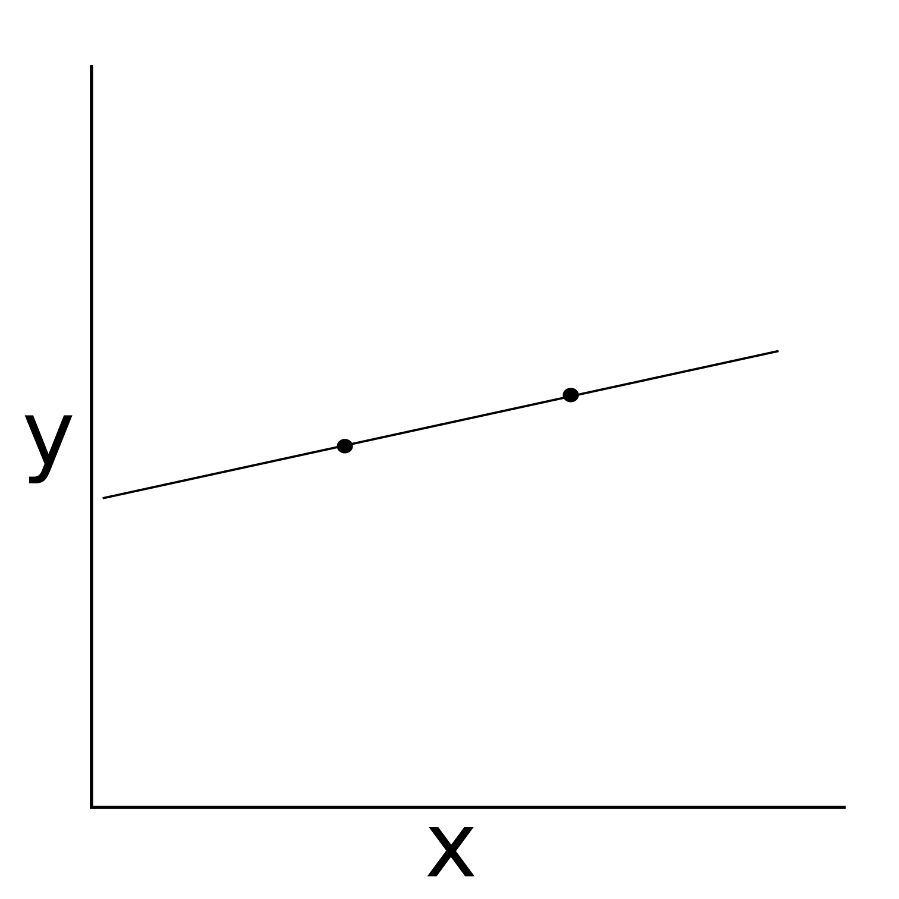

<ul>
  <li><b>A:</b> given the data, there exists a unique choice of a linear model that describes the relationship between $x$ and $y$.</li>
  <li> Suppose the points have the Cartesian coordinates $(x_1,y_1)$ and $(x_2,y_2)$.</li>
  <li> Then we can write the change in $y$ from $y_1$ to $y_2$ over the interval $x_1$ to $x_2$ as,
    $$\begin{align}
    m \triangleq \frac{\left(y_2 - y_1\right)}{\left(x_2 - x_1\right)}.
    \end{align}$$</li>
  <li>Then suppose we want to predict the response $y$ at an unobserved value $x$ for the explanatory variable;</li>
  <ul>
    <li>our model for the response variable can be written as,
      $$\begin{align}
      & m = \frac{\left(y - y_1\right)}{\left(x - x_1\right)} \\
      \Leftrightarrow & y = m*x + \left(y_1 - m * x_1\right)
      \end{align}$$
  </ul>
</ul>

========================================================

<h3>Introducing linear models -- continued</h3>

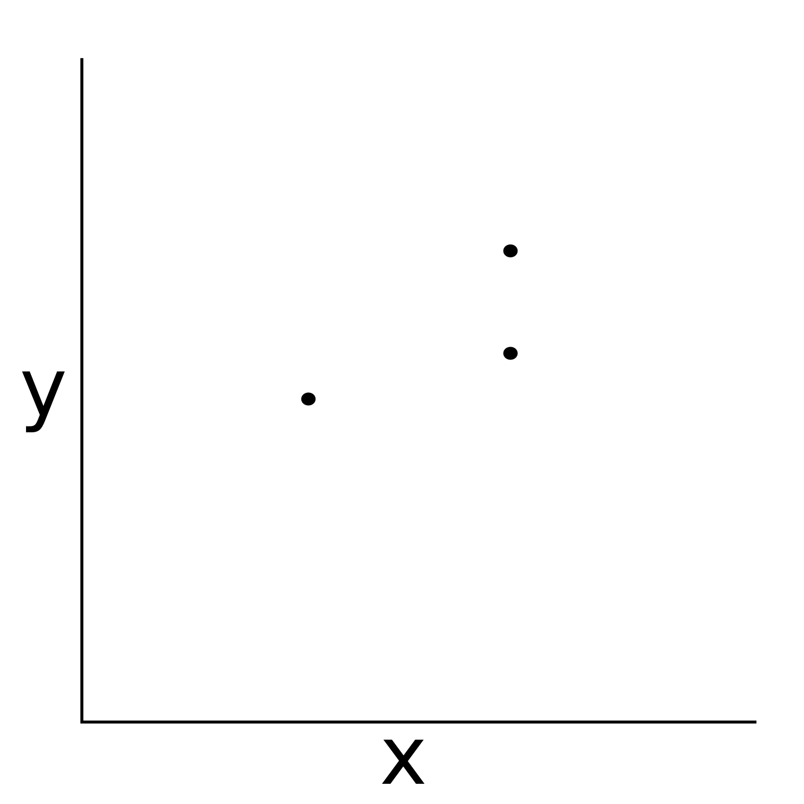

<ul>
  <li>Let's suppose that we are given the observed data on the left, with two values of the response $y$ observed with the same value of the explanatory variable $x$.</li>
  <li>Let's suppose that we know there is measurement error in the response variable $y$, but we have the same level of confidence (or inversely, the same level of uncertainty) in each measurement.</li>
  <li><b>Q:</b> given the data, can you propose a linear model that describes the relationship between $x$ and $y$?</li>
</ul>

========================================================

<h3>Introducing linear models -- continued</h3>

<ul>
  <li><b>A:</b> given the data, if the relationship is purely deterministic, there is no possible linear model to define;</li>
  <ul>
    <li>indeed, in a deterministic setting, this represents an overconstrained model for which there is no solution.</li>
  </ul>
  <li>However, because we know that there is <b>random error</b>, one reasonable choice may be to "fit" a line that passes equi-distant between the two observed values of $y$ for the single value of $x$.</li>
<li> If we were to take many replicates (repeated measurements) of $y$ at the same point $x$, we would expect that <b>on average</b> we would recover the "true" relationship without error fitting the line this way.</li>
<li>This underlies the fundamental motivation for simple linear regression.</li>
</ul>

========================================================

<h3>Introducing linear models -- continued</h3>

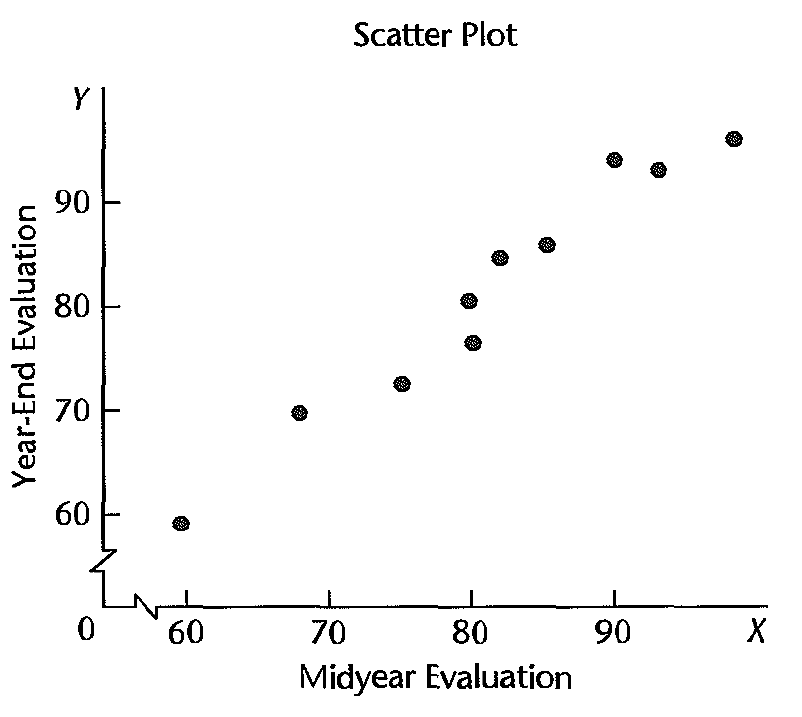
 Courtesy of: Kutner, M. et al. Applied Linear Statistical Models 5th Edition

<ul>
  <li>More generally we might suppose that, instead of measurement errors, the relationship itself is not deterministic.</li>
  <ul>
    <li>We will suppose that there is some systematic way in which two variables $x$ and $y$ change together, but this is a relationship with natural variability.</li>
  </ul>
  <li>In the (hypothetical) example on the left, we plot the year-end performance evaluation of employees at a company, versus their midyear evaluation.</li>
<li> We see that there is a general "tendency" in the plot, where higher midyear evaluations tend to correspond to higher year-end evaluations.</li>
<li>However, we do not believe that the relationship is causal; </li>
  <ul>
    <li>indeed, one would only need to work half of the year to recieve good year-end evaluations if this were the case.</li>
  </ul>
</ul>

========================================================

<h3>Introducing linear models -- continued</h3>

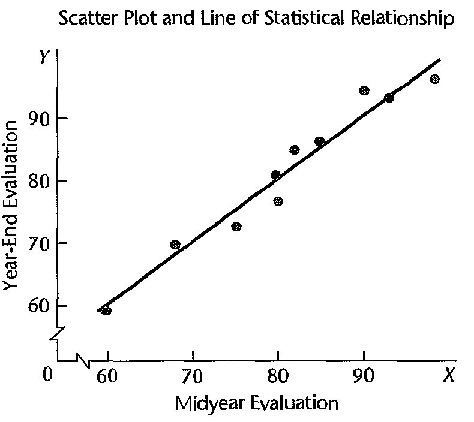
 Courtesy of: Kutner, M. et al. Applied Linear Statistical Models 5th Edition

<ul>
  <li>In order to model the observed tendency, we can approach the problem as before:</li>
  <ul>
    <li>we can "fit" a line to the data which will be drawn to a particular observation more or less strongly depending on the uncertainty of the data, or the natural variability.</li>
  </ul>
  <li>The line thus represents a statistical relationship, which describes the general tendency of the relationship between $x$ and $y$ in the data.</li>
  <li> We will not suppose that $x$ causes the value of the response $y$, but that $x$ is useful for explaining or predicting a value of $y$ based on our model, with some level of uncertainty.</li>
</ul>

========================================================

<h3>Introducing linear models -- continued</h3>

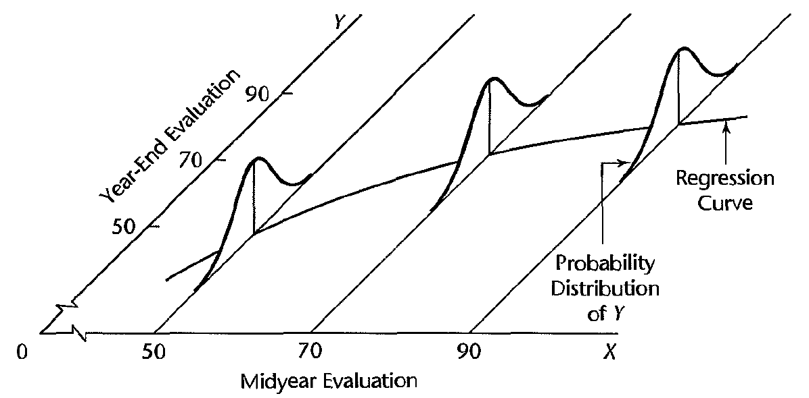
 Courtesy of: Kutner, M. et al. Applied Linear Statistical Models 5th Edition

<ul>
  <li>Formally, this postulates that:
  <ol>
    <li>  there is a probability distribution for the response variable $y$ at each value of $x$;</li>
    <li> and that the means of these probability distributions vary systematically with the value of $x$.</li>
  </ol>
  <li>The systematic part of this relationship is called the <b>regression function of $y$ on $x$, or the regression curve</b>.</li>
  <li><b>Note:</b> generally, we can extend this notion into higher dimensions.
</ul>

<ul>
  <li> We may for instance consider how $y$ varies systematically in response to two variables $x$ and $z$.</li>
  <li> In this case, we will postulate that there is a distribution for $y$ that has a mean which varies systematically in the $x-z$ plane.</li>
  <li> Will call a regression function with one predictor <b>simple regression</b>;
  <ul>
    <li>if the regression function includes more than one predictor, we call this a <b>multiple regression</b>.
  </ul>
  <li>We will develop our basic intuition with simple regression models, then extend this to multiple regression.</li> 
</ul>

========================================================

<h2>Simple linear regression</h2>

* We saw already how we can define a simple regression in terms of a line describing a tendency.

* Using the equation for a line in the response $y$ in terms of the explanatory variable $x$, we arrive at the general form for simple linear regression:

$$\begin{align}
Y_i = \beta_0 + \beta_1 X_i + \epsilon_i
\end{align}$$

<ul>
  <li> In the above, the terms represent:
  <ol>
    <li> $Y_i$ -- the value of the response in the $i$-th trial or observation;</li>
    <li> $\beta_0$ and $\beta_1$ -- the parameters which define the equation for the line, i.e., define the regression function;</li>
    <li> $X_i$ -- the value of the predictor in the $i$-th trial or observation;</li>
    <li> $\epsilon_i$ -- the random error or variation in the response about the regression line.</li>
  </ol>
</ul>

* The equation above represents our hypothesis of what the "true" relationship looks like between $x$ and $y$, where we assume that there is a linear signal describing $y$ by $x$ with variation.

========================================================

<h3>Simple linear regression -- continued</h3>

* Consider the example of the year-end performance $y$ as regressed on with the midyear performance $x$, in terms of the regression equation:

  $$\begin{align}
  Y_i = \beta_0 + \beta_1 X_i + \epsilon_i
  \end{align}$$

* <b>Q:</b> what values are <b>known</b> in the above equation?  What values are <b>uknown</b>?

* <b>A:</b> $Y_i$ and $X_i$ are observed values in our data set and are thus known.  
  
  * The "true" relationship, if it exists, is defined in terms of unkown parameters $\beta_0,\beta_1$; 
  
  * the value of $\epsilon_i$ is the unknown variation about the true signal, defined with respect to $\beta_0,\beta_1$. 
  
* In this regard, the first goal of our regression analysis will be to determine $\beta_0$ and $\beta_1$, assuming that the above relationship is valid.

  * However, the ability to choose $\beta_0$ and $\beta_1$ with any guarantee of a "best" choice will depend on various assumptions.

  
========================================================

<h3>Regression assumptions -- refresher on terms</h3>

* Let $X$ be a random variable with a cumulative distribution function,

  $$
  F_X(x) \triangleq P(X \leq x)
  $$

* We suppose that $F_X$ defines a probability distribution $p(x)$.  We denote the <b>expectation of $X$</b> 
  
  $$\begin{align}
  \mathbb{E}\left[ X\right] = \int_\mathbb{R} xp(x) \mathrm{d}x
  \end{align}$$

  * Note, $\mathrm{d}x$ describes the "size" of a group of values that $X$ might attain; 
  
  * the density $p(x)$ describes the probability of any particular group of events in the integral;
  
  * therefore, the expectation describes the "center of mass" for the probability of $X$, i.e., the mean of $X$,
  
  $$  \mathbb{E}\left[X\right] = \mu_X $$

========================================================

<h3>Regression assumptions -- refresher on terms</h3>

* Recall, the variance of a random variable $\sigma^2$ is defined by the expected value of the squared-deviation from the mean, i.e.,

  $$\sigma^2_X \triangleq \mathbb{E}\left[ \left( X - \mu_X\right)^2 \right].$$

  * The above is a measure of how much the random variable $X$ deviates from its mean on average, over all its realizations;
  
* Note, the variance has units given by the units of $X$ squared;
  
  * therefore, we also typically consider the standard deviation $\sigma_X$ as a measure of how much variation $X$ experiences about its mean, but in the same units.
 

========================================================

<h3>Regression assumptions -- refresher on terms</h3>
  
* If we have two random variables $X_1,X_2$ with means $\mu_{X_1}, \mu_{X_2}$ respectively, we denote their covariance as,

  $$\sigma_{12}^2 = \mathbb{E}\left[\left(X_1 - \mu_{X_1}\right)\left(X_2 - \mu_{X_2}\right)\right]$$
  
* The correlation of the two variables $X_1,X_2$ is thus defined as,

  $$\mathrm{cor}\left(X_1,X_2\right)\triangleq \frac{\sigma_{12}^2}{\sigma_1 \sigma_2}$$
  
  where $\sigma_1$ and $\sigma_2$ is the standard deviation of $X_1$ and $X_2$ respectively.

  * The covariance thus measures how much the two variables $X_1$ and $X_2$ co-vary together or oppositely.
  
  * Correlation is a measure of how much the variables co-vary, where the range is "normalized" to $[-1,1]$.

========================================================

<h3>Regression assumptions -- refresher on terms</h3>
 
* <b>Q:</b> how can we use the definition of variance,
 
 $$\sigma^2_X = \mathbb{E}\left[ \left( X - \mu_X\right)^2 \right],$$
 
* the definition of covariance,
 
 $$\sigma_{12}^2 = \mathbb{E}\left[\left(X_1 - \mu_{X_1}\right)\left(X_2 - \mu_{X_2}\right)\right],$$
 
* and the definition of correlation,
 
 $$\mathrm{cor}\left(X_1,X_2\right)\triangleq \frac{\sigma_{12}^2}{\sigma_1 \sigma_2},$$
 
* to show that $X_1$ always has correlation 1 with itself?

* <b>A:</b> the numerator is equal to the variance by definition, and the standard deviation appears as a squared term in the denominator --- this reduces to one.
 
========================================================

<h3>Regression Assumptions -- continued</h3>

<ul>
  <li>Back to our regression equation,

  $$\begin{align}
  Y_i = \beta_0 + \beta_1 X_i + \epsilon_i.
  \end{align}$$
  </li>

  <li> We will make some assumptions about the variation $\epsilon_i$ that appears in the signal:</li>
  <ol>
    <li> we suppose that the variation is of mean zero, $\mathbb{E}\left[\epsilon_i\right] = 0$.</li>
    <ul>
      <li>If such a linear relationship does exist, we can always take this assumption by adjusting the definition of $\beta_0$ accordingly.</li>
    </ul>
    <li> we suppose (for now) that the variation is constant about every case, i.e.,
    $$
    \mathbb{E}\left[\epsilon_i^2\right] = \mathbb{E}\left[\epsilon_j^2\right] = \sigma^2
    $$
    for every $i,j$.</li>
    <ul>
      <li>Later we will look at ways to relax this assumption, leading to <em>weighted least squares</em>.</li>
    </ul>
    <li> we suppose (for now) that every pair of distinct cases $i\neq j$ are uncorrelated,
    $$
    \mathrm{cov}\left(\epsilon_i \epsilon_j\right) = 0
    $$</li>
    <ul>
      <li> If $\epsilon_i$ is uncorrelated with $\epsilon_j$, this just means that we do not gain information on the variation in the observation of $Y_i$ from the variation in $Y_j$.</li> 
      <li>Later we will look at ways to relax this as well, leading to <em>generalized least squares</em></em>.</li>
    </ul>
  </ol>
  <li>Notice that we did not assume what kind of distribution $Y_i$ takes -- we only made assumptions about its first two moments.</li>
</ul>

========================================================

<h3>Regression Assumptions -- linearity</h3>

* We note here an important distinction when we refer to the below model as "linear",

  $$\begin{align}
  Y_i = \beta_0 + \beta_1 X_i + \epsilon_i.
  \end{align}$$
  </li>

* In describing, "linearity" we refer to the fact that the <b>parameters enter into the equation linearly</b>.

* There will be many cases in which, however, we will want to <b>change the scale</b> of the predictor variable $X$.

* <b>Q:</b> can the below be interpreted as a linear model?

  $$\begin{align}
  Y_i = \beta_0 + \beta_1 \mathrm{log}\left( X_i\right) + \epsilon_i.
  \end{align}$$
  </li>

* <b>A:</b> yes, in this case, the parameters entered linearly.  Conceptually we can always re-write

  $$\begin{align} 
  Z_i &= \log(X_i)\\
  Y_i &= \beta_0 + \beta_1 Z_i + \epsilon_i
  \end{align}$$
  
  to find a model of the form we considered before in terms of the explanatory variable $Z$.
  
========================================================

<h3>Regression Assumptions -- linearity continued</h3>

<ul>
  <li> <b>Q:</b> which of the following models are linear in the parameters, <b>OR</b> can be transformed into a model that is linear in the parameters:</li>
  <ol>
    <li>$Y_i = \beta_0 + \beta_1 X_i^2 + \epsilon_i$;</li>
    <li>$Y_i = \beta_0 + \beta_1 \sqrt{X_i} + \epsilon_i$;</li>
    <li>$Y_i = \beta_0 X_i^{\beta_1} * \epsilon_i$;</li>
    <li>$Y_i = \beta_0 + \beta_1 X_i^{\beta_2} + \epsilon_i$.</li>
  </ol>
  <li>Explain why or why not.</li>
</ul>

========================================================

<h3>Regression Assumptions -- linearity continued</h3>

<ul>
  <li> <b>A:</b></li>
  <ol>
    <li>$Y_i = \beta_0 + \beta_1 X_i^2 + \epsilon_i$;</li>
    <ul>
      <li> This is a linear model in $X^2$ as the parameters have entered linearly -- the square can be re-written just as a change of scale.</li>
    </ul>
    <li>$Y_i = \beta_0 + \beta_1 \sqrt{X_i} + \epsilon_i$;</li>
    <ul>
      <li> This is a linear model in $\sqrt{X}$ as the parameters have entered linearly -- the square-root can be re-written just as a change of scale.</li>
    </ul>
    <li>$Y_i = \beta_0 X_i^{\beta_1} * \epsilon_i$.</li>
    <ul>
      <li> This is not a linear model, but it can be transformed into a model linear in the parameters:
      $$\log(Y_i) = \log(\beta_0) + \beta_1 \log(X_i) + \log(\epsilon_i).$$
      We can thus regress on $\log(Y)$ in terms of $\log(X)$ to perform our usual analysis.  Note, however, in this case we would need to assume that $\epsilon_i$ is distributed only on the positive real line.
      </li>
    </ul>
    <li>$Y_i = \beta_0 + \beta_1 X_i^{\beta_2} + \epsilon_i$;</li>
    <ul>
      <li> This is not a linear model, and due to to parameters entering additively and exponentially, there will not be a transformation into a linear model. </li>
    </ul>
  </ol>
  <li> Linear models may seem restrictive, but because the predictors can be transformed and combined in any way, they are actually very flexible.</li> 
   <li> <b>Note:</b> Linear is commonly used to refer to straight lines, but linear models can be curved as shown above.</li>
</ul>

========================================================

<h3>Implications of our assumptions</h3>

* There are some important consequences of the above assumptions, among which,
  
  $$Y_i = \beta_0 + \beta_1 X_i + \epsilon_i$$
  
  is a random variable.
  
* <b>Q:</b> if $Y_i$ is a random variable, what is the mean of $Y_i$? That is, what does $\mathbb{E}\left[ Y_i\right]$ equal?  What is the meaning of the expectation in this context?

* <b>A:</b> recall that integrals are linear over sums, so that

  $$\begin{align}
  \mathbb{E}\left[Y_i\right] &= \mathbb{E}\left[\beta_0 + \beta_1 X_i + \epsilon_i\right] \\
  & = \mathbb{E}\left[\beta_0\right] + \mathbb{E}\left[\beta_1 X_i\right] + \mathbb{E}\left[\epsilon_i\right]\\
  & = \beta_0 + \beta_1 X_i
  \end{align}$$

* The expectation in this case is being taken over all possible variability in the signal, where an observed $Y_i$ is one possible outcome;

  * if we took infinite, independent replicated measurements of $X_i$ and $Y_i$, then on average we would find the mean value of $Y_i$ is $\beta_0 + \beta_1 X_i$.
  
========================================================

<h3>Implications of our assumptions -- continued</h3>

* Recall the definition of the variance of a random variable $X$ with mean $\mu_X$,

  $$\sigma^2_X = \mathbb{E}\left[\left(X - \mu_x\right)^2\right]$$

* <b>Q:</b> if we know that $Y_i$ is a random variable, what is its variance?

* <b>A:</b> we saw that the mean of $Y_i$ is given as $\mathbb{E}\left[Y_i\right]  = \beta_0 + \beta_1 X_i$, such that,

  $$\begin{align}
  \sigma_Y^2 &= \mathbb{E}\left[\left(Y_i - \beta_0 - \beta_1 X_i \right)^2\right] \\
  &= \mathbb{E}\left[\left(\epsilon_i\right)^2\right] \\
  &= \sigma^2,
  \end{align}$$
  i.e., the variance of $Y_i$ is given identically by $\sigma^2$, the variance of $\epsilon_i$.
  
========================================================

<h3>Implications of our assumptions -- continued</h3>

* Recall that we assume $\epsilon_i$ and $\epsilon_j$ are uncorrelated,
  
  $$\mathbb{E}\left[\epsilon_i \epsilon_j\right] = 0.$$
  
* <b>Q:</b> can you use the definition to show that $Y_i$ and $Y_j$ are thus uncorrelated?

* <b>A:</b> by definition, we have,

  $$\begin{align}
  \mathrm{cov}\left(Y_i,Y_j\right) &= \mathbb{E}\left[\left(Y_i - \beta_0 -\beta_1X_i\right)\left(Y_j -\beta_0 -\beta_1 X_j\right)\right] \\
  &=\mathbb{E}\left[\epsilon_i \epsilon_j\right] \\
  &= 0
  \end{align}$$

========================================================

<h3>A summary of the regression model</h3>

<ul>
  <li>If we put together the previous assumptions and the implications, we can describe a lot about the response variable $Y$:</li>
  <ol>
    <li>For any $Y_i$, we know that it is distributed with mean equal to,
    $$
    \mathbb{E}\left[Y_i\right] = \beta_0 + \beta_1 X_i
    $$
    </li>
    <li>The variance of $Y_i$ is $\sigma^2$ for every $i$.</li>
    <li>Each pair of cases $Y_i$ and $Y_j$ is uncorrelated.</li>
  </ol>

========================================================

<h3>A hypothetical example</h3>
  

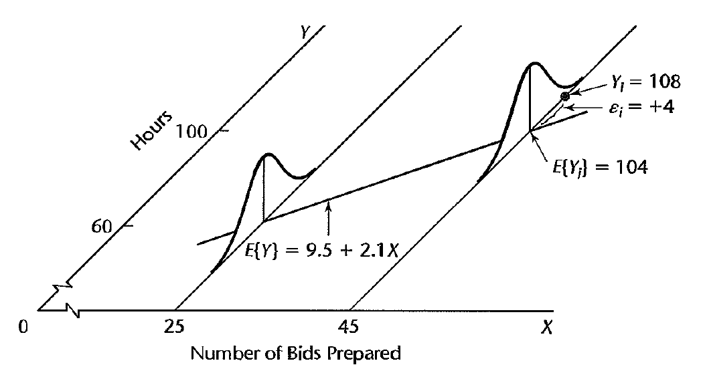
 Courtesy of: Kutner, M. et al. Applied Linear Statistical Models 5th Edition

<ul>  
  <li>Suppose we are studying the relationship between the number of bids requested by construction contractors for lighting equipment during a week and the time required to prepare the bids at a factory. </li>
  <li> Suppose that regression model discussed above is applicable and is given precisely as:

  $$Y_i = 9.5 + 2.1 X_i  + \epsilon_i$$

  where $X$ is the number of bids prepared in a week and $Y$ is the number of hours required to fulfill them.</li>
<li> In the figure to the left, we see the regression function parametrizing the mean of the the distributions for the total hours with respect to the number of bids.</li>
</ul>

<ul>
  <li>Suppose that in the $i$-th week, $X_i = 45$ bids are prepared and the actual number of hours required is $Y_i = 108$;</li>
  <li>then, the error term realization is $\epsilon_i = 4$, as
  
  $$\mathbb{E}\left[Y_i\right] = 9.5 + 2.1*(45) = 104$$
  
  so the variation in the signal resulted in an outcome that was 4 hours longer than the estimated mean.</li>  
  <li>This error term accounts for any number of possible deviations due to, e.g., weather, delivery delays, etc... that have been quantified with variance $\sigma^2$.</li>
</ul>

========================================================

<h2>Constructing a regression model</h2>

<ul>
  <li>Because we have assumed a form for $Y_i$ as a linear model,
  
  $$Y_i = \beta_0 + \beta_1 X_i +\epsilon_i$$
  
  we can develop theory for if/ when/ how we can identify this form accurately from the data.</li>
  <ul>
    <li> This reduces an infinite dimensional function space to a finite problem of estimating $\beta_0,\beta_1$ as well as possible.</li>
    <li> Even if the relationship is more complicated, a linear relationship might be a "good enough" approximation to capture the essential relationship.</li>
  </ul>
  <li>Furthermore, using the regression function, we can describe the distribution of future observations and predict future values.</li>
  <li>We can also determine "how well" the observed values of $X_i$ describe the observed values of the response $Y_i$ for explanations, possibly determining causality.</li>
  <li><b>However, the above depends on if and when the model assumptions hold</b>.</li>
  <ul>
    <li>There are many subtleties in selecting a "good" model in regression analysis, and determining "how well" our assumptions are satisfied.</li>
    <li>Even when it appears that we have a "good" model, we always need to weight it agains competing models that may be equally "good".</li>
  </ul>
</ul>

========================================================

<h3>Constructing a regression model -- continued</h3>

<ul>
  <li> In reality, the first step is usually selecting the appropriate variable(s) for the independent, explanatory variable(s).</li>
  <li> We typically have some response variable $Y$ we would like to study, but there can exist infinitely many variables to choose for $X$. </li>
  <li> For example, we may wish to study the incomes of graduates from US colleges and universities five years after graduation;</li>
  <li> in practice we need to choose variables for our regression analysis among the many possible variables, including but not limited to:</li>
  <ol>
    <li> major of study;</li>
    <li> grade point average;</li>
    <li> demographic information, such as age, gender, ethnic background, marriage and immigration status;</li>
    <li> previous years of work experience;</li>
    <li> years of study;</li>
    <li> income bracket of parents;</li>
    <li> etc...</li>
  </ol>
</ul>
  
========================================================

<h3>Constructing a regression model -- continued</h3>

* Selecting any of the previous variables should factor the extent to which a chosen variable contributes to reducing the remaining variation in the response.

  * We generally favor a regression function in one variable over another if the observed responses $Y_i$ adhere more tightly to the regression function of one over the other.
  
* However, this comparision should consider the contributions of other predictor variables, including possible variables we have not already included in our model.

  * Likewise, if we study a model with multiple predictors, we should consider if two or more of the variables are strongly correlated and if they contribute unique information to relationship or not.

========================================================

<h3>Constructing a regression model -- continued</h3>

* Other considerations include the importance of the variable as a causal agent in the process under analysis;

  * if the use of the model is to determine causality, we should construct several different models including and excluding respectively different possible causual variables.

* We may also consider the degree to which observations on the variable can be obtained more accurately, or quickly, or economically than on competing variables; 

* Ideally, we would also like variables that can be controlled as a "treatment" but this is not the case for all variables.

========================================================

<h3>Constructing a regression model -- continued</h3>

* Once we have selected the variables, it is also not automatically clear the functional form of the regression.

* For example, it is usually not known a priori:

 * what scale we should use for the response and the predictors (linear/ log/ square-root/ etc...); or
 
 * if we should combine one or more variables into a single variable (e.g., total years of work and education instead of work and education individually).
 
* Likewise, we need to specify the scope of the model in terms of what value we will regress upon;

  * this is often defined in terms of the range of values we have available for the predictors.
  
  * It is important to recognize this scope, for the danger of extrapolating the statistical relationship beyond where it is well understood.
 
* In the case of the college graduate incomes, it would be doubtful that we could predict incomes 10 years after graduation with our model if our data is limited to five years.

========================================================

<h3>Constructing a regression model -- an iterative process</h3>
 
 

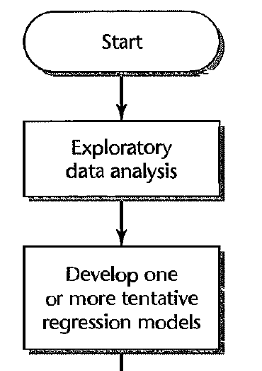
 Courtesy of: Kutner, M. et al. Applied Linear Statistical Models 5th Edition

<ul>
  <li>Regression analysis is thus an iterative process, which typically follows the flow on the left.</li>
  <li>We must clean the data and perform exploratory analysis to determine relationships between the response, possible predictors, and the between the predictors themselves.</li>
  <li>This exploratory analysis helps us to develop one or more possible regression models for the study.</li>
</ul>

========================================================

<h3>Constructing a regression model -- an iterative process</h3>
 
 

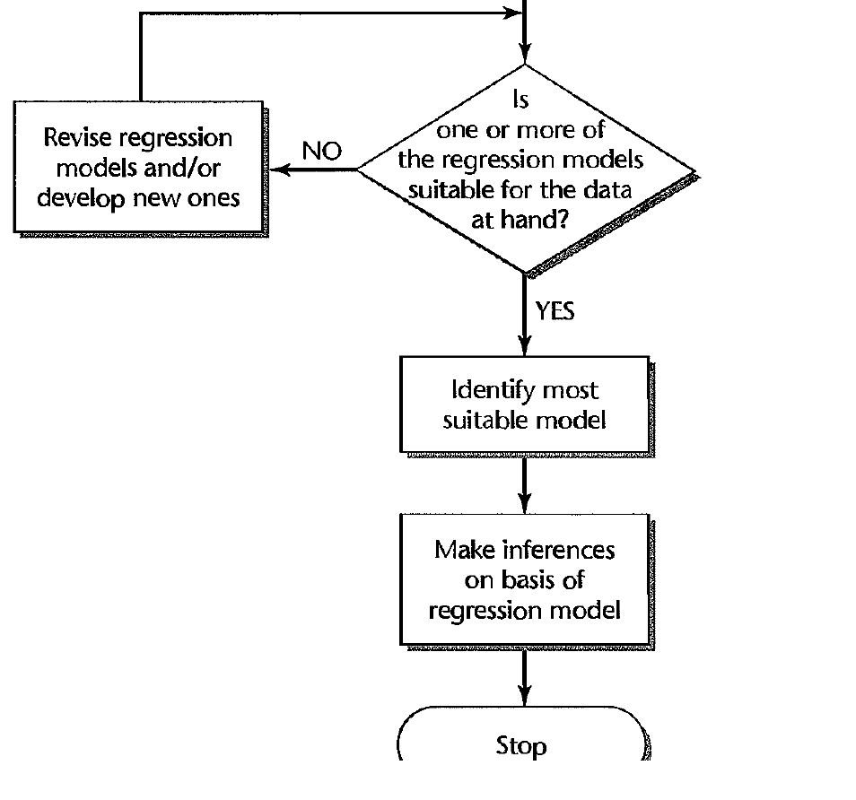
 Courtesy of: Kutner, M. et al. Applied Linear Statistical Models 5th Edition

<ul>
  <li> From the point of the last diagram, we can take our tenative models and evaluate if they are suitable for the problem and data.</li>
  <li> If not, we revise and repeat.</li>
  <li> If so, we compare the competing models for which one is most robust in our analysis --- particularly, if the model assumptions are well satisfied.</li>
  <li> If we are secure about the robustness of the model, having tested it in various ways, we can make inferences based on the model, such as predictions of future observations.</li>
  <ul>
    <li>Note, even when we feel quite confident in the model, it is key to <b>qualify our inferences by the uncertainty of the model</b>, e.g., providing confidence intervals.</li> 
  </ul>
  <li> The first part of this course will be focused on the situation in which assumptions are well satisfied and there exists a good linear signal in the data.</li>
  <li> The issues involved in the development of an appropriate regression model can be more easily explained with the understanding of what is a "good" regression model and how it is used.</li>
</ul>

