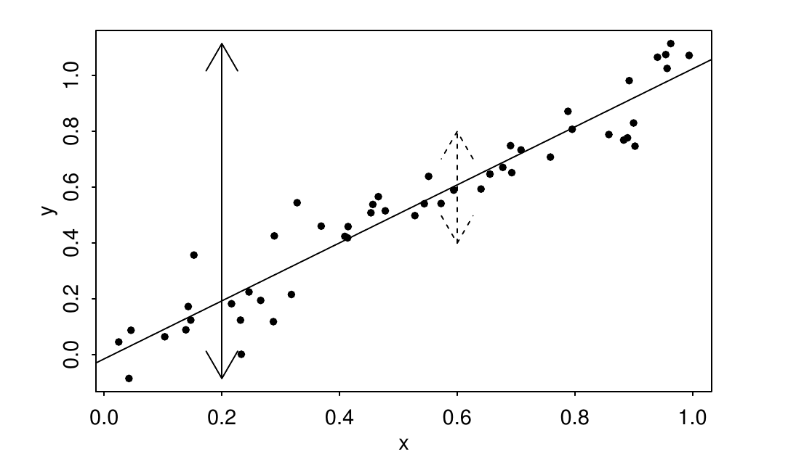
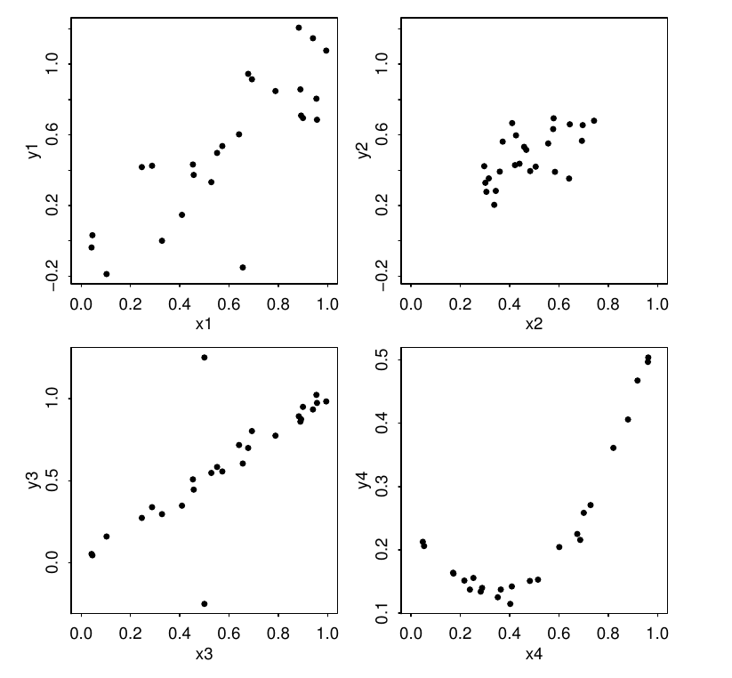

========================================================
autosize: true
incremental: true
width: 1920
height: 1080

<h1 style='color:black'> Simple linear regression -- part 5</h1>
<h2 style='color:black'> 09/17/2019</h2>
<h2 style='color:black'>Instructions:</h2>

Use the left and right arrow keys to navigate the presentation forward and backward respectively.  You can also use the arrows at the bottom right of the screen to navigate with a mouse. 

========================================================

<h2>Outline</h2>

* The following topics will be covered in this lecture:

  * Review of analysis of variance approach to regression
  * Degrees of Freedom
  * Mean squares and the ANOVA table
  * Matrix approach to simple regression

========================================================

<h2>Review -- Analysis of variance approach</h2>

<ul>
 <li>We have seen one approach now for regression analysis which will be the basic framework in which we consider these linear models.</li>
 <li>However, there are additional ways to approach the regression model, among which is known as Analys of Variance or ANOVA.</li>
 <li>This approach, which we will introduce in the following, seeks to partition the variation in the signal into different components for creating hypothesis tests.</li>
 <li>We will introduce the main concepts here, which will underpin a number of the techniques which we will introduce in full generality in multiple regression.</li>
</ul>

========================================================
<h3>Sums of squares </h3>

<ul>
  <li>We note, there are several forms of variation in our regression analysis.</li>
  <li>Among these is the variation of the response variable around its empirical mean,
  $$ Y_i - \overline{Y}$$</li>
  <li>Analogously to how we earlier defined the <b>residual sum of squares (RSS)</b> in terms of the squared-deviations of $Y_i$ from the regression-estimated mean response,
  $$RSS = \sum_{i=1}^n \hat{\epsilon}_i^2;$$</li>
  <li>we will define the <b>Total Sum of Squares (TSS)</b> in terms of the squared-deviations of $Y_i$ from the sample-based mean of the response:
  $$TSS\triangleq \sum_{i=1}^n \left( Y_i - \overline{Y}\right)^2.$$</li>
  </li>
  <li> While we can consider the TSS a measure of the total variation around the null model of random variation around the mean, we can also consider how much of this variation is "explained".</li>
  <li> Particularly, consider the quantity, the <b>Explained Sum of Squares (ESS)</b>
  $$ESS = \sum_{i=1}^n\left(\hat{Y}_i - \overline{Y}\right)^2;$$
  <li>This represents how much variation in the signal is explained by our regression model.</li>
</ul>

========================================================
<h3>Partitioning the errors </h3>

<ul>
  <li>To demonstrate the meaning of the ESS corresponding to a better performance, we consider the following partition of the variation in the response,
  $$\underbrace{Y_i - \overline{Y}}_{TSS} = \underbrace{\hat{Y}_i - \overline{Y}}_{ESS} +\underbrace{ Y_i - \hat{Y}_i}_{RSS},$$
  where we say each term loosely corresponds to the TSS, ESS, or RSS as above.</li>
  <li> By squaring the above equation and summing over all cases $i$, we found
  $$\begin{align}
  TSS&= ESS + RSS + 2\sum_{i=1}^n  \left(\hat{Y}_i - \overline{Y}\right)\left(Y_i - \hat{Y}_i \right).
  \end{align}$$
  <li>By demonstrating that the sum of cross terms vanished (as a consequence of the least squares solution), we showed that the decomposition was exact.</li>  
</ul>

========================================================
<h3>Partitioning the errors -- continued </h3>

<ul>
  <li>Particularly, we now have proven that,
  $$TSS = ESS + RSS.$$</li>
  <li> In this way, we see the tradeoff between the two terms in the $TSS$, particularly,
    <ol>
      <li>When the $RSS$ is large, this says:
      <ul>
        <li>the squared-distance between the fitted and the observed values, $RSS= \sum_{i=1}^n\hat{\epsilon}_i^2$, is large;</li>
        <li>particularly, the $ESS$ (explained variation) is small and the fit is close to the null model.</li>
      </ul>
      <li>When the $ESS$ is large, this says:</li>
      <ul>
        <li> the squared-distance between the fitted and the empirical mean, $ESS=\sum_{i=1}^n \left(\hat{Y}_i - \overline{Y}\right)^2$, is large;</li>
        <li> particularly, the $RSS$ is small, implying a close fit between the predicted and the observed values.</li>
      </ul>
    </ol>
</ul>

========================================================
<h2>Goodness of fit</h2>

<ul>
  <li>With the last discussion as a motivation, we can introduce our first metric for the "goodness of fit" of a regression model.</li>
  <li>A common choice to examine how well the regression model actually fits the data is called the "coefficient of determination" or "the percentage of variance explained".</li>
  <li>For short, we define,
  $$R^2 = 1 - \frac{\sum_{i=1}^n \left( Y_i - \hat{Y}_i\right)^2}{\sum_{i=1}^n \left(Y_i - \overline{Y}\right)^2} = 1 - \frac{RSS}{TSS}$$</li>
  <li><b>Exercise (2 minutes):</b> recalling the relationship $TSS = ESS + RSS$, derive an equivalent expression for the percentage of variance explained in terms of the $ESS$.</li>
  <li><b>Solution:</b> we note that $RSS=  TSS - ESS$, such that
  $$R^2 = 1 - \frac{RSS}{TSS} = 1 - \frac{TSS - ESS}{TSS} = \frac{ESS}{TSS}$$
  thus motivating the term, "percent of variance explained".</li>
  <li> Generally, we consider a model with $R^2$ close to one a "good" fit, and $R^2$ close to zero a bad fit.</li>
  <ul>
    <li><b>Note:</b> this metric has a number of flaws, which we will discuss further in the course.</li>
    <li>However, this metric is commonly used enough and is of great enough historical importance that we should understand it.</li>
  </ul>
</ul>

========================================================

<h3> A visual representation </h2>

Courtesy of: Faraway, J. Linear Models with R. 2nd Edition

<ul>
  <li> In the case of simple linear regression, we can visualize the meaning of $R^2$ directly in terms of the variation of the observations around the regression function.</li>
  <ul>
    <li> The solid arrow represents the variance of the data about the observed mean of the response.</li>
    <li> The dashed arrow represents the variance of the data about the least squares predicted mean response.</li>
    <li> $R^2$ is defined by one minus the ratio of these two variances.</li>
  </ul>
  <li> Intuitively, by the "picture-proof", we want the variation of the cases about the predicted mean response to be much smaller than the variation around the empirical mean.</li>
  </ul>

<ul>
  <li> This corresponds, intuitively, to the idea that the response varies tightly with respect to the regression function, and there is indeed structure to the signal.</li>
  <li> If we had a null model, where the response is flat with respect to the change in the predictor $X$, then the $RSS$ and the $TSS$ would be the same.</li>
</ul>

========================================================

<h3> Computing $R^2$ in the R language</h3>

<ul>
  <li>Our definition for $R^2$ is the same one used in the language R, so we emphasize this.</li>
  <ul>
    <li> However, this definition assumes that there is an intercept term for the model.</li>
  </ul>
  <li> If there is <b>no intercept term</b>, i.e., $\beta_0 = 0$, then $R^2$ is equal to the correlation of the fitted values with the observed values, squared:
  $$\begin{align}
  R^2 & = cor^2 \left(\hat{Y}, Y\right)
  \end{align}$$
  </li>
  <li>The value of $R^2$ should be computed from this definition if the model is fitted without intercept.</li>
  <li>If we don't take care to do it this way, the coefficient of determination will be misleadingly high.</li>
  <li><b>Note:</b> for this reason, we must take care about using the model summary command in the R language, when we have a model without intercept.</li>
  <li>We will return to this point in the coming weeks.</li>
</ul>

========================================================
<h3> What are "good" values of $R^2$?</h3>

<ul>
  <li>There is no universal "good" value for $R^2$ to attain in practice.</li>
  <li> For physics and engineering applications, data will be produced in tightly controlled experiments.</li>
  <ul>
    <li>Measurement noise will typically be low, and there are strong correlation and causality relationships in these settings.</li>
    <li> In that case, we expect $R^2$ to be close to one in order to say the fitted values model the observations well.</li>
  </ul>  
  <li> In the social sciences, there is much more variability, typically causal relationships are not well understood and correlations are weaker.</li>
  <ul>
    <li> In this case, we will typically expect a "good fit" to have a much lower $R^2$ score.</li>
  </ul>
</ul>

========================================================
<h3> Simulated examples of $R^2\approx.65$</h3>

Courtesy of: Faraway, J. Linear Models with R. 2nd Edition

<ul>
  <li>On the left, we see how different configurations of data can all result in the same $R^2$ score.</li>
  <ul>
    <li> <b>Upper left:</b> the plot is well-behaved for R2 -- there is a clear trend with some variation.</li>
    <li> <b> Upper right: </b> the residual variation is smaller than the first plot but the variation in the observations is also smaller, so the $R^2$ score is about the same.</li>
    <li> <b> Lower left: </b> the fit looks strong except for a couple of outliers, which lower the overall score. </li>
    <li> <b> Lower right: </b> the relationship is quadratic, leading to some irregularity in the fit with a straight line.</li>
  </ul>
</ul>

========================================================
<h2>Breakdown of degrees of freedom</h2>

<ul>
  <li>We have used the notion of the "degrees of freedom" loosely up to this point, and we want to formalize this analysis.</li>
  <li>The degrees of freedom refer to the number of values that are free to vary (the number of free parameters or independent variables) in the computation of some statistic.</li>
  <li>In particular, this can be considered geometrically for a set of of $n$ observations of the response, $\left\{Y_i\right\}_{i=1}^n$;</li>
  <ul>
    <li>If we identify the $n$ observations as an $n$-dimensional vector
    $$\mathbf{Y} = \begin{pmatrix} Y_1,& \cdots, &Y_n\end{pmatrix}^\mathrm{T} ,$$
    we say that as a random vector, it can attain a value in any subspace  of the $n$-dimensional space $\mathbb{R}^n$.</li>
    <li>Suppose we have the sample-based mean defined as before as $\overline{Y} = \frac{1}{n}\sum_{i=1}^n Y_i$.</li>
    <li>Then, we can re-write the random vector $\mathbf{Y}$  in terms of two objects, one which lives in $1$-dimensional space and one  which lives in $n-1$-dimensional space:
    $$\mathbf{Y} = \overline{Y} \begin{pmatrix}1 & \cdots & 1\end{pmatrix}^\mathrm{T} + \begin{pmatrix} Y_1 - \overline{Y} & \cdots & Y_n - \overline{Y}\end{pmatrix}^\mathrm{T}$$
    <li>The first quantity on the right-hand-side is constrained to live in the $1$-dimensional subspace that is spanned by the vector $\begin{pmatrix}1 & \cdots & 1\end{pmatrix}^\mathrm{T}$; here the only "free" parameter is the value of $\overline{Y}$.</li>
  </ul>
</ul>

========================================================
<h3>Breakdown of degrees of freedom -- continued</h3>

<ul>
  <li> Continuing our ananlysis:
 $$\mathbf{Y} = \overline{Y} \begin{pmatrix}1 & \cdots & 1\end{pmatrix}^\mathrm{T} + \begin{pmatrix} Y_1 - \overline{Y} & \cdots & Y_n - \overline{Y}\end{pmatrix}^\mathrm{T}$$</li>
  <ul>
    <li>The second quantity on the right-hand-side may appear have $n$-dimensions of possible values, but there is a constraint implied by the used degree of freedom:
    $$\sum_{i=1}^n \left(Y_i - \overline{Y}\right) =0,$$
    such that there are only $n-1$ degrees of freedom left over.</li>
    <li> Particularly, the second quantity (sometimes referred to as the anomalies) live in a $n-1$-dimensional subspace of the full $\mathbb{R}^n$ space.</li>
    </ul>
    <li>Therefore, when we compute the unbiased sample-based variance, the normalization by $n-1$ makes sense by the fact that the quantity
    $$\sum_{i=1}^n \left(Y_i - \overline{Y}\right)^2,$$
    has only $n-1$ degrees of freedom, or values that are not yet determined.</li>
  <li>This is analogous to the earlier lecture when we discussed the over constrained/ under constrained/ unique solution to finding a  line through data points in the plane.</li>
</ul>

========================================================
<h3>Breakdown of degrees of freedom -- continued</h3>

<ul>
  <li>In the case of estimating the regression function, we see similarly,
  $$\hat{Y} = \hat{\beta}_0 + \hat{\beta}_1 X$$
  we estimate two parameters as linear combinations of the observed cases $(X_i,Y_i)$.</li>
  <li>We consider the $Y_i$ to be the free values here, while the two normal equations provide two constraints to the estimated regression function.</li>
  <li> Correspondingly, as we introduce more parameters $p$ in the model, we will use more degrees of freedom, solving a system of equations for $p$ parameters;</li>
  <li> equivalently, we will put more constraints on the system until it becomes uniquely (or eventually over-) constrained, with $n-p$ degrees of freedom available to determine the regression function.</li>
  <li><b>Exercise (2 minutes):</b> discuss the following with a partner.  We said that the definition of the unbiased estimate for $\sigma^2$ generalizes to multiple regression, simply by increasing the number of $p$ parameters to account for the additional estimated quantities in our regression.</li>
  <li>Suppose $n=p$, what is our unbiased estimate of the variance $\sigma^2$?</li>
</ul>

========================================================
<h3>Breakdown of degrees of freedom -- continued</h3>

<ul>
  <li><b>Solution:</b> recall the definition,
  $$\hat{\sigma}^2 \triangleq \frac{RSS}{n-p},$$
  such that if $n-p=0$, the equation is undefined.</li>
    <li>Indeed, if $n-p=0$ this is a completely constrained system, with a unique value for the regression fuction --- this is actually a serious issue of overfitting, which we will return to later.</li>
    <li>Particularly, one issue we can see already is that we do not have a means of uncertainty quantification for our estimates.</li>
    <li>If $n-p<0$, we have an overconstrained or "super-saturated" model for which different techniques entirely are needed for the analysis.</li>
</ul>

========================================================
<h3>Degrees of freedom of TSS and RSS</h3>

<ul>
  <li>By the earlier discussion, we say that the TSS,
  $$TSS = \sum_{i=1}^n \left(Y_i - \overline{Y}\right)^2$$
  has $n-1$ degrees of freedom.</li>
  <ul>
    <li>This corresponds to the fact that there are $n$ values that the observations can attain, with one constraint from the sample-based mean.</li>
  </ul>
  <li>Similarly, we find that the RSS,
  $$\begin{align}
  RSS &= \sum_{i=1}^n \left( Y_i - \hat{Y}_i \right)^2\\
  &= \sum_{i=1}^n \left( Y_i - \hat{\beta}_0 - \hat{\beta}_1X_i \right)^2
  \end{align}$$
  has $n-p$ degrees of freedom $(p=2)$, because there are $p$ constraints on this relationship given any $n$ possible values that $Y_i$ attain.</li>
</ul>

========================================================
<h3>Degrees of freedom of ESS</h3>

<ul>
  <li>Let us derive the number of degrees of freedom of the explained sum of squares,
  $$ESS = \sum_{i=1}^n \left(\hat{Y}_i - \overline{Y}\right)^2$$
  </li>
  <li><b>Exercise (2 minutes):</b> we will use the property that the mean of the fitted values is equal to the mean of the observed values, i.e.,
  $$\frac{1}{n}\sum_{i=1}^n \hat{Y}_i = \overline{Y};$$
  using any of the properties we have proven already about the regression function, show why this is.</li>
  <li><b>Solution:</b> one useful property we have shown with the normal equations is that the sum of the residuals is zero, i.e.,
  $$\sum_{i=1}^n \hat{\epsilon}_i = 0.$$
  </li>
  <li> Therefore, we can consider that
  $$\overline{Y} =\frac{1}{n} \sum_{i=1}^n Y_i =  \frac{1}{n}\sum_{i=1}^n\left( \hat{Y}_i + \hat{\epsilon}_i\right) = \frac{1}{n}\sum_{i=1}^n \hat{Y}_i$$
</ul>

========================================================
<h3>Degrees of freedom of ESS -- continued</h3>

<ul>
  <li>Recalling the form for the explained sum of squares,
  $$\begin{align}
  ESS &= \sum_{i=1}^n \left(\hat{Y}_i - \overline{Y}\right)^2 \\
  &=\sum_{i=1}^n \left[\hat{\beta}_0 + \hat{\beta}_1X_i - \left(\frac{1}{n}\sum_{i=1}^n \hat{Y}_i \right) \right]^2 
  \end{align}$$
  where the above used the relationship we just proved.</li>
  </li>
  <li><b>Q:</b> in what way can we simplify the above expression?</li>
  <li><b>A:</b> one way is to substitute the definition of the fitted value $\hat{Y}_i$ once again and cancel terms,
  $$\begin{align}
  ESS &=\sum_{i=1}^n \left\{ \hat{\beta}_0 + \hat{\beta}_1X_i - \left[\frac{1}{n}\sum_{i=1}^n  \left(\hat{\beta}_0 + \hat{\beta}_1 X_i \right)\right] \right\}^2 \\
  &=\sum_{i=1}^n \left\{ \hat{\beta}_0 + \hat{\beta}_1X_i - \hat{\beta}_0 - \hat{\beta}_1 \overline{X}  \right\}^2\\
  &= \hat{\beta}_1^2 \sum_{i=1}^n \left(X_i - \overline{X}\right)^2
  \end{align}$$</li>
</ul>

========================================================
<h3>Degrees of freedom decomposition</h3>

<ul>
  <li>From the last derivation, we have that
  $$\begin{align}
  ESS &= \hat{\beta}_1^2 \sum_{i=1}^n \left(X_i - \overline{X}\right)^2
  \end{align}$$</li>
  <li>Although the the $ESS$ is computed from $n$ deviations, they are all derived from the same regression line.</li>
  <li>If we suppose the regression line is the free value in this case, it has two degrees of freedom described by its slope $\hat{\beta}_1$ and its intercept $\hat{\beta}_0$.</li>
  <li>However, as we saw earlier, we cancel the terms with the intercept such that $\hat{\beta}_1$ is the only degree of freedom (free parameter) in the $ESS$.</li>
  <li>Therefore, we say that the $ESS$ has one degree of freedom.</li>
  <li>An important consequence of this for the analysis of variance approach is that the degrees of freedom, like the total variation, are <b>additive</b>:,
  $$\underbrace{TSS}_{n-1} = \underbrace{ESS}_{p - 1} + \underbrace{RSS}_{n-p},$$
  where $p=2$ in simple regression.</li>
  <li> The above concept and the geometry likewise generalize to multiple regression, which we will come to shortly.</li>
</ul>

========================================================
<h3>Mean Squares</h3>

<ul>
  <li>A sum of squares, such as, the $TSS$, $ESS$ or $RSS$ when divided by its associated degrees of freedom is referred to as a mean square.</li>
  <li>Therefore, we will identify the following quantities:</li>
  <ol>
    <li>the regression mean square: $\frac{ESS}{p-1}$;</li>
    <li>the residual mean square error: $\frac{RSS}{n-p}$;</li>
  </ol>
  <li><b>Q:</b> we have mentioned once before that one of the above is an unbiased estimator --- can you recall what is the value of,
  $$\mathbb{E}\left[\frac{RSS}{n-p}\right]?$$</li>
  <li><b>A:</b> the residual mean square error, denoted $\hat{\sigma}^2$ is an unbaised estimator for $\sigma^2$; therefore,
  $$\mathbb{E}\left[\frac{RSS}{n-p}\right] = \sigma^2$$</li>
</ul>

========================================================
<h3>Mean Squares -- continued</h3>

<ul>
  <li>It can be shown that similarly, the regression mean square has an expectation,
  $$\mathbb{E}\left[\frac{ESS}{1} \right]= \sigma^2 + \beta_1^2 \sum_{i=1}^n \left(X_i - \overline{X}\right)^2$$
  </li>
  <ul>
    <li> Note, however, while the residual mean square error takes the form for higher dimensions, the above regression mean square does not.</li>
  </ul>
  <li><b>Exercise (2 minutes)</b> suppose $\beta_1\neq 0$, which is larger, the expected regression mean square or the expected residual mean square error?</li>
  <li><b>A:</b> provided all cases don't correspond to the same value $X_i$, the sum of squares $\sum_{i=1}^n\left(X_i - \overline{X}\right)^2$ is positive.</li>
  <li>Therefore, comparing the two values of the regression mean square and the residual mean square error provides some means to determine "how likely is it that $\beta_1=0$?"</li>
    <li>Particularly, the expected value of a mean square gives the mean around which the sample-based estimate will vary;</li>
    <ul>
      <li> if $\beta_1 \neq 0$, we expect the regression mean square to attain a value greater than the RSS.</li>
    </ul>
  <li>This type of comparison will underpin our hypothesis tests, which we will introduce shortly in multiple regression.</li>
</ul>

========================================================
<h3>The ANOVA table</h3>

<ul>
  <li> Collecting all the information we have developed so far in the analysis of variance framework, we arrive at the ANOVA table.</li>
  <ul>
    <li>A sample ANOVA table:
    <table>
      <tr><th>Source</th> <th>Degrees of freedom</th> <th>Sum of squares</th> <th>Mean square</th> <th> F-statistic</th></tr>
      <tr><td>Regression</td> <td>$p-1$</td> <td>$ESS$</td> <td>$\frac{ESS}{p-1}$</td> <td>$F$</td></tr>
      <tr><td>Residual</td> <td>$n-p$</td> <td>$RSS$</td> <td>$\frac{ESS}{n-p}$</td> <td></td></tr>
      <tr><td>Total</td> <td>$n-1$</td> <td>$TSS$</td> <td>$\frac{TSS}{1}$</td><td></td></tr>
    </table>
    </li>
  </ul>
  <li>The R language will provide an ANOVA table that arranges the information we have discussed, similarly to the above.</li>
  <ul>
    <li>The piece of data we haven't discussed so far is the one we have been alluding to --- the value of the F-statistic for hypothesis testing.</li>
  </ul>
  <li>It is not strictly necessary to compute all the elements of the table --- as the originator of the table, Fisher said in 1931, it is "nothing but a convenient way of arranging the arithmetic."</li>
  <li>When we introduce multiple regression, we will return to this table to interpret our results in terms of hypothesis testing versus the null model.</li>
</ul>

========================================================
<h2>A matrix approach to simple regression</h2>

<ul>
  <li>We have introduced now the basic framework that will underpin our regression analysis;</li>
  <li>most of the ideas encountered will generalize into higher dimensions (multiple predictors) without significant changes.</li>
  <li> Particularly, it will be convenient now to re-introduce our simple regression in terms of vectors and matrices.</li>
  <li> This will transition directly into the case where we have, rather than a line parametrizing the mean of the response, a hyper-plane.</li>
</ul>

========================================================
<h3>A review of random vectors</h3>
<ul>
  <li>We will consider again the vector of all observed cases,
  $$\mathbf{Y} = \begin{pmatrix} Y_1 , & \cdots, & Y_n \end{pmatrix}^\mathrm{T}.$$</li>
  <li>When we want to take the expectation of a random vector, we can do so component-wise;</li>
  <ul>
    <li> here, each component function is being integrated with respect to the random outcomes, such that,
    $$\begin{align}cov(\mathbf{Y}) \triangleq \mathbb{E}\left[ \mathbf{Y}\right] &= \begin{pmatrix} \mathbb{E}\left[Y_1\right], & \cdots, & \mathbb{E}\left[Y_n \right] \end{pmatrix}^\mathrm{T} \\
    & = \begin{pmatrix} \beta_0 + \beta_1 X_1 , & \cdots, & \beta_0 + \beta_1 X_n \end{pmatrix}^\mathrm{T}
    \end{align}$$</li>
  <li>Likewise, the component-wise definition of the expectation extends to random matrices.</li>
  </ul>
  <li>The covariance matrix is defined similarly to the variance of a scalar random variable, but in terms of a matrix product,
  $$\mathbb{E}\left\{ \left(\mathbf{Y} -\mathbb{E}\left[ \mathbf{Y} \right] \right) \left(\mathbf{Y} - \mathbb{E}\left[ \mathbf{Y} \right]\right)^\mathrm{T} \right\}.$$</li>
  <li><b>Exercise (2 minutes):</b> recall that the covariance of two scalar random variables $Y_1,Y_2$ is defined
  $$cov(Y_1, Y_2) = \sigma_{Y_1,Y_2} = \mathbb{E}\left[ \left( Y_1 - \mu_{Y_1} \right) \left(Y_2 - \mu_{Y_2}\right)\right]$$</li>
  <li>Suppose that the random vector $\mathbf{Y}$ is given as,
  $$\mathbf{Y} \triangleq \begin{pmatrix} Y_1, & Y_2, & Y_3 \end{pmatrix}^\mathrm{T};$$
  work with a partner to determine the entries of $cov(\mathbf{Y})$.  Is this the same as
  $$\mathbb{E}\left\{ \left(\mathbf{Y} -\mathbb{E}\left[ \mathbf{Y} \right] \right)^\mathrm{T} \left(\mathbf{Y} - \mathbb{E}\left[ \mathbf{Y} \right]\right) \right\}?$$
</ul>

========================================================
<h3>A review of random vectors -- continued</h3>

<ul>
  <li><b>Solution:</b> we note that the definition of the covariance is in terms of the outer product of the vectors, i.e., for a vector $\mathbf{X} = \begin{pmatrix} X_1, & X_2, & X_3\end{pmatrix}$ we have
  $$\begin{align}
  \mathbf{X}\mathbf{X}^\mathrm{T} = 
  \begin{pmatrix}
  X_1 * X_1 & X_1 * X_2 & X_1 * X_3  \\
  X_2 * X_1 & X_2 * X_2 & X_2 * X_3 \\
  X_3 * X_1 & X_3 * X_2 & X_3 * X_3 
  \end{pmatrix}.
  \end{align}$$
  </li>
  <li>Therefore, the $ij$-th entry of,
  $$ \left(\mathbf{Y} -\mathbb{E}\left[ \mathbf{Y} \right] \right) \left(\mathbf{Y} - \mathbb{E}\left[ \mathbf{Y} \right]\right)^\mathrm{T} , $$
  is precisely given by,
  $$ \left(Y_i - \mu_{Y_i}\right) \left(Y_j - \mu_{Y_j}\right).$$</li>
  <li>Following the definition of the expectation component-wise on the matrix,
  $$cov(\mathbf{Y}) = 
  \begin{pmatrix}
  \sigma_{1}^2 & \sigma_{12} & \sigma_{13} \\
  \sigma_{21} & \sigma_{2}^2 & \sigma_{23} \\
  \sigma_{31} & \sigma_{32}^2 & \sigma_{3}^2 
  \end{pmatrix}.$$</li>
</ul>

========================================================
<h3>A review of random vectors -- continued</h3>

<ul>
  <li>Comparatively, interchanging the transpose, we find,
  $$\mathbf{X}^\mathrm{T}\mathbf{X} = \sum_{i=1}^3 X_i^2,$$
  i.e., the standard inner product.
  </li>
  <li>If we compute,
  $$\begin{align}\mathbb{E}\left\{ \left(\mathbf{Y} -\mathbb{E}\left[ \mathbf{Y} \right] \right)^\mathrm{T} \left(\mathbf{Y} - \mathbb{E}\left[ \mathbf{Y} \right]\right) \right\} &= \mathbb{E}\left\{ \sum_{i=1}^3 \left(Y_i - \mu_{Y_i}\right)^2 \right\} \\
  &= \sum_{i=1}^3 \sigma^2_{i}.
  \end{align}$$</li>
  <li><b>Exercise (1 minute):</b> based on the previous exercise, if we take the assumptions of the Gauss-Markov theorem for the response variable $\mathbf{Y}$, what are the components of,
  $$cov(\mathbf{Y})?$$
  </li>
  <li><b>Solution:</b> this will be matrix with $\sigma^2$ on the diagonal (constant variance assumption) and zeros on the off-diagonal (uncorrelated assumption),
  $$cov(\mathbf{Y} ) = \begin{pmatrix} \sigma^2 & 0 & 0 \\ 0 & \sigma^2 & 0 \\ 0 & 0 & \sigma^2 \end{pmatrix}= \sigma^2 \mathbf{I};$$
  in the above $\mathbf{I}$ is the <b>identity matrix</b>.</li>
</ul>
  
========================================================
<h3>A review of random vectors -- continued</h3>

<ul>
  <li>Supoose that $\mathbf{A}$ is a constant matrix, $\mathbf{Y}$ is a random vector and $\mathbf{W} = \mathbf{A} \mathbf{Y}$ is a random vector by the identity.</li>
  <li>Finally, we will recall a few basic results to use throughout:</li>
  <ol>
    <li> $\mathbb{E}\left[ \mathbf{A}\right] = \mathbf{A}$;</li>
    <li> $\mathbb{E}\left[ \mathbf{W}\right] = \mathbf{A} \mathbb{E}\left[\mathbf{Y}\right]$ </li>
    <li> $cov(\mathbf{W}) = \mathbf{A} cov(\mathbf{Y})\mathbf{A}^\mathrm{T}$
  </ol>
  <li> The above results can all be found directly from the definition of the expectation being taken component-wise, and by the definition of matrix multiplication.</li>
  <ul>
    <li>Taking the right rearrangement of terms, we can find each identity, and we will not stress this algebra.</li>
  </ul>
</ul>

========================================================
<h3>Simple regression in matrices</h3>

<ul>
  <li>We recall again our usual regression model and assumptions, but we will frame this in terms of a system of matrix equations:
  $$\begin{align}
  Y_1 &= \beta_0 + \beta_1 X_1 + \epsilon_1 \\
  Y_2 &= \beta_0 + \beta_1 X_2 + \epsilon_2 \\
  \vdots & \\
  Y_n &= \beta_0 + \beta_1 X_n + \epsilon_n
  \end{align}$$</li>
  <li>We have several natural choices for vectors in this model, i.e.,
  $$\begin{align}
  \mathbf{Y}&\triangleq \begin{pmatrix} Y_1, & \cdots, & Y_n \end{pmatrix}^\mathrm{T};  & 
  \boldsymbol{\epsilon}& \triangleq \begin{pmatrix} \epsilon_1, & \cdots, & \epsilon_n \end{pmatrix}^\mathrm{T} ;\\
  \boldsymbol{\beta}& \triangleq \begin{pmatrix} \beta_1, & \cdots, & \beta_n \end{pmatrix}^\mathrm{T}.
  \end{align}$$
  <li>Suppose we define an extended matrix for the explantory variable $X$, which will include the intercept term,
  $$\mathbf{X} \triangleq \begin{pmatrix} X_1 & X_2 & \cdots & X_n \\ 1 & 1 & \cdots & 1 \end{pmatrix}^\mathrm{T},$$</li>
  <li>
  then by the definition of matrix multiplication, we recover
  $$\mathbf{Y} = \mathbf{X} \boldsymbol{\beta} + \boldsymbol{\epsilon}.$$</li>
</ul>

========================================================
<h3>Regression in matrices</h3>
<ul>
  <li>Our general formula for a linear model will thus be of the form,
  $$\mathbf{Y} = \mathbf{X} \boldsymbol{\beta} + \boldsymbol{\epsilon}.$$</li>
  <li><b>Q:</b> how do we state our usual assumptions in matrix form?</li>
  <li><b>A:</b> we can write the following:</li>
  <ol>
    <li> $\mathbb{E}\left[\boldsymbol{\epsilon}\right] = \boldsymbol{0}$;</li>
    <li> $cov(\epsilon) = \sigma^2 \mathbf{I}$.</li>
  </ol>
  <li> In general, we will now assume that $\mathbf{X} \in \mathbb{R}^{n\times p}$ where $p$ is equal to the number of the <b>parameters</b> in the model.</li>
  <ul>
    <li>Whenever, the model contains an intercept $\beta_0$, $p$ equals the number of explanatory variables <b>plus one</b>.</li>
    <li>In the case where we exclude an intercept, $\beta_0 = 0$, $p$ equals the number of explanatory variables.</li>
  </ul>
</ul>

========================================================
<h3>Normal equations in matrices</h3>

<ul>
  <li>The normal equations likewise have a matrix form, for which the geometric meaning will come out more clearly.</li>
  <li> Particularly, we consider if we wish the minimize the objective function,
  $$\begin{align}
  J \left( \overline{\boldsymbol{\beta}} \right) &= \left(\mathbf{Y} - \mathbf{X}\overline{\boldsymbol{\beta}}\right)^\mathrm{T} \left(\mathbf{Y} - \mathbf{X}\overline{\boldsymbol{\beta}}\right),
  \end{align}$$
  in the free parameters $\overline{\boldsymbol{\beta}}$,</li>
  <li>we see that the least squares solution $\hat{\boldsymbol{\beta}}$ minimizes the (squared) Euclidean norm of the residuals,
  $$J\left(\hat{\boldsymbol{\beta}}\right) = \hat{\boldsymbol{\epsilon}}^\mathrm{T} \hat{\boldsymbol{\epsilon}}.$$
  </li>
  <li>Consider that the vector of fitted values is defined as,
  $$\hat{\mathbf{Y}} = \mathbf{X} \hat{\boldsymbol{\beta}};$$</li>
  <li>This says that the predicted values of $Y$ are in the <b>subspace spanned by the columns of the explanatory variables</b>.</li>
</ul>

========================================================
<h3>Normal equations in matrices -- continued</h3>

<ul>
  <li>We consider, thus, differentiating the objective function and setting to zero, $\hat{\boldsymbol{\beta}}$ satisfies,
  $$\mathbf{X}^\mathrm{T}\mathbf{X} \hat{\boldsymbol{\beta}} = \mathbf{X}^\mathrm{T} \mathbf{Y}.$$</li>
  <li>let's assume for the moment that $\mathbf{X}^\mathrm{T}\mathbf{X}$ is invertible;</li>
  <li>In this case, we find,
  $$\hat{\boldsymbol{\beta}} = \left(\mathbf{X}^\mathrm{T}\mathbf{X}\right)^{-1}  \mathbf{X}^\mathrm{T} \mathbf{Y}.$$</li>
  <li><b>Exercise (2 minutes):</b> discuss with a partner, if we suppose that $\mathbf{X}$ is invertible, what does this tell us about the predicted values $\hat{\mathbf{Y}}$?</li>
  <li><b>Solution:</b> if $\mathbf{X}^{-1}$ exists, then we find
  $$\begin{align}
  \hat{\mathbf{Y}} &= \mathbf{X} \hat{\boldsymbol{\beta}} \\
   &= \mathbf{X}\left(\mathbf{X}^\mathrm{T}\mathbf{X}\right)^{-1}  \mathbf{X}^\mathrm{T} \mathbf{Y} \\
   & = \mathbf{X} \mathbf{X}^{-1} \mathbf{X}^{-\mathrm{T}} \mathbf{X}^{\mathrm{T}} \mathbf{Y}\\
   &= \mathbf{Y}.
  \end{align}$$</li>
  <li><b>Q:</b> under what conditions can we suppose that $\mathbf{X}^{-1}$ exists?</li>
  <li><b>A:</b> the matrix $\mathbf{X}$ must have linearly independent columns and be square, i.e., $n=p$.</li>
  <li>Therefore, if we increase our parameters to $p=n$, we can find a unique solution by fitting the regression function to every case.</li>
  <li>Recall, when $n=p$ we also said we have no degrees of freedom to estimate our uncertainty --- this is part of what is meant by "overfitting" the data;</li>
  <ul>
    <li> particularly, we will create a regression function for which we cannot estimate the uncertainty and, almost surely, won't generalize well to cases outside of the data at hand.</li>
  </ul>
</ul>

========================================================
<h3>Normal equations in matrices -- continued</h3>

Courtesy of: Faraway, J. Linear Models with R. 2nd Edition

<ul>
  <li> Let's suppose that $p$ is strictly less than $n$ such that $\mathbf{X}^{-1}$ does not exist.</li>
  <li><b>Q:</b> what is the vector of fitted values $\mathbf{Y}$ that looks most like the vector $\mathbf{Y}$, yet is confined to the span of $\mathbf{X}$? </li>
  <li><b>A:</b> geometrically, we should reason that $\hat{\mathbf{Y}}$ should be the <b>orthogonal projection</b> of $\mathbf{Y}$ into the span of $\mathbf{X}$.</li>
  <li>Indeed, for the least squares solution $\hat{\beta}$,
  $$\hat{\mathbf{Y}} =  \mathbf{X} \hat{\boldsymbol{\beta}} = \mathbf{X}\left(\mathbf{X}^\mathrm{T}\mathbf{X}\right)^{-1}  \mathbf{X}^\mathrm{T} \mathbf{Y} = \mathbf{H} \mathbf{Y},$$
  the matrix 
  $$\mathbf{H}\triangleq \mathbf{X}\left(\mathbf{X}^\mathrm{T}\mathbf{X}\right)^{-1}  \mathbf{X}^\mathrm{T},$$
  which we denote the "hat" matrix, is precisely the orthogonal projection operator.</li>
</ul>

<ul>
  <li>Indeed, taking the fitted value as the orthogonal projection minimizes the (squared) Euclidean norm of the residual,
  $$RSS = \hat{\boldsymbol{\epsilon}}^\mathrm{T}\hat{\boldsymbol{\epsilon}},$$
  as this is naturally the shortest path.</li>
</ul>

========================================================
<h3>Remarks on the hat matrix</h3>

Courtesy of: Faraway, J. Linear Models with R. 2nd Edition

<ul>
  <li>We note that the hat matrix is formed by multiplying $\mathbf{X}$ on the left of the estimated parameters $\hat{\boldsymbol{\beta}}$.</li>
  <li>Particularly, we see that $\hat{\boldsymbol{\beta}} \in \mathbb{R}^{p}$, such that multiplication takes
  $$\begin{align}
    &\mathbb{R}^{p}&  & \mathbb{R}^n \\
  \mathbf{X}: &\hat{\boldsymbol{\beta}} & \mapsto & \hat{\mathbf{Y}}
  \end{align},$$</li>
  <li>while on the other hand, left multiplication of $\mathbf{Y}$ by the matrix $\left(\mathbf{X}^\mathrm{T}\mathbf{X}\right)^{-1}\mathbf{X}^\mathrm{T}$ has the effect
  $$\begin{align}
    &\mathbb{R}^{n}&  & \mathbb{R}^p \\
  \left(\mathbf{X}^\mathrm{T}\mathbf{X}\right)^{-1}\mathbf{X}^\mathrm{T}: &\mathbf{Y} & \mapsto & \hat{\boldsymbol{\beta}}
  \end{align}.$$</li>
  </ul>

<ul>
  <li>The matrix $\left(\mathbf{X}^\mathrm{T}\mathbf{X}\right)^{-1}\mathbf{X}^\mathrm{T}$ is known as the (left) pseudo-inverse of $\mathbf{X}$.</li>
  <li>This operation has the effect of transferring $\mathbf{Y}$ into its projected representation in the <b>invariant coordinates</b> for the space defined by $\mathbf{X}$.</li>
  <li> Multiplying again by $\mathbf{X}$ gives the representation of this coordinate system back in the full space, where $span(\mathbf{X})$ is embedded.</li> 
  <li>Pseudo-inverses are extremely powerful tools to use in general, and come out frequently in advanced mathematical and statistical tools.</li>
  <ul>
    <li>We remark here, that a deep discussion of pseudo-inverses goes beyond the focus of the course, but this should be of great interest to advanced students and curious readers.</li>
  </ul>
</ul>

========================================================
<h3>Remarks on the residuals</h3>

<ul>
  <li>In matrix form, we now have another interpretation for the residuals,
  $$\begin{align}
  \hat{\boldsymbol{\epsilon}} &= \mathbf{Y} - \hat{\mathbf{Y}} \\
  &  = \mathbf{Y} - \mathbf{H} \mathbf{Y} \\
  &  = \left( \mathbf{I} - \mathbf{H}\right) \mathbf{Y}.
  \end{align}$$</li>
  <li>We can interpret the projection operator into the $span(\mathbf{X})$ as the map which projects an arbitrary vector $\mathbf{V}$ into the subspace defined by$span(\mathbf{X})$, leaving only the components which reside there from the orginal vector.</li>
  <li><b>Q:</b> what is the effect thus of the operator $\left(\mathbf{I}- \mathbf{H}\right)$?</li>
  <li><b>A:</b> the identity operator maps $\mathbf{V}$ to itself, and thus the difference of $\left(\mathbf{I}- \mathbf{H}\right)$ leaves only the components that are orthogonal to the subspace $span(\mathbf{X})$.</li>
  <li>Therefore, $\left(\mathbf{I}- \mathbf{H}\right)$ is the orthogonal projection operator to $span(\mathbf{X})$.</li>
</ul>

========================================================
<h3>Remarks on the residuals -- continued</h3>

<ul>
  <li>The new interpretation to the residuals sheds some light on the properties we have previously explored.</li>
  <li><b>Exercise (2 minutes):</b> we have shown in the homework now, the following properties:</li>
  <ol>
    <li>$\sum_{i=1}^n \hat{\epsilon}_i X_i = \hat{\boldsymbol{\epsilon}}^\mathrm{T}\mathbf{X}^{2} = 0$, where $\mathbf{X}^{2}$ denotes the second column of the matrix $\mathbf{X}$.</li>
    <li>$\sum_{i=1}^n \hat{\epsilon}_i \hat{Y}_i = \hat{\boldsymbol{\epsilon}}\hat{\mathbf{Y}}= 0$</li>
  </ol>
  <li> Discuss with a partner the new geometric meaning of these statements.</li>
  <li><b>Solution:</b> we know that by construction $\hat{\boldsymbol{\epsilon}}$ is orthogonal to $span(\mathbf{X})$.</li>
  <li>Thus, the two statements are direct consequences of the orthogonality.</li>
</ul>

========================================================
<h3>Remarks on the residuals -- continued</h3>

<ul>
  <li>We also have a new interpretation for the $RSS$ given our matrix form of the equation,
  $$\begin{align}
  RSS &= \hat{\boldsymbol{\epsilon}}^\mathrm{T} \hat{\boldsymbol{\epsilon}} \\
   & = \left[ \left(\mathbf{I} - \mathbf{H}\right) \mathbf{Y}\right]^\mathrm{T} \left(\mathbf{I} - \mathbf{H}\right) \mathbf{Y} \\
   & =\mathbf{Y}^\mathrm{T} \left(\mathbf{I} - \mathbf{H}\right) \left(\mathbf{I} - \mathbf{H}\right) \mathbf{Y} \\
   &=\mathbf{Y}^\mathrm{T} \left(\mathbf{I} - \mathbf{H}\right) \mathbf{Y},
  \end{align}$$
  due to the properties of symmetry and idempotence.</li>
  <li>Specifically, $\left(\mathbf{I} - \mathbf{H}\right)$ can be shown to be a symmetric matrix, i.e., $\left(\mathbf{I} - \mathbf{H}\right)^\mathrm{T} = \left(\mathbf{I} - \mathbf{H}\right)$.</li>
  <li>Likewise, any projection operator can also be shown to be idempotent, i.e,
  $$\mathbf{P}^2 = \mathbf{P}.$$</li>
  <li>Taken together, we can also interpret the $RSS$ as a weighted norm for the observation vector $\mathbf{Y}$.</li>
</ul>
