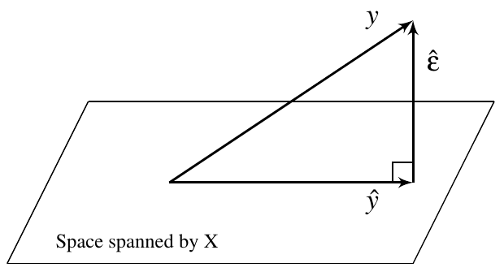

========================================================
autosize: true
incremental: true
width: 1920
height: 1080

<div style="background-color: white; padding:40px">
<h1 style='color:black'> Simple linear regression in matrices and multiple regression</h1>
<h2 style='color:black'> 09/19/2019</h2>
<h2 style='color:black'>Instructions:</h2>
<p style='color:black'>Use the left and right arrow keys to navigate the presentation forward and backward respectively.  You can also use the arrows at the bottom right of the screen to navigate with a mouse.<br></p>
</div>

========================================================

<h2>Outline</h2>

* The following topics will be covered in this lecture:
  * A review of random vectors and matrices
  * Matrix approach to simple regression
  * A geometric interpretation of regression
  * Moving into multiple regression


========================================================
<h2>A matrix approach to simple regression</h2>

<ul>
  <li>We have introduced now the basic framework that will underpin our regression analysis;</li>
  <li>most of the ideas encountered will generalize into higher dimensions (multiple predictors) without significant changes.</li>
  <li> Particularly, it will be convenient now to re-introduce our simple regression in terms of vectors and matrices.</li>
  <li> This will transition directly into the case where we have, rather than a line parametrizing the mean of the response, a hyper-plane.</li>
</ul>

========================================================
<h3>A review of random vectors</h3>
<ul>
  <li>We will consider again the vector of all observed cases,
  $$\mathbf{Y} = \begin{pmatrix} Y_1 , & \cdots, & Y_n \end{pmatrix}^\mathrm{T}.$$</li>
  <li>When we want to take the expectation of a random vector, we can do so component-wise;</li>
  <ul>
    <li> here, each component function is being integrated with respect to the random outcomes, such that,
    $$\begin{align}\mathbb{E}\left[ \mathbf{Y}\right] &\triangleq \begin{pmatrix} \mathbb{E}\left[Y_1\right], & \cdots, & \mathbb{E}\left[Y_n \right] \end{pmatrix}^\mathrm{T} \\
    & = \begin{pmatrix} \beta_0 + \beta_1 X_1 , & \cdots, & \beta_0 + \beta_1 X_n \end{pmatrix}^\mathrm{T}
    \end{align}$$</li>
  <li>Likewise, the component-wise definition of the expectation extends to random matrices.</li>
  </ul>
  <li>The covariance matrix is defined similarly to the variance of a scalar random variable, but in terms of a matrix product,
  $$cov(\mathbf{Y}) \triangleq \mathbb{E}\left\{ \left(\mathbf{Y} -\mathbb{E}\left[ \mathbf{Y} \right] \right) \left(\mathbf{Y} - \mathbb{E}\left[ \mathbf{Y} \right]\right)^\mathrm{T} \right\}.$$</li>
  <li><b>Exercise (2 minutes):</b> recall that the covariance of two scalar random variables $Y_1,Y_2$ is defined
  $$cov(Y_1, Y_2) = \sigma_{Y_1,Y_2} = \mathbb{E}\left[ \left( Y_1 - \mu_{Y_1} \right) \left(Y_2 - \mu_{Y_2}\right)\right]$$</li>
  <li>Suppose that the random vector $\mathbf{Y}$ is given as,
  $$\mathbf{Y} \triangleq \begin{pmatrix} Y_1, & Y_2, & Y_3 \end{pmatrix}^\mathrm{T};$$
  work with a partner to determine the entries of $cov(\mathbf{Y})$.  Is this the same as
  $$\mathbb{E}\left\{ \left(\mathbf{Y} -\mathbb{E}\left[ \mathbf{Y} \right] \right)^\mathrm{T} \left(\mathbf{Y} - \mathbb{E}\left[ \mathbf{Y} \right]\right) \right\}?$$
</ul>

========================================================
<h3>A review of random vectors -- continued</h3>

<ul>
  <li><b>Solution:</b> we note that the definition of the covariance is in terms of the outer product of the vectors, i.e., for a vector $\mathbf{X} = \begin{pmatrix} X_1, & X_2, & X_3\end{pmatrix}$ we have
  $$\begin{align}
  \mathbf{X}\mathbf{X}^\mathrm{T} = 
  \begin{pmatrix}
  X_1 * X_1 & X_1 * X_2 & X_1 * X_3  \\
  X_2 * X_1 & X_2 * X_2 & X_2 * X_3 \\
  X_3 * X_1 & X_3 * X_2 & X_3 * X_3 
  \end{pmatrix}.
  \end{align}$$
  </li>
  <li>Therefore, the $ij$-th entry of,
  $$ \left(\mathbf{Y} -\mathbb{E}\left[ \mathbf{Y} \right] \right) \left(\mathbf{Y} - \mathbb{E}\left[ \mathbf{Y} \right]\right)^\mathrm{T} , $$
  is precisely given by,
  $$ \left(Y_i - \mu_{Y_i}\right) \left(Y_j - \mu_{Y_j}\right).$$</li>
  <li>Following the definition of the expectation component-wise on the matrix,
  $$cov(\mathbf{Y}) = 
  \begin{pmatrix}
  \sigma_{1}^2 & \sigma_{12} & \sigma_{13} \\
  \sigma_{21} & \sigma_{2}^2 & \sigma_{23} \\
  \sigma_{31} & \sigma_{32}^2 & \sigma_{3}^2 
  \end{pmatrix}.$$</li>
</ul>

========================================================
<h3>A review of random vectors -- continued</h3>

<ul>
  <li>Comparatively, interchanging the transpose, we find,
  $$\mathbf{X}^\mathrm{T}\mathbf{X} = \sum_{i=1}^3 X_i^2,$$
  i.e., the standard inner product.
  </li>
  <li>If we compute,
  $$\begin{align}\mathbb{E}\left\{ \left(\mathbf{Y} -\mathbb{E}\left[ \mathbf{Y} \right] \right)^\mathrm{T} \left(\mathbf{Y} - \mathbb{E}\left[ \mathbf{Y} \right]\right) \right\} &= \mathbb{E}\left\{ \sum_{i=1}^3 \left(Y_i - \mu_{Y_i}\right)^2 \right\} \\
  &= \sum_{i=1}^3 \sigma^2_{i}.
  \end{align}$$</li>
  <li><b>Exercise (1 minute):</b> based on the previous exercise, if we take the assumptions of the Gauss-Markov theorem for the response variable $\mathbf{Y}$, what are the components of,
  $$cov(\mathbf{Y})?$$
  </li>
  <li><b>Solution:</b> this will be matrix with $\sigma^2$ on the diagonal (constant variance assumption) and zeros on the off-diagonal (uncorrelated assumption),
  $$cov(\mathbf{Y} ) = \begin{pmatrix} \sigma^2 & 0 & 0 \\ 0 & \sigma^2 & 0 \\ 0 & 0 & \sigma^2 \end{pmatrix}= \sigma^2 \mathbf{I};$$
  in the above $\mathbf{I}$ is the <b>identity matrix</b>.</li>
</ul>
  
========================================================
<h3>A review of random vectors -- continued</h3>

<ul>
  <li>Supoose that $\mathbf{A}$ is a constant matrix, $\mathbf{Y}$ is a random vector and $\mathbf{W} = \mathbf{A} \mathbf{Y}$ is a random vector by the identity.</li>
  <li>We will recall a few basic results to use throughout:</li>
  <ol>
    <li> $\mathbb{E}\left[ \mathbf{A}\right] = \mathbf{A}$;</li>
    <li> $\mathbb{E}\left[ \mathbf{W}\right] = \mathbf{A} \mathbb{E}\left[\mathbf{Y}\right]$ </li>
    <li> $cov(\mathbf{W}) = \mathbf{A} cov(\mathbf{Y})\mathbf{A}^\mathrm{T}$
  </ol>
  <li> The above results can all be found directly from the definition of the expectation being taken component-wise, and by the definition of matrix multiplication.</li>
  <ul>
    <li>Taking the right rearrangement of terms, we can find each identity, and we will not stress this algebra.</li>
  </ul>
</ul>

========================================================
<h3>Simple regression in matrices</h3>

<ul>
  <li>We recall again our usual regression model and assumptions, but we will frame this in terms of a system of matrix equations:
  $$\begin{align}
  Y_1 &= \beta_0 + \beta_1 X_1 + \epsilon_1 \\
  Y_2 &= \beta_0 + \beta_1 X_2 + \epsilon_2 \\
  \vdots & \\
  Y_n &= \beta_0 + \beta_1 X_n + \epsilon_n
  \end{align}$$</li>
  <li>We have several natural choices for vectors in this model, i.e.,
  $$\begin{align}
  \mathbf{Y}&\triangleq \begin{pmatrix} Y_1, & \cdots, & Y_n \end{pmatrix}^\mathrm{T};  & 
  \boldsymbol{\epsilon}& \triangleq \begin{pmatrix} \epsilon_1, & \cdots, & \epsilon_n \end{pmatrix}^\mathrm{T} ;\\
  \boldsymbol{\beta}& \triangleq \begin{pmatrix} \beta_0, & \beta_1  \end{pmatrix}^\mathrm{T}.
  \end{align}$$
  <li>Suppose we define an extended matrix for the explantory variable $X$, which will include the intercept term,
  $$\mathbf{X} \triangleq \begin{pmatrix} X_1 & X_2 & \cdots & X_n \\ 1 & 1 & \cdots & 1 \end{pmatrix}^\mathrm{T};$$</li>
  <li>This extended matrix will be called the <b>design matrix</b>.</li>
  <li>
  Then by the definition of matrix multiplication, we recover
  $$\mathbf{Y} = \mathbf{X} \boldsymbol{\beta} + \boldsymbol{\epsilon}.$$</li>
</ul>

========================================================
<h3>Regression in matrices</h3>
<ul>
  <li>Our general formula for a linear model will thus be of the form,
  $$\mathbf{Y} = \mathbf{X} \boldsymbol{\beta} + \boldsymbol{\epsilon}.$$</li>
  <li><b>Q:</b> how do we state our usual assumptions in matrix form?</li>
  <li><b>A:</b> we can write the following:</li>
  <ol>
    <li> $\mathbb{E}\left[\boldsymbol{\epsilon}\right] = \boldsymbol{0}$;</li>
    <li> $cov(\boldsymbol{\epsilon}) = \sigma^2 \mathbf{I}$.</li>
  </ol>
  <li> In general, we will now assume that $\mathbf{X} \in \mathbb{R}^{n\times p}$ where $p$ is equal to the number of the <b>parameters</b> in the model.</li>
  <ul>
    <li>Whenever, the model contains an intercept $\beta_0$, $p$ equals the number of explanatory variables <b>plus one</b>.</li>
    <li>In the case where we exclude an intercept, $\beta_0 = 0$, $p$ equals the number of explanatory variables.</li>
  </ul>
</ul>

========================================================
<h3>Normal equations in matrices</h3>

<ul>
  <li>The normal equations likewise have a matrix form, for which the geometric meaning will come out more clearly.</li>
  <li> Particularly, we consider if we wish the minimize the objective function,
  $$\begin{align}
  J \left( \overline{\boldsymbol{\beta}} \right) &= \left(\mathbf{Y} - \mathbf{X}\overline{\boldsymbol{\beta}}\right)^\mathrm{T} \left(\mathbf{Y} - \mathbf{X}\overline{\boldsymbol{\beta}}\right),
  \end{align}$$
  in the free parameters $\overline{\boldsymbol{\beta}}$,</li>
  <li>we see that the least squares solution $\hat{\boldsymbol{\beta}}$ minimizes the (squared) Euclidean norm of the residuals,
  $$J\left(\hat{\boldsymbol{\beta}}\right) = \hat{\boldsymbol{\epsilon}}^\mathrm{T} \hat{\boldsymbol{\epsilon}}.$$
  </li>
  <li>Consider that the vector of fitted values is defined as,
  $$\hat{\mathbf{Y}} = \mathbf{X} \hat{\boldsymbol{\beta}};$$</li>
  <li>This says that the predicted values of $Y$ are in the <b>subspace spanned by the columns of the explanatory variables</b>.</li>
</ul>


========================================================
<h3>Normal equations in matrices -- continued</h3>

<ul>
  <li>We consider, thus, differentiating the objective function and setting to zero, $\hat{\boldsymbol{\beta}}$ satisfies,
  $$\mathbf{X}^\mathrm{T}\mathbf{X} \hat{\boldsymbol{\beta}} = \mathbf{X}^\mathrm{T} \mathbf{Y}.$$</li>
  <li>let's assume for the moment that $\mathbf{X}^\mathrm{T}\mathbf{X}$ is invertible;</li>
  <li>In this case, we find,
  $$\hat{\boldsymbol{\beta}} = \left(\mathbf{X}^\mathrm{T}\mathbf{X}\right)^{-1}  \mathbf{X}^\mathrm{T} \mathbf{Y}.$$</li>
  <li><b>Exercise (2 minutes):</b> discuss with a partner, if we suppose that $\mathbf{X}$ is invertible, what does this tell us about the predicted values $\hat{\mathbf{Y}}$?</li>
  <li><b>Solution:</b> if $\mathbf{X}^{-1}$ exists, then we find
  $$\begin{align}
  \hat{\mathbf{Y}} &= \mathbf{X} \hat{\boldsymbol{\beta}} \\
   &= \mathbf{X}\left(\mathbf{X}^\mathrm{T}\mathbf{X}\right)^{-1}  \mathbf{X}^\mathrm{T} \mathbf{Y} \\
   & = \mathbf{X} \mathbf{X}^{-1} \mathbf{X}^{-\mathrm{T}} \mathbf{X}^{\mathrm{T}} \mathbf{Y}\\
   &= \mathbf{Y}.
  \end{align}$$</li>
  <li><b>Q:</b> under what conditions can we suppose that $\mathbf{X}^{-1}$ exists?</li>
  <li><b>A:</b> the matrix $\mathbf{X}$ must have linearly independent columns and be square, i.e., $n=p$.</li>
  <li>Therefore, if we increase our parameters to $p=n$, we can find a solution by fitting the regression function to every case.</li>
  <li>Recall, when $n=p$ we also said we have no degrees of freedom to estimate our uncertainty --- this is part of what is meant by "overfitting" the data;</li>
  <ul>
    <li> particularly, we will create a regression function for which we cannot estimate the uncertainty and, almost surely, won't generalize well to cases outside of the data at hand.</li>
  </ul>
</ul>

========================================================
<h3>Normal equations in matrices -- continued</h3>

<div style="float:left; width:50%">

<p style="text-align:center">Courtesy of: Faraway, J. Linear Models with R. 2nd Edition</p>
</div>

<div style="float:left; width:50%">
<ul>
  <li> Let's suppose that $p$ is strictly less than $n$ such that $\mathbf{X}^{-1}$ does not exist.</li>
  <li><b>Q:</b> what is the vector of fitted values $\mathbf{Y}$ that looks most like the vector $\mathbf{Y}$, yet is confined to the span of $\mathbf{X}$? </li>
  <li><b>A:</b> geometrically, we should reason that $\hat{\mathbf{Y}}$ should be the <b>orthogonal projection</b> of $\mathbf{Y}$ into the span of $\mathbf{X}$.</li>
  <li>Indeed, for the least squares solution $\hat{\beta}$,
  $$\hat{\mathbf{Y}} =  \mathbf{X} \hat{\boldsymbol{\beta}} = \mathbf{X}\left(\mathbf{X}^\mathrm{T}\mathbf{X}\right)^{-1}  \mathbf{X}^\mathrm{T} \mathbf{Y} = \mathbf{H} \mathbf{Y},$$</li>
  <li> the matrix 
  $$\mathbf{H}\triangleq \mathbf{X}\left(\mathbf{X}^\mathrm{T}\mathbf{X}\right)^{-1}  \mathbf{X}^\mathrm{T},$$
  which we denote the "hat" matrix, is precisely the orthogonal projection operator.</li>
</ul>
</div>
<div style="float:left; width=100%">
<ul>
  <li>Therefore, taking the fitted value as the orthogonal projection minimizes the (squared) Euclidean norm of the residual,
  $$RSS = \hat{\boldsymbol{\epsilon}}^\mathrm{T}\hat{\boldsymbol{\epsilon}},$$
  as this is naturally the shortest path.</li>
</ul>
</div>

========================================================
<h3>Remarks on the hat matrix</h3>


<div style="float:left; width:50%">

<p style="text-align:center">Courtesy of: Faraway, J. Linear Models with R. 2nd Edition</p>
</div>
<div style="float:left; width:50%">

<ul>
  <li>We note that the hat matrix is formed by multiplying $\mathbf{X}$ on the left of the estimated parameters $\hat{\boldsymbol{\beta}}$.</li>
  <li>Particularly, we see that $\hat{\boldsymbol{\beta}} \in \mathbb{R}^{p}$, such that multiplication takes
  $$\begin{align}
    &\mathbb{R}^{p}&  & \mathbb{R}^n \\
  \mathbf{X}: &\hat{\boldsymbol{\beta}} & \mapsto & \hat{\mathbf{Y}}
  \end{align},$$</li>
  <li>while on the other hand, left multiplication of $\mathbf{Y}$ by the matrix $\left(\mathbf{X}^\mathrm{T}\mathbf{X}\right)^{-1}\mathbf{X}^\mathrm{T}$ has the effect
  $$\begin{align}
    &\mathbb{R}^{n}&  & \mathbb{R}^p \\
  \left(\mathbf{X}^\mathrm{T}\mathbf{X}\right)^{-1}\mathbf{X}^\mathrm{T}: &\mathbf{Y} & \mapsto & \hat{\boldsymbol{\beta}}
  \end{align}.$$</li>
  </ul>
</div>
<div style="float:left; width:100%">
<ul>
  <li>The matrix $\left(\mathbf{X}^\mathrm{T}\mathbf{X}\right)^{-1}\mathbf{X}^\mathrm{T}$ is known as the (left) pseudo-inverse of $\mathbf{X}$.</li>
  <li>This operation has the effect of transferring $\mathbf{Y}$ into its projected representation in the <b>invariant coordinates</b> for the space defined by the span of the columns of $\mathbf{X}$.</li>
  <li> Multiplying again by $\mathbf{X}$ gives the representation of this coordinate system back in the full space, where $span(\mathbf{X})$ is embedded.</li> 
  <li>Pseudo-inverses are extremely powerful tools to use in general, and come out frequently in advanced mathematical and statistical tools.</li>
  <ul>
    <li>We remark here, that a deep discussion of pseudo-inverses goes beyond the focus of the course, but this should be of great interest to advanced students and curious readers.</li>
  </ul>
</ul>
</div>

========================================================
<h3>Remarks on the residuals</h3>

<ul>
  <li>In matrix form, we now have another interpretation for the residuals,
  $$\begin{align}
  \hat{\boldsymbol{\epsilon}} &= \mathbf{Y} - \hat{\mathbf{Y}} \\
  &  = \mathbf{Y} - \mathbf{H} \mathbf{Y} \\
  &  = \left( \mathbf{I} - \mathbf{H}\right) \mathbf{Y}.
  \end{align}$$</li>
  <li>We can interpret the projection operator into the $span(\mathbf{X})$ as the map which projects an arbitrary vector $\mathbf{V}$ into the subspace defined by$span(\mathbf{X})$, leaving only the components which reside there from the orginal vector.</li>
  <li><b>Q:</b> what is the effect thus of the operator $\left(\mathbf{I}- \mathbf{H}\right)$?</li>
  <li><b>A:</b> the identity operator maps $\mathbf{V}$ to itself, and thus the difference of $\left(\mathbf{I}- \mathbf{H}\right)$ leaves only the components that are orthogonal to the subspace $span(\mathbf{X})$.</li>
  <li>Therefore, $\left(\mathbf{I}- \mathbf{H}\right)$ is the orthogonal projection operator to the space complimentary to $span(\mathbf{X})$.</li>
</ul>

========================================================
<h3>Remarks on the residuals -- continued</h3>

<ul>
  <li>The new interpretation to the residuals sheds some light on the properties we have previously explored.</li>
  <li><b>Exercise (2 minutes):</b> we have shown in the homework now, the following properties:</li>
  <ol>
    <li>$\sum_{i=1}^n \hat{\epsilon}_i X_i = \hat{\boldsymbol{\epsilon}}^\mathrm{T}\mathbf{X}^{(2)} = 0$, where $\mathbf{X}^{(2)}$ denotes the second column of the matrix $\mathbf{X}$.</li>
    <li>$\sum_{i=1}^n \hat{\epsilon}_i \hat{Y}_i = \hat{\boldsymbol{\epsilon}}\hat{\mathbf{Y}}= 0$</li>
  </ol>
  <li> Discuss with a partner the new geometric meaning of these statements.</li>
  <li><b>Solution:</b> we know that by construction $\hat{\boldsymbol{\epsilon}}$ is orthogonal to $span(\mathbf{X})$.</li>
  <li>Thus, the two statements are direct consequences of the orthogonality.</li>
</ul>

========================================================
<h3>Remarks on the residuals -- continued</h3>

<ul>
  <li>We also have a new interpretation for the $RSS$ given our matrix form of the equation,
  $$\begin{align}
  RSS &= \hat{\boldsymbol{\epsilon}}^\mathrm{T} \hat{\boldsymbol{\epsilon}} \\
   & = \left[ \left(\mathbf{I} - \mathbf{H}\right) \mathbf{Y}\right]^\mathrm{T} \left(\mathbf{I} - \mathbf{H}\right) \mathbf{Y} \\
   & =\mathbf{Y}^\mathrm{T} \left(\mathbf{I} - \mathbf{H}\right) \left(\mathbf{I} - \mathbf{H}\right) \mathbf{Y} \\
   &=\mathbf{Y}^\mathrm{T} \left(\mathbf{I} - \mathbf{H}\right) \mathbf{Y},
  \end{align}$$
  due to the properties of symmetry and idempotence.</li>
  <li>Specifically, $\left(\mathbf{I} - \mathbf{H}\right)$ can be shown to be a symmetric matrix, i.e., $\left(\mathbf{I} - \mathbf{H}\right)^\mathrm{T} = \left(\mathbf{I} - \mathbf{H}\right)$.</li>
  <li>Likewise, any projection operator can also be shown to be idempotent, i.e,
  $$\mathbf{P}^2 = \mathbf{P}.$$</li>
  <li>Taken together, we can also interpret the $RSS$ as a weighted norm for the observation vector $\mathbf{Y}$.</li>
</ul>

========================================================
<h3>Remarks on the parameters</h3>

<ul>
  <li>We have shown already in the homework that the least squares estimate $\hat{\boldsymbol{\beta}}$ are an unbiased estimator for the true $\boldsymbol{\beta}$.</li>
  <li><b>Exercise (5 minutes):</b> we will show this once again, but we will prove this for an arbitrary number of parameters $p$.</li>
  <li>Suppose that the relationship,
  $$\mathbf{Y} = \mathbf{X} \boldsymbol{\beta}+ \boldsymbol{\epsilon},$$
  holds along with the usual assumptions of the Gauss-Markov theorem.</li>
  <li>Prove that $\hat{\boldsymbol{\beta}}\triangleq \left(\mathbf{X}^\mathrm{T}\mathbf{X}\right)^{-1} \mathbf{X}^\mathrm{T}\mathbf{Y}$ is an unbiased estimator of $\boldsymbol{\beta}$.</li>
  <li> Furthermore, use this fact to compute the covariance matrix of $\hat{\boldsymbol{\beta}}$.</li>
</ul>

========================================================
<h3>Remarks on the parameters  -- continued</h3>

<ul>
  <li><b>Solution:</b> we shall use the relationship of the regression model to derive the expectation of $\hat{\boldsymbol{\beta}}$,
  $$\begin{align}
  \hat{\boldsymbol{\beta}}& \triangleq \left(\mathbf{X}^\mathrm{T}\mathbf{X}\right)^{-1} \mathbf{X}^\mathrm{T}\mathbf{Y} \\
  & =  \left(\mathbf{X}^\mathrm{T}\mathbf{X}\right)^{-1} \mathbf{X}^\mathrm{T}\left(\mathbf{X} \boldsymbol{\beta}+ \boldsymbol{\epsilon}\right) \\
  &= \boldsymbol{\beta} + \left(\mathbf{X}^\mathrm{T}\mathbf{X}\right)^{-1} \mathbf{X}^\mathrm{T}\boldsymbol{\epsilon}.
  \end{align}$$</li>
  <li>If we recall, $\mathbb{E}\left[\boldsymbol{\epsilon}\right] = \boldsymbol{0}$ and that the expectation distributes over sums, we have the proof that $\hat{\boldsymbol{\beta}}$ is unbiased.</li>
  <li>Using thus, $\mathbb{E}\left[ \hat{\boldsymbol{\beta}}\right] = \boldsymbol{\beta}$, and the definition of the covariance matrix,
  $$cov(\mathbf{Y}) = \mathbb{E}\left[ \left(\mathbf{Y} - \mathbb{E}\left[ \mathbf{Y}\right] \right)\left(\mathbf{Y} - \mathbb{E}\left[ \mathbf{Y}\right] \right)^\mathrm{T} \right],$$</li>
<li> We find that,
$$\begin{align}
cov\left(\hat{\boldsymbol{\beta}}\right) &= \mathbb{E}\left[ \left(\hat{\boldsymbol{\beta}} - \boldsymbol{\beta}\right) \left(\hat{\boldsymbol{\beta}} - \boldsymbol{\beta} \right)^\mathrm{T} \right]\\
&= \mathbb{E}\left\{ \left[\left(\mathbf{X}^\mathrm{T}\mathbf{X}\right)^{-1} \mathbf{X}^\mathrm{T}\boldsymbol{\epsilon}\right]\left[\left(\mathbf{X}^\mathrm{T}\mathbf{X}\right)^{-1} \mathbf{X}^\mathrm{T}\boldsymbol{\epsilon}\right]^\mathrm{T} \right\}\\
&=  \left(\mathbf{X}^\mathrm{T}\mathbf{X}\right)^{-1} \mathbf{X}^\mathrm{T} \mathbb{E}\left\{\boldsymbol{\epsilon} \boldsymbol{\epsilon}^\mathrm{T}  \right\} \mathbf{X}\left(\mathbf{X}^\mathrm{T}\mathbf{X}\right)^{-\mathrm{T}} \\
&=\left(\mathbf{X}^\mathrm{T}\mathbf{X}\right)^{-1} \mathbf{X}^\mathrm{T} \left\{ \sigma^2 \mathbf{I} \right\} \mathbf{X}\left(\mathbf{X}^\mathrm{T}\mathbf{X}\right)^{-\mathrm{T}}.
\end{align}$$
</ul>

========================================================
<h3>Remarks on the parameters -- continued</h3>

<ul>
  <li>From the last slide, we have identified that,
  $$\begin{align}
  cov\left(\hat{\boldsymbol{\beta}}\right) &= \left(\mathbf{X}^\mathrm{T}\mathbf{X}\right)^{-1} \mathbf{X}^\mathrm{T} \left\{ \sigma^2 \mathbf{I} \right\} \mathbf{X}\left(\mathbf{X}^\mathrm{T}\mathbf{X}\right)^{-\mathrm{T}}.
\end{align}$$</li>
  <li>However, there is a more simple expression for this,
  $$\begin{align}
  cov\left(\hat{\boldsymbol{\beta}}\right) &= \left(\mathbf{X}^\mathrm{T}\mathbf{X}\right)^{-1} \mathbf{X}^\mathrm{T} \left\{ \sigma^2 \mathbf{I} \right\} \mathbf{X}\left(\mathbf{X}^\mathrm{T}\mathbf{X}\right)^{-\mathrm{T}} \\
  &= \sigma^2 \left(\mathbf{X}^\mathrm{T}\mathbf{X}\right)^{-1}  \left(\mathbf{X}^\mathrm{T}\mathbf{X}\right)\left(\mathbf{X}^\mathrm{T}\mathbf{X}\right)^{-\mathrm{T}} \\
  &= \sigma^2 \left(\mathbf{X}^\mathrm{T}\mathbf{X}\right)^{-1} 
  \end{align}$$</li>
  <li>The above quantity is an exact value for how much spread exists within the estimate of $\hat{\boldsymbol{\beta}}$ about the mean $\boldsymbol{\beta}$.</li>
  <li>Notice, while the error covariance $\sigma^2 \mathbf{I}$ is diagonal, the covariance of the parameter estimates 
  $$\sigma^2 \left(\mathbf{X}^\mathrm{T}\mathbf{X}\right)^{-1}$$ 
  is not guaranteed to be so.</li>
  <li>That is to say, the parameter estimates themselves are <b>generally correlated</b>.</li>
  <ul>
    <li>It is in the special case in which $\mathbf{X}^\mathrm{T}\mathbf{X}$ is diagonal that we have uncorrelated estimates for the parameters; </li>
    <li> we will return to this idea in a subsequent lecture.</li>
  </ul>
</ul>

========================================================
<h3>Remarks on the parameters -- continued</h3>

<ul>
  <li>Notice, we now also have a clear form for the uncertainty in our estimated parameters.</li>
  <li>Specifically, if we want to examine the standard deviation of an individual parameter, we can approximate this by the <b>standard error</b>,
  $$se\left(\hat{\beta}_i \right) \triangleq \hat{\sigma} \sqrt{ \left(\mathbf{X}^\mathrm{T}\mathbf{X}\right)_{ii}^{-1}},$$
  where:
  <ol>
    <li>$\hat{\sigma}$ is the biased estimate for the standard deviation $\sigma$;</li>
    <li> we define $\left(\mathbf{X}^\mathrm{T}\mathbf{X}\right)_{ii}^{-1}$ to be the  $i$-th diagonal entry of the matrix $\left(\mathbf{X}^\mathrm{T}\mathbf{X}\right)^{-1}$.</li>
  </ol>
  <li>Under the condition that $\boldsymbol{\epsilon} \sim N(\boldsymbol{0}, \sigma^2\mathbf{I})$, we can thus create confidence intervals for each $\hat{\beta}_i$ based on the student t distribution.</li>
  <ul>
    <li>Even when the above assumption does not hold, we will often use this as an approximation where it is deemed appropriate.</li>
  </ul>
  <li>We will also return to this point shortly in the coming lectures.</li>
</ul>

========================================================
<h2>Moving into multiple regression</h2>

<ul>
  <li>We have now covered the basic theory that will structure the course, and will be contained in the first midterm.</li>
  <li> Material from here forward will not be required for the midterm.</li>
  <ul>
    <li> Next class, we will prove the Gauss-Markov theorem as this will be of interest for math/ stat majors;</li>
    <li> however, for non-majors, this proof will be included just for exposure to the type of formal arguments that are required in this discipline.</li> 
    <li> This will follow our discussion of the midterm study guide.</li>
  </ul>
</ul>

========================================================
<h3>Moving into multiple regression -- example</h3>


* For the moment, we will look at a concrete example of multiple regression from the Faraway package "gala" data set.


```r
library(faraway)
str(gala)
```

```
'data.frame':	30 obs. of  7 variables:
 $ Species  : num  58 31 3 25 2 18 24 10 8 2 ...
 $ Endemics : num  23 21 3 9 1 11 0 7 4 2 ...
 $ Area     : num  25.09 1.24 0.21 0.1 0.05 ...
 $ Elevation: num  346 109 114 46 77 119 93 168 71 112 ...
 $ Nearest  : num  0.6 0.6 2.8 1.9 1.9 8 6 34.1 0.4 2.6 ...
 $ Scruz    : num  0.6 26.3 58.7 47.4 1.9 ...
 $ Adjacent : num  1.84 572.33 0.78 0.18 903.82 ...
```

* <b>Q:</b> how many observations $n$ do we have in this data set, and what is the largest $p$ number of parameters can we put into a model?

* <b>A:</b> there are $n=30$ observations, and the largest number is $p=7 +1$ parameters (including an intercept).

========================================================
<h3>Moving into multiple regression -- example</h3>


* In this case, there are 30 islands in the Galápagos with 7 variables -- each observation corresponds to a particular island:


```r
row.names(gala)
```

```
 [1] "Baltra"       "Bartolome"    "Caldwell"     "Champion"    
 [5] "Coamano"      "Daphne.Major" "Daphne.Minor" "Darwin"      
 [9] "Eden"         "Enderby"      "Espanola"     "Fernandina"  
[13] "Gardner1"     "Gardner2"     "Genovesa"     "Isabela"     
[17] "Marchena"     "Onslow"       "Pinta"        "Pinzon"      
[21] "Las.Plazas"   "Rabida"       "SanCristobal" "SanSalvador" 
[25] "SantaCruz"    "SantaFe"      "SantaMaria"   "Seymour"     
[29] "Tortuga"      "Wolf"        
```

========================================================

<h3>Moving into multiple regression -- example</h3>

* Recall, We can see some basic summary statistics with "summary"


```r
summary(gala)
```

```
    Species          Endemics          Area            Elevation      
 Min.   :  2.00   Min.   : 0.00   Min.   :   0.010   Min.   :  25.00  
 1st Qu.: 13.00   1st Qu.: 7.25   1st Qu.:   0.258   1st Qu.:  97.75  
 Median : 42.00   Median :18.00   Median :   2.590   Median : 192.00  
 Mean   : 85.23   Mean   :26.10   Mean   : 261.709   Mean   : 368.03  
 3rd Qu.: 96.00   3rd Qu.:32.25   3rd Qu.:  59.237   3rd Qu.: 435.25  
 Max.   :444.00   Max.   :95.00   Max.   :4669.320   Max.   :1707.00  
    Nearest          Scruz           Adjacent      
 Min.   : 0.20   Min.   :  0.00   Min.   :   0.03  
 1st Qu.: 0.80   1st Qu.: 11.03   1st Qu.:   0.52  
 Median : 3.05   Median : 46.65   Median :   2.59  
 Mean   :10.06   Mean   : 56.98   Mean   : 261.10  
 3rd Qu.:10.03   3rd Qu.: 81.08   3rd Qu.:  59.24  
 Max.   :47.40   Max.   :290.20   Max.   :4669.32  
```

========================================================

<h3>Moving into multiple regression -- example</h3>


```r
head(gala)
```

```
             Species Endemics  Area Elevation Nearest Scruz Adjacent
Baltra            58       23 25.09       346     0.6   0.6     1.84
Bartolome         31       21  1.24       109     0.6  26.3   572.33
Caldwell           3        3  0.21       114     2.8  58.7     0.78
Champion          25        9  0.10        46     1.9  47.4     0.18
Coamano            2        1  0.05        77     1.9   1.9   903.82
Daphne.Major      18       11  0.34       119     8.0   8.0     1.84
```

* The meaning of different variables can be found in the help file for the "gala" data using the command ```?gala```.

* Species -- number of species found on the island
* Endemics -- number of endemic species
* Area -- the area of the island in km^2
* Elevation -- the highest elevation of the island
* Nearest -- the distance from the nearest island
* Scruz --- the distance from Santa Cruz island
* Adjacent -- the area of the adjacent island

========================================================

<h3>Creating a linear model in R</h3>

* We will create a linear model now from scratch with the funciton ```lm()```


```r
lmod <- lm(Species ~ Area + Elevation + Nearest + Scruz + Adjacent,data=gala)
```

* Notice the code syntax:
  - The first argument is the "Species", indicating that we have the number of species as our response variable $\mathbf{Y}$
  - The ~ here separates the response variables from the explanatory variables.
  - Finally, the keyword argument "data" indicates to the function to draw these variables all from the variable "gala"
  - This is designed to resemble our  mathematical form for the model, where we may write,
  
  $$\begin{align}
  \mathbf{Y}_{\mathrm{species}} = \beta_0 + \beta_{\mathrm{Area}}\mathbf{X}_{\mathrm{Area}} + 
  \beta_{\mathrm{Elevation}}\mathbf{X}_{\mathrm{Elevation}} + \beta_{\mathrm{Nearest}}\mathbf{X}_{\mathrm{Nearest}} + \beta_{\mathrm{Scruz}}\mathbf{X}_{\mathrm{Scruz}} + \beta_{\mathrm{Adjacent}}\mathbf{X}_{\mathrm{Adjacent}}
  \end{align}$$

* Like in the simple regression model, we can see exactly how (for all other variables held fixed) the increase in, e.g., $\mathbf{X}_\mathrm{Area}$ by 1 $\mathrm{km}^2$  corresponds to an increase in the predicted mean function by $\beta_{\mathrm{Area}}$;

  - Thus the $\beta$ values in multiple regression correspond again to the slope due to increase in a particular predictor.

========================================================

<h3>Examining a linear model in R</h3>

  
* What does our linear model look like?


```r
summary(lmod)
```

```

Call:
lm(formula = Species ~ Area + Elevation + Nearest + Scruz + Adjacent, 
    data = gala)

Residuals:
     Min       1Q   Median       3Q      Max 
-111.679  -34.898   -7.862   33.460  182.584 

Coefficients:
             Estimate Std. Error t value Pr(>|t|)    
(Intercept)  7.068221  19.154198   0.369 0.715351    
Area        -0.023938   0.022422  -1.068 0.296318    
Elevation    0.319465   0.053663   5.953 3.82e-06 ***
Nearest      0.009144   1.054136   0.009 0.993151    
Scruz       -0.240524   0.215402  -1.117 0.275208    
Adjacent    -0.074805   0.017700  -4.226 0.000297 ***
---
Signif. codes:  0 '***' 0.001 '**' 0.01 '*' 0.05 '.' 0.1 ' ' 1

Residual standard error: 60.98 on 24 degrees of freedom
Multiple R-squared:  0.7658,	Adjusted R-squared:  0.7171 
F-statistic:  15.7 on 5 and 24 DF,  p-value: 6.838e-07
```

* The model summary contains a great deal of information, which we will become familiar with.

========================================================

<h3>Examining a linear model in R</h3>

* For instance, we can obtain quantities of interest from the "lmod"

```r
names(lmod)
```

```
 [1] "coefficients"  "residuals"     "effects"       "rank"         
 [5] "fitted.values" "assign"        "qr"            "df.residual"  
 [9] "xlevels"       "call"          "terms"         "model"        
```

```r
beta_hat <- lmod$coefficients
print(beta_hat)
```

```
 (Intercept)         Area    Elevation      Nearest        Scruz 
 7.068220709 -0.023938338  0.319464761  0.009143961 -0.240524230 
    Adjacent 
-0.074804832 
```

========================================================

<h3>Examining a linear model in R</h3>

* However, linear models can be far from perfect


```r
predicted_Y <- lmod$fitted.values
print(predicted_Y)
```

```
      Baltra    Bartolome     Caldwell     Champion      Coamano 
 116.7259460   -7.2731544   29.3306594   10.3642660  -36.3839155 
Daphne.Major Daphne.Minor       Darwin         Eden      Enderby 
  43.0877052   33.9196678   -9.0189919   28.3142017   30.7859425 
    Espanola   Fernandina     Gardner1     Gardner2     Genovesa 
  47.6564865   96.9895982   -4.0332759   64.6337956   -0.4971756 
     Isabela     Marchena       Onslow        Pinta       Pinzon 
 386.4035578   88.6945404    4.0372328  215.6794862  150.4753750 
  Las.Plazas       Rabida SanCristobal  SanSalvador    SantaCruz 
  35.0758066   75.5531221  206.9518779  277.6763183  261.4164131 
     SantaFe   SantaMaria      Seymour      Tortuga         Wolf 
  85.3764857  195.6166286   49.8050946   52.9357316   26.7005735 
```

* <b>Q:</b> what appears to be at issue with our model?

* <b>A:</b> in this example, the predicted values are un-physical, including negative numbers of species.

* In practice, a great deal of the work will be identifying when the assupmtions of the Gauss-Markov theorem fail to hold;

  * when they fail to hold in practice, we will look for transformations of variables and alternative models for which the new system is better conditioned.
