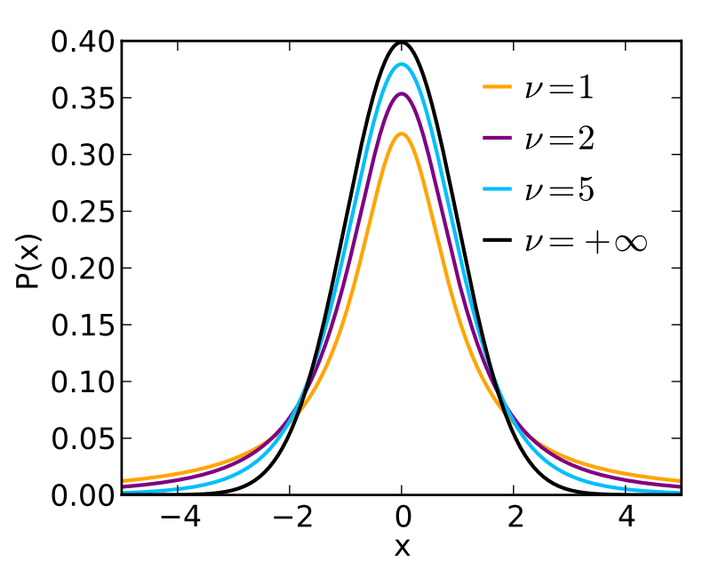

<style>
.section .reveal .state-background {
   background: #ffffff;
}
.section .reveal h1,
.section .reveal h2,
.section .reveal p {
   color: black;
   margin-top: 50px;
   text-align: center;
}
</style>

Inference continued
========================================================
date: 10/04/2019
autosize: true
incremental: true
width: 1920
height: 1080

<h2 style='color:black'>Instructions:</h2>
<p style='color:black'>Use the left and right arrow keys to navigate the presentation forward and backward respectively.  You can also use the arrows at the bottom right of the screen to navigate with a mouse.<br></p>

========================================================

<h2>Outline</h2>

* The following topics will be covered in this lecture:
  * A review of hypothesis testing
  * The F-test and ANOVA
  * The t-test

========================================================

<h2> A review of hypothesis testing</h2>

* The process of hypothesis testing is always defined in terms of a null and an alternative hypothesis.

* In regression, we will denote the hypothesis that there is a systematic, statistical relationship the alternative hypothesis $H_1$.

* The hypothesis that the observed structure can be explained by random variation will be denoted the null hypothesis $H_0$.

* Hypothesis testing thus assumes that the null holds, and finds how surprising it would be to see the observed structure in the case it was just due to random variation.

* We always choose a pre-set value of significance $\alpha$ (typically $5\%$) and determine if the probability of finding a value at least as extreme as our observed results is less than $\alpha$.

  * This probability is known as the p-value.
  
* If the p-value falls below $\alpha$ we reject the null hypothesis in favor of the alternative.

  * On the other hand, if the p-value is greater, then we fail to reject the null model.
  
* Neither indicates causality or the lack thereof, but are good indications of points for further investigation.

  * Examining p-values can also provide corroborating evidence of the explanatory or predictive power of a model when used in conjunction with more robust forms of model selection.

========================================================

<h3>Occam's Razor</h3>

* In principle, we favor solutions to problems that are as simple as possible.
 * Occam's Razor is the philisophical principle that, <br><br>
 <b>"When presented with competing hypotheses to solve a problem, one should select the solution with the fewest assumptions."</b>

* This makes the problem easier to interpret, and our models transparent in their predictions.

* Suppose we have a large model $\boldsymbol{\Omega}$, which abstractly refers to the set of all linear models possible by choices of $\beta_i$, and their respective uncertainties, over certain variables $X_1, X_2, \cdots, X_{p-1}$.

* Let $q < p$, and suppose that abstractly $\boldsymbol{\omega}$ represents a "smaller model", as found by a strictly smaller set of explanatory variables, $X_1, X_2, \cdots, X_{q-1}$.

* We will say that we favor the model $\boldsymbol{\omega}$ unless $\boldsymbol{\Omega}$ provides appreciably better results.
 
 * For example, we may consdider, if $RSS_\boldsymbol{\omega} - RSS_\boldsymbol{\Omega}$ is small, then we favor the former, small model. 
 
 * With an additional scaling factor, we can use this principle directly as a test statistic for the null hypothesis, i.e.,
 
 $$\begin{align}
 \frac{RSS_\boldsymbol{\omega} - RSS_\boldsymbol{\Omega}}{RSS_\boldsymbol{\Omega}}
 \end{align}$$
 
========================================================

<h2>Likelihood Ratio test</h2>

* The quantity defined,
 
 $$\begin{align}
 \frac{RSS_\boldsymbol{\omega} - RSS_\boldsymbol{\Omega}}{RSS_\boldsymbol{\Omega}}
 \end{align}$$

 is known as a test-statistic, which is actually defined in terms of the ratio of likelihood functions.

* Let's recall our Gaussian likelihood function

 $$\begin{align}
 \mathcal{L} (\boldsymbol{\beta}, \sigma \vert \mathbf{Y} =Y_{1,\cdots,n} )
 \end{align}$$
 representing the likelihood of the parameter vector $\beta$ and the associated uncertainties with respect to the observed outcomes of the response variable.
 
* The following,
 
 $$\begin{align}
 max_{\boldsymbol{\beta}, \sigma \in \boldsymbol{\Omega}} \mathcal{L} (\boldsymbol{\beta}, \sigma \vert\mathbf{Y} =Y_{1,\cdots,n}  )
 \end{align}$$
 
 will represent the <b> maximum likelihood attainable</b> over all choices of $\boldsymbol{\beta}$ and choices of $\sigma$ in the large model space $\boldsymbol{\Omega}$.


========================================================

<h3>Likelihood Ratio test -- continued</h3>

 
* We can imagine intuitively that,

 $$\begin{align}
 \frac{ max_{\boldsymbol{\beta}, \sigma \in \boldsymbol{\Omega}} \mathcal{L} (\boldsymbol{\beta}, \sigma \vert \mathbf{Y} =Y_{1,\cdots,n}  )}{max_{\boldsymbol{\beta}, \sigma \in \boldsymbol{\omega}} \mathcal{L} (\boldsymbol{\beta}, \sigma \vert\mathbf{Y} =Y_{1,\cdots,n}  )}
 \end{align}$$
 is a reasonable measure of whether the model over the large model space (including more parameters) is more likely than the model over the smaller model space (with fewer parameters).

* If the likelihood ratio statistic is sufficiently large, we can say that:
 * "it would be very surprising that the high likelihood of the larger model versus the low likelihood of the small model is just due to random variation."  

* In the above situation, we reject the null hypothesis, i.e., we reject the small model $\boldsymbol{\omega}$.
 


========================================================

<h3> F-test for model selection </h3>

* Let us recall, the above intuition was formalized somewhat in our discussion of ANOVA.

  * Particularly, we saw the $RSS$ divided by the number of degrees of freedom as a "mean-square", which has a known expected value.

  * When we explicitly utilize the degrees of freedom for each model, we get a statement we can evaluate based on the theoretical expected values.

* Recall, $\boldsymbol{\omega}$ uses $q < p$ parameters, while $\boldsymbol{\Omega}$ uses $p$.

* We find

 $$\begin{align}
 F &\triangleq \frac{ \left( RSS_\boldsymbol{\omega} - RSS_\boldsymbol{\Omega}\right)/ (p-q)}{RSS_\boldsymbol{\Omega}/(n-p)} 
 \end{align}$$
 
 is an $F$ statistic, with $F$ distribution under the null hypothesis.
 
* This is to say, "if the null hypothesis holds (such that the smaller model is favorable), then $F \sim F_{(p-q),(n-p)}$."

* We will thus study how surprising this value is or not, based on the assumption that $F$ is drawn from the $F_{(p-q),(n-p)}$.


========================================================

<h3> F-test for model selection </h3>


 <div style="float:left; width:50%">

<p style="text-align:center">
Courtesy of IkamusumeFan <a href="https://creativecommons.org/licenses/by-sa/4.0" target="blank">CC BY-SA 4.0</a></p>
</div>

<div style="float:right; width:50%">

<ul>
<li> The hypothesis testing procedure thus follows the following idea:</li>

<ul>
 <li> Let us say (for sake of example) we want to choose a model with $\alpha =5\%$ significance. </li>
 
 <li> We will look at the appropriate $F$ distribution and find the value of 
 $$ F^\alpha_{ (p-q), (n-p) }$$ 
 
 <li> such that the probability of 
 $$F \geq F^\alpha_{(p-q),(n-p)}$$ </li>
 
 
 <li><b> given </b> 
 $$F \sim F_{(p-q),(n-p)}$$ </li>
 
 <li>is equal to
 $$\alpha = 5 \%.$$ </li>

</ul>
</ul>

</div>
<div style="width:100%; float:left">  
<ul>  
  <li> If our observed 
$$\begin{align}
 F &\triangleq \frac{ \left( RSS_\boldsymbol{\omega} - RSS_\boldsymbol{\Omega}\right)/ (p-q)}{RSS_\boldsymbol{\Omega}/(n-p)}  \geq F_{(p-q),(n-p)}^{\alpha},
 \end{align}$$
 we find this to be an unlikely outcome under the null hypothes (due to random variation).</li>
</ul>
</div>
 
========================================================

<h2> Geometric interpretation</h2>

 <div style="float:left; width:50%">

<p style="text-align:center">Courtesy of: Faraway, J. Linear Models with R. 2nd Edition</p>
</div>

<div style="float:right; width:50%">

<ul>
  <li> When we have <b>Gaussian errors, $\boldsymbol{\epsilon}\sim N(0, \sigma^2 \mathbf{I})$</b> ,</li>
  <ul>
    <li> if we have a "large model" and a smaller, simpler version of the model,</li>
    <li> where the smaller version of the model is defined as a sub-combination (subspace) of the larger model,</li>
    <li> we can express the difference in the models as $RSS_\boldsymbol{\omega} - RSS_\boldsymbol{\Omega}$.</li>
    <li> When this difference is "small" relative to various considerations, we should reject the large model for simplicity.</li>
  </ul>
</ul>
</div>
<div style="float:left; width:100%">
<ul>
   <li> However, when there is an appreciable difference in the results, i.e.,</li>
    <ul>
      <li>with significance in the F-test (we would be very suprised that this result was due to random variation)</li>
    </ul>
  <li> we accept the larger model.</li>
  </ul>
</ul>

</div>

========================================================

<h2> An example</h2>

* Let's consider the null hypothesis that there is no structure whatsover between the response variables and the explanatory variables.

* That is, we suppose the relationship looks like
 $$\begin{align}
  \mathbf{Y} = \overline{\mathbf{Y}} + \boldsymbol{\epsilon}
  \end{align}$$
  
* The null hypothesis is thus, $H_0 : \boldsymbol{\beta} = \boldsymbol{0}$.

* <b>Exercise (2 minutes):</b> discuss with a partner what is $RSS_\boldsymbol{\omega}$ in this case?

* <b>Solution:</b> this is the sum of square diffences of the predicted value (always the mean) versus the observed values, i.e.,

  $$\begin{align}
  \boldsymbol{\epsilon}_\boldsymbol{\omega}^\mathrm{T}   \boldsymbol{\epsilon}_\boldsymbol{\omega} &= \left(\mathbf{Y} - \overline{\mathbf{Y}}  \right)^\mathrm{T}\left(\mathbf{Y} - \overline{\mathbf{Y}}\right) \\  
  &=TSS
  \end{align}$$


========================================================

<h3> An example -- continued</h3>

* Let us consider again the ```gala``` data...


```r
library('faraway')
lmod <- lm(Species ~ Area + Elevation + Nearest + Scruz + Adjacent,
gala)
sumary(lmod)
```

```
             Estimate Std. Error t value  Pr(>|t|)
(Intercept)  7.068221  19.154198  0.3690 0.7153508
Area        -0.023938   0.022422 -1.0676 0.2963180
Elevation    0.319465   0.053663  5.9532 3.823e-06
Nearest      0.009144   1.054136  0.0087 0.9931506
Scruz       -0.240524   0.215402 -1.1166 0.2752082
Adjacent    -0.074805   0.017700 -4.2262 0.0002971

n = 30, p = 6, Residual SE = 60.97519, R-Squared = 0.77
```

* Here we fit the model with explanatory variables describing a response with "lmod"

========================================================

<h3> An example -- continued</h3>

* Secondly, we will fit the null model as variation around a constant value, i.e.,


```r
nullmod <- lm(Species ~ 1, gala)
sumary(nullmod)
```

```
            Estimate Std. Error t value  Pr(>|t|)
(Intercept)   85.233     20.929  4.0725 0.0003285

n = 30, p = 1, Residual SE = 114.63305, R-Squared = 0
```

```r
mean(gala$Species)
```

```
[1] 85.23333
```

* where the fixed constant is indeed the empirical mean value of the response.

========================================================

<h3> An example -- continued</h3>


* Explicitly, the F-test can be computed as follows

 * The RSS of each of the models
    
    ```r
    (rss0 <- deviance(nullmod))
    ```
    
    ```
    [1] 381081.4
    ```
    
    ```r
    (rss <- deviance(lmod))
    ```
    
    ```
    [1] 89231.37
    ```

 * The degrees of freedom of each model  
    
    ```r
    (df0 <- df.residual(nullmod))
    ```
    
    ```
    [1] 29
    ```
    
    ```r
    (df <- df.residual(lmod))
    ```
    
    ```
    [1] 24
    ```

========================================================

<h3> An example -- continued</h3>


* Then, we compute the fstatistic with the ratio of likelihoods

```r
(fstat <- ((rss0-rss)/(df0-df))/(rss/df))
```

```
[1] 15.69941
```

* Finally, we determine the probability of this value being drawn from the F distribution in the two parameters ```df0 - df``` and ```df```.

```r
1-pf(fstat, df0-df, df)
```

```
[1] 6.837893e-07
```

* The function ```pf``` above evaluates the F distribution at the point ```fstat``` with respect to the degrees of freedom parameters. 

* The probability of this value  is approximately zero, on the order of $10^{-7}$.

========================================================

<h3> An example -- continued</h3>


* More compactly, this is computed in an analysis of variance (ANOVA) table


```r
anova(nullmod, lmod)
```

```
Analysis of Variance Table

Model 1: Species ~ 1
Model 2: Species ~ Area + Elevation + Nearest + Scruz + Adjacent
  Res.Df    RSS Df Sum of Sq      F    Pr(>F)    
1     29 381081                                  
2     24  89231  5    291850 15.699 6.838e-07 ***
---
Signif. codes:  0 '***' 0.001 '**' 0.01 '*' 0.05 '.' 0.1 ' ' 1
```

* We tentatively reject the null hypothesis and conclude that at $5\%$ significance, <b>at least one subspace of the explantory variables</b> has predictive power.

* This does not say which one, or if a combination of the explanatory variables gives the predictive power.

  * This only says, it is very unlikely that there is no relationship between the space of explanatory variables and the changes in the response.
  

========================================================

<h3> An example -- continued</h3>

* The same result can be observed in the F-statistic of the model summary,


```r
summary(lmod)
```

```

Call:
lm(formula = Species ~ Area + Elevation + Nearest + Scruz + Adjacent, 
    data = gala)

Residuals:
     Min       1Q   Median       3Q      Max 
-111.679  -34.898   -7.862   33.460  182.584 

Coefficients:
             Estimate Std. Error t value Pr(>|t|)    
(Intercept)  7.068221  19.154198   0.369 0.715351    
Area        -0.023938   0.022422  -1.068 0.296318    
Elevation    0.319465   0.053663   5.953 3.82e-06 ***
Nearest      0.009144   1.054136   0.009 0.993151    
Scruz       -0.240524   0.215402  -1.117 0.275208    
Adjacent    -0.074805   0.017700  -4.226 0.000297 ***
---
Signif. codes:  0 '***' 0.001 '**' 0.01 '*' 0.05 '.' 0.1 ' ' 1

Residual standard error: 60.98 on 24 degrees of freedom
Multiple R-squared:  0.7658,	Adjusted R-squared:  0.7171 
F-statistic:  15.7 on 5 and 24 DF,  p-value: 6.838e-07
```


========================================================

<h2>Testing one predictor</h2>

* As a general method, we can always use the F-statistic for <b>nested models</b>.

* Specifically, whenever one model is given by a subspace of another: 
  * $\boldsymbol{\omega}$ consists of models over variables $x_1, \cdots, x_{q-1}$ and corresponds to $q$ parameters (including the intercept);
  * $\boldsymbol{\Omega}$ consists of models over variables $x_1, \cdots , x_{p-1}$ and corresponds to $p$ parameters (including the itercept); 
  * such that $q \text{<} p$.

* Concretely, the null hypothesis must be $H_0 : \boldsymbol{\beta}_i = \boldsymbol{0}$ for each $i=q,\cdots, p-1$.

* The alternative hypothesis is that the larger model holds,
  
  $$H_1: \boldsymbol{\beta} \neq 0$$

* We compute the F statistic as,
   $$\begin{align}
   F &\triangleq \frac{ \left( RSS_\boldsymbol{\omega} - RSS_\boldsymbol{\Omega}\right)/    (p-1)}{RSS_\boldsymbol{\Omega}/(n-p)} .
 \end{align}$$
 

========================================================

<h3>Testing one predictor -- continued</h3>


* Suppose there is one particular variable that we want to determine the significance of for our model.

* Specifically, suppose we have a model,

  $$\begin{align}
  \mathbf{Y} = \mathbf{X} \boldsymbol{\beta} + \boldsymbol{\epsilon},
  \end{align}$$
  with respect to some choice of variables $\mathbf{X}$.
  
* Our alternative hypothesis in this case is,

  $$\begin{align}
  H_1: \boldsymbol{\beta} \neq \boldsymbol{0}.
  \end{align}$$
  
* <b>Q:</b> if we want to determine if $\boldsymbol{\beta}_i$ specifically gives an appreciable difference in this model, what is our null hypothesis?

* <b>A:</b> our null hypothesis takes the form,

  $$\begin{align}
  H_0: \boldsymbol{\beta}_i = 0
  \end{align}$$
  
 

========================================================

<h3>Testing one predictor -- continued</h3>

* We will examine this on the ```gala``` data once again.

* We define the model ```lmods``` without ```area``` as an explanatory variable for the null hypothesis.  Then we compute the ANOVA table with the bigger model.


```r
lmods <- lm(Species ~ Elevation + Nearest + Scruz + Adjacent, gala)
anova(lmods, lmod)
```

```
Analysis of Variance Table

Model 1: Species ~ Elevation + Nearest + Scruz + Adjacent
Model 2: Species ~ Area + Elevation + Nearest + Scruz + Adjacent
  Res.Df   RSS Df Sum of Sq      F Pr(>F)
1     25 93469                           
2     24 89231  1    4237.7 1.1398 0.2963
```

* The result of the $F$ test is to say,
  
  "With probability 29.63%, we will find a value drawn from the F distribution with this value or greater"

* <b>Q:</b> do we reject or fail to reject the null hypothesis at $5\%$ significance here?  

* <b>A:</b> Here we <b>fail to reject the null hypothesis</b> because it is reasonable that the difference between the large model and the small model could be due to random variation.
 * <b>Note:</b> there may be some statistical relationship, but we haven't detected one that wouldn't be surpising if it was just noise.
 
========================================================

<h3>Student t-distribution</h3>

 <div style="float:left; width:40%">

Courtesy of Skbkekas  <a href="https://creativecommons.org/licenses/by-sa/3.0" target="blank">CC BY-SA 3.0</a>

</div>

<div style="float:left; width:60%">

<ul>
  <li> The significance of a <b>single variable</b> can also be found with respect to the student t-test.</li>
  <li> Generally, suppose that we have $n$ independent samples of a Gaussian distribution $\left\{Y_i\right\}_{i=1}^n$, with unknown true mean $\mu_Y$ and standard deviation $\sigma$.</li>
  <li> As usual, our sample-based estimate of the mean is given by,

  $$\begin{align}
  \overline{Y} = \frac{1}{n}\sum_{i=1}^n Y_i ;
  \end{align}$$</li>
  <li> and our unbiased, sample-based estimate of the variance is given as,

  $$\begin{align}
  S^2 = \frac{1}{n-1} \sum_{i=1}^n \left(Y_i - \overline{Y}\right)^2.
  \end{align}$$</li>
</ul>
</div>
<div style="width:100%; float:left">
<ul>
  <li> It is a powerful and non-trivial result that,

  $$\begin{align}
  \frac{\overline{Y} - \mu_Y}{S/ \sqrt{n}},
  \end{align}$$
  is distributed according to a student t-distribution, in $n-1$ degrees of freedom.</li>
</ul>
</div>

========================================================

<h3>Student t-distribution</h3>

 <div style="float:left; width:40%">

Courtesy of Skbkekas  <a href="https://creativecommons.org/licenses/by-sa/3.0" target="blank">CC BY-SA 3.0</a>

</div>

<div style="float:left; width:60%">
  <li> The student t-distribution, pictured left, is similar to a Gaussian but with only polynomial decay of the probability in the tails.</li>
  <li>Particularly, for one degree of freedom $\nu = 1$, the density function takes the form,
  $$\begin{align}
  p(x) = \frac{1}{\pi \left( 1 + x^2\right)}.
  \end{align}$$
  <li> In general, the student t-distribution is defined for any number of degrees of freedom $\nu$ as a parameter, where
  $$\begin{align}
  p(x) = \frac{\Gamma(\frac{\nu+1}{2})} {\sqrt{\nu\pi}\,\Gamma(\frac{\nu}{2})} \left(1+\frac{x^2}{\nu} \right)^{-\frac{\nu+1}{2}},
  \end{align}$$
  and $\Gamma$ is special function known as the Gamma function.</li>
</div>
<div style="width:100%; float:left">
<ul>
  <li><b>Exercise (2 mins):</b> notice, the t-distribution is symmetric about zero. 
  <li>Discuss with a partner, if $L>0$ and $P(X\geq L) = \alpha/2$ then what is 
  $P(-L  &lt; X &lt; L)$?
  </li>
</ul>

========================================================

<h3>Student t-distribution</h3>

* <b>Solution: </b> we can consider the two events,
  $$\begin{align}
  A: X\geq L & & B: X \leq -L.
  \end{align}$$
  
* Due to the symmetry of the student t-distribution about zero, we find,

  $$\begin{align}
  P(A)=P(B) = \frac{\alpha}{2}.
  \end{align}$$
  
* Then, notice that,

  $$\begin{align}
  P(A\cup B) &= P(A) + P(B) - P(A\cap B) \\
  &= \frac{\alpha}{2} + \frac{\alpha}{2} - 0
  \end{align}$$
  as the intersection is empty.
  
* Finally, the complement of the event $A\cup B$ is the event that $-L &lt; X &lt; L$,
  such that, $P(-L &lt; X &lt; L) = 1 - \alpha$.
  
========================================================

<h3>Testing one predictor -- continued</h3>


* Suppose again, we have $n$ independent samples of a Gaussian distribution $\left\{Y_i\right\}_{i=1}^n$, with unknown true mean $\mu_Y$ and standard deviation $\sigma$.</li>

* <b> Q:</b> if we want to test the hypothesis that $\mu_Y \neq 0$, what are the null and alternative hypotheses?

* <b>A:</b>
  
  $$\begin{align}
  H_0 &: \mu_Y = 0 \\
  H_1 &: \mu_Y \neq 0
  \end{align}$$

* To test the hypothesis, we assume the null hypothesis and refer to the quantity,
  $$\begin{align}
  t^\ast = \frac{\overline{Y} - \mu_Y}{S/ \sqrt{n}} = \frac{\overline{Y}}{S / \sqrt{n}}
  \end{align}$$
  with respect to the null.
 
* The value $t^\ast \sim t_{n-1}$ so that we can identify the value $t^\alpha$ for which 
  
  $$P(t \geq t^\alpha) = \frac{\alpha}{2}.$$

* By symmetry, we see that

  $$\begin{align}
  P( \vert t \vert &lt \vert t^\alpha\vert) = 1 - \alpha
  \end{align}$$


========================================================

<h3>Testing one predictor -- continued</h3>

* If we want thus to test the hypothesis that a single parameter $\boldsymbol{\beta}_i \neq 0$, we can follow a similar procedure under the Gaussian assumption.

* Recall, the standard error of a given parameter $\hat{\boldsymbol{\beta}}_i$ is given
$$\begin{align}
se(\hat{\boldsymbol{\beta}}_{i-1}) \triangleq \hat{\sigma}\sqrt{(\mathbf{X}^\mathrm{T}\mathbf{X})^{-1}_{ii}}
\end{align}$$
 where $\hat{\sigma}^2 = \frac{RSS}{n-p}$.

* The value
$$\begin{align}
t_i = \frac{\hat{\boldsymbol{\beta}}_i}{se(\hat{\boldsymbol{\beta}}_i)}
\end{align}$$
 has t-distribution in $(n-p)$ degrees of freedom under the null hypothesis $H_0:\boldsymbol{\beta}_i=0$.

* Particularly, we will determine the probability of obtaining a random value $t$ where $\vert t \vert \geq \vert t_i \vert$ with respect to the t-distribution to determine significance. 

  * If the above probability falls below our pre-chosen $\alpha$, or equivalently, 
  $$\vert t_i\vert &gt; \vert t^\alpha \vert,$$ 
  we reject the null that $\beta_i = 0$ with $\alpha$ significance.
  
========================================================

<h2>Model summary</h2>

* We can now interpret the entire summary table, except for adjusted $R^2$:

```r
summary(lmod)
```

```

Call:
lm(formula = Species ~ Area + Elevation + Nearest + Scruz + Adjacent, 
    data = gala)

Residuals:
     Min       1Q   Median       3Q      Max 
-111.679  -34.898   -7.862   33.460  182.584 

Coefficients:
             Estimate Std. Error t value Pr(>|t|)    
(Intercept)  7.068221  19.154198   0.369 0.715351    
Area        -0.023938   0.022422  -1.068 0.296318    
Elevation    0.319465   0.053663   5.953 3.82e-06 ***
Nearest      0.009144   1.054136   0.009 0.993151    
Scruz       -0.240524   0.215402  -1.117 0.275208    
Adjacent    -0.074805   0.017700  -4.226 0.000297 ***
---
Signif. codes:  0 '***' 0.001 '**' 0.01 '*' 0.05 '.' 0.1 ' ' 1

Residual standard error: 60.98 on 24 degrees of freedom
Multiple R-squared:  0.7658,	Adjusted R-squared:  0.7171 
F-statistic:  15.7 on 5 and 24 DF,  p-value: 6.838e-07
```

========================================================

<h3>Model summary -- continued </h3>

* <b>Exercise:</b> State the null and alterantive hypothesis for each t-test and F-test below.  Suppose $\alpha=5\%$.  Where do we reject and where do we fail to reject the null hypothesis?


```r
summary(lm(Species ~ Area + Elevation + Nearest + Scruz + Adjacent, gala))
```

```

Call:
lm(formula = Species ~ Area + Elevation + Nearest + Scruz + Adjacent, 
    data = gala)

Residuals:
     Min       1Q   Median       3Q      Max 
-111.679  -34.898   -7.862   33.460  182.584 

Coefficients:
             Estimate Std. Error t value Pr(>|t|)    
(Intercept)  7.068221  19.154198   0.369 0.715351    
Area        -0.023938   0.022422  -1.068 0.296318    
Elevation    0.319465   0.053663   5.953 3.82e-06 ***
Nearest      0.009144   1.054136   0.009 0.993151    
Scruz       -0.240524   0.215402  -1.117 0.275208    
Adjacent    -0.074805   0.017700  -4.226 0.000297 ***
---
Signif. codes:  0 '***' 0.001 '**' 0.01 '*' 0.05 '.' 0.1 ' ' 1

Residual standard error: 60.98 on 24 degrees of freedom
Multiple R-squared:  0.7658,	Adjusted R-squared:  0.7171 
F-statistic:  15.7 on 5 and 24 DF,  p-value: 6.838e-07
```


========================================================


* <b>NOTE:</b> The null hypothesis will have a different interpretation if it is stated with respect to different alternative hypotheses.  


```r
summary(lm(Species ~ Area, gala))
```

```

Call:
lm(formula = Species ~ Area, data = gala)

Residuals:
    Min      1Q  Median      3Q     Max 
-99.495 -53.431 -29.045   3.423 306.137 

Coefficients:
            Estimate Std. Error t value Pr(>|t|)    
(Intercept) 63.78286   17.52442   3.640 0.001094 ** 
Area         0.08196    0.01971   4.158 0.000275 ***
---
Signif. codes:  0 '***' 0.001 '**' 0.01 '*' 0.05 '.' 0.1 ' ' 1

Residual standard error: 91.73 on 28 degrees of freedom
Multiple R-squared:  0.3817,	Adjusted R-squared:  0.3596 
F-statistic: 17.29 on 1 and 28 DF,  p-value: 0.0002748
```

 * <b> Q:</b> what do you notice about the p-value for the F-statistic and the p-value for the t-statistic for ```area```?
   * <b> A:</b> These correspond to the <b>same</b> test of the null versus alternative hypothesis in this case, i.e., leaving out ```area``` is the same null hypothesis as the data is expressed only as random variation around the mean $\overline{\mathbf{Y}}$.  
   * The p-value for the t-test on ```Area``` is not the same here as it was on the last slide, because this is framed with respect to a different alternative hypothesis.
   

========================================================

<h2>Review</h2>

* We now have two methods for comparing different models: the F-test and the t-test.

* The F-test is defined to compare the likelihood of any two models, as long as one lies in a subspace of another model.

  * Particularly, this is defined as long as the small model $\boldsymbol{\omega}$ uses some combination of the same explanatory variables of the large model $\boldsymbol{\Omega}$.
  
  * This measures the ratio of the maximum likelihoods of both models, which is distributed according to an F distribution under the null hypothesis (the smaller model is accurate). 
  
* The t-test is defined for a single parameter, rather than a combination of parameters like the F-test.

  * This computes the probability of 
  $$\begin{align}
t_i = \frac{\hat{\boldsymbol{\beta}}_i}{se(\hat{\boldsymbol{\beta}}_i)},
\end{align}$$
  under the null hypothesis where $\boldsymbol{\beta}_i = 0$.

* In particular, the two tests are equivalent when we test the two models 
  
  1. $\boldsymbol{\Omega}$ defined over $X_1, \cdots, X_{p-1}$; and 
  2. $\boldsymbol{\omega}$ defined over $X_1,\cdots, X_{p-2}$

========================================================

<h2> Testing a pair of explanatory variables</h2>

* Suppose we wish to determine if the two variables ```area``` and ```adjacent``` have an effect on the response relative to the model with all other variables.

* Particularly, we obtain the null hypothesis $H_0 : \boldsymbol{\beta}_{area}= \boldsymbol{\beta}_{adjacent}=0$.


```r
lmods <- lm(Species ~ Elevation + Nearest + Scruz, gala)
anova(lmods, lmod)
```

```
Analysis of Variance Table

Model 1: Species ~ Elevation + Nearest + Scruz
Model 2: Species ~ Area + Elevation + Nearest + Scruz + Adjacent
  Res.Df    RSS Df Sum of Sq      F  Pr(>F)   
1     26 158292                               
2     24  89231  2     69060 9.2874 0.00103 **
---
Signif. codes:  0 '***' 0.001 '**' 0.01 '*' 0.05 '.' 0.1 ' ' 1
```

* The probability of drawing such an F value is around 1/1000, so we reject the null hypothesis.

* This tells us that it is extremely unlikely that there is no combination of the variables ```area``` and ```adjacent``` which have some effect on the response, when comparing the two models.

========================================================

<h3> Testing a pair of explanatory variables</h3>


* Rejecting the null hypothesis in the last example, testing a pair of variables, cannot be inferred from their respective t-tests. 


```r
sumary(lmod)
```

```
             Estimate Std. Error t value  Pr(>|t|)
(Intercept)  7.068221  19.154198  0.3690 0.7153508
Area        -0.023938   0.022422 -1.0676 0.2963180
Elevation    0.319465   0.053663  5.9532 3.823e-06
Nearest      0.009144   1.054136  0.0087 0.9931506
Scruz       -0.240524   0.215402 -1.1166 0.2752082
Adjacent    -0.074805   0.017700 -4.2262 0.0002971

n = 30, p = 6, Residual SE = 60.97519, R-Squared = 0.77
```

* There is no simple way of combining the above information to test a pair of explanatory variables simultaneously.

* <b>Testing a pair of variables needs to be performed with the F-test over the two nested models</b>.
