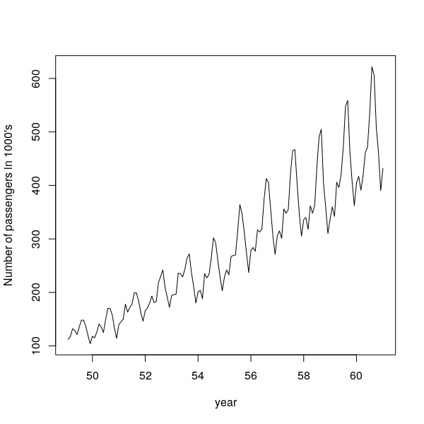
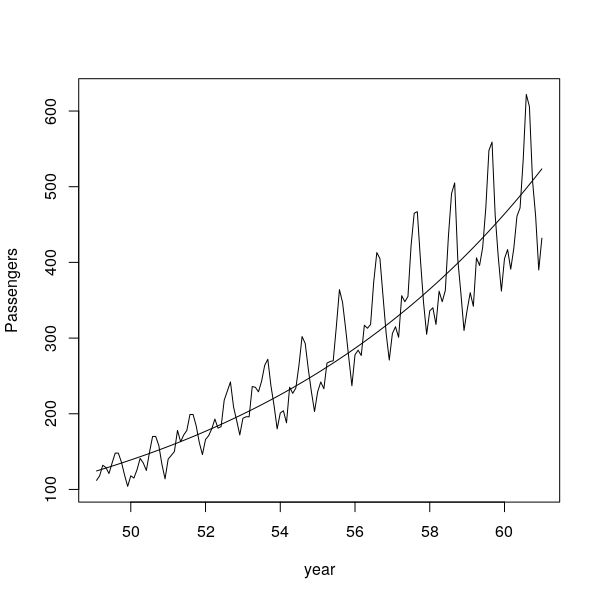
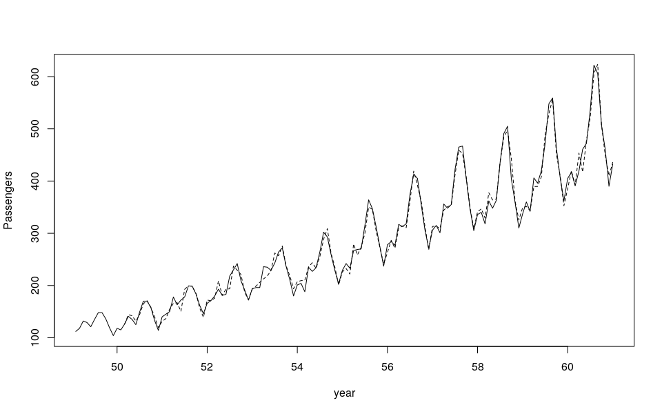

<style>
.section .reveal .state-background {
   background: #ffffff;
}
.section .reveal h1,
.section .reveal h2,
.section .reveal p {
   color: black;
   margin-top: 50px;
   text-align: center;
}
</style>

Prediction
========================================================
date: 10/08/2019
autosize: true
incremental: true
width: 1920
height: 1080

<h2 style='color:black'>Instructions:</h2>
<p style='color:black'>Use the left and right arrow keys to navigate the presentation forward and backward respectively.  You can also use the arrows at the bottom right of the screen to navigate with a mouse.<br></p>

========================================================

<h2>Outline</h2>

* The following topics will be covered in this lecture:
  * Review of predictions
  * Confidence intervals for future observations and the mean response
  * Autoregression

========================================================

<h2> Prediction</h2>

* We have now seen how to construct a model, and assess some of its uncertainty and significance versus the null hypothesis.

* One of the main points of constructing such a model is to produce new predicted values for the response based upon new values for the explanatory data.

* Consider values of the predictors which are not observed in our data set, but fall within the scope of the model;

 * that is, we are interested in values of the predictors that are similar to those that are observed, but for which we do not have an associated observation.

* We can construct an arbitrary vector of values for the predictors, $\mathbf{x}_0$, and define the prediction based on our least-squares model as,
$$\begin{align}
\hat{Y}_0 = \mathbf{x}_0^\mathrm{T} \hat{\boldsymbol{\beta}}
\end{align}$$
where $\mathbf{x}_0\in \mathbb{R}^p$.

* If $\mathbf{x}_0$ was an observed case, this is precisely the fitted value.

* Among the primary issues is quantifying the uncertainty of the prediction.

  * E.g., if we form a model for the high and low values for the height of a river in a flood plane, it is of practical importance to quantify what would be the confidence range of a prediction;
  
  * here, even if we get the predicted "high level" mark right on average, the damages that can occur only due to variance about the mean can be substantial if we don't take this into account in city planning.
  
========================================================

<h3> Prediction -- continued</h3>


* Concretely, we will differentiate between the <b>predicted mean response</b> and the <b>prediction of a future observation</b>

* Suppose we build a model that predicts the rental price of houses in a given area based on: (i) the number of bedrooms, (ii) the number of bathrooms; and (iii) distance to a major highway.

* Given some new set of values for the explanatory variables $\mathbf{x}_0$,

 * the rental value of the house with characteristics described in $\mathbf{x}_0$ is defined as
 $$\begin{align}
 \mathbf{x}_0^\mathrm{T} \boldsymbol{\beta} + \epsilon_0
 \end{align}$$
 
 * Because we assume $\mathbb{E}[\epsilon_0]=0$, our prediction for the price will be
  $$\begin{align}
 \mathbf{x}_0^\mathrm{T} \hat{\boldsymbol{\beta}};
 \end{align}$$
  
  * however, we should state the (un)certainty of our predction in terms of the variance of $\epsilon_0$.

 * On the other hand, if we ask "what would be the mean price of a house with characteristics $\mathbf{x}_0$ be?"
 
  * our prediction is again the same, but our (un)certainty is given in terms of the variance of $\hat{\boldsymbol{\beta}}$.

========================================================

<h2> Predicting future observations</h2>

* A future observation of the response is predicted to be,

  $$\begin{align}
\mathbf{x}_0^\mathrm{T} \hat{\boldsymbol{\beta}} + \epsilon_0;
\end{align}$$

where the variation, $\epsilon_0$, around the signal, $\mathbf{x}_0^\mathrm{T} \hat{\boldsymbol{\beta}}$, for this future observation is unknown.

* Assuming,
<ol>
 <li> $\mathbb{E}[\epsilon_0] =0$, </li>
 <li> this future $\epsilon_0$ is independent of $\hat{\boldsymbol{\beta}}$;</li>
</ol>

* our "central" point prediction is given by the mean, $\mathbf{x}_0^\mathrm{T} \hat{\boldsymbol{\beta}}$.

* We will derive the variance of the predicted observation -- this allows us to quantify the uncertainty of the point prediction and to derive confidence intervals.

========================================================

<h3> Predicting future observations -- continued</h3>


* Consider,

  $$\begin{align}
\mathbf{x}_0^\mathrm{T} \hat{\boldsymbol{\beta}} & = \mathbf{x}_0^\mathrm{T}\left( \left(\mathbf{X}^\mathrm{T}\mathbf{X}\right)^{-1}\mathbf{X}^\mathrm{T} \mathbf{Y}\right) \\
& = \mathbf{x}_0^\mathrm{T} \left(\mathbf{X}^\mathrm{T}\mathbf{X}\right)^{-1} \mathbf{X}^\mathrm{T} \left(\mathbf{X} \boldsymbol{\beta} + \boldsymbol{\epsilon}\right) \\
&= \mathbf{x}_0^\mathrm{T} \boldsymbol{\beta} +  \mathbf{x}_0^\mathrm{T} \left(\mathbf{X}^\mathrm{T}\mathbf{X}\right)^{-1} \mathbf{X}^\mathrm{T} \boldsymbol{\epsilon}
\end{align}$$

* such that

$$\begin{align}
\mathbb{E}\left[\mathbf{x}_0^\mathrm{T} \hat{\boldsymbol{\beta}} \right]& = \mathbf{x}_0^\mathrm{T}  \boldsymbol{\beta} 
\end{align}$$
 the prediction is indeed unbiased.

* Therefore, the deviation from the mean is given by,

  $$\begin{align}
  \mathbf{x}_0^\mathrm{T} \left(\mathbf{X}^\mathrm{T}\mathbf{X}\right)^{-1}  \mathbf{X}^\mathrm{T}\boldsymbol{\epsilon}
  \end{align}$$
  which is a scalar.


* Because the above equation is a scalar, the transpose is equal to itself, i.e.,

 $$\begin{align}
  \mathbf{x}_0^\mathrm{T} \left(\mathbf{X}^\mathrm{T}\mathbf{X}\right)^{-1}  \mathbf{X}^\mathrm{T}\boldsymbol{\epsilon}&= \left(\mathbf{x}_0^\mathrm{T} \left(\mathbf{X}^\mathrm{T}\mathbf{X}\right)^{-1}  \mathbf{X}^\mathrm{T}\boldsymbol{\epsilon}\right)^\mathrm{T}\\
  & = \boldsymbol{\epsilon}^\mathrm{T}\mathbf{X}\left(\mathbf{X}^\mathrm{T}\mathbf{X}\right)^{-1}   \mathbf{x}_0
 \end{align}$$


========================================================

<h3> Predicting future observations -- continued</h3>


* From the last slide, we compute the variance of $\mathbf{x}_0^\mathrm{T} \hat{\boldsymbol{\beta}}$ as

  $$\begin{align}
  var\left[\mathbf{x}_0^\mathrm{T} \hat{\boldsymbol{\beta}} \right]& =  
  \mathbb{E}\left[ \left( \mathbf{x}_0^\mathrm{T} \hat{\boldsymbol{\beta}} - \mathbf{x}_0^\mathrm{T}\boldsymbol{\beta}\right)^2\right] \\
  &=\mathbb{E} \left[ \mathbf{x}_0^\mathrm{T} \left(\mathbf{X}^\mathrm{T}\mathbf{X}\right)^{-1}  \mathbf{X}^\mathrm{T}\boldsymbol{\epsilon}\boldsymbol{\epsilon}^\mathrm{T}\mathbf{X}\left(\mathbf{X}^\mathrm{T}\mathbf{X}\right)^{-1}   \mathbf{x}_0\right] .
  \end{align}$$
  
* Passing the expectation linearly across terms, we have
  
  $$\begin{align}
var\left[\mathbf{x}_0^\mathrm{T} \hat{\boldsymbol{\beta}} \right]& = 
 \mathbf{x}_0^\mathrm{T} \left(\mathbf{X}^\mathrm{T}\mathbf{X}\right)^{-1}  \mathbf{X}^\mathrm{T}\mathbb{E}\left[\boldsymbol{\epsilon}\boldsymbol{\epsilon}^\mathrm{T}\right]\mathbf{X}\left(\mathbf{X}^\mathrm{T}\mathbf{X}\right)^{-1}   \mathbf{x}_0 \\
&=  \mathbf{x}_0^\mathrm{T} \left(\mathbf{X}^\mathrm{T}\mathbf{X}\right)^{-1}  \mathbf{X}^\mathrm{T}\left( \sigma^2 \mathbf{I}\right)\mathbf{X}\left(\mathbf{X}^\mathrm{T}\mathbf{X}\right)^{-1}   \mathbf{x}_0.
  \end{align}$$
  
* With a final cancellation  of terms, we recover,

  $$\begin{align}
var\left[\mathbf{x}_0^\mathrm{T} \hat{\boldsymbol{\beta}} \right]
&=  \sigma^2\mathbf{x}_0^\mathrm{T} \left(\mathbf{X}^\mathrm{T}\mathbf{X}\right)^{-1}  \mathbf{x}_0,
  \end{align}$$
  so that the uncertainty is given by a weighted inner product of the new predictors.


========================================================

<h3> Predicting future observations -- continued</h3>

  
* Consider an alternative model, in which $\mathbf{X}$ are replaced by the anomalies (deviations from the predictor mean) normalized by $\frac{1}{\sqrt{n-1}}$. 

* Let $\overline{\mathbf{X}}^{(i)}$ be the mean of column $i$ of the design matrix, i.e.,
  $$\overline{\mathbf{X}}^{(i)} \triangleq \frac{1}{n} \sum_{k=1}^n X_{k,i}.$$
 

* We will then define the $(k,i)$-th anomaly as
  $a_{(k,i)} = X_{k,i} - \overline{\mathbf{X}}^{(i)},$
  such that the matrix $\mathbf{A}$ is defined column-wise as
  $$\begin{align}
  \mathbf{A}^{(i)} \triangleq \mathbf{X}^{(i)} -\overline{\mathbf{X}}^{(i)} \mathbb{1}
  \end{align}$$
  where $\mathbb{1}$ is the vector of ones,
  $$\begin{align}
  \mathbb{1} \triangleq \begin{pmatrix} 1 & 1 & \cdots & 1 \end{pmatrix}^\mathrm{T}.
  \end{align}$$

* The sample-based covariance of the variables $X_i$ and $X_j$ can be written,
  $$\begin{align}
  cov(X_i,X_j)\triangleq \frac{1}{n-1}\left(\mathbf{A}^{(i)}\right)^\mathrm{T} \mathbf{A}^{(j)}.
  \end{align}$$


* If we take the predictors to instead be $\frac{1}{\sqrt{n-1}}A_i$ the uncertainty of the prediction can be written as

  $$\begin{align}
var\left[\mathbf{x}_0^\mathrm{T} \hat{\boldsymbol{\beta}} \right]
&=  \sigma^2\mathbf{a}_0^\mathrm{T} cov\left(\mathbf{X}\right)^{-1}  \mathbf{a}_0,
  \end{align}$$
 i.e., as a ratio of the spread in the observations $\sigma^2$ and a weighted distance of the new case $\mathbf{a}_0$ from the mean.
 
 
========================================================

<h2> Condfidence of predictions versus mean response</h2>

* Using the Gaussian variation, we develop <b>two separate</b> intervals for uncertainty quantification:

  <ol>
    <li> Firstly, there is the <b>prediction interval</b>, given as<br>
    $$\begin{align}
    \left(\hat{Y}_0 - t^{\alpha/2}_{n-p} \hat{\sigma}\sqrt{1 +\mathbf{x}_0^\mathrm{T} \left(\mathbf{X}^\mathrm{T}\mathbf{X}\right)^{-1}\mathbf{x}_0}, \hat{Y}_0 + t^{\alpha/2}_{n-p} \hat{\sigma}\sqrt{1 + \mathbf{x}_0^\mathrm{T}\left(\mathbf{X}^\mathrm{T}\mathbf{X}\right)^{-1}\mathbf{x}_0} \right).
    \end{align}$$</li>
    <ul>
       <li>This represents the range that the future observation will lie in with $100(1-\alpha ) \%$ confidence.</li> 
  </ul>
  <li> Secondly, we obtain the <b>confidence interval for the mean response</b>, given as
    $$\begin{align}
    \left(\hat{Y}_0 - t^{\alpha/2}_{n-p} \hat{\sigma}\sqrt{\mathbf{x}_0^\mathrm{T} \left(\mathbf{X}^\mathrm{T}\mathbf{X}\right)^{-1}\mathbf{x}_0}, \hat{Y}_0 + t^{\alpha/2}_{n-p} \hat{\sigma}\sqrt{\mathbf{x}_0^\mathrm{T}\left(\mathbf{X}^\mathrm{T}\mathbf{X}\right)^{-1}\mathbf{x}_0} \right).
    \end{align}$$</li>
   <ul>
      <li> This represents the interval in which we feel $100(1-\alpha ) \%$ confident that the mean of the response lies within.</li> 
   </ul>
   </ol>
   
* Due to the extra term in the prediction interval, this is generally significantly wider than the range in which we believe the mean to lie.

========================================================

<h3> Condfidence of predictions versus mean response</h3>


* We should always be careful about which of the <b>prediction interval</b> and the <b>confidence interval for the mean response</b> we intend to use.

* As an example, consider again, predicting the high level water line for a river in a flood plane.

  * The <b>confidence interval for the mean response</b> 
  $$\begin{align}
    \left(\hat{Y}_0 - t^{\alpha/2}_{n-p} \hat{\sigma}\sqrt{\mathbf{x}_0^\mathrm{T} \left(\mathbf{X}^\mathrm{T}\mathbf{X}\right)^{-1}\mathbf{x}_0}, \hat{Y}_0 + t^{\alpha/2}_{n-p} \hat{\sigma}\sqrt{\mathbf{x}^\mathrm{T}_0\left(\mathbf{X}^\mathrm{T}\mathbf{X}\right)^{-1}\mathbf{x}_0} \right).
    \end{align}$$
  describes the range in which we feel $100(1-\alpha ) \%$ confident that the long-time average, climatological mean high water mark will exist.
  
    * This is useful for describing the hydrology of the river in terms of how much volume of water one might expect to see come through the river in a season or a year.
    
  * On the other hand, if we <b>predict a future event</b> given some known explanatory variables $\mathbf{x}_0$ for e.g., snowpack, summer precipitation, etc... the unknown future observation will live within the prediction interval
  $$\begin{align}
    \left(\hat{Y}_0 - t^{\alpha/2}_{n-p} \hat{\sigma}\sqrt{1 + \mathbf{x}_0^\mathrm{T}\left(\mathbf{X}^\mathrm{T}\mathbf{X}\right)^{-1}\mathbf{x}_0}, \hat{Y}_0 + t^{\alpha/2}_{n-p} \hat{\sigma}\sqrt{1 + \mathbf{x}_0^\mathrm{T}\left(\mathbf{X}^\mathrm{T}\mathbf{X}\right)^{-1}\mathbf{x}_0} \right).
    \end{align}$$
    with $100(1-\alpha)\%$ confidence.
    
* This is useful for policy makers to understand the range of possible extreme events, where there could be extreme flooding due to variation around the signal.

========================================================

<h2> A detailed example: predicting body fat</h2>

* Measuring someone's weight is easy, but to estimate their body density, one has to obtain a complicated measure of volume.

  * This can be solved by the Archimedes' principle:
  
  * Archimedes was asked to verify the authenticity of a gold crown for King Hiero II of Syracuse.
  
  * The crown couldn't be damaged by experimenting on the metal, and it was too ornate to measure the geometry, but Archimedes realized that the density could be verified by finding the volume of the crown by displacement.
  
  * Placing the crown in a full vessel of water, he measured the volume of water displaced by the crown.
  
* The same principle applies to measuring body density; bones and muscle are denser than fat so an individual's body density can be used to estimate their percentage body fat.

* The volume of someone's body can be estimated by the Archimedes' principle, but this is complicated and time consuming with a human being or other living subjects.

========================================================

<h3> Predicting body fat -- continued</h3>


* To simplify the process, researchers recorded age, weight, height, and 10 body circumference measurements
for 252 men. 

* These test subjects were given an accurate measurement of their body fat by an underwater weighting technique.

* The task is to determine if we can predict body fat using easier to measure quantities.
  *  Brozek is the response where Brozek’s equation estimates percent body fat from
density.


```r
library(faraway)
lmod <- lm(brozek ~ age + weight + height + neck + chest + abdom +
hip + thigh + knee + ankle + biceps + forearm + wrist, data=fat)
head(fat)
```

```
  brozek siri density age weight height adipos  free neck chest abdom
1   12.6 12.3  1.0708  23 154.25  67.75   23.7 134.9 36.2  93.1  85.2
2    6.9  6.1  1.0853  22 173.25  72.25   23.4 161.3 38.5  93.6  83.0
3   24.6 25.3  1.0414  22 154.00  66.25   24.7 116.0 34.0  95.8  87.9
4   10.9 10.4  1.0751  26 184.75  72.25   24.9 164.7 37.4 101.8  86.4
5   27.8 28.7  1.0340  24 184.25  71.25   25.6 133.1 34.4  97.3 100.0
6   20.6 20.9  1.0502  24 210.25  74.75   26.5 167.0 39.0 104.5  94.4
    hip thigh knee ankle biceps forearm wrist
1  94.5  59.0 37.3  21.9   32.0    27.4  17.1
2  98.7  58.7 37.3  23.4   30.5    28.9  18.2
3  99.2  59.6 38.9  24.0   28.8    25.2  16.6
4 101.2  60.1 37.3  22.8   32.4    29.4  18.2
5 101.9  63.2 42.2  24.0   32.2    27.7  17.7
6 107.8  66.0 42.0  25.6   35.7    30.6  18.8
```

========================================================

<h3> Predicting body fat -- continued</h3>


* We will make a prediction given from the median of the explanatory variables 

  * This may be used to represent either:
    <ol>
    <li> a future observation of body fat for a man with the median measurements in the explanatory variables; or </li>
    <li> the mean of all men who, when measured, would have the median measurements.</li>
    </ol>
* We compute the median,   


```r
x <- model.matrix(lmod)
(x0 <- apply(x,2,median))
```

```
(Intercept)         age      weight      height        neck       chest 
       1.00       43.00      176.50       70.00       38.00       99.65 
      abdom         hip       thigh        knee       ankle      biceps 
      90.95       99.30       59.00       38.50       22.80       32.05 
    forearm       wrist 
      28.70       18.30 
```

* and make a prediction


```r
(y0 <- sum(x0*coef(lmod)))
```

```
[1] 17.49322
```

========================================================

<h3> Predicting body fat -- continued</h3>


* The same can be performed directly, <b>as long as the new explanatory variables are a dataframe of the same format as the matrix $\mathbf{X}$</b>:


```r
predict(lmod,new=data.frame(t(x0)))
```

```
       1 
17.49322 
```

* This gives the prediction of $\approx 17.5\%$ body fat for the median measurements.

========================================================

<h3> Predicting body fat -- continued</h3>


* If we are to construct $95\%$ confidence intervals, we need to decide whether we predict:
  <ol>
     <li> a future observation of the body fat of a man with the median characteristics; or </li>
     <li> or the mean body fat of all men who each have the median measurements.
  </ol>
  

```r
med_obs <- predict(lmod,new=data.frame(t(x0)),interval="prediction")
med_mean <- predict(lmod,new=data.frame(t(x0)),interval="confidence")
med_obs
```

```
       fit     lwr      upr
1 17.49322 9.61783 25.36861
```

```r
med_mean
```

```
       fit      lwr      upr
1 17.49322 16.94426 18.04219
```


========================================================

<h3> Predicting body fat -- continued</h3>

* <b>Q:</b> by examining the confidence intervals, does this model seem useful to predict future observations?


```r
med_obs
```

```
       fit     lwr      upr
1 17.49322 9.61783 25.36861
```

```r
med_mean
```

```
       fit      lwr      upr
1 17.49322 16.94426 18.04219
```


* <b>A:</b> In this case, despite the tight interval around the mean response, there is a practical difference in the lower and upper bounds of the $95\%$ prediction interval: 
  <ul>
    <li> the person with median characteristics could range from a professional athlete to someone is borderline obese.</li>
  
  <li> The mean response might be useful for average statements about public health, but to predict an individual's body fat, there is almost no use.</li>
  </ul>

========================================================

<h3> Predicting body fat -- continued</h3>


* We note the relative widths of these intervals:

```r
med_obs_width <- med_obs[3] - med_obs[2]
med_obs_width / med_obs[1]
```

```
[1] 0.9003934
```

```r
med_mean_width <- med_mean[3] - med_mean[2]
med_mean_width / med_mean[1]
```

```
[1] 0.06276317
```

* Particulary, the width of the $95\%$ prediction interval for an observation with median characteristics is on the order of the prediction itself.

* On the other hand, the width of the $95\%$ confidence interval for the mean response is on the order of $6\%$ of the prediction.

========================================================

<h3> Predicting body fat -- continued</h3>


* The wide prediction intervals in fact occurs even though the $R^2$ is a relatively strong score:


```r
sumary(lmod)
```

```
              Estimate Std. Error t value  Pr(>|t|)
(Intercept) -15.292549  16.069921 -0.9516  0.342252
age           0.056786   0.029965  1.8951  0.059290
weight       -0.080310   0.049581 -1.6198  0.106602
height       -0.064600   0.088930 -0.7264  0.468299
neck         -0.437541   0.215334 -2.0319  0.043273
chest        -0.023603   0.091839 -0.2570  0.797396
abdom         0.885429   0.080077 11.0572 < 2.2e-16
hip          -0.198419   0.135156 -1.4681  0.143406
thigh         0.231895   0.133718  1.7342  0.084175
knee         -0.011677   0.224143 -0.0521  0.958496
ankle         0.163536   0.205143  0.7972  0.426142
biceps        0.152799   0.158513  0.9640  0.336048
forearm       0.430489   0.184452  2.3339  0.020436
wrist        -1.476537   0.495519 -2.9798  0.003183

n = 252, p = 14, Residual SE = 3.98797, R-Squared = 0.75
```

========================================================

<h2> Extrapolation</h2>


* Suppose we want to make a prediction given a set of observed explanatory variables that lie far from the previously observed data.

* Recall the form of the variance of the prediction when we use the normalized anomalies as the predictors,

$$\begin{align}
var\left[\mathbf{x}_0^\mathrm{T} \hat{\boldsymbol{\beta}} \right]
&=  \sigma^2\mathbf{a}_0^\mathrm{T} cov\left(\mathbf{X}\right)^{-1}  \mathbf{a}_0,
  \end{align}$$
  
* <b>Exercise (3 minutes):</b> discuss with a partner, given the above calculation of the variance, do we expect the variance of the prediction to grow or shrink as we move away from the center of mass of the previous observations?

* <b>Solution:</b> when the weighted distance from the mean is large (i.e., the anomalies are large) then the variance will be large.

* We can consider the case where $\mathbf{a}_0$ is an eigenvector off $cov(\mathbf{X})$.

* In this case, we have

  $$\begin{align}
  & cov(\mathbf{X})\mathbf{a}_0 = \lambda \mathbf{a}_0 \\
  \Leftrightarrow & \frac{1}{\lambda} \mathbf{a}_0 = cov(\mathbf{X})^{-1}\mathbf{a}_0 \\
  \Rightarrow & \frac{1}{\lambda} \parallel \mathbf{a}_0\parallel^2 = \mathbf{a}_0^\mathrm{T} cov(\mathbf{X})^{-1}\mathbf{a}_0.
  \end{align}$$

========================================================

<h3> Extrapolation -- continued </h3>


* Recalling, we have

  $$\begin{align}
  & cov(\mathbf{X})\mathbf{a}_0 = \lambda \mathbf{a}_0 \\
  \Leftrightarrow & \frac{1}{\lambda} \mathbf{a}_0 = cov(\mathbf{X})^{-1}\mathbf{a}_0 \\
  \Rightarrow & \frac{1}{\lambda} \parallel \mathbf{a}_0\parallel^2 = \mathbf{a}_0^\mathrm{T} cov(\mathbf{X})^{-1}\mathbf{a}_0.
  \end{align}$$


* Because the covariance is symmetric by construction, we know it has an orthonormal basis of eigenvectors by the Spectral Theorem.

* We can decompose any anomaly $\mathbf{a}_0$ into such a basis, and recover a similar statement in terms of the eigenbasis.

* Therefore, we see that the variance scales like the inverse eigenvalues of $cov(\mathbf{X})$ times the norm-square of the anomaly and the variance of the observations.

========================================================

<h3> Extrapolation -- continued </h3>


* Predicting the response variables given values $\mathbf{X}_0$ for the explanatory variables in the signal <em>that lie beyond the previously observed quantities</em> is known as <b>extrapolation</b>.

* Intuitively, we should expect greater uncertainty in our predictions the less the situation looks like our previous experience.

* We see this concretely reflected in the $95\%$ prediction interval and confidence interval of the mean response.

* Suppose we take the $95$ percentile of the observed explanatory variables and compute these intervals.


```r
x1 <- apply(x,2,function(x) quantile(x,0.95))
```

========================================================

<h3> Extrapolation -- continued </h3>


* We will compute the increase in the width of these intervals, versus the width at the median:


```r
nine_five_obs <- predict(lmod, new=data.frame(t(x1)), interval="prediction")
nine_five_mean <- predict(lmod, new=data.frame(t(x1)), interval="confidence")
(nine_five_obs[3] - nine_five_obs[2])/ med_obs_width
```

```
[1] 1.027756
```

```r
(nine_five_mean[3] - nine_five_mean[2])/ med_mean_width
```

```
[1] 3.547266
```

* Here we see only a slight increase in the width of the $95\%$ prediction interval;

  * However, we see a dramatic increase in the width of the $95\%$ confidence interval for the mean;
  
  * this indicates that the uncertainty at these extreme values is dominated by the uncertainty in the mean response itself.

* Unfortunately, for the  above example, we have substantial uncertainty of the form that the model should take. 

* While we are able to quantify the uncertainty of the parameters, e.g., with hypothesis testing and confidence intervals, we haven't dealt with the uncertainty of the model when we are unsure if a linear model is appropriate in the first place. 

* This aspect is to be continued...

========================================================

<h2> Autoregression</h2>

* In many data sets, we will be interested in how a value changes in time, often as a funciton of the previous values for the response itself.

* Examples include:

  * stock prices, where we might try to infer whether price will go up or down based on the history of the price over several time point measurements;
  
  * the spread of disease, where we might try to infer whether the disease will be transmitted through a population at an increasing or decreasing rate, depending on the number of cases observed in time;

  * aftershocks of earthquakes, where we might try model further tremors based on the frequency or intensity of the first and subsequent tremors.
  
* The principle for using such a model is that there is strong <b>correlation in time</b> between the observations of the response.

* In the following, we will be interested in modeling the future response as a linear model in terms of the previously observed responses.

========================================================

<h2>Autoregression example: airline passengers</h2>

<div style="float:left; width:50%">

</div>

<div style="float:left; width:50%">
<ul>
  <li> To the left, we see the monthly number of airline passengers in the UK between years 1949 and 1961.</li>
  <li> There apears to be an increasing trend in the data, with seasonal variation</li>
  <li> <b>Q:</b> do you think we can model the trend in the response variable as a linear model of time?</li>
  <li> <b>A:</b> this is feasible, but we should note the growth rate is nonlinear...</li>
</ul>
</div>

========================================================
<h3>Airline passengers -- continued </h3>

<div style="float:left; width:50%">

</div>

<div style="float:left; width:50%">
<ul>
  <li> If we first try to model the trend naively in the form
  $$\begin{align}
  Y_{passengers} = \beta_0 + \beta_1 X_{time} +\epsilon_{time}
  \end{align}$$
  we obtain only a crude fit.
  </li>
</ul>
</div>

========================================================

<h3>Airline passengers -- continued </h3>

<div style="float:left; width:50%">

</div>

<div style="float:left; width:50%">
<ul>
  <li> If we model the number of passengers in log scale as a function of time
  $$\begin{align}
  log(Y_{passengers}) = \beta_0 + \beta_1 X_{time} +\epsilon_{time}
  \end{align}$$
  we obtain a fit back in linear scale (same as the plot) as,
  $$\begin{align}
  Y_{passengers} = e^{\beta_0 + \beta_1 X_{time}}*e^{\epsilon_{time}}
  \end{align}$$
  </li>
  <li> This is pictured left.</li>
  <li> Notice, in the form of the log-scale response, we are assuming that the noise is now <em>multiplicative</em> back in the linear scale.</li>
  <li> While we can fit the annual mean response well in this situation, we may like to have a model that better incorporates the seasonal variation.</li>
  <li> We will construct an autoregressive model in order to pick up the variations in time, as they correlate between different time points.</li>
</ul>
</div>

========================================================

<h3> Auto-regression -- continued</h3>

* By intuition, or expert prior knowledge, we might figure that the number of passengers in a given month would strongly depend on:
 
  * the previous month's number of passengers, giving some indication of the trend in time; and
  
  * the seasonal variation, giving the local oscillation.
  
* In this case, our best model for the seasonal variation might be the seasonal variation we noticed one year prior.

* However, if we wish to obtain the variation seasonally, we need the difference between months.

* This above reasoning suggests a model might look like the following:

$$\begin{align}
y_t = \beta_0 + \beta_1 y_{t-1} + \beta_{12}y_{t-12} + \beta_{13} y_{t-13} + \epsilon_t
\end{align}$$

* Here, $y_{t}$ refers to the response (number of passengers) at time $t$.

* Therefore, $y_{t-12}$ represents the response one year in the past;

* $y_{t-13}$ represents the response one year and a month in the past;

* and $\epsilon_t$ represents the random variation at the current time.

* In general, we denote the $y_{t-i}$ for $i>0$ the <b>lagged variables</b>.

========================================================

<h3> Auto-regression -- continued</h3>


* In R, we will use the "embed" function to create a matrix of the lagged variables.

* For an example, let the vector $x$ represent the time series from time 1 to time 10

```r
x = c(1:10)
print(x)
```

```
 [1]  1  2  3  4  5  6  7  8  9 10
```

* We use the "dimension" parameter in the function to describe how many columns will exist in each row of the dataframe.


```r
embed(x, dimension=3)
```

```
     [,1] [,2] [,3]
[1,]    3    2    1
[2,]    4    3    2
[3,]    5    4    3
[4,]    6    5    4
[5,]    7    6    5
[6,]    8    7    6
[7,]    9    8    7
[8,]   10    9    8
```

========================================================

<h3> Auto-regression -- continued</h3>


* In the following, we use the same to create 13 lagged variables in the past for each row;

* we rename the column names of the new dataframe correspondingly;

* and we create a linear model in terms of the lagged variables as demonstrated before:


```r
lagdf <- embed(log(airpass$pass),14)
colnames(lagdf) <- c("y",paste0("lag",1:13))
lagdf <- data.frame(lagdf)
armod <- lm(y ~ lag1 + lag12 + lag13, data.frame(lagdf))
sumary(armod)
```

```
             Estimate Std. Error t value  Pr(>|t|)
(Intercept)  0.138485   0.053607  2.5833   0.01092
lag1         0.692308   0.061858 11.1919 < 2.2e-16
lag12        0.921518   0.034732 26.5321 < 2.2e-16
lag13       -0.632144   0.067679 -9.3403 4.156e-16

n = 131, p = 4, Residual SE = 0.04164, R-Squared = 0.99
```

* An explicit time variable isn't necessary here because the $y_{t-1}$ plays the role in describing the trend.

* Notice the alternating sign for the coefficients in the $y_{t-13}$ and $y_{t-12}$ lag variables, giving the response precisely as the weighted difference between these two months.

* The $R^2$ is extremely good and each variable is strongly significant... let's see the result.


========================================================

<h3> Auto-regression -- continued</h3>


<div style="float:left; width:60%">

</div>
<div style="float:left; width:40%">
<ul>
  <li>We see that the fitted values closely mirror the observed values, picking up the seasonal variation in addition to the annual mean trend.</li>
</ul>

========================================================

<h3> Auto-regression -- predictions</h3>


* Suppose we wish to predict future values.

* The last observation in the time series is given as:


```r
lagdf[nrow(lagdf),]
```

```
           y     lag1     lag2     lag3    lag4    lag5     lag6     lag7
131 6.068426 5.966147 6.133398 6.230481 6.40688 6.43294 6.282267 6.156979
        lag8     lag9    lag10    lag11    lag12    lag13
131 6.133398 6.037871 5.968708 6.033086 6.003887 5.891644
```

where each row entry corresponds to the current (final) time step or up to 13 lagged variables.

* We can perform a $95\%$ prediction interval, thus with a new vector of data corresponding to the values above:


```r
predict(armod, data.frame(lag1=6.0684, lag12=6.0331, lag13=6.0039),
interval="prediction")
```

```
       fit      lwr      upr
1 6.103972 6.020606 6.187338
```

* By producing new predicted values, we can <em>recursively</em> compute future values, using predictions of new variables to give future lag variables.

========================================================


<h2> Notes on prediction</h2>

<ul>
  <li><b>Q:</b> What can go wrong with predictions?</li>
  <li><b>A:</b> Lots of things... here's a non-exhaustive list:</li>
<ol>
  <li> We create a bad model -- for instance, a linear model was not appropriate to begin with.</li>
  <li> We try to extrapolate too far <b>quantitatively</b> from our observed data --- this is a practical problem in assessing the risk from low exposure to substances which are dangerous in high quantities</li>
  <ul>
    <li>e.g., second-hand tobacco smoke, asbestos, radon, or recently as a high-profile court case with weed-killer.</li>
  </ul>
  <li> We try to extrapolate <b>qualitatively</b> on a population different from the one that was observed</li>
    <ul>
      <li>e.g., there is a long history of biased 20th century medicine studies that only ran measurements and trials on men but extrapolated results to women.
    </ul>
  </li>
  <li>Overconfidence and overfitting.  We try to model the data too closely and get unrealistically small residual standard errors.</li>
  <li> We make predictions based on limited data that doesn't know about extreme events.</li>
  <ul>
    <li>e.g., financial crises --- the Black–Scholes model is among the most commonly used in pricing derivatives in financial models; however, this is based on certain assumptions including normality of the data.  While this may be true for short time series, non-normal extreme events occur and have dramatic effects if not accounted for (like 2008).</li>
  </ul>
</ol>
</ul>
