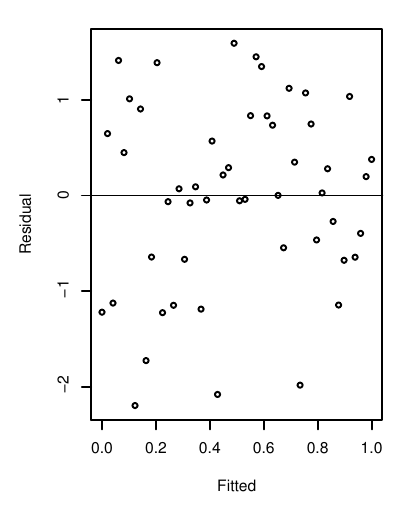
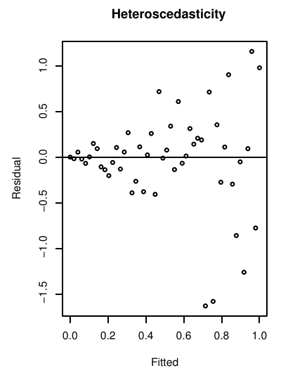
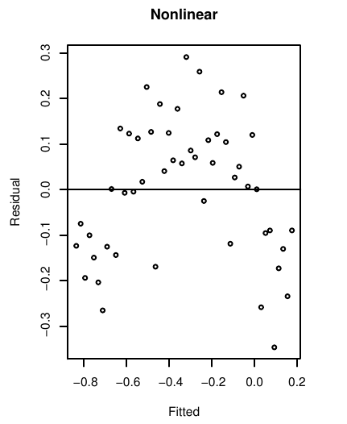
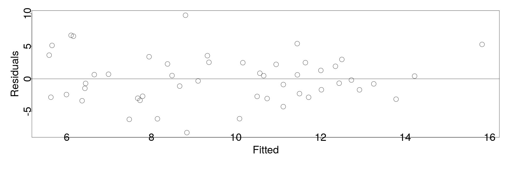
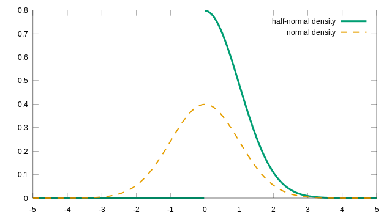
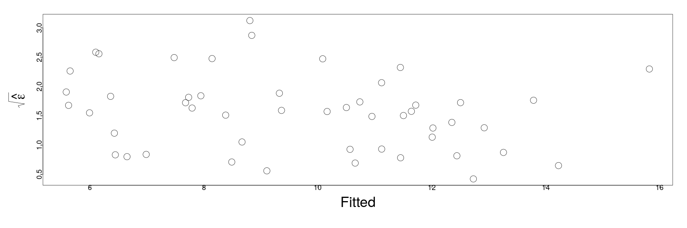
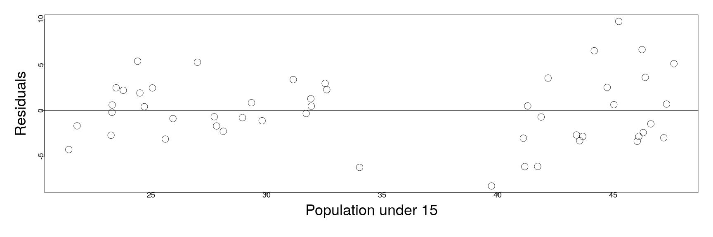
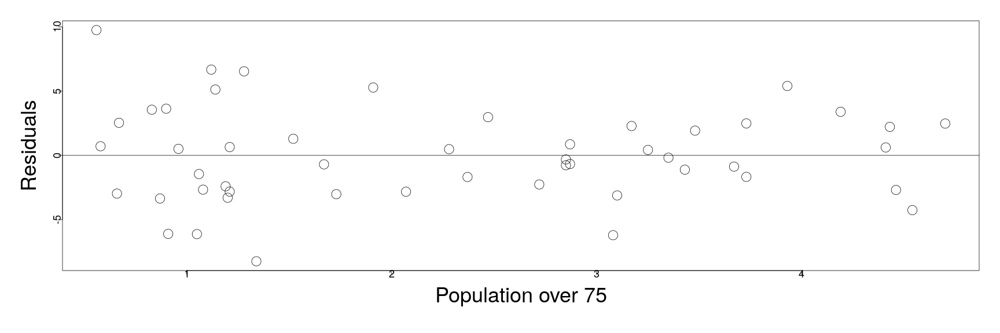
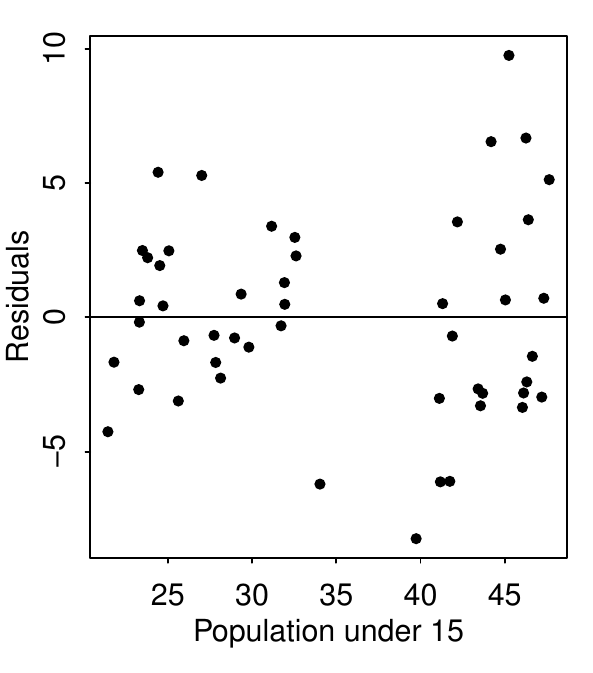

<style>
.section .reveal .state-background {
   background: #ffffff;
}
.section .reveal h1,
.section .reveal h2,
.section .reveal p {
   color: black;
   margin-top: 50px;
   text-align: center;
}
</style>

Diagnostics part 1
========================================================
date: 10/17/2019
autosize: true
incremental: true
width: 1920
height: 1080

<h2 style='color:black'>Instructions:</h2>
<p style='color:black'>Use the left and right arrow keys to navigate the presentation forward and backward respectively.  You can also use the arrows at the bottom right of the screen to navigate with a mouse.<br></p>

========================================================

<h2>Outline</h2>

* The following topics will be covered in this lecture:
  * The iterative process of regression -- a review
  * Diagnostics of three kinds
  * Diagnostics for the error assumptions


========================================================


## Diagnostics

<ul> 
  <li> Our analysis and methodology for:</li>

  <ol>
    <li> fitting a linear model; </li>
    <li> forecasting predictions from a linear model;</li>
    <li> explaning the relationships between variables in a linear model; and</li>
    <li>quantifying the uncertainty of a linear model</li>
  </ol>
</ul>
* all rely on several assumptions, e.g., the conditions for the Gauss Markov theorem and usually Gaussianity of the errors.

* Methods for checking and validating these assumptions are known as <b>diagnostics</b>.

* Typically, we will start with one model as a best first guess.

* Performing diagnostics will reveal issues in the  model, and suggest ways for improvement.

* Building a model is thus usually an interactive, iterative process, where we will create and perform diagnostics over a succession of models.

========================================================

<h3>Constructing a regression model -- an iterative process</h3>
 
 
<div style="float:left; width:30%">
<p style="text-align:center"> Courtesy of: Kutner, M. et al. Applied Linear Statistical Models 5th Edition</p>
</div>
<div style="float:left; width:70%">
<ul>
  <li>Regression analysis is thus an iterative process, which typically follows the flow on the left.</li>
  <li>We must clean the data and perform exploratory analysis to determine relationships between the response, possible predictors, and the between the predictors themselves.</li>
  <li>This exploratory analysis helps us to develop one or more possible regression models for the study.</li>
</ul>
</div>


========================================================

<h3>Constructing a regression model -- an iterative process</h3>
 
 
<div style="float:left; width:50%">
<p style="text-align:center"> Courtesy of: Kutner, M. et al. Applied Linear Statistical Models 5th Edition</p>
</div>
<div style="float:left; width:50%">
<ul>
  <li> From the point of the last diagram, we can take our tenative models and evaluate if they are suitable for the problem and data.</li>
  <li> If not, we revise and repeat.</li>
  <li> If so, we compare the competing models for which one is most robust in our analysis --- particularly, if the model assumptions are well satisfied.</li>
  <li> If we are secure about the robustness of the model, having tested it in various ways, we can make inferences based on the model, such as predictions of future observations.</li>
  <ul>
    <li>Note, even when we feel quite confident in the model, it is key to <b>qualify our inferences by the uncertainty of the model</b>, e.g., providing confidence intervals.</li> 
  </ul>
  <li> The first part of this course has been focused on the situation in which assumptions are well satisfied and there exists a good linear signal in the data.</li>
</ul>
</div>


========================================================

### Diagnostics -- continued

<ul> 
  <li> In the rest of the course, we will consider 3 categories of potential issues with the model:</li>
  <ol>
    <li> Issues with the error/ variation.  Particularly, we have assumed that $\boldsymbol{\epsilon}\sim N(0, \sigma^2 \mathbf{I})$ such that the errors are normally distributed, uncorrelated and of constant variance.</li>
    <li> Issues with the systematic part of the model.  Particularly, we have assumed that there is an actual signal in the data of the form
    $$\begin{align}
    \mathbb{E}[\mathbf{Y}] = \mathbf{X} \boldsymbol{\beta},
    \end{align}$$
    which may not be valid.</li>
    <li> Issues with unusual observations.  Some of the observations may not fit the model, and they might change the choice and the fit of the model</li>
  </ol>
</ul>


========================================================

<h2> Checking error assumptions</h2>

* If we wish to check the assumptions on the error or variation in the signal $\boldsymbol{\epsilon}$, we need to consider, $\boldsymbol{\epsilon}$ itself is not observable.

* <b>Q:</b> What proxy could we consider for the error?

  * <b>A:</b> The residuals are related to the error functionally, but have slightly different properties.
  
* Recall, the definition of $\hat{\mathbf{Y}}$
 
 $$\begin{align}
 \hat{\mathbf{Y}} \triangleq& \mathbf{X}\left(\mathbf{X}^\mathrm{T} \mathbf{X}\right)^{-1} \mathbf{X}^\mathrm{T} \mathbf{Y} \\
  & =\mathbf{H} \mathbf{Y}
 \end{align}$$

* Therefore, if we compute the residuals,

$$\begin{align}
\hat{\boldsymbol{\epsilon}} & = \mathbf{Y} - \hat{\mathbf{Y}} \\
 & =\left(\mathbf{I} - \mathbf{H}\right)\mathbf{Y} \\
 & =\left(\mathbf{I} - \mathbf{H}\right)\mathbf{X} \boldsymbol{\beta} + \left(\mathbf{I} - \mathbf{H}\right)\boldsymbol{\epsilon}
\end{align}$$

========================================================

<h3> Checking error assumptions</h3>

* From the last slide

  $$\begin{align}
  \hat{\boldsymbol{\epsilon}} & =\left(\mathbf{I} - \mathbf{H}\right)\mathbf{X} \boldsymbol{\beta} +  \left(\mathbf{I} - \mathbf{H}\right)\boldsymbol{\epsilon}
  \end{align}$$


* <b>Exercise (1 minute):</b> recalling the definition of $\mathbf{H} = \mathbf{X}\left(\mathbf{X}^\mathrm{T} \mathbf{X}\right)^{-1} \mathbf{X}^\mathrm{T}$, what does $\mathbf{H}\mathbf{X}$ equal to?

* <b>Solution:</b> $\mathbf{H}$ is the projection operator onto the span of the design matrix, and thus $\mathbf{H}\mathbf{X} = \mathbf{X}$ by construction.

* <b>Exercise (1 minute):</b> given the above, what does $\left(\mathbf{I} - \mathbf{H}\right)\mathbf{X}$ equal to?

* <b>Solution:</b> the above must equal zero, as $\mathbf{I}\mathbf{X} = \mathbf{H}\mathbf{X} = \mathbf{X}$.

========================================================

<h3> Checking error assumptions</h3>


* From the previous two exercises, we can deduce,

  $$\begin{align}
  \hat{\boldsymbol{\epsilon}} = \left(\mathbf{I} - \mathbf{H}\right)\boldsymbol{\epsilon}
  \end{align}$$

* We take the <b>assumption</b> that $\boldsymbol{\epsilon}\sim N(0, \mathbf{I} \sigma^2)$, 
  * <b>Exercise (1 minute):</b> given the above assumption, what is the mean of $\hat{\boldsymbol{\epsilon}}$?
  
  * <b>Solution:</b> 
  
  $$\begin{align}
  \mathbb{E}[\hat{\boldsymbol{\epsilon}}] &= \mathbb{E}\left[\left(\mathbf{I} - \mathbf{H}\right)\boldsymbol{\epsilon}\right] \\
  &=\left(\mathbf{I} - \mathbf{H}\right)\mathbb{E}\left[\boldsymbol{\epsilon}\right]\\
  &= 0
  \end{align}$$
  
  * <b>Exercise (3 minutes):</b> given the above assumption, what is the covariance of $\hat{\boldsymbol{\epsilon}}$?
  
  * <b>Answer:</b> 
  
  $$\begin{align}
  \mathbb{E}\left[\left(\hat{\boldsymbol{\epsilon}}\right) \left(\hat{\boldsymbol{\epsilon}}\right)^\mathrm{T}\right] &= \mathbb{E}\left[\left(\left(\mathbf{I} - \mathbf{H}\right)\boldsymbol{\epsilon}\right)\left(\left(\mathbf{I} - \mathbf{H}\right)\boldsymbol{\epsilon}\right)^\mathrm{T}\right] \\
  &=\mathbb{E}\left[\left(\mathbf{I} - \mathbf{H}\right)\boldsymbol{\epsilon}\boldsymbol{\epsilon}^\mathrm{T}\left(\mathbf{I} - \mathbf{H}\right)^\mathrm{T}\right]\\
  &=\left(\mathbf{I} - \mathbf{H}\right)\mathbb{E}\left[\boldsymbol{\epsilon}\boldsymbol{\epsilon}^\mathrm{T}\right]\left(\mathbf{I} - \mathbf{H}\right)^\mathrm{T}\\
 & =\left(\mathbf{I} - \mathbf{H}\right)\left[\sigma^2 \mathbf{I}\right]\left(\mathbf{I} - \mathbf{H}\right)\\
 &=\sigma^2\left(\mathbf{I} - \mathbf{H}\right)
  \end{align}$$
  
========================================================

<h3> Checking error assumptions</h3>


* <b>Q:</b> Why is the last slide relevant?  Particularly, why should we be concerned with the covariance of the residuals?

  * <b>A:</b> If the assumptions hold for $\boldsymbol{\epsilon}$, then we can compare the coviance of the <b>residuals</b> to their theoretical value $\sigma^2\left(\mathbf{I} - \mathbf{H}\right)$ for consistency.
  
  * Occasionally, we might actually have prior knowledge about the value of $\sigma^2$ which we can evaluate directly.
  
  * Otherwise, we have an unbiased estimator for $\sigma^2$ in terms of 
  $$\hat{\sigma}^2 = \frac{RSS}{n-p}$$
  which we can compare with the observed covariance of the residuals.
  
* Note, even though the errors are assumed to be independent and of equal variance $\sigma^2$, the same doesn't hold for the residuals.

  * In particular, the operator $\mathbf{I} - \mathbf{H}$ is not generally diagonal (such that the residuals have correlation); nor are the diagonal values equal (so that the variances don't all match).
  
* Nonetheless, we use the residuals to underrstand how the true errors are behaving, which are unobservable.

========================================================

<h2>Visual diagnostics</h2>

<div style="float:left; width:40%">

<p style="text-align:center">Courtesy of: Faraway, J. Linear Models with R. 2nd Edition</p>
</div>

<div style="float:left; width:60%">
<ul>
  <li> To the left is a plot where:</li>
  <ol>
    <li> The horizontal (x-axis) represents the fitted value $\hat{\mathbf{Y}}$, as in some model $\hat{\mathbf{Y}}=\mathbf{X}\hat{\boldsymbol{\beta}}$.</li>
    <li> The vertical axis (y-axis) represents the corresponding residual $\hat{\boldsymbol{\epsilon}}$ value, equal to $\mathbf{Y} - \hat{\mathbf{Y}}$.
  </ol>
  <li>Suppose that the variances of the error $\boldsymbol{\epsilon}$ are <b>not fixed</b>, i.e.,</li> 
    <ul>
      <li> suppose that <b>some</b> observations have <b>more</b> variation and <b>some</b> observations have <b>less</b> variation around the signal, $\mathbf{X}\boldsymbol{\beta}$. </li>
    </ul>
  <li>In this case, there is <b>dependence</b> of the variation (or error $\boldsymbol{\epsilon}$) on the <b>observation</b>.</li>
  <li> To the left, this is actuall a <b>well behaved</b> situation.  In particular, the residuals show variation that doesn't seem to depend on the value of the fitted value/ observation.</li>
  <li> The mean of the residuals appears to be zero as well, because there isn't a clear preference for positive or negative residuals</li>
  <li> The situation to the left is denoted <b> homoscedasticity.</b></li>
  <li> Later, we will develop tests to determine if the variance is "close-enough-to-constant", so that we are satisfied.</li>
  <li>On the other hand, if there are non-constant variances (as discussed above), this will often show up as a pattern in the plot to the left.</li> 
</ul>
</div>

========================================================

### Visual diagnostics

<div style="float:left; width:40%">

<p style="text-align:center">Courtesy of: Faraway, J. Linear Models with R. 2nd Edition</p></div>

<div style="float:left; width:40%">
<ul>
  <li> The non-constant variance of $\hat{\boldsymbol{\epsilon}}$ to the left is known as <b>heteroscedasticity</b>.</li>
  <li> In this case, there is a clear dependence on the <b>variation</b> of $\hat{\boldsymbol{\epsilon}}$ on the fitted value/ the observation.</li>
  <li> Breaking the constant variance assumption, the Gauss-Markov theorem no longer applies</li>
  <li> Heteroscedasticity does not, in itself, cause ordinary least squares coefficient estimates to be biased;</li>
  <li> however, the theoretical estimates of the variance of the residuals (and therefore the standard errors) will become biased.</li>
</ul>
</div>

========================================================
### Visual diagnostics

<div style="float:left; width:40%">

<p style="text-align:center">Courtesy of: Faraway, J. Linear Models with R. 2nd Edition</p>
</div>

<div style="float:left; width:60%">
<ul>
  <li> The bias in the standard errors complicates our ability to accurate quantify the uncertainty, and therefore to accurately:</li>
  <ol>
    <li> make hypothesis tests on the parameters for significance;</li>
    <li> provide confidence intervals for the parameters</li>
    <li> provide accurate prediction intervals and confidence intervals for the  mean response;</li>
    <li> provide explanatory power in the relationship between the response and the explanatory variables.</li>
  </ol>
</ul>
</div>

========================================================
### Visual diagnostics

<div style="float:left; width:40%">

<p style="text-align:center">Courtesy of: Faraway, J. Linear Models with R. 2nd Edition</p>
</div>

<div style="float:left; width:60%">
<ul>
<li> Using the same plot as before, we can likewise determine if there is actually nonlinearity in the residuals.</li>
<li> The plot at the left exhibits a nonlinear dependence of the residual on the fitted/ observed values</li>
<li> The same technique can also be used replacing the fitted values $\hat{\mathbf{Y}}$ in the horizontal axis with any other variable in the model $\mathbf{X}_i$, to determine dependence of the residual on the explanatory variables</li>
<li> Additionally, we may consider how the residual varies across variables $\mathbf{X}_i$ that we have data for, but have not included as explanatory variables on the response.</li>
<li>If there is a dependence structure for the residuals on the variable that was left out of the model, it suggests that we should consider its impact on the response and/or if it is a variable that is tightly correlated with our existing model variables.</li>
</ul>

========================================================

<h2>An example of non-constant variance</h2>

* We will consider the "savings" dataset, listing the average savings rate, age demographics and per capita incomes of fifty countries averaged over 1960 -1970.


```r
library("faraway")
head(savings)
```

```
             sr pop15 pop75     dpi ddpi
Australia 11.43 29.35  2.87 2329.68 2.87
Austria   12.07 23.32  4.41 1507.99 3.93
Belgium   13.17 23.80  4.43 2108.47 3.82
Bolivia    5.75 41.89  1.67  189.13 0.22
Brazil    12.88 42.19  0.83  728.47 4.56
Canada     8.79 31.72  2.85 2982.88 2.43
```

* <b>sr</b> - is the savings rate, calculated as personal savings divided by disposable income;

* <b>pop15</b> - is the percent of the countrys' populations under age 15;
 
* <b>pop75</b> - is the percent of the countrys' populations over age 75;
 
* <b>dip</b> - is the per-capita disposable income in dollars;

* <b>ddpi</b> - is the percent growth rate of dpi.


```r
lmod_savings <- lm(sr ~ pop15+pop75+dpi+ddpi,savings)
```


========================================================
### Savings data example

* With this model, we plot the residuals versus the fitted values:

```r
par(mai=c(1.5,1.5,.5,.5), mgp=c(3,0,0))
plot(fitted(lmod_savings),residuals(lmod_savings),xlab="Fitted",ylab="Residuals", cex=3, cex.lab=3, cex.axis=3) 
abline(h=0)
```


* From the initial inspection, we do not notice anything particularly structured about the residuals -- indeed they are roughly symmetric around zero and in the fitted value.

========================================================
### Half normal distributions

<div style="float:left; width:60%">

Courtesy of Nagelum <a href="https://creativecommons.org/licenses/by-sa/4.0" target="blank">CC BY-SA 4.0</a> via Wikimedia Commons 
</div>

<div style="float:left; width:40%">
<ul>
 <li> Therefore, to investigate the constant variance assumption more closely, we will "zoom" in on the residuals.</li>
 <li> In particular, we will consider the plot of the square root of the absolute residuals, i.e.,
 $$\begin{align}
 \sqrt{\vert\hat{\boldsymbol{\epsilon}}\vert}
 \end{align}$$
 </li>
 <li> Under the assumption $\boldsymbol{\epsilon}\sim N(0, \mathbf{I}\sigma^2)$, the values of $\vert\hat{\boldsymbol{\epsilon}}\vert$ are distribted according to the half normal distribution
 <ul>
  <li> the relationship between the normal distribution and the corresponding half-normal distribution is illustrated on the left.</li>
 </ul>
 <li> Having excluded the nonlinearity expressed in other plots, we will focus on the absolute values to increase the resolution of the residuals as a response of the fitted values. </li>
 </ul>
</div>
<div style="width:100%; float:left">
 <li> However, the half normal distribution is very skewed, so we make a change of scale with the square root of the absolute values in order to keep it well behaved.</li>
</ul>
</div>

========================================================
### Savings data example

* In the case below, we plot $\sqrt{\vert\hat{\boldsymbol{\epsilon}}\vert}$ versus the fitted values


```r
par(mai=c(1.5,1.5,.5,.5), mgp=c(3,0,0))
plot(fitted(lmod_savings),sqrt(abs(residuals(lmod_savings))), xlab="Fitted",ylab=expression(sqrt(hat(epsilon))), cex=3, cex.lab=3, cex.axis=1.5)
```



* We note in this case as well (irrespectively of sign) the residuals have approximately even variation.


========================================================
### Testing for linear dependence in the residuals

* We have largely excluded the presence of nonlinear structure in the residuals.

* Suppose, on the other hand, there might be a (non-trivial) linear relationship between the (square-root-absolute) residuals and the fitted values.

* This can be written in the form,
  $$\begin{align}
  \sqrt{\vert\hat{\boldsymbol{\epsilon}}\vert} = \gamma_0 + \gamma_1 \hat{\mathbf{Y}} + \epsilon^\ast 
  \end{align}$$

* <b>Q:</b> how can we test for a linear relationship between the fitted values and the (square-root-absolute) residuals?

* <b>A:</b> we will consider the linear model with $\sqrt{\vert\hat{\boldsymbol{\epsilon}}\vert}$ as the response and $\hat{\mathbf{Y}}$ as the explanatory variable:


```r
lmod <- lm(sqrt(abs(residuals(lmod_savings))) ~ fitted(lmod_savings))
```

========================================================
### Testing for linear dependence in the residuals


```r
summary(lm(sqrt(abs(residuals(lmod_savings))) ~ fitted(lmod_savings)))
```

```

Call:
lm(formula = sqrt(abs(residuals(lmod_savings))) ~ fitted(lmod_savings))

Residuals:
     Min       1Q   Median       3Q      Max 
-1.04038 -0.55845  0.01888  0.32129  1.50106 

Coefficients:
                     Estimate Std. Error t value Pr(>|t|)    
(Intercept)           2.16216    0.34788   6.215 1.17e-07 ***
fitted(lmod_savings) -0.06137    0.03476  -1.766   0.0838 .  
---
Signif. codes:  0 '***' 0.001 '**' 0.01 '*' 0.05 '.' 0.1 ' ' 1

Residual standard error: 0.6341 on 48 degrees of freedom
Multiple R-squared:  0.06099,	Adjusted R-squared:  0.04142 
F-statistic: 3.117 on 1 and 48 DF,  p-value: 0.08382
```


* We remark that we should perform weighting and adjustment of the degrees of freedom in the model but, naively, this can be used as a test for a linear relationship in the data between the residual and fitted values.

* From the summary, we find that the fitted values are not statistically significant at $5\%$ in explaining the residuals, and moreover, the R-squared is extremely small.

* Particularly, we cannot reject the null model that residuals simply vary randomly about their mean.

========================================================
### Testing for linear dependence in the residuals

* The previous numerical test only looked at the linear relationship between the residuals and the fitted values.

  * If we hadn't tested for a nonlinear relationship as in the first graphical plot, we could not rule this out with the linear model test.
  
*  If we thought there was a particular type of non-constant variance, we may be able to use more exact statistical methods.  

  * This would consist of accepting or rejecting a particular type of non-constant variance.

* However, plotting the residuals is a more general approach that is versatile in detecting many types of issues at once, so we emphasize this.

  * If there is something that looks suspicious, we can perform more formal tests to validate or invalidate the potential issue.

========================================================
### Plotting rediduals versus predictors

* We will now consider the plot of the residual versus the explanatory variables of the model:


```r
par(mai=c(1.5,1.5,.5,.5), mgp=c(3,0,0))
plot(savings$pop15,residuals(lmod_savings), xlab="Population under 15", ylab="Residuals", cex=3, cex.lab=3, cex.axis=1.5)
abline(h=0)
```



* We note that there are two distinct groups illustrated in the population below 15, 

========================================================
### Plotting rediduals versus predictors


* while on the other hand, the residuals are of uniform variation with respect to the values for the population over 75.


```r
par(mai=c(1.5,1.5,.5,.5), mgp=c(3,0,0))
plot(savings$pop75,residuals(lmod_savings),xlab="Population over 75",ylab="Residuals", cex=3, cex.lab=3, cex.axis=1.5)
abline(h=0)
```



* We are motivated thus to determine if there is non-constant variance in the residuals with respect to the pop15 predictor...

========================================================
<h2>The F-test for variance</h2>

*  Suppose we have two independent samples from two Gaussian distributions of unknown variances respectively, i.e.,

  $$\begin{align}
 &N(\mu_x ,  \sigma^2_x)  & &
 N(\mu_z ,  \sigma^2_z)  
\end{align}$$

  * For $m,n>1$, the samples are given respectively as $\left\{x_i\right\}_{i=1}^n$ and $\left\{z_i\right\}_{i=1}^m$.

* Then, we may compute the <b>sample-based means</b> of the two distributions above as,

$$\begin{align}
\overline{x} &\triangleq \frac{1}{n}\sum_{i=1}^n x_i & &
\overline{z} \triangleq \frac{1}{m}\sum_{i=1}^m z_i
\end{align}$$

* And likewise, we can compute the <b>sample-based variances</b> as,

$$\begin{align}
S_x^2 \triangleq &  \frac{1}{n-1} \sum_{i=1}^n\left(x_i - \overline{x}\right)^2 & &
S_z^2 \triangleq \frac{1}{m-1}\sum_{i=1}^m \left(z_i - \overline{z}\right)^2
\end{align}$$


========================================================

<h2> F-test continued...</h2>


 <div style="float:left; width:50%">

<p style="text-align:center">
Courtesy of IkamusumeFan <a href="https://creativecommons.org/licenses/by-sa/4.0" target="blank">CC BY-SA 4.0</a></p></div>
<div style="float:right; width:50%">

<ul>
  <li> Consider the following null and alternative hypothesis:
  $$\begin{align}
  H_0 : &\sigma^2_x = \sigma^2_z \\
  H_1 : & \sigma^2_x \neq \sigma^2_z
  \end{align}$$
  </li>
<li> Under the previous assumptions, and the null hypothesis $H_0$, the <b>ratio</b> of the two sample based variances is an F-statistic

  $$\begin{align}
  \frac{S_x^2}{S_z^2}\sim F_{(n-1,m-1)}
\end{align}$$
</li>
<li> If the p-value of the above ratio is greater than the pre-specified significance ($5\%$ typically) then we fail to reject the null hypothesis, i.e., $\sigma^2_x = \sigma^2_z$.
</ul>
</div>

========================================================

<h2> Returning to the regression analysis...</h2>
<div style="float:left; width:40%">

<p style="text-align:center">Courtesy of: Faraway, J. Linear Models with R. 2nd Edition</p>
</div>
<div style="float:left; width:60%">
<ul>
 <li> We wish to determine if there is non-constant variance in the residuals with respect to the values of the explanatory variable "pop15".</li>
 <li> This is of course, a violation of the Gauss-Markov theorem assumptions.  We want to test this concretely with the F-test for variances.</li>
 <li> As in the notation of the F-test described earlier, we take
   <ul>
    <li> $\left\{x_i \right\}_{i=1}^n$ will be the residuals, only for the observations which correspond to a country with the percent of population under 15, <b>less</b> than $35\%$;</li>
    <li> $\left\{z_i \right\}_{i=1}^m$ will be the residuals, only for the observations which correspond to a country with the percent of population under 15, <b>greater</b> than $35\%$.</li> 
    </ul>
 </li>
 <li> Then assuming that both sample populations are normally distributed with unknown variance, we will use an F-test to determine if the variances are equal.</li>
</ul>
</div>

========================================================
### Testing for constant variance


* We perform the above F-test in the following code:


```r
var.test(residuals(lmod_savings)[savings$pop15>35], residuals(lmod_savings)[savings$pop15<35])
```

```

	F test to compare two variances

data:  residuals(lmod_savings)[savings$pop15 > 35] and residuals(lmod_savings)[savings$pop15 < 35]
F = 2.7851, num df = 22, denom df = 26, p-value = 0.01358
alternative hypothesis: true ratio of variances is not equal to 1
95 percent confidence interval:
 1.240967 6.430238
sample estimates:
ratio of variances 
          2.785067 
```

* We see two dual measures for the F-test of variances above:

  * Firstly, the p-value is less than $2\%$ so we reject the null hypothesis (equal variances) with $5\%$ significance.
  
  * Secondly, the $95\%$ confidence interval <b>for the ratio of variances</b> excludes one, such that with $95\%$ confidence we exclude the possibility  that their variances are equal.
  
