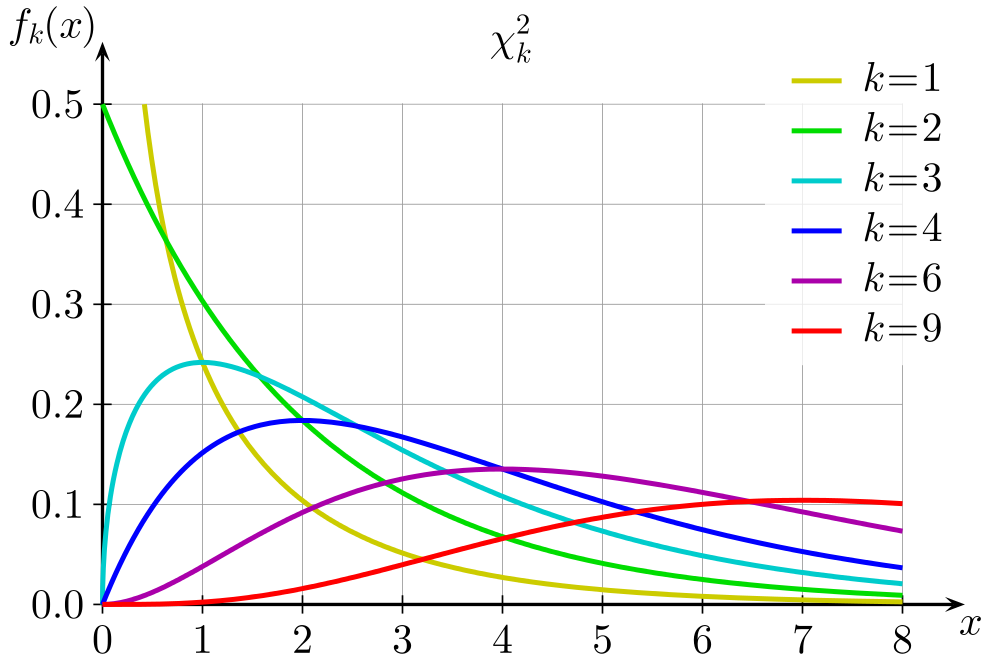
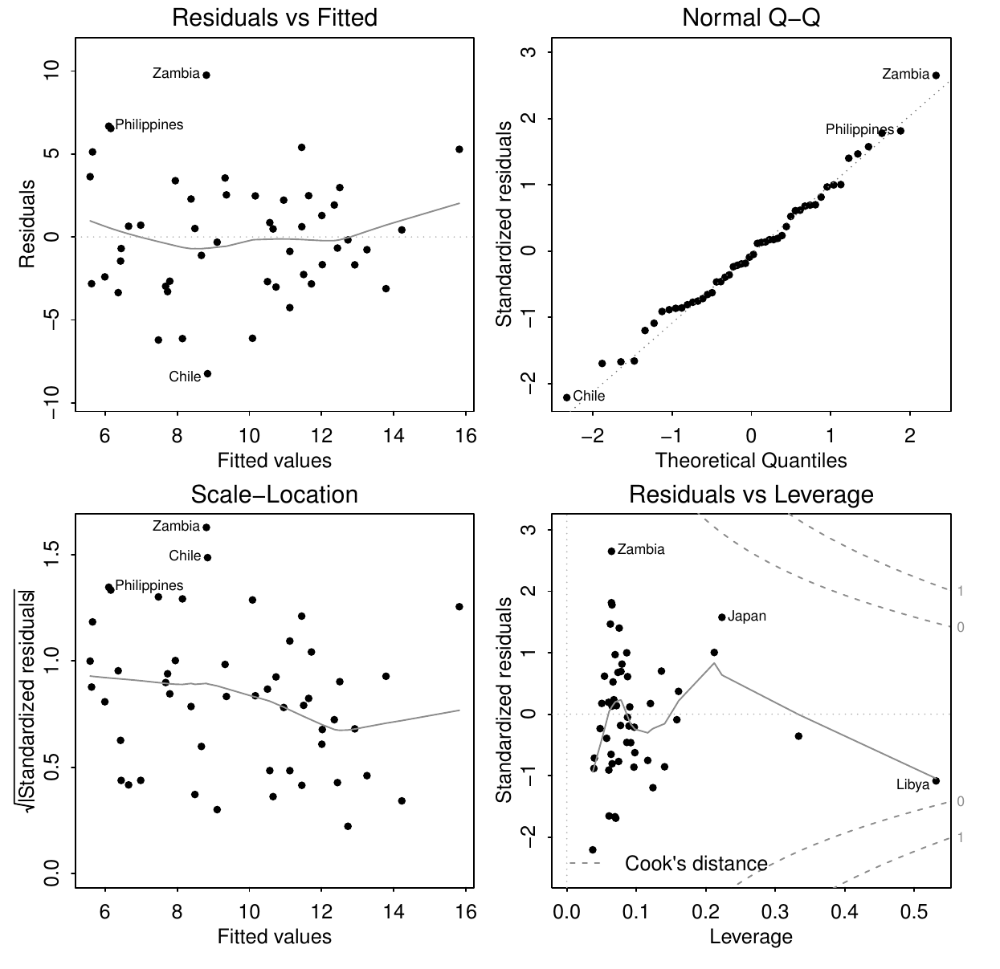

<style>
.section .reveal .state-background {
   background: #ffffff;
}
.section .reveal h1,
.section .reveal h2,
.section .reveal p {
   color: black;
   margin-top: 50px;
   text-align: center;
}
</style>

Diagnostics part 3
========================================================
date: 10/24/2019
autosize: true
incremental: true
width: 1920
height: 1080

<h2 style='color:black'>Instructions:</h2>
<p style='color:black'>Use the left and right arrow keys to navigate the presentation forward and backward respectively.  You can also use the arrows at the bottom right of the screen to navigate with a mouse.<br></p>

========================================================

### A review of diagnostics

<ul> 
  <li> We will consider 3 categories of potential issues with the model:</li>
  <ol>
    <li> Issues with the error/ variation.  Particularly, we have assumed that $\boldsymbol{\epsilon}\sim N(0, \sigma^2 \mathbf{I})$ such that the errors are normally distributed, uncorrelated and of constant variance.</li>
    <li> Issues with the systematic part of the model.  Particularly, we have assumed that there is an actual signal in the data of the form
    $$\begin{align}
    \mathbb{E}[\mathbf{Y}] = \mathbf{X} \boldsymbol{\beta},
    \end{align}$$
    which may not be valid.</li>
    <li> Issues with unusual observations.  Some of the observations may not fit the model, and they might change the choice and the fit of the model</li>
  </ol>
</ul>


========================================================

<h2> Correlated Errors</h2>

* There aren't very general methods for testing for the correlation of the errors $\boldsymbol{\epsilon}$, i.e.,

  * let 
  
   $$\begin{align}
    cov\left(\boldsymbol{\epsilon}\right)\triangleq &\mathbb{E}\left[\boldsymbol{\epsilon} \boldsymbol{\epsilon}^\mathrm{T}\right] = \boldsymbol{\Sigma}^2,
    \end{align}$$ 
  
  then it is difficult generally to test based on the residuals if the non-diagonal entries of $\boldsymbol{\Sigma}$ are non-zero.
  
  * That is, whether we can even write 
  
  $$\boldsymbol{\Sigma}^2 = 
  \begin{pmatrix}
    \sigma_1^2 & 0 & \cdots & 0 \\    
    0 & \sigma_2^2 & \cdots & \vdots \\
    \vdots & \ddots & \ddots & \vdots \\
    0 & 0 & \cdots & \sigma_n^2
  \end{pmatrix}$$
  for possibly different $\sigma_i$, but strictly diagonal.


========================================================

### Correlated errors 
   
  * Recall that even when $\boldsymbol{\Sigma}^2 = \sigma^2 \mathbf{I}$, the residuals are not generally uncorrelated as,
  
  $$\begin{align}
  cov \left( \hat{\boldsymbol{\epsilon}} \right) = \sigma^2 \left(\mathbf{I} - \mathbf{H}\right)
  \end{align}$$
  
* Therefore, we must usually anticipate the issues from the structure of the problem itself, e.g,
<ol>
  <li>in time series problems, we shoud check for time correlation of the errors; </li>
  <li>in spatial data, we should check for correlation in the errors spatially;</li>
  <li>data collected in particular batches should be checked for correlations between observations within particular batches;</li>
  <li>etc...</li>
</ol>
    
* Typically, this will include (as usual) a mixture of visual inspection to feel the data for issues, and numerical verification of our intuition.

========================================================

<h3> An example of time-correlated errors </h3>

<div style="float:left; width:50%">


<p style="text-align:center">
  Ice core sample hole. Image courtesy of <a href="https://www.ncdc.noaa.gov/news/what-are-proxy-data" target="blank">NOAA - National Centers for Environmental Information</a></p>
</div>

<div style="float:left; width:50%">
<ul>
<li> If we wish to model and understand the changing climate, we must bear in mind that there are only accurate measures of temperatures available since the early 1850's.</li>
<li> To estimate the average land surface temperature in a region for dates further back in time, we can use proxy data including, e.g,</li>

  <ol>
  <li> tree rings, which show the relative intensity of winters, summers and precipitation;</li>
  <li> ice core samples, which give stratified layers demonstrating the relative intensity of summer melting and precipitation events;</li>
  <li> corals, which by chemical properties of their skeletons can be used to estimate the ocean temperature in which they formed;</li>
  <li> and others...</li>
  </ol>
</ul>
</div>
<ul>
<li> In this context, we can consider building a linear model for the average northern hemisphere surface temperature as the response, with the proxy data as the explanatory variables.</li>
<li> Fitting the relationship where there are reliable observations of the temperature, we can predict the average surface temperature when we lack these futher back in time, based upon the proxies which extend much further.</li>
</ul>


========================================================

### An example of correlated errors

* We will use the data from Faraway, Globwarm,


```r
library("faraway")
head(globwarm, 4)
```

```
     nhtemp  wusa jasper westgreen chesapeake tornetrask urals mongolia
1000     NA -0.66  -0.03      0.03      -0.66       0.33 -1.49     0.83
1001     NA -0.63  -0.07      0.09      -0.67       0.21 -1.44     0.96
1002     NA -0.60  -0.11      0.18      -0.67       0.13 -1.39     0.99
1003     NA -0.55  -0.14      0.30      -0.68       0.08 -1.34     0.95
     tasman year
1000  -0.12 1000
1001  -0.17 1001
1002  -0.22 1002
1003  -0.26 1003
```

* <b>nhtemp</b> - is the average northern hemisphere temperature, in degrees celcius, which only has data available back to 1856 (thus the NA values).

* <b>westgreen</b> - is the ice core proxy information from western Greenland.

* <b>chesapeake</b> - is sea shell proxy information from Chesapeake Bay.

* <b>tornetrask</b> - is tree ring proxy information from Sweden.

* <b>urals</b> - is tree ring proxy information from the Ural mountains.

========================================================

### An example of correlated errors


```r
tail(globwarm, 4)
```

```
     nhtemp wusa jasper westgreen chesapeake tornetrask urals mongolia
1997   0.48 0.82   0.35     -0.23      -0.32       0.56   0.6     1.33
1998   0.66 0.82   0.34     -0.21      -0.07       0.44   0.6     1.30
1999   0.46 0.84   0.32     -0.20       0.17       0.37   0.6     1.24
2000   0.40 0.88   0.31     -0.19       0.39       0.34   0.6     1.13
     tasman year
1997   0.50 1997
1998   0.49 1998
1999   0.49 1999
2000   0.50 2000
```

* <b>mongolia</b> - is tree ring proxy information from Mongolia.

* <b>tasman</b> - is tree ring proxy information from Tasmania.

* In the tail, we have accurate temperature measurements into the year 2000.

* The default behavior in R is to omit any lines where there are missing values, so we can fit the model directly only on the years 1856-2000 as below:


```r
lmod <- lm(nhtemp ~ wusa + jasper + westgreen + chesapeake + tornetrask + urals + mongolia + tasman, globwarm)
```

========================================================

### An example of correlated errors


* <b>Q:</b> What kind of plot would make sense in this instance to study the <emph>time-correlation</emph> of the errors?

* <b>A:</b> we can once again plot the residuals, but in this context versus the time variable


```r
par(mai=c(1.5,1.5,.5,.5), mgp=c(3,0,0))
plot(residuals(lmod) ~ year, na.omit(globwarm), ylab="Residuals", cex=3, cex.lab=3, cex.axis=1.5)
abline(h=0)
```


* <b>Q:</b> do we detect any structure to the residuals?

========================================================

### An example of correlated errors


* Given the last diagnostic, it appears that the residuals are positively correlated in time, 
  
  * that is, the residual in the last time step appears to largely be similar to the outcome of the subsequent.

*  Therefore, we will plot the residual one step in time forward as a function of the residual one step in time backward: 


```r
par(mai=c(1.5,1.5,.5,.5), mgp=c(3,0,0))
n <- length(residuals(lmod))
plot(tail(residuals(lmod),n-1) ~ head(residuals(lmod),n-1), xlab=expression(hat(epsilon)[i]),ylab=expression(hat(epsilon)[i+1]),  cex=3, cex.lab=3, cex.axis=1.5)
abline(h=0,v=0,col=grey(0.75))
```


========================================================

### An example of correlated errors


* The former plot strongly suggests a linear relationship between the residuals between subseqent time steps.
 
  * We note that in the former plot, the intercept term is zero as the residuals have mean zero.
  
* To verify our visual inspection numerically, we fit a linear model (without intercept) for the plot studied earlier:


```r
sumary(lm(tail(residuals(lmod),n-1) ~ head(residuals(lmod),n-1) -1))
```

```
                             Estimate Std. Error t value  Pr(>|t|)
head(residuals(lmod), n - 1) 0.595076   0.069312  8.5855 1.391e-14

n = 144, p = 1, Residual SE = 0.13918, R-Squared = 0.34
```

* The $R^2$ value is somewhat small in this case, indicating that the variation of the trend isn't fully explained by the linear relationship.

* However, the p-value indicates that there is some relationship between the residuals at consecutive time steps;

  * particularly, it strongly suggests time-correlation of the residuals (and errors).

========================================================

<h3> Durbin-Watson test </h3>

* If we wish to evaluate the previous question formally in terms of hypothesis testing, we can consider the Durbin-Watson test.

* Generally speaking, the Durbin-Watson test is a test-statistic to study the auto-correlation, lag 1 in the residuals, from a regression analysis.

* Suppose we have a linear relationship defined in terms of the lag 1 residuals, i.e.,

  $$\begin{align}
  \hat{\boldsymbol{\epsilon}}_t = \rho  \hat{\boldsymbol{\epsilon}}_{t-1} + \nu_t
  \end{align}$$
  
  where:
  <ol>
    <li>$\hat{\boldsymbol{\epsilon}}_t$ is the residual at time $t$ in the time series;</li>
    <li>$\hat{\boldsymbol{\epsilon}}_{t-1}$ is the residual at the time measured one step before;</li>
    <li>$\rho$ is a constant scalar, giving the slope of the relationship; and</li>
    <li>$\nu_t$ is the random variation around the linear signal between time steps.</li>
  </ol>
  
========================================================

### Durbin-Watson test

<div style="float:left; width:50%">

Image courtesy of Geek3 <a href="https://creativecommons.org/licenses/by/3.0" target="blank">CC BY 3.0</a> via Wikimedia Commons.
</div>
<div style="float:left; width:50%">
<ul>
<li> Given the lag-one autocorrelation model in the residuals, $\hat{\boldsymbol{\epsilon}}_t = \rho  \hat{\boldsymbol{\epsilon}}_{t-1} + \nu_t$, we will consider the following hypotheses:</li>

<li>
  $$\begin{align}
  H_0: &\rho = 0 \\
  H_1: &\rho \neq 0
  \end{align}$$
  
  where the null corresponds to the absence of a time-correlation of the residuals.</li>
<li> Under the null hypothesis, the following,

  $$\begin{align}
  DW \triangleq \frac{\sum_{i=2}^n \left(\hat{\boldsymbol{\epsilon}}_{i} - \hat{\boldsymbol{\epsilon}}_{i-1}\right)^2 }{\sum_{i=1}^n \hat{\boldsymbol{\epsilon}}_i^2}
  \end{align}$$
  is distributed according to a linear combination of $\chi^2$ distributions (example Chi-squared distributions pictured left).
</ul>  
</div>

========================================================

### Durbin-Watson test

* In R, we can perform the test using the package "lmtest"


```r
require("lmtest")
dwtest(nhtemp ~ wusa + jasper + westgreen + chesapeake + tornetrask + urals + mongolia + tasman, data=globwarm)
```

```

	Durbin-Watson test

data:  nhtemp ~ wusa + jasper + westgreen + chesapeake + tornetrask +     urals + mongolia + tasman
DW = 0.81661, p-value = 1.402e-15
alternative hypothesis: true autocorrelation is greater than 0
```

* The p-value is effectively zero, so we can conclude with almost $100\%$ confidence that the errors are time-correlated.

* We will evaluate later how to deal with some of the issues with correlation in errors with generalized least squares.


========================================================

<h2> Unusual observations</h2>

* We saw outliers earlier in the "fat" data, generated by, e.g.,  measurement error/ incorrectly input data (the 2.5' 200lb individual):
  

```r
par(mai=c(1.5,1.5,.5,.5), mgp=c(3,0,0))
hist(fat$height, xlab = "Height in inches", main="",  cex=3, cex.lab=3, cex.axis=1.5)
```


and extreme/ abnormal cases (the 350+ lbs individual):


```r
par(mai=c(1.5,1.5,.5,.5), mgp=c(3,0,0))
hist(fat$weight, xlab = "Weight in lbs", main="",  cex=3, cex.lab=3, cex.axis=1.5)
```


  
========================================================

### Unusual observations

* Unusual observations can have a dramatic impact on the performance of a regression model.

* Outliers are those observations that don't fit the overall trend or the linear model well.

* Some observations can have their own dramatic impact on the performance of the model,
  
  * we denote these observations <b>influential observations</b>

* It is possible that an observation is either, both or neither an outlier or influential.

* A <b>leverage point</b> is an extreme value of one of the <em>explanatory variables</em>, that has <em>potential</em> to influence the fit of the model.

* It is important to identify any of the above such points, but the choice of what to do with them depends strongly on the problem at hand.

========================================================

<h3>Leverage</h3>

* We will first study the leverage points. 

* Recall the "hat" matrix that projects the observations into the space of the explanatory variables,

  $$\begin{align}
  \mathbf{H}&\triangleq \mathbf{X}\left(\mathbf{X}^\mathrm{T}\mathbf{X} \right)^{-1}\mathbf{X}^\mathrm{T}
  \end{align}$$

* Usign the hat matrix, we define the fitted values via the relationship,

  $$\begin{align}
  \hat{\mathbf{Y}} = \mathbf{H}\mathbf{Y}.
  \end{align}$$

* Therefore, consider the derivative of the $i$-th fitted value $\hat{\mathbf{Y}}_i$ with respect to the $j$-th observation of the response,

  $$\begin{align}
  \partial_{\mathbf{Y}_j} \mathbf{Y}_i &= \partial_{\mathbf{Y}_j} \left(\mathbf{H} \mathbf{Y}\right) \\
  & =\mathbf{H}_{ij}.
  \end{align}$$
  
* Thus, the <b>sensitivity</b> of the $i$-th fitted value (prediction) with respect to the $j$-th observed value is given precisely by the entry $(i,j)$ of the hat matrix, $\mathbf{H}_{ij}$.  

* For this reason, the entries of the projection operator $\mathbf{H}$ can be considered to be,

  1. $\mathbf{H}_{ii}$ --- the <b>self-sensitivity or leverage</b> of the fitted value $\hat{\mathbf{Y}}_{i}$ with respect to the variation of the observation $\mathbf{Y}_i$; while
  
  2. $\mathbf{H}_{ij}$ --- the <b>cross-sensitivity</b> of the fitted value $\hat{\mathbf{Y}}_{i}$ with respect to the variation of the observation $\mathbf{Y}_j$.

========================================================

### Leverage
  
* Recall that, under the condition of $\boldsymbol{\epsilon}\sim N\left(0,\sigma^2 \mathbf{I}\right)$

  $$\begin{align}
  cov\left(\hat{\boldsymbol{\epsilon}}\right) = \sigma^2\left(\mathbf{I} - \mathbf{H}\right)
  \end{align}$$
  
* Denote the $i$-th self-sensitivty or leverage,

  $$\begin{align}
  h_i \triangleq \mathbf{H}_{ii} 
  \end{align}$$


* From above, the variance of the $i$-th residual is given,

  $$\begin{align}
  \sigma^2 \left(1 - h_i\right)
  \end{align}$$
  
* This implies that the values of the leverages will have a strong impact on the variance of the residuals.

* Specifically, if
<ol>
  <li> the $i$-th leverage is zero, the model effectively ignores the impact of the $i$-th observation on the $i$-th fitted value and the variation of this residual is the same as the random variation in the signal.</li>
  <li> the $i$-th leverage is one, the model effectively sets the fitted value to the observed value, and there is zero variation of the $i$-th residual. </li>
</ol>

========================================================

### Mahalanobis distance

* To understand large leverages, we can consider how this relates to a weighted distance function:

  $$\begin{align}
  \left( \mathbf{x} - \overline{ \mathbf{x}}\right)^\mathrm{T} \hat{\boldsymbol{\Sigma}}^{-1} \left(\mathbf{x} - \overline{\mathbf{x}}\right)
  \end{align}$$
  
  where $\overline{\mathbf{x}}$ represents the mean of the explanatory variables and $\hat{\boldsymbol{\Sigma}}$ is the data-estimated covariance of the predictors $\mathbf{X}$.
  
* The above quantity is known as the Mahalanobis distance function;

* Generally, for a point in space $p$ and a distribution $f$, the Mahalanobis distance is a multidimensional generalization of the idea of, 
<ul>
   <li> "how many standard deviations is the point $p$ from the center of mass for the distibution $f$?"</li>
<li> Intuitively, this is represented by
  <ol>
  <li>centering the usual distance at the mean, via the difference,
  
  $$\begin{align}
  \mathbf{x} - \hat{\mathbf{x}};
  \end{align}$$
  
  (i.e., the size of the anomaly) and</li>
  
  <li> weighting the distance from the center based upon the spread of the data, as represented by the (co)-variances in $\hat{\boldsymbol{\Sigma}}$.</li>
  
  </ol>
</ul>

* If the data was mean zero, completely uncorrelated, uniform and unit variation in every direction, this would become the standard Euclidean distance,

  $$\begin{align}
  \left(\mathbf{x} - \mathbf{0} \right)^\mathrm{T} \mathbf{I} \left(\mathbf{x} - \mathbf{0} \right) = \mathbf{x}^\mathrm{T}\mathbf{x}
  \end{align}$$
  
========================================================

### Mahalanobis distance


* The connection between leverage and the Mahalanobis distance is that,

  $$\begin{align}
 h_i \equiv \frac{\left[\left(\mathbf{X}_{ii} - \overline{\mathbf{X}}\right)^\mathrm{T} \hat{\boldsymbol{\Sigma}}^{-1} \left(\mathbf{X}_{ii} - \overline{\mathbf{X}}\right)\right]^2}{ \left(n-1\right)} + \frac{1}{n}
  \end{align}$$
  
* Correspondingly, if an observed value for an explanatory variable $\mathbf{X}_{ii}$ is far from the center of the data according to the weighted distance, the fitted value is highly sensitive to this observed value.

* Leverage can be understood "mechanically" where applying force to a lever at a point far from the fulcrum exerts a large force.

* Note: leverages only contain information from the explanatory variables $\mathbf{X}$ and not the observations of the response $\mathbf{Y}$, and therefore only contain <em>partial</em> information, in some sense...

========================================================

### Leverage and model fit

<div style="float:left; width:60%">

<p style="text-align:center">
Courtesy of Weiner et al. <em> Handbook of Psychology, Research Methods in Psychology.</em> John Wiley & Sons, 2012</p>
</div>
<div style="float:left; width:40%">
<ul>
  <li> Particularly, leverage points don't know how well they fit an otherwise consistent signal.</li>
  <li> In a simple, one explanatory variable model to the left, we see a well fit linear relationship between the predictors and the response.</li>
  <li> Because the center of mass of the data (in the x-axis) and the spread is located between $(-5,10)$:</li> 
  <ol>
    <li> the "good" leverage point will have a strong influence on the model, if it is included in the fitting, and will keep the model close to the signal; whereas</li>
    <li> the "bad" leverage point will have a strong influence on the model, if it is included in the fitting, and will distort the model away from the signal in the rest of the data.</li>
  </ol>
  
</ul>
</div>

========================================================

### Projection operators

* We recall some properties about projection operators.  

* Suppose $\mathbf{H}$ is an orthogonal projection operator into the space spanned by the columns of the matrix $\mathbf{X}$.

* Let the vectors $\left\{\mathbf{x}_i\right\}_{i=1}^p$ form a basis for the column span of $\mathbf{X}$.

* Let the vectors $\left\{\mathbf{v}_i\right\}_{i=p+1}^{n}$ form a basis for the orthogonal complement to the column span of $\mathbf{X}$.

* Then:

  <ol>
    <li> $\mathbf{H}\mathbf{x}_i = \mathbf{x}_i$ for each $i=1,\cdots ,p$, such that we can see immediately $\mathbf{H}$ has $p$ eigenvalues equal to one.</li>
    <li> $\mathbf{H}\mathbf{v}_i = 0$ for each $i = p+1, \cdots, n$, such that we can see immediately that $\mathbf{H}$ has $n-p$ eigenvalues equal to zero.
  </ol>

* Let  $\mathbf{A}$ be any matrix.  Recall that the trace of the matrix $\mathbf{A}$ satisfies the following relationships:

  $$\begin{align}
  \mathrm{tr}\left(\mathbf{A}\right) &= \sum_{i=1}^n \mathbf{A}_{ii} \\
   &= \sum_{i=1}^n \lambda_i
  \end{align}$$
  
  where the $\mathbf{A}_{ii}$ are the diagonal entries of the matrix $\mathbf{A}$ and the $\lambda_i$ are the eigenvalues of the matrix $\mathbf{A}$.
  
========================================================

### Diagnosing leverage

*  Using the properties from the previous slide, we can conclude immediately that the sum of the leverages,

  $$\begin{align}
  \sum_{i=1}^n h_i = p
  \end{align}$$
  
* An average value for one leverage on the other hand is $\frac{p}{n}$.  

* To say that a leverage is equal to one means that this leverage <b>uses an entire degree of freedom</b> when fitting the data.


========================================================

### Diagnosing leverage

* As a rough diagnostic, we can say large leverages of size greater than or equal to $\frac{2p}{n}$ should be evaluated carefully.

* We will examine the savings data once again, in this case to inspect for large leverages:


```r
lmod <- lm(sr ~ pop15 + pop75 + dpi + ddpi, savings)
hatv <- hatvalues(lmod)
sum(hatv)
```

```
[1] 5
```

```r
length(lmod$fitted.values)
```

```
[1] 50
```

```r
hatv[hatv > (2 * sum(hatv) / length(lmod$fitted.values))]
```

```
      Ireland         Japan United States         Libya 
    0.2122363     0.2233099     0.3336880     0.5314568 
```

* Here we find four leverages worth investigating the behavior of, based on the above criterion.

* We can likewise make a visual inspection for outliers in the leverages with a Q-Q plot versus a half normal.

  * Note: in this case, we are not expecting the leverages to follow the half normal distribution (i.e., forming a line in the central diagonal).  Rather, we are only inspecting for extreme data.

========================================================

### Diagnosing leverage

* Here we plot the ordered values of the leverages (y-axis) versus the quantiles of the Half-normal distribution.

* In particular, we plot the most extreme leverages with their name as corresponds to the previous analysis.

* The criterion value for the large leverages $y= \frac{2p}{n}$ is plotted additionally.


```r
par(mai=c(1.5,1.5,.5,.5), mgp=c(3,0,0))
countries <- row.names(savings)
halfnorm(hatv,labs=countries,ylab="Leverages",  cex=3, cex.lab=3, cex.axis=1.5)
abline(h = (2 * sum(hatv) / length(lmod$fitted.values)))
```


========================================================

<h3> Standardized residuals</h3>


* It is often the case, as in the difference between covariance and correlation, that we wish to standardize the variances to a unit quantity for comparison.

* This is likewise the case with the residuals of our model, and this can be performed precisely with respect to the leverages.

* Particularly, with

  $$\begin{align}
  var\left(\hat{\boldsymbol{\epsilon}}_i\right) = \sigma^2 \left(1 - h_i \right), 
  \end{align}$$

* this suggests the standardization of the residuals as,

  $$\begin{align}
  r_i \triangleq \frac{\hat{\boldsymbol{\epsilon}}_i}{\hat{\sigma} \sqrt{1 - h_i}}
  \end{align}$$
  
* When all of our assumptions hold true, the relationship between the standardized residuals and the residuals are the analogue of correlation as the normalized covariances.

  * Particularly, $var(r_i) =1$. 

========================================================

### Standardized residuals

* The residuals $\hat{\boldsymbol{\epsilon}}$ have some natural variation leading to non-constant variance so that the standardized residuals can perform as better diagnostic plots.

* However, if there is non-constant variance of $\boldsymbol{\epsilon}$, standardization fails to correct for this.


```r
par(mai=c(1.5,1.5,.5,.5), mgp=c(3,0,0))
qqnorm(rstandard(lmod), main = "", cex=3, cex.lab=3, cex.axis=1.5)
abline(0,1)
```


* The benefit in the above plot is that the size of the standardized residuals can be evaluated with respect to the standard normal --- a value of 2 is large but unexceptional for the standard normal, whereas a value of e.g., 4 would be of concern.

========================================================

<h2>Outliers</h2>


<div style="float:left; width:60%">

<p style="text-align:center">Courtesy of: Faraway, J. Linear Models with R. 2nd Edition</p>
</div>
<div style="float:left; width:40%">
<ul>
  <li> As noted before, a point with high leverage may or may not be an issue in itself.</li>
  <li> Similarly, outliers may not be particularly problematic for the fit of the model if they don't have high leverage.</li>
  <li> In the plots, we demonstrate three cases of how these two phenomena can affect a model when they are individually or simultaneously present.</li>
  <li> In each plot, the data point marked with $\times$ is <b>excluded</b> from the model with a <b>solid</b> line, but <b>included</b> in the model with a <b>dashed</b> line.</li>
</ul>
</div>
<ol>
  <li> In the case on the left, we see an outlier for the model fit, but one which has small leverage with respect to the explanatory variable.  In particular, including this observation has little effect on the fit of the model.</li>
  <li> In the case in the middle, we see a point of high leverage, but one that isn't an outlier to the model fit.  Therefore, including the observation has little effect on the fit of the model.</li>
  <li> In the case on the right, we see an outlier with high leverage.  The difference of the fit for the model without the observation (solid) and the model including the observation (dashed) is substantial.  Particularly, the residuals for all points (except the outlier) increase with the inclusion of this observation. </li>
</ol>

========================================================

### Outliers

* As illustrated, identifying problematic outliers is important in determining the fit and the explanatory power of a linear model.

* However, if the point is already included in the model, evaluating the residuals of the fit won't necessarily reveal outliers as all other observations' residuals are likewise affected by the offending observation. 

* To detect such points, we must go through a process of excluding observations.  Define $\hat{\boldsymbol{\beta}}_{(i)}$ and $\hat{\sigma}_{(i)}^2$ to be the least squares fit for $\hat{\boldsymbol{\beta}}$ and the residual standard error $\hat{\sigma}^2$ for the model <b>that excludes the $i$-th observation</b>.

* Consider that for the $i$-th observation, we can make a prediction for this observation <b>with the model that excludes it</b> in the fitting, via,

  $$\begin{align}
  \hat{y}_i \triangleq \mathbf{x}_i^\mathrm{T} \hat{\boldsymbol{\beta}}_{(i)}
  \end{align}$$
  
* If the predicted value from the model that excluded the $i$-th observation in the fitting, $\hat{y}_i$ is significantly different than the observed value, $y_i$, we can then consider $y_i$ to be an outlier.

========================================================

### Studentized residuals

* In order to judge the size of such an outlier, we need to view it in the appropriate scale with respect to the rest of the data.

* We can derive the relationship,

  $$\begin{align}
  var\left(Y_i - \hat{Y}_i\right) = \hat{\sigma}_{(i)}^2 \left( 1 + X_i^\mathrm{T}\left(\mathbf{X}_{(i)}^\mathrm{T} \mathbf{X}_{(i)} \right)^{-1} X_i\right)
  \end{align}$$
  
* Such that the <b>studentized residual</b> is defined,

  $$\begin{align}
  t_i \triangleq \frac{Y_i - \hat{Y}_i}{\hat{\sigma}_{(i)}^2 \left( 1 + X_i^\mathrm{T}\left(\mathbf{X}_{(i)}^\mathrm{T} \mathbf{X}_{(i)} \right)^{-1} X_i\right)}
  \end{align}$$
  
* Provided the usual assumptions hold, <b>and that the observation is not to be considered an outlier</b> we find that $t_i \sim t_{n-p-1}$.

* To avoid fitting $n$ separate regressions, we appeal to an equivalent form of the above test satistic,

  $$\begin{align}
  t_i &\equiv  \frac{\hat{\boldsymbol{\epsilon}}_i}{\hat{\sigma}_{(i)} \sqrt{1- h_i}} \\
   & =r_i \left(\frac{n-p-1}{n-p-r^2_i}\right)^{1/2}
  \end{align}$$
  where $r_i$ is the standardized $i$-th residual.
  
========================================================

### Studentized residuals

* The previous discussion motivates the following hypothesis test,

  $$\begin{align}
  H_0: &Y_i \text{ }\textit{is not}\text{  an outlier for the full model}\\
  H_1: &Y_i \text{ }\textit{is}\text{  an outlier for the full model}
  \end{align}$$
  
* To examine <b>a single pre-selected observation</b>, this will boil down to the usual t-test where we examine the p-value of 

  $$\begin{align}
  t_i = r_i \left(\frac{n-p-1}{n-p-r^2_i}\right)^{1/2}
  \end{align}$$
  
  with respect to $t_{n-p-1}$ to determine significance.
  
* However, suppose we have $n=100$ observations that we wish to study.

  * If we test all cases at the $5\%$ significance level, we expect to find approximately 5 cases that will be determined as outliers at $5\%$ significance;
  
  * this is problematic because we will likely arrive at false positives for outliers due to random variation in the data.
  
  * This will not be alleviated, either, due to only formally testing one or two large cases --- selecting the cases based on their magnitude implicitly tests the other cases, with respect to which we make the initial comparison.
  
  * In order to alleviate this, we can adjust the $\alpha$-significance level in order to take into account the total number of tests.

========================================================

<h3>Bonferroni correction</h3>

* Suppose we want to test for an outlier at $\alpha$ significance.

* The probability of accepting the null hypothesis in all cases is given by the complimentary probabililty,

  $$\begin{align}
  P\left(\text{all tests accept}\right) &= 1 - P\left(\text{at least one test rejects}\right) \\
  & \geq 1 - \sum_{i=1}^n P\left(\text{test $i$ rejects}\right)\\
  &=1 - n\alpha
  \end{align}$$

* To compensate the test for an <em>overall</em> $\alpha$ test for all of the observations, we can select a corresponding <em>individual</em> significance level of $\alpha / n$.

* This adjustment is known as the Bonferroni correction (and is also used in other contexts).

* The drawback of this adjusted significance level is that for large $n$, this can become an extremely conservative measurement of possible outliers.

========================================================

<h3> An example</h3>

* We will compute the studentized residuals, as discussed earlier, for the savings data:


```r
stud <- rstudent(lmod)
```

* and select the largest among them:


```r
stud[which.max(abs(stud))]
```

```
  Zambia 
2.853558 
```

* To evaluate the p-value and signficance of the largest studentized residual, we compute the Bonferroni corrected critical value.

  *  That is, we will compute the quantile (the mapping of the inverse CDF) of $\frac{\alpha}{2n}$ to determine the critical value for the two-sided t-test:


```r
qt(.05/(50*2),44)
```

```
[1] -3.525801
```

* In particular, this shows that the range of values with Bonferroni corrected significance <em>greater than</em> $\alpha=5\%$ is the range $(-3.525801,3.525801)$.

* The studentized residual for Zambia lies within this range, and we therefore fail to reject the null.

========================================================

<h2>A (non-exhaustive) summary of considerations for outliers</h2>

* When searching for outliers:

  <ol>
    <li> An outlier in one model may not be an outlier in another when the variables have
been changed or transformed.</li>
    <li> The error distribution may not be normal and so larger residuals may be expected.</li>
    <li>Two or more outliers next to each other can hide each other.</li>
    <li> Individual outliers are usually much less of a problem in larger datasets --- typically outliers in this case can come in clusters with specific structure.  These can be somewhat more difficult to detect without more sophisticated tools. </li>
  </ol>
  
* When correcting for outliers:

  <ol>
    <li> Check for corrupted data or entry errors if this is possible.</li>
    <li> Examine the physicality of the outlier.</li>  
    <li> Searching for an outlier, in some contexts like looking for tax-fraud, is the entire purpose of the analysis.  Contextualize the outlier and the meaning in the broader dataset.</li>
    <li> Don't exclude outliers automatically, and consider the implications on the change of the model when they are included or excluded.</li>
    <li> <b>Always report the existence of outliers</b>, especially when they are not included in your final model. Dishonest exclusion of outliers is a serious research malpractice. </li>
  </ol>

========================================================


<h2>Influential observations</h2>

* Broadly speaking, influential observations are those that would dramatically change the fit of our model if it is included or excluded.

* Influential observations may or may not be outliers or have large leverage, but typically one of the two applies.

* Rather than look at $n$ separate models, we will compress this investigation of the impact of leaving out an observation into a simpler diagonostic, <b>Cook's distance</b>.

* We define $\hat{\boldsymbol{\beta}}_{(i)}$ and $\hat{\mathbf{Y}}_{(i)}$ to be the least-squares estimated values for the parameters $\boldsymbol{\beta}$ and the vector of fitted values for the observations <b>when the $i$-th observation is exclued</b>.

* Then, with the above definition, we define Cook's distance for observation $i$ as,

  $$\begin{align}
  D_i &\triangleq \frac{\left(\hat{\mathbf{Y}} - \hat{\mathbf{Y}}_{(i)} \right)^\mathrm{T}\left(\hat{\mathbf{Y}} - \hat{\mathbf{Y}}_{(i)} \right)}{p \hat{\sigma}^2} \\
  &= \frac{1}{p}r^2_i \frac{h_i}{1 -h_i}
  \end{align}$$
  
  * The term $r_i$ is again the normalized residual effect;
  
  * while the term $\frac{h_i}{1-h_i}$ accounts for the relative leverage of the point;
  
  * together, the two give a weighted measure of <b>influence</b>.

========================================================

<h3> An example of examining for influence </h3>

* Considering once again the savings data, we plot the $n$ Cook's distances in a Q-Q plot for the half-normal distribution: 
 

```r
lmod <- lm(sr ~ pop15+pop75+dpi+ddpi,savings)
cook <- cooks.distance(lmod)
par(mai=c(1.5,1.5,.5,.5), mgp=c(3,0,0))
halfnorm(cook,3,labs=countries,ylab="Cook’s distances",  cex=3, cex.lab=3, cex.axis=1.5)
```


* Lybia is an extreme value in this plot, so we will evaluate the fit of the two models with and without this observation.

========================================================

### Testing for influence

* Comparing the respective model summaries: 


```r
lmodi <- lm(sr ~ pop15+pop75+dpi+ddpi,savings,subset=(cook < max(cook)))
sumary(lmodi)
```

```
               Estimate  Std. Error t value Pr(>|t|)
(Intercept) 24.52404598  8.22402631  2.9820 0.004655
pop15       -0.39144013  0.15790949 -2.4789 0.017084
pop75       -1.28086692  1.14518206 -1.1185 0.269430
dpi         -0.00031890  0.00092933 -0.3432 0.733119
ddpi         0.61027903  0.26877842  2.2706 0.028122

n = 49, p = 5, Residual SE = 3.79481, R-Squared = 0.36
```


```r
sumary(lmod)
```

```
               Estimate  Std. Error t value  Pr(>|t|)
(Intercept) 28.56608654  7.35451611  3.8842 0.0003338
pop15       -0.46119315  0.14464222 -3.1885 0.0026030
pop75       -1.69149768  1.08359893 -1.5610 0.1255298
dpi         -0.00033690  0.00093111 -0.3618 0.7191732
ddpi         0.40969493  0.19619713  2.0882 0.0424711

n = 50, p = 5, Residual SE = 3.80267, R-Squared = 0.34
```

* Here we note that the value of the estimated parameter "ddpi" changes on the order of $50\%$ of the earlier value.

========================================================

### Testing for influence

* Perfoming this analysis one at a time (or strictly numerically) would be difficult. 

* We can do this over all observations with a "leave-one-out", observation deletion diagnositc function "dfbeta":


```r
par(mai=c(1.5,1.5,.5,.5), mgp=c(3,0,0))
plot(dfbeta(lmod)[,2],ylab="Change in pop15 coef", cex=3, cex.lab=3, cex.axis=1.5)
abline(h=0)
```


* Here, one particular observation leads to an extreme change in the value for the parameter for pop15 (Japan).

* <b>Note:</b> this type of plot should be evaluated for each of the parameters (when possible) to search for influential observations.

========================================================

### Testing for influence

* Refitting the model without the observation of Japan, 


```r
lmodj <- lm(sr ~ pop15+pop75+dpi+ddpi,savings,subset=(countries != "Japan"))
sumary(lmodj)
```

```
               Estimate  Std. Error t value Pr(>|t|)
(Intercept) 23.94017135  7.78399682  3.0756 0.003605
pop15       -0.36790149  0.15362956 -2.3947 0.020957
pop75       -0.97367427  1.15545021 -0.8427 0.403965
dpi         -0.00047063  0.00091907 -0.5121 0.611162
ddpi         0.33474859  0.19844568  1.6869 0.098710

n = 49, p = 5, Residual SE = 3.73801, R-Squared = 0.28
```

* we find that this indeed has a large influence on the model:
<ol>
  <li> Firstly, the $R^2$ score drops significantly (from 0.34) without Japan as an observation.</li>
  <li> Likewise, the parameter for "ddpi" is no longer significant at $5\%$.</li>
</ol>


========================================================
<h2>A summary (plot)</h2>

<div style="float:left; width:50%">

<p style="text-align:center">Courtesy of: Faraway, J. Linear Models with R. 2nd Edition</p>
</div>

<div style="float:left; width:40%">
<ul>
  <li> Much of the diagnostic analysis that we have belabored can actually be performed in a single command.</li>  
  <li> Using the "plot" function with the linear model as an argument, we produce the figure to the left:</li>
  <ol>
  <li> <b>Top left:</b> we plot the residual versus fitted values to test for variance and/or nonlinear structure in the error. A polynomial fit is line shows the trend.</li>
  <li><b>Top right:</b> we plot the Q-Q plot of the <em>standardized residuals</em> versus the standard normal distribution to evaluate for Gaussianity.</li>
  <li><b>Bottom left</b> we plot $\sqrt{\vert\hat{\boldsymbol{\epsilon}}\vert}$ versus the fitted values. A polynomial fit line shows the trend.</li>
  <li><b>Bottom right:</b> we plot the standardized residuals versus the value of the associated leverage; Cook's distance is a function of both, so contour plots are included in dotted lines.  Points that lie beyond the contours can be considered highly influential.
  </ol>
</ul>
</div>


