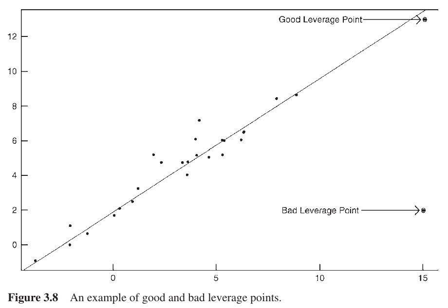
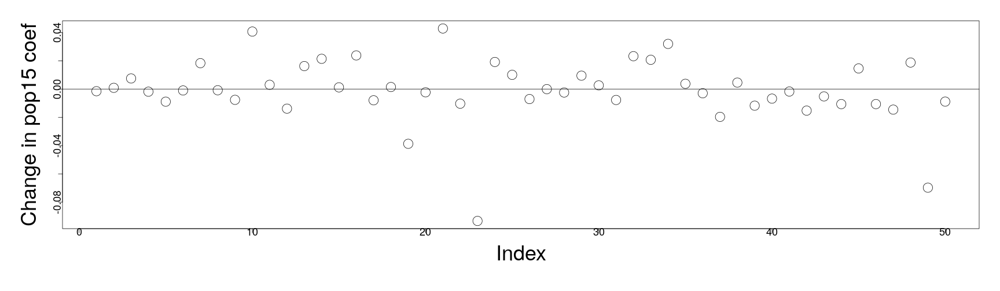

<style>
.section .reveal .state-background {
   background: #ffffff;
}
.section .reveal h1,
.section .reveal h2,
.section .reveal p {
   color: black;
   margin-top: 50px;
   text-align: center;
}
</style>

Diagnostics part 4
========================================================
date: 10/29/2019
autosize: true
incremental: true
width: 1920
height: 1080

<h2 style='color:black'>Instructions:</h2>
<p style='color:black'>Use the left and right arrow keys to navigate the presentation forward and backward respectively.  You can also use the arrows at the bottom right of the screen to navigate with a mouse.<br></p>

========================================================

### A review of diagnostics

<ul> 
  <li> We will consider 3 categories of potential issues with the model:</li>
  <ol>
    <li> Issues with the error/ variation.  Particularly, we have assumed that $\boldsymbol{\epsilon}\sim N(0, \sigma^2 \mathbf{I})$ such that the errors are normally distributed, uncorrelated and of constant variance.</li>
    <li> Issues with the systematic part of the model.  Particularly, we have assumed that there is an actual signal in the data of the form
    $$\begin{align}
    \mathbb{E}[\mathbf{Y}] = \mathbf{X} \boldsymbol{\beta},
    \end{align}$$
    which may not be valid.</li>
    <li> Issues with unusual observations.  Some of the observations may not fit the model, and they might change the choice and the fit of the model</li>
  </ol>
</ul>

========================================================

<h2>Review of leverage</h2>

* Recall the "hat" matrix that projects the observations into the space of the explanatory variables,

  $$\begin{align}
  \mathbf{H}&\triangleq \mathbf{X}\left(\mathbf{X}^\mathrm{T}\mathbf{X} \right)^{-1}\mathbf{X}^\mathrm{T}
  \end{align}$$

* Usign the hat matrix, we define the fitted values via the relationship,

  $$\begin{align}
  \hat{\mathbf{Y}} = \mathbf{H}\mathbf{Y}.
  \end{align}$$

* Therefore, consider the derivative of the $i$-th fitted value $\hat{\mathbf{Y}}_i$ with respect to the $j$-th observation of the response,

  $$\begin{align}
  \partial_{\mathbf{Y}_j} \hat{\mathbf{Y}}_i &= \partial_{\mathbf{Y}_j} \left(\mathbf{H} \mathbf{Y}\right) \\
  & =\mathbf{H}_{ij}.
  \end{align}$$
  
* Thus, the <b>sensitivity</b> of the $i$-th fitted value (prediction) with respect to the $j$-th observed value is given precisely by the entry $(i,j)$ of the hat matrix, $\mathbf{H}_{ij}$.  

* For this reason, the entries of the projection operator $\mathbf{H}$ can be considered to be,

  1. $\mathbf{H}_{ii}$ --- the <b>self-sensitivity or leverage</b> of the fitted value $\hat{\mathbf{Y}}_{i}$ with respect to the variation of the observation $\mathbf{Y}_i$; while
  
  2. $\mathbf{H}_{ij}$ --- the <b>cross-sensitivity</b> of the fitted value $\hat{\mathbf{Y}}_{i}$ with respect to the variation of the observation $\mathbf{Y}_j$.

========================================================

### Leverage
  
* Recall that, under the condition of $\boldsymbol{\epsilon}\sim N\left(0,\sigma^2 \mathbf{I}\right)$

  $$\begin{align}
  cov\left(\hat{\boldsymbol{\epsilon}}\right) = \sigma^2\left(\mathbf{I} - \mathbf{H}\right)
  \end{align}$$
  
* Denote the $i$-th self-sensitivty or leverage,

  $$\begin{align}
  h_i \triangleq \mathbf{H}_{ii} 
  \end{align}$$


* From above, the variance of the $i$-th residual is given,

  $$\begin{align}
  \sigma^2 \left(1 - h_i\right)
  \end{align}$$
  
* This implies that the values of the leverages will have a strong impact on the variance of the residuals.

* Specifically, if
<ol>
  <li> the $i$-th leverage is zero, the model effectively ignores the impact of the $i$-th observation on the $i$-th fitted value and the variation of this residual is the same as the random variation in the signal.</li>
  <li> the $i$-th leverage is one, the model effectively sets the fitted value to the observed value, and there is zero variation of the $i$-th residual. </li>
</ol>

* However, leverage is a property that arises in the space of the predictors, and doesn't depend on the response variable.

========================================================

### Leverage and model fit

<div style="float:left; width:60%">

<p style="text-align:center">
Courtesy of Weiner et al. <em> Handbook of Psychology, Research Methods in Psychology.</em> John Wiley & Sons, 2012</p>
</div>
<div style="float:left; width:40%">
<ul>
  <li> Particularly, leverage points don't know how well they fit an otherwise consistent signal.</li>
  <li> In a simple, one explanatory variable model to the left, we see a well fit linear relationship between the predictors and the response.</li>
  <li> Because the center of mass of the data (in the x-axis) and the spread is located between $(-5,10)$:</li> 
  <ol>
    <li> the "good" leverage point will have a strong influence on the model, if it is included in the fitting, and will keep the model close to the signal; whereas</li>
    <li> the "bad" leverage point will have a strong influence on the model, if it is included in the fitting, and will distort the model away from the signal in the rest of the data.</li>
  </ol>
  
</ul>
</div>

========================================================

<h2>Outliers</h2>


<div style="float:left; width:60%">

<p style="text-align:center">Courtesy of: Faraway, J. Linear Models with R. 2nd Edition</p>
</div>
<div style="float:left; width:40%">
<ul>
  <li> As noted before, a point with high leverage may or may not be an issue in itself.</li>
  <li> Similarly, outliers may not be particularly problematic for the fit of the model if they don't have high leverage.</li>
  <li> In the plots, we demonstrate three cases of how these two phenomena can affect a model when they are individually or simultaneously present.</li>
  <li> In each plot, the data point marked with $\times$ is <b>excluded</b> from the model with a <b>solid</b> line, but <b>included</b> in the model with a <b>dashed</b> line.</li>
</ul>
</div>
<ol>
  <li> In the case on the left, we see an outlier for the model fit, but one which has small leverage with respect to the explanatory variable.  In particular, including this observation has little effect on the fit of the model.</li>
  <li> In the case in the middle, we see a point of high leverage, but one that isn't an outlier to the model fit.  Therefore, including the observation has little effect on the fit of the model.</li>
  <li> In the case on the right, we see an outlier with high leverage.  The difference of the fit for the model without the observation (solid) and the model including the observation (dashed) is substantial.  Particularly, the residuals for all points (except the outlier) increase with the inclusion of this observation. </li>
</ol>

========================================================

### Outliers

* As illustrated, identifying problematic outliers is important in determining the fit and the explanatory power of a linear model.

* However, if the point is already included in the model, evaluating the residuals of the fit won't necessarily reveal outliers as all other observations' residuals are likewise affected by the offending observation. 

* To detect such points, we must go through a process of excluding observations.  Define $\hat{\boldsymbol{\beta}}_{(i)}$ and $\hat{\sigma}_{(i)}^2$ to be the least squares fit for $\hat{\boldsymbol{\beta}}$ and the residual standard error $\hat{\sigma}^2$ for the model <b>that excludes the $i$-th observation</b>.

* Consider that for the $i$-th observation, we can make a prediction for this observation <b>with the model that excludes it</b> in the fitting, via,

  $$\begin{align}
  \hat{y}_i \triangleq \mathbf{x}_i^\mathrm{T} \hat{\boldsymbol{\beta}}_{(i)}
  \end{align}$$
  
* If the predicted value from the model that excluded the $i$-th observation in the fitting, $\hat{y}_i$ is significantly different than the observed value, $y_i$, we can then consider $y_i$ to be an outlier.

========================================================

### Studentized residuals

* In order to judge the size of such an outlier, we need to view it in the appropriate scale with respect to the rest of the data.

* We can derive the relationship,

  $$\begin{align}
  var\left(Y_i - \hat{Y}_i\right) = \hat{\sigma}_{(i)}^2 \left( 1 + X_i^\mathrm{T}\left(\mathbf{X}_{(i)}^\mathrm{T} \mathbf{X}_{(i)} \right)^{-1} X_i\right)
  \end{align}$$
  
* Such that the <b>studentized residual</b> is defined,

  $$\begin{align}
  t_i \triangleq \frac{Y_i - \hat{Y}_i}{\hat{\sigma}_{(i)} \sqrt{ \left( 1 + X_i^\mathrm{T}\left(\mathbf{X}_{(i)}^\mathrm{T} \mathbf{X}_{(i)} \right)^{-1} X_i\right)}}
  \end{align}$$
  
* Provided the usual assumptions hold, <b>and that the observation is not to be considered an outlier</b> we find that $t_i \sim t_{n-p-1}$.

* To avoid fitting $n$ separate regressions, we appeal to an equivalent form of the above test satistic,

  $$\begin{align}
  t_i &\equiv  \frac{\hat{\boldsymbol{\epsilon}}_i}{\hat{\sigma}_{(i)} \sqrt{1- h_i}} \\
   & =r_i \left(\frac{n-p-1}{n-p-r^2_i}\right)^{1/2}
  \end{align}$$
  where $r_i$ is the standardized $i$-th residual.
  
========================================================

### Studentized residuals

* The previous discussion motivates the following hypothesis test,

  $$\begin{align}
  H_0: &Y_i \text{ }\textit{is not}\text{  an outlier for the full model}\\
  H_1: &Y_i \text{ }\textit{is}\text{  an outlier for the full model}
  \end{align}$$
  
* To examine <b>a single pre-selected observation</b>, this will boil down to the usual t-test where we examine the p-value of 

  $$\begin{align}
  t_i = r_i \left(\frac{n-p-1}{n-p-r^2_i}\right)^{1/2}
  \end{align}$$
  
  with respect to $t_{n-p-1}$ to determine significance.
  
* However, suppose we have $n=100$ observations that we wish to study.

  * If we test all cases at the $5\%$ significance level, we expect to find approximately 5 cases that will be determined as outliers at $5\%$ significance;
  
  * this is problematic because we will likely arrive at false positives for outliers due to random variation in the data.
  
  * This will not be alleviated, either, due to only formally testing one or two large cases --- selecting the cases based on their magnitude implicitly tests the other cases, with respect to which we make the initial comparison.
  
  * In order to alleviate this, we can adjust the $\alpha$-significance level in order to take into account the total number of tests.

========================================================

<h3>Bonferroni correction</h3>

* Suppose we want to test for an outlier at $\alpha$ significance.

* The probability of accepting the null hypothesis in all cases is given by the complimentary probabililty,

  $$\begin{align}
  P\left(\text{all tests accept}\right) &= 1 - P\left(\text{at least one test rejects}\right) \\
  & \geq 1 - \sum_{i=1}^n P\left(\text{test $i$ rejects}\right)\\
  &=1 - n\alpha
  \end{align}$$

* To compensate the test for an <em>overall</em> $\alpha$ test for all of the observations, we can select a corresponding <em>individual</em> significance level of $\alpha / n$.

* This adjustment is known as the Bonferroni correction (and is also used in other contexts).

* The drawback of this adjusted significance level is that for large $n$, this can become an extremely conservative measurement of possible outliers.

========================================================

<h3> An example</h3>

* We will compute the studentized residuals, as discussed earlier, for the savings data:


```r
library(faraway)
lmod <- lm(sr ~ pop15 + pop75 + dpi + ddpi, savings)
stud <- rstudent(lmod)
```

* and select the largest among them:


```r
stud[which.max(abs(stud))]
```

```
  Zambia 
2.853558 
```

* To evaluate the p-value and signficance of the largest studentized residual, we compute the Bonferroni corrected critical value.

  *  That is, we will compute the quantile (the mapping of the inverse CDF) of $\frac{\alpha}{2n}$ to determine the critical value for the two-sided t-test:


```r
qt(.05/(50*2),44)
```

```
[1] -3.525801
```

* In particular, this shows that the range of values with Bonferroni corrected significance <em>greater than</em> $\alpha=5\%$ is the range $(-3.525801,3.525801)$.

* The studentized residual for Zambia lies within this range, and we therefore fail to reject the null.

========================================================

<h2>A (non-exhaustive) summary of considerations for outliers</h2>

* When searching for outliers:

  <ol>
    <li> An outlier in one model may not be an outlier in another when the variables have
been changed or transformed.</li>
    <li> The error distribution may not be normal and so larger residuals may be expected.</li>
    <li>Two or more outliers next to each other can hide each other.</li>
    <li> Individual outliers are usually much less of a problem in larger datasets --- typically outliers in this case can come in clusters with specific structure.  These can be somewhat more difficult to detect without more sophisticated tools. </li>
  </ol>
  
* When correcting for outliers:

  <ol>
    <li> Check for corrupted data or entry errors if this is possible.</li>
    <li> Examine the physicality of the outlier.</li>  
    <li> Searching for an outlier, in some contexts like looking for tax-fraud, is the entire purpose of the analysis.  Contextualize the outlier and the meaning in the broader dataset.</li>
    <li> Don't exclude outliers automatically, and consider the implications on the change of the model when they are included or excluded.</li>
    <li> <b>Always report the existence of outliers</b>, especially when they are not included in your final model. Dishonest exclusion of outliers is a serious research malpractice. </li>
  </ol>

========================================================


<h2>Influential observations</h2>

* Broadly speaking, influential observations are those that would dramatically change the fit of our model if it is included or excluded.

* Influential observations may or may not be outliers or have large leverage, but typically one of the two applies.

* Rather than look at $n$ separate models, we will compress this investigation of the impact of leaving out an observation into a simpler diagonostic, <b>Cook's distance</b>.

* We define $\hat{\boldsymbol{\beta}}_{(i)}$ and $\hat{\mathbf{Y}}_{(i)}$ to be the least-squares estimated values for the parameters $\boldsymbol{\beta}$ and the vector of fitted values for the observations <b>when the $i$-th observation is exclued</b>.

* Then, with the above definition, we define Cook's distance for observation $i$ as,

  $$\begin{align}
  D_i &\triangleq \frac{\left(\hat{\mathbf{Y}} - \hat{\mathbf{Y}}_{(i)} \right)^\mathrm{T}\left(\hat{\mathbf{Y}} - \hat{\mathbf{Y}}_{(i)} \right)}{p \hat{\sigma}^2} \\
  &= \frac{1}{p}r^2_i \frac{h_i}{1 -h_i}
  \end{align}$$
  
  * The term $r_i$ is again the normalized residual effect;
  
  * while the term $\frac{h_i}{1-h_i}$ accounts for the relative leverage of the point;
  
  * together, the two give a weighted measure of <b>influence</b>.

========================================================

<h3> An example of examining for influence </h3>

* Considering once again the savings data, we plot the $n$ Cook's distances in a Q-Q plot for the half-normal distribution: 
 

```r
lmod <- lm(sr ~ pop15+pop75+dpi+ddpi,savings)
cook <- cooks.distance(lmod)
par(mai=c(1.5,1.5,.5,.5), mgp=c(3,0,0))
halfnorm(cook,3,labs=row.names(savings),ylab="Cook’s distances",  cex=3, cex.lab=3, cex.axis=1.5)
```


* Lybia is an extreme value in this plot, so we will evaluate the fit of the two models with and without this observation.

========================================================

### Testing for influence

* Comparing the respective model summaries: 


```r
lmodi <- lm(sr ~ pop15+pop75+dpi+ddpi,savings,subset=(cook < max(cook)))
sumary(lmodi)
```

```
               Estimate  Std. Error t value Pr(>|t|)
(Intercept) 24.52404598  8.22402631  2.9820 0.004655
pop15       -0.39144013  0.15790949 -2.4789 0.017084
pop75       -1.28086692  1.14518206 -1.1185 0.269430
dpi         -0.00031890  0.00092933 -0.3432 0.733119
ddpi         0.61027903  0.26877842  2.2706 0.028122

n = 49, p = 5, Residual SE = 3.79481, R-Squared = 0.36
```


```r
sumary(lmod)
```

```
               Estimate  Std. Error t value  Pr(>|t|)
(Intercept) 28.56608654  7.35451611  3.8842 0.0003338
pop15       -0.46119315  0.14464222 -3.1885 0.0026030
pop75       -1.69149768  1.08359893 -1.5610 0.1255298
dpi         -0.00033690  0.00093111 -0.3618 0.7191732
ddpi         0.40969493  0.19619713  2.0882 0.0424711

n = 50, p = 5, Residual SE = 3.80267, R-Squared = 0.34
```

* Here we note that the value of the estimated parameter "ddpi" changes on the order of $50\%$ of the earlier value.

========================================================

### Testing for influence

* Perfoming this analysis one at a time (or strictly numerically) would be difficult. 

* We can do this over all observations with a "leave-one-out", observation deletion diagnositc function "dfbeta":


```r
par(mai=c(1.5,1.5,.5,.5), mgp=c(3,0,0))
plot(dfbeta(lmod)[,2],ylab="Change in pop15 coef", cex=3, cex.lab=3, cex.axis=1.5)
abline(h=0)
```



* Here, one particular observation leads to an extreme change in the value for the parameter for pop15 (Japan).

* <b>Note:</b> this type of plot should be evaluated for each of the parameters (when possible) to search for influential observations.

========================================================

### Testing for influence

* Refitting the model without the observation of Japan, 


```r
lmodj <- lm(sr ~ pop15+pop75+dpi+ddpi,savings,subset=(row.names(savings) != "Japan"))
sumary(lmodj)
```

```
               Estimate  Std. Error t value Pr(>|t|)
(Intercept) 23.94017135  7.78399682  3.0756 0.003605
pop15       -0.36790149  0.15362956 -2.3947 0.020957
pop75       -0.97367427  1.15545021 -0.8427 0.403965
dpi         -0.00047063  0.00091907 -0.5121 0.611162
ddpi         0.33474859  0.19844568  1.6869 0.098710

n = 49, p = 5, Residual SE = 3.73801, R-Squared = 0.28
```

* we find that this indeed has a large influence on the model:
<ol>
  <li> Firstly, the $R^2$ score drops significantly (from 0.36) without Japan as an observation.</li>
  <li> Likewise, the parameter for "ddpi" is no longer significant at $5\%$.</li>
</ol>


========================================================
<h2>A summary (plot)</h2>

<div style="float:left; width:50%">

<p style="text-align:center">Courtesy of: Faraway, J. Linear Models with R. 2nd Edition</p>
</div>

<div style="float:left; width:40%">
<ul>
  <li> Much of the diagnostic analysis that we have belabored can actually be performed in a single command.</li>  
  <li> Using the "plot" function with the linear model as an argument, we produce the figure to the left:</li>
  <ol>
  <li> <b>Top left:</b> we plot the residual versus fitted values to test for variance and/or nonlinear structure in the error. A polynomial fit is line shows the trend.</li>
  <li><b>Top right:</b> we plot the Q-Q plot of the <em>standardized residuals</em> versus the standard normal distribution to evaluate for Gaussianity.</li>
  <li><b>Bottom left</b> we plot $\sqrt{\vert\hat{\boldsymbol{\epsilon}}\vert}$ versus the fitted values. A polynomial fit line shows the trend.</li>
  <li><b>Bottom right:</b> we plot the standardized residuals versus the value of the associated leverage; Cook's distance is a function of both, so contour plots are included in dotted lines.  Points that lie beyond the contours can be considered highly influential.
  </ol>
</ul>
</div>

========================================================

<h2>Checking model structure</h2>

* In order to check the structural assumption on the model, i.e.,

  $$\begin{align}
  \mathbf{Y} = \mathbf{X} \boldsymbol{\beta} + \boldsymbol{\epsilon},
  \end{align}$$

  it is often a good first diagnostic to examine the 2D plot of the variable $y$ versus $x_i$ for each variable $x_i$.
  
* However, when there are multiple explanatory varaibles of interest, this kind of plot is limited;

  * specifically, it lacks any explanation of how the response $y$ and the particular explanatory variable $x_i$ will vary with respect to other variables simultaneously.
  
* We may instead consider <em>partial regression</em> plots .

* Particularly, consider the following definitions:

  <ol>
    <li>Let $\hat{\boldsymbol{\delta}}$ be the vector of residuals defined for the predicted values of $\mathbf{Y}$ when $x_i$ is not included as an explanatory variable.</li>
    <li>Let $\hat{\boldsymbol{\gamma}}$ be the vector of residuals defined for the predicted values of $x_i$ regressed in terms of the <em>other explanatory variables</em></li>
  </ol>

* Then together, this allows us to approximate the effect of $x_i$ on $y$ with the effect of the other variables taken out.

* We'll demonstrate this with the savings data...

========================================================

### Partial regression plot


```r
library("faraway")
lmod <- lm(sr ~ pop15 + pop75 + dpi + ddpi,savings)
d <- residuals(lm(sr ~ pop75 + dpi + ddpi,savings))
m <- residuals(lm(pop15 ~ pop75 + dpi + ddpi,savings))
par(mai=c(1.5,1.5,.5,.5), mgp=c(3,0,0))
plot(m,d,xlab="pop15 residuals",ylab="Savings residuals", cex=3, cex.lab=3, cex.axis=1.5)
abline(0,coef(lmod)['pop15'])
```


* The slope of the line is given precisely by the coefficient for "pop15" in the full model, describing the trend of the partial regression.

* This type of plot is typically used for outlier and influential detection; here nothing is particularly troubling.

========================================================

### Partial residual plot

* Additionally, we can consider a <em>partial residual</em> plot, not to be confused with the last.

* Partial residual plots are a similar, alternative type of plot that are more frequently used for nonlinearity detection.

* We can consider, in a different derivation, the effect of the response with the other variables removed.

* The residual of $y$ with respect to all variables, except for $x_i$, is given

  $$\begin{align}
  y - \sum_{j\neq i}x_j \hat{\boldsymbol{\beta}}_j &= \hat{y} + \hat{\boldsymbol{\epsilon}} - \sum_{j\neq i}x_j \hat{\boldsymbol{\beta}}_j \\
  &=x_i \hat{\boldsymbol{\beta}}_i + \hat{\boldsymbol{\epsilon}}
  \end{align}$$
  
* Particularly, we can then plot, $x_i \hat{\boldsymbol{\beta}}_i + \hat{\boldsymbol{\epsilon}}$ versus $x_i$, where the slope and the interpretation with the last plot is the same.

* This is easy to do automatically in R, using the function "termplot"...

========================================================

### Partial residual plot

* This is illustrated here, where the function centers the data at the mean, i.e., $\hat{\boldsymbol{\epsilon}} + \hat{\boldsymbol{\beta}}_i \left(x_i - \overline{x}_i\right)$


```r
par(mai=c(1.5,1.5,.5,.5), mgp=c(3,0,0))
 termplot(lmod, partial.resid=TRUE, terms=1,  cex=3, cex.lab=3, cex.axis=1.5)
```


* Distinct from the previous plot, we see the previously observed two sub-groups emerging with high and low percent population below 15.

* Though both plots are meant to describe the dependence of the response on the variable "pop15" with all other factors removed, the second plot here better isolates the structure.

========================================================

### Checking model structure

* Particularly, fitting the response in terms of the two groups separately, we see that for the group with high youth populations, there is almost no fit, but a reasonable fit for the small youth population.


```r
mod1 <- lm(sr ~ pop15+pop75+dpi+ddpi,savings,subset=(pop15 > 35))
mod2 <- lm(sr ~ pop15+pop75+dpi+ddpi,savings,subset=(pop15 < 35))
sumary(mod1)
```

```
               Estimate  Std. Error t value Pr(>|t|)
(Intercept) -2.43396890 21.15502778 -0.1151   0.9097
pop15        0.27385369  0.43919097  0.6235   0.5408
pop75       -3.54847686  3.03328065 -1.1698   0.2573
dpi          0.00042076  0.00500007  0.0842   0.9339
ddpi         0.39547422  0.29010124  1.3632   0.1896

n = 23, p = 5, Residual SE = 4.45441, R-Squared = 0.16
```

```r
sumary(mod2)
```

```
               Estimate  Std. Error t value Pr(>|t|)
(Intercept) 23.96179499  8.08375019  2.9642 0.007164
pop15       -0.38589762  0.19536859 -1.9752 0.060921
pop75       -1.32774213  0.92606273 -1.4337 0.165705
dpi         -0.00045881  0.00072372 -0.6340 0.532640
ddpi         0.88439443  0.29534055  2.9945 0.006679

n = 27, p = 5, Residual SE = 2.77167, R-Squared = 0.51
```

========================================================

### Checking model structure


* From the (earlier) extensive diagonostic analysis on the savings data, we find that the difference in the fit is unlikely due to outliers in the data, but due to a structural component.


```r
mod1 <- lm(sr ~ pop15+pop75+dpi+ddpi,savings,subset=(pop15 > 35))
mod2 <- lm(sr ~ pop15+pop75+dpi+ddpi,savings,subset=(pop15 < 35))
sumary(mod1)
```

```
               Estimate  Std. Error t value Pr(>|t|)
(Intercept) -2.43396890 21.15502778 -0.1151   0.9097
pop15        0.27385369  0.43919097  0.6235   0.5408
pop75       -3.54847686  3.03328065 -1.1698   0.2573
dpi          0.00042076  0.00500007  0.0842   0.9339
ddpi         0.39547422  0.29010124  1.3632   0.1896

n = 23, p = 5, Residual SE = 4.45441, R-Squared = 0.16
```

```r
sumary(mod2)
```

```
               Estimate  Std. Error t value Pr(>|t|)
(Intercept) 23.96179499  8.08375019  2.9642 0.007164
pop15       -0.38589762  0.19536859 -1.9752 0.060921
pop75       -1.32774213  0.92606273 -1.4337 0.165705
dpi         -0.00045881  0.00072372 -0.6340 0.532640
ddpi         0.88439443  0.29534055  2.9945 0.006679

n = 27, p = 5, Residual SE = 2.77167, R-Squared = 0.51
```


========================================================

<h2> A summary of diagnostics</h2>

* The issues to check for in diagnostics are diverse, but also of differing importance for the analysis.

* Specifically, we will order these in terms of importance of consideration:

<ol>
  <li>Issues with the systematic part of the model.  If the (linear) signal between the explanatory variables and response isn't well posed, this analysis will be fundamentally misleading and our inferences and explanatory power will be biased.</li>
  <li> Correlation/ dependence of the error $\boldsymbol{\epsilon}$.  In this case, there won't be as much information to extract from the data as appears from the size of the data.  The information can be redundant, and the inference flawed.</li>
  <li>Non-constant variance of the errors.  This is easier to test, and <b>doesn't bias the estimate of the parameters</b>, but dillutes our uncertainty quantification and our ability to make inference and explanation with the model.</li>
  <li>Gaussianity/ Normality of the error.  This isn't strictly necessary (and is not an assumption of the Gauss-Markov theorem), but our hypothesis tests and condifence intervals are built around this assumption.</li>
</ol>

* Remediation of the above can take many different forms.  

  * For the first part, we should evaluate the context of the model itself and the feasibility of the relationsip.  Also, we should evaluate if the response and the explanatory variables are in the correct (possibly relative) scales of interest to form the relationship.
  
  * Again, for correlation, there aren't good general tests, and we have to bear the problem structure in mind for spatial/ temporal/ batch correlation of observations.
  
  * Gaussianity, we don't have to worry about too much provided we have sufficiently many observations (Central Limit Theorem) or e.g., short tailed distributions.  For long tailed distributions, we can use robust regression methods.


