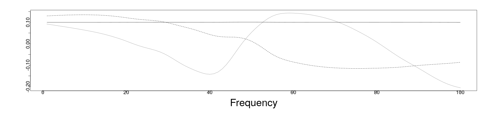
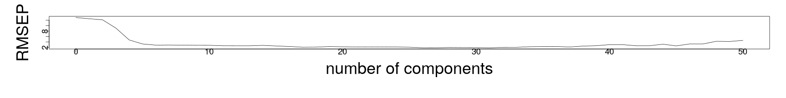
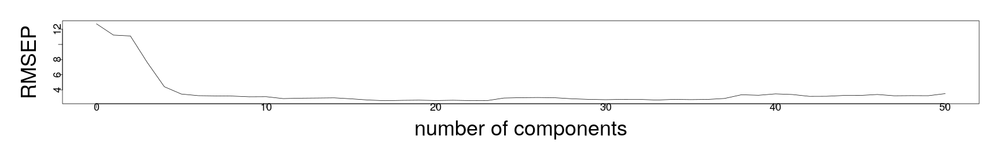

<style>
.section .reveal .state-background {
   background: #ffffff;
}
.section .reveal h1,
.section .reveal h2,
.section .reveal p {
   color: black;
   margin-top: 50px;
   text-align: center;
}
</style>

Principal component analysis and regression
========================================================
date: 11/21/2019
autosize: true
incremental: true 
width: 1920
height: 1080

<h2 style='color:black'>Instructions:</h2>
<p style='color:black'>Use the left and right arrow keys to navigate the presentation forward and backward respectively.  You can also use the arrows at the bottom right of the screen to navigate with a mouse.<br></p>


========================================================

<h2> Visualizing the SVD </h2>

<div style="float:left; width:40%">

Courtesy of Georg-Johann <a href="https://creativecommons.org/licenses/by-sa/3.0" target="blank">CC BY-SA 3.0</a>
</div>

<div style="float:left ; width:60%">
<ul>
  <li> Qualitatively, we can always view an orthogonal matrix as a rotation of the standard Euclidean frame;</li>
  <li> likewise, we can always view a diagonal matrix as a dilation of the points along the specified frame, stretching the unit circle into an ellipsoid.</li>
  <li> Therefore, for a matrix transformation $\mathbf{M}$, we can view its SVD 
  $$\begin{align}
  \mathbf{M} = \mathbf{U}\boldsymbol{\Sigma}\mathbf{V}^\mathrm{T}
  \end{align}$$ 
  as a composition of:
  <ol>
    <li> a rotation into a new frame; </li>
    <li> a stretch or contraction of all points along the directions in this frame;</li>
    <li> a final rotation back into the Euclidean coordinates, but where the shape may no longer align with this frame.</li>
  </ol>
<li> What does this have to do with our data? 
</ul>
</div>

========================================================
<h2> Principal components of data</h2>

* We recall our data matrix $\mathbf{X}$ and suppose we want to standardize the data into a matrix of variance normalized anomalies $\mathbf{A}$.

* Note that $\mathbf{A}^\mathrm{T} \mathbf{A} = \mathbf{C}$ is the correlation matrix of the samples in $\mathbf{X}$.

* We might suppose then we would want to find the principal axes of the correlation matrix to extract the frame in which we see it as an ellipsoid with major and minor directions.

* Suppose we compute the SVD of $\mathbf{A}$ for this purpose, i.e.,

  $$\begin{align}
  \mathbf{A} = \mathbf{U} \boldsymbol{\Sigma} \mathbf{V}^\mathrm{T}
  \end{align}$$

* Whereby, 

  $$\begin{align}
  \mathbf{C} = \mathbf{V} \boldsymbol{\Sigma}\boldsymbol{\Sigma}^\mathrm{T} \mathbf{V}^\mathrm{T}
  \end{align}$$

* If we assume that the singular values are ordered (as usual) descendingly in size, the first vector $\mathbf{V}_1$ is the direction in which there is <b>the most variance in the data</b>.

* The next vector $\mathbf{V}_2$ is the direction that is orthogonal (perpendicular) to the first, and has the next most variance.

* The third and thereafter follow these properties such that all vectors are orthogonal and contain (descendingly) the most variance of the data.

========================================================

<h2> Principal components of data continued...</h2>
  
* Specifically, we can consider right multiplying the anomalies $\mathbf{A}$ by $\mathbf{V}$ to change the frame of reference before examining $\mathbf{A}$.
  
  $$\begin{align}
   \mathbf{A}\mathbf{V} = \mathbf{U} \boldsymbol{\Sigma}
  \end{align}$$


* Performing the above, it is easy to see

  $$\begin{align}
   \mathbf{A}\mathbf{v}_i = \eta_i\mathbf{u}_i
  \end{align}$$
  
  where we will denote (atypically) the $i$-th singular value as $\eta_i$ (so not to confuse with the standard deviations, also typically denoted with the $\sigma_i$).
  
  * The vector $\mathbf{z}_i \triangleq \eta_i \mathbf{u}_i$ is defined as the <b>$i$-th principal component</b>.

* Whereas the correlation matrix can be large and difficult to compute, the singular value decomposition can be computed in relatively simple numerical procedures and stopped at a threshold for "how-much-variation" do we need to capture.

* This makes a dramatic "compression" of large data sets, in which the vast majority of the variance may be captured in a single or a few principal components.

* The cost, however, is that these will be linear combinations of the other variables -- we can't generally preserve the units of measurments when making this transformation.

========================================================

<h2> Principal component regression</h2>

* We haven't yet linked the principal components of the explanatory variables to the response in any way;

  * this is, in part, because SVD/PCA are widely used techniques that aren't just for regression, but also happen to be useful for this too.
  
* We might consider using, rather than the usual explanatory variables, some number of the principal components $\mathbf{z}_i$, i.e., with the variables transformed by the rotation.

* This is known as principal component regression (PCR) and has some advantages and disadvantages:

  <ul>
    <li> Advantage: we can "compress" the important information into a much smaller set of variables as a combination of many different explanatory variables.</li>
    <ul>
      <li>This often leads to better predictive performance, because some of the noise in the many correlated variables is filtered out.</li>
    </ul>
    <li>Disadvantage: we may not reduce the total number of measurements actually necessary to perform the regression;</li>
    <ul>
      <li>depending on the situation, this may not really make a practical reduction.</li>
    </ul>
    <li> Neutral: sometimes we can and sometimes we cannot interpret the physicallity of the combined variables... It really depends on the variables we combine.</li>
  </ul>
  
* To get around some of the (potential) disadvantages, we can also use PCA as a kind of model selection in the original variables.

* We will discuss both approaches.

========================================================

## An example

* We recall our standardized principal components of the fat data:


```r
library("faraway")
cfat <- fat[,9:18]
prfatc <- prcomp(cfat, scale=TRUE)
summary(prfatc)
```

```
Importance of components:
                          PC1     PC2     PC3     PC4     PC5     PC6
Standard deviation     2.6498 0.85301 0.81909 0.70114 0.54708 0.52831
Proportion of Variance 0.7021 0.07276 0.06709 0.04916 0.02993 0.02791
Cumulative Proportion  0.7021 0.77490 0.84199 0.89115 0.92108 0.94899
                           PC7     PC8     PC9   PC10
Standard deviation     0.45196 0.40539 0.27827 0.2530
Proportion of Variance 0.02043 0.01643 0.00774 0.0064
Cumulative Proportion  0.96942 0.98586 0.99360 1.0000
```

* In this case, almost $80\%$ of the variance is explained in the first two components.

========================================================

### An example

* Examining these components for their individual values, we can see that in this case there is some reasonable interpretation for the components:


```r
round(prfatc$rot[,1],2)
```

```
   neck   chest   abdom     hip   thigh    knee   ankle  biceps forearm 
   0.33    0.34    0.33    0.35    0.33    0.33    0.25    0.32    0.27 
  wrist 
   0.30 
```

```r
round(prfatc$rot[,2],2)
```

```
   neck   chest   abdom     hip   thigh    knee   ankle  biceps forearm 
   0.00   -0.27   -0.40   -0.25   -0.19    0.02    0.62    0.02    0.36 
  wrist 
   0.38 
```

* The first direction is somewhat representative of (most) individuals who vary approximately proportionately in their circumfrencial measurements.

* The second (perpendicular) direction is somewhat representative of those individuals who vary oppositely in their core measurements versus extremal measurements.

========================================================

### An example

* If we regress with respect to these two components, we obtain a reasonable fit to the data and actually have (in this case) a reasonable interpretation of the effects of the parameters.


```r
lmodpcr <- lm(fat$brozek ~ prfatc$x[,1:2])
sumary(lmodpcr)
```

```
                   Estimate Std. Error t value  Pr(>|t|)
(Intercept)        18.93849    0.32913 57.5416 < 2.2e-16
prfatc$x[, 1:2]PC1  1.84198    0.12446 14.8003 < 2.2e-16
prfatc$x[, 1:2]PC2 -3.55053    0.38661 -9.1837 < 2.2e-16

n = 252, p = 3, Residual SE = 5.22473, R-Squared = 0.55
```

* Body fat appears to increase proportionately when all circumfrential measurements go up, but seems to decline dramatically when an individual has larger circumfrential measurements in their extremeties relative to their core measurements;

  * this potentially can correspond to individuals who carry more arm/ leg muscle mass in the standardized variables, relative to the circumfrence of the trunk.
  
  * However if the variables included, e.g., age, then we wouldn't necessarily have a good indication of the meaning of the variable, when e.g. arm circumfrence and age vary together as a variable simultaneously.

* In this case, we don't have so much the interpretability issue, but we are still stuck measuring all the 10 variables from the PCA analysis.

========================================================

### An example


* One way around this is to use only a few variables that are highly representative of the leading principal components:


```r
round(prfatc$rot[,1],2)
```

```
   neck   chest   abdom     hip   thigh    knee   ankle  biceps forearm 
   0.33    0.34    0.33    0.35    0.33    0.33    0.25    0.32    0.27 
  wrist 
   0.30 
```

```r
round(prfatc$rot[,2],2)
```

```
   neck   chest   abdom     hip   thigh    knee   ankle  biceps forearm 
   0.00   -0.27   -0.40   -0.25   -0.19    0.02    0.62    0.02    0.36 
  wrist 
   0.38 
```

* In this case, we might instead take a core measurement representing the first component, while taking the difference of the core and extremal measurments as the second.

========================================================

### An example


* Formally doing this in R, we use the scale function and the "I" function to set the two variables in a specific, funcitonal form for the model:


```r
lmodr <- lm(fat$brozek ~ scale(abdom) + I(scale(ankle)-scale(abdom)), data=cfat)
sumary(lmodr)
```

```
                               Estimate Std. Error t value  Pr(>|t|)
(Intercept)                    18.93849    0.27937 67.7891 < 2.2e-16
scale(abdom)                    5.76286    0.32840 17.5485 < 2.2e-16
I(scale(ankle) - scale(abdom)) -0.99504    0.31403 -3.1686  0.001723

n = 252, p = 3, Residual SE = 4.43492, R-Squared = 0.68
```

========================================================

### An example

* comparing with the model using all variables, this performs extremely well in fitting the data:


```r
lmoda <- lm(fat$brozek ~ ., data=cfat)
sumary(lmoda)
```

```
              Estimate Std. Error t value  Pr(>|t|)
(Intercept)  7.2287487  6.2143092  1.1632 0.2458816
neck        -0.5819470  0.2085800 -2.7900 0.0056916
chest       -0.0908468  0.0854300 -1.0634 0.2886622
abdom        0.9602291  0.0715821 13.4144 < 2.2e-16
hip         -0.3913546  0.1126862 -3.4730 0.0006101
thigh        0.1337081  0.1249222  1.0703 0.2855412
knee        -0.0940552  0.2123939 -0.4428 0.6582831
ankle        0.0042223  0.2031754  0.0208 0.9834370
biceps       0.1111963  0.1591179  0.6988 0.4853321
forearm      0.3445364  0.1855113  1.8572 0.0644989
wrist       -1.3534719  0.4714098 -2.8711 0.0044542

n = 252, p = 11, Residual SE = 4.07132, R-Squared = 0.74
```

* But using the two principal components didn't fit the data nearly as well...


========================================================

### An example


* One issue overall is in deciding how many prinicpal components are needed 

  * deciding on the percent of variance in the components alone isn't necessarily the best criterion for building a predictive model.

* Particularly for predictive models, we must also distinguish "fitting the data well" and the "predictive power".

* If we fit the data well, does it mean that we can produce viable predictions?

========================================================

<h2>Validation</h2>

* Suppose we are in a scenario in which we have fit a model, and we recieve new observations of the same response and explanatory variable.

* It is reasonable to ask, "if the new observations are statistically indistinguishable from the training data, how well does our model perform in predicting the new observations (on average)?"

* Particularly, this is commonly measured in terms of the root mean square error (RMSE).

* Lets suppose that we have a model already fit that will take a new vector of explanatory variables $\mathbf{x}_i$, and produce a predicted value $\hat{\mathbf{y}}_i$.

* Suppose, there are $n$ <b>new observations</b> that we wish to benchmark the model against, then the RMSE is computed as,

  $$\begin{align}
  RMSE\left(\{\mathbf{y}_i\}_{i=1}^n \right) = \sqrt{ \frac{\sum_{i=1}^n \left(\hat{\mathbf{y}}_i - \mathbf{y}_i\right)^2}{n}}
  \end{align}$$

  * this measures how much error there is in our predictions on average over the new samples.
  
* Typically, $R^2$ and the standard error (and other measures like $R^2_a$) are overly optimistic in how well we will produce future observations.

* The RMSE of the model, when measured over independent samples drawn from the same population, will give a better sense of the "true" predictive power of the model.

========================================================

<h2>Validation continued...</h2>

* We often don't have the option of reproducing a statistically indistinguishable sample from the same population to test the model after the fact. 

* Therefore, the simplest option is to randomly split the data into two equal parts for: (i) model fitting and (ii) model validation.

  *  In this case, we can get a more sensible measure of the predictive power of the model, by computing the RMSE on new observations.
  
* The main issue of the above is that we often don't have enough data for both training and validation.

  * Strictly speaking, the validation dataset should remain independent of the model fitting so that we don't try to optimize (over-fit) our model on this data set.
  
  * Likewise, the validation data set would have to be large enough such that it is representative of the entire population to make the benchmark accurate.

* Typically, this ideal validation as above isn't possible due to limits on our data, and we instead use "cross-validation" to benchmark the predictive performance.

* We will return to this issue later...

========================================================

<h2> A complete example of PCR</h2>


* A near-infrared spectrometer working in the wavelength range of 850 to 1050 nm was used to collect data on samples of finely chopped meat. 

* 215 samples were measured, where for each sample, the fat content was measured along with a 100-channel spectrum of absorbances. 

* Determining the fat content via analytical chemistry is time consuming, and we would like to build a model to predict the fat content of new samples using the 100 absorbances which can
be measured more easily. 

* We load this from the "meatspec" dataset of Faraway:


```r
trainmeat <- meatspec[1:172,]
testmeat <- meatspec[173:215,]
modlm <- lm(fat ~ ., trainmeat)
```

* Here, we fit the model over a pre-specified set of training data, and separate out a set of validation data.

========================================================

### A complete example of PCR

* In the model summary, we can see that the $R^2$ and adjusted $R^2_a$ are extremely good:


```r
summary(modlm)$r.squared
```

```
[1] 0.9970196
```

```r
summary(modlm)$adj.r.squared
```

```
[1] 0.9928219
```

* The question then is if this measure of fit to the data will actually translate into a good predictive model.


```r
rmse <- function(x,y) sqrt(mean((x-y)^2))
```

* We define the RMSE function as above, and compute the difference of the fitted values for the training data


```r
rmse(fitted(modlm), trainmeat$fat)
```

```
[1] 0.6903167
```

* which is also extremely good, but compared to the training data...


```r
rmse(predict(modlm,testmeat), testmeat$fat)
```

```
[1] 3.814
```

========================================================

### A complete example of PCR

* ... the average predictive error (RMSE) on the validation data is around five times greater...

  * This is not an uncommon issue either, and is somewhat unavoidable -- at its heart, this has to do with the tradeoff of the bias versus varaince of the model.
  
* It is likely that the current model (with 100 explanatory variables) is over parameterized, and therefore tries to fit the known data too well.

  * Therefore, we should reduce the number of parameters in a sensible way -- here we try the step-wise AIC.
  
* The output is too long to fit on the slide, but is shown here for reference:
  

```r
modsteplm <- step(modlm)
```

```
Start:  AIC=74.51
fat ~ V1 + V2 + V3 + V4 + V5 + V6 + V7 + V8 + V9 + V10 + V11 + 
    V12 + V13 + V14 + V15 + V16 + V17 + V18 + V19 + V20 + V21 + 
    V22 + V23 + V24 + V25 + V26 + V27 + V28 + V29 + V30 + V31 + 
    V32 + V33 + V34 + V35 + V36 + V37 + V38 + V39 + V40 + V41 + 
    V42 + V43 + V44 + V45 + V46 + V47 + V48 + V49 + V50 + V51 + 
    V52 + V53 + V54 + V55 + V56 + V57 + V58 + V59 + V60 + V61 + 
    V62 + V63 + V64 + V65 + V66 + V67 + V68 + V69 + V70 + V71 + 
    V72 + V73 + V74 + V75 + V76 + V77 + V78 + V79 + V80 + V81 + 
    V82 + V83 + V84 + V85 + V86 + V87 + V88 + V89 + V90 + V91 + 
    V92 + V93 + V94 + V95 + V96 + V97 + V98 + V99 + V100

       Df Sum of Sq    RSS    AIC
- V54   1    0.0000 81.964 72.512
- V38   1    0.0001 81.965 72.512
- V89   1    0.0019 81.966 72.516
- V75   1    0.0033 81.968 72.519
- V100  1    0.0048 81.969 72.522
- V67   1    0.0070 81.971 72.527
- V20   1    0.0107 81.975 72.534
- V88   1    0.0128 81.977 72.539
- V71   1    0.0198 81.984 72.554
- V47   1    0.0212 81.986 72.556
- V76   1    0.0240 81.988 72.562
- V90   1    0.0322 81.997 72.579
- V94   1    0.0502 82.015 72.617
- V95   1    0.0540 82.018 72.625
- V91   1    0.0587 82.023 72.635
- V9    1    0.0939 82.058 72.709
- V70   1    0.0974 82.062 72.716
- V18   1    0.1050 82.069 72.732
- V57   1    0.1073 82.072 72.737
- V33   1    0.1143 82.079 72.752
- V49   1    0.1972 82.162 72.925
- V58   1    0.1979 82.162 72.927
- V48   1    0.1999 82.164 72.931
- V65   1    0.2187 82.183 72.970
- V66   1    0.2353 82.200 73.005
- V98   1    0.2659 82.230 73.069
- V56   1    0.2689 82.233 73.075
- V87   1    0.2722 82.237 73.082
- V34   1    0.3190 82.283 73.180
- V3    1    0.3415 82.306 73.227
- V86   1    0.3441 82.308 73.233
- V11   1    0.4133 82.378 73.377
- V93   1    0.4145 82.379 73.380
- V10   1    0.4661 82.430 73.487
- V55   1    0.4736 82.438 73.503
- V68   1    0.4906 82.455 73.538
- V35   1    0.5648 82.529 73.693
- V99   1    0.6235 82.588 73.815
- V12   1    0.6293 82.594 73.828
- V62   1    0.6687 82.633 73.910
- V92   1    0.7122 82.677 74.000
- V37   1    0.8048 82.769 74.192
- V36   1    0.8179 82.782 74.220
- V81   1    0.8298 82.794 74.245
- V16   1    0.8788 82.843 74.346
- V27   1    0.9262 82.891 74.445
- V19   1    0.9491 82.913 74.492
<none>              81.964 74.512
- V59   1    1.0342 82.999 74.669
- V24   1    1.0869 83.051 74.778
- V72   1    1.0953 83.060 74.795
- V69   1    1.0999 83.064 74.805
- V61   1    1.1449 83.109 74.898
- V17   1    1.2096 83.174 75.032
- V96   1    1.3883 83.353 75.401
- V8    1    1.4317 83.396 75.490
- V25   1    1.4567 83.421 75.542
- V32   1    1.5628 83.527 75.761
- V13   1    1.6140 83.578 75.866
- V84   1    1.7323 83.697 76.109
- V83   1    1.7536 83.718 76.153
- V31   1    1.8815 83.846 76.416
- V21   1    1.9465 83.911 76.549
- V44   1    2.1148 84.079 76.893
- V77   1    2.2338 84.198 77.137
- V4    1    2.2400 84.204 77.149
- V53   1    2.2425 84.207 77.155
- V43   1    2.4267 84.391 77.530
- V6    1    2.4433 84.408 77.564
- V60   1    2.6124 84.577 77.909
- V74   1    2.6366 84.601 77.958
- V14   1    2.7315 84.696 78.150
- V15   1    2.9788 84.943 78.652
- V30   1    3.2098 85.174 79.119
- V7    1    3.2268 85.191 79.153
- V46   1    3.6157 85.580 79.937
- V5    1    3.8685 85.833 80.444
- V97   1    3.9279 85.892 80.563
- V82   1    3.9292 85.894 80.566
- V26   1    4.0139 85.978 80.735
- V63   1    4.4871 86.451 81.679
- V42   1    4.7257 86.690 82.153
- V2    1    5.1275 87.092 82.949
- V23   1    5.2379 87.202 83.167
- V22   1    5.3194 87.284 83.327
- V45   1    5.9672 87.932 84.599
- V50   1    6.4081 88.372 85.459
- V41   1    6.6153 88.580 85.862
- V85   1    6.6742 88.639 85.977
- V78   1    6.9926 88.957 86.593
- V64   1    7.7506 89.715 88.053
- V73   1    7.8984 89.863 88.336
- V52   1    8.0731 90.037 88.670
- V39   1    9.4731 91.437 91.324
- V29   1    9.7321 91.696 91.810
- V51   1   10.7265 92.691 93.665
- V40   1   11.5690 93.533 95.222
- V28   1   12.4780 94.442 96.885
- V1    1   12.6901 94.655 97.271
- V79   1   13.2081 95.172 98.210
- V80   1   13.8519 95.816 99.369

Step:  AIC=72.51
fat ~ V1 + V2 + V3 + V4 + V5 + V6 + V7 + V8 + V9 + V10 + V11 + 
    V12 + V13 + V14 + V15 + V16 + V17 + V18 + V19 + V20 + V21 + 
    V22 + V23 + V24 + V25 + V26 + V27 + V28 + V29 + V30 + V31 + 
    V32 + V33 + V34 + V35 + V36 + V37 + V38 + V39 + V40 + V41 + 
    V42 + V43 + V44 + V45 + V46 + V47 + V48 + V49 + V50 + V51 + 
    V52 + V53 + V55 + V56 + V57 + V58 + V59 + V60 + V61 + V62 + 
    V63 + V64 + V65 + V66 + V67 + V68 + V69 + V70 + V71 + V72 + 
    V73 + V74 + V75 + V76 + V77 + V78 + V79 + V80 + V81 + V82 + 
    V83 + V84 + V85 + V86 + V87 + V88 + V89 + V90 + V91 + V92 + 
    V93 + V94 + V95 + V96 + V97 + V98 + V99 + V100

       Df Sum of Sq    RSS     AIC
- V38   1    0.0001 81.965  70.512
- V89   1    0.0019 81.966  70.516
- V75   1    0.0035 81.968  70.519
- V100  1    0.0047 81.969  70.522
- V67   1    0.0076 81.972  70.528
- V20   1    0.0107 81.975  70.534
- V88   1    0.0131 81.978  70.539
- V71   1    0.0201 81.984  70.554
- V47   1    0.0216 81.986  70.557
- V76   1    0.0243 81.989  70.563
- V90   1    0.0322 81.997  70.580
- V94   1    0.0504 82.015  70.618
- V95   1    0.0552 82.020  70.628
- V91   1    0.0587 82.023  70.635
- V9    1    0.0939 82.058  70.709
- V70   1    0.0989 82.063  70.719
- V18   1    0.1050 82.069  70.732
- V33   1    0.1146 82.079  70.752
- V57   1    0.1235 82.088  70.771
- V49   1    0.2012 82.166  70.934
- V58   1    0.2141 82.179  70.961
- V48   1    0.2208 82.185  70.975
- V65   1    0.2279 82.192  70.990
- V66   1    0.2357 82.200  71.006
- V98   1    0.2666 82.231  71.071
- V87   1    0.2740 82.238  71.086
- V34   1    0.3267 82.291  71.196
- V3    1    0.3416 82.306  71.227
- V86   1    0.3533 82.318  71.252
- V93   1    0.4165 82.381  71.384
- V11   1    0.4243 82.389  71.400
- V10   1    0.4786 82.443  71.513
- V68   1    0.5216 82.486  71.603
- V56   1    0.5245 82.489  71.609
- V35   1    0.5726 82.537  71.710
- V99   1    0.6251 82.590  71.819
- V12   1    0.6552 82.620  71.882
- V62   1    0.6719 82.636  71.916
- V92   1    0.7164 82.681  72.009
- V36   1    0.8229 82.787  72.230
- V37   1    0.8348 82.799  72.255
- V81   1    0.8712 82.836  72.331
- V16   1    0.8799 82.844  72.349
- V27   1    0.9321 82.896  72.457
- V19   1    0.9498 82.914  72.494
<none>              81.964  72.512
- V59   1    1.0844 83.049  72.773
- V72   1    1.0953 83.060  72.795
- V24   1    1.1239 83.088  72.854
- V69   1    1.1381 83.103  72.884
- V61   1    1.1535 83.118  72.916
- V17   1    1.2141 83.178  73.041
- V96   1    1.3968 83.361  73.419
- V8    1    1.4323 83.397  73.492
- V25   1    1.4567 83.421  73.542
- V32   1    1.5629 83.527  73.761
- V13   1    1.6700 83.634  73.981
- V83   1    1.8674 83.832  74.387
- V31   1    1.8897 83.854  74.432
- V21   1    1.9874 83.952  74.633
- V84   1    2.0185 83.983  74.697
- V44   1    2.1226 84.087  74.910
- V4    1    2.2570 84.221  75.184
- V77   1    2.2666 84.231  75.204
- V43   1    2.4424 84.407  75.563
- V6    1    2.4437 84.408  75.565
- V60   1    2.7257 84.690  76.139
- V74   1    2.7516 84.716  76.191
- V55   1    2.7969 84.761  76.283
- V14   1    2.8230 84.787  76.336
- V15   1    3.0649 85.029  76.826
- V7    1    3.2288 85.193  77.157
- V30   1    3.2705 85.235  77.242
- V5    1    3.8742 85.839  78.456
- V46   1    3.8934 85.858  78.494
- V97   1    3.9367 85.901  78.581
- V26   1    4.0179 85.982  78.743
- V82   1    4.0803 86.045  78.868
- V63   1    4.4945 86.459  79.694
- V42   1    4.9341 86.899  80.566
- V2    1    5.1467 87.111  80.987
- V22   1    5.7115 87.676  82.098
- V23   1    5.8132 87.778  82.298
- V45   1    5.9677 87.932  82.600
- V50   1    6.8210 88.785  84.261
- V78   1    6.9928 88.957  84.594
- V41   1    7.0263 88.991  84.658
- V85   1    7.5581 89.523  85.683
- V64   1    8.0604 90.025  86.646
- V73   1    8.1744 90.139  86.863
- V39   1    9.8990 91.863  90.123
- V29   1    9.9135 91.878  90.150
- V53   1   11.0348 92.999  92.237
- V40   1   12.1604 94.125  94.306
- V28   1   12.5323 94.497  94.984
- V1    1   13.1906 95.155  96.178
- V79   1   13.2682 95.233  96.318
- V51   1   14.1805 96.145  97.958
- V80   1   14.3616 96.326  98.282
- V52   1   15.3320 97.296 100.006

Step:  AIC=70.51
fat ~ V1 + V2 + V3 + V4 + V5 + V6 + V7 + V8 + V9 + V10 + V11 + 
    V12 + V13 + V14 + V15 + V16 + V17 + V18 + V19 + V20 + V21 + 
    V22 + V23 + V24 + V25 + V26 + V27 + V28 + V29 + V30 + V31 + 
    V32 + V33 + V34 + V35 + V36 + V37 + V39 + V40 + V41 + V42 + 
    V43 + V44 + V45 + V46 + V47 + V48 + V49 + V50 + V51 + V52 + 
    V53 + V55 + V56 + V57 + V58 + V59 + V60 + V61 + V62 + V63 + 
    V64 + V65 + V66 + V67 + V68 + V69 + V70 + V71 + V72 + V73 + 
    V74 + V75 + V76 + V77 + V78 + V79 + V80 + V81 + V82 + V83 + 
    V84 + V85 + V86 + V87 + V88 + V89 + V90 + V91 + V92 + V93 + 
    V94 + V95 + V96 + V97 + V98 + V99 + V100

       Df Sum of Sq     RSS     AIC
- V89   1    0.0019  81.966  68.516
- V75   1    0.0034  81.968  68.519
- V100  1    0.0046  81.969  68.522
- V67   1    0.0077  81.972  68.528
- V20   1    0.0106  81.975  68.534
- V88   1    0.0130  81.978  68.540
- V71   1    0.0205  81.985  68.555
- V47   1    0.0217  81.986  68.558
- V76   1    0.0249  81.989  68.565
- V90   1    0.0332  81.998  68.582
- V94   1    0.0503  82.015  68.618
- V95   1    0.0551  82.020  68.628
- V91   1    0.0599  82.024  68.638
- V9    1    0.0942  82.059  68.710
- V70   1    0.0997  82.064  68.721
- V18   1    0.1049  82.069  68.732
- V33   1    0.1151  82.080  68.754
- V57   1    0.1249  82.089  68.774
- V49   1    0.2104  82.175  68.953
- V58   1    0.2238  82.188  68.981
- V65   1    0.2329  82.197  69.000
- V66   1    0.2426  82.207  69.021
- V48   1    0.2488  82.213  69.034
- V98   1    0.2708  82.235  69.080
- V87   1    0.2741  82.239  69.086
- V34   1    0.3286  82.293  69.200
- V3    1    0.3416  82.306  69.228
- V86   1    0.3535  82.318  69.252
- V93   1    0.4164  82.381  69.384
- V11   1    0.4269  82.391  69.406
- V10   1    0.4794  82.444  69.515
- V68   1    0.5218  82.486  69.604
- V56   1    0.5310  82.496  69.623
- V35   1    0.5752  82.540  69.715
- V99   1    0.6271  82.592  69.823
- V12   1    0.6560  82.621  69.883
- V62   1    0.6757  82.640  69.924
- V92   1    0.7228  82.687  70.022
- V36   1    0.8432  82.808  70.273
- V81   1    0.8739  82.838  70.336
- V16   1    0.9059  82.870  70.403
- V27   1    0.9334  82.898  70.460
- V19   1    0.9534  82.918  70.501
<none>               81.965  70.512
- V59   1    1.1038  83.068  70.813
- V37   1    1.1046  83.069  70.815
- V24   1    1.1282  83.093  70.864
- V72   1    1.1391  83.104  70.886
- V69   1    1.1403  83.105  70.889
- V61   1    1.1550  83.120  70.919
- V17   1    1.2857  83.250  71.189
- V8    1    1.4347  83.399  71.497
- V25   1    1.4594  83.424  71.548
- V96   1    1.5537  83.518  71.742
- V32   1    1.5943  83.559  71.826
- V13   1    1.6718  83.636  71.985
- V83   1    1.8783  83.843  72.409
- V31   1    1.9178  83.882  72.490
- V21   1    1.9989  83.963  72.657
- V84   1    2.1479  84.112  72.961
- V77   1    2.2688  84.233  73.209
- V4    1    2.2692  84.234  73.209
- V6    1    2.4470  84.412  73.572
- V44   1    2.5258  84.490  73.733
- V60   1    2.7256  84.690  74.139
- V43   1    2.8040  84.769  74.298
- V14   1    2.8229  84.787  74.336
- V55   1    2.8611  84.826  74.414
- V74   1    2.9463  84.911  74.586
- V15   1    3.0680  85.033  74.833
- V7    1    3.2436  85.208  75.188
- V30   1    3.2818  85.246  75.265
- V5    1    3.8888  85.853  76.485
- V46   1    3.8942  85.859  76.496
- V26   1    4.0203  85.985  76.748
- V82   1    4.1207  86.085  76.949
- V63   1    4.4984  86.463  77.702
- V97   1    4.5127  86.477  77.730
- V2    1    5.2677  87.232  79.226
- V42   1    5.5005  87.465  79.684
- V22   1    5.7384  87.703  80.151
- V23   1    5.8296  87.794  80.330
- V45   1    6.4226  88.387  81.488
- V50   1    6.8406  88.805  82.299
- V78   1    6.9943  88.959  82.597
- V41   1    7.4652  89.430  83.505
- V85   1    7.7699  89.734  84.090
- V64   1    8.0886  90.053  84.700
- V73   1    8.9320  90.897  86.303
- V29   1    9.9348  91.899  88.190
- V53   1   11.0740  93.039  90.309
- V28   1   12.6219  94.586  93.147
- V40   1   13.0363  95.001  93.899
- V79   1   13.2892  95.254  94.357
- V1    1   13.8603  95.825  95.385
- V51   1   14.2041  96.169  96.001
- V80   1   14.3801  96.345  96.315
- V52   1   15.3320  97.297  98.006
- V39   1   18.9076 100.872 104.214

Step:  AIC=68.52
fat ~ V1 + V2 + V3 + V4 + V5 + V6 + V7 + V8 + V9 + V10 + V11 + 
    V12 + V13 + V14 + V15 + V16 + V17 + V18 + V19 + V20 + V21 + 
    V22 + V23 + V24 + V25 + V26 + V27 + V28 + V29 + V30 + V31 + 
    V32 + V33 + V34 + V35 + V36 + V37 + V39 + V40 + V41 + V42 + 
    V43 + V44 + V45 + V46 + V47 + V48 + V49 + V50 + V51 + V52 + 
    V53 + V55 + V56 + V57 + V58 + V59 + V60 + V61 + V62 + V63 + 
    V64 + V65 + V66 + V67 + V68 + V69 + V70 + V71 + V72 + V73 + 
    V74 + V75 + V76 + V77 + V78 + V79 + V80 + V81 + V82 + V83 + 
    V84 + V85 + V86 + V87 + V88 + V90 + V91 + V92 + V93 + V94 + 
    V95 + V96 + V97 + V98 + V99 + V100

       Df Sum of Sq     RSS     AIC
- V100  1    0.0032  81.970  66.523
- V67   1    0.0065  81.973  66.530
- V75   1    0.0076  81.974  66.532
- V20   1    0.0105  81.977  66.538
- V88   1    0.0174  81.984  66.553
- V47   1    0.0224  81.989  66.563
- V71   1    0.0256  81.992  66.570
- V76   1    0.0353  82.002  66.590
- V90   1    0.0410  82.007  66.602
- V94   1    0.0490  82.015  66.619
- V91   1    0.0581  82.025  66.638
- V95   1    0.0598  82.026  66.642
- V9    1    0.0967  82.063  66.719
- V70   1    0.1013  82.068  66.729
- V18   1    0.1059  82.072  66.738
- V33   1    0.1137  82.080  66.755
- V57   1    0.1278  82.094  66.784
- V49   1    0.2210  82.188  66.980
- V58   1    0.2245  82.191  66.987
- V48   1    0.2468  82.213  67.034
- V66   1    0.2525  82.219  67.045
- V98   1    0.2699  82.236  67.082
- V65   1    0.2801  82.247  67.103
- V34   1    0.3268  82.293  67.201
- V87   1    0.3431  82.310  67.235
- V86   1    0.3538  82.320  67.257
- V3    1    0.3581  82.325  67.266
- V93   1    0.4174  82.384  67.390
- V11   1    0.4307  82.397  67.418
- V68   1    0.5199  82.486  67.604
- V10   1    0.5207  82.487  67.606
- V56   1    0.5731  82.540  67.715
- V35   1    0.6351  82.602  67.844
- V99   1    0.6554  82.622  67.886
- V12   1    0.6681  82.635  67.913
- V92   1    0.7303  82.697  68.042
- V62   1    0.7332  82.700  68.048
- V81   1    0.9059  82.872  68.407
- V36   1    0.9127  82.879  68.421
- V16   1    0.9207  82.887  68.438
- V27   1    0.9317  82.898  68.460
- V19   1    0.9523  82.919  68.503
<none>               81.966  68.516
- V72   1    1.1671  83.134  68.948
- V59   1    1.1683  83.135  68.951
- V37   1    1.1761  83.143  68.967
- V24   1    1.1796  83.146  68.974
- V69   1    1.1914  83.158  68.998
- V17   1    1.2867  83.253  69.195
- V61   1    1.3244  83.291  69.273
- V8    1    1.4546  83.421  69.542
- V25   1    1.5069  83.473  69.650
- V96   1    1.5562  83.523  69.751
- V32   1    1.6299  83.596  69.903
- V13   1    1.6772  83.644  70.000
- V31   1    1.9230  83.890  70.505
- V83   1    1.9877  83.954  70.638
- V21   1    2.0072  83.974  70.678
- V84   1    2.2039  84.170  71.080
- V4    1    2.2676  84.234  71.210
- V77   1    2.3346  84.301  71.347
- V6    1    2.4485  84.415  71.579
- V44   1    2.5488  84.515  71.783
- V14   1    2.8672  84.834  72.430
- V43   1    2.8852  84.852  72.467
- V60   1    2.9567  84.923  72.611
- V55   1    2.9683  84.935  72.635
- V74   1    3.0512  85.018  72.803
- V15   1    3.0980  85.064  72.897
- V7    1    3.2672  85.234  73.239
- V30   1    3.2860  85.253  73.277
- V5    1    3.8927  85.859  74.497
- V26   1    4.0230  85.990  74.758
- V46   1    4.0626  86.029  74.837
- V82   1    4.1212  86.088  74.954
- V63   1    4.4998  86.466  75.709
- V97   1    4.6092  86.576  75.926
- V2    1    5.3271  87.294  77.347
- V42   1    5.5483  87.515  77.782
- V22   1    5.8074  87.774  78.290
- V23   1    5.9365  87.903  78.543
- V45   1    6.6466  88.613  79.927
- V50   1    6.8802  88.847  80.380
- V41   1    7.4965  89.463  81.569
- V78   1    7.6168  89.583  81.800
- V85   1    7.7755  89.742  82.104
- V64   1    8.2128  90.179  82.941
- V73   1    8.9331  90.900  84.309
- V29   1    9.9482  91.915  86.219
- V53   1   11.2189  93.185  88.581
- V28   1   12.6379  94.604  91.180
- V40   1   13.0617  95.028  91.949
- V79   1   13.4159  95.382  92.589
- V1    1   14.2044  96.171  94.005
- V51   1   14.2098  96.176  94.014
- V80   1   15.0325  96.999  95.480
- V52   1   15.4047  97.371  96.138
- V39   1   19.0264 100.993 102.420

Step:  AIC=66.52
fat ~ V1 + V2 + V3 + V4 + V5 + V6 + V7 + V8 + V9 + V10 + V11 + 
    V12 + V13 + V14 + V15 + V16 + V17 + V18 + V19 + V20 + V21 + 
    V22 + V23 + V24 + V25 + V26 + V27 + V28 + V29 + V30 + V31 + 
    V32 + V33 + V34 + V35 + V36 + V37 + V39 + V40 + V41 + V42 + 
    V43 + V44 + V45 + V46 + V47 + V48 + V49 + V50 + V51 + V52 + 
    V53 + V55 + V56 + V57 + V58 + V59 + V60 + V61 + V62 + V63 + 
    V64 + V65 + V66 + V67 + V68 + V69 + V70 + V71 + V72 + V73 + 
    V74 + V75 + V76 + V77 + V78 + V79 + V80 + V81 + V82 + V83 + 
    V84 + V85 + V86 + V87 + V88 + V90 + V91 + V92 + V93 + V94 + 
    V95 + V96 + V97 + V98 + V99

       Df Sum of Sq     RSS     AIC
- V67   1    0.0064  81.976  64.537
- V75   1    0.0093  81.979  64.543
- V20   1    0.0119  81.982  64.548
- V88   1    0.0184  81.988  64.562
- V47   1    0.0253  81.995  64.576
- V71   1    0.0254  81.995  64.576
- V76   1    0.0414  82.011  64.610
- V90   1    0.0418  82.012  64.611
- V94   1    0.0470  82.017  64.622
- V91   1    0.0608  82.030  64.651
- V95   1    0.0627  82.032  64.655
- V9    1    0.0966  82.066  64.726
- V70   1    0.0990  82.069  64.731
- V18   1    0.1084  82.078  64.750
- V33   1    0.1108  82.081  64.755
- V57   1    0.1246  82.094  64.784
- V58   1    0.2213  82.191  64.987
- V49   1    0.2345  82.204  65.014
- V48   1    0.2450  82.215  65.036
- V66   1    0.2564  82.226  65.060
- V65   1    0.2781  82.248  65.106
- V34   1    0.3344  82.304  65.223
- V87   1    0.3402  82.310  65.235
- V98   1    0.3651  82.335  65.287
- V86   1    0.3670  82.337  65.291
- V3    1    0.3772  82.347  65.313
- V93   1    0.4222  82.392  65.407
- V11   1    0.4533  82.423  65.472
- V68   1    0.5173  82.487  65.605
- V10   1    0.5192  82.489  65.609
- V56   1    0.5706  82.540  65.716
- V35   1    0.6328  82.602  65.846
- V12   1    0.6963  82.666  65.978
- V92   1    0.7275  82.697  66.043
- V62   1    0.7300  82.700  66.048
- V81   1    0.9030  82.873  66.408
- V36   1    0.9113  82.881  66.425
- V16   1    0.9197  82.889  66.442
- V27   1    0.9385  82.908  66.481
<none>               81.970  66.523
- V19   1    0.9780  82.948  66.563
- V59   1    1.1683  83.138  66.957
- V72   1    1.1709  83.141  66.963
- V37   1    1.1740  83.144  66.969
- V24   1    1.1783  83.148  66.978
- V69   1    1.1988  83.168  67.020
- V17   1    1.2957  83.265  67.221
- V61   1    1.4040  83.374  67.444
- V8    1    1.4556  83.425  67.551
- V25   1    1.5147  83.484  67.672
- V96   1    1.5666  83.536  67.779
- V32   1    1.6269  83.597  67.904
- V13   1    1.8338  83.804  68.329
- V31   1    1.9222  83.892  68.510
- V21   1    2.0181  83.988  68.706
- V83   1    2.0446  84.014  68.761
- V84   1    2.2015  84.171  69.082
- V4    1    2.2810  84.251  69.244
- V6    1    2.4472  84.417  69.583
- V44   1    2.5619  84.532  69.817
- V77   1    2.8580  84.828  70.418
- V55   1    2.9724  84.942  70.650
- V43   1    3.0050  84.975  70.716
- V60   1    3.0424  85.012  70.792
- V74   1    3.0666  85.036  70.840
- V14   1    3.0944  85.064  70.897
- V15   1    3.1758  85.146  71.061
- V7    1    3.2665  85.236  71.244
- V30   1    3.2861  85.256  71.284
- V5    1    3.8924  85.862  72.503
- V99   1    3.9454  85.915  72.609
- V26   1    4.0935  86.063  72.905
- V46   1    4.1553  86.125  73.029
- V82   1    4.2376  86.207  73.193
- V63   1    4.5671  86.537  73.849
- V97   1    4.6060  86.576  73.926
- V2    1    5.4522  87.422  75.599
- V42   1    5.7048  87.674  76.095
- V22   1    5.8885  87.858  76.456
- V23   1    5.9912  87.961  76.657
- V45   1    6.6907  88.660  78.019
- V50   1    6.9116  88.881  78.447
- V41   1    7.5028  89.472  79.587
- V85   1    7.8119  89.782  80.180
- V64   1    8.4222  90.392  81.346
- V78   1    8.6146  90.584  81.711
- V73   1    8.9705  90.940  82.386
- V29   1    9.9820  91.952  84.288
- V53   1   11.2851  93.255  86.709
- V28   1   12.6356  94.605  89.182
- V40   1   13.1117  95.081  90.045
- V79   1   13.4182  95.388  90.599
- V1    1   14.2357  96.205  92.066
- V51   1   14.5657  96.535  92.655
- V80   1   15.0418  97.011  93.502
- V52   1   15.4249  97.395  94.179
- V39   1   19.0886 101.058 100.531

Step:  AIC=64.54
fat ~ V1 + V2 + V3 + V4 + V5 + V6 + V7 + V8 + V9 + V10 + V11 + 
    V12 + V13 + V14 + V15 + V16 + V17 + V18 + V19 + V20 + V21 + 
    V22 + V23 + V24 + V25 + V26 + V27 + V28 + V29 + V30 + V31 + 
    V32 + V33 + V34 + V35 + V36 + V37 + V39 + V40 + V41 + V42 + 
    V43 + V44 + V45 + V46 + V47 + V48 + V49 + V50 + V51 + V52 + 
    V53 + V55 + V56 + V57 + V58 + V59 + V60 + V61 + V62 + V63 + 
    V64 + V65 + V66 + V68 + V69 + V70 + V71 + V72 + V73 + V74 + 
    V75 + V76 + V77 + V78 + V79 + V80 + V81 + V82 + V83 + V84 + 
    V85 + V86 + V87 + V88 + V90 + V91 + V92 + V93 + V94 + V95 + 
    V96 + V97 + V98 + V99

       Df Sum of Sq     RSS    AIC
- V75   1    0.0097  81.986 62.557
- V71   1    0.0193  81.995 62.577
- V20   1    0.0208  81.997 62.580
- V88   1    0.0239  82.000 62.587
- V47   1    0.0292  82.005 62.598
- V76   1    0.0363  82.012 62.613
- V90   1    0.0369  82.013 62.614
- V94   1    0.0493  82.025 62.640
- V91   1    0.0571  82.033 62.656
- V95   1    0.0657  82.042 62.674
- V9    1    0.1024  82.079 62.751
- V18   1    0.1121  82.088 62.772
- V33   1    0.1123  82.088 62.772
- V70   1    0.1281  82.104 62.805
- V57   1    0.1483  82.124 62.847
- V49   1    0.2306  82.207 63.020
- V48   1    0.3029  82.279 63.171
- V58   1    0.3078  82.284 63.181
- V34   1    0.3307  82.307 63.229
- V87   1    0.3361  82.312 63.240
- V98   1    0.3637  82.340 63.298
- V86   1    0.3638  82.340 63.298
- V3    1    0.3747  82.351 63.321
- V65   1    0.4047  82.381 63.384
- V93   1    0.4175  82.394 63.410
- V11   1    0.4484  82.425 63.475
- V10   1    0.5228  82.499 63.630
- V66   1    0.5945  82.571 63.779
- V35   1    0.6267  82.603 63.847
- V56   1    0.6558  82.632 63.907
- V12   1    0.6917  82.668 63.982
- V62   1    0.7305  82.707 64.062
- V92   1    0.7366  82.713 64.075
- V36   1    0.9086  82.885 64.433
- V16   1    0.9160  82.892 64.448
- V27   1    0.9359  82.912 64.489
<none>               81.976 64.537
- V81   1    1.0040  82.980 64.630
- V19   1    1.0305  83.007 64.685
- V24   1    1.2014  83.178 65.039
- V37   1    1.2389  83.215 65.116
- V72   1    1.3042  83.280 65.251
- V17   1    1.4435  83.420 65.539
- V8    1    1.4622  83.438 65.577
- V61   1    1.5450  83.521 65.748
- V69   1    1.5712  83.547 65.802
- V59   1    1.5767  83.553 65.813
- V96   1    1.5961  83.572 65.853
- V32   1    1.6210  83.597 65.904
- V25   1    1.7143  83.690 66.096
- V68   1    1.7741  83.750 66.219
- V13   1    1.8280  83.804 66.330
- V31   1    1.9166  83.893 66.512
- V21   1    2.1750  84.151 67.041
- V4    1    2.3039  84.280 67.304
- V83   1    2.3469  84.323 67.392
- V84   1    2.4343  84.410 67.570
- V6    1    2.4868  84.463 67.677
- V44   1    2.5757  84.552 67.858
- V77   1    2.8657  84.842 68.447
- V43   1    3.0123  84.988 68.744
- V14   1    3.0954  85.072 68.912
- V55   1    3.1324  85.109 68.986
- V15   1    3.1957  85.172 69.114
- V74   1    3.2504  85.227 69.225
- V30   1    3.2821  85.258 69.289
- V7    1    3.2991  85.275 69.323
- V60   1    3.4256  85.402 69.578
- V5    1    3.9241  85.900 70.579
- V99   1    4.1102  86.086 70.951
- V46   1    4.2509  86.227 71.232
- V26   1    4.2893  86.265 71.309
- V63   1    4.6199  86.596 71.967
- V97   1    4.6640  86.640 72.054
- V82   1    4.6954  86.672 72.117
- V2    1    5.5520  87.528 73.808
- V42   1    5.7647  87.741 74.225
- V23   1    6.2460  88.222 75.166
- V22   1    6.2777  88.254 75.228
- V50   1    6.9412  88.917 76.517
- V45   1    7.0149  88.991 76.659
- V41   1    7.5265  89.503 77.645
- V85   1    7.8470  89.823 78.260
- V64   1    8.5874  90.563 79.672
- V78   1    8.6093  90.585 79.713
- V73   1    8.9812  90.957 80.418
- V29   1    9.9986  91.975 82.331
- V53   1   11.2919  93.268 84.733
- V28   1   12.8147  94.791 87.519
- V40   1   13.1137  95.090 88.060
- V79   1   13.6048  95.581 88.946
- V1    1   14.2484  96.225 90.101
- V80   1   15.0970  97.073 91.611
- V51   1   15.1825  97.159 91.762
- V52   1   15.5837  97.560 92.471
- V39   1   19.2152 101.191 98.757

Step:  AIC=62.56
fat ~ V1 + V2 + V3 + V4 + V5 + V6 + V7 + V8 + V9 + V10 + V11 + 
    V12 + V13 + V14 + V15 + V16 + V17 + V18 + V19 + V20 + V21 + 
    V22 + V23 + V24 + V25 + V26 + V27 + V28 + V29 + V30 + V31 + 
    V32 + V33 + V34 + V35 + V36 + V37 + V39 + V40 + V41 + V42 + 
    V43 + V44 + V45 + V46 + V47 + V48 + V49 + V50 + V51 + V52 + 
    V53 + V55 + V56 + V57 + V58 + V59 + V60 + V61 + V62 + V63 + 
    V64 + V65 + V66 + V68 + V69 + V70 + V71 + V72 + V73 + V74 + 
    V76 + V77 + V78 + V79 + V80 + V81 + V82 + V83 + V84 + V85 + 
    V86 + V87 + V88 + V90 + V91 + V92 + V93 + V94 + V95 + V96 + 
    V97 + V98 + V99

       Df Sum of Sq     RSS    AIC
- V20   1    0.0165  82.002 60.592
- V88   1    0.0239  82.010 60.607
- V47   1    0.0255  82.011 60.611
- V71   1    0.0268  82.013 60.613
- V76   1    0.0270  82.013 60.614
- V94   1    0.0405  82.026 60.642
- V90   1    0.0474  82.033 60.656
- V91   1    0.0725  82.058 60.709
- V95   1    0.0732  82.059 60.710
- V9    1    0.0965  82.082 60.759
- V18   1    0.1061  82.092 60.779
- V33   1    0.1113  82.097 60.790
- V70   1    0.1372  82.123 60.844
- V57   1    0.1520  82.138 60.876
- V49   1    0.2571  82.243 61.096
- V48   1    0.2974  82.283 61.180
- V87   1    0.3296  82.315 61.247
- V58   1    0.3340  82.320 61.256
- V34   1    0.3655  82.351 61.322
- V86   1    0.3668  82.353 61.325
- V98   1    0.3687  82.355 61.329
- V3    1    0.3753  82.361 61.342
- V65   1    0.4067  82.393 61.408
- V11   1    0.4559  82.442 61.511
- V93   1    0.4608  82.447 61.521
- V10   1    0.5202  82.506 61.645
- V66   1    0.5910  82.577 61.792
- V35   1    0.6254  82.611 61.864
- V56   1    0.6524  82.638 61.920
- V12   1    0.6822  82.668 61.982
- V92   1    0.7270  82.713 62.075
- V62   1    0.8559  82.842 62.343
- V36   1    0.8997  82.886 62.434
- V16   1    0.9279  82.914 62.493
<none>               81.986 62.557
- V19   1    1.0264  83.012 62.697
- V81   1    1.0265  83.012 62.697
- V27   1    1.0775  83.063 62.803
- V37   1    1.2343  83.220 63.127
- V24   1    1.2379  83.224 63.135
- V72   1    1.4404  83.426 63.553
- V8    1    1.4527  83.439 63.578
- V17   1    1.4597  83.446 63.592
- V61   1    1.5707  83.557 63.821
- V96   1    1.5991  83.585 63.880
- V59   1    1.6020  83.588 63.885
- V32   1    1.6196  83.605 63.922
- V25   1    1.7052  83.691 64.098
- V13   1    1.8221  83.808 64.338
- V69   1    1.8515  83.837 64.398
- V31   1    1.9071  83.893 64.512
- V68   1    1.9881  83.974 64.678
- V4    1    2.3273  84.313 65.371
- V21   1    2.3300  84.316 65.377
- V83   1    2.3650  84.351 65.448
- V84   1    2.4303  84.416 65.581
- V6    1    2.4779  84.464 65.678
- V44   1    2.6689  84.655 66.067
- V77   1    2.8562  84.842 66.447
- V43   1    3.0390  85.025 66.817
- V14   1    3.1278  85.114 66.997
- V55   1    3.1415  85.127 67.024
- V15   1    3.2203  85.206 67.184
- V7    1    3.2943  85.280 67.333
- V30   1    3.3103  85.296 67.365
- V60   1    3.4163  85.402 67.579
- V5    1    3.9232  85.909 68.597
- V99   1    4.1070  86.093 68.964
- V46   1    4.2457  86.232 69.241
- V26   1    4.3223  86.308 69.394
- V63   1    4.6700  86.656 70.085
- V97   1    4.6705  86.656 70.086
- V82   1    4.7208  86.707 70.186
- V2    1    5.5716  87.557 71.866
- V42   1    5.7562  87.742 72.228
- V23   1    6.4248  88.411 73.534
- V22   1    6.5343  88.520 73.747
- V74   1    7.0580  89.044 74.761
- V45   1    7.0955  89.081 74.833
- V50   1    7.1804  89.166 74.997
- V41   1    7.5746  89.560 75.756
- V85   1    7.8390  89.825 76.263
- V64   1    8.5798  90.566 77.676
- V78   1    8.6846  90.670 77.875
- V73   1    9.0123  90.998 78.495
- V29   1   10.2780  92.264 80.871
- V53   1   11.4895  93.475 83.115
- V28   1   12.8213  94.807 85.548
- V40   1   13.4115  95.397 86.616
- V79   1   13.6257  95.612 87.001
- V1    1   14.8571  96.843 89.202
- V80   1   15.2247  97.211 89.854
- V51   1   15.7472  97.733 90.776
- V52   1   16.0553  98.041 91.318
- V39   1   20.1624 102.148 98.376

Step:  AIC=60.59
fat ~ V1 + V2 + V3 + V4 + V5 + V6 + V7 + V8 + V9 + V10 + V11 + 
    V12 + V13 + V14 + V15 + V16 + V17 + V18 + V19 + V21 + V22 + 
    V23 + V24 + V25 + V26 + V27 + V28 + V29 + V30 + V31 + V32 + 
    V33 + V34 + V35 + V36 + V37 + V39 + V40 + V41 + V42 + V43 + 
    V44 + V45 + V46 + V47 + V48 + V49 + V50 + V51 + V52 + V53 + 
    V55 + V56 + V57 + V58 + V59 + V60 + V61 + V62 + V63 + V64 + 
    V65 + V66 + V68 + V69 + V70 + V71 + V72 + V73 + V74 + V76 + 
    V77 + V78 + V79 + V80 + V81 + V82 + V83 + V84 + V85 + V86 + 
    V87 + V88 + V90 + V91 + V92 + V93 + V94 + V95 + V96 + V97 + 
    V98 + V99

       Df Sum of Sq     RSS    AIC
- V88   1    0.0247  82.027 58.643
- V47   1    0.0264  82.029 58.647
- V76   1    0.0271  82.029 58.648
- V71   1    0.0291  82.031 58.653
- V94   1    0.0513  82.054 58.699
- V90   1    0.0651  82.067 58.728
- V95   1    0.0750  82.077 58.749
- V9    1    0.0925  82.095 58.786
- V91   1    0.0937  82.096 58.788
- V33   1    0.0979  82.100 58.797
- V18   1    0.1067  82.109 58.815
- V70   1    0.1288  82.131 58.862
- V57   1    0.1953  82.198 59.001
- V48   1    0.2963  82.299 59.212
- V49   1    0.2963  82.299 59.212
- V87   1    0.3144  82.317 59.250
- V58   1    0.3347  82.337 59.292
- V98   1    0.3612  82.364 59.348
- V3    1    0.3774  82.380 59.381
- V65   1    0.3920  82.394 59.412
- V86   1    0.4152  82.418 59.460
- V34   1    0.4331  82.435 59.498
- V93   1    0.4467  82.449 59.526
- V11   1    0.4844  82.487 59.605
- V10   1    0.5763  82.579 59.796
- V35   1    0.6115  82.614 59.869
- V66   1    0.6194  82.622 59.886
- V12   1    0.6868  82.689 60.026
- V92   1    0.7148  82.717 60.084
- V56   1    0.7435  82.746 60.144
- V36   1    0.8832  82.886 60.434
- V62   1    0.9571  82.959 60.587
<none>               82.002 60.592
- V81   1    1.0159  83.018 60.709
- V16   1    1.0215  83.024 60.721
- V27   1    1.0756  83.078 60.833
- V37   1    1.2639  83.266 61.222
- V72   1    1.4377  83.440 61.581
- V8    1    1.4534  83.456 61.613
- V61   1    1.5562  83.559 61.825
- V59   1    1.5890  83.591 61.893
- V32   1    1.6319  83.634 61.981
- V96   1    1.6506  83.653 62.019
- V17   1    1.6984  83.701 62.118
- V24   1    1.7109  83.713 62.143
- V69   1    1.8359  83.838 62.400
- V25   1    1.8993  83.902 62.530
- V13   1    1.9280  83.930 62.589
- V31   1    1.9340  83.936 62.601
- V68   1    1.9983  84.001 62.733
- V19   1    2.2187  84.221 63.184
- V4    1    2.3183  84.321 63.387
- V84   1    2.4440  84.446 63.643
- V6    1    2.4653  84.468 63.686
- V44   1    2.7296  84.732 64.224
- V77   1    2.8544  84.857 64.477
- V83   1    2.8698  84.872 64.508
- V43   1    3.1260  85.128 65.026
- V55   1    3.1836  85.186 65.143
- V15   1    3.2193  85.222 65.215
- V14   1    3.2234  85.226 65.223
- V7    1    3.3146  85.317 65.407
- V30   1    3.3340  85.336 65.446
- V60   1    3.4515  85.454 65.683
- V5    1    3.9248  85.927 66.633
- V99   1    4.1005  86.103 66.984
- V46   1    4.3113  86.314 67.405
- V26   1    4.3131  86.315 67.408
- V97   1    4.6595  86.662 68.097
- V63   1    4.8328  86.835 68.441
- V82   1    5.2930  87.295 69.350
- V2    1    5.5557  87.558 69.867
- V42   1    5.8763  87.879 70.495
- V45   1    7.0793  89.082 72.834
- V74   1    7.2057  89.208 73.078
- V41   1    7.5648  89.567 73.769
- V85   1    7.8850  89.887 74.383
- V50   1    8.1661  90.168 74.920
- V64   1    8.7159  90.718 75.965
- V78   1    8.7593  90.762 76.048
- V73   1    8.9965  90.999 76.497
- V23   1    9.4714  91.474 77.392
- V29   1   10.2619  92.264 78.872
- V53   1   11.5156  93.518 81.193
- V21   1   12.1671  94.169 82.387
- V28   1   13.0019  95.004 83.905
- V22   1   13.4689  95.471 84.749
- V79   1   13.6868  95.689 85.141
- V40   1   13.8176  95.820 85.376
- V1    1   15.0412  97.044 87.558
- V80   1   15.4128  97.415 88.216
- V52   1   16.2926  98.295 89.762
- V51   1   16.7762  98.779 90.606
- V39   1   22.0713 104.074 99.588

Step:  AIC=58.64
fat ~ V1 + V2 + V3 + V4 + V5 + V6 + V7 + V8 + V9 + V10 + V11 + 
    V12 + V13 + V14 + V15 + V16 + V17 + V18 + V19 + V21 + V22 + 
    V23 + V24 + V25 + V26 + V27 + V28 + V29 + V30 + V31 + V32 + 
    V33 + V34 + V35 + V36 + V37 + V39 + V40 + V41 + V42 + V43 + 
    V44 + V45 + V46 + V47 + V48 + V49 + V50 + V51 + V52 + V53 + 
    V55 + V56 + V57 + V58 + V59 + V60 + V61 + V62 + V63 + V64 + 
    V65 + V66 + V68 + V69 + V70 + V71 + V72 + V73 + V74 + V76 + 
    V77 + V78 + V79 + V80 + V81 + V82 + V83 + V84 + V85 + V86 + 
    V87 + V90 + V91 + V92 + V93 + V94 + V95 + V96 + V97 + V98 + 
    V99

       Df Sum of Sq     RSS    AIC
- V47   1    0.0300  82.057 56.706
- V71   1    0.0365  82.064 56.720
- V76   1    0.0383  82.065 56.724
- V94   1    0.0583  82.085 56.766
- V95   1    0.0625  82.090 56.774
- V33   1    0.0889  82.116 56.830
- V9    1    0.0981  82.125 56.849
- V70   1    0.1148  82.142 56.884
- V18   1    0.1201  82.147 56.895
- V91   1    0.1480  82.175 56.953
- V57   1    0.1804  82.207 57.021
- V90   1    0.2020  82.229 57.066
- V48   1    0.2948  82.322 57.260
- V49   1    0.3227  82.350 57.319
- V58   1    0.3384  82.365 57.351
- V98   1    0.3602  82.387 57.397
- V3    1    0.3608  82.388 57.398
- V86   1    0.4174  82.444 57.516
- V65   1    0.4210  82.448 57.524
- V34   1    0.4331  82.460 57.549
- V93   1    0.4365  82.464 57.556
- V11   1    0.4751  82.502 57.637
- V10   1    0.5822  82.609 57.860
- V66   1    0.5949  82.622 57.886
- V35   1    0.6328  82.660 57.965
- V12   1    0.6781  82.705 58.059
- V92   1    0.6917  82.719 58.088
- V56   1    0.7201  82.747 58.147
<none>               82.027 58.643
- V36   1    0.9661  82.993 58.657
- V62   1    0.9865  83.014 58.700
- V16   1    1.0001  83.027 58.728
- V81   1    1.0471  83.074 58.825
- V27   1    1.0755  83.103 58.884
- V72   1    1.4131  83.440 59.581
- V37   1    1.4291  83.456 59.614
- V8    1    1.4311  83.458 59.618
- V61   1    1.5819  83.609 59.929
- V32   1    1.6130  83.640 59.993
- V59   1    1.6242  83.651 60.016
- V96   1    1.6360  83.663 60.040
- V17   1    1.6740  83.701 60.118
- V24   1    1.6862  83.713 60.143
- V69   1    1.8318  83.859 60.442
- V87   1    1.8752  83.902 60.531
- V13   1    1.9050  83.932 60.592
- V31   1    1.9138  83.941 60.610
- V68   1    1.9993  84.026 60.785
- V25   1    2.0555  84.083 60.900
- V4    1    2.3041  84.331 61.408
- V19   1    2.3467  84.374 61.495
- V6    1    2.5144  84.541 61.837
- V84   1    2.5350  84.562 61.878
- V77   1    2.8370  84.864 62.492
- V44   1    2.8391  84.866 62.496
- V83   1    2.8570  84.884 62.532
- V55   1    3.1718  85.199 63.169
- V15   1    3.1961  85.223 63.218
- V14   1    3.2100  85.237 63.246
- V30   1    3.3111  85.338 63.450
- V7    1    3.3954  85.422 63.620
- V43   1    3.4139  85.441 63.657
- V60   1    3.4874  85.514 63.805
- V5    1    4.0113  86.038 64.855
- V99   1    4.0833  86.110 64.999
- V46   1    4.3569  86.384 65.545
- V26   1    4.4850  86.512 65.800
- V97   1    4.6468  86.674 66.121
- V63   1    4.8110  86.838 66.447
- V82   1    5.3790  87.406 67.568
- V2    1    5.5322  87.559 67.869
- V42   1    6.7924  88.819 70.327
- V45   1    7.2206  89.248 71.154
- V74   1    7.2426  89.270 71.197
- V85   1    7.8645  89.891 72.391
- V50   1    8.4463  90.473 73.500
- V41   1    8.5480  90.575 73.694
- V78   1    8.7381  90.765 74.054
- V64   1    8.7611  90.788 74.098
- V73   1    8.9720  90.999 74.497
- V23   1    9.4796  91.507 75.454
- V29   1   10.2630  92.290 76.920
- V53   1   11.6296  93.657 79.448
- V21   1   12.3561  94.383 80.777
- V28   1   12.9814  95.008 81.913
- V22   1   13.6901  95.717 83.191
- V79   1   13.8674  95.894 83.510
- V40   1   14.4471  96.474 84.546
- V1    1   15.1621  97.189 85.816
- V80   1   15.4064  97.433 86.248
- V52   1   16.4790  98.506 88.131
- V51   1   17.0384  99.065 89.105
- V39   1   22.7350 104.762 98.722

Step:  AIC=56.71
fat ~ V1 + V2 + V3 + V4 + V5 + V6 + V7 + V8 + V9 + V10 + V11 + 
    V12 + V13 + V14 + V15 + V16 + V17 + V18 + V19 + V21 + V22 + 
    V23 + V24 + V25 + V26 + V27 + V28 + V29 + V30 + V31 + V32 + 
    V33 + V34 + V35 + V36 + V37 + V39 + V40 + V41 + V42 + V43 + 
    V44 + V45 + V46 + V48 + V49 + V50 + V51 + V52 + V53 + V55 + 
    V56 + V57 + V58 + V59 + V60 + V61 + V62 + V63 + V64 + V65 + 
    V66 + V68 + V69 + V70 + V71 + V72 + V73 + V74 + V76 + V77 + 
    V78 + V79 + V80 + V81 + V82 + V83 + V84 + V85 + V86 + V87 + 
    V90 + V91 + V92 + V93 + V94 + V95 + V96 + V97 + V98 + V99

       Df Sum of Sq     RSS    AIC
- V71   1    0.0337  82.091 54.777
- V76   1    0.0392  82.096 54.788
- V94   1    0.0502  82.107 54.811
- V95   1    0.0716  82.129 54.856
- V33   1    0.0852  82.142 54.885
- V9    1    0.0944  82.151 54.904
- V70   1    0.1080  82.165 54.932
- V18   1    0.1202  82.177 54.958
- V91   1    0.1682  82.225 55.059
- V57   1    0.1794  82.236 55.082
- V90   1    0.2337  82.291 55.195
- V48   1    0.2654  82.322 55.262
- V49   1    0.3110  82.368 55.357
- V3    1    0.3390  82.396 55.415
- V58   1    0.3758  82.433 55.492
- V98   1    0.3762  82.433 55.493
- V65   1    0.3925  82.449 55.527
- V34   1    0.4178  82.475 55.580
- V86   1    0.4192  82.476 55.583
- V93   1    0.4349  82.492 55.616
- V11   1    0.4804  82.537 55.710
- V66   1    0.6043  82.661 55.968
- V35   1    0.6298  82.687 56.021
- V10   1    0.6604  82.717 56.085
- V12   1    0.6667  82.724 56.098
- V92   1    0.6732  82.730 56.112
- V56   1    0.6907  82.748 56.148
- V36   1    0.9404  82.997 56.666
<none>               82.057 56.706
- V16   1    0.9762  83.033 56.740
- V81   1    1.0347  83.092 56.861
- V27   1    1.1089  83.166 57.015
- V62   1    1.1981  83.255 57.199
- V37   1    1.4033  83.460 57.623
- V8    1    1.4063  83.463 57.629
- V72   1    1.4432  83.500 57.705
- V32   1    1.5905  83.648 58.008
- V61   1    1.6196  83.677 58.068
- V59   1    1.6296  83.687 58.089
- V17   1    1.6474  83.704 58.125
- V96   1    1.6593  83.716 58.150
- V69   1    1.8049  83.862 58.448
- V87   1    1.8490  83.906 58.539
- V31   1    1.8947  83.952 58.633
- V13   1    1.9092  83.966 58.662
- V24   1    1.9600  84.017 58.766
- V68   1    1.9837  84.041 58.815
- V25   1    2.0268  84.084 58.903
- V4    1    2.2742  84.331 59.408
- V6    1    2.4855  84.543 59.839
- V84   1    2.5069  84.564 59.882
- V19   1    2.5120  84.569 59.893
- V44   1    2.8408  84.898 60.560
- V83   1    2.8804  84.937 60.640
- V77   1    2.8950  84.952 60.670
- V55   1    3.1421  85.199 61.170
- V14   1    3.2242  85.281 61.335
- V30   1    3.2856  85.343 61.459
- V15   1    3.2870  85.344 61.462
- V7    1    3.3660  85.423 61.621
- V60   1    3.4638  85.521 61.818
- V43   1    3.5013  85.558 61.893
- V5    1    3.9835  86.041 62.860
- V99   1    4.0563  86.113 63.005
- V26   1    4.5052  86.562 63.899
- V97   1    4.6861  86.743 64.259
- V63   1    5.1789  87.236 65.233
- V82   1    5.4303  87.487 65.728
- V2    1    5.5064  87.563 65.877
- V42   1    6.8303  88.887 68.459
- V45   1    7.3739  89.431 69.507
- V74   1    7.4946  89.552 69.739
- V46   1    7.5983  89.655 69.938
- V85   1    7.8591  89.916 70.438
- V50   1    8.4640  90.521 71.591
- V41   1    8.5200  90.577 71.698
- V78   1    9.0958  91.153 72.787
- V64   1    9.1386  91.196 72.868
- V73   1    9.2069  91.264 72.997
- V29   1   10.5055  92.563 75.427
- V23   1   10.5634  92.620 75.535
- V53   1   11.6221  93.679 77.490
- V28   1   12.9521  95.009 79.914
- V21   1   13.1506  95.208 80.273
- V79   1   14.0203  96.077 81.837
- V40   1   14.4257  96.483 82.562
- V22   1   14.7259  96.783 83.096
- V80   1   15.3773  97.434 84.250
- V1    1   15.4147  97.472 84.316
- V52   1   16.4576  98.515 86.146
- V51   1   17.0339  99.091 87.150
- V39   1   22.7319 104.789 96.766

Step:  AIC=54.78
fat ~ V1 + V2 + V3 + V4 + V5 + V6 + V7 + V8 + V9 + V10 + V11 + 
    V12 + V13 + V14 + V15 + V16 + V17 + V18 + V19 + V21 + V22 + 
    V23 + V24 + V25 + V26 + V27 + V28 + V29 + V30 + V31 + V32 + 
    V33 + V34 + V35 + V36 + V37 + V39 + V40 + V41 + V42 + V43 + 
    V44 + V45 + V46 + V48 + V49 + V50 + V51 + V52 + V53 + V55 + 
    V56 + V57 + V58 + V59 + V60 + V61 + V62 + V63 + V64 + V65 + 
    V66 + V68 + V69 + V70 + V72 + V73 + V74 + V76 + V77 + V78 + 
    V79 + V80 + V81 + V82 + V83 + V84 + V85 + V86 + V87 + V90 + 
    V91 + V92 + V93 + V94 + V95 + V96 + V97 + V98 + V99

       Df Sum of Sq     RSS    AIC
- V76   1    0.0267  82.117 52.833
- V95   1    0.0683  82.159 52.920
- V94   1    0.0796  82.170 52.944
- V33   1    0.0881  82.179 52.961
- V9    1    0.1085  82.199 53.004
- V91   1    0.1369  82.228 53.064
- V18   1    0.1425  82.233 53.075
- V57   1    0.1848  82.276 53.164
- V90   1    0.2010  82.292 53.198
- V49   1    0.2837  82.374 53.370
- V48   1    0.3135  82.404 53.433
- V3    1    0.3386  82.429 53.485
- V65   1    0.3768  82.468 53.565
- V86   1    0.3915  82.482 53.595
- V93   1    0.4115  82.502 53.637
- V58   1    0.4331  82.524 53.682
- V34   1    0.4350  82.526 53.686
- V98   1    0.4933  82.584 53.807
- V11   1    0.5183  82.609 53.859
- V35   1    0.5992  82.690 54.028
- V66   1    0.6285  82.719 54.089
- V12   1    0.6340  82.725 54.100
- V10   1    0.6435  82.734 54.120
- V56   1    0.6841  82.775 54.204
- V92   1    0.7856  82.876 54.415
- V70   1    0.7981  82.889 54.441
- V36   1    0.9078  82.999 54.668
- V16   1    0.9425  83.033 54.740
<none>               82.091 54.777
- V27   1    1.0924  83.183 55.051
- V81   1    1.2134  83.304 55.301
- V37   1    1.3700  83.461 55.624
- V62   1    1.4535  83.544 55.796
- V8    1    1.5088  83.600 55.909
- V32   1    1.6310  83.722 56.161
- V17   1    1.6909  83.782 56.284
- V59   1    1.7283  83.819 56.360
- V61   1    1.8560  83.947 56.622
- V13   1    1.8761  83.967 56.664
- V31   1    1.9529  84.044 56.821
- V24   1    1.9712  84.062 56.858
- V68   1    2.0454  84.136 57.010
- V87   1    2.0729  84.164 57.066
- V96   1    2.1148  84.206 57.152
- V25   1    2.1693  84.260 57.263
- V4    1    2.3015  84.392 57.533
- V69   1    2.4946  84.585 57.926
- V84   1    2.5196  84.610 57.977
- V19   1    2.5318  84.623 58.002
- V6    1    2.6645  84.755 58.271
- V44   1    2.8712  84.962 58.690
- V83   1    2.9073  84.998 58.763
- V72   1    3.0417  85.132 59.035
- V55   1    3.1518  85.243 59.257
- V14   1    3.2001  85.291 59.354
- V15   1    3.3535  85.444 59.664
- V30   1    3.3709  85.462 59.699
- V7    1    3.4703  85.561 59.898
- V60   1    3.5376  85.628 60.034
- V77   1    3.5493  85.640 60.057
- V43   1    3.8687  85.959 60.698
- V99   1    4.0229  86.114 61.006
- V5    1    4.1212  86.212 61.202
- V26   1    5.0151  87.106 62.976
- V63   1    5.1917  87.282 63.325
- V82   1    5.4058  87.497 63.746
- V2    1    5.6003  87.691 64.128
- V97   1    6.3668  88.458 65.625
- V42   1    7.3000  89.391 67.430
- V45   1    7.6270  89.718 68.058
- V74   1    7.6876  89.778 68.174
- V85   1    7.8294  89.920 68.446
- V46   1    7.8792  89.970 68.541
- V50   1    8.4513  90.542 69.631
- V41   1    8.8468  90.938 70.381
- V64   1    9.1214  91.212 70.899
- V78   1    9.2690  91.360 71.177
- V73   1    9.9183  92.009 72.396
- V29   1   10.5118  92.603 73.501
- V23   1   10.7401  92.831 73.925
- V53   1   11.6681  93.759 75.636
- V21   1   13.1207  95.211 78.280
- V28   1   13.2410  95.332 78.497
- V79   1   14.0275  96.118 79.911
- V22   1   14.7237  96.814 81.152
- V40   1   14.8165  96.907 81.317
- V1    1   15.4892  97.580 82.506
- V52   1   16.5782  98.669 84.416
- V80   1   16.8780  98.969 84.937
- V51   1   17.2514  99.342 85.585
- V39   1   22.8604 104.951 95.032

Step:  AIC=52.83
fat ~ V1 + V2 + V3 + V4 + V5 + V6 + V7 + V8 + V9 + V10 + V11 + 
    V12 + V13 + V14 + V15 + V16 + V17 + V18 + V19 + V21 + V22 + 
    V23 + V24 + V25 + V26 + V27 + V28 + V29 + V30 + V31 + V32 + 
    V33 + V34 + V35 + V36 + V37 + V39 + V40 + V41 + V42 + V43 + 
    V44 + V45 + V46 + V48 + V49 + V50 + V51 + V52 + V53 + V55 + 
    V56 + V57 + V58 + V59 + V60 + V61 + V62 + V63 + V64 + V65 + 
    V66 + V68 + V69 + V70 + V72 + V73 + V74 + V77 + V78 + V79 + 
    V80 + V81 + V82 + V83 + V84 + V85 + V86 + V87 + V90 + V91 + 
    V92 + V93 + V94 + V95 + V96 + V97 + V98 + V99

       Df Sum of Sq     RSS    AIC
- V95   1    0.0721  82.189 50.984
- V94   1    0.0805  82.198 51.001
- V33   1    0.0990  82.216 51.040
- V91   1    0.1247  82.242 51.094
- V18   1    0.1308  82.248 51.106
- V9    1    0.1375  82.255 51.120
- V90   1    0.1800  82.297 51.209
- V57   1    0.1868  82.304 51.224
- V49   1    0.2683  82.386 51.394
- V48   1    0.3139  82.431 51.489
- V3    1    0.3318  82.449 51.526
- V86   1    0.3798  82.497 51.626
- V65   1    0.4121  82.529 51.694
- V34   1    0.4129  82.530 51.695
- V93   1    0.4160  82.533 51.702
- V58   1    0.4186  82.536 51.707
- V98   1    0.4867  82.604 51.849
- V11   1    0.4946  82.612 51.866
- V35   1    0.5979  82.715 52.081
- V66   1    0.6033  82.721 52.092
- V12   1    0.6497  82.767 52.188
- V56   1    0.7374  82.855 52.370
- V10   1    0.7684  82.886 52.435
- V70   1    0.7723  82.890 52.443
- V92   1    0.7981  82.915 52.496
- V36   1    0.8823  83.000 52.671
- V16   1    0.9261  83.043 52.762
<none>               82.117 52.833
- V27   1    1.0783  83.196 53.077
- V37   1    1.3577  83.475 53.653
- V81   1    1.4484  83.566 53.840
- V8    1    1.5276  83.645 54.003
- V62   1    1.6051  83.723 54.162
- V32   1    1.6235  83.741 54.200
- V59   1    1.7220  83.839 54.402
- V17   1    1.7419  83.859 54.443
- V13   1    1.8929  84.010 54.753
- V31   1    1.9303  84.048 54.829
- V61   1    1.9325  84.050 54.834
- V24   1    1.9550  84.072 54.880
- V68   1    2.0450  84.162 55.064
- V87   1    2.1195  84.237 55.216
- V96   1    2.1801  84.298 55.340
- V4    1    2.2749  84.392 55.533
- V25   1    2.2967  84.414 55.577
- V69   1    2.5434  84.661 56.079
- V84   1    2.5493  84.667 56.091
- V19   1    2.5606  84.678 56.114
- V6    1    2.6676  84.785 56.331
- V44   1    2.9068  85.024 56.816
- V83   1    2.9595  85.077 56.923
- V72   1    3.0333  85.151 57.072
- V14   1    3.2459  85.363 57.501
- V55   1    3.3358  85.453 57.682
- V30   1    3.3795  85.497 57.770
- V15   1    3.4630  85.580 57.938
- V7    1    3.5318  85.649 58.076
- V60   1    3.5359  85.653 58.084
- V43   1    3.8513  85.969 58.716
- V99   1    4.0933  86.211 59.200
- V5    1    4.0947  86.212 59.202
- V26   1    5.0423  87.160 61.083
- V63   1    5.3705  87.488 61.729
- V2    1    5.5740  87.691 62.129
- V82   1    5.7843  87.902 62.541
- V97   1    6.4045  88.522 63.750
- V42   1    7.2841  89.402 65.451
- V85   1    7.8040  89.921 66.448
- V77   1    7.8938  90.011 66.620
- V45   1    8.3479  90.465 67.485
- V50   1    8.4544  90.572 67.688
- V46   1    8.6418  90.759 68.043
- V41   1    8.8207  90.938 68.382
- V74   1    8.8712  90.989 68.477
- V64   1    9.1171  91.235 68.942
- V73   1   10.1198  92.237 70.822
- V78   1   10.6283  92.746 71.767
- V29   1   10.7515  92.869 71.995
- V23   1   10.8231  92.940 72.128
- V53   1   11.7495  93.867 73.834
- V28   1   13.2593  95.377 76.579
- V21   1   13.2594  95.377 76.579
- V79   1   14.1076  96.225 78.102
- V22   1   14.8109  96.928 79.354
- V40   1   14.9002  97.018 79.512
- V1    1   15.4772  97.595 80.532
- V52   1   16.5588  98.676 82.428
- V80   1   17.0463  99.164 83.276
- V51   1   17.2438  99.361 83.618
- V39   1   23.2089 105.326 93.646

Step:  AIC=50.98
fat ~ V1 + V2 + V3 + V4 + V5 + V6 + V7 + V8 + V9 + V10 + V11 + 
    V12 + V13 + V14 + V15 + V16 + V17 + V18 + V19 + V21 + V22 + 
    V23 + V24 + V25 + V26 + V27 + V28 + V29 + V30 + V31 + V32 + 
    V33 + V34 + V35 + V36 + V37 + V39 + V40 + V41 + V42 + V43 + 
    V44 + V45 + V46 + V48 + V49 + V50 + V51 + V52 + V53 + V55 + 
    V56 + V57 + V58 + V59 + V60 + V61 + V62 + V63 + V64 + V65 + 
    V66 + V68 + V69 + V70 + V72 + V73 + V74 + V77 + V78 + V79 + 
    V80 + V81 + V82 + V83 + V84 + V85 + V86 + V87 + V90 + V91 + 
    V92 + V93 + V94 + V96 + V97 + V98 + V99

       Df Sum of Sq     RSS    AIC
- V91   1    0.0993  82.289 49.191
- V18   1    0.1056  82.295 49.204
- V9    1    0.1248  82.314 49.245
- V33   1    0.1253  82.315 49.246
- V90   1    0.1609  82.350 49.320
- V57   1    0.2266  82.416 49.457
- V48   1    0.2821  82.472 49.573
- V49   1    0.3224  82.512 49.657
- V3    1    0.3557  82.545 49.726
- V65   1    0.3684  82.558 49.753
- V94   1    0.3839  82.573 49.785
- V93   1    0.3938  82.583 49.806
- V86   1    0.3939  82.583 49.806
- V34   1    0.4038  82.593 49.827
- V98   1    0.4519  82.641 49.927
- V11   1    0.4564  82.646 49.936
- V58   1    0.4574  82.647 49.938
- V35   1    0.5752  82.765 50.183
- V66   1    0.6362  82.826 50.310
- V12   1    0.6790  82.868 50.399
- V56   1    0.7646  82.954 50.576
- V10   1    0.7657  82.955 50.579
- V70   1    0.7805  82.970 50.609
- V92   1    0.9169  83.106 50.892
- V36   1    0.9221  83.112 50.903
<none>               82.189 50.984
- V27   1    1.0413  83.231 51.149
- V16   1    1.0468  83.236 51.160
- V37   1    1.4350  83.625 51.961
- V81   1    1.5291  83.719 52.154
- V8    1    1.5716  83.761 52.242
- V62   1    1.5845  83.774 52.268
- V32   1    1.7003  83.890 52.506
- V17   1    1.7755  83.965 52.660
- V59   1    1.7898  83.979 52.689
- V24   1    1.8952  84.085 52.905
- V61   1    1.9095  84.099 52.934
- V31   1    1.9305  84.120 52.977
- V13   1    1.9420  84.131 53.000
- V68   1    2.0121  84.202 53.144
- V87   1    2.1081  84.298 53.340
- V4    1    2.2871  84.477 53.705
- V25   1    2.3071  84.497 53.745
- V84   1    2.5011  84.691 54.140
- V69   1    2.5111  84.701 54.160
- V19   1    2.5257  84.715 54.190
- V6    1    2.6188  84.808 54.379
- V44   1    2.8490  85.039 54.845
- V96   1    2.8591  85.049 54.865
- V83   1    2.9687  85.158 55.087
- V72   1    3.0137  85.203 55.177
- V55   1    3.2794  85.469 55.713
- V14   1    3.2807  85.470 55.716
- V30   1    3.3408  85.530 55.837
- V15   1    3.4143  85.604 55.984
- V7    1    3.4696  85.659 56.095
- V60   1    3.5986  85.788 56.354
- V43   1    3.8275  86.017 56.813
- V5    1    4.0690  86.258 57.295
- V99   1    4.2861  86.476 57.727
- V26   1    4.9761  87.166 59.094
- V63   1    5.3189  87.508 59.769
- V2    1    5.6512  87.841 60.421
- V82   1    5.7136  87.903 60.543
- V97   1    6.3638  88.553 61.811
- V42   1    7.2298  89.419 63.485
- V85   1    7.8147  90.004 64.606
- V77   1    7.8229  90.012 64.622
- V45   1    8.3074  90.497 65.545
- V50   1    8.5838  90.773 66.070
- V41   1    8.8056  90.995 66.489
- V46   1    8.8760  91.065 66.623
- V74   1    8.9458  91.135 66.754
- V64   1    9.0681  91.258 66.985
- V73   1   10.1993  92.389 69.104
- V29   1   10.6975  92.887 70.029
- V78   1   10.7346  92.924 70.098
- V23   1   10.7537  92.943 70.133
- V53   1   11.7914  93.981 72.043
- V28   1   13.1889  95.378 74.581
- V21   1   13.4463  95.636 75.045
- V79   1   14.1024  96.292 76.221
- V22   1   14.8377  97.027 77.529
- V40   1   15.1217  97.311 78.032
- V1    1   15.9557  98.145 79.500
- V52   1   16.6476  98.837 80.708
- V51   1   17.1743  99.364 81.622
- V80   1   17.1824  99.372 81.636
- V39   1   23.4575 105.647 92.169

Step:  AIC=49.19
fat ~ V1 + V2 + V3 + V4 + V5 + V6 + V7 + V8 + V9 + V10 + V11 + 
    V12 + V13 + V14 + V15 + V16 + V17 + V18 + V19 + V21 + V22 + 
    V23 + V24 + V25 + V26 + V27 + V28 + V29 + V30 + V31 + V32 + 
    V33 + V34 + V35 + V36 + V37 + V39 + V40 + V41 + V42 + V43 + 
    V44 + V45 + V46 + V48 + V49 + V50 + V51 + V52 + V53 + V55 + 
    V56 + V57 + V58 + V59 + V60 + V61 + V62 + V63 + V64 + V65 + 
    V66 + V68 + V69 + V70 + V72 + V73 + V74 + V77 + V78 + V79 + 
    V80 + V81 + V82 + V83 + V84 + V85 + V86 + V87 + V90 + V92 + 
    V93 + V94 + V96 + V97 + V98 + V99

       Df Sum of Sq     RSS    AIC
- V90   1    0.0770  82.366 47.352
- V33   1    0.1115  82.400 47.424
- V18   1    0.1169  82.406 47.436
- V57   1    0.1726  82.461 47.552
- V9    1    0.1806  82.469 47.568
- V49   1    0.2392  82.528 47.691
- V86   1    0.3078  82.597 47.833
- V3    1    0.3747  82.663 47.973
- V94   1    0.3798  82.669 47.983
- V58   1    0.3803  82.669 47.984
- V48   1    0.4210  82.710 48.069
- V11   1    0.4247  82.713 48.077
- V65   1    0.4375  82.726 48.103
- V34   1    0.4839  82.773 48.200
- V35   1    0.4960  82.785 48.225
- V98   1    0.5268  82.816 48.289
- V93   1    0.6635  82.952 48.573
- V66   1    0.6747  82.963 48.596
- V56   1    0.7216  83.010 48.693
- V12   1    0.7229  83.012 48.696
- V10   1    0.7909  83.080 48.837
- V36   1    0.8354  83.124 48.929
- V70   1    0.8481  83.137 48.955
- V27   1    0.9575  83.246 49.181
<none>               82.289 49.191
- V16   1    1.0517  83.340 49.376
- V37   1    1.3923  83.681 50.077
- V62   1    1.5083  83.797 50.315
- V32   1    1.6777  83.966 50.663
- V59   1    1.6937  83.982 50.696
- V81   1    1.7248  84.014 50.759
- V17   1    1.7785  84.067 50.869
- V24   1    1.7975  84.086 50.908
- V8    1    1.8201  84.109 50.954
- V31   1    1.9000  84.189 51.118
- V13   1    1.9547  84.243 51.229
- V61   1    1.9763  84.265 51.273
- V68   1    2.3519  84.641 52.038
- V25   1    2.3984  84.687 52.133
- V19   1    2.4981  84.787 52.335
- V4    1    2.5263  84.815 52.392
- V84   1    2.6781  84.967 52.700
- V44   1    2.7507  85.039 52.847
- V83   1    2.8901  85.179 53.128
- V69   1    3.0430  85.332 53.437
- V72   1    3.1063  85.395 53.565
- V6    1    3.1091  85.398 53.570
- V14   1    3.2326  85.521 53.819
- V55   1    3.2979  85.587 53.950
- V30   1    3.3164  85.605 53.987
- V15   1    3.3418  85.631 54.038
- V87   1    3.3484  85.637 54.051
- V96   1    3.3874  85.676 54.130
- V60   1    3.5862  85.875 54.528
- V43   1    3.7340  86.023 54.824
- V7    1    3.9761  86.265 55.308
- V99   1    4.2666  86.555 55.886
- V5    1    4.5873  86.876 56.522
- V26   1    4.8839  87.173 57.108
- V82   1    5.6893  87.978 58.690
- V2    1    5.9218  88.211 59.144
- V92   1    6.0351  88.324 59.365
- V63   1    6.0616  88.350 59.416
- V42   1    7.1427  89.431 61.508
- V97   1    7.3595  89.648 61.925
- V85   1    7.7158  90.005 62.607
- V77   1    7.8871  90.176 62.934
- V45   1    8.2154  90.504 63.559
- V41   1    8.7098  90.999 64.496
- V46   1    8.8107  91.099 64.687
- V50   1    8.8457  91.134 64.753
- V74   1    9.6975  91.986 66.353
- V73   1   10.5112  92.800 67.868
- V64   1   10.5417  92.830 67.924
- V29   1   10.5983  92.887 68.029
- V78   1   10.6605  92.949 68.144
- V23   1   11.1394  93.428 69.028
- V53   1   11.7025  93.991 70.062
- V21   1   13.5038  95.793 73.327
- V28   1   13.8449  96.134 73.938
- V79   1   14.0481  96.337 74.301
- V40   1   15.0409  97.330 76.065
- V22   1   15.1855  97.474 76.320
- V1    1   16.3292  98.618 78.327
- V52   1   16.6828  98.972 78.942
- V80   1   17.4817  99.770 80.325
- V51   1   17.5772  99.866 80.490
- V39   1   23.3806 105.669 90.205

Step:  AIC=47.35
fat ~ V1 + V2 + V3 + V4 + V5 + V6 + V7 + V8 + V9 + V10 + V11 + 
    V12 + V13 + V14 + V15 + V16 + V17 + V18 + V19 + V21 + V22 + 
    V23 + V24 + V25 + V26 + V27 + V28 + V29 + V30 + V31 + V32 + 
    V33 + V34 + V35 + V36 + V37 + V39 + V40 + V41 + V42 + V43 + 
    V44 + V45 + V46 + V48 + V49 + V50 + V51 + V52 + V53 + V55 + 
    V56 + V57 + V58 + V59 + V60 + V61 + V62 + V63 + V64 + V65 + 
    V66 + V68 + V69 + V70 + V72 + V73 + V74 + V77 + V78 + V79 + 
    V80 + V81 + V82 + V83 + V84 + V85 + V86 + V87 + V92 + V93 + 
    V94 + V96 + V97 + V98 + V99

       Df Sum of Sq     RSS    AIC
- V18   1    0.0965  82.462 45.554
- V33   1    0.1368  82.502 45.637
- V57   1    0.1815  82.547 45.731
- V9    1    0.1910  82.557 45.750
- V49   1    0.2154  82.581 45.801
- V86   1    0.2349  82.601 45.842
- V48   1    0.3935  82.759 46.172
- V65   1    0.3982  82.764 46.182
- V3    1    0.4019  82.768 46.189
- V94   1    0.4491  82.815 46.287
- V34   1    0.4593  82.825 46.309
- V35   1    0.4676  82.833 46.326
- V58   1    0.4848  82.851 46.361
- V11   1    0.5083  82.874 46.410
- V98   1    0.5615  82.927 46.521
- V93   1    0.5885  82.954 46.577
- V12   1    0.6617  83.027 46.728
- V56   1    0.7150  83.081 46.839
- V66   1    0.7398  83.106 46.890
- V10   1    0.7722  83.138 46.957
- V36   1    0.8030  83.169 47.021
- V70   1    0.8934  83.259 47.208
- V27   1    0.9464  83.312 47.317
<none>               82.366 47.352
- V16   1    1.0089  83.375 47.446
- V37   1    1.3612  83.727 48.171
- V62   1    1.4501  83.816 48.354
- V81   1    1.6485  84.014 48.761
- V32   1    1.6997  84.065 48.865
- V17   1    1.7208  84.086 48.908
- V24   1    1.7410  84.107 48.950
- V8    1    1.8292  84.195 49.130
- V59   1    1.8436  84.209 49.160
- V31   1    1.8686  84.234 49.211
- V13   1    1.8889  84.255 49.252
- V61   1    1.9850  84.351 49.448
- V68   1    2.3230  84.689 50.136
- V19   1    2.4313  84.797 50.356
- V25   1    2.4448  84.811 50.383
- V84   1    2.6087  84.974 50.715
- V4    1    2.7152  85.081 50.931
- V83   1    2.8396  85.205 51.182
- V44   1    2.9681  85.334 51.441
- V69   1    3.1260  85.492 51.759
- V14   1    3.1995  85.565 51.907
- V30   1    3.2664  85.632 52.041
- V96   1    3.3404  85.706 52.190
- V6    1    3.3478  85.714 52.205
- V55   1    3.3498  85.715 52.209
- V15   1    3.3934  85.759 52.296
- V72   1    3.5365  85.902 52.583
- V60   1    3.6297  85.995 52.770
- V99   1    4.1902  86.556 53.887
- V7    1    4.2734  86.639 54.052
- V43   1    4.3016  86.667 54.108
- V26   1    4.8175  87.183 55.129
- V5    1    4.8476  87.213 55.188
- V87   1    5.6350  88.001 56.734
- V82   1    5.6518  88.018 56.767
- V2    1    5.9066  88.272 57.264
- V63   1    6.0438  88.410 57.532
- V97   1    7.3050  89.671 59.968
- V77   1    7.8105  90.176 60.935
- V42   1    7.8122  90.178 60.938
- V85   1    7.8873  90.253 61.081
- V45   1    8.1384  90.504 61.559
- V46   1    8.8892  91.255 62.980
- V50   1    8.9494  91.315 63.093
- V41   1    9.0691  91.435 63.319
- V74   1    9.8542  92.220 64.789
- V92   1   10.3494  92.715 65.710
- V64   1   10.4648  92.830 65.924
- V29   1   10.5214  92.887 66.029
- V78   1   10.8880  93.254 66.707
- V23   1   11.0726  93.438 67.047
- V53   1   11.7413  94.107 68.273
- V73   1   11.7418  94.108 68.274
- V21   1   13.5030  95.869 71.464
- V28   1   13.8473  96.213 72.080
- V79   1   14.0452  96.411 72.433
- V40   1   15.0873  97.453 74.283
- V22   1   15.1887  97.554 74.462
- V1    1   16.2671  98.633 76.352
- V52   1   16.6090  98.975 76.948
- V51   1   17.6790 100.045 78.797
- V80   1   17.7371 100.103 78.897
- V39   1   23.3148 105.681 88.223

Step:  AIC=45.55
fat ~ V1 + V2 + V3 + V4 + V5 + V6 + V7 + V8 + V9 + V10 + V11 + 
    V12 + V13 + V14 + V15 + V16 + V17 + V19 + V21 + V22 + V23 + 
    V24 + V25 + V26 + V27 + V28 + V29 + V30 + V31 + V32 + V33 + 
    V34 + V35 + V36 + V37 + V39 + V40 + V41 + V42 + V43 + V44 + 
    V45 + V46 + V48 + V49 + V50 + V51 + V52 + V53 + V55 + V56 + 
    V57 + V58 + V59 + V60 + V61 + V62 + V63 + V64 + V65 + V66 + 
    V68 + V69 + V70 + V72 + V73 + V74 + V77 + V78 + V79 + V80 + 
    V81 + V82 + V83 + V84 + V85 + V86 + V87 + V92 + V93 + V94 + 
    V96 + V97 + V98 + V99

       Df Sum of Sq     RSS    AIC
- V9    1    0.1492  82.611 43.864
- V33   1    0.1646  82.627 43.896
- V57   1    0.1692  82.631 43.906
- V86   1    0.2104  82.673 43.992
- V49   1    0.2746  82.737 44.125
- V48   1    0.3172  82.780 44.214
- V65   1    0.3480  82.810 44.278
- V34   1    0.3872  82.849 44.359
- V94   1    0.4122  82.874 44.411
- V3    1    0.4276  82.890 44.443
- V11   1    0.4424  82.905 44.474
- V58   1    0.4628  82.925 44.516
- V98   1    0.5207  82.983 44.636
- V35   1    0.6102  83.072 44.822
- V93   1    0.6542  83.116 44.913
- V56   1    0.7002  83.162 45.008
- V12   1    0.7949  83.257 45.204
- V10   1    0.8358  83.298 45.288
- V66   1    0.8363  83.299 45.289
- V36   1    0.8387  83.301 45.294
- V70   1    0.8839  83.346 45.387
<none>               82.462 45.554
- V27   1    1.1027  83.565 45.838
- V16   1    1.3034  83.766 46.251
- V37   1    1.3355  83.798 46.317
- V62   1    1.4269  83.889 46.504
- V81   1    1.6871  84.149 47.037
- V24   1    1.7419  84.204 47.149
- V17   1    1.7835  84.246 47.234
- V32   1    1.7945  84.257 47.256
- V8    1    1.8943  84.357 47.460
- V59   1    1.9117  84.374 47.496
- V61   1    1.9547  84.417 47.583
- V31   1    2.0074  84.470 47.691
- V13   1    2.1081  84.570 47.895
- V25   1    2.3753  84.838 48.438
- V84   1    2.5129  84.975 48.717
- V68   1    2.5211  84.983 48.733
- V83   1    2.8778  85.340 49.454
- V44   1    2.9226  85.385 49.544
- V19   1    3.0114  85.474 49.723
- V4    1    3.0172  85.479 49.734
- V69   1    3.2380  85.700 50.178
- V96   1    3.2540  85.716 50.210
- V14   1    3.2819  85.744 50.266
- V15   1    3.2981  85.760 50.299
- V55   1    3.3763  85.839 50.455
- V30   1    3.3818  85.844 50.467
- V6    1    3.6517  86.114 51.007
- V60   1    3.8339  86.296 51.370
- V72   1    3.9601  86.422 51.621
- V43   1    4.2865  86.749 52.270
- V99   1    4.4179  86.880 52.530
- V26   1    4.7691  87.231 53.224
- V7    1    4.7730  87.235 53.232
- V5    1    5.3852  87.847 54.435
- V82   1    5.5638  88.026 54.784
- V87   1    5.7084  88.171 55.066
- V63   1    5.9485  88.411 55.534
- V2    1    5.9755  88.438 55.586
- V97   1    7.2259  89.688 58.001
- V77   1    7.7844  90.247 59.069
- V85   1    7.8012  90.263 59.101
- V42   1    8.0688  90.531 59.610
- V45   1    8.1021  90.564 59.673
- V46   1    8.7928  91.255 60.980
- V50   1    8.8609  91.323 61.109
- V41   1    9.4788  91.941 62.268
- V74   1    9.8496  92.312 62.961
- V64   1   10.4982  92.960 64.165
- V29   1   10.5290  92.991 64.222
- V92   1   10.6852  93.147 64.511
- V78   1   10.8281  93.290 64.774
- V23   1   11.0437  93.506 65.171
- V53   1   11.8918  94.354 66.724
- V73   1   12.2871  94.749 67.443
- V21   1   13.5372  96.000 69.698
- V28   1   13.9129  96.375 70.370
- V79   1   13.9775  96.440 70.485
- V22   1   15.2076  97.670 72.665
- V40   1   15.2852  97.747 72.801
- V1    1   16.5291  98.991 74.977
- V52   1   16.5672  99.029 75.043
- V51   1   17.6285 100.091 76.876
- V80   1   17.6408 100.103 76.897
- V39   1   23.3338 105.796 86.411

Step:  AIC=43.86
fat ~ V1 + V2 + V3 + V4 + V5 + V6 + V7 + V8 + V10 + V11 + V12 + 
    V13 + V14 + V15 + V16 + V17 + V19 + V21 + V22 + V23 + V24 + 
    V25 + V26 + V27 + V28 + V29 + V30 + V31 + V32 + V33 + V34 + 
    V35 + V36 + V37 + V39 + V40 + V41 + V42 + V43 + V44 + V45 + 
    V46 + V48 + V49 + V50 + V51 + V52 + V53 + V55 + V56 + V57 + 
    V58 + V59 + V60 + V61 + V62 + V63 + V64 + V65 + V66 + V68 + 
    V69 + V70 + V72 + V73 + V74 + V77 + V78 + V79 + V80 + V81 + 
    V82 + V83 + V84 + V85 + V86 + V87 + V92 + V93 + V94 + V96 + 
    V97 + V98 + V99

       Df Sum of Sq     RSS    AIC
- V57   1    0.1428  82.754 42.162
- V86   1    0.1502  82.762 42.177
- V33   1    0.1605  82.772 42.198
- V49   1    0.2398  82.851 42.363
- V65   1    0.3443  82.956 42.580
- V48   1    0.3599  82.971 42.612
- V58   1    0.3645  82.976 42.622
- V34   1    0.3715  82.983 42.636
- V94   1    0.3991  83.011 42.693
- V11   1    0.4962  83.108 42.895
- V3    1    0.5681  83.180 43.043
- V98   1    0.5689  83.180 43.045
- V35   1    0.6609  83.272 43.235
- V93   1    0.6704  83.282 43.255
- V56   1    0.6788  83.290 43.272
- V10   1    0.6876  83.299 43.290
- V12   1    0.7565  83.368 43.432
- V66   1    0.9038  83.515 43.736
<none>               82.611 43.864
- V36   1    1.0099  83.621 43.954
- V70   1    1.0118  83.623 43.958
- V27   1    1.2206  83.832 44.387
- V62   1    1.3896  84.001 44.734
- V16   1    1.4015  84.013 44.758
- V37   1    1.5848  84.196 45.133
- V24   1    1.6067  84.218 45.178
- V81   1    1.7282  84.340 45.425
- V59   1    1.7627  84.374 45.496
- V17   1    1.7761  84.388 45.523
- V32   1    1.7819  84.393 45.535
- V8    1    1.8174  84.429 45.607
- V61   1    1.8825  84.494 45.740
- V13   1    2.0253  84.637 46.030
- V31   1    2.0808  84.692 46.143
- V84   1    2.5891  85.201 47.172
- V25   1    2.5997  85.211 47.194
- V83   1    2.7529  85.364 47.503
- V68   1    2.9827  85.594 47.965
- V4    1    3.0329  85.644 48.066
- V44   1    3.0584  85.670 48.117
- V19   1    3.0945  85.706 48.190
- V14   1    3.1858  85.797 48.373
- V15   1    3.2315  85.843 48.464
- V96   1    3.2773  85.889 48.556
- V55   1    3.3068  85.918 48.615
- V6    1    3.5341  86.146 49.069
- V30   1    3.6580  86.269 49.317
- V60   1    3.6864  86.298 49.373
- V69   1    3.7248  86.336 49.450
- V72   1    3.9973  86.609 49.992
- V43   1    4.3040  86.915 50.600
- V99   1    4.4127  87.024 50.815
- V7    1    4.6243  87.236 51.233
- V26   1    4.6962  87.308 51.374
- V5    1    5.2854  87.897 52.531
- V82   1    5.4726  88.084 52.897
- V2    1    5.8908  88.502 53.712
- V63   1    6.0012  88.613 53.926
- V87   1    6.6244  89.236 55.132
- V97   1    7.4411  90.053 56.699
- V85   1    7.6775  90.289 57.149
- V77   1    7.7362  90.348 57.261
- V42   1    7.9343  90.546 57.638
- V45   1    8.3849  90.996 58.492
- V50   1    8.7196  91.331 59.123
- V46   1    9.2656  91.877 60.149
- V41   1    9.3308  91.942 60.271
- V74   1   10.1560  92.767 61.807
- V64   1   10.5283  93.140 62.496
- V78   1   10.6818  93.293 62.780
- V92   1   10.7280  93.339 62.865
- V23   1   10.9024  93.514 63.186
- V29   1   11.6351  94.247 64.528
- V53   1   11.8159  94.427 64.858
- V73   1   12.6744  95.286 66.415
- V21   1   13.4328  96.044 67.778
- V79   1   13.8523  96.464 68.528
- V22   1   15.0649  97.676 70.676
- V40   1   15.1573  97.769 70.839
- V28   1   15.2563  97.868 71.013
- V52   1   16.4743  99.086 73.140
- V51   1   17.4832 100.095 74.883
- V80   1   17.5866 100.198 75.061
- V1    1   17.6163 100.228 75.111
- V39   1   23.7327 106.344 85.300

Step:  AIC=42.16
fat ~ V1 + V2 + V3 + V4 + V5 + V6 + V7 + V8 + V10 + V11 + V12 + 
    V13 + V14 + V15 + V16 + V17 + V19 + V21 + V22 + V23 + V24 + 
    V25 + V26 + V27 + V28 + V29 + V30 + V31 + V32 + V33 + V34 + 
    V35 + V36 + V37 + V39 + V40 + V41 + V42 + V43 + V44 + V45 + 
    V46 + V48 + V49 + V50 + V51 + V52 + V53 + V55 + V56 + V58 + 
    V59 + V60 + V61 + V62 + V63 + V64 + V65 + V66 + V68 + V69 + 
    V70 + V72 + V73 + V74 + V77 + V78 + V79 + V80 + V81 + V82 + 
    V83 + V84 + V85 + V86 + V87 + V92 + V93 + V94 + V96 + V97 + 
    V98 + V99

       Df Sum of Sq     RSS    AIC
- V33   1    0.1246  82.879 40.420
- V49   1    0.1466  82.901 40.466
- V86   1    0.1518  82.906 40.477
- V58   1    0.2226  82.977 40.624
- V65   1    0.3051  83.059 40.795
- V94   1    0.3963  83.151 40.983
- V11   1    0.4214  83.176 41.035
- V34   1    0.4246  83.179 41.042
- V98   1    0.5054  83.260 41.209
- V3    1    0.5279  83.282 41.255
- V48   1    0.5735  83.328 41.349
- V56   1    0.5774  83.332 41.357
- V35   1    0.6568  83.411 41.521
- V93   1    0.7110  83.465 41.633
- V12   1    0.7784  83.533 41.772
- V10   1    0.8211  83.575 41.860
<none>               82.754 42.162
- V70   1    1.0525  83.807 42.335
- V66   1    1.1725  83.927 42.581
- V27   1    1.2139  83.968 42.666
- V36   1    1.2465  84.001 42.733
- V62   1    1.2690  84.023 42.779
- V24   1    1.4773  84.232 43.205
- V16   1    1.5514  84.306 43.356
- V32   1    1.6784  84.433 43.615
- V59   1    1.7224  84.477 43.705
- V8    1    1.7619  84.516 43.785
- V17   1    1.8177  84.572 43.899
- V31   1    1.9883  84.743 44.245
- V13   1    1.9952  84.749 44.259
- V37   1    2.0822  84.837 44.436
- V81   1    2.1001  84.854 44.472
- V61   1    2.1381  84.892 44.549
- V83   1    2.6110  85.365 45.505
- V25   1    2.7515  85.506 45.787
- V4    1    2.9320  85.686 46.150
- V44   1    2.9367  85.691 46.160
- V84   1    2.9976  85.752 46.282
- V19   1    3.0260  85.780 46.339
- V15   1    3.1059  85.860 46.499
- V14   1    3.1227  85.877 46.532
- V96   1    3.1525  85.907 46.592
- V55   1    3.1641  85.918 46.615
- V6    1    3.5062  86.261 47.299
- V68   1    3.5140  86.268 47.314
- V30   1    3.5762  86.331 47.438
- V72   1    4.0533  86.808 48.386
- V69   1    4.1417  86.896 48.561
- V60   1    4.2420  86.996 48.760
- V43   1    4.3632  87.117 48.999
- V99   1    4.5391  87.293 49.346
- V7    1    4.5562  87.310 49.380
- V26   1    4.7387  87.493 49.739
- V5    1    5.2039  87.958 50.651
- V82   1    5.4217  88.176 51.076
- V2    1    6.4333  89.188 53.039
- V87   1    6.7854  89.540 53.716
- V63   1    7.1772  89.931 54.467
- V97   1    7.3043  90.059 54.710
- V77   1    7.9824  90.737 56.000
- V85   1    8.1457  90.900 56.310
- V42   1    8.2311  90.985 56.471
- V45   1    8.2426  90.997 56.493
- V50   1    8.6068  91.361 57.180
- V46   1    9.3312  92.086 58.538
- V41   1    9.3321  92.086 58.540
- V74   1   10.0421  92.796 59.861
- V78   1   10.6558  93.410 60.995
- V23   1   10.8308  93.585 61.317
- V64   1   11.0109  93.765 61.648
- V92   1   11.4202  94.174 62.397
- V29   1   11.6109  94.365 62.745
- V53   1   11.8539  94.608 63.187
- V73   1   12.5359  95.290 64.422
- V21   1   13.3379  96.092 65.864
- V79   1   13.7450  96.499 66.591
- V22   1   14.9222  97.676 68.677
- V40   1   15.0152  97.769 68.840
- V28   1   15.3770  98.131 69.476
- V52   1   16.8047  99.559 71.960
- V51   1   17.6038 100.358 73.335
- V80   1   18.2498 101.004 74.439
- V1    1   19.8496 102.604 77.142
- V39   1   23.7442 106.498 83.549

Step:  AIC=40.42
fat ~ V1 + V2 + V3 + V4 + V5 + V6 + V7 + V8 + V10 + V11 + V12 + 
    V13 + V14 + V15 + V16 + V17 + V19 + V21 + V22 + V23 + V24 + 
    V25 + V26 + V27 + V28 + V29 + V30 + V31 + V32 + V34 + V35 + 
    V36 + V37 + V39 + V40 + V41 + V42 + V43 + V44 + V45 + V46 + 
    V48 + V49 + V50 + V51 + V52 + V53 + V55 + V56 + V58 + V59 + 
    V60 + V61 + V62 + V63 + V64 + V65 + V66 + V68 + V69 + V70 + 
    V72 + V73 + V74 + V77 + V78 + V79 + V80 + V81 + V82 + V83 + 
    V84 + V85 + V86 + V87 + V92 + V93 + V94 + V96 + V97 + V98 + 
    V99

       Df Sum of Sq     RSS    AIC
- V49   1    0.1259  83.005 38.681
- V86   1    0.1557  83.035 38.743
- V58   1    0.1764  83.055 38.786
- V65   1    0.3459  83.225 39.137
- V11   1    0.3471  83.226 39.139
- V94   1    0.4278  83.307 39.306
- V98   1    0.4462  83.325 39.344
- V3    1    0.4949  83.374 39.444
- V48   1    0.5522  83.431 39.563
- V35   1    0.6159  83.495 39.694
- V93   1    0.6513  83.530 39.767
- V56   1    0.6541  83.533 39.773
- V12   1    0.8106  83.689 40.094
<none>               82.879 40.420
- V10   1    0.9967  83.876 40.476
- V70   1    1.0336  83.912 40.552
- V66   1    1.1230  84.002 40.735
- V27   1    1.1936  84.072 40.880
- V36   1    1.2873  84.166 41.071
- V62   1    1.2962  84.175 41.089
- V34   1    1.4407  84.320 41.385
- V24   1    1.5479  84.427 41.603
- V16   1    1.5806  84.459 41.670
- V59   1    1.6611  84.540 41.833
- V8    1    1.6697  84.549 41.851
- V13   1    1.9538  84.833 42.428
- V17   1    1.9705  84.849 42.462
- V61   1    2.0550  84.934 42.633
- V37   1    2.0849  84.964 42.694
- V81   1    2.1439  85.023 42.813
- V31   1    2.3722  85.251 43.274
- V83   1    2.6439  85.523 43.822
- V25   1    2.6623  85.541 43.859
- V4    1    2.8464  85.725 44.228
- V19   1    2.9209  85.800 44.378
- V84   1    2.9407  85.820 44.417
- V14   1    3.0447  85.924 44.626
- V15   1    3.0469  85.926 44.630
- V96   1    3.0522  85.931 44.641
- V44   1    3.0996  85.978 44.736
- V55   1    3.2511  86.130 45.038
- V6    1    3.4503  86.329 45.436
- V68   1    3.5788  86.458 45.692
- V30   1    3.7133  86.592 45.959
- V32   1    3.9628  86.842 46.454
- V60   1    4.1685  87.047 46.861
- V69   1    4.2269  87.106 46.976
- V43   1    4.4376  87.316 47.392
- V7    1    4.4545  87.333 47.425
- V72   1    4.4681  87.347 47.452
- V26   1    4.6806  87.559 47.870
- V99   1    4.8505  87.729 48.203
- V5    1    5.1060  87.985 48.703
- V82   1    5.4037  88.283 49.284
- V2    1    6.6865  89.565 51.765
- V87   1    6.7508  89.630 51.889
- V63   1    7.0603  89.939 52.482
- V97   1    7.1806  90.059 52.712
- V85   1    8.0709  90.950 54.404
- V77   1    8.2433  91.122 54.729
- V42   1    8.2825  91.161 54.804
- V50   1    8.4840  91.363 55.183
- V45   1    8.6455  91.524 55.487
- V41   1    9.3953  92.274 56.890
- V46   1    9.4495  92.328 56.991
- V78   1   10.5446  93.423 59.019
- V23   1   10.7782  93.657 59.449
- V74   1   10.8479  93.727 59.577
- V64   1   11.0131  93.892 59.880
- V92   1   11.3145  94.193 60.431
- V29   1   11.7474  94.626 61.220
- V53   1   11.9038  94.783 61.504
- V21   1   13.2449  96.124 63.920
- V73   1   13.4256  96.304 64.243
- V79   1   13.6235  96.502 64.597
- V22   1   14.8151  97.694 66.707
- V40   1   15.1785  98.057 67.346
- V28   1   15.2559  98.135 67.482
- V52   1   16.7912  99.670 70.152
- V51   1   17.4863 100.365 71.347
- V80   1   18.2654 101.144 72.677
- V1    1   20.2683 103.147 76.050
- V39   1   24.0723 106.951 82.279

Step:  AIC=38.68
fat ~ V1 + V2 + V3 + V4 + V5 + V6 + V7 + V8 + V10 + V11 + V12 + 
    V13 + V14 + V15 + V16 + V17 + V19 + V21 + V22 + V23 + V24 + 
    V25 + V26 + V27 + V28 + V29 + V30 + V31 + V32 + V34 + V35 + 
    V36 + V37 + V39 + V40 + V41 + V42 + V43 + V44 + V45 + V46 + 
    V48 + V50 + V51 + V52 + V53 + V55 + V56 + V58 + V59 + V60 + 
    V61 + V62 + V63 + V64 + V65 + V66 + V68 + V69 + V70 + V72 + 
    V73 + V74 + V77 + V78 + V79 + V80 + V81 + V82 + V83 + V84 + 
    V85 + V86 + V87 + V92 + V93 + V94 + V96 + V97 + V98 + V99

       Df Sum of Sq     RSS    AIC
- V86   1    0.1133  83.118 36.916
- V58   1    0.1727  83.177 37.039
- V11   1    0.3331  83.338 37.370
- V65   1    0.3838  83.388 37.475
- V94   1    0.4256  83.430 37.561
- V3    1    0.5315  83.536 37.779
- V98   1    0.6043  83.609 37.929
- V93   1    0.6091  83.614 37.939
- V35   1    0.6523  83.657 38.028
- V12   1    0.7811  83.786 38.292
- V56   1    0.8090  83.814 38.350
<none>               83.005 38.681
- V10   1    1.0309  84.036 38.804
- V66   1    1.1298  84.134 39.007
- V27   1    1.2448  84.250 39.242
- V70   1    1.2660  84.271 39.285
- V36   1    1.2833  84.288 39.320
- V62   1    1.2878  84.293 39.329
- V34   1    1.3704  84.375 39.498
- V24   1    1.4518  84.457 39.664
- V16   1    1.5224  84.527 39.807
- V59   1    1.6688  84.673 40.105
- V8    1    1.7070  84.712 40.183
- V13   1    1.8709  84.876 40.515
- V17   1    1.9430  84.948 40.661
- V37   1    2.1469  85.152 41.073
- V61   1    2.1671  85.172 41.114
- V81   1    2.3607  85.365 41.505
- V83   1    2.5440  85.549 41.874
- V31   1    2.5915  85.596 41.969
- V19   1    2.7951  85.800 42.378
- V4    1    2.9017  85.906 42.592
- V14   1    2.9440  85.949 42.676
- V84   1    2.9810  85.986 42.750
- V15   1    2.9813  85.986 42.751
- V25   1    3.0935  86.098 42.975
- V96   1    3.2302  86.235 43.248
- V44   1    3.2316  86.236 43.251
- V48   1    3.2616  86.266 43.310
- V55   1    3.5213  86.526 43.827
- V6    1    3.5872  86.592 43.958
- V32   1    4.0355  87.040 44.847
- V68   1    4.0708  87.076 44.916
- V60   1    4.1283  87.133 45.030
- V72   1    4.3454  87.350 45.458
- V30   1    4.3556  87.360 45.478
- V43   1    4.4183  87.423 45.602
- V7    1    4.6056  87.610 45.970
- V69   1    4.7090  87.714 46.172
- V99   1    4.7309  87.736 46.215
- V26   1    4.9110  87.916 46.568
- V5    1    5.2263  88.231 47.184
- V82   1    5.2881  88.293 47.304
- V2    1    6.5783  89.583 49.800
- V63   1    7.3681  90.373 51.309
- V87   1    7.4118  90.417 51.392
- V85   1    7.9730  90.978 52.457
- V97   1    7.9817  90.986 52.473
- V77   1    8.1284  91.133 52.750
- V42   1    8.1818  91.187 52.851
- V45   1    9.1176  92.122 54.607
- V41   1    9.2760  92.281 54.903
- V46   1   10.3192  93.324 56.836
- V78   1   10.5794  93.584 57.315
- V23   1   10.6719  93.677 57.485
- V74   1   10.7293  93.734 57.590
- V92   1   11.2119  94.217 58.474
- V64   1   11.2127  94.217 58.475
- V53   1   12.0207  95.025 59.944
- V21   1   13.1268  96.132 61.934
- V29   1   13.2360  96.241 62.130
- V73   1   13.3302  96.335 62.298
- V79   1   13.6008  96.606 62.780
- V50   1   13.8420  96.847 63.209
- V22   1   14.7432  97.748 64.802
- V40   1   15.0671  98.072 65.371
- V28   1   15.7750  98.780 66.609
- V52   1   16.7003  99.705 68.212
- V51   1   17.8794 100.884 70.234
- V80   1   18.3040 101.309 70.957
- V1    1   20.1702 103.175 74.096
- V39   1   24.1059 107.111 80.535

Step:  AIC=36.92
fat ~ V1 + V2 + V3 + V4 + V5 + V6 + V7 + V8 + V10 + V11 + V12 + 
    V13 + V14 + V15 + V16 + V17 + V19 + V21 + V22 + V23 + V24 + 
    V25 + V26 + V27 + V28 + V29 + V30 + V31 + V32 + V34 + V35 + 
    V36 + V37 + V39 + V40 + V41 + V42 + V43 + V44 + V45 + V46 + 
    V48 + V50 + V51 + V52 + V53 + V55 + V56 + V58 + V59 + V60 + 
    V61 + V62 + V63 + V64 + V65 + V66 + V68 + V69 + V70 + V72 + 
    V73 + V74 + V77 + V78 + V79 + V80 + V81 + V82 + V83 + V84 + 
    V85 + V87 + V92 + V93 + V94 + V96 + V97 + V98 + V99

       Df Sum of Sq     RSS     AIC
- V58   1     0.178  83.296  35.284
- V65   1     0.363  83.481  35.666
- V11   1     0.383  83.501  35.707
- V94   1     0.505  83.623  35.957
- V93   1     0.535  83.653  36.019
- V3    1     0.596  83.714  36.144
- V98   1     0.604  83.722  36.161
- V35   1     0.619  83.737  36.192
- V12   1     0.715  83.833  36.390
- V56   1     0.891  84.010  36.751
<none>               83.118  36.916
- V10   1     1.060  84.178  37.095
- V66   1     1.123  84.241  37.224
- V36   1     1.207  84.325  37.395
- V70   1     1.333  84.451  37.653
- V27   1     1.378  84.496  37.745
- V34   1     1.417  84.535  37.823
- V62   1     1.464  84.582  37.920
- V24   1     1.558  84.676  38.110
- V16   1     1.667  84.785  38.330
- V8    1     1.678  84.796  38.353
- V59   1     1.813  84.931  38.627
- V13   1     1.819  84.937  38.638
- V17   1     1.909  85.027  38.821
- V37   1     2.062  85.180  39.131
- V61   1     2.136  85.254  39.281
- V81   1     2.274  85.392  39.558
- V31   1     2.601  85.719  40.215
- V19   1     2.841  85.959  40.696
- V15   1     2.877  85.995  40.769
- V14   1     2.894  86.012  40.803
- V25   1     2.991  86.110  40.998
- V83   1     3.053  86.171  41.120
- V84   1     3.134  86.252  41.282
- V4    1     3.233  86.351  41.479
- V44   1     3.243  86.361  41.499
- V48   1     3.383  86.501  41.778
- V96   1     3.681  86.799  42.369
- V55   1     3.764  86.882  42.533
- V6    1     3.815  86.933  42.634
- V32   1     4.075  87.193  43.148
- V68   1     4.095  87.213  43.187
- V60   1     4.203  87.321  43.400
- V30   1     4.268  87.386  43.529
- V72   1     4.436  87.554  43.858
- V43   1     4.531  87.649  44.046
- V69   1     4.756  87.874  44.487
- V26   1     4.822  87.940  44.615
- V7    1     4.832  87.950  44.636
- V99   1     4.876  87.994  44.721
- V5    1     5.555  88.673  46.042
- V82   1     6.201  89.319  47.292
- V2    1     6.649  89.767  48.152
- V63   1     7.284  90.402  49.365
- V77   1     8.035  91.153  50.787
- V42   1     8.283  91.401  51.256
- V97   1     8.524  91.642  51.709
- V45   1     9.150  92.268  52.879
- V41   1     9.228  92.346  53.024
- V78   1    10.479  93.597  55.338
- V23   1    10.642  93.760  55.638
- V74   1    10.672  93.790  55.693
- V46   1    10.786  93.904  55.902
- V92   1    11.103  94.221  56.482
- V64   1    11.157  94.275  56.580
- V53   1    12.331  95.449  58.709
- V21   1    13.047  96.165  59.994
- V29   1    13.131  96.249  60.145
- V79   1    13.765  96.883  61.273
- V73   1    13.776  96.894  61.294
- V50   1    14.170  97.288  61.991
- V22   1    14.639  97.757  62.818
- V40   1    14.979  98.098  63.416
- V28   1    15.983  99.101  65.167
- V52   1    16.593  99.711  66.222
- V51   1    18.269 101.387  69.089
- V80   1    18.790 101.908  69.972
- V1    1    20.178 103.296  72.297
- V85   1    20.223 103.341  72.372
- V39   1    24.054 107.172  78.633
- V87   1    48.019 131.137 113.345

Step:  AIC=35.28
fat ~ V1 + V2 + V3 + V4 + V5 + V6 + V7 + V8 + V10 + V11 + V12 + 
    V13 + V14 + V15 + V16 + V17 + V19 + V21 + V22 + V23 + V24 + 
    V25 + V26 + V27 + V28 + V29 + V30 + V31 + V32 + V34 + V35 + 
    V36 + V37 + V39 + V40 + V41 + V42 + V43 + V44 + V45 + V46 + 
    V48 + V50 + V51 + V52 + V53 + V55 + V56 + V59 + V60 + V61 + 
    V62 + V63 + V64 + V65 + V66 + V68 + V69 + V70 + V72 + V73 + 
    V74 + V77 + V78 + V79 + V80 + V81 + V82 + V83 + V84 + V85 + 
    V87 + V92 + V93 + V94 + V96 + V97 + V98 + V99

       Df Sum of Sq     RSS     AIC
- V11   1     0.304  83.600  33.910
- V65   1     0.348  83.644  34.002
- V98   1     0.468  83.764  34.248
- V94   1     0.481  83.777  34.275
- V93   1     0.558  83.854  34.432
- V35   1     0.599  83.895  34.516
- V3    1     0.718  84.014  34.761
- V12   1     0.773  84.069  34.874
<none>               83.296  35.284
- V10   1     1.177  84.473  35.697
- V56   1     1.234  84.530  35.813
- V36   1     1.257  84.553  35.859
- V66   1     1.268  84.564  35.882
- V70   1     1.298  84.594  35.943
- V34   1     1.442  84.738  36.235
- V27   1     1.525  84.821  36.404
- V24   1     1.555  84.851  36.466
- V16   1     1.754  85.050  36.868
- V13   1     1.787  85.083  36.935
- V17   1     1.854  85.150  37.070
- V8    1     1.881  85.177  37.124
- V62   1     1.946  85.242  37.257
- V61   1     2.066  85.362  37.498
- V37   1     2.473  85.769  38.317
- V31   1     2.575  85.871  38.521
- V81   1     2.577  85.873  38.524
- V25   1     2.829  86.125  39.029
- V15   1     2.837  86.133  39.045
- V14   1     2.852  86.148  39.075
- V59   1     2.931  86.227  39.231
- V84   1     2.964  86.260  39.298
- V19   1     2.998  86.294  39.365
- V44   1     3.335  86.631  40.036
- V48   1     3.385  86.682  40.136
- V4    1     3.401  86.697  40.167
- V96   1     3.510  86.806  40.382
- V83   1     3.711  87.007  40.781
- V55   1     3.727  87.023  40.813
- V6    1     3.818  87.114  40.992
- V30   1     4.145  87.441  41.637
- V32   1     4.149  87.445  41.645
- V60   1     4.226  87.522  41.796
- V68   1     4.297  87.593  41.935
- V43   1     4.644  87.941  42.617
- V26   1     4.659  87.955  42.644
- V7    1     4.913  88.209  43.140
- V72   1     4.920  88.216  43.155
- V69   1     4.925  88.221  43.165
- V99   1     5.345  88.641  43.982
- V5    1     5.677  88.973  44.625
- V2    1     6.554  89.850  46.311
- V82   1     6.605  89.901  46.409
- V63   1     7.106  90.402  47.365
- V77   1     7.896  91.192  48.862
- V42   1     8.525  91.821  50.043
- V97   1     8.774  92.070  50.509
- V41   1     9.208  92.504  51.318
- V45   1    10.045  93.341  52.868
- V23   1    10.508  93.804  53.718
- V78   1    10.619  93.915  53.922
- V64   1    11.209  94.505  54.999
- V92   1    11.266  94.562  55.102
- V74   1    11.463  94.759  55.461
- V53   1    12.244  95.540  56.873
- V46   1    12.290  95.586  56.956
- V29   1    12.956  96.252  58.151
- V21   1    13.382  96.678  58.909
- V73   1    14.108  97.404  60.196
- V50   1    14.187  97.483  60.335
- V79   1    14.187  97.483  60.336
- V22   1    14.694  97.990  61.229
- V40   1    14.844  98.140  61.491
- V28   1    15.826  99.122  63.203
- V52   1    16.814 100.110  64.909
- V51   1    18.735 102.031  68.179
- V85   1    20.083 103.379  70.436
- V1    1    20.725 104.021  71.501
- V80   1    21.272 104.568  72.403
- V39   1    24.357 107.653  77.403
- V87   1    52.981 136.277 117.958

Step:  AIC=33.91
fat ~ V1 + V2 + V3 + V4 + V5 + V6 + V7 + V8 + V10 + V12 + V13 + 
    V14 + V15 + V16 + V17 + V19 + V21 + V22 + V23 + V24 + V25 + 
    V26 + V27 + V28 + V29 + V30 + V31 + V32 + V34 + V35 + V36 + 
    V37 + V39 + V40 + V41 + V42 + V43 + V44 + V45 + V46 + V48 + 
    V50 + V51 + V52 + V53 + V55 + V56 + V59 + V60 + V61 + V62 + 
    V63 + V64 + V65 + V66 + V68 + V69 + V70 + V72 + V73 + V74 + 
    V77 + V78 + V79 + V80 + V81 + V82 + V83 + V84 + V85 + V87 + 
    V92 + V93 + V94 + V96 + V97 + V98 + V99

       Df Sum of Sq     RSS     AIC
- V65   1     0.241  83.841  32.406
- V93   1     0.413  84.013  32.759
- V98   1     0.471  84.071  32.877
- V94   1     0.584  84.184  33.108
- V35   1     0.720  84.320  33.385
- V3    1     0.858  84.458  33.666
<none>               83.600  33.910
- V36   1     1.136  84.736  34.232
- V34   1     1.200  84.800  34.361
- V70   1     1.291  84.891  34.547
- V27   1     1.398  84.998  34.763
- V56   1     1.508  85.108  34.985
- V16   1     1.559  85.159  35.089
- V66   1     1.768  85.368  35.510
- V17   1     1.878  85.478  35.732
- V62   1     1.909  85.509  35.794
- V24   1     1.960  85.560  35.896
- V61   1     2.077  85.677  36.131
- V8    1     2.149  85.749  36.276
- V37   1     2.317  85.917  36.612
- V31   1     2.421  86.020  36.820
- V25   1     2.549  86.149  37.077
- V81   1     2.727  86.327  37.432
- V84   1     2.731  86.331  37.439
- V19   1     2.935  86.535  37.846
- V48   1     3.243  86.843  38.457
- V44   1     3.251  86.851  38.473
- V96   1     3.375  86.975  38.718
- V59   1     3.710  87.310  39.379
- V32   1     3.867  87.467  39.688
- V4    1     3.942  87.542  39.836
- V83   1     4.042  87.641  40.031
- V30   1     4.086  87.686  40.119
- V10   1     4.142  87.742  40.228
- V15   1     4.315  87.915  40.566
- V13   1     4.339  87.939  40.615
- V55   1     4.341  87.941  40.618
- V6    1     4.366  87.966  40.666
- V43   1     4.428  88.028  40.788
- V26   1     4.489  88.089  40.906
- V60   1     4.886  88.486  41.681
- V14   1     4.914  88.514  41.734
- V99   1     5.110  88.710  42.115
- V72   1     5.170  88.770  42.231
- V68   1     5.212  88.812  42.314
- V69   1     5.314  88.914  42.511
- V7    1     5.630  89.230  43.120
- V12   1     5.702  89.302  43.258
- V82   1     6.526  90.126  44.839
- V5    1     6.596  90.196  44.973
- V2    1     6.597  90.197  44.973
- V63   1     7.010  90.610  45.760
- V77   1     8.190  91.790  47.986
- V42   1     8.281  91.880  48.155
- V97   1     8.501  92.101  48.568
- V41   1     8.951  92.551  49.405
- V45   1    10.248  93.848  51.799
- V78   1    10.491  94.091  52.244
- V64   1    10.933  94.533  53.050
- V92   1    11.193  94.793  53.522
- V74   1    11.408  95.008  53.913
- V23   1    11.428  95.028  53.948
- V46   1    12.294  95.894  55.509
- V29   1    12.759  96.359  56.341
- V53   1    13.912  97.512  58.386
- V73   1    14.001  97.601  58.543
- V21   1    14.124  97.724  58.760
- V50   1    14.183  97.783  58.864
- V79   1    14.496  98.096  59.414
- V40   1    14.541  98.141  59.492
- V28   1    15.532  99.132  61.221
- V22   1    15.749  99.349  61.598
- V52   1    18.325 101.925  65.999
- V51   1    19.332 102.932  67.691
- V85   1    19.785 103.385  68.447
- V1    1    21.586 105.186  71.416
- V80   1    21.807 105.407  71.778
- V39   1    24.054 107.654  75.405
- V87   1    52.961 136.561 116.315

Step:  AIC=32.41
fat ~ V1 + V2 + V3 + V4 + V5 + V6 + V7 + V8 + V10 + V12 + V13 + 
    V14 + V15 + V16 + V17 + V19 + V21 + V22 + V23 + V24 + V25 + 
    V26 + V27 + V28 + V29 + V30 + V31 + V32 + V34 + V35 + V36 + 
    V37 + V39 + V40 + V41 + V42 + V43 + V44 + V45 + V46 + V48 + 
    V50 + V51 + V52 + V53 + V55 + V56 + V59 + V60 + V61 + V62 + 
    V63 + V64 + V66 + V68 + V69 + V70 + V72 + V73 + V74 + V77 + 
    V78 + V79 + V80 + V81 + V82 + V83 + V84 + V85 + V87 + V92 + 
    V93 + V94 + V96 + V97 + V98 + V99

       Df Sum of Sq     RSS     AIC
- V93   1     0.308  84.150  31.038
- V98   1     0.489  84.330  31.406
- V94   1     0.682  84.523  31.800
- V35   1     0.699  84.541  31.835
<none>               83.841  32.406
- V3    1     1.037  84.878  32.520
- V36   1     1.079  84.921  32.606
- V70   1     1.148  84.989  32.744
- V34   1     1.163  85.005  32.776
- V16   1     1.431  85.272  33.317
- V27   1     1.447  85.289  33.350
- V17   1     1.799  85.641  34.058
- V61   1     2.031  85.872  34.523
- V8    1     2.048  85.889  34.557
- V62   1     2.073  85.914  34.607
- V56   1     2.263  86.104  34.987
- V37   1     2.276  86.117  35.012
- V25   1     2.308  86.150  35.078
- V31   1     2.329  86.170  35.119
- V24   1     2.364  86.206  35.190
- V81   1     2.486  86.327  35.432
- V84   1     2.492  86.333  35.444
- V19   1     2.788  86.629  36.033
- V48   1     3.006  86.848  36.466
- V96   1     3.279  87.121  37.005
- V44   1     3.430  87.271  37.302
- V32   1     3.690  87.531  37.814
- V59   1     4.098  87.939  38.613
- V13   1     4.098  87.940  38.615
- V30   1     4.157  87.998  38.729
- V4    1     4.190  88.032  38.795
- V15   1     4.403  88.244  39.210
- V6    1     4.411  88.253  39.226
- V26   1     4.414  88.255  39.231
- V43   1     4.455  88.296  39.311
- V14   1     4.699  88.540  39.786
- V10   1     4.766  88.607  39.916
- V99   1     4.874  88.715  40.125
- V83   1     4.909  88.750  40.193
- V60   1     5.129  88.970  40.619
- V69   1     5.400  89.241  41.142
- V12   1     5.464  89.305  41.266
- V7    1     5.596  89.437  41.519
- V55   1     5.977  89.818  42.250
- V68   1     6.068  89.909  42.424
- V2    1     6.375  90.216  43.011
- V72   1     6.489  90.330  43.228
- V5    1     6.780  90.621  43.782
- V82   1     7.260  91.101  44.690
- V63   1     8.092  91.934  46.254
- V42   1     8.163  92.004  46.387
- V77   1     8.187  92.028  46.432
- V97   1     8.282  92.124  46.610
- V41   1     8.837  92.679  47.643
- V66   1     9.085  92.926  48.101
- V45   1    10.661  94.503  50.995
- V78   1    10.726  94.568  51.113
- V92   1    11.072  94.913  51.740
- V23   1    11.803  95.645  53.061
- V46   1    12.321  96.162  53.989
- V74   1    13.108  96.949  55.391
- V29   1    13.625  97.466  56.306
- V50   1    13.971  97.813  56.916
- V21   1    14.049  97.890  57.052
- V40   1    14.568  98.409  57.962
- V79   1    14.739  98.580  58.260
- V22   1    15.978  99.820  60.410
- V73   1    16.771 100.612  61.770
- V28   1    17.556 101.398  63.107
- V53   1    17.821 101.662  63.555
- V51   1    20.130 103.971  67.418
- V85   1    20.931 104.773  68.739
- V52   1    21.488 105.329  69.650
- V1    1    21.643 105.484  69.904
- V80   1    21.996 105.837  70.478
- V39   1    24.186 108.027  74.001
- V64   1    28.585 112.426  80.866
- V87   1    55.255 139.096 117.479

Step:  AIC=31.04
fat ~ V1 + V2 + V3 + V4 + V5 + V6 + V7 + V8 + V10 + V12 + V13 + 
    V14 + V15 + V16 + V17 + V19 + V21 + V22 + V23 + V24 + V25 + 
    V26 + V27 + V28 + V29 + V30 + V31 + V32 + V34 + V35 + V36 + 
    V37 + V39 + V40 + V41 + V42 + V43 + V44 + V45 + V46 + V48 + 
    V50 + V51 + V52 + V53 + V55 + V56 + V59 + V60 + V61 + V62 + 
    V63 + V64 + V66 + V68 + V69 + V70 + V72 + V73 + V74 + V77 + 
    V78 + V79 + V80 + V81 + V82 + V83 + V84 + V85 + V87 + V92 + 
    V94 + V96 + V97 + V98 + V99

       Df Sum of Sq     RSS     AIC
- V98   1     0.361  84.510  29.773
- V35   1     0.663  84.813  30.388
- V36   1     0.965  85.115  31.000
<none>               84.150  31.038
- V34   1     1.069  85.218  31.208
- V70   1     1.095  85.245  31.261
- V16   1     1.165  85.315  31.403
- V3    1     1.212  85.362  31.498
- V27   1     1.272  85.422  31.619
- V17   1     1.617  85.766  32.311
- V8    1     1.853  86.003  32.785
- V56   1     2.137  86.286  33.350
- V25   1     2.159  86.309  33.396
- V62   1     2.171  86.321  33.419
- V31   1     2.187  86.337  33.451
- V24   1     2.297  86.447  33.670
- V37   1     2.297  86.447  33.671
- V61   1     2.400  86.550  33.875
- V84   1     2.524  86.674  34.120
- V81   1     2.817  86.967  34.701
- V19   1     2.935  87.085  34.935
- V44   1     3.223  87.373  35.503
- V48   1     3.307  87.457  35.668
- V32   1     3.489  87.639  36.025
- V30   1     4.019  88.168  37.062
- V26   1     4.189  88.339  37.394
- V13   1     4.367  88.517  37.740
- V43   1     4.392  88.542  37.788
- V4    1     4.433  88.582  37.868
- V6    1     4.501  88.651  38.000
- V10   1     4.665  88.814  38.317
- V83   1     4.727  88.877  38.438
- V59   1     4.899  89.048  38.770
- V14   1     5.229  89.379  39.407
- V15   1     5.345  89.495  39.630
- V96   1     5.364  89.514  39.666
- V7    1     5.414  89.564  39.763
- V12   1     5.602  89.752  40.124
- V69   1     5.623  89.773  40.163
- V55   1     5.752  89.902  40.410
- V99   1     5.832  89.982  40.564
- V2    1     6.144  90.294  41.159
- V68   1     6.363  90.513  41.576
- V60   1     6.554  90.704  41.938
- V72   1     6.729  90.879  42.270
- V5    1     6.963  91.113  42.712
- V82   1     6.989  91.138  42.760
- V63   1     8.055  92.205  44.761
- V77   1     8.141  92.290  44.920
- V42   1     8.248  92.397  45.120
- V97   1     8.495  92.645  45.580
- V41   1     8.997  93.147  46.510
- V66   1     9.535  93.684  47.499
- V45   1    10.373  94.523  49.032
- V78   1    10.608  94.758  49.459
- V23   1    11.679  95.829  51.392
- V46   1    12.351  96.501  52.594
- V94   1    13.018  97.167  53.778
- V29   1    13.561  97.710  54.736
- V74   1    13.711  97.861  55.001
- V50   1    13.900  98.050  55.333
- V21   1    14.048  98.198  55.592
- V40   1    14.956  99.105  57.174
- V79   1    15.150  99.299  57.511
- V22   1    15.890 100.040  58.788
- V73   1    16.972 101.122  60.639
- V28   1    17.263 101.412  61.133
- V53   1    17.513 101.663  61.557
- V51   1    19.849 103.999  65.464
- V85   1    20.804 104.954  67.037
- V52   1    21.179 105.329  67.651
- V1    1    21.362 105.512  67.949
- V80   1    23.173 107.323  70.876
- V39   1    25.029 109.179  73.824
- V92   1    28.190 112.340  78.734
- V64   1    29.006 113.156  79.978
- V87   1    55.292 139.442 115.906

Step:  AIC=29.77
fat ~ V1 + V2 + V3 + V4 + V5 + V6 + V7 + V8 + V10 + V12 + V13 + 
    V14 + V15 + V16 + V17 + V19 + V21 + V22 + V23 + V24 + V25 + 
    V26 + V27 + V28 + V29 + V30 + V31 + V32 + V34 + V35 + V36 + 
    V37 + V39 + V40 + V41 + V42 + V43 + V44 + V45 + V46 + V48 + 
    V50 + V51 + V52 + V53 + V55 + V56 + V59 + V60 + V61 + V62 + 
    V63 + V64 + V66 + V68 + V69 + V70 + V72 + V73 + V74 + V77 + 
    V78 + V79 + V80 + V81 + V82 + V83 + V84 + V85 + V87 + V92 + 
    V94 + V96 + V97 + V99

       Df Sum of Sq     RSS     AIC
- V35   1     0.786  85.296  29.365
<none>               84.510  29.773
- V34   1     1.102  85.612  30.001
- V36   1     1.131  85.642  30.061
- V70   1     1.173  85.684  30.145
- V16   1     1.210  85.720  30.219
- V3    1     1.295  85.805  30.388
- V27   1     1.462  85.972  30.723
- V17   1     1.735  86.245  31.269
- V8    1     1.863  86.374  31.525
- V24   1     2.076  86.587  31.948
- V62   1     2.095  86.605  31.985
- V84   1     2.203  86.714  32.200
- V56   1     2.285  86.796  32.363
- V37   1     2.463  86.974  32.715
- V25   1     2.529  87.039  32.845
- V81   1     2.534  87.044  32.854
- V31   1     2.693  87.204  33.170
- V61   1     2.720  87.231  33.222
- V19   1     2.949  87.459  33.672
- V48   1     3.167  87.678  34.101
- V44   1     3.303  87.813  34.367
- V26   1     4.224  88.734  36.162
- V43   1     4.298  88.808  36.305
- V32   1     4.298  88.808  36.305
- V10   1     4.430  88.940  36.561
- V30   1     4.440  88.950  36.581
- V6    1     4.458  88.969  36.616
- V13   1     4.567  89.077  36.826
- V4    1     4.721  89.231  37.123
- V96   1     5.242  89.753  38.125
- V7    1     5.253  89.763  38.145
- V14   1     5.370  89.880  38.369
- V15   1     5.448  89.958  38.519
- V69   1     5.506  90.016  38.630
- V83   1     5.605  90.115  38.818
- V12   1     5.999  90.509  39.569
- V59   1     6.097  90.608  39.756
- V55   1     6.122  90.633  39.803
- V68   1     6.249  90.759  40.043
- V72   1     6.459  90.969  40.441
- V2    1     6.474  90.984  40.469
- V5    1     7.183  91.693  41.804
- V77   1     7.851  92.361  43.052
- V82   1     8.014  92.525  43.357
- V42   1     8.206  92.716  43.713
- V60   1     8.406  92.916  44.083
- V63   1     8.585  93.095  44.414
- V41   1     9.147  93.658  45.450
- V66   1     9.674  94.185  46.416
- V78   1    10.298  94.808  47.550
- V45   1    11.301  95.812  49.361
- V23   1    11.329  95.839  49.410
- V94   1    12.682  97.193  51.822
- V46   1    13.203  97.713  52.741
- V74   1    13.450  97.960  53.175
- V21   1    13.893  98.403  53.952
- V29   1    13.966  98.476  54.079
- V50   1    14.109  98.619  54.329
- V79   1    14.880  99.391  55.669
- V40   1    15.506 100.016  56.748
- V22   1    15.565 100.075  56.850
- V97   1    15.738 100.249  57.147
- V73   1    16.612 101.122  58.640
- V28   1    17.724 102.235  60.522
- V53   1    19.316 103.826  63.178
- V85   1    20.513 105.023  65.150
- V51   1    21.206 105.717  66.282
- V1    1    22.536 107.047  68.432
- V80   1    23.007 107.517  69.187
- V52   1    23.490 108.001  69.959
- V39   1    26.252 110.762  74.301
- V92   1    27.882 112.392  76.814
- V64   1    29.853 114.364  79.805
- V99   1    32.735 117.245  84.085
- V87   1    54.956 139.466 113.936

Step:  AIC=29.36
fat ~ V1 + V2 + V3 + V4 + V5 + V6 + V7 + V8 + V10 + V12 + V13 + 
    V14 + V15 + V16 + V17 + V19 + V21 + V22 + V23 + V24 + V25 + 
    V26 + V27 + V28 + V29 + V30 + V31 + V32 + V34 + V36 + V37 + 
    V39 + V40 + V41 + V42 + V43 + V44 + V45 + V46 + V48 + V50 + 
    V51 + V52 + V53 + V55 + V56 + V59 + V60 + V61 + V62 + V63 + 
    V64 + V66 + V68 + V69 + V70 + V72 + V73 + V74 + V77 + V78 + 
    V79 + V80 + V81 + V82 + V83 + V84 + V85 + V87 + V92 + V94 + 
    V96 + V97 + V99

       Df Sum of Sq     RSS     AIC
- V36   1     0.431  85.727  28.232
- V16   1     0.935  86.231  29.240
<none>               85.296  29.365
- V70   1     1.165  86.461  29.698
- V3    1     1.297  86.593  29.960
- V17   1     1.456  86.752  30.276
- V27   1     1.617  86.913  30.596
- V8    1     2.101  87.397  31.551
- V31   1     2.142  87.438  31.632
- V24   1     2.208  87.504  31.760
- V37   1     2.247  87.543  31.837
- V81   1     2.407  87.703  32.151
- V25   1     2.531  87.827  32.394
- V84   1     2.584  87.880  32.499
- V62   1     2.682  87.978  32.689
- V44   1     2.876  88.172  33.069
- V56   1     3.136  88.432  33.575
- V19   1     3.331  88.627  33.953
- V61   1     3.371  88.667  34.031
- V48   1     3.500  88.796  34.283
- V30   1     3.717  89.013  34.702
- V43   1     3.837  89.133  34.933
- V10   1     3.844  89.140  34.947
- V26   1     4.260  89.555  35.747
- V13   1     4.404  89.700  36.024
- V32   1     4.538  89.834  36.281
- V14   1     5.099  90.395  37.351
- V4    1     5.118  90.414  37.388
- V69   1     5.213  90.509  37.569
- V15   1     5.221  90.517  37.584
- V6    1     5.302  90.598  37.737
- V83   1     5.370  90.666  37.866
- V12   1     5.792  91.088  38.665
- V68   1     5.931  91.227  38.928
- V7    1     5.940  91.236  38.945
- V72   1     6.554  91.850  40.097
- V2    1     6.889  92.185  40.724
- V59   1     7.027  92.323  40.981
- V96   1     7.150  92.446  41.211
- V55   1     7.338  92.634  41.560
- V42   1     7.640  92.936  42.120
- V77   1     7.742  93.038  42.309
- V5    1     7.864  93.160  42.534
- V82   1     8.151  93.447  43.062
- V41   1     8.875  94.171  44.390
- V63   1     8.997  94.293  44.612
- V60   1     9.204  94.500  44.990
- V66   1    10.058  95.354  46.538
- V78   1    10.522  95.818  47.372
- V45   1    10.773  96.069  47.823
- V23   1    12.124  97.420  50.224
- V94   1    12.926  98.222  51.634
- V46   1    13.221  98.517  52.150
- V29   1    13.313  98.609  52.311
- V34   1    13.629  98.925  52.861
- V74   1    14.434  99.730  54.255
- V50   1    14.867 100.163  55.000
- V21   1    15.244 100.540  55.646
- V79   1    15.339 100.635  55.809
- V40   1    16.003 101.299  56.941
- V22   1    16.782 102.078  58.258
- V73   1    17.605 102.901  59.639
- V28   1    18.286 103.582  60.774
- V97   1    19.104 104.400  62.126
- V53   1    20.498 105.794  64.408
- V51   1    22.115 107.411  67.018
- V85   1    22.218 107.514  67.182
- V1    1    22.415 107.711  67.497
- V80   1    23.108 108.404  68.599
- V52   1    24.435 109.731  70.692
- V39   1    27.122 112.418  74.854
- V92   1    27.212 112.508  74.991
- V64   1    32.310 117.606  82.614
- V99   1    34.459 119.755  85.729
- V87   1    56.112 141.408 114.314

Step:  AIC=28.23
fat ~ V1 + V2 + V3 + V4 + V5 + V6 + V7 + V8 + V10 + V12 + V13 + 
    V14 + V15 + V16 + V17 + V19 + V21 + V22 + V23 + V24 + V25 + 
    V26 + V27 + V28 + V29 + V30 + V31 + V32 + V34 + V37 + V39 + 
    V40 + V41 + V42 + V43 + V44 + V45 + V46 + V48 + V50 + V51 + 
    V52 + V53 + V55 + V56 + V59 + V60 + V61 + V62 + V63 + V64 + 
    V66 + V68 + V69 + V70 + V72 + V73 + V74 + V77 + V78 + V79 + 
    V80 + V81 + V82 + V83 + V84 + V85 + V87 + V92 + V94 + V96 + 
    V97 + V99

       Df Sum of Sq     RSS     AIC
- V70   1     0.858  86.585  27.944
- V16   1     0.993  86.720  28.212
<none>               85.727  28.232
- V27   1     1.353  87.080  28.926
- V3    1     1.377  87.104  28.972
- V17   1     1.652  87.379  29.514
- V31   1     1.779  87.506  29.764
- V8    1     2.238  87.966  30.666
- V81   1     2.240  87.967  30.668
- V25   1     2.305  88.032  30.795
- V24   1     2.488  88.215  31.154
- V62   1     2.682  88.409  31.530
- V37   1     2.745  88.472  31.653
- V44   1     2.822  88.549  31.802
- V56   1     2.921  88.648  31.994
- V84   1     3.146  88.873  32.430
- V48   1     3.160  88.887  32.457
- V61   1     3.188  88.915  32.513
- V19   1     3.241  88.968  32.615
- V30   1     3.391  89.118  32.905
- V10   1     3.539  89.266  33.189
- V43   1     4.009  89.736  34.093
- V32   1     4.109  89.836  34.284
- V26   1     4.304  90.031  34.658
- V69   1     4.805  90.532  35.613
- V13   1     4.889  90.616  35.772
- V83   1     5.160  90.887  36.285
- V15   1     5.355  91.082  36.654
- V68   1     5.546  91.273  37.014
- V14   1     5.579  91.306  37.077
- V4    1     5.925  91.652  37.727
- V12   1     6.272  91.999  38.377
- V6    1     6.829  92.556  39.415
- V59   1     7.004  92.731  39.741
- V7    1     7.015  92.742  39.760
- V96   1     7.086  92.813  39.891
- V55   1     7.218  92.946  40.137
- V2    1     7.311  93.038  40.308
- V72   1     7.572  93.299  40.791
- V42   1     7.632  93.359  40.901
- V77   1     7.889  93.616  41.373
- V82   1     8.276  94.003  42.084
- V41   1     8.676  94.403  42.813
- V60   1     9.077  94.805  43.543
- V5    1     9.517  95.244  44.340
- V63   1     9.551  95.279  44.401
- V66   1    10.212  95.939  45.589
- V45   1    10.541  96.268  46.179
- V78   1    11.158  96.885  47.277
- V23   1    12.177  97.904  49.076
- V94   1    12.563  98.290  49.754
- V29   1    13.012  98.739  50.537
- V50   1    14.523 100.250  53.149
- V46   1    14.869 100.597  53.743
- V21   1    15.201 100.928  54.309
- V74   1    15.317 101.044  54.507
- V40   1    15.669 101.396  55.105
- V22   1    16.610 102.337  56.693
- V79   1    16.774 102.501  56.969
- V28   1    17.864 103.591  58.788
- V73   1    18.162 103.889  59.282
- V34   1    18.390 104.117  59.659
- V97   1    19.745 105.472  61.884
- V53   1    20.368 106.095  62.896
- V51   1    21.684 107.411  65.018
- V80   1    23.106 108.833  67.279
- V1    1    23.161 108.888  67.365
- V52   1    24.028 109.755  68.730
- V85   1    25.265 110.992  70.658
- V39   1    26.772 112.499  72.978
- V92   1    27.061 112.788  73.418
- V64   1    35.670 121.397  86.071
- V99   1    36.493 122.220  87.232
- V87   1    59.416 145.143 116.798

Step:  AIC=27.94
fat ~ V1 + V2 + V3 + V4 + V5 + V6 + V7 + V8 + V10 + V12 + V13 + 
    V14 + V15 + V16 + V17 + V19 + V21 + V22 + V23 + V24 + V25 + 
    V26 + V27 + V28 + V29 + V30 + V31 + V32 + V34 + V37 + V39 + 
    V40 + V41 + V42 + V43 + V44 + V45 + V46 + V48 + V50 + V51 + 
    V52 + V53 + V55 + V56 + V59 + V60 + V61 + V62 + V63 + V64 + 
    V66 + V68 + V69 + V72 + V73 + V74 + V77 + V78 + V79 + V80 + 
    V81 + V82 + V83 + V84 + V85 + V87 + V92 + V94 + V96 + V97 + 
    V99

       Df Sum of Sq     RSS     AIC
<none>               86.585  27.944
- V27   1     1.211  87.795  28.332
- V16   1     1.212  87.797  28.335
- V3    1     1.328  87.913  28.562
- V17   1     1.538  88.123  28.973
- V25   1     1.798  88.383  29.480
- V31   1     1.980  88.565  29.834
- V8    1     2.091  88.676  30.049
- V81   1     2.229  88.814  30.316
- V62   1     2.286  88.871  30.427
- V61   1     2.374  88.959  30.596
- V84   1     2.463  89.048  30.770
- V56   1     3.034  89.619  31.868
- V48   1     3.085  89.670  31.967
- V30   1     3.218  89.803  32.222
- V37   1     3.258  89.842  32.297
- V44   1     3.266  89.851  32.312
- V10   1     3.764  90.349  33.264
- V19   1     3.863  90.447  33.451
- V24   1     3.995  90.579  33.702
- V26   1     4.559  91.144  34.770
- V43   1     4.565  91.150  34.783
- V13   1     4.613  91.198  34.873
- V32   1     4.728  91.313  35.089
- V15   1     4.923  91.508  35.456
- V14   1     5.269  91.854  36.106
- V68   1     5.919  92.504  37.318
- V12   1     6.103  92.688  37.660
- V96   1     6.434  93.018  38.272
- V4    1     6.434  93.019  38.272
- V83   1     6.684  93.269  38.735
- V69   1     6.806  93.391  38.959
- V59   1     6.845  93.430  39.031
- V6    1     7.022  93.607  39.357
- V7    1     7.195  93.780  39.675
- V2    1     7.525  94.110  40.279
- V55   1     7.623  94.208  40.457
- V77   1     8.285  94.869  41.661
- V60   1     8.320  94.904  41.724
- V42   1     8.382  94.967  41.838
- V82   1     8.708  95.293  42.427
- V63   1     8.764  95.349  42.528
- V41   1     8.940  95.525  42.846
- V5    1    10.077  96.662  44.880
- V66   1    10.466  97.051  45.572
- V78   1    11.331  97.916  47.097
- V45   1    11.502  98.086  47.397
- V94   1    11.976  98.561  48.226
- V29   1    12.286  98.871  48.767
- V50   1    13.699 100.284  51.208
- V23   1    14.791 101.376  53.070
- V40   1    15.385 101.969  54.075
- V46   1    15.955 102.540  55.034
- V79   1    16.728 103.313  56.326
- V28   1    17.183 103.768  57.082
- V21   1    17.600 104.185  57.772
- V74   1    18.853 105.438  59.827
- V22   1    19.074 105.659  60.188
- V34   1    19.118 105.702  60.259
- V97   1    19.247 105.832  60.469
- V53   1    20.613 107.198  62.675
- V51   1    20.827 107.412  63.018
- V72   1    21.057 107.642  63.387
- V80   1    22.638 109.223  65.894
- V1    1    22.789 109.374  66.131
- V52   1    23.419 110.004  67.120
- V85   1    24.552 111.137  68.882
- V73   1    25.125 111.709  69.766
- V39   1    26.614 113.199  72.044
- V92   1    27.172 113.756  72.889
- V64   1    35.632 122.216  85.227
- V99   1    37.819 124.404  88.279
- V87   1    58.567 145.152 114.810
```

========================================================

### A complete example of PCR

* In this case, the step-wise AIC selected model removes 28 parameters from the model


```r
rmse(modsteplm$fit, trainmeat$fat)
```

```
[1] 0.7095069
```

* There is a slight increase (loss of fit) in the RMSE with respect to the training data.  

* However, there is a significant improvement in the predictive RMSE:


```r
rmse(predict(modsteplm,testmeat), testmeat$fat)
```

```
[1] 3.590245
```

* For comparison, based on the RMSE, we will look at how a PCR performs with respect to making new predictions...

========================================================

### A complete example of PCR

*  We take first the PCA and the summary and note that effectively $99.9\%$ of the variance lies in the first three principal components (out of 100):


```r
meatpca <- prcomp(trainmeat[,-101], scale=TRUE)
summary(meatpca)
```

```
Importance of components:
                         PC1     PC2     PC3    PC4     PC5     PC6
Standard deviation     9.925 1.04361 0.53579 0.3313 0.07898 0.04974
Proportion of Variance 0.985 0.01089 0.00287 0.0011 0.00006 0.00002
Cumulative Proportion  0.985 0.99593 0.99880 0.9999 0.99996 0.99999
                           PC7     PC8      PC9     PC10     PC11     PC12
Standard deviation     0.02700 0.02059 0.008604 0.006894 0.004637 0.003479
Proportion of Variance 0.00001 0.00000 0.000000 0.000000 0.000000 0.000000
Cumulative Proportion  0.99999 1.00000 1.000000 1.000000 1.000000 1.000000
                           PC13     PC14     PC15      PC16     PC17
Standard deviation     0.001905 0.001408 0.001022 0.0008685 0.000743
Proportion of Variance 0.000000 0.000000 0.000000 0.0000000 0.000000
Cumulative Proportion  1.000000 1.000000 1.000000 1.0000000 1.000000
                            PC18      PC19      PC20      PC21      PC22
Standard deviation     0.0006546 0.0005819 0.0004001 0.0003699 0.0003562
Proportion of Variance 0.0000000 0.0000000 0.0000000 0.0000000 0.0000000
Cumulative Proportion  1.0000000 1.0000000 1.0000000 1.0000000 1.0000000
                            PC23      PC24      PC25      PC26      PC27
Standard deviation     0.0003084 0.0002817 0.0002132 0.0002031 0.0001936
Proportion of Variance 0.0000000 0.0000000 0.0000000 0.0000000 0.0000000
Cumulative Proportion  1.0000000 1.0000000 1.0000000 1.0000000 1.0000000
                            PC28      PC29     PC30      PC31      PC32
Standard deviation     0.0001832 0.0001763 0.000158 0.0001451 0.0001424
Proportion of Variance 0.0000000 0.0000000 0.000000 0.0000000 0.0000000
Cumulative Proportion  1.0000000 1.0000000 1.000000 1.0000000 1.0000000
                            PC33      PC34      PC35      PC36      PC37
Standard deviation     0.0001359 0.0001319 0.0001192 0.0001074 9.696e-05
Proportion of Variance 0.0000000 0.0000000 0.0000000 0.0000000 0.000e+00
Cumulative Proportion  1.0000000 1.0000000 1.0000000 1.0000000 1.000e+00
                            PC38     PC39      PC40      PC41      PC42
Standard deviation     9.169e-05 9.12e-05 8.215e-05 8.155e-05 7.376e-05
Proportion of Variance 0.000e+00 0.00e+00 0.000e+00 0.000e+00 0.000e+00
Cumulative Proportion  1.000e+00 1.00e+00 1.000e+00 1.000e+00 1.000e+00
                            PC43      PC44      PC45      PC46      PC47
Standard deviation     6.754e-05 6.464e-05 6.121e-05 5.583e-05 5.451e-05
Proportion of Variance 0.000e+00 0.000e+00 0.000e+00 0.000e+00 0.000e+00
Cumulative Proportion  1.000e+00 1.000e+00 1.000e+00 1.000e+00 1.000e+00
                            PC48      PC49      PC50      PC51      PC52
Standard deviation     5.336e-05 4.642e-05 4.432e-05 4.204e-05 4.146e-05
Proportion of Variance 0.000e+00 0.000e+00 0.000e+00 0.000e+00 0.000e+00
Cumulative Proportion  1.000e+00 1.000e+00 1.000e+00 1.000e+00 1.000e+00
                            PC53      PC54      PC55      PC56      PC57
Standard deviation     3.865e-05 3.707e-05 3.606e-05 3.594e-05 3.475e-05
Proportion of Variance 0.000e+00 0.000e+00 0.000e+00 0.000e+00 0.000e+00
Cumulative Proportion  1.000e+00 1.000e+00 1.000e+00 1.000e+00 1.000e+00
                            PC58      PC59     PC60      PC61      PC62
Standard deviation     3.206e-05 3.192e-05 3.05e-05 2.853e-05 2.652e-05
Proportion of Variance 0.000e+00 0.000e+00 0.00e+00 0.000e+00 0.000e+00
Cumulative Proportion  1.000e+00 1.000e+00 1.00e+00 1.000e+00 1.000e+00
                           PC63      PC64      PC65      PC66      PC67
Standard deviation     2.64e-05 2.535e-05 2.409e-05 2.345e-05 2.234e-05
Proportion of Variance 0.00e+00 0.000e+00 0.000e+00 0.000e+00 0.000e+00
Cumulative Proportion  1.00e+00 1.000e+00 1.000e+00 1.000e+00 1.000e+00
                            PC68      PC69      PC70      PC71      PC72
Standard deviation     2.185e-05 1.982e-05 1.958e-05 1.865e-05 1.834e-05
Proportion of Variance 0.000e+00 0.000e+00 0.000e+00 0.000e+00 0.000e+00
Cumulative Proportion  1.000e+00 1.000e+00 1.000e+00 1.000e+00 1.000e+00
                            PC73      PC74     PC75      PC76      PC77
Standard deviation     1.794e-05 1.722e-05 1.65e-05 1.625e-05 1.573e-05
Proportion of Variance 0.000e+00 0.000e+00 0.00e+00 0.000e+00 0.000e+00
Cumulative Proportion  1.000e+00 1.000e+00 1.00e+00 1.000e+00 1.000e+00
                            PC78      PC79      PC80      PC81      PC82
Standard deviation     1.479e-05 1.401e-05 1.368e-05 1.313e-05 1.185e-05
Proportion of Variance 0.000e+00 0.000e+00 0.000e+00 0.000e+00 0.000e+00
Cumulative Proportion  1.000e+00 1.000e+00 1.000e+00 1.000e+00 1.000e+00
                            PC83      PC84      PC85      PC86      PC87
Standard deviation     1.142e-05 1.132e-05 1.065e-05 9.934e-06 8.788e-06
Proportion of Variance 0.000e+00 0.000e+00 0.000e+00 0.000e+00 0.000e+00
Cumulative Proportion  1.000e+00 1.000e+00 1.000e+00 1.000e+00 1.000e+00
                            PC88      PC89      PC90      PC91     PC92
Standard deviation     8.476e-06 8.096e-06 7.634e-06 7.302e-06 6.99e-06
Proportion of Variance 0.000e+00 0.000e+00 0.000e+00 0.000e+00 0.00e+00
Cumulative Proportion  1.000e+00 1.000e+00 1.000e+00 1.000e+00 1.00e+00
                            PC93      PC94      PC95      PC96      PC97
Standard deviation     6.534e-06 5.375e-06 5.154e-06 4.841e-06 4.517e-06
Proportion of Variance 0.000e+00 0.000e+00 0.000e+00 0.000e+00 0.000e+00
Cumulative Proportion  1.000e+00 1.000e+00 1.000e+00 1.000e+00 1.000e+00
                            PC98      PC99     PC100
Standard deviation     3.873e-06 3.633e-06 3.231e-06
Proportion of Variance 0.000e+00 0.000e+00 0.000e+00
Cumulative Proportion  1.000e+00 1.000e+00 1.000e+00
```


========================================================

### A complete example of PCR

* We plot the PCA direction components to try to interpret how much of each explanatory variable (light frequency) contributes to each principal component direction:


```r
par(mai=c(1.5,1.5,.5,.5), mgp=c(3,0,0))
matplot(1:100, meatpca$rot[,1:3], type="l", xlab="Frequency", ylab="", col=1,  cex=3, cex.lab=3, cex.axis=1.5)
```



* This plot shows that:
  
  <ol>
    <li> The first principal component is nearly constant in the contribution of each frequency to this direction.</li>
    <li> The second principal component represents (orthogonally) the difference (oppositely signed) low and high frequencies.</li>
    <li> The third component is harder to interpret and carries and, respectively, each subsequent term contains much more subtle information.</li>
  </ol>
  
========================================================

### A complete example of PCR

* We will try PCR based upon some number of principal components, for now, just as an example.

  * Here, we will us the "pls" library which has the "pcr" function, automating the principal component regression.

*  Here, the "ncomp" gives an upper limit to the number of principal components used in the model:


```r
library("pls")
pcrmod <- pcr(fat ~ ., data=trainmeat, ncomp=50, scale=TRUE)
```

* In the predict function below, we set the number of principal components actually used in prediciton with the "ncomp" argument once again:


```r
rmse(predict(pcrmod, ncomp=3), trainmeat$fat)
```

```
[1] 7.447491
```

```r
rmse(predict(pcrmod, testmeat, ncomp=3), testmeat$fat)
```

```
[1] 9.103643
```

* Even though the first three principal components contained the vast majority of the variance, the performance isn't all that great (but good relative to a 3 predictor model).

  * This illustrates exactly how the PCA doesn't know the response variable...

========================================================

### A complete example of PCR

* If we consider including a higher number of principal components:


```r
rmse(predict(pcrmod, ncomp=10), trainmeat$fat)
```

```
[1] 2.744102
```

```r
rmse(predict(pcrmod, testmeat, ncomp=10), testmeat$fat)
```

```
[1] 2.782244
```
  
* we see a vast reduction of both the prediction error on the training and validation data.
 
* However, if we include, e.g., 50 principal components we see once again the issue of over-fitting the data, and the predictive performance on new data degrading. 
 

```r
rmse(predict(pcrmod, ncomp=50), trainmeat$fat)
```

```
[1] 1.275642
```

```r
rmse(predict(pcrmod, testmeat, ncomp=50), testmeat$fat)
```

```
[1] 4.57352
```


========================================================

### A complete example of PCR


* This shows that generally when using PCR, we must make a systematic selection of the number of components in the model (not purely based on the amount of variance in each component).

* Particulalry, if we plot the predictive RMSE on the validation data versus the number of principal components used in the regression, we find a slighly convex shape with a global minimum...
  
========================================================

### A complete example of PCR
  

* Here, the "RMSEP" function takes the model as an argument and computes the RMSE versus the increasing number of components: 


```r
par(mai=c(1.5,1.5,.5,.5), mgp=c(3,0,0))
pcrmse <- RMSEP(pcrmod, newdata=testmeat)
plot(pcrmse,main="", col=1,  cex=3, cex.lab=3, cex.axis=1.5)
```



```r
which.min(pcrmse$val)
```

```
[1] 32
```

```r
pcrmse$val[32]
```

```
[1] 1.863361
```

========================================================

<h2> Cross validation</h2>

* Using the PCR as before showed a dramatic improvement in the predictive power with the validation data versus the fit to the training data. 
  
* However, if we optimize the model based on the prediction power for the validation set, we will over-fit our model to this particular validation set.

* We want to find an independent validation that accounts for the variation over the full population, and that keeps our model selection independent of a particular sampling.

* The compromise is to perform an estimate of performance and optimize the model based on averages over multiple "cuts" or "folds" of the data.

========================================================

### Cross validation continued...

<div style="float:left; width:50%">

Courtesy of <a href="https://tomaszkacmajor.pl/index.php/2016/05/01/svm-model-selection2" target="blank">Tomasz Kacmajor</a>
</div>
<div style="float:left; width:50%">
<ul>
  <li> Suppose we split the data into $k$ different groups -- in the picture to the left, the $k=5$ corresponds to the blue blocks.</li>
  <li> Suppose for each $i=1,\cdots,k$, we train the model on the white data in "fold" $i$, that is, we exclude the blue block.</li>
  <li> Then, for each $i=1,\cdots, k$ we validate the $i$-th fold on the $i$-th blue block.</li>
  <li> Averaging the RMSE over all the $k$ folds, we get an estimate for the overall performance of the predictive power of the model on new data.</li> 
  <li>Using this criterion, we can thus select a "optimal" number of principal components, such that 
  <ol>
    <li> takes into account the variance of the entire population; and </li>
    <li> doesn't sacrifice a large portion of the data that we would like to train on.</li>
  </ol>
</ul>
</div>

<div style="float:left; width:100%">
<ul><br>
  <li> The benefit is that we obtain an estimate of "best performance" that is based upon training and testing on all parts of the data.</li>
  <li> The issue is mostly in terms of choosing the "right" size of $k$ for a good estimate.</li>
</ul>
</div>


========================================================

### Cross validation continued...

* Here we set the method at cross validation in the pcr function, but only use the training data.

  * This is to compare how well the estimated prediction RMSE is versus the true value on the validation set earlier used.
  
* The folds of the data are selected randomly, so we first seed the random number generator:


```r
set.seed(123)
pcrmod <- pcr(fat ~ ., data=trainmeat, validation="CV", ncomp=50, scale=TRUE)
pcrCV <- RMSEP(pcrmod, estimate="CV")
```

* Then, we plot the cross-validated RMSE versus the number of principal components:


```r
par(mai=c(1.5,1.5,.5,.5), mgp=c(3,0,0))
plot(pcrCV,main="", col=1,  cex=3, cex.lab=3, cex.axis=1.5)
```




========================================================

### Cross validation continued...

* Checking the lowest cross-validated RMSE, we find that it is with 18 components:


```r
which.min(pcrCV$val)
```

```
[1] 18
```

```r
min(pcrCV$val)
```

```
[1] 2.576263
```

* The above is the estimated predictive power on a new data set.  We compare this with the actual one on the separate data (not used in cross validation):


```r
ypred <- predict(pcrmod, testmeat, ncomp=18)
rmse(ypred, testmeat$fat)
```

```
[1] 2.111915
```

* The estimate is good, and the model's performance is actually close to the level of prediction performance that we acheived when we optimized the number of components over the validation data set.

* By optimizing the number of principal components independently of an particular sample of the population, we have done better to prepare the model for the variation in the total population.

* Over different samples, we would expect that <b>on average</b> the prediction RMSE would be like our estimated cross validation RMSE.

========================================================

<h2> Summary of main ideas</h2>

* Principal components give a change of variables for the data that "compresses" the data into directions of maximal variance (in an orthogonal frame).

* This can represent most of the information of explanatory variables in a much smaller package --- this is especially when the explanatory variables are highly correlated.

* However, PCA knows nothing about the response variable itself.

* We decided to optimize the number of principal components based on the task of prediction.

* In order to do so, we also needed to define "what makes a good prediction?"

========================================================

### Summary of main ideas

* Most of our measures of fit to the response data don't actually accurately measure the prediction performance.

* We demonstrated the issues of over-fitting the training data, and failing to generalize to the entire population.

* To avoid this, we used cross validation to optimize the model selection over a measure that takes into account the variability of the entire population.

* We (as a proof of concept) showed how our estimate compared with the actual RMSE over a separate data set, independent and statistically indistinguishable from our training data.

* In this case, we made large improvements in predictive power versuse the information criterion approach and other methods.
    
* This still has disavantages in terms of the possible un-interpretability of the model, and it still used all measurements.
