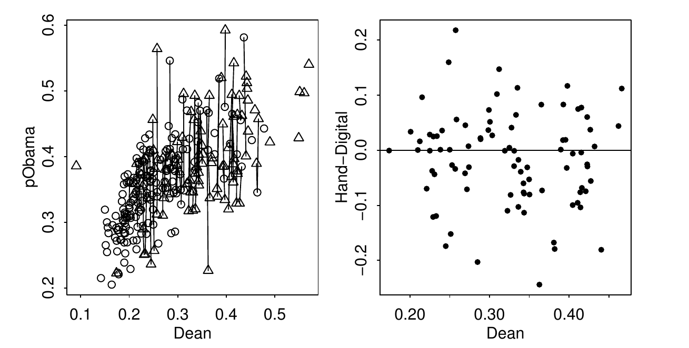
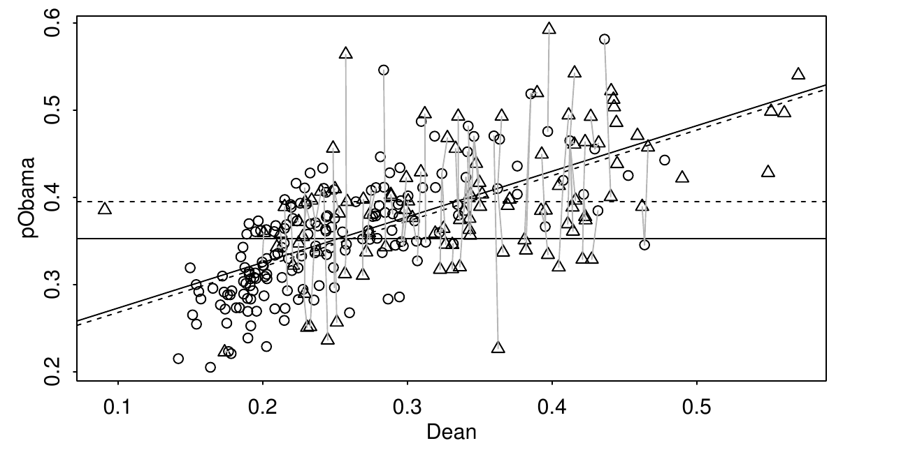

========================================================
author: 
date: 
autosize: true
incremental: true
width: 1920
height: 1080


========================================================

<h2>From last time...</h2>

* We considered the following notion of causality:
 
 * "<em>the causal effect of an action is the difference between the outcomes where the action was or was not taken</em>"
   
* In this understanding of causality we prototypically have an experiment with

  * a participant indexed by the letter $i$;
  
  * a measured quantity $\mathbf{Y}_i^T$ that may or may depend on the effect of some treatement;
  
  * $\mathbf{Y}_i^0$ will correspond to a control, where treatement <b>is not applied</b>;
  
  * $\mathbf{Y}_i^1$ will correspond to a test subject, where the treatment <b>is applied</b>; and
  
  * an effect $\delta_i \triangleq \mathbf{Y}_i^1 - \mathbf{Y}_i^0$.
  
* Usually, however, there will be no identical test subjects, and we can only observe one of $\mathbf{Y}^T_i$ for $T \in \{0, 1\}$.

* The outcome that we <em>cannot see</em> is called the <b>counterfactual</b>.

========================================================

<h3> An example without experimental design</h3>

* The 2008 Democratic primary election in New Hampshire was called into question over the discrepancies in districts with hand counted and digitally counted voting.

* Controversially, on paper ballots Obama had more votes, whereas Clinton only won the primary in districts that used the machine counting.

* Because the voting method shouldn't have any significant effect onthe outcome of the election, the integrity of the election was in question.

* We began by fitting  a model with only the voting system as the explanatory variable...

========================================================


```r
library("faraway")
newhamp$trt <- ifelse(newhamp$votesys == 'H',1,0)
lmodu <- lm(pObama ~ trt, newhamp)
sumary(lmodu)
```

```
             Estimate Std. Error t value  Pr(>|t|)
(Intercept) 0.3525171  0.0051728 68.1480 < 2.2e-16
trt         0.0424871  0.0085091  4.9932 1.059e-06

n = 276, p = 2, Residual SE = 0.06823, R-Squared = 0.08
```

* The model takes the form:

  $$\begin{align}
  y_i = \beta_0 + \beta_1T_i + \epsilon_i
  \end{align}$$
  
* where:

  * the response variable is the percentage of votes for Obama;
  
  * the base percentage of votes is represented by $\beta_0 \approx 35\%$;

  * when the voting system is by hand counting, $T_i = 1$ and the effect of a hand counting <em>in this model</em> is to add approximately $4\%$ to the vote total.
  
* We note that with the extremely small p-value for $\hat{\boldsymbol{\beta}}_1$, the effect of hand counting is statistically significant.

* In this case, we may conclude that Obama did receive significantly more votes in wards using hand counting, but this doesn't imply that <em>the voting method itself is the explanation</em>.

========================================================

* We will suppose that this is the correct model, up to an additional variable we have left out of our analysis:

  $$\begin{align}
  y_i = \beta_0 + \beta^\ast_1T_i + \beta^\ast_2 Z_i + \epsilon_i 
  \end{align}$$
  
  * Where, as an ansatz, we take
  $$\begin{align}
  Z_i \triangleq \gamma_0 + \gamma_1 T_i + \epsilon^{\ast}_i 
  \end{align}$$
  
* We wish thus to determine if there is a possible effect of a <b>confounding variable</b> in the model.

* In particular, we will consider the proportion of votes given to Howard Dean, the Democratic presidential candidate in 2004 as an explanatory variable on the response:


```r
lmodz <- lm(pObama ~ trt + Dean , newhamp)
sumary(lmodz)
```

```
              Estimate Std. Error t value Pr(>|t|)
(Intercept)  0.2211192  0.0112502 19.6547   <2e-16
trt         -0.0047538  0.0077608 -0.6125   0.5407
Dean         0.5228967  0.0416500 12.5545   <2e-16

n = 276, p = 3, Residual SE = 0.05443, R-Squared = 0.42
```

========================================================


* Things we thus note immediately are:
<ol>
  <li> the percentage of votes that went to Howard Dean in 2004 has a positive effect in this model, that dramatically counter-balances the effect of the counting method;</li>
  <li> the counting method in this model is no longer statistically significant, where the p-value is on the order of $54\%$.  That is, under the null hypothesis, leaving out the counting method as an explanatory variable, we would expect to see such a t-test value $\approx 54\%$ of the time.  The effect of the counting  method in this model (with respect to the Dean variable) is quite feasibly due to random chance;</li>
  <li> on the other hand, dropping the Dean variable out of the model seems like a bad choice; under the null hypothesis, leaving out Dean, the p-value for the t-test is on the order zero.
</ol>

* Recall the ansatz,
 
  $$\begin{align}
  Z_i \triangleq \gamma_0 + \gamma_1 T_i + \epsilon^{\ast}_i 
  \end{align}$$

* If we try to fit such a model, we see that we have a nonzero $\gamma_1$ with effectively $100\%$ confidence.


```r
sumary(lm(Dean ~ trt, newhamp))
```

```
             Estimate Std. Error t value  Pr(>|t|)
(Intercept) 0.2512886  0.0059850 41.9861 < 2.2e-16
trt         0.0903446  0.0098451  9.1766 < 2.2e-16

n = 276, p = 2, Residual SE = 0.07895, R-Squared = 0.24
```

========================================================

* Suppose we wish to follow the analogy of the clinical trial again, 

  * we might have individuals who differ in gender, age, health conditions, and other factors that can affect the outcome of the treatment;

  * we want to have individuals with equal (or extremely similar) traits balanced between the control and treatment populations to ensure that the traits of either group don't bias the results.

  * Knowing that there is some effect of a confounding variable in this analysis, we should specifically try to balance the effect of the confounding variable in both the control and treatment populations;
  
  * matching certain participants based on their relationship to the confouding variable, we will randomly select individuals from the matched groups as either a control or a treatment case.

* For the primary data, we will perform a similar procedure to match voting districts based on similar <em>proportions of votes going to Dean in 2004</em>, in order to evaluate the effect of the treatment, i.e., machine or hand counting of votes.

* Because this is observed data, we can't randomly assign the treament or control to these matched populations, but we will try to emulate the process.

========================================================

* Dean is a continuous variable (precentage of district that voted for Dean) so we set a threshold for matches.

* The GenMatch is a (stochastic) selection algorithm based on genetic principles --- by random initialization and selection, it goes through iterations to find a "best fit".


```r
library("Matching")
set.seed(123)
mm <- GenMatch(newhamp$trt, newhamp$Dean, ties=FALSE, caliper=0.05, pop.size=1000)
```

* We print some of the matches:


```r
head(mm$matches[,1:2])
```

```
     [,1] [,2]
[1,]    4  213
[2,]   17  148
[3,]   18    6
[4,]   19   83
[5,]   21  246
[6,]   22  185
```

========================================================

<div style="float:left; width:50%">

</div>

<div style="float:left; width:50%">
<ul>
  <li> In the left plot, we show the matched pairs --- hand voting wards are shown as
triangles and digital voting wards as circles. 
  <ul>
    <li> That is, for all New Hampshire districts, we separate these districts into two lists -- those that used either:</li>
    <ol>
      <li>digital; or</li>
      <li> hand counting of votes; </li>
    </ol>
    <li> and then produce as many matched pairs between lists as possible, by random (genetic) search.</li>
  </ul>
<li>Matched pair are linked by a line with hand counts as triangles and digital counts as circles.</li>

  <li> In the right plot, we show the matched pair differences.</li>
  <ul>
    <li> That is, let each pair be indexed by a number $i$ that identifies the pair;</li>
    <li> $T\in\{0, 1\}$ describes whether the district had hand counting ($T=1$) or digital counting ($T=0$);</li>
    <li> then, we denote $Y^T_i$ to be the observed percentage of votes for Obama in the 2008 primary election.
  </ul>
</ul>
</div>

========================================================

<div style="float:left; width:50%">

</div>

<div style="float:left; width:50%">
<ul>
 <li> We have now set up the close analog to the clinical experiment, with a control and treatment population of similar characteristics with respect to the confounding variable.</li>
 <li> We note that some districts go un-matched because the algorithm (after repeated attempts) couldn't find a maximal set of matches that could fit them in a pair with or without the treatment given our threshold.</li>
 <li> The differences in the treatment and control populations (the effect based on the cause),
 $$\begin{align}
 \delta_i = Y_i^1 - Y_i^0,
 \end{align}$$
 is thus represented by the differences in the right plot.</li>
 <li> We want to understand the random process represented by $\delta_i$.</li>
 <li> In particular, if the treatment doesn't introduce bias on the outcome of the vote, we should expect
 $$\begin{align}
 \mathbb{E}[\delta] = \frac{1}{N}\sum_{i=1}^N \delta_i \approx 0
 \end{align}$$
</ul>
</div>

========================================================

* Assuming Gaussiantiy of the increments, we will determine the significance of the alternative hypothesis that

  $$\begin{align}
  H_1: \mathbb{E}[\delta] \neq 0,
  \end{align}$$
  given the sample based mean and variance.

* The null hypothesis is,
  
  $$\begin{align}
  H_0: \delta \sim N(0, \sigma^\ast)
  \end{align}$$
  for <em>some value of $\sigma^\ast$</em>.


```r
pdiff <- newhamp$pObama[mm$matches[,1]] - newhamp$pObama[mm$matches[,2]]
t.test(pdiff)
```

```

	One Sample t-test

data:  pdiff
t = -1.8798, df = 86, p-value = 0.06352
alternative hypothesis: true mean is not equal to 0
95 percent confidence interval:
 -0.0328560272  0.0009183504
sample estimates:
  mean of x 
-0.01596884 
```

========================================================

<div style="float:left; width:50%">

</div>

<div style="float:left; width:50%">
<ul>
  <li> By inspection, this corroborates the observation that the differnces $\delta_i$ don't favor positive or negative impact on the percentage vote for Obama in the primaries.</li>
  <li> The data <em>appears sufficiently Gaussian</em>, that the assumptions of this test seem to be satisfied.</li>
  <ul>
    <li> We will return to this point, and how to test for Gaussianity, later in the course.</li>
  </ul>
  <li>  With this analysis we have established the following:
  <ol>
    <li>There is a statistically significant relationship between the districts where Obama held a majority in 2008 and those that used hand counted ballots</li>
    <li> However, in the presence of the popularity of Dean in 2004 as an explanatory variable, the counting method didn't show significance; the ansatz that there is a linear relationship between the Dean 2004 percentage and the districts with hand counting held with effective $100\%$ confidence.</li>  
    <li> Therefore, we are inclined to favor Dean as a <b>confounding variable</b> in the analysis.</li> 
  </ol>
</ul>
</div>


========================================================

* In order to account for the confounding variable, we emulate the system of designed experiments with <em>balanced treatment and control groups</em>.

* Using a (random) selection algorithm we try to enforced balanced populations with respect to the confounding variable:
<ol>
  <li>  We specify a small threshold for a match;
  <li> the algorithm searches for districts that have comparable values of the confounding variable Dean, within the threshold;</li>
  <li> a match is set if one used digital and one used hand counting, representing the control and treament groups respectively;</li>
  <li> and the algorithm iteratively searches for as many matches as possible.</li>
</ol>

* By creating balanced populations with respect to the confounding variable, we can refine our analsis and determine if the treatment, <em>hand counted votes</em> had a statistically significant effect accounting for the stronger predictor.

* We perform a hypothesis test to see if the treatment bias away from zero on the response (percent vote Obama 2008).

* According to the t-test, we cannot reject the null hypothesis, that difference of treatment and control groups is zero on average.

* In the following, we will visualize this process along with the difference between the two approaches.

========================================================

<div style="float:left; width:50%">

</div>

<div style="float:left; width:50%">
<ul>
  <li> On the left we plot the mean of the response (percentage of 2008 primary votes to Obama), modeled modeled as a response of:</li>
  <ol>
    <li> the method of vote counting (hand or digital) and the popularity of Dean in 2004; </li>
    <li> Solid (respectively dashed) lines corresponds to digital (respectively hand) counted votes;</li>
    <li> horizontal lines are irrespective of the confounding variable (Dean), and the models are fit only as a response of the voting method; </li>
    <li> lines with positve slopes are fitted with Dean as an explanatory variable; and</li>
    <li> matched pairs (control/ treatment) are represented by (circles/ triangles) and connected by grey lines.</li>
  </ol>
<li> In expected value (or on average) the difference between hand vote counting and digital vote counting is represented by the difference of the two sloped lines.</li>
<li> The matched pairs can be seen as local variation around the mean differences.</li>
<li> If we average all of the pairwise differences, we can likewise estimate the difference of mean responses by the mean of the differences.</li>
</ul>
/div>

========================================================

<ul>
<li> In this case, we find that both:</li>
<ol>
  <li> matching samples to produce balanced control and treatment groups between populations, based on the <b>covariat</b>; and</li>
  <li> including the <b>covariat</b> in the model itself</li>
</ol>
  <li>in this case actually estimate the same phenomon.</li>
</ul>
* Both techniques are useful for analysis. 
   * Including the confounding variable in model is known as "controlling for the covariat".
   
   * This has the advantage that it extends well to multiple explanatory variables, where we define the new model in terms of additional predictors.
   * The disadvantage is that we must specify the form for the model itself.
   
   * On the other hand, matching doesn't require us to specify an actual form for the relationship.
   * The weakness of this approach is that there has to be a sufficient number of matching pairs to form meaningful analysis over the control and treatment groups.
   
* Both methods coincide in this case because there is sufficient balance between the control and treatment group proportionally to the whole population to make meaningful conclusions.

* When there isn't much overlap, controlling for the covariat can still provide useful analysis but we have to be concious of extrapolation issues and uncertainty.

========================================================

<h2> Notes on explanation</h2>

*  In general, there are limits to the conclusions we can draw statistically from observational data.

*  Sir Bradford Hill, a figure in establishing the <em>causal link</em> between smoking and lung cancer made several reccomendations for how to study a causal link:
<ol>
  <li>Study the practical strength of the effect on response. This is not neccessarily in terms of high correlation or a small p-value but that the impact o $\hat{\beta}_i$ is large in the scale of the response.  If there is a large practical effect on the response variable, it is unlikely that another (un-modeled) variable would have a counter-active effect.</li>
  <li> Study the consistency of the results.  If smokers over many possible confounding variables all tend to get lung cancer, then the evidence is stronger.  Independent replication of results is an important link to causality.</li>
  <li> Consider the specificity of the causual factor.  If a particular lung disease is only prevalent in workers in a particular industry and those workers do not suffer from other problems any more than other industrial workers, then the case is stronger.</li>
  <li> Study the temporality to establish cause and effect.  You want to determine whether X causes Y or Y causes X, where there are many possible variables.</li>
  <li> Consider if the results corroborate other substantial evidence.  Determine the overal plausibility within existing understanding.</li>
</ol>

========================================================

<h1> Diagnostics</h1>

<ul> 
  <li> Our analysis and methodology for:</li>

  <ol>
    <li> fitting a linear model; </li>
    <li> forecasting predictions from a linear model; and</li>
    <li> explaning the relationships between variables in a linear model</li>
  </ol>
</ul>
* all rely on several assumptions, e.g., the conditions for the Gauss Markov theorem.

* Methods for checking and validating these assumptions are known as <b>diagnostics</b>.

* Typically, we will start with one model as a best first guess.

* Performing diagnostics will reveal issues in the  model, and suggest ways for improvement.

* Building a model is thus usually an interactive, iterative process, where we will create and perform diagnostics over a succession of models.

========================================================

<ul> 
  <li> In the rest of the class, we will consider 3 categories of potential issues with the model:</li>
  <ol>
    <li> Issues with the error/ variation.  Particularly, we have assumed that $\boldsymbol{\epsilon}\sim N(0, \sigma^2 \mathbf{I})$ such that the errors are normally distributed, independent and of constant variance.</li>
    <li> Issues with the systematic part of the model.  Particularly, we have assumed that there is an actual signal in the data of the form
    $$\begin{align}
    \mathbb{E}[\mathbf{Y}] = \mathbf{X} \boldsymbol{\beta},
    \end{align}$$
    which may not be valid.</li>
    <li> Issues with unusual observations.  Some of the observations may not fit the model, and they might change the choice and the fit of the model</li>
  </ol>
</ul>

* On Wednesday, we will begin the study of diagnostics.
