========================================================
author: 
date: 
autosize: true
incremental: true
width: 1920
height: 1080
  
========================================================

<h1>From last time...</h1>

<h2> Diagnostics Checking error assumptions</h2>

* If we wish to check the assumptions on the error or variation in the signal $\boldsymbol{\epsilon}$, we need to consider, $\boldsymbol{\epsilon}$ itself is not observable.

* Therefore, if we will typically use the residuals as a proxy for the true errors to validate our assumptions.


* Assuming that the error $\boldsymbol{\epsilon} \sim N\left(0, \mathbf{I}\sigma^2\right)$, we can derive that
$$\begin{align}
\hat{\boldsymbol{\epsilon}} & \sim N\left( 0, \sigma^2\left(\mathbf{I} - \mathbf{H}\right)\right)
\end{align}$$

  * where $\mathbf{H} = \mathbf{X}\left(\mathbf{X}^\mathrm{T} \mathbf{X}\right)^{-1} \mathbf{X}^\mathrm{T}$

========================================================


<div style="float:left; width:40%">
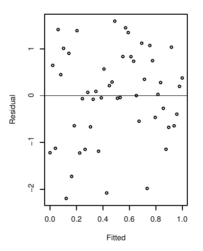
</div>

<div style="float:left; width:60%">
<ul>
  <li> To the left is a plot where:</li>
  <ol>
    <li> The horizontal (x-axis) represents the fitted value $\hat{\mathbf{Y}}$, as in some model $\hat{\mathbf{Y}}=\mathbf{X}\hat{\boldsymbol{\beta}}$.</li>
    <li> The vertical axis (y-axis) represents the corresponding residual $\hat{\boldsymbol{\epsilon}}$ value, equal to $\mathbf{Y} - \hat{\mathbf{Y}}$.
  </ol>
  <li>Suppose that the variances of the error $\boldsymbol{\epsilon}$ are <b>not fixed</b>, i.e.,</li> 
    <ul>
      <li> suppose that <b>some</b> observations have <b>more</b> variation and <b>some</b> observations have <b>less</b> variation around the signal, $\mathbf{X}\boldsymbol{\beta}$. </li>
    </ul>
  <li>In this case, there is <b>dependence</b> of the variation (or error $\boldsymbol{\epsilon}$) on the <b>observation</b>.</li>
  <li> To the left, this is actuall a <b>well behaved</b> situation.  In particular, the residuals show variation that doesn't seem to depend on the value of the fitted value/ observation.</li>
  <li> The mean of the residuals appears to be zero as well, because there isn't a clear preference for positive or negative residuals</li>
  <li> The situation to the left is denoted <b> homoscedasticity.</b>
</ul>
</div>

========================================================

<div style="float:left; width:40%">
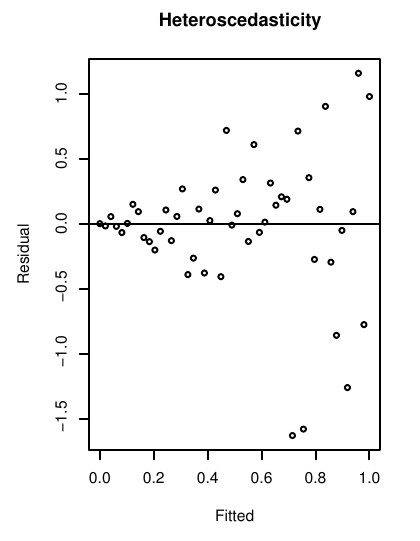
</div>

<div style="float:left; width:40%">
<ul>
  <li> The non-constant variance of $\hat{\boldsymbol{\epsilon}}$ to the left is known as <b>heteroscedasticity</b>.</li>
  <li> In this case, there is a clear dependence on the <b>variation</b> of $\hat{\boldsymbol{\epsilon}}$ on the fitted value/ the observation.</li>
  <li> Heteroscedasticity does not, in itself, cause ordinary least squares coefficient estimates to be biased;</li>
  <li> however, the theoretical estimates of the variance of the residuals (and therefore the standard errors) will become biased.</li>
  <li> The bias in the standard errors complicates our ability to accurate quantify the uncertainty, and therefore to accurately:</li>
  <ol>
    <li> make hypothesis tests on the parameters for significance;</li>
    <li> provide confidence intervals for the parameters;</li>
    <li> provide accurate prediction intervals and confidence intervals for the  mean response;</li>
    <li> provide explanatory power in the relationship between the response and the explanatory variables.</li>
  </ol>
</ul>
</div>


========================================================

<div style="float:left; width:40%">
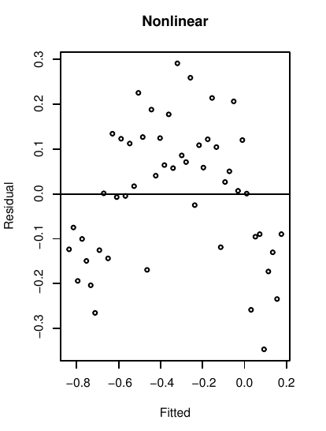
</div>

<div style="float:left; width:60%">
<ul>
<li> Using the same plot as before, we can likewise determine if there is actually nonlinearity in the residuals.</li>
<li> The plot at the left exhibits a nonlinear dependence of the residual on the fitted/ observed values</li>
<li> The same technique can also be used replacing the fitted values $\hat{\mathbf{Y}}$ in the horizontal axis with any other variable in the model $\mathbf{X}_i$, to determine dependence of the residual on the explanatory variables.</li>
<li> Additionally, we may consider how the residual varies across variables $\mathbf{X}_i$ that we have data for, but have not included as explanatory variables on the response.</li>
<li> In particular, if there is a dependence structure for the residuals on the variable that was left out of the model, it suggests that we should consider its impact on the response and/or if it is a variable that is tightly correlated with our existing model variables.</li>
<li> We will illustrate this with an example in R</li>
</ul>


========================================================

<h2>An example of non-constant variance</h2>

* We will consider the "savings" dataset, listing the average savings rate, age demographics and per capita incomes of fifty countries avveraged over 1960 -1970.


```r
library("faraway")
head(savings)
```

```
             sr pop15 pop75     dpi ddpi
Australia 11.43 29.35  2.87 2329.68 2.87
Austria   12.07 23.32  4.41 1507.99 3.93
Belgium   13.17 23.80  4.43 2108.47 3.82
Bolivia    5.75 41.89  1.67  189.13 0.22
Brazil    12.88 42.19  0.83  728.47 4.56
Canada     8.79 31.72  2.85 2982.88 2.43
```

* <b>sr</b> - is the savings rate, calculated as personal savings divided by disposable income;

* <b>pop15</b> - is the percent of the countrys' populations under age 15;
 
* <b>pop75</b> - is the percent of the countrys' populations over age 75;
 
* <b>dip</b> - is the per-capita disposable income in dollars;

* <b>ddpi</b> - is the percent growth rate of dpi.


```r
lmod_savings <- lm(sr ~ pop15+pop75+dpi+ddpi,savings)
```


========================================================

* With this model, we plot the residuals versus the fitted values:

```r
par(mai=c(1.5,1.5,.5,.5), mgp=c(3,0,0))
plot(fitted(lmod_savings),residuals(lmod_savings),xlab="Fitted",ylab="Residuals", cex=3, cex.lab=3, cex.axis=3) 
abline(h=0)
```

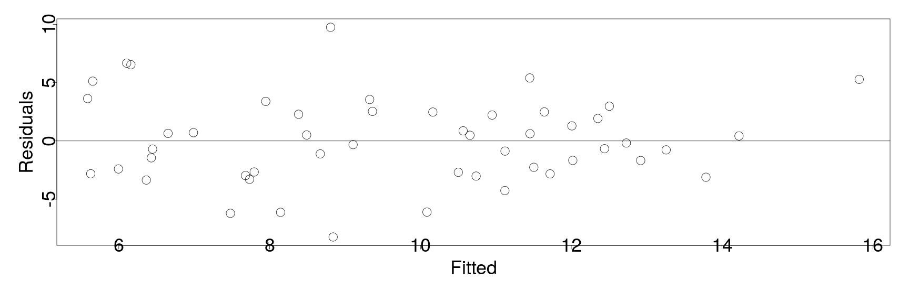
* From the initial inspection, we do not notice anything particularly structured about the residuals -- indeed they are roughly symmetric around zero and in the fitted value.

========================================================

<div style="float:left; width:60%">
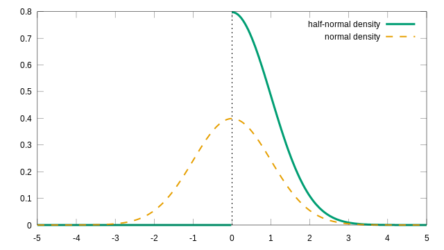
Courtesy of Nagelum <a href="https://creativecommons.org/licenses/by-sa/4.0" target="blank">CC BY-SA 4.0</a> via Wikimedia Commons 
</div>

<div style="float:left; width:40%">
<ul>
 <li> Therefore, to investigate the constant variance assumption more closely, we will "zoom" in on the residuals.</li>
 <li> In particular, we will consider the plot of the square root of the absolute residuals, i.e.,
 $$\begin{align}
 \sqrt{\vert\hat{\boldsymbol{\epsilon}}\vert}
 \end{align}$$
 </li>
 <li> Under the assumption $\boldsymbol{\epsilon}\sim N(0, \mathbf{I}\sigma^2)$, the values of $\vert\hat{\boldsymbol{\epsilon}}\vert$ are distribted according to the half normal distribution
 <ul>
  <li> the relationship between the normal distribution and the corresponding half-normal distribution is illustrated on the left.</li>
 </ul>
 <li> Having excluded the nonlinearity expressed in other plots, we will focus on the absolute values to increase the resolution of the residuals as a response of the fitted values. </li>
 <li> However, the half normal distribution is very skewed away from zero, so we make a change of scale with the square root of the absolute values in order to keep it well behaved.</li>
</ul>
</div>

========================================================

* In the case below, we plot $\sqrt{\vert\hat{\boldsymbol{\epsilon}}\vert}$ versus the fitted values


```r
par(mai=c(1.5,1.5,.5,.5), mgp=c(3,0,0))
plot(fitted(lmod_savings),sqrt(abs(residuals(lmod_savings))), xlab="Fitted",ylab=expression(sqrt(hat(epsilon))), cex=3, cex.lab=3, cex.axis=1.5)
```

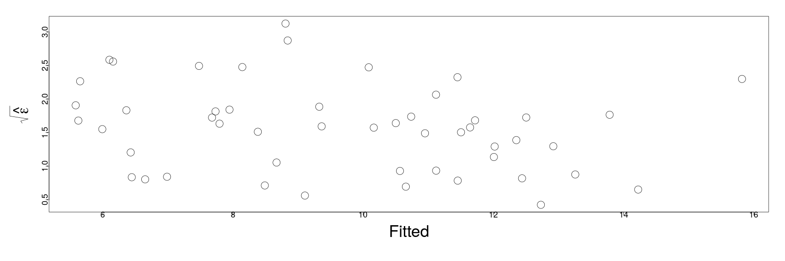

* We note in this case as well (irrespectively of sign) the residuals have approximately even variation.


* We can similarly consider if there is a structural dependence of the residuals in terms of the fitted values <em>numerically</em> using linear modeling techniques.


========================================================

* Specifically, we will consider the linear model with $\sqrt{\vert\hat{\boldsymbol{\epsilon}}\vert}$ as the response and $\hat{\mathbf{Y}}$ as the explanatory variable:


```r
summary(lm(sqrt(abs(residuals(lmod_savings))) ~ fitted(lmod_savings)))
```

```

Call:
lm(formula = sqrt(abs(residuals(lmod_savings))) ~ fitted(lmod_savings))

Residuals:
     Min       1Q   Median       3Q      Max 
-1.04038 -0.55845  0.01888  0.32129  1.50106 

Coefficients:
                     Estimate Std. Error t value Pr(>|t|)    
(Intercept)           2.16216    0.34788   6.215 1.17e-07 ***
fitted(lmod_savings) -0.06137    0.03476  -1.766   0.0838 .  
---
Signif. codes:  0 '***' 0.001 '**' 0.01 '*' 0.05 '.' 0.1 ' ' 1

Residual standard error: 0.6341 on 48 degrees of freedom
Multiple R-squared:  0.06099,	Adjusted R-squared:  0.04142 
F-statistic: 3.117 on 1 and 48 DF,  p-value: 0.08382
```

* We remark that we should perform weighting and adjustment of the degrees of freedom in the model but, naively, this can be used as a test for a linear relationship in the data between the residual and fitted values.

* From the summary, we find that the fitted values are not statistically significant at $5\%$ in explaining the residuals, and moreover, the R-squared is extremely small.

* Particularly, we cannot reject the null model that residuals simply vary randomly about their mean.

========================================================

<h2> Note: </h2> 

* The previous numerical test only looked at the linear relationship between the residuals and the fitted values.

  * If we hadn't tested for a nonlinear relationship as in the first graphical plot, we could not rule this out with the linear model test.
  
*  If we thought there was a particular type of non-constant variance, we may be able to use more exact statistical methods.  

  * This would consist of accepting or rejecting a particular type of non-constant variance.

* However, plotting the residuals is a more general approach that is versatile in detecting many types of issues at once, so we emphasize this.

========================================================

* We will now consider the plot of the residual versus the explanatory variables of the model:


```r
par(mai=c(1.5,1.5,.5,.5), mgp=c(3,0,0))
plot(savings$pop15,residuals(lmod_savings), xlab="Population under 15", ylab="Residuals", cex=3, cex.lab=3, cex.axis=1.5)
abline(h=0)
```

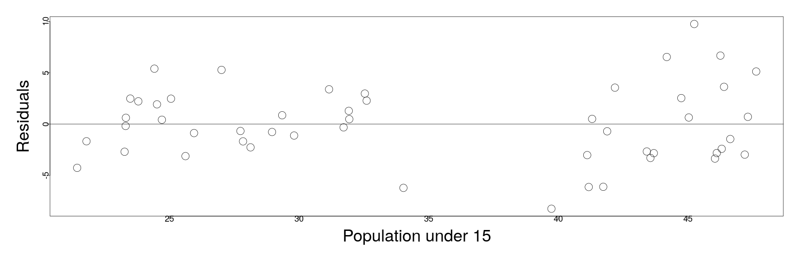

* We note that there are two distinct groups illustrated in the population below 15, 

========================================================

* while on the other hand, the residuals are of uniform variation with respect to the values for the population over 75.


```r
par(mai=c(1.5,1.5,.5,.5), mgp=c(3,0,0))
plot(savings$pop75,residuals(lmod_savings),xlab="Population over 75",ylab="Residuals", cex=3, cex.lab=3, cex.axis=1.5)
abline(h=0)
```

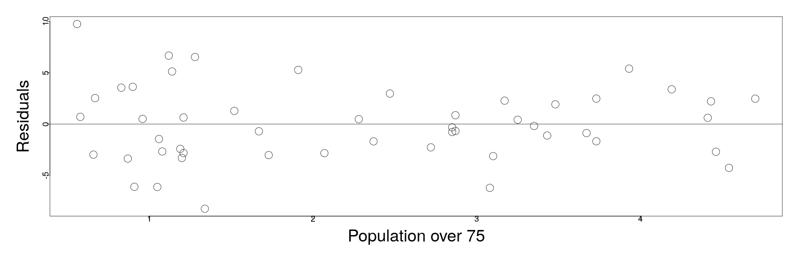

* We are motivated thus to determine if there is non-constant variance in the residuals with respect to the pop15 predictor...

========================================================
<h2>The F-test for variance</h2>

*  Suppose we have two independent samples from two Gaussian distributions of unknown variances respectively, i.e.,

  $$\begin{align}
x &\sim N(\mu_x ,  \sigma^2_x)  & &
z \sim N(\mu_z ,  \sigma^2_z)  
\end{align}$$

  * for $m,n>1$, we have samples of $x$ and $z$ respectively as $\left\{x_i\right\}_{i=1}^n$ and $\left\{z_i\right\}_{i=1}^m$.

* Then, we may compute the <b>sample-based means</b> of the two distributions above as,

$$\begin{align}
\tilde{x} &\triangleq \frac{1}{n}\sum_{i=1}^n x_i & &
\tilde{z} \triangleq \frac{1}{m}\sum_{i=1}^m z_i
\end{align}$$

* And likewise, we can compute the <b>sample-based variances</b> as,

$$\begin{align}
S_x^2 \triangleq &  \frac{1}{n-1} \sum_{i=1}^n\left(x_i - \tilde{x}\right)^2 & &
S_z^2 \triangleq \frac{1}{m-1}\sum_{i=1}^m \left(z_i - \tilde{z}\right)^2
\end{align}$$


========================================================

<h2> F-test continued...</h2>


 <div style="float:left; width:50%">

Courtesy of IkamusumeFan [CC BY-SA 4.0 (https://creativecommons.org/licenses/by-sa/4.0)]
</div>
<div style="float:right; width:50%">

<ul>
  <li> Consider the following null and alternative hypothesis:
  $$\begin{align}
  H_0 : &\sigma^2_x = \sigma^2_z \\
  H_1 : & \sigma^2_x \neq \sigma^2_z
  \end{align}$$
  </li>
<li> Under the previous assumptions, and the null hypothesis $H_0$, the <b>ratio</b> of the two sample based variances is an F-statistic

  $$\begin{align}
  \frac{S_x^2}{S_z^2}\sim F_{(n-1,m-1)}
\end{align}$$
</li>
<li> If the p-value of the above ratio is greater than the pre-specified significance ($5\%$ typically) then we fail to reject the null hypothesis, i.e., $\sigma^2_x = \sigma^2_z$.
</ul>
</div>

========================================================

<h2> Returning to the regression analysis...</h2>
<div style="float:left; width:40%">

</div>
<div style="float:left; width:60%">
<ul>
 <li> We wish to determine if there is non-constant variance in the residuals with respect to the values of the explanatory variable "pop15".</li>
 <li> This is of course, a violation of the Gauss-Markov theorem assumptions.  We want to test this concretely with the F-test for variances.</li>
 <li> As in the F-test described earlier, we take
   <ul>
    <li> $\left\{x_i \right\}_{i=1}^n$ will be the residuals, only for the observations which correspond to a country with the percent of population under 15, <b>less</b> than $35\%$;</li>
    <li> $\left\{z_i \right\}_{i=1}^m$ will be the residuals, only for the observations which correspond to a country with the percent of population under 15, <b>greater</b> than $35\%$.</li> 
    </ul>
 </li>
 <li> Then assuming that both sample populations are normally distributed with unknown variance, we will use an F-test to determine if the variances are equal.</li>
</ul>
</div>

========================================================

* We perform the above F-test in the following code:


```r
var.test(residuals(lmod_savings)[savings$pop15>35], residuals(lmod_savings)[savings$pop15<35])
```

```

	F test to compare two variances

data:  residuals(lmod_savings)[savings$pop15 > 35] and residuals(lmod_savings)[savings$pop15 < 35]
F = 2.7851, num df = 22, denom df = 26, p-value = 0.01358
alternative hypothesis: true ratio of variances is not equal to 1
95 percent confidence interval:
 1.240967 6.430238
sample estimates:
ratio of variances 
          2.785067 
```

* We see two dual measures for the F-test of variances above:

  * Firstly, the p-value is less than $2\%$ so we reject the null hypothesis (equal variances) with $5\%$ significance.
  
  * Secondly, the $95\%$ confidence interval <b>for the ratio of variances</b> excludes one, such that with $95\%$ confidence we exclude the possibility  that their variances are equal.
  
========================================================

<h2> Changes of scale for variables</h2>

* Often, when non-constant variances are detected, we may consider a change of scale as a remedial measure.

* We will return to a more general formulation later, but for now, we will motivate why we often consider log or square root scale.

* If we detect non-constant variance in the residuals with respect to the fitted values, we may consider a tranformation of the response variable $Y$ by a (nonlinear) function $h()$ for which
$$
var\left( h(\mathbf{Y}_i )\right) = \sigma_0^2
$$
for all $i$ and some value of $\sigma_0$.

* With this motivation, we suppose that such a transformation does exist and has a Taylor series defined around the mean of the response:
  
  $$\begin{align}
  h(Y) &= h\left(\mathbb{E}(Y)\right) + \left(Y- \mathbb{E}(Y)\right) h'(\mathbb{E}(Y)) + \mathcal{O}\left(\delta_Y^2\right)
\end{align}$$

* We will suppose that all terms that are of order 2 or above in the expansion of the anomalies, 
  
  $$\begin{align}
  \delta_Y & \triangleq Y - \mathbb{E}(Y)
\end{align}$$
can be neglected.

========================================================

* Supposing as on the last slide, we can neglect the higher order terms, we approximate,

  $$\begin{align}
\mathbb{E}\left[ h(Y)\right]& \approx \mathbb{E}\left[h\left(\mathbb{E}(Y)\right) + \left(Y- \mathbb{E}(Y)\right) h'(\mathbb{E}(Y)) \right]\\
& \approx h\left(\mathbb{E}(Y)\right)
\end{align}$$

as long as the deviations from the mean are not too large, and/or the function $h$ is not extremely nonlinear.

* With the above approximation, we can compute,

  $$\begin{align}
  var(h(y)) & \approx \mathbb{E}\left[\left(\left(Y- \mathbb{E}(Y)\right) h'(\mathbb{E}(Y))\right) \left(\left(Y- \mathbb{E}(Y)\right) h'(\mathbb{E}(Y))\right) \right]\\
  & \approx \left(h'(\mathbb{E}(Y))\right)^2 var(Y)
\end{align}$$

* Thus, up to our approximations, this suggest the following relationship:

  * suppose that
    $$\begin{align}
    h'\left(\mathbb{E}(Y)\right) \propto \left(var(Y)\right)^{-1/2}  & \Leftrightarrow  & h'\left(\mathbb{E}(Y)\right) =  \left(var(Y)\right)^{-1/2} C
    \end{align}$$
for some constant $C$.
  
  * If the above relationship holds, then we find  by our approximation that
  $$\begin{align}
  var(h(y)) & \approx C
  \end{align}$$
  
========================================================

* Let's suppose that all the above holds and $h'\left(\mathbb{E}(Y)\right) \propto \left(var(Y)\right)^{-1/2}$.

* In this case, if such a transformation did exist, this suggests a functional form such as,

  $$\begin{align}
  h(y) = \int \frac{dy}{\sqrt{var(y)}} = \int\frac{dy}{sd(y)}
  \end{align}$$

though noting that the above doesn't have a real meaning.

*  However, using the intuition derived this way, we can consider the following derived "rules-of-thumb",

 * suppose that $var(Y) = var(\boldsymbol{\epsilon}) \propto \left(\mathbb{E}(Y)\right)^2$, then
   $$\begin{align}
   h(y) \approx \int \frac{dy}{y}  \approx log(y);
   \end{align}$$

 * suppose that $var(Y) = var(\boldsymbol{\epsilon}) \propto \mathbb{E}(Y)$, then
  $$\begin{align}
   h(y) \approx \int \frac{dy}{y^2}  \approx y^{1/2}.
   \end{align}$$

* Note: neither of the above transformations make sense when $Y$ has non-positive values, due to invertibility issues.

========================================================

* As with many of these techniques, there isn't generally an exact way to derive such a transformation of scale, and our derivations ealier were very loose approximations.

* Generally, we must perform the residual versus fitted plots to:

  1. look for non-constant variance;
  2. nonlinear behaviors;
  3. possible suggestions for nonlinear changes of scale, based on the standard deviation as above.
  
* When trying a change of scale, we should repeat the above steps to determine if the change of scale has had a remedial effect, or if we should try to use a different change of scale again.

========================================================

* As a concrete example of the change of scale of the response, let's look at the Galapagos data once again.


```r
lm_gala <- lm(Species ~ Area + Elevation + Scruz + Nearest + Adjacent, gala)
par(mai=c(1.5,1.5,.5,.5), mgp=c(3,0,0))
plot(fitted(lm_gala),residuals(lm_gala),xlab="Fitted",ylab="Residuals", cex=3, cex.lab=3, cex.axis=1.5)
abline(h=0)
```

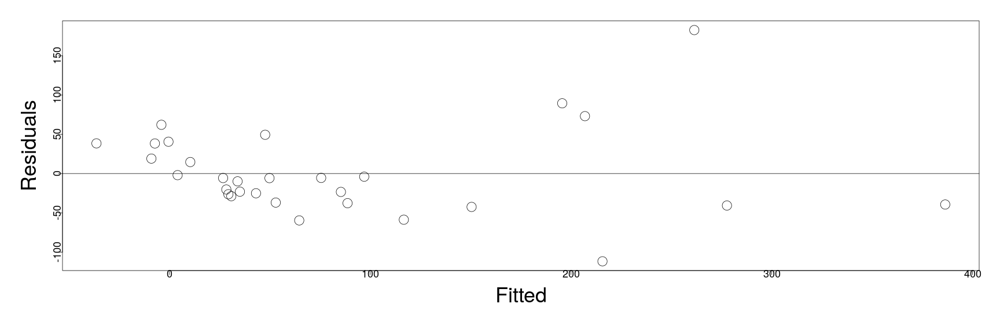

* We see a nonlinear relationship suggested by the residual versus fitted plot.

========================================================
<div style="float:left; width:50%">
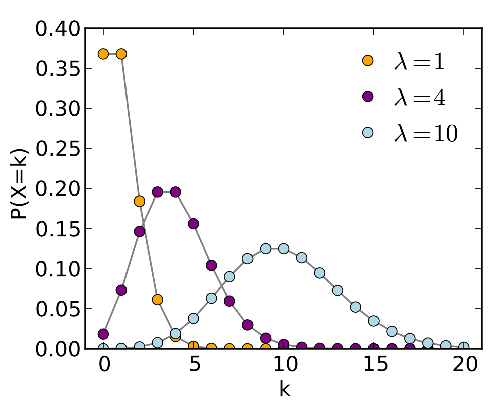
Courtesy of Skbkekas <a href="https://creativecommons.org/licenses/by/3.0" target="blank">CC BY 3.0</a> via Wikimedia Commons 
</div>

<div style="float:left; width:50%">
<ul>
  <li> Consider the particular response variable, "number of plant species". </li>
  <li> We note that the Poisson distribution is a distribution that is typically used to model queues and counting, and may be appropriate for this response.</li>
  <li> A special feature of this particular distribution is that the mean is actually equal to the variance. </li>
  <li> Given the previous derivations, this suggests that we might re-scale the response by a square root transformation.</li>
</ul>
</div>


========================================================

* We re-fit the model with the square root of the number of species as the response variable instead:

```r
lm_sqrt_sp <- lm(sqrt(Species) ~ Area + Elevation + Scruz + Nearest + Adjacent, gala)
```

* and we furthermore plot the residuals versus fitted values

```r
par(mai=c(1.5,1.5,.5,.5), mgp=c(3,0,0))
plot(fitted(lm_sqrt_sp),residuals(lm_sqrt_sp),xlab="Fitted",ylab="Residuals", cex=3, cex.lab=3, cex.axis=1.5)
abline(h=0)
```

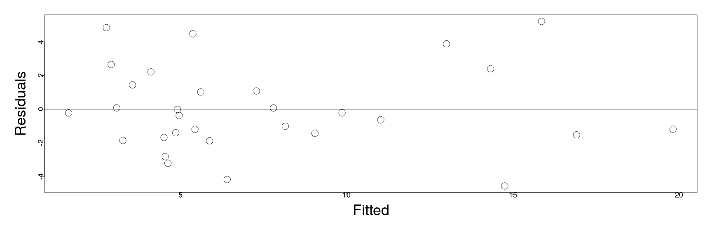

* In this case, the nonliear structure is basically eliminated, and the variance is basically constant.

========================================================

* We verify the previous visual inspection once again with the quantitative inspection via a linear model:


```r
summary(lmod <- lm(lm_sqrt_sp$residuals ~ lm_sqrt_sp$fitted.values))
```

```

Call:
lm(formula = lm_sqrt_sp$residuals ~ lm_sqrt_sp$fitted.values)

Residuals:
    Min      1Q  Median      3Q     Max 
-4.5572 -1.4969 -0.3031  1.3527  5.2110 

Coefficients:
                           Estimate Std. Error t value Pr(>|t|)
(Intercept)               8.117e-16  8.855e-01       0        1
lm_sqrt_sp$fitted.values -8.611e-17  9.958e-02       0        1

Residual standard error: 2.568 on 28 degrees of freedom
Multiple R-squared:  1.909e-32,	Adjusted R-squared:  -0.03571 
F-statistic: 5.345e-31 on 1 and 28 DF,  p-value: 1
```

* with a p-value for the F-test at 1, we must almost surely accept the null hypothesis that there is no linear relationship between the residual and the fitted values.

