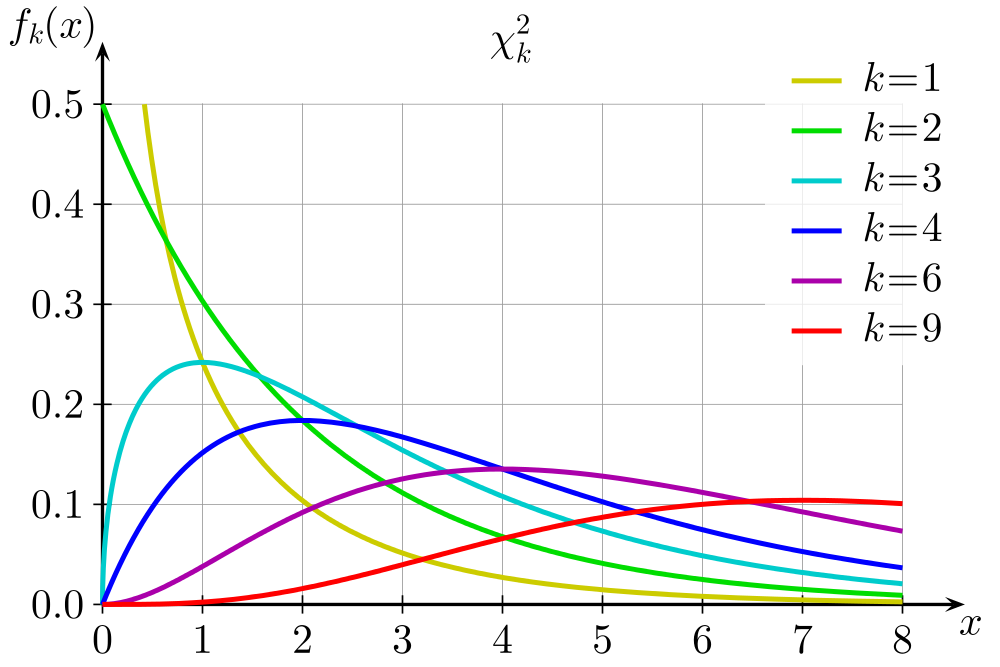
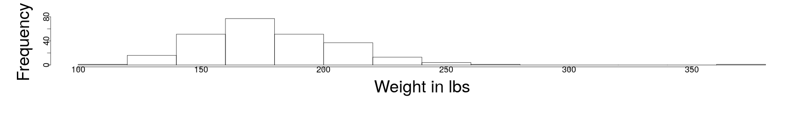
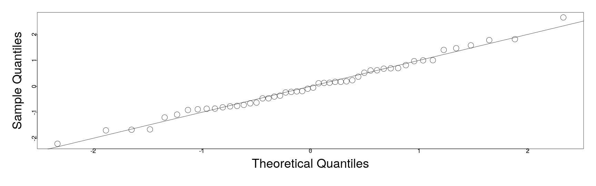

========================================================
author: 
date: 
autosize: true
incremental: true
width: 1920
height: 1080
  
========================================================

<h1>Review from last time...</h1>

* We noted that Gaussianity of the error wasn't required by the Gauss-Markov theorem, rather this gauranteed that least-squares was the <emph>maximum likelihood estimator</em>.

* Without Gaussianity of the errors, least-squares is still the best linear unbiased estimator, but we may find that a linear model in itself is not appropriate.

* Additionally, our confidence intervals and hypothesis tests utilized the Gaussian assumption on the error.

* However, we can sometimes make due "OK" with slightly innacurate uncertainty quantification, if the <b>sample sizes are sufficiently large</b>...
  
* Particularly, the hypothesis testing and confidence intervals we have developed can be understood as good approximations due to the central limit theorem.


========================================================

<h2> Central limit theorem</h2>

* Suppose we have a sequence of random variables, $\left\{X_i \right\}_{i=1}^\infty$ which are independent, identically disributed <emph>from any distribution</emph>, such that for all $i$
<ol>
  <li> $\mathbb{E}[X_i] = \mu$; and</li>
  <li> $var(X_i) = \sigma^2$, for some finite $\sigma$.</li>
</ol>

* For each $n\geq 1$ define the sample based mean of the sequence $\left\{X_i \right\}_{i=1}^n$

  $$\begin{align}
  \tilde{X}_n \triangleq \frac{1}{n} \sum_{i=1}^n X_i
  \end{align}$$

* Then, as the number of random variables $n\rightarrow \infty$, the sample-based means
  
  $$\begin{align}
  \sqrt{n}\left(\tilde{X}_n - \mu\right) {\xrightarrow {d}} N(0, \sigma^2)
  \end{align}$$
  where the convergence is in distribution.
  
* Put another way, for $n$ sufficiently large, $\tilde{X}_n$ has <b>approximately</b> a $N\left(\mu, \frac{\sigma^2}{\sqrt{n}}\right)$ distribution.

* Therefore, <b>for large sample sizes</b>, we can produce confidence intervals for the mean of the unbiased estimator (the true $\boldsymbol{\beta}$) from the sample based estimate (the least squares solution $\hat{\boldsymbol{\beta}}$) as usual, which will <b>be a good approximation</b> if not strictly accurate.

========================================================

<h3> A summary of issues with non-Gaussianity</h3>

* Generally, when facing a non-Gaussian error distribution the solution will depend on the types of issues detected.

* For a large number of observations, we can usually ignore issues of non-Gaussianity for uncertainty quantification due to the Central Limit Theorem.

* This is also often the case for short-tailed disributions.

* For skewed distributions, a nonlinear tranformation of the response may alleviate the issuse, 
  
  * e.g., log transformation or square-root.

* For long-tailed distributions, we may need to use more robust methods, e.g. bootstrapping (not covered in lecture but discussed in the text).

========================================================

<h2> Correlated Errors</h2>

* There aren't very general methods for testing for the correlation of the errors $\boldsymbol{\epsilon}$, i.e.,

  * let 
  
   $$\begin{align}
    cov\left(\boldsymbol{\epsilon}\right)\triangleq &\mathbb{E}\left[\boldsymbol{\epsilon} \boldsymbol{\epsilon}^\mathrm{T}\right] = \boldsymbol{\Sigma}^2,
    \end{align}$$ 
  
  then it is difficult generally to test based on the residuals if the non-diagonal entries of $\boldsymbol{\Sigma}$ are non-zero.
  
  * That is, whether we can even write 
  
  $$\boldsymbol{\Sigma}^2 = 
  \begin{pmatrix}
    \sigma_1^2 & 0 & \cdots & 0 \\    
    0 & \sigma_2^2 & \cdots & \vdots \\
    \vdots & \ddots & \ddots & \vdots \\
    0 & 0 & \cdots & \sigma_n
  \end{pmatrix}$$
  for possibly different $\sigma_i$, but strictly diagonal.


========================================================
    
  * Recall that even when $\boldsymbol{\Sigma}^2 = \sigma^2 \mathbf{I}$, the residuals are not generally uncorrelated as,
  
  $$\begin{align}
  cov \left( \hat{\boldsymbol{\epsilon}} \right) = \sigma^2 \left(\mathbf{I} - \mathbf{H}\right)
  \end{align}$$
  
* Therefore, we must usually anticipate the issues from the structure of the problem itself, e.g,
<ol>
  <li>in time series problems, we shoud check for time correlation of the errors; </li>
  <li>in spatial data, we should check for correlation in the errors spatially;</li>
  <li>data collected in particular batches should be checked for correlations between observations within particular batches;</li>
  <li>etc...</li>
</ol>
    
* Typically, this will include (as usual) a mixture of visual inspection to feel the data for issues, and numerical verification of our intuition.

========================================================

<h3> An example of time-correlated errors </h3>

<div style="float:left; width:50%">


<br>
  Ice core sample hole. Image courtesy of <a href="https://www.ncdc.noaa.gov/news/what-are-proxy-data" target="blank">NOAA - National Centers for Environmental Information</a>
</div>

<div style="float:left; width:50%">
<ul>
<li> If we wish to model and understand the changing climate, we must bear in mind that there are only accurate measures of temperatures available since the early 1850's.</li>
<li> To estimate the average land surface temperature in a region for dates further back in time, we can use proxy data including, e.g,</li>

  <ol>
  <li> tree rings, which show the relative intensity of winters, summers and precipitation;</li>
  <li> ice core samples, which give stratified layers demonstrating the relative intensity of summer melting and precipitation events;</li>
  <li> corals, which by chemical properties of their skeletons can be used to estimate the ocean temperature in which they formed;</li>
  <li> and others...</li>
  </ol>
</ul>
</div>
<ul>
<li> In this context, we can consider building a linear model for the average northern hemisphere surface temperature as the response, with the proxy data as the explanatory variables.</li>
<li> Fitting the relationship where there are reliable observations of the temperature, we can predict the average surface temperature when we lack these futher back in time, based upon the proxies which extend much further.</li>
</ul>


========================================================

* We will use the data from Faraway, Globwarm,


```r
library("faraway")
head(globwarm)
```

```
     nhtemp  wusa jasper westgreen chesapeake tornetrask urals mongolia
1000     NA -0.66  -0.03      0.03      -0.66       0.33 -1.49     0.83
1001     NA -0.63  -0.07      0.09      -0.67       0.21 -1.44     0.96
1002     NA -0.60  -0.11      0.18      -0.67       0.13 -1.39     0.99
1003     NA -0.55  -0.14      0.30      -0.68       0.08 -1.34     0.95
1004     NA -0.51  -0.15      0.41      -0.68       0.06 -1.30     0.87
1005     NA -0.47  -0.15      0.52      -0.68       0.07 -1.25     0.77
     tasman year
1000  -0.12 1000
1001  -0.17 1001
1002  -0.22 1002
1003  -0.26 1003
1004  -0.31 1004
1005  -0.37 1005
```

* <b>nhtemp</b> - is the average northern hemisphere temperature, in degrees celcius, which only has data available back to 1856 (thus the NA values).

* <b>westgreen</b> - is the ice core proxy information from western Greenland.

* <b>chesapeake</b> - is sea shell proxy information from Chesapeake Bay.

* <b>tornetrask</b> - is tree ring proxy information from Sweden.

* <b>urals</b> - is tree ring proxy information from the Ural mountains.

========================================================


```r
tail(globwarm)
```

```
     nhtemp wusa jasper westgreen chesapeake tornetrask urals mongolia
1995   0.49 0.85   0.39     -0.23      -0.76       0.85   0.6     1.31
1996   0.22 0.83   0.37     -0.24      -0.55       0.69   0.6     1.33
1997   0.48 0.82   0.35     -0.23      -0.32       0.56   0.6     1.33
1998   0.66 0.82   0.34     -0.21      -0.07       0.44   0.6     1.30
1999   0.46 0.84   0.32     -0.20       0.17       0.37   0.6     1.24
2000   0.40 0.88   0.31     -0.19       0.39       0.34   0.6     1.13
     tasman year
1995   0.55 1995
1996   0.52 1996
1997   0.50 1997
1998   0.49 1998
1999   0.49 1999
2000   0.50 2000
```

* <b>mongolia</b> - is tree ring proxy information from Mongolia.

* <b>tasman</b> - is tree ring proxy informatino from Tasmania.

* In the tail, we have accurate temperature measurements into the year 2000.

* The default behavior in R is to omit any lines where there are missing values, so we can fit the model directly only on the years 1856-2000 as below:


```r
lmod <- lm(nhtemp ~ wusa + jasper + westgreen + chesapeake + tornetrask + urals + mongolia + tasman, globwarm)
```

========================================================

* <b>Q:</b> What kind of plot would make sense in this instance to study the <emph>time-correlation</emph> of the errors?

* <b>A:</b> we can once again plot the residuals, but in this context versus the time variable


```r
par(mai=c(1.5,1.5,.5,.5), mgp=c(3,0,0))
plot(residuals(lmod) ~ year, na.omit(globwarm), ylab="Residuals", cex=3, cex.lab=3, cex.axis=1.5)
abline(h=0)
```


* <b>Q:</b> do we detect any structure to the residuals?

========================================================

* Given the last diagnostic, it appears that the residuals are positively correlated in time, 
  
  * that is, the residual in the last time step appears to largely be similar to the outcome of the subsequent.

*  Therefore, we will plot the residual one step in time forward as a function of the residual one step in time backward: 


```r
par(mai=c(1.5,1.5,.5,.5), mgp=c(3,0,0))
n <- length(residuals(lmod))
plot(tail(residuals(lmod),n-1) ~ head(residuals(lmod),n-1), xlab=expression(hat(epsilon)[i]),ylab=expression(hat(epsilon)[i+1]),  cex=3, cex.lab=3, cex.axis=1.5)
abline(h=0,v=0,col=grey(0.75))
```


========================================================

* The former plot strongly suggests a linear relationship between the residuals between subseqent time steps.
 
  * We note that in the former plot, the intercept term is zero as the residuals have mean zero (for an unbiased model).
  
* To verify our visual inspection numerically, we fit a linear model (without intercept) for the plot studied earlier:


```r
sumary(lm(tail(residuals(lmod),n-1) ~ head(residuals(lmod),n-1) -1))
```

```
                             Estimate Std. Error t value  Pr(>|t|)
head(residuals(lmod), n - 1) 0.595076   0.069312  8.5855 1.391e-14

n = 144, p = 1, Residual SE = 0.13918, R-Squared = 0.34
```

* The $R^2$ value is somewhat small in this case, indicating that the variation of the trend isn't fully explained by the linear relationship.

* However, the p-value indicates total certainty that there is some relationship between the residuals at consecutive time steps --- this indicates that there is indeed time-correlation of the residuals (and errors).

========================================================

<h3> Durbin-Watson test </h3>

* If we wish to evaluate the previous question formally in terms of hypothesis testing, we can consider the Durbin-Watson test.

* Generally speaking, the Durbin-Watson test is a test-statistic to study the auto-correlation, lag 1 in the residuals, from a regression analysis.

* Suppose we have a linear relationship defined in terms of the lag 1 residuals, i.e.,

  $$\begin{align}
  \hat{\boldsymbol{\epsilon}}_t = \rho  \hat{\boldsymbol{\epsilon}}_{t-1} + \nu_t
  \end{align}$$
  
  where:
  <ol>
    <li>$\hat{\boldsymbol{\epsilon}}_t$ is the residual at time $t$ in the time series;</li>
    <li>$\hat{\boldsymbol{\epsilon}}_{t-1}$ is the residual at the time measured one step before;</li>
    <li>$\rho$ is a constant scalar, giving the slope of the relationship; and</li>
    <li>$\nu_t$ is the random variation around the linear signal between time steps.</li>
  </ol>
  
========================================================

<div style="float:left; width:50%">

Image courtesy of Geek3 <a href="https://creativecommons.org/licenses/by/3.0" target="blank">CC BY 3.0</a> via Wikimedia Commons.
</div>
<div style="float:left; width:50%">
<ul>
<li> Given the lag-one autocorrelation model in the residuals, $\hat{\boldsymbol{\epsilon}}_t = \rho  \hat{\boldsymbol{\epsilon}}_{t-1} + \nu_t$, we will consider the following hypotheses:</li>

<li>
  $$\begin{align}
  H_0: &\rho = 0 \\
  H_1: &\rho \neq 0
  \end{align}$$
  
  where the null corresponds to the absence of a time-correlation of the residuals.</li>
<li> Under the null hypothesis, the following,

  $$\begin{align}
  DW \triangleq \frac{\sum_{i=2}^n \left(\hat{\boldsymbol{\epsilon}}_{i} - \hat{\boldsymbol{\epsilon}}_{i-1}\right)^2 }{\sum_{i=1}^n \hat{\boldsymbol{\epsilon}}_i^2}
  \end{align}$$
  is distributed according to a linear combination of $\chi^2$ distributions (example Chi-squared distributions pictured left).
</ul>  
</div>

========================================================

* In R, we can perform the test using the package "lmtest"


```r
require("lmtest")
dwtest(nhtemp ~ wusa + jasper + westgreen + chesapeake + tornetrask + urals + mongolia + tasman, data=globwarm)
```

```

	Durbin-Watson test

data:  nhtemp ~ wusa + jasper + westgreen + chesapeake + tornetrask +     urals + mongolia + tasman
DW = 0.81661, p-value = 1.402e-15
alternative hypothesis: true autocorrelation is greater than 0
```

* The p-value is effectively zero, so we can conclude with almost $100\%$ confidence that the errors are time-correlated.

* We will evaluate later how to deal with some of the issues with correlation in errors with generalized least squares.


========================================================

<h2> Unusual observations</h2>

* We saw outliers earlier in the "fat" data, generated by, e.g.,  measurement error/ incorrectly input data (the 2.5' 200lb individual):
  

```r
par(mai=c(1.5,1.5,.5,.5), mgp=c(3,0,0))
hist(fat$height, xlab = "Height in inches", main="",  cex=3, cex.lab=3, cex.axis=1.5)
```


and extreme/ abnormal cases (the 350+ lbs individual):


```r
par(mai=c(1.5,1.5,.5,.5), mgp=c(3,0,0))
hist(fat$weight, xlab = "Weight in lbs", main="",  cex=3, cex.lab=3, cex.axis=1.5)
```


  
========================================================

* Unusual observations can have a dramatic impact on the performance of a regression model.

* Outliers are those observations that don't fit the overall trend or the linear model well.

* Some observations can have their own dramatic impact on the performance of the model,
  
  * we denote these observations <b>influential observations</b>

* It is possible that an observation is either, both or neither an outlier or influential.

* A <b>leverage point</b> is an extreme value of one of the <em>explanatory variables</em>, that has <em>potential</em> to influence the fit of the model.

* It is important to identify any of the above such points, but the choice of what to do with them will depend significantly on the problem at hand.

========================================================

<h3>Leverage</h3>

* We will first study the leverage points. 

* Recall the "hat" matrix that projects the observations into the space of the explanatory variables,

  $$\begin{align}
  \mathbf{H}&\triangleq \mathbf{X}\left(\mathbf{X}^\mathrm{T}\mathbf{X} \right)^{-1}\mathbf{X}^\mathrm{T}
  \end{align}$$

* Usign the hat matrix, we define the fitted values via the relationship,

  $$\begin{align}
  \hat{\mathbf{Y}} = \mathbf{H}\mathbf{Y}.
  \end{align}$$

* Therefore, consider the derivative of the $i$-th fitted value $\hat{\mathbf{Y}}_i$ with respect to the $j$-th observation of the response,

  $$\begin{align}
  \partial_{\mathbf{Y}_j} \mathbf{Y}_i &= \partial_{\mathbf{Y}_j} \left(\mathbf{H} \mathbf{Y}\right) \\
  & =\mathbf{H}_{ij}.
  \end{align}$$
  
* Thus, the <b>sensitivity</b> of the $i$-th fitted value (prediction) with respect to the $j$-th observed value is given precisely by the entry $(i,j)$ of the hat matrix, $\mathbf{H}_{ij}$.  

* For this reason, the entries of the projection operator $\mathbf{H}$ can be considered to be,

  1. $\mathbf{H}_{ii}$ --- the <b>self-sensitivity or leverage</b> of the fitted value $\hat{\mathbf{Y}}_{i}$ with respect to the variation of the observation $\mathbf{Y}_i$; while
  
  2. $\mathbf{H}_{ij}$ --- the <b>cross-sensitivity</b> of the fitted value $\hat{\mathbf{Y}}_{i}$ with respect to the variation of the observation $\mathbf{Y}_j$.

========================================================

  
* Recall that, under the condition of $\boldsymbol{\epsilon}\sim N\left(0,\sigma^2 \mathbf{I}\right)$

  $$\begin{align}
  cov\left(\hat{\boldsymbol{\epsilon}}\right) = \sigma^2\left(\mathbf{I} - \mathbf{H}\right)
  \end{align}$$
  
* Denote the $i$-th self-sensitivty or leverage,

  $$\begin{align}
  h_i \triangleq \mathbf{H}_{ii} 
  \end{align}$$


* From above, the variance of the $i$-th residual is given,

  $$\begin{align}
  \sigma^2 \left(1 - h_i\right)
  \end{align}$$
  
* This implies that the values of the leverages will have a strong impact on the variance of the residuals.

* Specifically, if
<ol>
  <li> the $i$-th leverage is zero, the model effectively ignores the impact of the $i$-th observation on the $i$-th fitted value and the variation of this residual is the same as the random variation in the signal.</li>
  <li> the $i$-th leverage is one, the model effectively sets the fitted value to the observed value, and there is zero variation of the $i$-th residual. </li>
</ol>

========================================================

* To understand large leverages, we can consider how this relates to a weighted distance function:

  $$\begin{align}
  \left( \mathbf{x} - \overline{ \mathbf{x}}\right)^\mathrm{T} \hat{\boldsymbol{\Sigma}}^{-1} \left(\mathbf{x} - \overline{\mathbf{x}}\right)
  \end{align}$$
  
  where $\overline{\mathbf{x}}$ represents the mean of the explanatory variables and $\hat{\boldsymbol{\Sigma}}$.
  
* The above quantity is known as the Mahalanobis distance function;

* Generally, for a point in space $p$ and a distribution $f$, the Mahalanobis distance is a multidimensional generalization of the idea of, 
<ul>
   <li> "how many standard deviations is the point $p$ from the center of mass for the distibution $f$?"</li>
<li> Intuitively, this is represented by
  <ol>
  <li>centering the usual distance at the mean, via the difference,
  
  $$\begin{align}
  \mathbf{x} - \hat{\mathbf{x}};
  \end{align}$$
  
  (i.e., the size of the anomaly) and</li>
  
  <li> weighting the distance from the center based upon the spread of the data, as represented by the (co)-variances in $\hat{\boldsymbol{\Sigma}}$.</li>
  
  </ol>
</ul>

* If the data was mean zero, completely uncorrelated, uniform and unit variation in every direction, this would become the standard Euclidean distance,

  $$\begin{align}
  \left(\mathbf{x} - \mathbf{0} \right)^\mathrm{T} \mathbf{I} \left(\mathbf{x} - \mathbf{0} \right) = \mathbf{x}^\mathrm{T}\mathbf{x}
  \end{align}$$
  
========================================================

* The connection between leverage and the Mahalanobis distance is that,

  $$\begin{align}
 h_i \equiv \frac{\left[\left(\mathbf{X}_{ii} - \overline{\mathbf{X}}\right)^\mathrm{T} \hat{\boldsymbol{\Sigma}}^{-1} \left(\mathbf{X}_{ii} - \overline{\mathbf{X}}\right)\right]^2}{ \left(n-1\right)} + \frac{1}{n}
  \end{align}$$
  
* Correspondingly, if an observed value for an explanatory variable $\mathbf{X}_{ii}$ is far from the center of the data according to the weighted distance, the fitted value is highly sensitive to this observed value.

* Leverage can be understood "mechanically" where applying force to a lever at a point far from the fulcrum exerts a large force.

* Note: leverages only contain information from the explanatory variables $\mathbf{X}$ and not the observations of the response $\mathbf{Y}$, and therefore only contain <em>partial</em> information, in some sense...

========================================================

<div style="float:left; width:60%">

<br>
Courtesy of Weiner et al. <em> Handbook of Psychology, Research Methods in Psychology.</em> John Wiley & Sons, 2012
</div>
<div style="float:left; width:40%">
<ul>
  <li> Particularly, leverage points don't know how well they fit an otherwise consistent signal.</li>
  <li> In a simple, one explanatory variable model to the left, we see a well fit linear relationship between the predictors and the response.</li>
  <li> Because the center of mass of the data (in the x-axis) and the spread is located between $(-5,10)$:</li> 
  <ol>
    <li> the "good" leverage point will have a strong influence on the model, if it is included in the fitting, and will keep the model close to the signal; whereas</li>
    <li> the "bad" leverage point will have a strong influence on the model, if it is included in the fitting, and will distort the model away from the signal in the rest of the data.</li>
  </ol>
  
</ul>
</div>

========================================================

* We recall some properties about projection operators.  

* Suppose $\mathbf{H}$ is an orthogonal projection operator into the space spanned by the columns of the matrix $\mathbf{X}$.

* Let the vectors $\left\{\mathbf{x}_i\right\}_{i=1}^p$ form a basis for the column span of $\mathbf{X}$.

* Let the vectors $\left\{\mathbf{v}_i\right\}_{i=p+1}^{n}$ form a basis for the orthogonal complement to the column span of $\mathbf{X}$.

* Then:

  <ol>
    <li> $\mathbf{H}\mathbf{x}_i = \mathbf{x}_i$ for each $i=1,\cdots ,p$, such that we can see immediately $\mathbf{H}$ has $p$ eigenvalues equal to one.</li>
    <li> $\mathbf{H}\mathbf{v}_i = 0$ for each $i = p+1, \cdots, n$, such that we can see immediately that $\mathbf{H}$ has $n-p$ eigenvalues equal to zero.
  </ol>

* Let  $\mathbf{A}$ be any matrix.  Recall that the trace of the matrix $\mathbf{A}$ satisfies the following relationships:

  $$\begin{align}
  \mathrm{tr}\left(\mathbf{A}\right) &= \sum_{i=1}^n \mathbf{A}_{ii} \\
   &= \sum_{i=1}^n \lambda_i
  \end{align}$$
  
  where the $\mathbf{A}_{ii}$ are the diagonal entries of the matrix $\mathbf{A}$ and the $\lambda_i$ are the eigenvalues of the matrix $\mathbf{A}$.
  
========================================================

*  Using the properties from the previous slide, we can conclude immediately that the sum of the leverages,

  $$\begin{align}
  \sum_{i=1}^n h_i = p
  \end{align}$$
  
* An average value for one leverage on the other hand is $\frac{p}{n}$.  

*To say that a leverage is equal to one means that this leverage <b>uses an entire degree of freedom</b> when fitting the data.


========================================================


* As a rough diagnostic, we can say large leverages of size greater than or equal to $\frac{2p}{n}$ should be evaluated carefully.

* We will examine the savings data once again, in this case to inspect for large leverages:


```r
lmod <- lm(sr ~ pop15 + pop75 + dpi + ddpi, savings)
hatv <- hatvalues(lmod)
sum(hatv)
```

```
[1] 5
```

```r
length(lmod$fitted.values)
```

```
[1] 50
```

```r
hatv[hatv > (2 * sum(hatv) / length(lmod$fitted.values))]
```

```
      Ireland         Japan United States         Libya 
    0.2122363     0.2233099     0.3336880     0.5314568 
```

* Here we find four leverages worth investigating the behavior of, based on the above criterion.

* We can likewise make a visual inspection for outliers in the leverages with a Q-Q plot versus a half normal.

  * Note: in this case, we are not expecting the leverages to follow the half normal distribution (i.e., forming a line in the central diagonal).  Rather, we are only inspecting for extreme data.

========================================================


* Here we plot the ordered values of the leverages (y-axis) versus the quantiles of the Half-normal distribution.

* In particular, we plot the most extreme leverages with their name as corresponds to the previous analysis.

* The criterion value for the large leverages $y= \frac{2p}{n}$ is plotted additionally.


```r
par(mai=c(1.5,1.5,.5,.5), mgp=c(3,0,0))
countries <- row.names(savings)
halfnorm(hatv,labs=countries,ylab="Leverages",  cex=3, cex.lab=3, cex.axis=1.5)
abline(h = (2 * sum(hatv) / length(lmod$fitted.values)))
```


========================================================

<h3> Standardized residuals</h3>


* It is often the case, as in the difference between covariance and correlation, that we wish to standardize the variances to a unit quantity for comparison.

* This is likewise the case with the residuals of our model, and this can be performed precisely with respect to the leverages.

* Particularly, with

  $$\begin{align}
  var\left(\hat{\boldsymbol{\epsilon}}_i\right) = \sigma^2 \left(1 - h_i \right), 
  \end{align}$$

* this suggests the standardization of the residuals as,

  $$\begin{align}
  r_i \triangleq \frac{\hat{\boldsymbol{\epsilon}}_i}{\hat{\sigma} \sqrt{1 - h_i}}
  \end{align}$$
  
* When all of our assumptions hold true, the relationship between the standardized residuals and the residuals are the analogue of correlation as the normalized covariances.

  * Particularly, $var(r_i) =1$ and $cov(r_i, r_j) \approx 0$ for $i\neq j$. 

========================================================
  
* When there is constant variance in the actual variation $\boldsymbol{\epsilon}$, but the residuals $\hat{\boldsymbol{\epsilon}}$ have some natural variation leading to non-constant variance, the standardized residuals can perform as better diagnostic plots.

* However, if there is non-constant variance of $\boldsymbol{\epsilon}$, standardization fails to correct for this.


```r
par(mai=c(1.5,1.5,.5,.5), mgp=c(3,0,0))
qqnorm(rstandard(lmod), main = "", cex=3, cex.lab=3, cex.axis=1.5)
abline(0,1)
```



* The benefit in the above plot is that the size of the standardized residuals can be evaluated with respect to the standard normal --- a value of 2 is large but unexceptional for the standard normal, whereas a value of e.g., 4 would be of concern.
