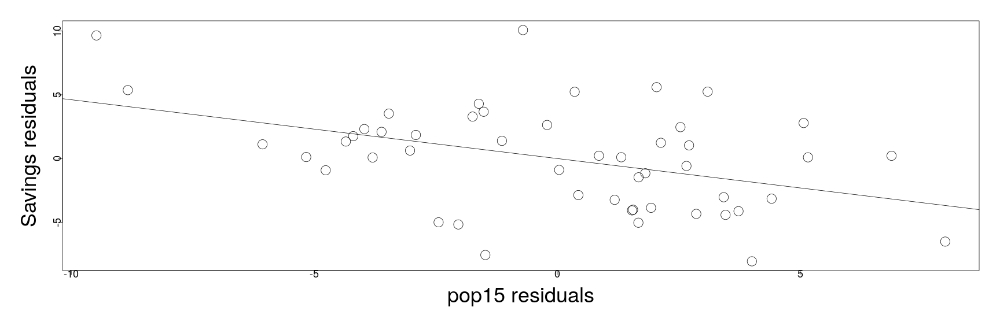
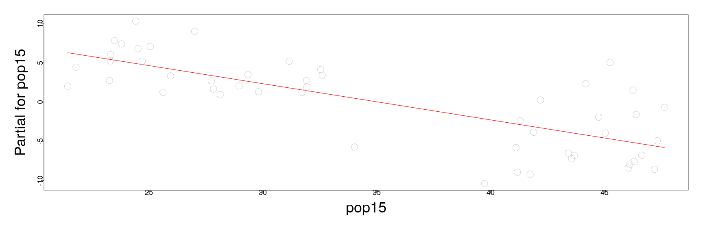

========================================================
author: 
date: 
autosize: true
incremental: true
width: 1920
height: 1080
  
========================================================

<h2>A summary (plot)</h2>

<div style="float:left; width:58%">

</div>

<div style="float:left; width:40%">
<ul>
  <li> Much of the diagnostic analysis that we have belabored can actually be performed in a single command.</li>  
  <li> Using the "plot" function with the linear model as an argument, we produce the figure to the left:</li>
  <ol>
  <li> <b>Top left:</b> we plot the residual versus fitted values to test for variance and/or nonlinear structure in the error. A polynomial fit is line shows the trend.</li>
  <li><b>Top right:</b> we plot the Q-Q plot of the <em>standardized residuals</em> versus the standard normal distribution to evaluate for Gaussianity.</li>
  <li><b>Bottom left</b> we plot $\sqrt{\vert\hat{\boldsymbol{\epsilon}}\vert}$ versus the fitted values. A polynomial fit line shows the trend.</li>
  <li><b>Bottom right:</b> we plot the standardized residuals versus the value of the associated leverage; Cook's distance is a function of both, so contour plots are included in dotted lines.  Points that lie beyond the contours can be considered highly influential.
  </ol>
</ul>
</div>

========================================================


<h1>Diagnostics concluded:</h1>

<h2>Checking model structure</h2>

* In order to check the structural assumption on the model, i.e.,

  $$\begin{align}
  \mathbf{Y} = \mathbf{X} \boldsymbol{\beta} + \boldsymbol{\epsilon},
  \end{align}$$

  it is often a good first diagnostic to examine the 2D plot of the variable $y$ versus $x_i$ for each variable $x_i$.
  
* However, when there are multiple explanatory varaibles of interest, this kind of plot is limited;

  * specifically, it lacks any explanation of how the response $y$ and the particular explanatory variable $x_i$ will vary with respect to other variables simultaneously.
  
* We may instead consider <em>partial regression</em> plots .

* Particularly, consider the following definitions:

  <ol>
    <li>Let $\hat{\boldsymbol{\delta}}$ be the vector of residuals defined for the predicted values of $\mathbf{Y}$ when $x_i$ is not included as an explanatory variable.</li>
    <li>Let $\hat{\boldsymbol{\gamma}}$ be the vector of residuals defined for the predicted values of $x_i$ regressed in terms of the <em>other explanatory variables</em></li>
  </ol>

* Then together, this allows us to approximate the effect of $x_i$ on $y$ with the effect of the other variables taken out.

* We'll demonstrate this with the savings data...

========================================================


```r
library("faraway")
lmod <- lm(sr ~ pop15 + pop75 + dpi + ddpi,savings)
d <- residuals(lm(sr ~ pop75 + dpi + ddpi,savings))
m <- residuals(lm(pop15 ~ pop75 + dpi + ddpi,savings))
par(mai=c(1.5,1.5,.5,.5), mgp=c(3,0,0))
plot(m,d,xlab="pop15 residuals",ylab="Savings residuals", cex=3, cex.lab=3, cex.axis=1.5)
abline(0,coef(lmod)['pop15'])
```



* The slope of the line is given precisely by the coefficient for "pop15" in the full model, describing the trend of the partial regression.

* This type of plot is typically used for outlier and influential detection; here nothing is particularly troubling.

========================================================

* Additionally, we can consider a <em>partial residual</em> plot, not to be confused with the last.

* Partial residual plots are a similar, alternative type of plot that are more frequently used for nonlinearity detection.

* We can consider, in a different derivation, the effect of the response with the other variables removed.

* The residual of $y$ with respect to all variables, except for $x_i$, is given

  $$\begin{align}
  y - \sum_{j\neq i}x_j \hat{\boldsymbol{\beta}}_j &= \hat{y} + \hat{\boldsymbol{\epsilon}} - \sum_{j\neq i}x_j \hat{\boldsymbol{\beta}}_j \\
  &=x_i \hat{\boldsymbol{\beta}}_i + \hat{\boldsymbol{\epsilon}}
  \end{align}$$
  
* Particularly, we can then plot, $x_i \hat{\boldsymbol{\beta}}_i + \hat{\boldsymbol{\epsilon}}$ versus $x_i$, where the slope and the interpretation with the last plot is the same.

* This is easy to do automatically in R, using the function "termplot"...

========================================================

* This is illustrated here, where the function centers the data at the mean, i.e., $\hat{\boldsymbol{\epsilon}} + \hat{\boldsymbol{\beta}}_i \left(x_i - \overline{x}_i\right)$


```r
par(mai=c(1.5,1.5,.5,.5), mgp=c(3,0,0))
 termplot(lmod, partial.resid=TRUE, terms=1,  cex=3, cex.lab=3, cex.axis=1.5)
```



* Distinct from the previous plot, we see the previously observed two sub-groups emerging with high and low percent population below 15.

* Though both plots are meant to describe the dependence of the response on the variable "pop15" with all other factors removed, the second plot here better isolates the structure.

========================================================

* Particulalry, fitting the response in terms of the two groups separately, we see that for the group with high youth populations, there is almost no fit, but a reasonable fit for the small youth population.


```r
mod1 <- lm(sr ~ pop15+pop75+dpi+ddpi,savings,subset=(pop15 > 35))
mod2 <- lm(sr ~ pop15+pop75+dpi+ddpi,savings,subset=(pop15 < 35))
sumary(mod1)
```

```
               Estimate  Std. Error t value Pr(>|t|)
(Intercept) -2.43396890 21.15502778 -0.1151   0.9097
pop15        0.27385369  0.43919097  0.6235   0.5408
pop75       -3.54847686  3.03328065 -1.1698   0.2573
dpi          0.00042076  0.00500007  0.0842   0.9339
ddpi         0.39547422  0.29010124  1.3632   0.1896

n = 23, p = 5, Residual SE = 4.45441, R-Squared = 0.16
```

```r
sumary(mod2)
```

```
               Estimate  Std. Error t value Pr(>|t|)
(Intercept) 23.96179499  8.08375019  2.9642 0.007164
pop15       -0.38589762  0.19536859 -1.9752 0.060921
pop75       -1.32774213  0.92606273 -1.4337 0.165705
dpi         -0.00045881  0.00072372 -0.6340 0.532640
ddpi         0.88439443  0.29534055  2.9945 0.006679

n = 27, p = 5, Residual SE = 2.77167, R-Squared = 0.51
```

* From the (earlier) extensive diagonostic analysis on the savings data, we find that the difference in the fit is unlikely due to outliers in the data, but due to a structural component.

========================================================

<h2> A summary of diagnostics</h2>

* The issues to check for in diagnostics are diverse, but also of differing importance for the analysis.

* Specifically, we will order these in terms of importance of consideration:

<ol>
  <li>Issues with the systematic part of the model.  If the (linear) signal between the explanatory variables and response isn't well posed, this analysis will be fundamentally misleading and our inferences and explanatory power will be biased.</li>
  <li> Correlation/ dependence of the error $\boldsymbol{\epsilon}$.  In this case, there won't be as much information to extract from the data as appears from the size of the data.  The information can be redundant, and the inference flawed.</li>
  <li>Non-constant variance of the errors.  This is easier to test, and <b>doesn't bias the estimate of the parameters</b>, but dillutes our uncertainty quantification and our ability to make inference and explanation with the model.</li>
  <li>Gaussianity/ Normality of the error.  This isn't strictly necessary (and is not an assumption of the Gauss-Markov theorem), but our hypothesis tests and condifence intervals are built around this assumption.</li>
</ol>

* Remediation of the above can take many different forms.  

  * For the first part, we should evaluate the context of the model itself and the feasibility of the relationsip.  Also, we should evaluate if the response and the explanatory variables are in the correct (possibly relative) scales of interest to form the relationship.
  
  * Again, for correlation, there aren't good general tests, and we have to bear the problem structure in mind for spatial/ temporal/ batch correlation of observations.
  
  * Gaussianity, we don't have to worry about too much provided we have sufficiently many observations (Central Limit Theorem) or e.g., short tailed distributions.  For long tailed distributions, we can use robust regression methods.


