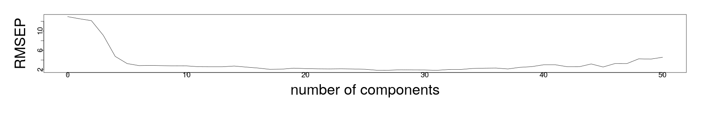
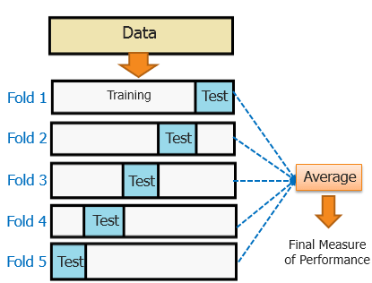

========================================================
author: 
date: 
autosize: true
incremental: true
width: 1920
height: 1080
  
========================================================

<h2>Validation</h2>

* Suppose we are in a scenario in which we have fit a model, and we recieve new observations of the same response and explanatory variable.

* It is reasonable to ask, "if the new observations are statistically indistinguishable from the training data, how well does our model perform in predicting the new observations (on average)?"

* Particularly, this is commonly measured in terms of the root mean square error (RMSE).

* Lets suppose that we have a model already fit that will take a new vector of explanatory variables $\mathbf{x}_i$, and produce a predicted value $\hat{\mathbf{y}}_i$.

* Suppose, there are $n$ <b>new observations</b> that we wish to benchmark the model against, then the RMSE is computed as,

  $$\begin{align}
  RMSE\left(\{\mathbf{y}_i\}_{i=1}^n \right) = \sqrt{ \frac{\sum_{i=1}^n \left(\hat{\mathbf{y}}_i - \mathbf{y}_i\right)^2}{n}}
  \end{align}$$

  * this measures how much error there is in our predictions on average over the new samples.
  
* Typically, $R^2$ and the standard error (and other measures like $R^2_a$) are overly optimistic in how well we will produce future observations.

* The RMSE of the model, when measured over independent samples drawn from the same population, will give a better sense of the "true" predictive power of the model.

========================================================

<h2>Validation continued...</h2>

* We often don't have the option of reproducing a statistically indistinguishable sample from the same population to test the model after the fact. 

* Therefore, the simplest option is to randomly split the data into two equal parts for: (i) model fitting and (ii) model validation.

  *  In this case, we can get a more sensible measure of the predictive power of the model, by computing the RMSE on new observations.
  
* The main issue of the above is that we often don't have enough data for both training and validation.

  * Strictly speaking, the validation dataset should remain independent of the model fitting so that we don't try to optimize (over-fit) our model on this data set.
  
  * Likewise, the validation data set would have to be large enough such that it is representative of the entire population to make the benchmark accurate.

* Typically, this ideal validation as above isn't possible due to limits on our data, and we instead use "cross-validation" to benchmark the predictive performance.

* We will return to this issue later...

========================================================

<h2> A complete example of PCR</h2>


* A near-infrared spectrometer working in the wavelength range of 850 to 1050 nm was used to collect data on samples of finely chopped meat. 

* 215 samples were measured, where for each sample, the fat content was measured along with a 100-channel spectrum of absorbances. 

* Determining the fat content via analytical chemistry is time consuming, and we would like to build a model to predict the fat content of new samples using the 100 absorbances which can
be measured more easily. 

* We load this from the "meatspec" dataset of Faraway:


```r
library("faraway")
trainmeat <- meatspec[1:172,]
testmeat <- meatspec[173:215,]
modlm <- lm(fat ~ ., trainmeat)
```

* Here, we fit the model over a pre-specified set of training data, and separate out a set of validation data.

========================================================

* In the model summary, we can see that the $R^2$ and adjusted $R^2_a$ are extremely good:


```r
summary(modlm)$r.squared
```

```
[1] 0.9970196
```

```r
summary(modlm)$adj.r.squared
```

```
[1] 0.9928219
```

* The question then is if this measure of fit to the data will actually translate into a good predictive model.


```r
rmse <- function(x,y) sqrt(mean((x-y)^2))
```

* We define the RMSE function as above, and compute the difference of the fitted values for the training data


```r
rmse(fitted(modlm), trainmeat$fat)
```

```
[1] 0.6903167
```

* which is also extremely good, but compared to the training data...


```r
rmse(predict(modlm,testmeat), testmeat$fat)
```

```
[1] 3.814
```


========================================================


*  We take first the PCA and the summary and note that effectively $99.9\%$ of the variance lies in the first three principal components (out of 100):


```r
meatpca <- prcomp(trainmeat[,-101], scale=TRUE)
summary(meatpca)
```

```
Importance of components:
                         PC1     PC2     PC3    PC4     PC5     PC6
Standard deviation     9.925 1.04361 0.53579 0.3313 0.07898 0.04974
Proportion of Variance 0.985 0.01089 0.00287 0.0011 0.00006 0.00002
Cumulative Proportion  0.985 0.99593 0.99880 0.9999 0.99996 0.99999
                           PC7     PC8      PC9     PC10     PC11     PC12
Standard deviation     0.02700 0.02059 0.008604 0.006894 0.004637 0.003479
Proportion of Variance 0.00001 0.00000 0.000000 0.000000 0.000000 0.000000
Cumulative Proportion  0.99999 1.00000 1.000000 1.000000 1.000000 1.000000
                           PC13     PC14     PC15      PC16     PC17
Standard deviation     0.001905 0.001408 0.001022 0.0008685 0.000743
Proportion of Variance 0.000000 0.000000 0.000000 0.0000000 0.000000
Cumulative Proportion  1.000000 1.000000 1.000000 1.0000000 1.000000
                            PC18      PC19      PC20      PC21      PC22
Standard deviation     0.0006546 0.0005819 0.0004001 0.0003699 0.0003562
Proportion of Variance 0.0000000 0.0000000 0.0000000 0.0000000 0.0000000
Cumulative Proportion  1.0000000 1.0000000 1.0000000 1.0000000 1.0000000
                            PC23      PC24      PC25      PC26      PC27
Standard deviation     0.0003084 0.0002817 0.0002132 0.0002031 0.0001936
Proportion of Variance 0.0000000 0.0000000 0.0000000 0.0000000 0.0000000
Cumulative Proportion  1.0000000 1.0000000 1.0000000 1.0000000 1.0000000
                            PC28      PC29     PC30      PC31      PC32
Standard deviation     0.0001832 0.0001763 0.000158 0.0001451 0.0001424
Proportion of Variance 0.0000000 0.0000000 0.000000 0.0000000 0.0000000
Cumulative Proportion  1.0000000 1.0000000 1.000000 1.0000000 1.0000000
                            PC33      PC34      PC35      PC36      PC37
Standard deviation     0.0001359 0.0001319 0.0001192 0.0001074 9.696e-05
Proportion of Variance 0.0000000 0.0000000 0.0000000 0.0000000 0.000e+00
Cumulative Proportion  1.0000000 1.0000000 1.0000000 1.0000000 1.000e+00
                            PC38     PC39      PC40      PC41      PC42
Standard deviation     9.169e-05 9.12e-05 8.215e-05 8.155e-05 7.376e-05
Proportion of Variance 0.000e+00 0.00e+00 0.000e+00 0.000e+00 0.000e+00
Cumulative Proportion  1.000e+00 1.00e+00 1.000e+00 1.000e+00 1.000e+00
                            PC43      PC44      PC45      PC46      PC47
Standard deviation     6.754e-05 6.464e-05 6.121e-05 5.583e-05 5.451e-05
Proportion of Variance 0.000e+00 0.000e+00 0.000e+00 0.000e+00 0.000e+00
Cumulative Proportion  1.000e+00 1.000e+00 1.000e+00 1.000e+00 1.000e+00
                            PC48      PC49      PC50      PC51      PC52
Standard deviation     5.336e-05 4.642e-05 4.432e-05 4.204e-05 4.146e-05
Proportion of Variance 0.000e+00 0.000e+00 0.000e+00 0.000e+00 0.000e+00
Cumulative Proportion  1.000e+00 1.000e+00 1.000e+00 1.000e+00 1.000e+00
                            PC53      PC54      PC55      PC56      PC57
Standard deviation     3.865e-05 3.707e-05 3.606e-05 3.594e-05 3.475e-05
Proportion of Variance 0.000e+00 0.000e+00 0.000e+00 0.000e+00 0.000e+00
Cumulative Proportion  1.000e+00 1.000e+00 1.000e+00 1.000e+00 1.000e+00
                            PC58      PC59     PC60      PC61      PC62
Standard deviation     3.206e-05 3.192e-05 3.05e-05 2.853e-05 2.652e-05
Proportion of Variance 0.000e+00 0.000e+00 0.00e+00 0.000e+00 0.000e+00
Cumulative Proportion  1.000e+00 1.000e+00 1.00e+00 1.000e+00 1.000e+00
                           PC63      PC64      PC65      PC66      PC67
Standard deviation     2.64e-05 2.535e-05 2.409e-05 2.345e-05 2.234e-05
Proportion of Variance 0.00e+00 0.000e+00 0.000e+00 0.000e+00 0.000e+00
Cumulative Proportion  1.00e+00 1.000e+00 1.000e+00 1.000e+00 1.000e+00
                            PC68      PC69      PC70      PC71      PC72
Standard deviation     2.185e-05 1.982e-05 1.958e-05 1.865e-05 1.834e-05
Proportion of Variance 0.000e+00 0.000e+00 0.000e+00 0.000e+00 0.000e+00
Cumulative Proportion  1.000e+00 1.000e+00 1.000e+00 1.000e+00 1.000e+00
                            PC73      PC74     PC75      PC76      PC77
Standard deviation     1.794e-05 1.722e-05 1.65e-05 1.625e-05 1.573e-05
Proportion of Variance 0.000e+00 0.000e+00 0.00e+00 0.000e+00 0.000e+00
Cumulative Proportion  1.000e+00 1.000e+00 1.00e+00 1.000e+00 1.000e+00
                            PC78      PC79      PC80      PC81      PC82
Standard deviation     1.479e-05 1.401e-05 1.368e-05 1.313e-05 1.185e-05
Proportion of Variance 0.000e+00 0.000e+00 0.000e+00 0.000e+00 0.000e+00
Cumulative Proportion  1.000e+00 1.000e+00 1.000e+00 1.000e+00 1.000e+00
                            PC83      PC84      PC85      PC86      PC87
Standard deviation     1.142e-05 1.132e-05 1.065e-05 9.934e-06 8.788e-06
Proportion of Variance 0.000e+00 0.000e+00 0.000e+00 0.000e+00 0.000e+00
Cumulative Proportion  1.000e+00 1.000e+00 1.000e+00 1.000e+00 1.000e+00
                            PC88      PC89      PC90      PC91     PC92
Standard deviation     8.476e-06 8.096e-06 7.634e-06 7.302e-06 6.99e-06
Proportion of Variance 0.000e+00 0.000e+00 0.000e+00 0.000e+00 0.00e+00
Cumulative Proportion  1.000e+00 1.000e+00 1.000e+00 1.000e+00 1.00e+00
                            PC93      PC94      PC95      PC96      PC97
Standard deviation     6.534e-06 5.375e-06 5.154e-06 4.841e-06 4.517e-06
Proportion of Variance 0.000e+00 0.000e+00 0.000e+00 0.000e+00 0.000e+00
Cumulative Proportion  1.000e+00 1.000e+00 1.000e+00 1.000e+00 1.000e+00
                            PC98      PC99     PC100
Standard deviation     3.873e-06 3.633e-06 3.231e-06
Proportion of Variance 0.000e+00 0.000e+00 0.000e+00
Cumulative Proportion  1.000e+00 1.000e+00 1.000e+00
```

========================================================

* We will try PCR based upon some number of principal components, for now, just as an example.

  * Here, we will us the "pls" library which has the "pcr" function, automating the principal component regression.

*  Here, the "ncomp" gives an upper limit to the number of principal components used in the model:


```r
library("pls")
pcrmod <- pcr(fat ~ ., data=trainmeat, ncomp=50, scale=TRUE)
```

* In the predict function below, we set the number of principal components actually used in prediciton with the "ncomp" argument once again:


```r
rmse(predict(pcrmod, ncomp=3), trainmeat$fat)
```

```
[1] 7.447491
```

```r
rmse(predict(pcrmod, testmeat, ncomp=3), testmeat$fat)
```

```
[1] 9.103643
```

* Even though the first three principal components contained the vast majority of the variance, the performance isn't all that great (but good relative to a 3 predictor model).

  * This illustrates exactly how the PCA doesn't know the response variable...

========================================================

* If we consider including a higher number of principal components:


```r
rmse(predict(pcrmod, ncomp=10), trainmeat$fat)
```

```
[1] 2.744102
```

```r
rmse(predict(pcrmod, testmeat, ncomp=10), testmeat$fat)
```

```
[1] 2.782244
```
  
* we see a vast reduction of both the prediction error on the training and validation data.
 
* However, if we include, e.g., 50 principal components we see once again the issue of over-fitting the data, and the predictive performance on new data degrading. 
 

```r
rmse(predict(pcrmod, ncomp=50), trainmeat$fat)
```

```
[1] 1.275642
```

```r
rmse(predict(pcrmod, testmeat, ncomp=50), testmeat$fat)
```

```
[1] 4.57352
```

* This shows that generally when using PCR, we must make a systematic selection of the number of components in the model (not purely based on the amount of variance in each component).

========================================================

* Particulalry, if we plot the predictive RMSE on the validation data versus the number of principal components used in the regression, we find a slighly convex shape with a global minimum.
  
  * Here, the "RMSEP" function takes the model as an argument and computes the RMSE versus the increasing number of components: 


```r
par(mai=c(1.5,1.5,.5,.5), mgp=c(3,0,0))
pcrmse <- RMSEP(pcrmod, newdata=testmeat)
plot(pcrmse,main="", col=1,  cex=3, cex.lab=3, cex.axis=1.5)
```



```r
which.min(pcrmse$val)
```

```
[1] 32
```

```r
pcrmse$val[32]
```

```
[1] 1.863361
```

========================================================

<h2> Cross validation</h2>

* Using the PCR as before showed a dramatic improvement in the predictive power with the validation data versus the fit to the training data. 
  
* However, if we optimize the model based on the prediction power for the validation set, we will over-fit our model to this particular validation set.

* We want to find an independent validation that accounts for the variation over the full population, and that keeps our model selection independent of a particular sampling.

* The compromise is to perform an estimate of performance and optimize the model based on averages over multiple "cuts" or "folds" of the data.

========================================================

<h2> Cross validation continued...</h2>

<div style="float:left; width:50%">

Courtesy of <a href="https://tomaszkacmajor.pl/index.php/2016/05/01/svm-model-selection2" target="blank">Tomasz Kacmajor</a>
</div>
<div style="float:left; width:50%">
<ul>
  <li> Suppose we split the data into $k$ different groups -- in the picture to the left, the $k=5$ corresponds to the blue blocks.</li>
  <li> Suppose for each $i=1,\cdots,k$, we train the model on the white data in "fold" $i$, that is, we exclude the blue block.</li>
  <li> Then, for each $i=1,\cdots, k$ we validate the $i$-th fold on the $i$-th blue block.</li>
  <li> Averaging the RMSE over all the $k$ folds, we get an estimate for the overall performance of the predictive power of the model on new data.</li> 
  <li>Using this criterion, we can thus select a "optimal" number of principal components, such that 
  <ol>
    <li> takes into account the variance of the entire (known) population; and </li>
    <li> doesn't sacrifice a large portion of the data that we would like to train on.</li>
  </ol>
</ul>
</div>

<div style="float:left; width:100%">
<ul><br>
  <li> The benefit is that we obtain an estimate of "best performance" that is based upon training and testing on all parts of the data.</li>
  <li> The issue is mostly in terms of choosing the "right" size of $k$ for a good estimate.</li>
</ul>
</div>


========================================================

* Here we set the method at cross validation in the pcr function, but only use the training data.

  * This is to compare how well the estimated prediction RMSE is versus the true value on the validation set earlier used.
  
* The folds of the data are selected randomly, so we first seed the random number generator:


```r
set.seed(123)
pcrmod <- pcr(fat ~ ., data=trainmeat, validation="CV", ncomp=50, scale=TRUE)
pcrCV <- RMSEP(pcrmod, estimate="CV")
```

* Then, we plot the cross-validated RMSE versus the number of principal components:


```r
par(mai=c(1.5,1.5,.5,.5), mgp=c(3,0,0))
plot(pcrCV,main="", col=1,  cex=3, cex.lab=3, cex.axis=1.5)
```


========================================================

* Checking the lowest cross-validated RMSE, we find that it is with 18 components:


```r
which.min(pcrCV$val)
```

```
[1] 18
```

```r
min(pcrCV$val)
```

```
[1] 2.576263
```

* The above is the estimated predictive power on a new data set.  We compare this with the actual one on the separate data (not used in cross validation):


```r
ypred <- predict(pcrmod, testmeat, ncomp=18)
rmse(ypred, testmeat$fat)
```

```
[1] 2.111915
```

* The estimate is good, and the model's performance is actually close to the level of prediction performance that we acheived when we optimized the number of components over the validation data set.

* By optimizing the number of principal components independently of an particular sample of the population, we have done better to prepare the model for the variation in the total population.

* Over different samples, we would expect that <b>on average</b> the prediction RMSE would be like our estimated cross validation RMSE.

========================================================

<h2> Summary of main ideas</h2>

* Principal components give a change of variables for the data that "compresses" the data into directions of maximal variance (in an orthogonal frame).

* This can represent most of the information of explanatory variables in a much smaller package --- this is especially when the explanatory variables are highly correlated.

* However, PCA knows nothing about the response variable itself.

* We decided to optimize the number of principal components based on the task of prediction.

* In order to do so, we also needed to define "what makes a good prediction?"

========================================================


* Most of our measures of fit to the response data don't actually accurately measure the prediction performance.

* We demonstrated the issues of over-fitting the training data, and failing to generalize to the entire population.

* To avoid this, we used cross validation to optimize the model selection over a measure that takes into account the variability of the entire population.

* We (as a proof of concept) showed how our estimate compared with the actual RMSE over a separate data set, independent and statistically indistinguishable from our training data.

* In this case, we made large improvements in predictive power versuse the information criterion approach and other methods.
    
* This still has disavantages in terms of the possible un-interpretability of the model, and it still used all measurements.

========================================================


<h1> Insurance redlining -- a complete example</h1>

* In the following lectures, we will go through a relatively complete example of the process of data analysis, regression, diagnostics, and remediation.

* Particularly, we will discuss a difficult to analyze question of systematic bias in insurance practices.

* Insurance, by nature of their business, need to price the cost of covering the risk of damages, based on the probability of these damages.

  * There are many legitimate reasons we can imagine why an insurance company would raise the prices on a driver who frequently violates road rules and is an overly agressive driver;
  
  * this individual is more likely to cause damages to themsevles or others, and therefore, the price to cover these damages will increase (or insurance will be refused altogether).
  
* However, we are also in a society that has historically enforced segregation, unequal rights and unequal access to services.

  * While these were once considered legitimate legal practice, discriminatory business practices are now generally considered immoral and illegal.
  
  * Moreover, while these direct discriminatory practices have largely ended, they have led to historical and lasting inequality in the communities that have been affected by them.
  
* We will investigate a complicated question, "were insurance companies were applying discriminatory business practices on majority non-white neighborhoods in Chicago, or were their practices justifiable based on standard business practices, e.g., limiting access or raising prices based on justifiable crime statistics, etc?"

========================================================

* The term "insurance redlining" refers litterally drawing a red line in a map, that excludes certain neighborhoods from services.

* In the late 1970s, the US Commission on Civil Rights examined charges by several Chicago community organizations that insurance companies were redlining their
neighborhoods.

* Because comprehensive information about individuals being refused
homeowners insurance was not available, the number of FAIR plan policies written
and renewed in Chicago by zip code for the months of December 1977 through May
1978 was recorded. 

* The FAIR plan was offered by the city of Chicago as a default policy to homeowners who had been rejected by the voluntary market. 

* Information on other variables that might affect insurance writing such as fire and theft rates was also collected at the zip code level.

========================================================

<div style="float:left; width:50%">

Courtesy of Peter Fitzgerald <a href="https://creativecommons.org/licenses/by-sa/3.0">CC BY-SA 3.0</a>
</div>
<div style="float:left; width:50%">
<ul>
  <li>The data that we have available for our analysis includes the variables:</li>
  <ol>
    <li><b>race</b> -- ethnic composition in percentage of minority;</li>
    <li><b>fire</b> -- fires per 100 housing units;</li>
    <li><b>theft</b> -- thefts per 1000 population;</li>
    <li><b>age</b> --  percentage of housing units built before 1939;</li>
    <li><b>involact</b> -- new FAIR plan policies and renewals per 100 housing units;</li>
    <li><b>income</b> -- median family income in thousands of dollars;</li>
    <li><b>side</b> -- north or south side of Chicago.</li>
  </ol>
<li> For reference, the South Side of Chicago has long had a reputation and cultural identity built around communities of working class African, Hispanic, Chinese, Irish, and Polish Americans, amongst others.
<li> This is due, in part, to historic segregation measures which by the late 1970s were considered illegal.</li>
</ul>
</div>

========================================================

<h2>The ecological fallacy</h2>

* We note here that we do not actually know the ethnicity of the individuals who are denied insurance in this data set.

* Rather, we only know the ethnic makeup of the zip code where an individual was denied.

* This is an important difficulty that needs to be considered carefully before starting our analysis.

* When data are collected at the group level, we may observe a correlation between two variables.

* The <b>ecological fallacy</b> is concluding that the same correlation holds at the individual level.

* For example the ecological fallacy was discussed in a court challenge to the Washington gubernatorial election of 2004; 

  * In this election, a number of illegal voters were identified, after the election; their votes were unknown, because the vote was by secret ballot. 
  
  * The challengers argued that illegal votes cast in the election would have followed the voting patterns of the precincts in which they had been cast, and thus adjustments should be made accordingly.
  * An expert witness said that this approach was like trying to figure out Ichiro Suzuki's batting average by looking at the batting average of the entire Seattle Mariners team, since the illegal votes were cast by an unrepresentative sample of each precinct's voters, and might be as different from the average voter in the precinct as Ichiro was from the rest of his team.
  
  * The judge determined that the challengers' argument was an ecological fallacy and rejected it

  * See (<a href="https://faculty.washington.edu/cadolph/papers/AdolphWAreport.pdf" target="blank">Christopher Adolph (May 12, 2005). "Report on the 2004 Washington Gubernatorial Election". Expert witness report to the Chelan County Superior Court in Borders et al v. King County et al.</a>)

