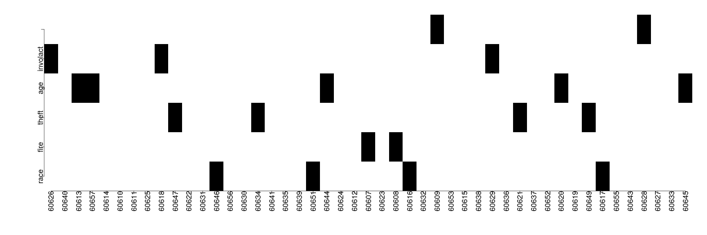

========================================================
author: 
date: 
autosize: true
incremental: true
width: 1920
height: 1080
  
========================================================

<h1> Missing data </h1>

* Missing data causes both technical data processing and statistical challenges in regression analysis.

* By creating a framework for different kinds of missing data, we have some mathematical tools for understanding how it will affect our analysis.

* Certain kinds of missing data are harder than others to treat mathematically -- at times, we won't have good tools for filling missing data values, or treating the implicit bias therein.

* However, certain kinds of missing data can be modeled statistically, along with the uncertainty when treating these cases.

========================================================

<h2>Types of missing data</h2>

* Here is a summary of different missing data regimes we might find ourselves:

  <ol>
    <li> <b>Missing cases</b> -- this is typically the situation we are in during any statistical study.  Particularly, we must infer how the signal will generalize to the population at large, using observations of only a small sub-sample.  
    <ul>
      <li> In special circumstances, if the cases that we don't observe are not observed due to the signal we are studying, our sample will be biased.</li>
    </ul>
    <li> <b>Incomplete values</b> -- often time when examining medical outcomes, we will not know the final outcomes of patients before the medical study ends.  In this situation, data on participants may still hold useful information but we have to deal with the fundamental incompleteness. Methods to handle this include survival analysis</li>
    <li> <b>Missing values</b> -- it is quite often that samples will have some of the observations of the response or explanatory variables missing or corrupted. Depending on the type of "missingness" we will have different tools to handle this.</li>
  </ol>
  
========================================================

<h2> Types of missing values</h2>

* The following types of missing values are distinguished as follows:

 <ol>
  <li> <b>Missing Completely At Random (MCAR)</b> -- the probability of any value being missing is the same for every sample.  In this case, there is <em>no bias induced</em> by how the values are missing, though we lose information on the signal.</li>
  <li> <b>Missing At Random (MAR) </b> -- here we suppose the probability of a value being missing depends on a systematic mechanism with the known explanatory variables.  E.g., in social surveys certain groups may be less likely to respond. </li>
    <ul>
      <li>If we know what sub-group the sample belongs to, we can typically delete the missing observation provided we adjust the model for the group membership as a factor.</li>
    </li>
  </ul>
  <li> <b>Missing Not At Random (MNAR)</b> -- the probability that a value is missing from a sample depends on an unknown, latent variable that we don't observe, or based on the response we wish to observe itself.</li>
  <ul>
    <li> E.g., if an individual has something to hide that is embarrassing or illegal, they may quite often avoid disclosing information that would suggest so.  This is difficult, and often mathematically intractible to handle.</li>
  </ul>
 </ol> 

* Amongst the above, when the data is MAR, we can adjust based on observed variables and therefore handle missingness and bias mathematically -- we will focus on this situation.

========================================================

<h2> A concrete example of missing values</h2>

* If we wish to understand methods of treating missing data, we can take a data set and delete values to compare how conclusions might be affected by our treatment.

* Prototypically, we will study the Chicago Insurance data once again, but with values missing at random.


```r
library("faraway")
summary(chmiss)
```

```
      race            fire           theft             age       
 Min.   : 1.00   Min.   : 2.00   Min.   :  3.00   Min.   : 2.00  
 1st Qu.: 3.75   1st Qu.: 5.60   1st Qu.: 22.00   1st Qu.:48.30  
 Median :24.50   Median : 9.50   Median : 29.00   Median :64.40  
 Mean   :35.61   Mean   :11.42   Mean   : 32.65   Mean   :59.97  
 3rd Qu.:57.65   3rd Qu.:15.10   3rd Qu.: 38.00   3rd Qu.:78.25  
 Max.   :99.70   Max.   :36.20   Max.   :147.00   Max.   :90.10  
 NA's   :4       NA's   :2       NA's   :4        NA's   :5      
    involact          income      
 Min.   :0.0000   Min.   : 5.583  
 1st Qu.:0.0000   1st Qu.: 8.564  
 Median :0.5000   Median :10.694  
 Mean   :0.6477   Mean   :10.736  
 3rd Qu.:0.9250   3rd Qu.:12.102  
 Max.   :2.2000   Max.   :21.480  
 NA's   :3        NA's   :2       
```

========================================================

* Before we saw how many NA values were in the dataset based on the explanatory varible, but we will also want to know which samples have missing values (and how many).  


```r
rowSums(is.na(chmiss))
```

```
60626 60640 60613 60657 60614 60610 60611 60625 60618 60647 60622 60631 
    1     0     1     1     0     0     0     0     1     1     0     0 
60646 60656 60630 60634 60641 60635 60639 60651 60644 60624 60612 60607 
    1     0     0     1     0     0     0     1     1     0     0     1 
60623 60608 60616 60632 60609 60653 60615 60638 60629 60636 60621 60637 
    0     1     1     0     1     0     0     0     1     0     1     0 
60652 60620 60619 60649 60617 60655 60643 60628 60627 60633 60645 
    0     1     0     1     1     0     0     1     0     0     1 
```

* Here there is at most one value missing from each row; likewise, the missing data is basically evenly spaced in the data.

  * If there was a large number of missing values in a few cases, we could likely drop these samples without loss of information.
  
  * However, in this example, dropping the samples with NA's would delete 20 out of 47 of the cases.
  
========================================================

* We can also view how clumped or dispersed missing values are graphically as a diagnostic:


```r
par(mai=c(1.5,1.5,.5,.5), mgp=c(3,0,0))
image(is.na(chmiss),axes=FALSE,col=gray(1:0))
axis(2, at=0:5/5, labels=colnames(chmiss), cex=3, cex.lab=3, cex.axis=1.5)
axis(1, at=0:46/46, labels=row.names(chmiss),las=2, cex=3, cex.lab=3, cex.axis=1.5)
```



========================================================

* Suppose we favor a deletion approach to all samples with missing values.  We will compare the full model with all values versus the situation in which we delete missing values:


```r
modfull <- lm(involact ~ .  - side, chredlin)
sumary(modfull)
```

```
              Estimate Std. Error t value  Pr(>|t|)
(Intercept) -0.6089790  0.4952601 -1.2296 0.2258512
race         0.0091325  0.0023158  3.9435 0.0003067
fire         0.0388166  0.0084355  4.6015     4e-05
theft       -0.0102976  0.0028529 -3.6096 0.0008269
age          0.0082707  0.0027815  2.9734 0.0049143
income       0.0245001  0.0316965  0.7730 0.4439816

n = 47, p = 6, Residual SE = 0.33513, R-Squared = 0.75
```

========================================================

* On the other hand, when we fit with the samples with missing values deleted (the default for "lm"):


```r
modmiss <- lm(involact ~ ., chmiss)
sumary(modmiss)
```

```
              Estimate Std. Error t value  Pr(>|t|)
(Intercept) -1.1164827  0.6057615 -1.8431 0.0794750
race         0.0104867  0.0031283  3.3522 0.0030180
fire         0.0438757  0.0103190  4.2519 0.0003557
theft       -0.0172198  0.0059005 -2.9184 0.0082154
age          0.0093766  0.0034940  2.6837 0.0139041
income       0.0687006  0.0421558  1.6297 0.1180775

n = 27, p = 6, Residual SE = 0.33822, R-Squared = 0.79
```

* The standard error increases because the estimates are less precise, due to the loss of information.


========================================================

* We may consider thus to "fill-in" data into the missing values for various samples -- this is known as data imputation.

* One approach is to fill in values by something "representative" of the known population, 

  * e.g., fill in by each variable mean.


```r
(cmeans <- colMeans(chmiss,na.rm=TRUE))
```

```
      race       fire      theft        age   involact     income 
35.6093023 11.4244444 32.6511628 59.9690476  0.6477273 10.7358667 
```

* However, we don't want to fill in values for the response, as this is what we are trying to model:


```r
mchm <- chmiss
for(i in c(1:4,6)) mchm[is.na(chmiss[,i]),i] <- cmeans[i]
imod <- lm(involact ~ ., mchm)
```

========================================================

* Then, we look at the model summary, based on the imputation of the means:


```r
sumary(imod)
```

```
              Estimate Std. Error t value Pr(>|t|)
(Intercept)  0.0708021  0.5094531  0.1390 0.890203
race         0.0071173  0.0027057  2.6305 0.012245
fire         0.0287418  0.0093855  3.0624 0.004021
theft       -0.0030590  0.0027457 -1.1141 0.272242
age          0.0060795  0.0032079  1.8952 0.065695
income      -0.0270917  0.0316782 -0.8552 0.397791

n = 44, p = 6, Residual SE = 0.38412, R-Squared = 0.68
```

* In this case, there isn't just loss of fit, but also qualitative differences in the parameters.

* Particularly, theft and age have lost significance in this model versus the iterations previously seen.

* Also, the parameters themselves are smaller in magnitude, describing less "effect" in the signal overall.

========================================================

* In this case, we see significant bias induced by the imputation (toward the mean values); 

  * this shows how we usually will only consider mean imputation when the number of missing values is small relative to the full population.
  
* In the case that there is a small number of missing values for a categorical variable, we can typically model the "missing-value" as a category of its own.

* We can consider a more sophisticated approach for handling missing values using regression.

* Particularly, if the variables are strongly (anti)-correlated with each other, there is information in the explanatory variables telling how they vary together (or oppostitely).

========================================================

* Recall, for percent variables, it is sometimes useful to make a change of scale to the real line when this is a response.

* The logit transformation is given as,

  $$\begin{align}
  y & \mapsto \log\left(\frac{y}{1 - y}\right)
  \end{align}$$

* The "logit" and "ilogit" (inverse) map are available in the Faraway package.

* We will model the percent ethnic minority in a zip code as regressed on the other variables with the missing cases removed:


```r
lmodr <- lm(logit(race/100) ~ fire+theft+age+income,chmiss)
ilogit(predict(lmodr,chmiss[is.na(chmiss$race),]))*100
```

```
     60646      60651      60616      60617 
 0.4190909 14.7320193 84.2653995 21.3121261 
```

```r
chredlin$race[is.na(chmiss$race)]
```

```
[1]  1.0 13.4 62.3 36.4
```

* Two of the predictions are reasonable, but two are significantly off.

* This can be performed for each of the explanatory variables, and wile preferable to mean imputation, still leads to bias.

  * In a way, we can start over-fitting to our known values and loose the true variance in the population.
  
========================================================

<h2> Multiple imputation</h2>

* If we understand that the loss of the variation of the population is the issue with the earlier approaches, we can try to enforce some variance in the imputation mathematically.

  * If we re-introduce variation on the missing value, but only once, this would just be a less-optimal choice for the single imputation as we performed previously.
  
  * Instead, we will treat this as a re-sampling problem, and re-input multiple cases of perturbed values for the missing term that takes into account the uncertainty of this value.

* We will create 25 different versions of the data "re-sampled" back with uncertainty for each missing value.

* The known values will be the same, but we will have "m" different versions of the missing values, drawn from a "Bayesian posterior" estimate...

  * The function output of Amelia will include the "m" different datasets:

========================================================

  

```r
library(Amelia)
set.seed(123)
chimp <- amelia(chmiss, m=25)
```

```
-- Imputation 1 --

  1  2  3  4  5  6  7  8  9 10 11 12 13 14 15 16 17 18 19 20
 21 22 23 24 25 26 27 28 29 30 31 32 33 34

-- Imputation 2 --

  1  2  3  4  5  6  7  8  9 10 11 12 13 14 15 16 17 18 19 20
 21 22 23 24 25 26 27 28 29 30 31 32 33 34 35 36 37 38 39 40
 41 42 43 44 45 46 47 48 49 50 51 52 53 54 55 56 57 58 59 60
 61 62 63 64 65 66 67 68 69 70 71 72 73 74

-- Imputation 3 --

  1  2  3  4  5  6  7  8  9 10 11 12 13 14 15 16 17

-- Imputation 4 --

  1  2  3  4  5  6  7  8  9 10 11 12 13 14 15 16 17 18 19 20
 21 22 23 24 25 26 27 28 29 30 31 32 33 34 35 36 37 38 39 40
 41 42 43 44 45 46 47 48 49 50 51 52 53 54 55 56 57 58 59

-- Imputation 5 --

  1  2  3  4  5  6  7  8  9

-- Imputation 6 --

  1  2  3  4  5  6  7  8  9 10 11 12 13

-- Imputation 7 --

  1  2  3  4  5  6  7  8  9 10 11 12 13 14 15 16 17 18 19 20
 21 22 23 24 25 26 27 28 29 30 31 32 33 34 35 36 37 38 39 40
 41 42 43

-- Imputation 8 --

  1  2  3  4  5  6  7  8  9 10 11 12 13 14 15 16 17 18 19 20
 21 22 23 24 25 26 27 28 29 30 31 32 33 34 35 36 37 38 39 40
 41 42 43 44 45 46 47 48 49 50 51 52 53 54 55 56 57 58 59 60
 61 62 63 64 65 66 67 68 69 70 71 72 73 74 75 76 77 78 79 80
 81 82 83

-- Imputation 9 --

  1  2  3  4  5  6  7  8  9

-- Imputation 10 --

  1  2  3  4  5  6  7  8  9 10 11 12 13 14 15 16 17

-- Imputation 11 --

  1  2  3  4  5  6  7  8  9 10 11 12 13 14 15 16 17 18 19 20
 21 22 23 24 25 26 27 28 29 30 31 32 33 34 35 36 37 38 39 40
 41 42 43 44 45 46 47 48 49 50 51

-- Imputation 12 --

  1  2  3  4  5  6  7  8  9 10 11 12 13 14 15 16 17 18 19 20
 21 22 23 24 25 26 27 28 29 30 31 32 33 34 35

-- Imputation 13 --

  1  2  3  4  5  6  7  8  9 10 11 12 13 14 15 16 17 18 19 20
 21 22 23 24 25 26 27 28 29 30 31 32 33 34 35 36 37 38 39 40
 41 42 43 44 45 46 47 48 49 50 51 52 53 54 55 56 57 58 59 60
 61 62 63 64 65 66 67 68 69 70 71 72 73 74 75 76 77 78 79 80
 81 82 83 84 85 86 87 88 89 90 91 92 93 94 95 96 97 98 99 100
 101 102 103 104 105 106 107 108 109 110 111 112 113 114 115 116 117 118 119 120
 121 122 123 124 125 126 127 128 129 130 131 132 133 134 135 136 137 138 139 140
 141 142 143

-- Imputation 14 --

  1  2  3  4  5  6  7

-- Imputation 15 --

  1  2  3  4  5  6  7  8  9 10 11 12 13 14 15 16 17 18 19 20
 21 22 23 24 25

-- Imputation 16 --

  1  2  3  4  5  6  7  8  9 10 11 12 13 14 15 16 17 18 19 20
 21 22

-- Imputation 17 --

  1  2  3  4  5  6  7  8  9

-- Imputation 18 --

  1  2  3  4  5  6  7  8  9 10 11 12 13 14 15 16 17 18 19 20
 21 22 23 24 25 26 27 28 29 30 31 32 33 34 35 36 37 38 39 40
 41 42 43 44 45 46 47 48 49 50 51 52 53 54

-- Imputation 19 --

  1  2  3  4  5  6  7  8  9 10

-- Imputation 20 --

  1  2  3  4  5  6  7  8  9 10 11 12 13 14 15 16 17 18 19 20
 21 22 23 24 25 26 27 28 29 30 31 32 33 34 35 36 37 38 39 40
 41 42 43 44 45 46 47 48 49 50 51 52 53 54 55 56 57 58 59 60
 61 62 63 64 65 66 67 68 69 70 71 72 73 74 75 76 77 78 79 80
 81 82 83 84 85 86 87 88 89 90 91 92 93 94 95 96 97 98 99 100
 101 102 103 104 105 106 107 108 109 110 111 112 113 114 115 116 117 118 119 120
 121 122 123 124 125 126 127 128 129 130

-- Imputation 21 --

  1  2  3  4  5  6  7  8

-- Imputation 22 --

  1  2  3  4  5  6  7  8

-- Imputation 23 --

  1  2  3  4  5  6  7  8  9 10 11 12 13

-- Imputation 24 --

  1  2  3  4  5  6  7  8  9 10 11 12 13 14 15 16 17 18 19 20
 21 22 23 24 25 26 27 28 29

-- Imputation 25 --

  1  2  3  4  5  6  7  8  9 10 11 12 13 14 15 16 17 18 19 20
 21 22 23 24 25 26 27 28 29 30
```

========================================================

* All imputations are stored in the object that is output by the Amelia function:


```r
str(chimp, 1)
```

```
List of 12
 $ imputations:List of 25
  ..- attr(*, "class")= chr [1:2] "mi" "list"
 $ m          : num 25
 $ missMatrix : logi [1:47, 1:6] FALSE FALSE FALSE FALSE FALSE FALSE ...
  ..- attr(*, "dimnames")=List of 2
 $ overvalues : NULL
 $ theta      : num [1:7, 1:7, 1:25] -1 0.01738 0.00786 -0.06694 -0.00626 ...
 $ mu         : num [1:6, 1:25] 0.01738 0.00786 -0.06694 -0.00626 -0.10637 ...
 $ covMatrices: num [1:6, 1:6, 1:25] 0.977 -0.517 0.609 0.532 0.506 ...
 $ code       : num 1
 $ message    : chr "Normal EM convergence."
 $ iterHist   :List of 25
 $ arguments  :List of 23
  ..- attr(*, "class")= chr [1:2] "ameliaArgs" "list"
 $ orig.vars  : chr [1:6] "race" "fire" "theft" "age" ...
 - attr(*, "class")= chr "amelia"
```


========================================================

* To extract the imputations, we can select any particular list value from the object, extracting the field "imputations":


```r
str(chimp$imputations, 1)
```

```
List of 25
 $ imp1 :'data.frame':	47 obs. of  6 variables:
 $ imp2 :'data.frame':	47 obs. of  6 variables:
 $ imp3 :'data.frame':	47 obs. of  6 variables:
 $ imp4 :'data.frame':	47 obs. of  6 variables:
 $ imp5 :'data.frame':	47 obs. of  6 variables:
 $ imp6 :'data.frame':	47 obs. of  6 variables:
 $ imp7 :'data.frame':	47 obs. of  6 variables:
 $ imp8 :'data.frame':	47 obs. of  6 variables:
 $ imp9 :'data.frame':	47 obs. of  6 variables:
 $ imp10:'data.frame':	47 obs. of  6 variables:
 $ imp11:'data.frame':	47 obs. of  6 variables:
 $ imp12:'data.frame':	47 obs. of  6 variables:
 $ imp13:'data.frame':	47 obs. of  6 variables:
 $ imp14:'data.frame':	47 obs. of  6 variables:
 $ imp15:'data.frame':	47 obs. of  6 variables:
 $ imp16:'data.frame':	47 obs. of  6 variables:
 $ imp17:'data.frame':	47 obs. of  6 variables:
 $ imp18:'data.frame':	47 obs. of  6 variables:
 $ imp19:'data.frame':	47 obs. of  6 variables:
 $ imp20:'data.frame':	47 obs. of  6 variables:
 $ imp21:'data.frame':	47 obs. of  6 variables:
 $ imp22:'data.frame':	47 obs. of  6 variables:
 $ imp23:'data.frame':	47 obs. of  6 variables:
 $ imp24:'data.frame':	47 obs. of  6 variables:
 $ imp25:'data.frame':	47 obs. of  6 variables:
 - attr(*, "class")= chr [1:2] "mi" "list"
```

========================================================

* We will fit a model over each of the versions, and try to find a best model over all perturbed datasets by an averaging.

  <ul>
    <li>Specifically, we will take the average of the parameters as:
  
  $$\begin{align}
    \hat{\boldsymbol{\beta}}_j \triangleq \frac{1}{m} \sum_{j=1}^m \hat{\boldsymbol{\beta}}_{ij},
  \end{align}$$
  
  where here each $i$ represents one of the imputations.</li>
  
  </ul>

* In this case, we can estimate the overall standard error in terms of the variance of the parameters $\beta$ derived over the different versions of the imputed data.

 <ul>
  <li> Specifically, the combined standard errors are given as,
  
  $$\begin{align}
  s_j^2 \triangleq \frac{1}{m} \sum_{i=1}^m s_{ij}^2 + var\left(\hat{\boldsymbol{\beta}}_j\left( 1 + \frac{1}{m+}\right)\right)
  \end{align}$$
  
  where the variance taken above is the sample variance over the parameters, derived by the imputation. </li>
</ul>


========================================================

* The "mi.field" function will make these computations, though we automate the re-fitting of the models with the for loop below:


```r
betas <- NULL
ses <- NULL
for(i in 1:chimp$m){
  lmod <- lm ( involact ~ race + fire + theft +age , chimp $ imputations [[ i ]])
  betas <- rbind ( betas , coef ( lmod ))
  ses <- rbind (ses , coef ( summary ( lmod )) [ ,2])
}
(cr <- mi.meld(q=betas,se=ses))
```

```
$q.mi
     (Intercept)        race       fire       theft         age
[1,]  -0.2378402 0.007730138 0.03546648 -0.00873242 0.007218719

$se.mi
     (Intercept)        race        fire       theft         age
[1,]    0.161498 0.002026873 0.008519401 0.004555294 0.002531306
```


========================================================


* The t-stastistics can be computed similarly,


```r
cr$q.mi/cr$se.mi
```

```
     (Intercept)     race     fire     theft      age
[1,]   -1.472713 3.813825 4.163025 -1.916983 2.851776
```

* Here the results are fairly similar, though in this case theft is no longer a significant parameter.

* Many more techniques exist studying missing data, and this is just an introduction on how to approach this with additional references in the book.
